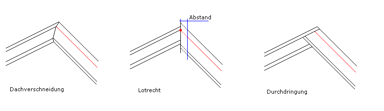
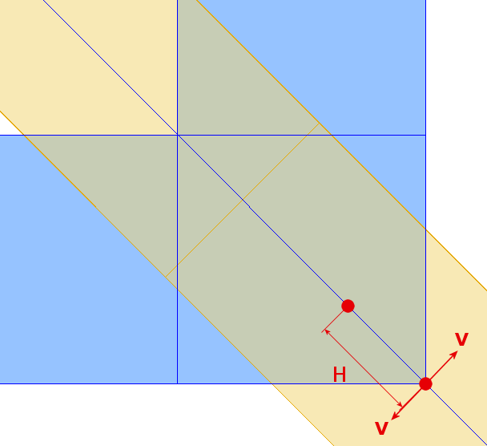
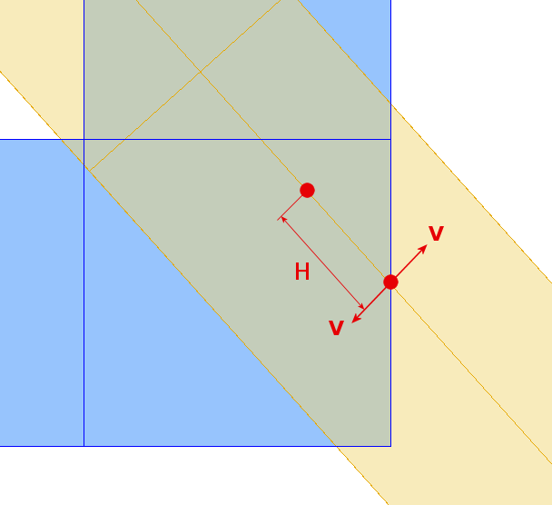
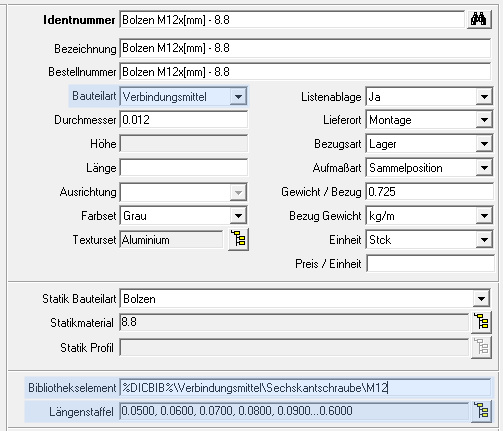
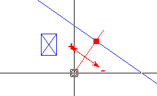
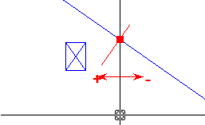
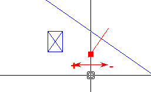
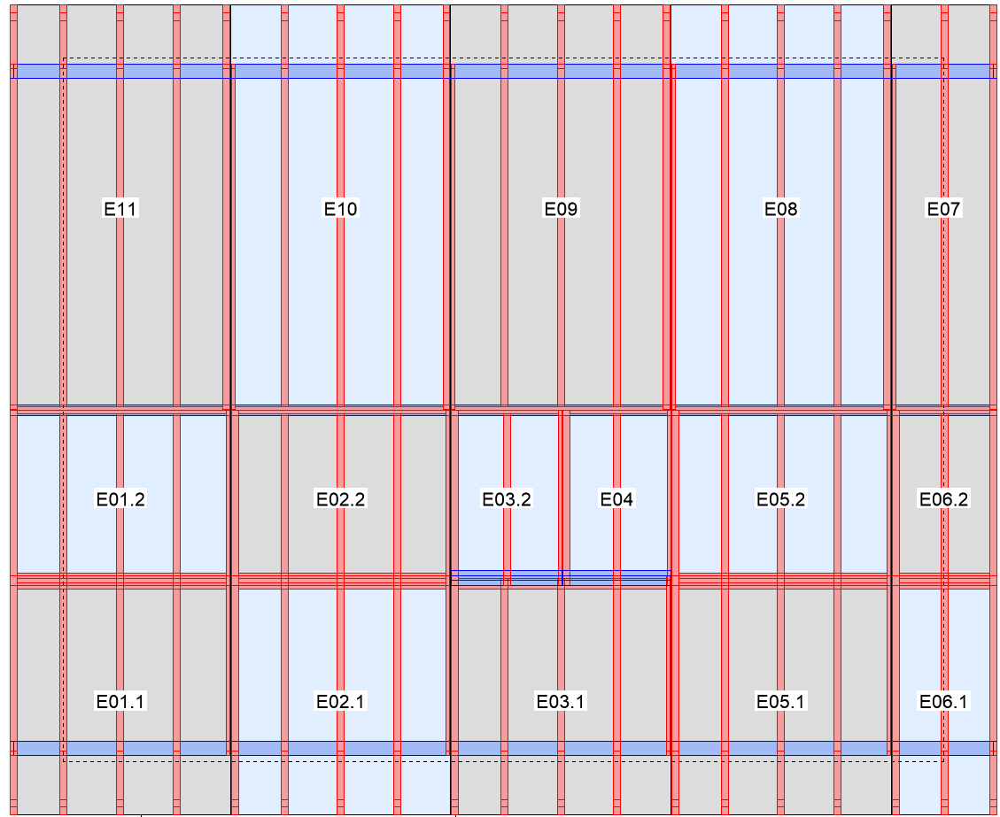

**8. Bauwerk: Dachtragwerk**

##  Bauwerk, Modellbereiche

### Bauwerke

Ein Projekt kann aus mehreren Positionen bestehen. Die Positionen \'Bauwerk\' können dabei ganze Gebäude inklusive aller Wände, Decken, Dächern und frei konstruierter Anbauten enthalten. Sie können aber auch aus nur einem Dach, einer Wand oder einer Balkenlage bestehen. Wurde nur in der \'Freien Konstruktion\' gearbeitet, kann die Bauwerks-Position eine ganze Brücke sein, oder aber auch nur ein einzelner Beschlag.

### Modellbereiche

Im Bauwerk sind alle Bereiche eines Gebäudes und die Freie Konstruktion in einem Modell vereinigt. Jedes Bauteil, z.B. der Pfosten einer Wand, hat alle Möglichkeiten eines Bauteiles der Freien Konstruktion. Mit jedem Bauteil alles machen zu können ist ein großer Vorteil, jedoch arbeitet man nur dann effektiv, wenn die Eingaben auf die spezielle Situation des Bauteiles zugeschnitten sind. Warum soll man für den Pfosten einer Wand 3-dimensionale Koordinaten eingeben, wenn doch ein Pfosten immer senkrecht in einer Wand steht und parallel zu deren Außenflächen ist; es genügt doch, in der Wand ein Längsmaß einzugeben. Diese speziellen Eingabemöglichkeiten sind in den Modellbereichen zusammengefasst.

In der aktuellen Version sind folgende Modellbereiche verfügbar:

**Grundriss**: Zur Eingabe der Wände, Fenster und Türen im Grundriss.

**Wandkonstruktion**: Stäbe und Platten können in die Wände eingegeben werden. Die Lagenkonturen der Wände können angepasst werden.

**Deckenfeld**: Deckenebenen können, wahlweise durch Übernahme einer Grundrisskontur, in verschiedenen Stockwerken definiert und mit Ausführungen versehen werden

**Deckenkonstruktion**: In Deckenfeldern können konstruktive Deckenbauteile und Deckenbeplankungen erstellt und im Detail bearbeitet werden

**Dachausmittlung**: Hier kann zunächst eine Hauskontur, wahlweise aus der Übernahme eines Grundrisses, erzeugt werden. An die Kontur werden die Dachattribute gehängt und das Dach damit ausgemittelt.

**Dachtragwerk**: In den Dachflächen kann man das Dachtragwerk eingeben und im Detail bearbeiten.

**Gaube**: Im Modellbereich \'Gaube\' werden Gauben ausgemittelt und das Gaubentragwerk eingegeben. Außerdem können die Hauptdachöffnungen und Gaubenwände eingegeben werden.

**Stabwerkskonstruktion**: In der Stabwerkskonstruktion können Stabwerke über vertikale und ggf. auch freie Ebenen eingegeben werden. Dieser Modellbereich ist besonders für Binder, Konsolen, Pfosten unter beliebigen Hölzern und ähnliches geeignet.

**Freie Konstruktion**: DICAM: Erstellung neuer Bauteile oder Weiterbearbeitung der Bauteile, die in den anderen Modellbereichen erzeugt wurden. Hier sind besonders flexible Eingaben möglich

Jedes Bauwerk wird wieder in dem Modellbereich geöffnet, den man zuletzt in diesem Bauwerk bearbeitet hat. Wir gehen davon aus, dass die allermeisten Bauwerke mindestens einen Grundriss haben, und dass die Eingabe mit diesem beginnt.

Zwischen den Modellbereichen wechselt man mit den Funktionen im Menü \'Datei Operationen - Modellbereich\'.

### Dateioperationen

Im Menü \'Datei - Modelle\' sind die Dateioperationen für das ganze Bauwerk. Unabhängig von dem Modellbereich in dem eine solche Funktion (speichern, speichern als) ausgelöst wird, betrifft sie immer das ganze Bauwerk.

Die Funktionen \'Datei - Modelle - Auslagern\' und \' .. - Einfügen\' sind nur im Modellbereich \'DICAM: Freie Konstruktion\' verfügbar. Es können nur Bauteile der Freien Konstruktion ausgelagert und eingefügt werden.

## Messfunktionen

Die Messfunktionen von DICAM können Sie jederzeit über das Hilfsmenü aufrufen.\
Das Hilfsmenü erhalten Sie, indem Sie in einer Dialogbox den Messen Schalter wählen. Wenn keine Dialogbox geöffnet ist, können Sie das Hilfsmenü auch aufrufen, indem Sie die mittlere Maustaste drücken oder die Shift-Taste gedrückt halten und die rechte Maustaste drücken. Damit, bei einer Maus mit drei Taste, die mittlere Taste richtig reagiert, müssen Sie diese Taste in der Konfigurationssoftware Ihrer Maus auch als mittlere Taste einstellen.

Umfangreichere Informationen zu den Messfunktionen erhalten Sie in der allgemeinen Hilfe. Diese rufen sie in jedem Modellbereich im Hilfemenü auf.

## Arbeitsumgebung

Die Arbeitsumgebungen sind im Handbuch \'Hilfe allgemein\', das über das Hilfe-Menü aufgerufen werden kann.

## Dachtragwerk

### Datei - Extras - Schwerpunkte

Mit dieser Funktion kann der Schwerpunkt von Dachflächen oder Dachelementen bestimmt werden. Je nachdem ob man das Dach elementiert hat oder nicht, werden automatisch die Schwerpunkte der einzelnen Elemente oder der Dachflächen bestimmt.

Nach der Auswahl dieser Funktion öffnet sich eine Dialogbox. Hier stellt man ein, ob man die Schwerpunkte aller Dächer oder nur die der aktuellen Dachfläche berechnen lassen möchte. Bei der Option \'aktuelle Dachfläche\' muss man allerdings vorher mit der Funktion \'Dachfläche - Dachflächenwahl\' eine Dachfläche ausgewählt haben.

Mit der Einstellung \'berücksichtigte Ebenen\' kann man die Ebenen angeben, die bei der Berechnung berücksichtigt werden sollen. Dies ist zum Beispiel dafür gedacht, dass man alle Ebenen inklusive Konterlattung, Lattung und Ziegel eingegeben hat, bei der Montage der Elemente aber nicht alle Ebenen verwendet, da ein Teil der Ebenen erst nachträglich auf der Baustelle montiert werden. Wenn man nur bestimmte Ebenen berücksichtigen will, so gibt man deren Ebenennummer, getrennt durch einen Schrägstrich (/) ein. Wenn alle Ebenen berücksichtigt werden sollen, lässt man das Feld leer.

Nach der Berechnung findet man Kreise mit Kreuzen darin in jedem Element oder jeder Dachfläche. Dies sind die Schwerpunkte. Wenn diese Schwerpunkte nicht sichtbar sind, kann das daran liegen, dass Sie in der Darstellungsschaltung (Datei - Einstellung - Darstellung) die \'Aufmaßelemente\' ausgeschaltet haben.

Die Schwerpunkte werden im Dachelementplan dargestellt. Außerdem wird in der Legende des Dachelementplans das Gewicht des Dachelements und die berücksichtigten Ebenen angegeben.

### Datei - Einstellungen

#### Datei - Einstellungen - Darstellung

Die Dialogbox teilt sich in mehrere Einstellungsbereiche:

**Darstellung Bauteile:** Mit dieser Liste stellt man die Ebenen ein, deren Bauteile man sehen möchte. Sparren können zum Beispiel in unterschiedlichen Lagen eingegeben worden sein. Sie bekommen dann automatisch die Ebenennummer zugewiesen wie die Nummer der Lage in der sie eingegeben wurden.

**Dach**: Die Einstellungen für die Darstellung der Dachelemente betreffen automatisch alle vorhandenen Dächer. Die angezeigten Elemente können für die Darstellung ein- und ausgeschaltet werden.

**Lattung, Ziegeleindeckung:** Hier stellt man die ob und in welcher Form die Ziegel und Dachlatten angezeigt werden sollen.

**Lagenkonturen / Flächenbereiche**: Hier stellt man ein, für welche Lage und in welcher Form die Flächenbereiche angezeigt werden sollen.

**Stockwerk**: In der Liste kann ausgewählt werden, welche Stockwerke angezeigt werden sollen. Darunter wird für diese Stockwerke eingestellt, welche Elemente der Wände und Decken angezeigt werden sollen.

**Freie Konstruktion**: In diesem Bereich der Dialogbox können die Bauteile und die Hilfsgeometrie (Hilfslinien) aus der Freien Konstruktion und die Kamine ein- und ausgeschaltet werden.

**Bearbeitungen**: Die Bearbeitungen, die in Linienform dargestellt werden, können hier gesondert ein- und ausgeschaltet werden.

Alle Einstellungen für die Darstellung betreffen nur den Modellbereich Dachtragwerk.

#### Datei -- Einstellungen -- Iconleiste

In dieser Funktion lassen sich die auf dem Bildschirm unterhalb der Menüzeile dargestellten Symbolleisten schalten und die darin enthaltenen Befehle bearbeiten. Außerdem lassen sich mit der Funktion \'Neu\' alle im Modellbereich vorhandenen Befehle in eigenen Symbolleisten zusammenstellen. Die Standardsymbolleisten, wie Sie nach der Installation des Programms angezeigt werden, enthalten alle Standardbefehle der einzelnen Modellbereiche.

Eine neue Symbolleiste enthält keine Befehle. Über \'Funktion\' im Feld \'Hinzufügen\' wird der Funktionsrecorder gestartet, mit dem der gewünschte Befehl aus den Menüs abgegriffen wird und der automatisch das entsprechende Schaltflächensymbol in die Symbolleiste einfügt. Jeder neue Befehl wird an das Ende der gewählten Symbolleiste zugefügt und kann mit den Schaltern \'\<\'/\'\>\' in der Symbolleiste bewegt werden. Zum Entfernen eines Befehles aus der Symbolleiste wird zuerst der gewünschte Befehl gewählt und dann mit \'Entfernen\' gelöscht.

Jede einzelne Symbolleiste hat, abhängig von ihrer aktuellen Position auf dem Bildschirm, am linken oder oberen Anfang einen Griff. Durch Klick auf diesen Griff kann, mit gedrückter Maustaste (i.d.R. linke Maustaste), jede Symbolleiste frei an den Bildschirmrändern platziert werden.

#### Datei - Einstellungen - Grenzwerte, Bearbeitungen

Für die Tragwerkseingabe gibt es einige Grenzwerte und Einstellungen, welche das Erzeugen der Stäbe selbst und der Bearbeitungen beeinflussen:

**Luftspalt am First:** Sobald ein Sparren, Schifter oder Grat- Kehlsparren an einer Firstlinie endet, wird der \'Luftspalt am First\' berücksichtigt. Der betroffene Stab wird dann um den halben Luftspalt senkrecht zur Firstlinie verkürzt.

**Minimale Holzlänge mit vollem Querschnitt:** Ein Stab muss die hier eingestellt Mindestlänge mit vollem Querschnitt haben, damit er überhaupt erzeugt wird. Betrachtet wird hier aber nur der Bereich mit vollem Querschnitt. Das heißt, der Stab kann tatsächlich viel länger sein. Auf Grund seiner Bearbeitungen wird aber ein Teil der Stablänge nicht berücksichtigt. Diese Überprüfung kann man mit dem Wert \'0.000\' deaktivieren.

[]{#Maximale_Verlängerung_für_Anschließen .anchor}**Maximale Verlängerung für Anschließen:** Wenn die eingegebenen Stäbe an andere Stäbe angeschlossen sind (z.B. Wechselholz an Sparren), passen sie sich automatisch in der Länge an, wenn der Anschlussstab verschoben oder gelöscht wird (z.B. Sparren wird etwas verschoben, Wechsel verlängert sich automatisch). Damit sich die Stäbe nicht bis ins Unendliche verlängern (z.B. Sparren wurde ganz gelöscht und der nächste Sparren ist weiter entfernt oder existiert nicht), gibt es diesen Grenzwert. Wenn die Entfernung zum nächsten Anschlussstab geringer ist als der hier eingegebene Grenzwert, passt sich der betroffene Stab automatisch in der Länge an. Sonst behält er seine Länge und schließt sich nicht an.

**Minimale Tiefe Ausblattung:** Die Pfetten enthalten die Information, ob sie eine Kerve oder evtl. eine Ausblattung in den Sparren erzeugen. Wenn eine Ausblattung erzeugt werden soll geschieht dies aber nur dann, wenn die Ausblattung mindestens so tief ist, wie hier eingestellt. Sonst wird keine Ausblattung, sondern eine Kerve erzeugt. Mit dem Wert \'0.000\' wird mit der Option \'evtl. Ausblattung\' immer eine Ausblattung erzeugt.

**Minimale Kerventiefe:** Kerven, die nicht mindestens so tief sind, wie hier eingestellt, werden nicht erzeugt. Dies ist vor allem bei ganz geringen Eindringtiefen von 1mm bis maximal 2mm interessant. Diese Kerven sollen möglicherweise nicht erzeugt werden, da sie in der Praxis keine Bedeutung haben (der Stab ist meistens sowieso etwas schwächer).

**Durchmesser Sparrennagelbohrung:** Beim automatischen Erzeugen von Kerven werden auch automatisch die entsprechenden Sparrennagelbohrungen erzeugt. Dabei wird der hier eingestellte Bohrungsdurchmesser verwendet.

### Datei - Import - DXF-Linien

Mit dieser Funktion können 2D-DXF-Zeichnungen eingelesen werden. Sie können so als Eingabehilfe für die Hauskontur genutzt werden. Die DXF-Zeichnung kann beim Einfügen frei positioniert werden. Wenn man vor dem Einlesen ein FKS (Freies Koordinatensystem) eingestellt hat, kann man die DXF-Zeichnung noch einfacher positionieren und drehen.

Nach der Auswahl der einzulesenden DXF-Datei kann man einen Einlesefaktor eingeben. Die Einheit, in der die DXF-Datei erzeugt wurde (z.B. Zentimeter) muss nicht unbedingt mit der Einheit in der Grundrisseingabe übereinstimmen (z.B. Meter). Damit die DXF-Datei trotzdem in der richtigen Größe eingelesen wird, kann man den notwendigen Einlesefaktor eingeben (in unserem Beispiel: 0.01). Da man nicht immer die Einheit kennt, in der die DXF-Datei erzeugt wurde, gibt das Programm die Maximalabmessungen der DXF-Zeichnung in X-, Y- und Z-Richtung an.

In der danach erscheinenden Dialogbox wählt man den Punkt der DXF-Zeichnung, der positioniert werden soll. Danach kann man diesen Punkt in der Grundrisseingabe platzieren.

### Dachfläche

#### Dachflächenwahl

Mit der Funktion \'Dachflächenwahl\' kann man eine einzelne Dachfläche grafisch auswählen. Diese Dachfläche wird dann so gedreht, dass die Traufe parallel zur unteren Bildschirmkante liegt. Außerdem wird diese Dachfläche so weit herangezoomt, dass sie bildschirmfüllend zu sehen ist.

Diese Darstellungsform ist ideal für die Holzeingabe bei schrägen oder aufwendig geformten Dachflächen.

#### Ganzes Dach

Mit der Funktion \'Ganzes Dach\' wird die Darstellung, die man mit \'Dachflächenwahl\' erzeugt hat, wieder rückgängig gemacht. Man sieht dann wieder das ganze Dach in seiner ursprünglichen Ausrichtung.

### Bretter / Schalung / Beplankung

#### Stellbretter manuell

Mit der Auswahlliste am oberen Rand der Dialogbox kann man bestehende Einstellungen auswählen. Mit dem Icon mit Diskette kann man die aktuelle Einstellung mit demselben Namen oder einem neuen Namen speichern. Über das Verwaltungsicon können neue Einstellungen, auch durch Übernahme bestehender Einstellungen erzeugt werden, bestehende Einstellungen geändert oder gelöscht werden. Siehe dazu \'Einstellungen speichern\' im Handbuch \'Hilfe Allgemein\'.

Mit der Funktion \'Stellbretter manuell\' gibt man Stellbretter über die manuelle Wahl einer Bezugslinie ein. Folgende Angaben können für die Eingabe der Stellbretter gemacht werden:

**Identnummer:** Mit der Identnummer wird das Material der Stellbretter bestimmt. Über den Schalter am Ende des Feldes kann man in die Datenbank verzweigen und ein Material auswählen.

**Abstand von Bezugslinie:** Mit diesem Wert wird der Abstand der Stellbretter von der später gewählten Bezugslinie festgelegt werden. Dabei spielt die im nächsten Feld gewählte Positionierseite eine Rolle.

**Positionierseite des Stellbretts:** Mit der Positionierseite gibt man an, ob das Stellbrett von der Bezugslinie aus nach hinten (Vorderseite) oder nach vorne (Rückseite) fällt. Gleichzeitig hat dies Auswirkung auf die \"Verschneidung\" der Stellbretter mit der Oberkante der Lage. Die Bretter werden immer so eingebaut, dass Sie auf der Positionierseite mit der Oberkante der Lage abschließen. Dadurch werden Stellbretter, die mit der Rückseite positioniert werden, abgegratet.

**Winkel der Stellbretter:** Die Stellbretter können mit einem beliebigen Winkel eingebaut werden. Zur einfacheren Eingabe werden auch die Optionen \'lotrecht\', \'winkelrecht\' und waagerecht\' angeboten.

**Stellbrettdicke:** Dicke der Stellbretter.

**Stellbretthöhe:** Die Höhe der Stellbretter kann mit einem festen Wert eingegeben werden. Zusätzlich kann man die Höhe, passend zu einer Sparrenhöhe, berechnen lassen.

**Lage:** Lage, in der die Stellbretter eingebaut werden sollen.

**Abstand von OK-Lage:** Die Stellbretter müssen nicht zwingend an der Oberkante der gewählten Lage beginnen. Über diesen Wert kann man einen Abstand zur Oberkante dieser Lage eingeben.

**Sparrenhöhe:** Wenn die Höhe der Stellbretter berechnet werden soll, gibt man hier die Sparrenhöhe ein, für welche die Stellbretthöhe berechnet werden soll.

**Nuttiefe in Sparren:** Für den seitlichen Anschluss der Stellbretter in die Sparren gibt man hier die gewünschte Nuttiefe ein.

**Luft in der Nuttiefe:** Mit diesem Wert wird das Stellbrett wieder etwas verkürzt, sodass Luft in der Nut entsteht. Die Nut wird dadurch nicht tiefer, diese behält die oben eingestellte Tiefe.

**Schräge Anschlüsse:** Wenn Stellbretter schräg an einen anderen Stab anschließen (Schrägsparren, Grat- Kehlsparren, usw.) bekommen diese Anschlussstäbe keine Nut (Ausblattung). Entweder würden die Stellbretter nur teilweise in der Nut stecken oder die Nut wäre zu tief. Daher kann man auswählen, ob die Stellbretter nur schräg an die Seitenfläche des Anschlussstabes angeschnitten werden, oder ob im Anschlussstab eine Kerve (Freikerve) erzeugt werden soll. Die Kerve wird dann automatisch so erzeugt, dass die volle Stellbrettbreite gerade in der Kerve liegt.

Nach der Eingabe aller Werte und Einstellungen in der Dialogbox wählt man die Dachfläche, die Bezugslinie und über 2 Punkte den Bereich, in dem die Stellbretter erzeugt werden sollen.

#### Platten -- Eingabe

Mit der Platteneingabe können manuell Platten in den verschiedenen Lagen einer Dachfläche eingegeben werden. Diese Eingabe ist dann interessant, wenn Massivholzplatten eingegeben werden sollen oder die automatische Platten- und Beplankungsfunktion aus Modellbereich \'Dachausmittlung\' nicht zum gewünschten Ergebnis kommt.

Es werden eine aufbauorientierte Eingabe und eine lagenorientierte Eingabe unterschieden. Bei der aufbauorientierten Eingabe wird auch die Kantenabwicklung der betroffenen Lagen berücksichtigt. Das heißt, die erzeugte Platte übernimmt die Abschnittswinkel der Lage(n) in der die Platte erzeugt wurde. Für beide Eingabearten stehen im unteren Teil der Dialogbox verschiedene Optionen zur Verfügung. Diese werden im weiteren Verlauf genauer erklärt.

Nach der Wahl der Funktion wählt man die Dachfläche, auf der die Platten eingegeben werden sollen. Jetzt wechselt das Programm automatisch in die Einzeldachfläche und stellt die Dachfläche so am Bildschirm dar, dass die Traufe am unteren Bildrand liegt. Es öffnet sich eine Dialogbox mit folgenden Optionen:

Mit der Auswahlliste am oberen Rand der Dialogbox kann man bestehende Einstellungen auswählen. Mit dem Icon mit Diskette kann man die aktuelle Einstellung mit demselben Namen oder einem neuen Namen speichern. Über das Verwaltungsicon können neue Einstellungen, auch durch Übernahme bestehender Einstellungen erzeugt werden, bestehende Einstellungen geändert oder gelöscht werden. Siehe dazu \'Einstellungen speichern\' im Handbuch \'Hilfe Allgemein\'.

**Identnummer**: Für die Platte kann die Identnummer eingegeben, oder mit dem Browser aus dem Bauteilkatalog gewählt werden. Weitere Bedeutung gemäß Kapitel \'Volumeninformationen, Bauteilkatalog\'.

**Stabart**: Die \'Stabart\' stellt eine Liste von Bezeichnungen dar, mit der man die Bauteile bezeichnen kann. Hier kann man wahlweise eine Stabartnummer eingeben, die man schon kennt, oder man wählt eine Stabartnummer über den Browserbutton am rechten Ende des Feldes. Sobald man hier eine Nummer ausgewählt hat wird automatisch im nächsten Feld die dazugehörige Bezeichnung angezeigt.

**Bezeichnung**: Die Bezeichnung erlaubt es die Funktion eines einzelnen Bauteiles zu beschreiben. Die vordefinierten Bezeichnungen, die sogenannten Stabarten, können über einen Nummernschlüssel im Feld links neben der Bezeichnung aufgerufen werden. Hat man dies getan bekommt man im Feld \'Bezeichnung\' automatisch eine Bezeichnung vorgegeben. Diese kann man aber manuell ändern und so beliebige eigene Bezeichnungen verwenden.

> Wenn man eine bestimmte Bezeichnung häufiger benötigt, kann man diese über den Browserbutton rechts neben dem Bezeichnungsfeld eingeben. Mit diesem Icon öffnet sich eine Liste bestehender Bezeichnungen. Die eigene Bezeichnung kann man am Ende der Liste eingeben. Beim nächsten Aufrufen der Liste wird die neue Bezeichnung dann alphabetisch einsortiert. Sobald man im Feld \'Bezeichnung\' anfängt die Bezeichnung einzutippen, öffnet sich automatisch die Liste und zeigt nur die Bezeichnungen, die mit den eingegebenen Buchstaben beginnt.

**Dicke, Breite, Länge**: Hier werden die Abmessungen der Platte eingegeben. Wenn man oben eine Identnummer wählt, bei der schon eine oder mehrere Abmessungen vorgegeben sind, werden die entsprechenden Felder der Abmessung deaktiviert und es wird der entsprechende Wert aus der Datenbank angezeigt.

**Verlegewinkel**: Der Winkel zwischen Längsachse der Wand und Längsachse der Platte wird hier eingestellt. Soll die Platte senkrecht stehen, muss man daher 90° eingeben.

**Vorderseite der Platte nach**: Bei Platten mit unterschiedlichen Seiten (z.B. unterschiedliche Qualitäten auf Vorder- und Rückseite) kann man angeben, auf welche Seite der Wand die Vorderseite der Platte zeigen soll. Dabei wird die gute (qualitativ höher wertigere) Seite der Platte als Vorderseite betrachtet.

**Luft in Breite, Luft in Länge**: Es kann ein Abstand zwischen den Platten in Richtung ihrer Breite bzw. Länge eingegeben werden. Bei der Eingabe der Platte hat der Mauscursor dann einen entsprechenden Abstand zum Positionierpunkt.

**Lage**: Es wird festgelegt, auf welche Lage sich die Tiefenposition bezieht. Um eine Platte mittig in die Lage 1 zu legen, muss nicht eine Tiefenposition berechnet werden, die sich auf die ganze Dachflächendicke bezieht. Es wird nur die Lage 1 bestimmt und in der Tiefenposition die Option \'mittig\' eingestellt.

> Die Platte muss nicht zwingend exakt mit der Ober- und Unterseite bündig in einer Lage liegen. Die Platte kann in der Tiefe verschoben sein oder mehrere Lagen durchdringen. Es ist aber hilfreich, wenn die Platte sowohl mit ihrer Oberseite als auch ihrer Unterseite bündig mit einer Lage abschließt.
>
> Die hier gewählte Lage bestimmt auch gleichzeitig die \'Gruppe\' zu der das Bauteil zugeordnet wird. So gehört eine Platte, die in der Lage -1 eingegeben wurde automatisch zur Gruppe -1. Über die Gruppen (Funktion \'Datei -- Einstellungen -- Darstellung) kann man die Bauteile ein- und ausschalten.

**Tiefenposition**: Für die Tiefenposition beziehen wir uns immer auf die Lage, die im vorherigen Feld gewählt wurde. Es gibt die automatischen Funktionen mittig, vorne- und hinten bündig, welche die Platte bequem in die richtige Tiefe bringen. Für Sonderfälle kann man mit der Option \'Wert\' auch einen definierten Abstand von der Vorderseite der Lage (Sichtseite) zur Vorderseite der Platte angeben.

**Positionierpunkt**: Als Positionierpunkte können 6 verschiedene Punkte an der Plattenansicht oder die Funktion \'Wahl\' gewählt werden.\
Mit der Funktion \'Wahl\' wird die Platte zuerst mit dem zuletzt verwendeten Positionierpunkt platziert und danach kann man mit der rechten Maustaste die 6 Positionierpunkte durchklicken. Mit der linken Maustaste wird dann die gewünschte Position ausgewählt.

Bis hierhin sind die Eingaben für alle Platten gleich, egal welche Eingabeart man im Folgenden wählt. Die weiteren Optionen sind abhängig vom nächsten Feld der Dialogbox:

**Art der Plattenbildung:** Die Art der Plattenbildung hat Einfluss auf den Rest der Dialogbox und die Art wie die Platen in der Lage erzeugt werden:

> **Lagenorientiert:** Diese Art entspricht weitgehend der Platteneingabe wie sie auch in der Wandkonstruktion und der Decke existiert. Die Plattenkanten werden rechtwinklig abgeschnitten und die Platten werden von den Lagenkanten der Lagenpolygone begrenzt, die im Feld oben gewählt wurden. Zusätzlich werden die Dachbereiche (gibt es in der Wand nicht) und ggf. die Elementgrenzen berücksichtigt. Außerdem kann man Einstellungen machen, wie man sie aus der automatischen Beplankungsfunktion kennt. (Siehe nächste Felder)
>
> **Aufbauorientiert:** Diese Art der Platteneingabe gibt es bisher in keinem anderen Modellbereich und stellt besondere Optionen zur Verfügung, wie sie zum Beispiel für Massivholzplatten oder die amerikanischen SIP-Platten im Dachbereich benötigt werden.
>
> Die Platten bekommen das Kantenprofil der Lage(n) in denen sie eingebaut werden. Das können auch mehrere Winkel an einer Plattenkante sein (z.B. Lot-Waage-Schnitt an der Traufe). Außerdem kann man besondere Einstellungen für Dachlinien machen, an denen sich zwei Dachflächen verschneiden (First, Grat und Kehle)

**[Lagenorientiert:]{.underline}**

**Erzeugen in Dachbereichen:** Wenn man die Art \'Lagenorientiert\' gewählt hat, kann man angeben, in welchen Dachbereichen (Vordachbereich, ausgebauter Bereich, nicht ausgebauter Bereich) die Platten erzeugt werden sollen. Dazu muss man aber vorher in der Dachausmittlung die Vordachbereiche berechnet haben. Bei der Eingabe der Platten werden die Konturen der Dachbereiche eingeblendet.

> Je nachdem welche Dachbereiche man ausgewählt werden die Platten an den entsprechenden Dachbereichsgrenzen automatisch abgeschnitten. Wie die Platten verschnitten werden wird auch mit den nächsten zwei Feldern beeinflusst.

**Abschluss A:** Hier wird eingestellt, ob die einzelnen Platten an ihrem Ende entlang der jeweiligen Begrenzung oder auf ihrer längsten Länge rechtwinklig abgeschnitten werden.

**An Bereichsgrenzen schneiden G:** Dies Einstellung betrifft nur die Teile der Platten, die an horizontale Bereichsgrenzen stoßen. In einigen Fällen muss die einzelne Platte dann entsprechend der Grenze ausgeschnitten werden; sie endet dann genau an der Grenze. In anderen Fällen, z.B. oftmals bei Aufdachdämmung, soll die Platte ganz bleiben.

**[Aufbauorientiert:]{.underline}**

Für die drei Linienarten \'Firstlinie\', \'Gratlinie\' und \'Kehllinie\' kann man getrennte Einstellungen machen, welche die Bildung der Lagenpolygone für die Platteneingabe beeinflussen. In der jeweiligen Dropliste kann man drei verschiedene Optionen wählen:

**Dachverschneidung:** Bei dieser Option bleiben die Lagenkonturen so, wie sie aus der Dachausmittlung kommen. Je nach der Anzahl und Dicke der Lagen, die sich an der einzelnen Dachlinie treffen kann diese Verschneidung unterschiedlich aussehen. Diese Verschneidungsregeln kommen aber so aus der Dachausmittlung und lassen sich nicht weiter verändern. Aus diesem Grund sind auch die beiden folgenden Felder deaktiviert und haben keine Bedeutung.

**Lotrecht:** Die Lagen die sich an der jeweiligen First-, Grat- oder Kehllinie treffen werden einfach lotrecht abgeschnitten. Dadurch können Versätze zwischen den Lagen der beiden Dachflächen entstehen. Wählt man diese Option kann man unten noch einen Abstand eingeben.

**Durchdringung:** Mit dieser Option kann man die Lagenkanten so verschieben, dass sie die Lagen der angrenzenden Dachfläche durchdringen und bis an eine einzustellende Lage \"laufen\".



**Von unten bis gegen Lage:** Diese Einstellung steht nur bei der Option \'Durchdringung\' zur Verfügung. Mit dieser Einstellung gibt man an bis zu welcher Lage der anschließenden Dachfläche die neue Platte gehen soll. Die Platte schließt automatisch an die hier eingestellte Lage an.

**Abstand im Grund:** Diese Einstellung steht nur bei der Option \'Lotrecht\' zur Verfügung. Man kann damit die Lagenkontur zusätzlich um das hier eingestellte Maß verschieben.

Während der Platzierung von Platten im Dach gibt es ein paar Besonderheiten. Da bei einer wahren Ansicht der Dachflächen (Blick senkrecht auf die Dachfläche) die Wände, Decken und anderen Bauteile in einer sehr ungünstigen Position dargestellt werden würden, bleiben wir bei einer Ansicht senkrecht auf das ganze Dach (senkrecht auf global XoY). Das hat zur Folge, dass eine einzugebende Platte durch die unterschiedlichen Abschnittswinkel an den Kanten eigentlich mit mehreren Linien gezeichnet werden müssten und in den Ecken liegen mehrere Punkt sehr dicht zusammen. Das macht die Sache sehr unübersichtlich und man weiß oft nicht, welche Kante bzw. welchen Punkt man für die Platzierung wählen muss.

Aus diesem Grund wird bei der Platzierung einer Platte ein Schnitt durch diese Platte gelegt und nur exakt diese Schnittebene dargestellt. Die Schnittebene der Platte besteht dadurch nur aus einem Polygon, das man leicht platzieren kann. Die Platte kann tatsächlich größer sein, je nachdem welche Abschnittswinkel sie hat. Die Schnittebene für die Platte wird durch die gewählte Lage und die Tiefenposition der Platte in der Lage bestimmt.

#### Bauteile -- Platten - Löschen

Mit dieser Funktion werden ausschließlich Platten gelöscht, Stäbe werden ignoriert.

### Bauteile - Dachassistent

#### Einleitung

Der Dachassistent erzeugt nach bestimmten Regeln Hölzer auf den Dachflächen, die bei der Belegung ausgewählt werden. So kann man auf Knopfdruck das ganze Dach mit Holz belegen. Der Grad der Automatisierung kann dabei sehr hochgetrieben werden, indem man die zu verwendende Vorlaufdatei schon in der Dachflächenausführung hinterlegt.

Die Informationen, wie die Hölzer erzeugt werden sollen, werden in Vorlaufdateien gespeichert. Diese Vorlaufdateien werden den einzelnen Dachflächen zugewiesen. Dabei kann jede Dachfläche mit einer anderen Vorlaufdatei belegt werden oder alle Dachflächen werden mit derselben Datei belegt. Diese Zuweisung erfolgt direkt bei der Belegung oder schon vorher, indem man die Dateien den Dachflächenausführungen zuweist.

Das Prinzip des Dachassistenten ist einfach und effektiv. Durch das Prinzip stehen alle Möglichkeiten der manuellen Eingabe der Hölzer automatisch zur Verfügung: In den Dialogboxen der manuellen Holzeingabe (Pfetten - Grat- Kehlsparren, Sparren, Zangen) kann man die Einstellungen speichern. Dazu klickt man am oberen Rand der Dialogbox auf das Icon mit der Diskette und gibt dann den gewünschten Namen ein. Diese Einstellung findet man dann in der Einstelldialogbox des Dachassistenten wieder und kann sie auswählen. In der Vorlaufdatei des Dachassistenten werden aber nicht nur die Namen der gewählten Einstellungen gespeichert, sondern auch alle Einstellwerte selbst. So kann man eine Einstellung in der manuellen Holzeingabe löschen und die Vorlaufdatei des Dachassistenten funktioniert immer noch.

#### Dachassistent - Einstellungen

##### Allgemein

In dieser Dialogbox macht man die Einstellungen, die in einer Vorlaufdatei gespeichert werden. Bei der Belegung werden die Einstellungen aus dieser Datei für die jeweiligen Dachflächen ausgeführt. Die Dialogbox besteht aus mehreren Unterdialogboxen, die über die Schalter links unten aufgerufen werden.

Mit den Droplisten in der Einstellungsdialogbox für den Dachassistent wählt man jeweils eine Einstellung, die man in der entsprechenden Dialogbox der Tragwerkseingabe gespeichert hat. Mit dem kleinen Button am rechten Ende jedes Feldes kann man in genau diese Dialogbox verzweigen. So kann man gegebenenfalls Werte abändern. Dabei ist folgendes zu berücksichtigen:

In der Vorlaufdatei wird nicht nur der Name der gewählten Einstellungen gespeichert, sondern auch alle Werte, die zu dieser Einstellung gehören. Der Vorteil dabei ist, dass eine Vorlaufdatei weiterhin funktioniert, auch wenn man ein der Einstellungen von der manuellen Tragwerkseingabe aus gelöscht hat. Wenn man mit dem Button am rechten Ende eines Feldes in die eigentliche Einstellungsdialogbox des Stabes wechselt (z.B. Schwelleneingabe) kann man dort Werte ändern. Wenn man dann diese Dialogbox mit \'Ok\' verlässt werden die Änderungen nur im Dachassistent gespeichert. Sie werden NICHT in der Einstellung des Stabes (z.B. Schwelleneingabe) gespeichert. Daher wird die Einstellung im Dachassistent dann in Klammern angezeigt werden. Wenn man die Änderungen auch in der Einstellung des Stabes selbst gespeichert haben will, klickt man in der Einstellungsdialogbox des Stabes (z.B. der Schwelleneingabe) auf das Icon mit der Diskette am rechten oberen Rand der Dialogbox.

Der rechte Teil der Dialogbox und die obere Zeile sind immer gleich:

[Einstellungen speichern:]{.underline}

Mit der oberen Zeile speichert man, wie auch in der manuellen Tragwerkseingabe, die Einstellungen in der Vorlaufdatei oder wählt eine andere Datei zum Bearbeiten aus. Mit der großen Dropliste wählt man aus der Liste der bestehenden Dateien eine andere Vorlaufdatei aus. Wenn man auf die Diskette rechts daneben klickt öffnet sich eine Dialogbox in welcher der Name vorgegeben ist, der gerade in der Dropliste eingestellt ist. Will man die Einstellungen mit diesem Namen speichert klickt man nur auf \'Ok\'. Ansonsten gibt man einen anderen Namen ein uns speichert so die Einstellungen in einer neuen Datei.

Über das Verwaltungsicon können neue Einstellungen, auch durch Übernahme bestehender Einstellungen erzeugt werden, bestehende Einstellungen geändert oder gelöscht werden. Siehe dazu \'Einstellungen speichern\' im Handbuch \'Hilfe Allgemein\'.

Mit dem Mülleimer-Icon kann man die aktuelle Datei auch wieder löschen.

Sobald man die Dialogbox mit dem Schalter \'Speichern\' verlässt, werden die aktuellen Einstellungen auch noch einmal in der oben angezeigten Datei gespeichert.

[Infobereich rechts:]{.underline}

In dem rechten Infobereich kann man wahlweise ein Hilfsbild oder die Parameter der Einstellungen anzeigen lassen. Die Parameter erscheinen, wenn man auf den Button \'Parameter\' geklickt hat und der Fokus in einer der Droplisten steht, in denen eine Einstellung (z.B. für Schwellen/Mittelpfette) sichtbar ist. Die angezeigten Parameter zeigen alle Werte der Einstellung aus der Dropliste. So kann man schnell kontrollieren, ob man die richtige Einstellung gewählt hat.

Das Bild ist hier eine Besonderheit. Da der Inhalt der Vorlaufdatei von den Einstellungen des Anwenders abhängig ist, kann das Programm kein automatisches Hilfsbild erzeugen. Hier kann jeder selber ein beliebiges Bild oder Photo einblenden lassen. Dazu klickt man auf den kleinen Button neben dem Schalter \'Bild\'. In der Dialogbox sucht man sich das gewünschte Bild aus. Mit dem Icon mit dem Mülleimer kann man das Bild auch wieder löschen. So lassen sich zum Beispiel Bilder einblenden, die man selber über die Speicherfunktion aus dem OpenGL-Bereich erzeugt hat. Wenn dafür ein repräsentatives Dach mit der Vorlaufdatei belegt hat und dann davon ein Bild im OpenGL-Bereich speichert hat man den besten Wiedererkennungswert für die Vorlaufdatei.

##### Pfetten

In dem Dialogboxbereich für die Pfetten wählt man die Einstellungen für alle Pfetten. In den ersten beiden Droplisten kann man auf die Einstellungen aus der Dialogbox \'[Pfetten aus Profil](#pfetten---pfetten-aus-profil-klassik)\' zugreifen. Dabei werden mit der ersten Dropliste nur die \"normalen\" Pfetten (Schwelle, Mittelpfette, Firstpfette) aus dem jeweiligen Profil erzeugt. Mit der zweiten Dropliste kann man ggf. auch die Koppelpfetten aus den Profilen übernehmen.

Mit den nächsten beiden Droplisten werden die Einstellungen aus der Dialogbox \'[Firstpfetten](#pfetten-firstpfetten)\' angezeigt. Hier wählt man die Einstellung für die Firstpfette, die mit der Vorlaufdatei erzeugt werden soll.

Der größte Block an Droplisten ist für die Schwellen und Mittelpfetten. Hier greift das Programm auf die gespeicherten Einstellungen der [Schwellen und Mittelpfetten](#pfetten---schwellen-mittelpfetten) zu.

##### Grat- Kehlbereich

In diesem Dialogboxbereich macht man die Einstellungen für die Grat- und Kehlsparren oder Kehlbohlen. Mit den Droplisten greift man auf die entsprechenden Einstellungsdialogboxen ([Gratsparren](#grat-kehlsparren-gratsparren), [Kehlsparren](#grat-kehlsparren-kehlsparren), [Kehlbohlen](#grat-kehlsparren-kehlbohle)) zu. Für den Kehlbereich stellt man entweder einen Kehlsparren oder eine Kehlbohle ein. Beides gleichzeitig ist nicht möglich, da dies einen Konflikt beim Erzeugen der Stäbe geben würde.

Eine Besonderheit sind die Einstellungen für die Rangfolge. Es gibt je eine Rangfolge für die Gratsparren und eine Rangfolge für den Kehlbereich. Die Grat- und Kehllinien gehören immer zu zwei Dachflächen und die Vorlaufdateien werden den Dachflächen zugeordnet. Von welcher Dachfläche soll das Programm nun die Einstellung für den Grat oder die Kehle nehmen? Hier kommt die Rangfolge in das Spiel. Das Programm nimmt immer die Vorlaufdatei mit der höheren Rangfolge (=kleinere Zahl).

Beispiel: Wir haben ein Hauptdach mit Kehllinien und darauf eine Gaube. Die Hauptdachfläche soll Kehlsparren bekommen und die Gaube aber Kehlbohlen. Die Vorlaufdatei für die Hauptdachfläche bekommt beispielsweise die Priorität \"5\" und die Einstellung für den Kehlsparren. Dann muss die Vorlaufdatei für die Gaube eine höhere Priorität bekommen, zum Beispiel die \"3\" und die Einstellung für die Kehlbohle.

##### Zangen

In der Zangeneinstellung gibt es getrennte Einstellung für die \'[Zangen aus Profil](#zangen-aus-profil-klassik)\', \'[Firstzangen](#firstlasche-firstzange)\', \'[Zangen](#zangen---zange)\' und \'[Kehlbalken](#zangen---kehlbalken)\'. Auch hier wählt man die dort gespeicherten Einstellungen aus.

Zusätzlich kann man für jede Einstellung angeben, ob die betreffenden Zangen nur im Innenbereich, nur im Vordachbereich oder in beiden Bereichen erzeugt werden sollen.

##### Fixsparren

Die Fixsparren können an verschiedenen Linien des Daches automatisch platziert werden. Die dabei entstehenden Felder können dann mit den Aufteilsparren aufgeteilt werden.

In jeder Einstellungszeile gibt man zuerst die gewünschte [Sparreneinstellung](#sparren---sparreneingabe) an, die für den jeweiligen Fixsparren verwendet werden soll. In der nächsten Spalte gibt man an, wo der Fixsparren in der Dachfläche platziert werden soll:

**Ortgangsparren**: Die Ortgangsparren werden an den Ortganglinien der Dachfläche platziert. Dabei werden aber nur die Ortganglinien berücksichtigt, die an den äußersten Rändern der Dachfläche liegen. Sollten auch dazwischen kleine Ortganglinien, zum Beispiel durch Dachabschleppungen\' existieren, bleiben diese unberücksichtigt. Mit dem Abstandswert aus der letzten Spalte der Dialogbox kann man den Ortgangsparren um diesen Wert nach innen verschieben.

**Außenwandsparren**: Der Außenwandsparren wird an der Außenseite der Außenwände platziert, wenn man Außenwände hat und bei der Belegung ein Stockwerk ausgewählt hat. Sonst wird er auf der Außenseite der Hauskonturlinie platziert. Mit dem Abstand aus der letzten Spalte der Dialogbox kann man den Außenwandsparren um das angegebene Maß nach außen verschieben.

**Blindsparren**: Der Blindsparren wird an der Innenseite der Außenwände platziert, wenn man Außenwände hat und bei der Belegung ein Stockwerk ausgewählt hat. Sonst wird er auf der Innenseite der Hauskonturlinie platziert. Mit dem Abstand aus der letzten Spalte der Dialogbox kann der Blindsparren um das angegebene Maß nach innen verschoben werden.

**Anfallssparren**: Der Anfallssparren dient zum Erzeugen von Anfallsgebinden bei Gratsparren bzw. Gratanfallspunkten. Der Anfallssparren wird an jedem Gratanfallspunkt platziert und kann mit dem Abstand aus der letzten Spalte der Dialogbox um das angegebene Maß vom Anfallspunkt weggeschoben werden.

Mit den Checkboxen am rechten Ende aller Zeilen kann man angeben, ob der jeweilige Fixsparren bei der Aufteilung berücksichtigt werden soll oder nicht. Wenn der Haken gesetzt wurde, wird dieser Sparren nicht berücksichtigt, so als ob er nicht existieren würde. Alle anderen Fixsparren werden bei der Aufteilung der Dachfläche berücksichtigt. Das bedeutet, dass jeder Fixsparren die Begrenzung für ein Feld darstellt.

**[Tipp:]{.underline}**

Wenn man vor der Belegung einer Dachfläche manuelle Sparren eingibt, können auch diese Sparren als Fixsparren berücksichtigt werden. Dazu stellt man bei der Belegung im Feld \'Bauteile ersetzen\' die Option \'aus Dachassistent\' oder \'Keine\' ein. Damit werden die manuell erzeugten Sparren nicht gelöscht und werden ebenfalls als Fixsparren berücksichtigt.

An schrägen Ortgängen kann man automatisch einen oder mehrere Schrägsparren einbauen lassen. Dazu stellt man im unteren Bereich der Dialogbox die gewünschte Einstellung für [Schrägsparren](#sparren---schräge-sparren) ein. Auch hier kann ein Abstand eingeben werden, der den Schrägsparren vom Ortgang wegschiebt.

##### Aufteilsparren

Bei den Aufteilsparren gibt es zwei Einstellungen. Einmal die Aufteilsparren für den Vordachbereich und einmal für den Innenbereich. Für beide Bereiche wählt man zuerst die gewünschte [Sparreneinstellung](#sparren---sparreneingabe) und dann stellt man die [Aufteilregeln](#sparren---aufteilen) ein. Im Unterschied zu den sonstigen Aufteileinstellungen gibt es nicht das Feld \'Stäbe im Restfeld\'. Da die aufzuteilenden Felder so unterschiedlich sind (sein können) ist die Eingabe einer Stabanzahl wenig sinnvoll.

#### Dachassistent - Belegung

Bei der Belegung der Dachflächen mit dem Dachassistent kann man noch verschiedene Einstellungen machen:

**Vorlaufdatei**: In der ersten Zeile stellt man ein, mit welcher Datei die Dachflächen belegt werden sollen. Wenn man die Vorlaufdateien schon vorher in den Dachflächenausführungen eingestellt hat, wählt man hier die Option \'aus Dachfläche\'. In diesem Fall kann jede Dachfläche in einem Durchgang mit einer anderen Datei belegt werden. Alternativ kann man in diesem Feld aber auch eine bestimmte Vorlaufdatei auswählen. Dann werden alle Dachflächen, die man später für die Belegung auswählt, mit dieser Datei belegt. Der Namen dieser Vorlaufdatei wird dann auch automatisch in der Dachflächenausführung eingetragen. Bei der nächsten Belegung kann man dann auch die Option \'aus Dachfläche\' verwenden.

**Bauteile ersetzen**: In diesem Feld kann man einstellen, ob vor der Belegung der Dachflächen existierende Stäbe (Sparren, Pfetten, usw.) gelöscht werden sollen. Hierfür gibt es drei Optionen:

> **Keine**: Mit dieser Option werden keine Stäbe gelöscht. Damit lassen sich Dachflächen mehrfach belegen, ohne dass die Stäbe der vorherigen Belegung gelöscht werden. So lassen sich zum Beispiel auch Sparren für die Aufdachdämmung erzeugen, ohne die Sparren und Pfetten in der Lage 0 zu löschen.
>
> **Alle**: Die Option \'Alle\' löscht vor der Belegung alle Stäbe unabhängig davon, wie sie entstanden waren.
>
> **Aus Dachassistent**: Diese Option löscht vor der Belegung alle Stäbe, die über den Dachassistenten entstanden waren. Manuell eingegebene Stäbe bleiben dabei enthalten.

**Stockwerk für Vordach-, Blindsparren, Zangen**: Hier werden alle Stockwerke der aktuellen Position angezeigt. Wenn man keine Wände hat, gibt es nur die Option \'Hauskontur\'. Diese Option wird für die Positionierung der Vordachsparren, Blindsparren und Zangen benötigt.

**Welche Stabarten sollen berechnet werden**: Mit den Checkboxen gibt man an, welche Stabarten mit dem Dachassistent berechnet werden sollen. Da der Dachassistent auch mehr verwendet werden kann, kann man so unterschiedliche Einstellungen für die verschiedenen Stabarten verwenden.

**Alle Dachflächen**: Alle Dachflächen des aktuellen Bauwerkes werden ausgewählt und belegt.

**Hauskontur**: Alle Dachflächen der nachfolgend ausgewählten Hauskonturen werden belegt.

**Dachflächen**: Anschließend können die gewünschten Dachflächen einzeln angewählt werden. Auch dabei können jedoch mehrere gleichzeitig belegt werden.

### Bauteile

#### Einstellungen Bearbeitungen

In vielen Situationen werden an den Enden der eingegebenen Stäbe automatisch bestimmte Anschlüsse oder Stabendbearbeitungen erzeugt. Welche Anschlüsse oder Bearbeitungen erzeugt werden sollen und wie diese aussehen, kann man in diesem Menübereich eingeben. Es stehen folgende Kopfbearbeitungen und Anschlüsse zur Verfügung:

**Anschneiden:** Mit Anschneiden schließen die Stäbe so an die Anschlussstäbe an, dass sie sich an deren Form anpassen. Dabei können stumpfe Anschlüsse aber auch Kerven oder Freikerven entstehen.

**Abschnitt:** Die Stäbe bekommen einen Abschnitt mit dem eingestellten Abschnittswinkel.

**2** **Abschnitte:** Die Stäbe bekommen 2 Abschnitte. Der erste Abschnitt wird über den Abschnittswinkel und die Länge der Stirnfläche bestimmt. Die Länge der Stirnfläche kann alternativ zu einem absoluten Wert über eine Prozentangabe eingegeben werden. Diese bezieht sich auf die Höhe des jeweiligen Stabes. Dadurch kann die tatsächliche Höhe der Stirnfläche unterschiedlich sein. Der 2. Abschnitt kann über einen Winkel, die Länge in der Neigung und die Länge im Grund bestimmt werden. Geben Sie den Wert ein, der verwendet werden soll. Der alte Wert wird automatisch gelöscht.

**Konkaves Profil:** Die Stäbe bekommen ein konkaves Kopfprofil. Dabei können alle Werte alternativ über eine Prozentangabe eingegeben werden. Diese bezieht sich auf die Höhe des jeweiligen Stabes. Dadurch kann die tatsächliche Abmessung des betroffenen Wertes bei unterschiedlichen Stäben unterschiedlich sein.

**Konvexes Profil:** Die Stäbe bekommen ein konvexes Kopfprofil. Dabei können alle Werte alternativ über eine Prozentangabe eingegeben werden. Diese bezieht sich auf die Höhe des jeweiligen Stabes. Dadurch kann die tatsächliche Abmessung des betroffenen Wertes bei unterschiedlichen Stäben unterschiedlich sein.

**Zapfen:** Anschluss mit einem durchgehenden Zapfen. Für den Anschluss an das Stabende eines Anschlussstabes kann ein Absatzzuschlag eingestellt werden. Dieser wird automatisch nur dann berücksichtigt, wenn der angeschlossene Stab am Stabende eines anderen Stabes anschließen.

**A****bgesetzter Zapfen:** Bei dem abgesetzten Zapfen können zusätzlich zum durchgehenden Zapfen zwei Absetzmaße eingegeben werden.

**Zapfen mit Bohrung:** Zusätzlich zu den Einstellmöglichkeiten des abgesetzten Zapfens gibt es hier verschiedene Optionen für die Bohrungen. Man kann die Zapfen mit einem oder zwei Bohrungen versehen. Die Position der Bohrungen ist davon abhängig, ob man eine oder zwei Bohrungen eingibt. Eine Bohrung kann automatisch so platziert werden, dass sie mittig zum Zapfen oder auf der Achse des Stabes liegt. Zwei Bohrungen können über einen Wert (Randabstand) platziert werden oder ihre Position wird gleichmäßig über den Zapfen verteilt (dritteln). Die Bohrung im Zapfenloch kann gegenüber der Bohrung im Zapfen versetzt werden (Bohrungsversatz). Mit der Versenktiefe kann der ganze Stab mit dem Zapfen um das eingegebene Maß in den Stab mit dem Zapfenloch versenkt werden.

**Schwalbenschwanzzapfen:** Die Breite des Schwalbenschwanzzapfens sollte auf das verwendete Werkzeug abgestimmt sein. Dasselbe gilt für den Flankenwinkel. Der Rückschnitt verkürzt nicht den Zapfen sondern vertieft das Schwalbenschwanzzapfenloch.

**Versatz:** Die Versätze können in unterschiedlichen Formen erstellt werden. Zu einfacheren Auswahl wurden die Nummern der Stirnversätze aus der Dropliste im Hilfsbild eingefügt.

**Versatz mit Zapfen:** Der Stirnversatz mit Zapfen kombiniert die Einstellmöglichkeiten des Zapfens mit denen des Versatzes.

**Firstblatt:** Bei sehr flachen Dachneigungen kann es interessant sein, das Firstblatt zu verkürzen. Dafür kann man einen Grenzwinkel und einen Winkel für die Blattverkürzung eingeben. Wenn der Grenzwinkel G kleiner als der angegebene Wert wird, wird das Firstblatt automatisch auf den eingegebenen Winkel W verkürzt.

**Zierbund:** Der Zierbund ist eine besondere Überblattungsart. Die Blattdicke kann wahlweise halbierend oder über einen festen Wert eingestellt werden. Der feste Wert gilt für den Stab, dessen Ende angeschlossen wird. Der Zierbund kann wahlweise auch mit einer oder zwei Bohrungen versehen werden. Zwei Bohrungen können über einen Wert (Randabstand) platziert werden oder ihre Position wird gleichmäßig über den Zapfen verteilt (dritteln).

#### Pfetten -- Pfetten aus Profil

Mit der Funktion \'Pfetten aus Profil\' kann man die Pfetten aus dem Profil übernehmen.

Mit der Auswahlliste am oberen Rand der Dialogbox kann man bestehende Einstellungen auswählen. Mit dem Icon mit Diskette kann man die aktuelle Einstellung mit demselben Namen oder einem neuen Namen speichern. Über das Verwaltungsicon können neue Einstellungen, auch durch Übernahme bestehender Einstellungen erzeugt werden, bestehende Einstellungen geändert oder gelöscht werden. Siehe dazu \'Einstellungen speichern\' im Handbuch \'Hilfe Allgemein\'.

**Pfettenrichtung:** Mit der Option \'Pfettenrichtung\' gibt man an, an welchem Ende der Pfette der Pfettenanfang und an welchem das Pfettenende liegt. Dazu wird die Dachfläche von der Traufe aus betrachtet. Diese Information ist dann wichtig, wenn man auf dem Sparren-Pfetten-Plan die Stabnummern an den Stabanfang schreibt und man die Position der Nummer beeinflussen will.

Außerdem hat diese Einstellung Auswirkung auf die Übergabe der Pfetten auf die Maschine: Zwei gegenüberliegende Pfetten auf einem Satteldach werden beide mit dem Anfang links (Links -\> Rechts) eingegeben. Die Sparren liegen mit verschiedenen Abständen auf einer Dachfläche und wurden so auf die andere Dachfläche übernommen. Von den Sparren werden Markierungen auf den Pfetten erzeugt. Dadurch sind beide Pfetten nach der Sortierung unterschiedlich und werden getrennt auf die Maschine übergeben. Wenn die eine Pfette den Anfang links und die gegenüberliegende Pfette den Anfang rechts hat, haben die Markierungen auf den Pfetten den selben Abstand zum jeweiligen Stabanfang. Daher sind beide Pfetten identisch und bekommen die selbe Nummer bei der Sortierung.

Nach der Einstellung aller Werte und Optionen kann man die Pfetten über folgende Schalter eingeben:

**Alle Dachflächen:** Auf allen Dachflächen, an denen ein Profil hängt, werden alle Pfetten aus dem jeweiligen Profil erzeugt. Wenn an einer Dachfläche mehrere Profile hängen (bei Versätzen im Grundriss möglich), fragt das Programm, welches Profil verwendet werden soll.

**Durchgehend:** Auf der grafisch angewählten Dachfläche werden alle Pfetten aus dem Profil erzeugt, welches an der Hausseite dieser Dachfläche hängt. Wenn an dieser Dachfläche mehrere Profile hängen (bei Versätzen im Grundriss möglich), fragt das Programm, welches Profil verwendet werden soll.

**Längenbegrenzt:** Über zwei Punkte kann die Länge und Position der Pfetten eingegeben werden. Der erste eingegebene Punkt bestimmt gleichzeitig die Dachfläche auf der die Pfette erzeugt werden soll. Der Punkt in der Mitte zwischen beiden gewählten Punkten bestimmt zusätzlich den Punkt auf der Hauskontur, von wo das Profil genommen werden soll.

#### Pfetten - Pfetten aus Profil Klassik

Wenn man die Dachausmittlung mit Profilen aus dem alten Profilprogramm erstellt hat, kann man die Pfetten aus den Profilen direkt auf die entsprechenden Hausseiten übernehmen. Man muss nur noch die Zusatzinformationen eingeben, die das Programm aus dem Profil nicht bekommt:

Mit der Auswahlliste am oberen Rand der Dialogbox kann man bestehende Einstellungen auswählen. Mit dem Icon mit Diskette kann man die aktuelle Einstellung mit demselben Namen oder einem neuen Namen speichern. Über das Verwaltungsicon können neue Einstellungen, auch durch Übernahme bestehender Einstellungen erzeugt werden, bestehende Einstellungen geändert oder gelöscht werden. Siehe dazu \'Einstellungen speichern\' im Handbuch \'Hilfe Allgemein\'.

**Identnummer:** Mit der Identnummer wird das Material der Pfetten bestimmt. Über den Schalter am Ende des Feldes kann man in die Datenbank verzweigen und ein Material auswählen.

**Pfettenrichtung:** Mit der Option \'Pfettenrichtung\' gibt man an, an welchem Ende der Pfette der Pfettenanfang und an welchem das Pfettenende liegt. Dazu wird die Dachfläche von der Traufe aus betrachtet. Diese Information ist dann wichtig, wenn man auf dem Sparren-Pfetten-Plan die Stabnummern an den Stabanfang schreibt und man die Position der Nummer beeinflussen will.

Außerdem hat diese Einstellung Auswirkung auf die Übergabe der Pfetten auf die Maschine: Zwei gegenüberliegende Pfetten auf einem Satteldach werden beide mit dem Anfang links (Links -\> Rechts) eingegeben. Die Sparren liegen mit verschiedenen Abständen auf einer Dachfläche und wurden so auf die andere Dachfläche übernommen. Von den Sparren werden Markierungen auf den Pfetten erzeugt. Dadurch sind beide Pfetten nach der Sortierung unterschiedlich und werden getrennt auf die Maschine übergeben. Wenn die eine Pfette den Anfang links und die gegenüberliegende Pfette den Anfang rechts hat, haben die Markierungen auf den Pfetten den selben Abstand zum jeweiligen Stabanfang. Daher sind beide Pfetten identisch und bekommen die selbe Nummer bei der Sortierung.

**Verbindung Sparren zu Pfette:** In diesem Feld gibt es vier Einstellungen:

> **Keine:** Es wird keine Verbindung hergestellt, beide Stäbe durchdringen sich.
>
> **immer Kerven:** Die Sparren bekommen bei einer Durchdringung mit dieser Pfette immer eine Kerve, auch dann wenn die Hinterkante der Pfette in den Sparren eindringt.
>
> **evtl. Ausblattung:** Die Sparren bekommen bei einer Durchdringung mit dieser Pfette eine Kerve, solange die Hinterkante der Pfette nicht in den Sparren eindringt. Sobald die Hinterkante der Pfette aber in den Sparren eindringt, wird eine Ausblattung im Sparren erzeugt. Dabei wird aber zusätzlich der Grenzwert \'[Maximale Verlängerung für Anschließen](#Maximale_Verlängerung_für_Anschließen)\' berücksichtigt. Solange die Blatttiefe geringer ist als der hier eingestellte Grenzwert kann wird das Blatt trotzdem nicht erzeugt. Es erscheint weiterhin eine Kerve.
>
> **Blatt in Pfette:** Mit dieser Option wird im Sparren keine Kerve und keine Ausblattung erzeugt. Stattdessen bekommt die Pfette eine Ausblattung (Freiblatt).

**Verbind. Pfettenende zu Grat- Kehlsparren**: Sobald eine Pfette mit dem Stabende einen Grat- oder Kehlsparren (oder Kehlbohle) berührt, wird die hier eingestellte Verbindung erzeugt. Die meisten Optionen dürften dabei selbsterklärend sein und ihre Parameter können über den Schalter am rechten Ende des Feldes eingestellt werden.

Die Optionen \'immer Kerven\' und \'evtl. Ausblattung\' gelten, wenn die Pfette nicht voll auf die Seitenfläche des Grat- oder Kehlsparrens trifft (wie für die anderen Optionen notwendig), sondern sie nur teilweise durchdringt. Die Verbindung ist dieselbe wie in \'Verbindung Sparren zu Pfette\' beschrieben. Die Option \'Blatt in Pfette\' erzeugt auch hier ein Freiblatt in der Pfette.

**Verbindung Pfette an Pfette**: Mit dieser Verbindung können Pfetten, die sich unter einem Grat- oder Kehlsparren treffen, automatisch miteinander verbunden werden. Es stehen zwei Verbindungen zur Verfügung mit je mehreren Optionen zur Verfügung. Wenn beide Pfetten, die sich unter dem Grat- oder Kehlsparren treffen, unterschiedliche Verbindungen bekommen haben, wird keine Verbindung hergestellt.

> **Abschnitt**: Für die Verbindung \'Abschnitt\' gibt es zwei Optionen. Mit \'durchgehend\' wird jede der beiden Pfetten einfach lotrecht abgeschnitten. Bei einer Kehllinie wird die Pfette dabei so lang erzeugt, dass die Hinterkante der Pfette genau an der Kehllinie endet. Bei einer Gratlinie wird die Pfette dagegen so lang erzeugt, dass die Vorderkante der Pfette an der Gratlinie endet. Mit der Option \'winkelhalbierend\' werden beide Pfetten winkelhalbierend zusammengeschnitten.
>
> **Endblatt**: Mit der Verbindung \'Endblatt\' werden beide Pfetten mit einem Endblatt verbunden. Das Endblatt kann nach unterschiedlichen Kriterien erzeugt werden. Mit den Optionen dieser Verbindung kann man festlegen, welche der beiden Pfetten oben ausgeblattet werden soll.

**Verkürzung am Ortgang:** Sobald eine Pfette bei der Eingabe am Ortgang endet, wird sie mit dem hier eingegeben Wert verkürzt. Mit negativen Werten bekommt man eine Verlängerung der Pfetten.

**Kopfbearbeitung am Ortgang:** Sobald eine Pfette bei der Eingabe an einem Ortgang endet, wird die hier eingestellte Bearbeitung an dieses Pfettenende gehängt. Mit welchen Parametern die gewählte Bearbeitung ausgeführt wird, kann man über den Schalter am rechten Ende des Feldes sehen und auch ändern.

**Verkürzung der übrigen Pfettenenden:** Sobald eine Pfette bei der Eingabe an einer anderen Dachlinie als Ortgang endet, wird sie mit dem hier eingegeben Wert verkürzt. Mit negativen Werten bekommt man eine Verlängerung der Pfetten.

Nach der Einstellung aller Werte und Optionen kann man die Pfetten über folgende Schalter eingeben:

**Alle Dachflächen:** Auf allen Dachflächen, an denen ein Profil hängt, werden alle Pfetten aus dem jeweiligen Profil erzeugt. Wenn an einer Dachfläche mehrere Profile hängen (bei Versätzen im Grundriss möglich), fragt das Programm, welches Profil verwendet werden soll.

**Durchgehend:** Auf der grafisch angewählten Dachfläche werden alle Pfetten aus dem Profil erzeugt, welches an der Hausseite dieser Dachfläche hängt. Wenn an dieser Dachfläche mehrere Profile hängen (bei Versätzen im Grundriss möglich), fragt das Programm, welches Profil verwendet werden soll.

**Längenbegrenzt:** Über zwei Punkte kann die Länge und Position der Pfetten eingegeben werden. Der erste eingegebene Punkt bestimmt gleichzeitig die Dachfläche auf der die Pfette erzeugt werden soll. Der Punkt in der Mitte zwischen beiden gewählten Punkten bestimmt zusätzlich den Punkt auf der Hauskontur, von wo das Profil genommen werden soll.

#### Pfetten - Schwellen / Mittelpfetten

Mit der Funktion \'Schwellen / Mittelpfetten\' kann man unterschiedliche Pfettentypen eingeben. Die Wahl des Pfettentyps erfolgt im Feld \'Bezeichnung\'. Abhängig vom gewählten Pfettentyp ändert sich stellenweise die Beschriftung in der Dialogbox.

Mit der Auswahlliste am oberen Rand der Dialogbox kann man bestehende Einstellungen auswählen. Mit dem Icon mit Diskette kann man die aktuelle Einstellung mit demselben Namen oder einem neuen Namen speichern. Über das Verwaltungsicon können neue Einstellungen, auch durch Übernahme bestehender Einstellungen erzeugt werden, bestehende Einstellungen geändert oder gelöscht werden. Siehe dazu \'Einstellungen speichern\' im Handbuch \'Hilfe Allgemein\'.

**Identnummer:** Mit der Identnummer wird das Material der Pfetten bestimmt. Über den Schalter am Ende des Feldes kann man in die Datenbank verzweigen und ein Material auswählen.

**Bezeichnung:** Über die Bezeichnung wählt man gleichzeitig einen bestimmten Pfettentyp. Abhängig von diesem Pfettentyp kann man die Pfetten unterschiedlich positionieren. Dazu ändern die Felder in der Dialogbox teilweise ihre Bedeutung und Beschriftung. So werden die abgegrateten Pfetten nicht über ein Obholz, sondern über die Abgratungsbreite und einen Luftspalt positioniert. Für die verkanteten Pfetten kann der Drehwinkel eingegeben werden.

**Breite:** Breite der Pfette.

**Höhe:** Höhe der Pfette.

**Lage:** Lage, auf deren Oberkante sich das Obholz bezieht. In der Regel ist dies die Lage 0, in der auch die Sparren liegen. Wenn man Koppelpfetten eingeben will hat man über der Lage 0 wahrscheinlich eine Lage, die so dick ist, wie die Koppelpfetten hoch sind. Dann wählt man hier diese Lage und gibt ein Obholz von 0.000 ein.

**Zu positionierende Pfettenkante:** Es kann jede der 4 Kanten einer Pfette positioniert werden. Die gewählte Kante wird dann bei den Werten \'Abstand im Grund\' und \'Höhe Oberkante/Unterkante Pfette\' berücksichtigt. Das Obholz dagegen bezieht sich immer auf die vordere, obere Kante, egal welche Kante hier ausgewählt wurde.

**Querschnitt drehen:** Das Feld \'Querschnitt drehen\' ist nur aktiv, wenn man eine verkantete Pfette im Feld \'Bezeichnung\' gewählt hat. Mit der Option \'Dachneigung\' bekommt die Pfette immer die passende Drehung für die Dachneigung der Dachfläche, auf der die Pfette eingegeben wird (z.B. für Koppelpfetten). Mit \'Wert\' kann aber auch ein beliebiger Drehwinkel eingegeben werden.

**Obholztyp rechtw. / lotrecht** oder **Abgratungsbreite:** Dieses Feld ändert seine Bedeutung, abhängig vom gewählten Pfettentyp. Bei abgegrateten Pfetten kann hier die Abgratungsbreite eingegeben werden. Bei allen anderen Pfettentypen wird hier der Obholztyp eingestellt.

**Obholz bezogen auf Lage** oder **Abstand von Oberkante Lage:** Dieses Feld ändert seine Bedeutung, abhängig vom gewählten Pfettentyp. Bei abgegrateten Pfetten kann hier der Abstand zur Oberkante der gewählten Lage eingegeben werden. Bei allen anderen Pfettentypen wird hier das zum Obholztyp passende Obholz eingegeben. Dieses Feld ist mit den nächsten beiden verknüpft. Man kann immer nur zwei der drei Felder eingeben, das Dritte wird berechnet. Um das deaktivierte Feld ein zu geben, löscht man den Inhalt eines der beiden anderen Felder.

**Höhe Oberkante/Unterkante Pfette:** Je nach gewählter Pfettenkante für die Positionierung kann man hier die Höhe der Oberkante oder der Unterkante eingeben. Dieses Feld ist mit dem nächsten und vorherigen Feld verknüpft. Man kann immer nur zwei der drei Felder eingeben, das Dritte wird berechnet. Um das deaktivierte Feld ein zu geben, löscht man den Inhalt eines der beiden anderen Felder.

**Abstand im Grund:** Je nach gewählter Pfettenkante für die Positionierung kann man hier den Abstand im Grund von Bezugskante aus dem nächste Feld zur vorderen oder hinteren Pfettenkante eingeben. Dieses Feld ist mit den beiden vorherigen Feldern verknüpft. Man kann immer nur zwei der drei Felder eingeben, das Dritte wird berechnet. Um das deaktivierte Feld ein zu geben, löscht man den Inhalt eines der beiden anderen Felder.

**Bezug für Abstand im Grund:** Wenn man den Abstand im Grund eingibt, kann man hier die Bezugslinie für den Abstand wählen. Die \'Wandaußenkante\' und die \'Referenzachse\' kann nur dann verwendet werden, wenn man auch tatsächlich Wände im Grundriss eingegeben hat. Mit der Option \'Wahl\' kann man später bei der Platzierung eine beliebige Linie auswählen.

**Pfettenrichtung:** Mit der Option \'Pfettenrichtung\' gibt man an, an welchem Ende der Pfette der Pfettenanfang und an welchem das Pfettenende liegt. Dazu wird die Dachfläche von der Traufe aus betrachtet. Diese Information ist dann wichtig, wenn man auf dem Sparren-Pfetten-Plan die Stabnummern an den Stabanfang schreibt und man die Position der Nummer beeinflussen will.

Außerdem hat diese Einstellung Auswirkung auf die Übergabe der Pfetten auf die Maschine: Zwei gegenüberliegende Pfetten auf einem Satteldach werden beide mit dem Anfang links (Links -\> Rechts) eingegeben. Die Sparren liegen mit verschiedenen Abständen auf einer Dachfläche und wurden so auf die andere Dachfläche übernommen. Von den Sparren werden Markierungen auf den Pfetten erzeugt. Dadurch sind beide Pfetten nach der Sortierung unterschiedlich und werden getrennt auf die Maschine übergeben. Wenn die eine Pfette den Anfang links und die gegenüberliegende Pfette den Anfang rechts hat, haben die Markierungen auf den Pfetten den selben Abstand zum jeweiligen Stabanfang. Daher sind beide Pfetten identisch und bekommen die selbe Nummer bei der Sortierung.

**Verbindung Sparren zu Pfette:** In diesem Feld gibt es sechs Einstellungen:

> **Keine:** Es wird keine Verbindung hergestellt, beide Stäbe durchdringen sich.
>
> **immer Kerven:** Die Sparren bekommen bei einer Durchdringung mit dieser Pfette immer eine Kerve, auch dann, wenn die Hinterkante der Pfette in den Sparren eindringt.
>
> **immer Kerven (Platten vor Pfette berücksichtigen):** Die Sparren bekommen ebenfalls bei einer Durchdringung mit dieser Pfette immer eine Kerve, auch wenn die Hinterkante der Pfette in den Sparren eindringt. Zusätzlich sucht das Programm nach Platten vor der Pfette. Werden Platten vor der Pfette gefunden, wird die Kerve um die Plattendicke vergrößert. Die Platten müssen senkrecht auf der globalen XoY-Ebene stehen und müssen parallel zur vorderen Pfettenfläche liegen. Die Platte muss die vordere Pfettenfläche berühren und die OK der Platte kann bündig oder maximal 20mm unter der OK Pfette enden. Die Platte kann in DICAM oder der Wand erzeugt worden sein.\
> Seit der Version V19.01 werden auch Platten auf der Rückseite der Pfette berücksichtigt und die Kerve entsprechend tiefer erzeugt.
>
> **evtl. Ausblattung:** Die Sparren bekommen bei einer Durchdringung mit dieser Pfette eine Kerve, solange die Hinterkante der Pfette nicht in den Sparren eindringt. Sobald die Hinterkante der Pfette aber in den Sparren eindringt, wird eine Ausblattung im Sparren erzeugt. Dabei wird aber zusätzlich der Grenzwert \'[Minimale Tiefe Ausblattung](#Maximale_Verlängerung_für_Anschließen)\' berücksichtigt. Solange die Blatttiefe geringer ist als der hier eingestellte Grenzwert kann wird das Blatt trotzdem nicht erzeugt. Es erscheint weiterhin eine Kerve.
>
> **evtl. Ausblattung (Platten vor Pfette berücksichtigen):** Die Sparren bekommen bei einer Durchdringung mit dieser Pfette eine Kerve, solange die Hinterkante der Pfette nicht in den Sparren eindringt. Sobald die Hinterkante der Pfette aber in den Sparren eindringt, wird eine Ausblattung im Sparren erzeugt. Dabei wird aber zusätzlich der Grenzwert \'[Minimale Tiefe Ausblattung](#Maximale_Verlängerung_für_Anschließen)\' berücksichtigt. Solange die Blatttiefe geringer ist als der hier eingestellte Grenzwert kann wird das Blatt trotzdem nicht erzeugt. Es erscheint weiterhin eine Kerve.\
> Zusätzlich sucht das Programm nach Platten vor und hinter der Pfette. Werden Platten vor oder hinter der Pfette gefunden, wird die Kerve um die Plattendicke vergrößert. Die Platten müssen senkrecht auf der globalen XoY-Ebene stehen und müssen parallel zur vorderen Pfettenfläche liegen. Die Platte muss die vordere oder hintere Pfettenfläche berühren und die OK der Platte kann bündig oder maximal 20mm unter der OK Pfette enden. Die Platte kann in DICAM oder der Wand erzeugt worden sein.\
> Seit der Version V19.01 werden auch Platten auf der Rückseite der Pfette berücksichtigt und die Kerve entsprechend tiefer erzeugt.
>
> **Blatt in Pfette:** Mit dieser Option wird im Sparren keine Kerve und keine Ausblattung erzeugt. Stattdessen bekommt die Pfette eine Ausblattung (Freiblatt).

**Verbind. Pfettenende zu Grat- Kehlsparren**: Sobald eine Pfette mit dem Stabende einen Grat- oder Kehlsparren (oder Kehlbohle) berührt, wird die hier eingestellte Verbindung erzeugt. Die meisten Optionen dürften dabei selbsterklärend sein und ihre Parameter können über den Schalter am rechten Ende des Feldes eingestellt werden.

Die Optionen \'immer Kerven\', \'immer Kerven (Platten vor Pfette berücksichtigen\', \'evtl. Ausblattung\' und \'evtl. Ausblattung (Platten vor Pfette berücksichtigen)\' gelten, wenn die Pfette nicht voll auf die Seitenfläche des Grat- oder Kehlsparrens trifft (wie für die anderen Optionen notwendig), sondern sie nur teilweise durchdringt. Die Verbindung ist dieselbe wie in \'Verbindung Sparren zu Pfette\' beschrieben. Die Option \'Blatt in Pfette\' erzeugt auch hier ein Freiblatt in der Pfette.

**Sparrennagelbohrung**: Eine Sparrennagelbohrung kann auf zwei Weisen erzeugt werden. Dies kann einfach eine Information an der Kerve sein oder es kann eine eigene Bohrung erzeugt werden. Beide Optionen haben verschiedene Eigenschaften:

> **Von Kerve**: Die Information für Die Sparrennagelbohrung hängt als Information an der Kerve wird auch so an die Maschine übergeben und dann wird die Sparrennagelbohrung von der Maschine auch als solches behandelt. Diese Sorte Sparrennagelbohrung wird im Bauwerk nicht angezeigt. Der Durchmesser dieser Sparrennagelbohrung wird unter 1-7-8 *Grenzwerte, Bearbeitungen* eingestellt.\
> Diese Sparrennagelbohrung wird an Kerven und Freikerven erzeugt.
>
> **Sparrennagelbohrung**: Unterhalb dieser Gruppe kann man eine eigene, [detaillierte Einstellung](#sparrennagelbohrung) wählen. Wird eine dieser Optionen gewählt wird die Sparrennagelbohrung nicht mehr als Information an der Kerve erzeugt, sondern es entsteht eine eigenständige Bohrung die als solche auch dargestellt wird. Außerdem kann auch der Sparrennagel als Verbindungsmittel erzeugt werden.\
> Diese Sparrennagelbohrung wird an Kerven, Freikerven (auch an Grat- und Kehlsparren), an Eckkerven und Blättern (bei sehr flachen Sparren) erzeugt.

**Verbindung Pfette an Pfette**: Mit dieser Verbindung können Pfetten, die sich unter einem Grat- oder Kehlsparren treffen, automatisch miteinander verbunden werden. Es stehen zwei Verbindungen mit je mehreren Optionen zur Verfügung. Wenn beide Pfetten, die sich unter dem Grat- oder Kehlsparren treffen, unterschiedliche Verbindungen bekommen haben, wird keine Verbindung hergestellt.

> **Abschnitt**: Für die Verbindung \'Abschnitt\' gibt es zwei Optionen. Mit \'durchgehend\' wird jede der beiden Pfetten einfach lotrecht abgeschnitten. Bei einer Kehllinie wird die Pfette dabei so lang erzeugt, dass die Hinterkante der Pfette genau an der Kehllinie endet. Bei einer Gratlinie wird die Pfette dagegen so lang erzeugt, dass die Vorderkante der Pfette an der Gratlinie endet. Mit der Option \'winkelhalbierend\' werden beide Pfetten winkelhalbierend zusammengeschnitten.
>
> **Endblatt**: Mit der Verbindung \'Endblatt\' werden beide Pfetten mit einem Endblatt verbunden. Das Endblatt kann nach unterschiedlichen Kriterien erzeugt werden. Mit den Optionen dieser Verbindung kann man festlegen, welche der beiden Pfetten oben ausgeblattet werden soll.

**Sparrendachkonstruktion**: In dieser Dropliste können Einstellungen für Sparrendachkonstruktion ausgewählt werden. Die Einstellungen können mit dem Browserbutton am rechten Rand der Liste eingestellt und gespeichert werden. Siehe dazu auch [Knaggenkonstruktionen](#knaggenkonstruktionen) und [Widerlagerkonstruktionen](#widerlagerkonstruktionen).

> Dadurch, dass diese Konstruktion an der Pfette hängt bekommt automatisch jeder Sparren, der diese Pfette berührt eine Knagge oder Widerlagerkonstruktion. Löscht man die Pfette, werden auch diese Konstruktionshölzer wieder gelöscht. Verschiebt man die Pfette verschieben sich auch die Knaggen und Widerlagerhölzer.

**Verkürzung am Ortgang**: Sobald eine Pfette bei der Eingabe am Ortgang endet, wird sie mit dem hier eingegeben Wert verkürzt. Mit negativen Werten bekommt man eine Verlängerung der Pfetten.

**Kopfbearbeitung am Ortgang:** Sobald eine Pfette bei der Eingabe an einem Ortgang endet, wird die hier eingestellte Bearbeitung an dieses Pfettenende gehängt. Mit welchen Parametern die gewählte Bearbeitung ausgeführt wird, kann man über den Schalter am rechten Ende des Feldes sehen und auch ändern.

**Verkürzung der übrigen Pfettenenden:** Sobald eine Pfette bei der Eingabe an einer anderen Dachlinie als Ortgang endet, wird sie mit dem hier eingegeben Wert verkürzt. Mit negativen Werten bekommt man eine Verlängerung der Pfetten.

Nach der Einstellung aller Werte und Optionen kann man die Pfetten über folgende Schalter eingeben:

**Alle Dachflächen:** Die eingestellte Pfette wird auf allen Dachflächen erzeugt.

**Durchgehend:** Die Pfette wird auf der oder den Dachflächen erzeugt, die grafisch ausgewählt wurden.

**Längenbegrenzt:** Über zwei Punkte kann die Länge und Position der Pfetten eingegeben werden. Der erste eingegebene Punkt bestimmt gleichzeitig die Dachfläche auf der die Pfette erzeugt werden soll.

##### Knaggenkonstruktionen

In der Pfetteneingabe kann man Einstellungen für Sparrendachkonstruktionen auswählen. Diese Einstellungen kann man über den Browserbutton am rechten Ende der Dropliste verändern oder erstellen.

Mit der Auswahlliste am oberen Rand der Dialogbox und den Icons rechts daneben können die Einstellungen mit einem beliebigen Namen gespeichert oder wieder gelöscht werden. Diese Einstellungsnamen findet man dann auch in der Dropliste der Pfetteneingabe wieder.

Je nach Einstellung des Konstruktionstyps kann man eine Knaggenkonstruktion oder eine [Widerlagerkonstruktion](#widerlagerkonstruktionen) einstellen. Für die Knaggenkonstruktion sind folgende Einstellungen möglich:

**Konstruktionstyp**: Hier wählt man, ob man eine Knaggenkonstruktion oder die Widerlagerkonstruktion einstellen möchte. Abhängig von dieser Einstellung ändern sich die nachfolgenden Felder in der Dialogbox.

**Knaggentyp**: Es gibt vier verschiedene Knaggentypen, die man an Hand des Hilfsbildes unterscheiden kann.

**Identnummer**: Mit der Identnummer wird das Material der Knaggen bestimmt. Über den Schalter am Ende des Feldes kann man in die Datenbank verzweigen und ein Material auswählen.

**Knaggenlänge**: Länge der Knagge gemessen in der Dachneigung.

**Knaggenhöhe**: Höhe der Knaggen in der Seitenansicht der Sparren.

**Knaggeneinschnitt**: Abhängig vom Knaggentyp kann man einen Knaggeneinschnitt eingeben. Dies ist das Maß, um das die Knagge in den Sparren eindringt.

**Anzahl Bohrungen**: Die Knaggen können automatisch mit dem Sparren verbohrt werden. Hier kann eine beliebige Anzahl Bohrungen eingegeben werden. Die Bohrungen werden gleichmäßig über die Länge der Knagge verteilt.

**Bohrungsdurchmesser Knagge**: Durchmesser der Bohrung in den Knaggen.

**Bohrungsdurchmesser Sparren**: Durchmesser der Bohrungen im Sparren.

**Durchmesser Versenkbohrung**: Auf der Oberseite der Sparren kann gleichzeitig eine Versenkbohrung erzeugt werden. Wenn der Durchmesser 0.000 ist wird keine Versenkbohrung erzeugt. Mit einem Durchmesser größer 0.000 wird sie erzeugt.

**Tiefe der Versenkbohrung**: Wenn die Tiefe der Versenkbohrung mit 0.000 eingegeben ist wird keine Versenkbohrung erzeugt. Mit einer Tiefe größer 0.000 wird sie erzeugt.

##### Widerlagerkonstruktionen

In der Pfetteneingabe kann man Einstellungen für Sparrendachkonstruktionen auswählen. Diese Einstellungen kann man über den Browserbutton am rechten Ende der Dropliste verändern oder erstellen.

Mit der Dropliste am oberen Rand der Dialogbox können die Einstellungen mit einem beliebigen Namen gespeichert oder wieder gelöscht werden. Diese Einstellungsnamen findet man dann auch in der Dropliste der Pfetteneingabe wieder.

Je nach Einstellung des Konstruktionstyps kann man eine [Knaggenkonstruktion](#knaggenkonstruktionen) oder eine Widerlagerkonstruktion einstellen. Für die Widerlagerkonstruktion sind folgende Einstellungen möglich:

**Konstruktionstyp**: Hier wählt man, ob man eine Knaggenkonstruktion oder die Widerlagerkonstruktion einstellen möchte. Abhängig von dieser Einstellung ändern sich die nachfolgenden Felder in der Dialogbox.

**Unterkante Pfosten an**: Hier stellt man ein, wo der Pfosten mit dem unteren Ende beginnen soll. Es gibt die Optionen \'Unterkante Pfette\', \'Oberkante Pfette\' und \'Oberkante Riegel\'. Mit der Pfette ist die Pfette gemeint, an der die Information für das Widerlager hängt.

**Identnummer Riegel**: Mit der Identnummer wird das Material des Riegels bestimmt. Über den Schalter am Ende des Feldes kann man in die Datenbank verzweigen und ein Material auswählen.

**Riegelbreite**: Breite des Riegels, gemessen senkrecht zu den Sparren.

**Riegelhöhe**: Höhe des Riegels, gemessen in der Seitenfläche der Sparren.

**Verschiebung des Riegels**: Der Riegel kann relativ zur Oberkante Pfette verschoben werden. Mit einem Wert von 0.000 liegt der Riegel bündig auf der Pfette. Schiebt man den Riegel nach unten, entsteht ein Blatt im Riegel. Je nach Anschluss von Pfosten und Riegel verkürzt oder verlängert sich der Pfosten mit der Verschiebung des Riegels.

**Identnummer Pfosten**: Mit der Identnummer wird das Material des Pfostens bestimmt. Über den Schalter am Ende des Feldes kann man in die Datenbank verzweigen und ein Material auswählen.

**Pfostenbreite**: Breite des Pfostens, gemessen senkrecht zu den Sparren.

**Pfostenhöhe**: Höhe des Pfostens, gemessen in der Seitenfläche der Sparren.

**Verschiebung des Pfostens**: Der Pfosten kann relativ zur Hinterkante Pfette verschoben werden. Mit einem Wert von 0.000 liegt der Pfosten bündig an der Hinterkante der Pfette. Schiebt man den Pfosten nach vorne, entsteht ein Blatt im Pfosten. Der Riegel verkürzt und verlängert sich automatisch mit der Verschiebung des Pfostens.

##### Sparrennagelbohrung

In diesem Dialog können detaillierte Einstellungen für Sparrennagelbohrungen erstellt werden. Diese Sparrennagelbohrungen können an Fuß- und Mittelpfetten, Firstpfetten, steigenden Pfetten, Sparren, Schrägsparren, Gratsparren und Kehlsparren eingestellt werden. Wann welche Sparrennagelbohrung erzeugt wird stellt man an den jeweiligen Bauteilen ein.

**Position der Sparrennagelbohrung quer zum Sparren**: Es gibt verschiedene Möglichkeiten, die Position quer zum Sparren zu bestimmen. Mit \'mittig\', \'links\' und \'rechts\' wird eine Sparrennagelbohrung erzeugt, die nach links oder rechts verschoben sein kann. Mit der Option \'links und rechts\' werden zwei Bohrungen erzeugt, eine nach links verschoben, die andere nach rechts.

**Seitlicher Versatz der Bohrung**: Für die Optionen \'links\', \'rechts\' und \'links und rechts\' gibt man hier das Maß der Verschiebung an. Die Verschiebung wird aus der Mitte des Sparrens heraus nach außen gemessen.\
Bei den Eckkerven wird der Abstand folgendermaßen gemessen:

>  

**Verschiebung der Bohrung nach hinten**: Die Sparrennagelbohrung kann auch nach hinten verschoben werden, damit der Nagel nicht mehr direkt auf die Pfettenkante trifft. Dies ist vor allem bei flachen Dachneigungen interessant. Der Abstand wird im Grund (globale XoY-Ebene) gemessen.\
Für die Eckkerven von Gratsparren siehe Bild oben.

**Dachneigung unter welcher die Bohrung verschoben wird**: Die Verschiebung nach hinten wird nur dann ausgeführt, wenn die Neigung des Bauteils flacher ist als der hier eingegebene Wert.

**Verbindung**: Hier wählt man die Verbindung, welche die Bohrung und gegebenenfalls den Nagel erzeugt. Als Verbindung wird die Verbindung [Verbindungen verwalten -- Einseitig begrenzt mit Richtung](#verbindungen-verwalten-einseitig-begrenzt-mit-richtung) verwendet.

#### Pfetten -- Firstpfetten

Mit der Auswahlliste am oberen Rand der Dialogbox kann man bestehende Einstellungen auswählen. Mit dem Icon mit Diskette kann man die aktuelle Einstellung mit demselben Namen oder einem neuen Namen speichern. Über das Verwaltungsicon können neue Einstellungen, auch durch Übernahme bestehender Einstellungen erzeugt werden, bestehende Einstellungen geändert oder gelöscht werden. Siehe dazu \'Einstellungen speichern\' im Handbuch \'Hilfe Allgemein\'.

**Identnummer:** Mit der Identnummer wird das Material der Pfette bestimmt. Über den Schalter am Ende des Feldes kann man in die Datenbank verzweigen und ein Material auswählen.

**Bezeichnung:** Über die Bezeichnung wählt man gleichzeitig einen bestimmten Pfettentyp. Abhängig von diesem Pfettentyp kann man die Pfetten unterschiedlich positionieren. Dazu ändern die Felder in der Dialogbox teilweise ihre Bedeutung und Beschriftung. So wird die abgegratete Pfette nicht über ein Obholz, sondern über die Abgratungsbreite und einen Luftspalt positioniert.

**Breite:** Breite der Pfette.

**Höhe:** Höhe der Pfette. Bei der \'abgegrateten Firstpfette\' kann die Höhe nach den Sparren berechnen lassen. Wenn man dafür die Option \'nach Sparren\' wählt, werden die nächsten Felder aktiviert. Dort kann man einen Rundungswert und die Schifterhöhe für beide Seiten eingeben.

**Rundung für Höhe:** Wenn man die Höhe der Firstpfette nach den Sparren berechnen lässt, kann man hier einen Rundungswert eingeben. Die berechnete Höhe wird dann auf den nächsten vollen, hier eingestellten, Wert aufgerundet. So ergibt ein Wert von \'0.02m\' immer Höhen von (cm): 10, 12, 14, 16, usw..

**Schifterhöhe Vorderseite:** Für die Berechnung \'nach Sparren\' benötigt das Programm die Schifterhöhen von der Vorderseite und der Rückseite der Firstpfette.

**Schifterhöhe Rückseite:** Für die Berechnung \'nach Sparren\' benötigt das Programm die Schifterhöhen von der Vorderseite und der Rückseite der Firstpfette.

**Lage:** Lage, auf deren Oberkante sich das Obholz bezieht. In der Regel ist dies die Lage 0, in der auch die Sparren liegen.

**Obholztyp rechtw. / lotrecht** oder **Abgratungsbreite Vorderseite:** Dieses Feld ändert seine Bedeutung, abhängig vom gewählten Pfettentyp. Bei abgegrateten Pfetten kann hier die Abgratungsbreite für die vordere Dachfläche eingegeben werden. Bei allen anderen Pfettentypen wird hier der Obholztyp für die vordere Dachfläche eingestellt.

**Obholz bezogen auf Lage** oder **Abstand von Oberkante Lage:** Dieses Feld ändert seine Bedeutung, abhängig vom gewählten Pfettentyp. Bei abgegrateten Pfetten kann hier der Abstand zur Oberkante der gewählten Lage der vorderen Dachfläche eingegeben werden. Bei allen anderen Pfettentypen wird hier das zum Obholztyp passende Obholz eingegeben.

**Obholztyp rechtw. / lotrecht** oder **Abgratungsbreite Rückseite:** Dieses Feld ändert seine Bedeutung, abhängig vom gewählten Pfettentyp. Bei abgegrateten Pfetten kann hier die Abgratungsbreite für die hintere Dachfläche eingegeben werden. Bei allen anderen Pfettentypen wird hier der Obholztyp für die hintere Dachfläche eingestellt.

**Obholz bezogen auf Lage** oder **Abstand von Oberkante Lage Rückseite:** Dieses Feld ändert seine Bedeutung, abhängig vom gewählten Pfettentyp. Bei abgegrateten Pfetten kann hier der Abstand zur Oberkante der gewählten Lage der hinteren Dachfläche eingegeben werden. Bei allen anderen Pfettentypen wird hier das zum Obholztyp passende Obholz eingegeben.

**Pfettenrichtung:** Mit der Option \'Pfettenrichtung\' gibt man an, an welchem Ende der Pfette der Pfettenanfang und an welchem das Pfettenende liegt. Dazu wird die Dachfläche von der Traufe aus betrachtet. Diese Information ist dann wichtig, wenn man auf dem Sparren-Pfetten-Plan die Stabnummern an den Stabanfang schreibt und man die Position der Nummer beeinflussen will.

**Verbindung Sparren zu Pfette:** In diesem Feld gibt es sechs Einstellungen:

> **Keine:** Es wird keine Verbindung hergestellt, beide Stäbe durchdringen sich.
>
> **immer Kerven:** Die Sparren bekommen bei einer Durchdringung mit dieser Pfette immer eine Kerve, auch dann, wenn die Hinterkante der Pfette in den Sparren eindringt.
>
> **immer Kerven (Platten vor Pfette berücksichtigen):** Die Sparren bekommen ebenfalls bei einer Durchdringung mit dieser Pfette immer eine Kerve, auch wenn die Hinterkante der Pfette in den Sparren eindringt. Zusätzlich sucht das Programm nach Platten vor der Pfette. Werden Platten vor der Pfette gefunden, wird die Kerve um die Plattendicke vergrößert. Die Platten müssen senkrecht auf der globalen XoY-Ebene stehen und müssen parallel zur vorderen Pfettenfläche liegen. Die Platte muss die vordere Pfettenfläche berühren und die OK der Platte kann bündig oder maximal 20mm unter der OK Pfette enden. Die Platte kann in DICAM oder der Wand erzeugt worden sein.
>
> **evtl. Ausblattung:** Die Sparren bekommen bei einer Durchdringung mit dieser Pfette eine Kerve, solange die Hinterkante der Pfette nicht in den Sparren eindringt. Sobald die Hinterkante der Pfette aber in den Sparren eindringt, wird eine Ausblattung im Sparren erzeugt. Dabei wird aber zusätzlich der Grenzwert \'[Minimale Tiefe Ausblattung](#Maximale_Verlängerung_für_Anschließen)\' berücksichtigt. Solange die Blatttiefe geringer ist als der hier eingestellte Grenzwert kann wird das Blatt trotzdem nicht erzeugt. Es erscheint weiterhin eine Kerve.
>
> **evtl. Ausblattung (Platten vor Pfette berücksichtigen):** Die Sparren bekommen bei einer Durchdringung mit dieser Pfette eine Kerve, solange die Hinterkante der Pfette nicht in den Sparren eindringt. Sobald die Hinterkante der Pfette aber in den Sparren eindringt, wird eine Ausblattung im Sparren erzeugt. Dabei wird aber zusätzlich der Grenzwert \'[Minimale Tiefe Ausblattung](#Maximale_Verlängerung_für_Anschließen)\' berücksichtigt. Solange die Blatttiefe geringer ist als der hier eingestellte Grenzwert kann wird das Blatt trotzdem nicht erzeugt. Es erscheint weiterhin eine Kerve.\
> Zusätzlich sucht das Programm nach Platten vor und hinter der Pfette. Werden Platten vor oder hinter der Pfette gefunden, wird die Kerve um die Plattendicke vergrößert. Die Platten müssen senkrecht auf der globalen XoY-Ebene stehen und müssen parallel zur vorderen Pfettenfläche liegen. Die Platte muss die vordere oder hintere Pfettenfläche berühren und die OK der Platte kann bündig oder maximal 20mm unter der OK Pfette enden. Die Platte kann in DICAM oder der Wand erzeugt worden sein.
>
> **Blatt in Pfette:** Mit dieser Option wird im Sparren keine Kerve und keine Ausblattung erzeugt. Stattdessen bekommt die Pfette eine Ausblattung (Freiblatt).

**Sparrennagelbohrung**: Eine Sparrennagelbohrung kann auf zwei Weisen erzeugt werden. Dies kann einfach eine Information an der Kerve sein oder es kann eine eigene Bohrung erzeugt werden. Beide Optionen haben verschiedene Eigenschaften:

> **Von Kerve**: Die Information für Die Sparrennagelbohrung hängt als Information an der Kerve wird auch so an die Maschine übergeben und dann wird die Sparrennagelbohrung von der Maschine auch als solches behandelt. Diese Sorte Sparrennagelbohrung wird im Bauwerk nicht angezeigt. Der Durchmesser dieser Sparrennagelbohrung wird unter 1-7-8 *Grenzwerte, Bearbeitungen* eingestellt.\
> Diese Sparrennagelbohrung wird an Kerven und Freikerven erzeugt.
>
> **Sparrennagelbohrung**: Unterhalb dieser Gruppe kann man eine eigene, [detaillierte Einstellung](#sparrennagelbohrung) wählen. Wird eine dieser Optionen gewählt wird die Sparrennagelbohrung nicht mehr als Information an der Kerve erzeugt sondern es entsteht eine eigenständige Bohrung die als solche auch dargestellt wird. Außerdem kann auch der Sparrennagel erzeugt werden.\
> Diese Sparrennagelbohrung wird an Kerven, Freikerven (auch an Grat- und Kehlsparren), an Eckkerven und Blättern (bei sehr flachen Sparren) erzeugt.

**Verbindung Pfette an Pfette**: Mit dieser Verbindung können Pfetten, die sich unter einem Grat- oder Kehlsparren treffen, automatisch miteinander verbunden werden. Es stehen zwei Verbindungen mit je mehreren Optionen zur Verfügung. Wenn beide Pfetten, die sich unter dem Grat- oder Kehlsparren treffen, unterschiedliche Verbindungen bekommen haben, wird keine Verbindung hergestellt.

> **Abschnitt**: Für die Verbindung \'Abschnitt\' gibt es zwei Optionen. Mit \'durchgehend\' wird jede der beiden Pfetten einfach lotrecht abgeschnitten. Bei einer Kehllinie wird die Pfette dabei so lang erzeugt, dass die Hinterkante der Pfette genau an der Kehllinie endet. Bei einer Gratlinie wird die Pfette dagegen so lang erzeugt, dass die Vorderkante der Pfette an der Gratlinie endet. Mit der Option \'winkelhalbierend\' werden beide Pfetten winkelhalbierend zusammengeschnitten.
>
> **Endblatt**: Mit der Verbindung \'Endblatt\' werden beide Pfetten mit einem Endblatt verbunden. Das Endblatt kann nach unterschiedlichen Kriterien erzeugt werden. Mit den Optionen dieser Verbindung kann man festlegen, welche der beiden Pfetten oben ausgeblattet werden soll.

**Länge an Gratlinie / Kehllinie**: Durch diese Felder wird die Länge der Pfette bestimmt. Am Beispiel der Gratlinien gelten folgende Regeln und für die Kehllinien gilt das Gleiche:

> **Bis zur Gratlinie**: Mit dieser Einstellung wird die Firstpfette erzeugt wie bisher, sie endet an den Gratlinien.
>
> **Bis Hinterkante Gratsparren**: Das Programm sucht den breiteren Gratsparren und verlängert die Pfette so weit, dass sie an der Hinterkante dieses Gratsparrens endet.
>
> **Gratsparren - bis gegenüberliegende Dachfläche**: Das Programm sucht nach der Dachfläche, durch die die Achse der Pfette durchstößt. Dann verlängert es die Pfette bis zur Oberseite der Lage 0 dieser Dachfläche und schneidet die Pfette parallel zu dieser Lage ab.
>
> **Kehlsparren -- bis gegenüberliegende Dachfläche**: das Programm sucht auch bei den Kehlsparren nach der Dachfläche, durch die die Achse der durchstößt. Dann verlängert es die Pfette bis zur Unterseite der Lage 0 dieser Dachfläche und schneidet die Pfette parallel zu dieser Lage ab.
>
> Zusätzlich gibt es hinter jeder der beiden Droplisten ein Feld, in dem man einen Wert eingeben kann. Ein positiver Wert verlängert die Pfette um diesen Wert, ein negativer Wert verkürzt die Pfette. So kann man zum Beispiel für Die Situation am Walmdach, die Pfette bis Oberseite Lage 0 der Walmfläche mit 2cm Luft erzeugen lassen.

**Verkürzung am Ortgang:** Sobald eine Pfette bei der Eingabe am Ortgang endet, wird sie mit dem hier eingegeben Wert verkürzt. Mit negativen Werten bekommt man eine Verlängerung der Pfetten.

**Kopfbearbeitung am Ortgang:** Sobald eine Pfette bei der Eingabe an einem Ortgang endet, wird die hier eingestellte Bearbeitung an dieses Pfettenende gehängt. Mit welchen Parametern die gewählte Bearbeitung ausgeführt wird, kann man über den Schalter am rechten Ende des Feldes sehen und auch ändern.

**Verlängerung der übrigen Pfettenenden:** Die Pfettenenden, die nicht an einem Ortgang liegen können hiermit verlängert (positive Werte) oder verkürzt (negative Wert) werden.

Nach der Einstellung aller Werte und Optionen kann man die Pfetten über folgende Schalter eingeben:

**Alle Firstlinien:** Die eingestellte Firstpfette wird auf allen Firstlinien erzeugt.

**Durchgehend:** Die Firstpfette wird auf der oder den Dachflächen erzeugt, die grafisch ausgewählt wurden. Wählt man zwei gegenüberliegende Dachflächen, welche an die selbe Firstlinie grenzen, wird die Firstpfette nur einmal erzeugt.

**Längenbegrenzt:** Über zwei Punkte kann die Länge und Position der Pfetten eingegeben werden. Der erste eingegebene Punkt bestimmt gleichzeitig die Dachfläche auf der die Pfette erzeugt werden soll.

#### Pfetten - Steigende Pfetten

Mit der Auswahlliste am oberen Rand der Dialogbox kann man bestehende Einstellungen auswählen. Mit dem Icon mit Diskette kann man die aktuelle Einstellung mit demselben Namen oder einem neuen Namen speichern. Über das Verwaltungsicon können neue Einstellungen, auch durch Übernahme bestehender Einstellungen erzeugt werden, bestehende Einstellungen geändert oder gelöscht werden. Siehe dazu \'Einstellungen speichern\' im Handbuch \'Hilfe Allgemein\'.

Mit der Funktion \'steigende Pfetten\' kann man Pfetten in einem beliebigen Winkel zur Fallrichtung der Dachfläche in diese Dachfläche legen. Dabei sind folgende Einstellungen möglich:

**Identnummer:** Mit der Identnummer wird das Material der Pfette bestimmt. Über den Schalter am Ende des Feldes kann man in die Datenbank verzweigen und ein Material auswählen.

**Bezeichnung, Stabart:** Über die Bezeichnung wählt man gleichzeitig einen bestimmten Pfettentyp. Abhängig von diesem Pfettentyp kann man die Pfetten unterschiedlich positionieren. Dazu ändern die Felder in der Dialogbox teilweise ihre Bedeutung und Beschriftung. So werden die abgegrateten Pfetten nicht über ein Obholz, sondern über die Abgratungsbreite und einen Luftspalt positioniert. Für die verkanteten Pfetten kann der Drehwinkel eingegeben werden.

**Breite:** Breite der Pfette.

**Höhe:** Höhe der Pfette.

**Lage:** Lage, auf deren Oberkante sich das Obholz bezieht. In der Regel ist dies die Lage 0, in der auch die Sparren liegen.

**Zu positionierende Pfettenkante:** Es kann jede der 4 Kanten einer Pfette positioniert werden. Bei der abgegrateten und normalen Pfette spielt dabei nur die Vorderseite und Rückseite eine Rolle. Bei der verkanteten Pfette können alle 4 Kanten positioniert werden. Das Obholz dagegen bezieht sich immer auf die vordere, obere Kante, egal welche Kante hier ausgewählt wurde.

**Obholztyp rechtw. / lotrecht** oder **Abgratungsbreite:** Dieses Feld ändert seine Bedeutung, abhängig vom gewählten Pfettentyp. Bei abgegrateten Pfetten kann hier die Abgratungsbreite eingegeben werden. Bei allen anderen Pfettentypen wird hier der Obholztyp eingestellt.

> Zusätzlich gibt es die Option \'Höhe\'. Sobald man diesen Wert wählt deaktiviert sich das nächste Feld \'Obholz\', da es keine Bedeutung mehr hat. Bei der Eingabe der steigenden Pfette kann man dann für jedes Pfettenende einen Höhenpunkt wählen, dessen Wert manuell noch angepasst werden kann.

**Obholz bezogen auf Lage** oder **Abstand von Oberkante Lage:** Dieses Feld ändert seine Bedeutung, abhängig vom gewählten Pfettentyp. Bei abgegrateten Pfetten kann hier der Abstand zur Oberkante der gewählten Lage eingegeben werden. Bei allen anderen Pfettentypen wird hier das zum Obholztyp passende Obholz eingegeben.

**Richtung:** Mit der \'Richtung\' beeinflusst man die Eingabemethode für die Pfette. Diese Option wirkt sich dann auf den weiteren Ablauf der Funktion aus. Es gibt folgende Möglichkeiten:

> **Parallel:** Im weiteren Ablauf der Funktion wählt man eine Linie. Die Pfette wird dann parallel zu dieser Linie in der Dachfläche eingebaut.
>
> **Senkrecht:** Im weiteren Ablauf der Funktion wählt man eine Linie. Die Pfette wird dann senkrecht zu dieser Linie in der Dachfläche eingebaut.
>
> **2 Punkte:** Im weiteren Ablauf der Funktion wählt man 2 Punkte. Diese Punkte bestimmen die Richtung der Pfette.

**Verbindung Sparren zu Pfette:** In diesem Feld gibt es sechs Einstellungen:

> **Keine:** Es wird keine Verbindung hergestellt, beide Stäbe durchdringen sich.
>
> **immer Kerven:** Die Sparren bekommen bei einer Durchdringung mit dieser Pfette immer eine Kerve, auch dann, wenn die Hinterkante der Pfette in den Sparren eindringt.
>
> **immer Kerven (Platten vor Pfette berücksichtigen):** Die Sparren bekommen ebenfalls bei einer Durchdringung mit dieser Pfette immer eine Kerve, auch wenn die Hinterkante der Pfette in den Sparren eindringt. Zusätzlich sucht das Programm nach Platten vor der Pfette. Werden Platten vor der Pfette gefunden, wird die Kerve um die Plattendicke vergrößert. Die Platten müssen senkrecht auf der globalen XoY-Ebene stehen und müssen parallel zur vorderen Pfettenfläche liegen. Die Platte muss die vordere Pfettenfläche berühren und die OK der Platte kann bündig oder maximal 20mm unter der OK Pfette enden. Die Platte kann in DICAM oder der Wand erzeugt worden sein.
>
> **evtl. Ausblattung:** Die Sparren bekommen bei einer Durchdringung mit dieser Pfette eine Kerve, solange die Hinterkante der Pfette nicht in den Sparren eindringt. Sobald die Hinterkante der Pfette aber in den Sparren eindringt, wird eine Ausblattung im Sparren erzeugt. Dabei wird aber zusätzlich der Grenzwert \'[Minimale Tiefe Ausblattung](#Maximale_Verlängerung_für_Anschließen)\' berücksichtigt. Solange die Blatttiefe geringer ist als der hier eingestellte Grenzwert kann wird das Blatt trotzdem nicht erzeugt. Es erscheint weiterhin eine Kerve.
>
> **evtl. Ausblattung (Platten vor Pfette berücksichtigen):** Die Sparren bekommen bei einer Durchdringung mit dieser Pfette eine Kerve, solange die Hinterkante der Pfette nicht in den Sparren eindringt. Sobald die Hinterkante der Pfette aber in den Sparren eindringt, wird eine Ausblattung im Sparren erzeugt. Dabei wird aber zusätzlich der Grenzwert \'[Minimale Tiefe Ausblattung](#Maximale_Verlängerung_für_Anschließen)\' berücksichtigt. Solange die Blatttiefe geringer ist als der hier eingestellte Grenzwert kann wird das Blatt trotzdem nicht erzeugt. Es erscheint weiterhin eine Kerve.\
> Zusätzlich sucht das Programm nach Platten vor und hinter der Pfette. Werden Platten vor oder hinter der Pfette gefunden, wird die Kerve um die Plattendicke vergrößert. Die Platten müssen senkrecht auf der globalen XoY-Ebene stehen und müssen parallel zur vorderen Pfettenfläche liegen. Die Platte muss die vordere oder hintere Pfettenfläche berühren und die OK der Platte kann bündig oder maximal 20mm unter der OK Pfette enden. Die Platte kann in DICAM oder der Wand erzeugt worden sein.
>
> **Blatt in Pfette:** Mit dieser Option wird im Sparren keine Kerve und keine Ausblattung erzeugt. Stattdessen bekommt die Pfette eine Ausblattung (Freiblatt).

**Sparrennagelbohrung**: Eine Sparrennagelbohrung kann auf zwei Weisen erzeugt werden. Dies kann einfach eine Information an der Kerve sein oder es kann eine eigene Bohrung erzeugt werden. Beide Optionen haben verschiedene Eigenschaften:

> **Von Kerve**: Die Information für Die Sparrennagelbohrung hängt als Information an der Kerve wird auch so an die Maschine übergeben und dann wird die Sparrennagelbohrung von der Maschine auch als solches behandelt. Diese Sorte Sparrennagelbohrung wird im Bauwerk nicht angezeigt. Der Durchmesser dieser Sparrennagelbohrung wird unter 1-7-8 *Grenzwerte, Bearbeitungen* eingestellt.\
> Diese Sparrennagelbohrung wird an Kerven und Freikerven erzeugt.
>
> **Sparrennagelbohrung**: Unterhalb dieser Gruppe kann man eine eigene, [detaillierte Einstellung](#sparrennagelbohrung) wählen. Wird eine dieser Optionen gewählt wird die Sparrennagelbohrung nicht mehr als Information an der Kerve erzeugt sondern es entsteht eine eigenständige Bohrung die als solche auch dargestellt wird. Außerdem kann auch der Sparrennagel erzeugt werden.\
> Diese Sparrennagelbohrung wird an Kerven, Freikerven (auch an Grat- und Kehlsparren), an Eckkerven und Blättern (bei sehr flachen Sparren) erzeugt.

**Verkürzung am Ortgang**: Sobald eine Pfette bei der Eingabe am Ortgang endet, wird sie mit dem hier eingegeben Wert verkürzt. Mit negativen Werten bekommt man eine Verlängerung der Pfetten.

**am Ortgang etc. unten:** Die hier eingestellte Bearbeitung wird an dem unteren Ende der steigenden Pfette erzeugt. Mit welchen Parametern die gewählte Bearbeitung ausgeführt wird, kann man über den Ändern-Icon am rechten Ende des Feldes sehen und auch ändern.

**am Ortgang etc. oben:** Die hier eingestellte Bearbeitung wird an dem oberen Ende der steigenden Pfette erzeugt. Mit welchen Parametern die gewählte Bearbeitung ausgeführt wird, kann man über den Ändern-Icon am rechten Ende des Feldes sehen und auch ändern.

Je nach Einstellung im Feld \'Richtung\' wählt man jetzt eine Linie oder 2 Punkte für die Richtung der Pfette. Die gewählte Linie bestimmt nur die Richtung, die Pfette kann aber weiter weg von dieser Linie liegen. Daher wählt man als nächstes einen Punkt, der die Position der Pfette bestimmt. Wenn man die Richtung über 2 Punkte gewählt hat, wird die Pfette auch durch diese 2 Punkte gelegt. Zuletzt kann man noch einen Abstand eingeben. Die Pfette wird dann zusätzlich um dieses Maß verschoben.

#### Pfetten - Pfosten / Kopfband

Mit der Funktion \'Pfosten/ Kopfband\' kann man Pfosten unter den Pfetten eingeben. Es werden \"normale\" und steigende Pfetten berücksichtigt, jedoch keine verkanteten Pfetten. Jeder Pfosten kann dabei automatisch mit doppelten oder einseitigen Kopfbändern versehen werden. Dabei sind folgende Einstellungen möglich:

Mit der Auswahlliste am oberen Rand der Dialogbox kann man bestehende Einstellungen auswählen. Mit dem Icon mit Diskette kann man die aktuelle Einstellung mit demselben Namen oder einem neuen Namen speichern. Über das Verwaltungsicon können neue Einstellungen, auch durch Übernahme bestehender Einstellungen erzeugt werden, bestehende Einstellungen geändert oder gelöscht werden. Siehe dazu \'Einstellungen speichern\' im Handbuch \'Hilfe Allgemein\'.

**[Pfosten:]{.underline}**

**Identnummer:** Mit der Identnummer wird das Material des Pfostens bestimmt. Über den Schalter am Ende des Feldes kann man in die Datenbank verzweigen und ein Material auswählen.

**Pfostenbreite:** Die Breite des Pfostens wird parallel zur Pfette gemessen.

**Pfostenstärke:** Die Stärke des Pfostens wird senkrecht zur Pfette gemessen.

**Unterkante absolut:** Die Unterkante des Pfostens kann mit einer absoluten Höhe bestimmt werden oder es kann die Option \'Ok-Schwelle\' gewählt werden. Die absolute Höhe wird vom Nullpunkt des aktuellen Koordinatensystems aus gemessen. Mit der Option \'Ok-Schwelle\' wird der Pfosten automatisch auf der unten angegebenen Schwelle angeschlossen.

**Unterkante bez. UK-Stockwerk:** Alternativ zur absoluten Höhe kann die Höhe der Pfostenunterkante von der Unterkante eines Stockwerkes aus eingegeben werden. Dieses Stockwerk kann im nächsten Feld gewählt werden.

**Stockwerk:** Stockwerk von dem aus die Höhe der Unterkante des Pfostens definiert werden kann.

**Querschnitt drehen:** Der Pfosten kann in 90°-Schritten um seine Längsachse gedreht werden.

**Achsverschiebung zur Pfette:** Da der Pfosten schwächer eingegeben werden kann als die Pfette, kann man den Pfosten hiermit in der Tiefe positionieren. Mit der Option \'vorne bündig\', wird der Pfosten bündig mit der Vorderseite der Pfette platziert, mit der Option \'hinten bündig\' wird er mit der Hinterkante der Pfette bündig platziert. Die Option \'mittig\' platziert den Pfosten mittig unter der Pfette. Mit \'Wert\' kann man den Pfosten um den eingegebenen Wert aus der Mitte heraus verschieben.

**Anschluss unten:** Der Pfosten kann am unteren Ende an andere Stäbe, wie z.B. Schwellen, angeschlossen werden. Mit welchen Parametern die gewählte Bearbeitung ausgeführt wird, kann man über den Schalter am rechten Ende des Feldes sehen und auch ändern.

**Anschluss oben:** Der Pfosten kann am oberen Ende an die gewählte Pfette mit verschiedenen Bearbeitungen angeschlossen werden. Mit welchen Parametern die gewählte Bearbeitung ausgeführt wird, kann man über den Schalter am rechten Ende des Feldes sehen und auch ändern.

**[Kopfband:]{.underline}**

**Identnummer:** Mit der Identnummer wird das Material der Kopfbänder bestimmt. Über den Schalter am Ende des Feldes kann man in die Datenbank verzweigen und ein Material auswählen.

**Kopfbandbreite:** Die Breite der Kopfbänder wird senkrecht zur Pfette gemessen.

**Kopfbandhöhe:** Die Höhe der Kopfbänder wird parallel zur Pfette gemessen.

**Lage der Kopfbänder:** Es können doppelte, einfache oder keine Kopfbänder erzeugt werden. Für doppelte Kopfbänder wählt man die Option \'doppelte\'. Die einfachen Kopfbänder erzeugt man mit der Option \'Wahl\'. Nach der Eingabe des Pfostens kann man dann zwischen einem linken, doppelten oder einem rechten Kopfband wählen. Das Programm bietet die verschiedenen Positionen an, mit der rechten Maustaste wechselt man zur nächsten Position und mit der linken Maustaste nimmt man die aktuelle Position an. Dabei beginnt das Programm immer mit der Position, die man bei der letzten Pfosteneingabe verwendet hatte.

**Achsverschiebung zum Pfosten:** Da die Kopfbänder schwächer eingegeben werden können als der Pfosten, kann man die Kopfbänder hiermit in der Tiefe, bezogen auf den Pfosten, positionieren. Mit der Option \'vorne bündig\', werden die Kopfbänder bündig mit der Vorderseite des Pfostens platziert, mit der Option \'hinten bündig\' werden sie mit der Hinterkante des Pfostens bündig platziert. Die Option \'mittig\' platziert die Kopfbänder mittig zum Pfosten. Mit \'Wert\' kann man die Kopfbänder um den eingegebenen Wert aus der Mitte heraus verschieben.

**Abstand von oben:** Die Kopfbänder können über eine Kombination aus 2 von 3 Werten positioniert werden. Einer dieser Werte ist der \'Abstand von oben\'. Dieser Wert wird von der Unterkante der Pfette bis zur Unterkante der Kopfbänder gemessen. Wenn dieser Wert nicht eingegeben werden soll, löscht man den Wert. Dadurch wird dieses Feld deaktiviert und das vorher deaktivierte Feld (\'Neigung\' oder \'Ausstellmaß waagerecht\') wird aktiv.

**Neigung:** Die Kopfbänder können über eine Kombination aus 2 von 3 Werten positioniert werden. Einer dieser Werte ist die \'Neigung\'. Die Neigung wird zur Horizontalen gemessen. Wenn dieser Wert nicht eingegeben werden soll, löscht man den Wert. Dadurch wird dieses Feld deaktiviert und das vorher deaktivierte Feld (\'Abstand von oben\' oder \'Ausstellmaß waagerecht\') wird aktiv.

**Ausstellmaß entlang Pfette:** Die Kopfbänder können über eine Kombination aus 2 von 3 Werten positioniert werden. Einer dieser Werte ist das \'Ausstellmaß entlang Pfette\'. Dieses Ausstellmaß wird vom Pfosten bis zum äußersten Punkt der Kopfbänder gemessen. Wenn dieser Wert nicht eingegeben werden soll, löscht man den Wert. Dadurch wird dieses Feld deaktiviert und das vorher deaktivierte Feld (\'Neigung\' oder \'Abstand von oben\') wird aktiv.

**Abstand von oben bei steigenden Pfetten:** Als steigende Pfetten werden hier die Pfetten der Stabart 332 und 333 berücksichtigt. Mit dieser Dropliste kann eingestellt werden, ob der Abstand von oben nur auf einer der beiden Pfostenseiten gemessen wird oder auf beiden Seiten getrennt gemessen werden soll.

> **Versetzt**: Der \'Abstand von oben\' wird auf beiden Seiten des Pfostens getrennt gemessen. Dadurch entsteht ein globaler Versatz der Startpunkte beider Kopfbänder.
>
> **Tiefere Seite**: Der Abstand wird auf der Seite des Pfostens gemessen, auf der sich die kürzere Pfostenkante befindet. Die so ermittelte globale Höhe wird auf die andere Seite Pfostens für das andere Kopfband übertragen. Dadurch beginnen beide Kopfbänder auf der selben globalen Höhe.
>
> **Höhere Seite**: Der Abstand wird auf der Seite des Pfostens gemessen, auf der sich die längere Pfostenkante befindet. Die so ermittelte globale Höhe wird auf die andere Seite Pfostens für das andere Kopfband übertragen. Dadurch beginnen beide Kopfbänder auf der selben globalen Höhe.
>
> Wenn man für das \'Ausstellmaß parallel Pfette\' und den \'Abstand von oben\' jeweils das selbe Maß eingibt, wird das Kopfband winkelhalbierend eingebaut. Dadurch sind die Anschlusswinkel an beiden Kopfbandenden die Selben, was fertigungstechnische Vorteile hat.

**Anschluss:** Die Kopfbänder können an Pfosten und Pfette angeschlossen werden. Mit welchen Parametern die gewählte Bearbeitung ausgeführt wird, kann man über den Schalter am rechten Ende des Feldes sehen und auch ändern.

**[Schwelle:]{.underline}**

**Identnummer:** Mit der Identnummer wird das Material der Schwelle bestimmt. Über den Schalter am Ende des Feldes kann man in die Datenbank verzweigen und ein Material auswählen.

**Schwellenbreite:** Die Breite der Schwelle wird senkrecht zur Pfette gemessen (wie die Breite der Pfette).

**Kopfbandhöhe:** Die Höhe der Schwelle wird parallel zur Pfette gemessen (wie die Höhe der Pfette).

**Schwellenlänge:** Die Länge der Schwelle wird als fixes maß angegeben.

**Unterkante absolut:** Die Unterkante der Schwelle kann mit einer absoluten Höhe bestimmt werden. Die absolute Höhe wird vom Nullpunkt des aktuellen Koordinatensystems aus gemessen.

**Unterkante bez. UK-Stockwerk:** Alternativ zur absoluten Höhe kann die Höhe der Schwellenunterkante von der Unterkante eines Stockwerkes aus eingegeben werden. Dieses Stockwerk kann im nächsten Feld gewählt werden.

**Stockwerk:** Stockwerk von dem aus die Höhe der Unterkante der Schwelle definiert werden kann.

**Achsverschiebung zum Pfosten:** Da die Schwelle schwächer oder breiter eingegeben werden kann als der Pfosten, kann man die Schwelle hiermit in der Tiefe, bezogen auf den Pfosten, positionieren. Mit der Option \'vorne bündig\', wird die Schwelle bündig mit der Vorderseite des Pfostens platziert, mit der Option \'hinten bündig\' wird sie mit der Hinterkante des Pfostens bündig platziert. Die Option \'mittig\' platziert die Schwelle mittig zum Pfosten. Mit \'Wert\' kann man die Schwelle um den eingegebenen Wert aus der Mitte heraus verschieben.

Nach der Eingabe aller Werte kann man den Pfosten platzieren. Dafür gibt es zwei Möglichkeiten:

**Einzeln:** Mit der Funktion \'Einzeln\' Platziert man einen einzelnen Pfosten. Dieser kann aber unter mehreren Pfetten gleichzeitig erzeugt werden. Zum Platzieren wählt man alle Pfetten, die diesen Pfosten bekommen sollen. Die Pfetten müssen alle parallel zur ersten Pfette verlaufen. Wenn man die Auswahl der Pfetten mit Maus-Rechts beendet hat, wählt man den Punkt, an dem der Pfosten platziert werden soll. Der Pfosten wird angezeigt und man ihn mit der rechten Maustaste auf die andere Seite des Punktes legen. Mit Maus-Links übernimmt man die Position. Sofort werden der Pfosten und die Kopfbänder erzeugt und an die Pfette angeschlossen.

**Aufteilen:** Mit der Funktion \'Aufteilen\' kann man eine ganze Reihe von Pfosten auf einmal erzeugen, indem man eine vorher gewählte Strecke aufteilt.

> Zuerst wählt man alle Pfetten, welche die Pfosten erhalten sollen. Die Pfetten müssen alle parallel zur ersten Pfette verlaufen. Wenn man die Auswahl der Pfetten mit Maus-Rechts beendet hat, bestimmt man zwei Punkte, welche die Grenzen für die Verteilung festlegen. Nach dem zweiten Punkt öffnet sich die Dialogbox für die [Aufteilung](#sparren---aufteilen), wie man sie von der Sparreneingabe kennt. Nach dem Verlassen der Dialogbox werden die Pfosten und die Kopfbänder sofort erzeugt und an die Pfette angeschlossen.

#### Pfetten - Kopfbänder

Mit der Funktion \'Kopfbänder\' kann man einzelne Kopfbänder zwischen einem Pfosten und einer Pfette eingeben. Dies kann man zum Beispiel dort verwenden, wo Kopfbänder über Eck erzeugt werden können. Es können folgende Einstellungen gemacht werden:

Mit der Auswahlliste am oberen Rand der Dialogbox kann man bestehende Einstellungen auswählen. Mit dem Icon mit Diskette kann man die aktuelle Einstellung mit demselben Namen oder einem neuen Namen speichern. Über das Verwaltungsicon können neue Einstellungen, auch durch Übernahme bestehender Einstellungen erzeugt werden, bestehende Einstellungen geändert oder gelöscht werden. Siehe dazu \'Einstellungen speichern\' im Handbuch \'Hilfe Allgemein\'.

**Identnummer:** Mit der Identnummer wird das Material des Kopfbandes bestimmt. Über den Schalter am Ende des Feldes kann man in die Datenbank verzweigen und ein Material auswählen.

**Kopfbandbreite:** Die Breite des Kopfbandes wird senkrecht zur Pfette gemessen.

**Kopfbandhöhe:** Die Höhe des Kopfbandes wird parallel zur Pfette gemessen.

**Achsverschiebung zum Pfosten:** Da das Kopfband schwächer eingegeben werden kann als der Pfosten, kann man das Kopfband hiermit in der Tiefe, bezogen auf den Pfosten, positionieren. Mit der Option \'vorne bündig\', wird das Kopfband bündig mit der Vorderseite des Pfostens platziert, mit der Option \'hinten bündig\' wird es mit der Hinterkante des Pfostens bündig platziert. Die Option \'mittig\' platziert das Kopfband mittig zum Pfosten. Mit \'Wert\' kann man das Kopfband um den eingegebenen Wert aus der Mitte heraus verschieben.

**Abstand von oben:** Das Kopfband kann über eine Kombination aus 2 von 3 Werten positioniert werden. Einer dieser Werte ist der \'Abstand von oben\'. Dieser Wert wird von der Oberkante des Pfostens bis zur Unterkante der Kopfbänder gemessen. Wenn dieser Wert nicht eingegeben werden soll, löscht man den Wert. Dadurch wird dieses Feld deaktiviert und das vorher deaktivierte Feld (\'Neigung\' oder \'Ausstellmaß waagerecht\') wird aktiv.

**Neigung:** Das Kopfband kann über eine Kombination aus 2 von 3 Werten positioniert werden. Einer dieser Werte ist die \'Neigung\'. Die Neigung wird zur Horizontalen gemessen. Wenn dieser Wert nicht eingegeben werden soll, löscht man den Wert. Dadurch wird dieses Feld deaktiviert und das vorher deaktivierte Feld (\'Abstand von oben\' oder \'Ausstellmaß waagerecht\') wird aktiv.

**Ausstellmaß waagerecht:** Das Kopfband kann über eine Kombination aus 2 von 3 Werten positioniert werden. Einer dieser Werte ist das \'Ausstellmaß waagerecht\'. Das Ausstellmaß waagerecht wird vom Pfosten bis zum äußersten Punkt des Kopfbandes gemessen. Wenn dieser Wert nicht eingegeben werden soll, löscht man den Wert. Dadurch wird dieses Feld deaktiviert und das vorher deaktivierte Feld (\'Neigung\' oder \'Abstand von oben\') wird aktiv.

**Anschluss:** Das Kopfband kann an Pfosten und Pfette angeschlossen werden. Mit welchen Parametern die gewählte Bearbeitung ausgeführt wird, kann man über den Schalter am rechten Ende des Feldes sehen und auch ändern.

Nach der Eingabe aller Werte kann man die Position des Kopfbandes bestimmen. Mit \'Ok\' verlässt man die Dialogbox und wählt zuerst den Pfosten und danach die Pfette, zwischen denen das Kopfband erzeugt werden soll. Das Kopfband wird dann nach den eingestellten Regeln erzeugt und an Pfosten und Pfette angeschlossen.

#### Pfetten -- Pfosten schieben

Mit der Funktion \'Pfosten schieben\' können Pfettenpfosten nachträglich verschoben werden. Wenn der Pfosten mit Kopfbändern und/oder einer Schwelle eingegeben wurde, dann werden diese Bauteile automatisch mit verschoben.

Für die Verschiebung wählt man die Pfosten, die um das selbe Maß du in der selben Richtung verschoben werden sollen. Danach wählt man einen Bezugspunkt und einen Zielpunkt. Diese Punkte müssen nicht am Pfosten oder der Pfette liegen, zu der der Pfosten gehört. Es können beliebige Punkte gewählt werden, die dann auf die Pfette gelotet werden.

Nach der Wahl der beiden Punkte wird in einer Dialogbox der Abstand der beiden Punkte angezeigt, der dann noch manuell geändert werden kann.

#### Grat-Kehlsparren -- Gratsparren

Mit der Auswahlliste am oberen Rand der Dialogbox kann man bestehende Einstellungen auswählen. Mit dem Icon mit Diskette kann man die aktuelle Einstellung mit demselben Namen oder einem neuen Namen speichern. Über das Verwaltungsicon können neue Einstellungen, auch durch Übernahme bestehender Einstellungen erzeugt werden, bestehende Einstellungen geändert oder gelöscht werden. Siehe dazu \'Einstellungen speichern\' im Handbuch \'Hilfe Allgemein\'.

**Identnummer:** Mit der Identnummer wird das Material der Gratsparren bestimmt. Über den Schalter am Ende des Feldes kann man in die Datenbank verzweigen und ein Material auswählen.

**Breite:** Breite des Gratsparrens.

**Höhe:** Höhe des Gratsparrens. Für die Höhe kann ein fester Wert eingegeben oder sie kann nach den Sparren berechnet werden. Wenn man die Option \'nach Sparren\' wählt, werden die nächsten Felder aktiviert. Dort kann man einen Rundungswert und die Schifterhöhe für beide Seiten eingeben.

> Wenn man doppelte Gratsparren einsetzt kann man die Höhe des 1. (obersten) Gratsparren auch abhängig vom 2. (unteren) Gratsparren berechnen lassen. Wie der 2. Gratsparren platziert wird, kann man in den Hilfsbildern auf dem Feld \'Kanten abgraten\' sehen. Abhängig von dieser Position ergibt sich die Höhe des 1. Gratsparren.

**Rundung für Höhe:** Wenn man die Höhe des Gratsparrens nach den Sparren berechnen lässt, kann man hier einen Rundungswert eingeben. Die berechnete Höhe wird dann auf den nächsten vollen, hier eingestellten, Wert aufgerundet. So ergibt ein Wert von \'0.02m\' immer Höhen von (cm): 10, 12, 14, 16, usw..

**Schifterhöhe links:** Für die Berechnung \'nach Sparren\' benötigt das Programm die Schifterhöhen von der linken und der rechten Seite des Gratsparrens.

**Schifterhöhe rechts:** Für die Berechnung \'nach Sparren\' benötigt das Programm die Schifterhöhen von der linken und der rechten Seite des Gratsparrens.

**Grundverschiebung:** Für die Grundverschiebung gibt es verschiedene Optionen:

> **Keine:** Auch bei ungleichen Dachneigungen wird der Gratsparren nicht verschoben, er wird mittig zur Gratlinie eingebaut. Die Seitenflächen sind dann unterschiedlich hoch.
>
> **Abgratungshöhen gleich:** Der Gratsparren wird so verschoben, dass die Abgratungshöhen des Gratsparrens und damit auch die Höhe der Seitenflächen gleich hoch sind. Wenn die Gratsparrenhöhe nach den Sparren berechnet wird, führt diese Grundverschiebung dann dazu, dass einer der beiden Schifter genau an der Unterseite des Gratsparrens endet und der andere Schifter etwas weiter oben (Der Gratsparren steht über die Unterseite des Schifters über).
>
> **Schifter bündig:** Der Gratsparren wird so verschoben, dass beide Schifter mit der Unterseite des Gratsparrens bündig sind. Die Abgratungshöhen sind dann aber unterschiedlich.
>
> **Wert:** Die Grundverschiebung kann frei über die Eingabe eines Wertes gesteuert werden.

**Lage:** Lage, in welcher der Gratsparren eingebaut werden soll. In der Regel ist dies die Lage 0, in der auch die Sparren liegen.

**Absenken um:** Mit diesem Wert kann der Gratsparren um das eingegebene Maß abgesenkt werden.

**Breite der nicht abgegrateten Fläche:** Hier kann eine Breite eingegeben werden, auf welcher der Gratsparren nicht abgegratet wird. Der Gratsparren wird dafür nicht abgesenkt, sondern er behält seine Position. Er wird um das entsprechende Maß niedriger.

**Ausbildung der Gratsparrenunterseite:** Der Gratsparren kann auf der Unterseite gerade oder ausgekehlt sein. Die Auskehlungstiefe und die Winkel werden automatisch erzeugt. Wenn man die Gratsparrenhöhe nach den Sparren berechnen lässt, die Rundung auf 0.0 stellt und die Grundverschiebung auf \'Schifter bündig\', dann bekommt man einen glatten Übergang zwischen Schifter und Auskehlung.

**Öffnungen ignorieren, Gratsparren läuft durch Öffnung**: Wenn diese Option auf \'Ja\' gesetzt wird, dann ignoriert der Gratsparren eine Öffnung, die sich genau auf der Gratlinie befindet. Der Gratsparren wird dann nicht getrennt. Dies ist dann interessant, wenn der Gratsparren zuerst vollständig eingebaut werden und erst auf der Baustelle getrennt werden soll.

**Sparrennagelbohrung**: Eine Sparrennagelbohrung kann auf zwei Weisen erzeugt werden. Dies kann einfach eine Information an der Kerve sein oder es kann eine eigene Bohrung erzeugt werden. Normalerweise stellt man die Sparrennagelbohrung an der Pfette ein und alle Sparren, Schrägsparren, Gratsparren und Kehlsparren, welche von dieser Pfette eine Kerve bekommen, bekommen auch diese Sparrennagelbohrung. In manchen Fällen soll aber ein einzelnes Bauteil eine andere Sparrennagelbohrung bekommen. Dann kann man diesem Bauteil eine eigene Einstellung dafür geben.\
Beide Optionen haben verschiedene Eigenschaften:

> **Von Pfette**: Die Sparrennagelbohrung wird von der Pfette übernommen, welche die Kerve im Gratsparren erzeugt. Dies kann eine Sparrennagelbohrung als Info an der Kerve sein oder eine eigenständige Sparrennagelbohrung, je nach Einstellung an der Pfette.
>
> **Sparrennagelbohrung**: Unterhalb dieser Gruppe kann man eine eigene, [detaillierte Einstellung](#sparrennagelbohrung) wählen, die dann nur für diesen Gratsparren gilt und die Einstellung an der Pfette \"überschreibt\". Wird eine dieser Optionen gewählt wird die Sparrennagelbohrung nicht mehr als Information an der Kerve erzeugt, sondern es entsteht eine eigenständige Bohrung die als solche auch dargestellt wird. Außerdem kann auch der Sparrennagel erzeugt werden.

**Gratsparren an linker Traufe:** Für den Anschluss der Gratsparren an eine Traufe kann man wahlweise die Option \'Abschnitt\' oder \'2 Abschnitte\' einstellen. Mit welchen Parametern die gewählte Bearbeitung ausgeführt wird, kann man über den Schalter am rechten Ende des Feldes sehen und auch ändern.

**Gratsparren an rechter Traufe:** Für die rechte und linke Seite des Gratsparrens (von der Traufe aus gesehen) können unterschiedliche Einstellungen gemacht werden. Dabei können, abhängig von den gewählten Einstellungen, Konfliktsituationen entstehen, die zu anderen Abschnitten führen als man dachte. In so einem Fall sollte man die Einstellung für die linke und die rechte Seite überprüfen.

**Gratsparren an First:** Sobald ein Gratsparren an einer Firstlinie endet, bekommt er den hier eingestellten Anschluss. Mit der Option \'1 Lotschnitt\' wird er parallel zum First abgeschnitten, mit der Option \'2 Lotschnitte\' wird er auf der einen Seite parallel zum First, auf der anderen Seite senkrecht zum First abgeschnitten. Sobald mehrere Gratsparren an einem Punkt zusammenlaufen, verschneiden sie sich im Kontaktbereich automatisch miteinander. Die Gratsparren bekommen automatisch einen Luftspalt am First, wenn dieser unter \'[Datei - Einstellungen - Grenzwerte, Bearbeitungen](#datei---einstellungen---grenzwerte-bearbeitungen)\' eingestellt ist.

**Gratsparren am Dachknick:** Wenn ein Gratsparren an einem Dachknick endet, bekommt er einen der hier möglichen Anschlüsse. Mit der Option \'2 Lotschnitte\' wird der Gratsparren lotrecht an beiden Knicklinien abgeschnitten. Mit der Option \'Anpassen\' wird der Gratsparren an den schon vorhandenen anderen Gratsparren angepasst. Es kommt daher darauf an, wie dieser Anschluss-Gratsparren aussieht.

**Doppelter Gratsparren:** Unter dem normalen Gratsparren kann ein 2. Gratsparren erstellt werden. Beide Gratsparren werden abhängig voneinander platziert. Mit der Option \'mittig\' wird ein 2. Gratsparren erzeugt. Dieser wird automatisch mittig unter dem oberen Gratsparren platziert.

**Breite:** Breite des 2. Gratsparren.

**Höhe:** Höhe des 2. Gratsparren.

**Rücksprung von der Hauskontur:** In der Regel endet der 2. Gratsparren nicht an der Traufe, wie der obere, sondern endet an der Hauskontur oder in einem bestimmten Abstand dazu. Dieser Abstand, bezogen auf die Hauskontur, kann hier eingegeben werden.

**Kanten abgraten:** Diese Option ist nur verfügbar, wenn der man im Feld \'Höhe\' für den ersten Gratsparren die Option \'nach 2. Gratsp.\' eingestellt hat. Es gibt folgende Möglichkeiten:

> **Keine:** Keine Kante des Gratsparren wird abgegratet. Der Gratsparren wird so weit nach oben geschoben, bis die erste Kante an der Unterkante des Sparrens (je nach oben eingegebener Sparrenhöhe) anliegt.
>
> **Einseitig:** Es wird maximal eine Kante abgegratet. Das bedeutet: Bei zwei gleichgeneigten Dachflächen wird keine Kante abgegratet. Der 2. Gratsparren wird so nach oben geschoben, bis beide Kanten des Gratsparrens an den Dachflächen anliegen. Bei ungleichgeneigten Dachflächen wird der Gratsparren so weit nach oben geschoben bis die Gratsparrenkante auf der flacheren Seite an der Unterkante der Sparren anliegt. Die Gratsparrenkante auf der steileren Dachflächenseite wird dann entsprechend abgegratet.
>
> **Zweiseitig:** Es werden maximal zwei Kanten des Gratsparrens abgegratet. Bei zwei gleichgeneigten Dachflächen werden beide Kanten abgegratet. Bei ungleichgeneigten Dachflächen wird der Gratsparren so weit nach oben geschoben bis die Gratsparrenkante auf der flacheren Seite an der Unterkante der Sparren anliegt. Die Gratsparrenkante auf der steileren Dachflächenseite wird dann entsprechend abgegratet.

Nach der Einstellung aller Werte und Optionen kann man die Gratsparren über folgende Schalter eingeben:

**Alle Gratlinien:** Der eingestellte Gratsparren wird auf allen Gratlinien erzeugt.

**Gratlinien:** Der Gratsparren wird auf der oder den Gratlinien erzeugt, die grafisch ausgewählt wurden.

**Längenbegrenzt:** Über zwei Punkte kann die Länge und Position des Gratsparren eingegeben werden.

#### Grat-Kehlsparren -- Kehlsparren

Mit der Auswahlliste am oberen Rand der Dialogbox kann man bestehende Einstellungen auswählen. Mit dem Icon mit Diskette kann man die aktuelle Einstellung mit demselben Namen oder einem neuen Namen speichern. Über das Verwaltungsicon können neue Einstellungen, auch durch Übernahme bestehender Einstellungen erzeugt werden, bestehende Einstellungen geändert oder gelöscht werden. Siehe dazu \'Einstellungen speichern\' im Handbuch \'Hilfe Allgemein\'.

**Identnummer:** Mit der Identnummer wird das Material der Kehlsparren bestimmt. Über den Schalter am Ende des Feldes kann man in die Datenbank verzweigen und ein Material auswählen.

**Breite:** Breite des Kehlsparrens.

**Höhe:** Höhe des Kehlsparrens. Für die Höhe kann ein fester Wert eingegeben oder sie kann nach den Sparren berechnet werden. Wenn man die Option \'nach Sparren\' wählt, werden die nächsten Felder aktiviert. Dort kann man einen Rundungswert und die Schifterhöhe für beide Seiten eingeben.

**Rundung für Höhe:** Wenn man die Höhe des Kehlsparrens nach den Sparren berechnen lässt, kann man hier einen Rundungswert eingeben. Die berechnete Höhe wird dann auf den nächsten vollen, hier eingestellten, Wert aufgerundet. So ergibt ein Wert von \'0.02m\' immer Höhen von (cm): 10, 12, 14, 16, usw..

**Schifterhöhe links:** Für die Berechnung \'nach Sparren\' benötigt das Programm die Schifterhöhen von der linken und der rechten Seite des Kehlsparrens.

**Schifterhöhe rechts:** Für die Berechnung \'nach Sparren\' benötigt das Programm die Schifterhöhen von der linken und der rechten Seite der Kehlsparrens.

**Grundverschiebung:** Für die Grundverschiebung gibt es verschiedene Optionen:

> **Keine:** Auch bei ungleichen Dachneigungen wird der Kehlsparren nicht verschoben, er wird mittig zur Kehllinie eingebaut. Die Seitenflächen sind dann unterschiedlich hoch.
>
> **Auskehlungstiefe gleich:** Der Kehlsparren wird so verschoben, dass die Auskehlungstiefe des Kehlsparrens und damit auch die Höhe der Seitenflächen gleich hoch sind. Das führt dann aber dazu, dass ein Schifter gegenüber der Unterseite des Kehlsparrens zurückspringt.
>
> **Schifter bündig:** Der Kehlsparren wird so verschoben, dass beide Schifter mit der Unterseite des Kehlsparrens bündig sind. Die Auskehlungstiefen und damit auch die Höhe der Seitenflächen sind dann aber unterschiedlich.
>
> **Wert:** Die Grundverschiebung kann frei über die Eingabe eines Wertes gesteuert werden.

**Lage:** Lage, in welcher der Kehlsparren eingebaut werden soll. In der Regel ist dies die Lage 0, in der auch die Sparren liegen.

**Absenken um:** Der Kehlsparren kann um den hier eingegebenen Wert abgesenkt werden.

**Ausbildung der Kehlsparrenoberseite:** Die Oberseite des Kehlsparrens kann ausgekehlt oder gerade (ohne Auskehlung) sein. Dabei stehen drei Optionen zur Verfügung:

> **gerade:** Die Oberseite bekommt keine Auskehlung und die Oberseite des Kehlsparrens liegt auf Höhe der Sparrenoberseite. Eine oder beide oberen Kanten des Kehlsparrens (je nach Dachneigung und Grundverschiebung) berühren dann die Dachhaut.
>
> **Auskehlung:** Der Kehlsparren wird ausgekehlt.
>
> **gerade auf Kehllinie:** Die Oberseite bekommt keine Auskehlung und die Oberseite des Kehlsparrens liegt auf der Höhe der Kehllinie. Dadurch liegt der Kehlsparren tiefer als mit der Option \'gerade\'.

**Ausbildung der Kehlsparrenunterseite:** Die Kehlsparren können auf der Unterseite wahlweise gerade oder abgegratet sein. Wenn die Höhe des Kehlsparrens vom Programm berechnet wird und nicht fest eingegeben wird, dann vergrößert sich die Kehlsparrenhöhe um die Abgratungshöhe. Dieses Maß wird automatisch berechnet. Wenn man die Kehlsparrenhöhe nach den Sparren berechnen lässt, die Rundung auf 0.0 stellt und die Grundverschiebung auf \'Schifter bündig\', dann bekommt man einen glatten Übergang zwischen Schifter und Abgratungsflächen.

**Öffnungen ignorieren, Kehlsparren läuft durch Öffnung**: Wenn diese Option auf \'Ja\' gesetzt wird, dann ignoriert der Kehlsparren eine Öffnung, die sich genau auf der Gratlinie befindet. Der Kehlsparren wird dann nicht getrennt. Dies ist dann interessant, wenn der Kehlsparren zuerst vollständig eingebaut werden und erst auf der Baustelle getrennt werden soll.

**Sparrennagelbohrung**: Eine Sparrennagelbohrung kann auf zwei Weisen erzeugt werden. Dies kann einfach eine Information an der Kerve sein oder es kann eine eigene Bohrung erzeugt werden. Normalerweise stellt man die Sparrennagelbohrung an der Pfette ein und alle Sparren, Schrägsparren, Gratsparren und Kehlsparren, welche von dieser Pfette eine Kerve bekommen, bekommen auch diese Sparrennagelbohrung. In manchen Fällen soll aber ein einzelnes Bauteil eine andere Sparrennagelbohrung bekommen. Dann kann man diesem Bauteil eine eigene Einstellung dafür geben.\
Beide Optionen haben verschiedene Eigenschaften:

> **Von Pfette**: Die Sparrennagelbohrung wird von der Pfette übernommen, welche die Kerve im Kehlsparren erzeugt. Dies kann eine Sparrennagelbohrung als Info an der Kerve sein oder eine eigenständige Sparrennagelbohrung, je nach Einstellung an der Pfette.
>
> **Sparrennagelbohrung**: Unterhalb dieser Gruppe kann man eine eigene, [detaillierte Einstellung](#sparrennagelbohrung) wählen, die dann nur für diesen Kehlsparren gilt und die Einstellung an der Pfette \"überschreibt\". Wird eine dieser Optionen gewählt wird die Sparrennagelbohrung nicht mehr als Information an der Kerve erzeugt, sondern es entsteht eine eigenständige Bohrung die als solche auch dargestellt wird. Außerdem kann auch der Sparrennagel erzeugt werden.

**Kehlsparren an linker Traufe:** Für den Anschluss der Kehlsparren an eine Traufe kann man wahlweise die Option \'Abschnitt\' oder \'2 Abschnitte\' einstellen. Mit welchen Parametern die gewählte Bearbeitung ausgeführt wird, kann man über den Schalter am rechten Ende des Feldes sehen und auch ändern.

**Kehlsparren an rechter Traufe:** Für die rechte und linke Seite des Kehlsparrens (von der Traufe aus gesehen) können unterschiedliche Einstellungen gemacht werden. Dabei können, abhängig von den gewählten Einstellungen, Konfliktsituationen entstehen, die zu anderen Abschnitten führen als man dachte. In so einem Fall sollte man die Einstellung für die linke und die rechte Seite überprüfen.

**Kehlsparren an First:** Sobald ein Kehlsparren an einer Firstlinie endet, bekommt er den hier eingestellten Anschluss. Mit der Option \'1 Lotschnitt\' wird er parallel zum First abgeschnitten, mit der Option \'2 Lotschnitte\' wird er auf der einen Seite parallel zum First, auf der anderen Seite senkrecht zum First abgeschnitten. Sobald mehrere Kehlsparren an einem Punkt zusammenlaufen, verschneiden sie sich im Kontaktbereich automatisch miteinander. Die Kehlsparren bekommen automatisch einen Luftspalt am First, wenn dieser unter \'[Datei - Einstellungen - Grenzwerte, Bearbeitungen](#datei---einstellungen---grenzwerte-bearbeitungen)\' eingestellt ist.

**Kehlsparren am Dachknick:** Wenn ein Kehlsparren an einem Dachknick endet, bekommt er einen der hier möglichen Anschlüsse. Mit der Option \'2 Lotschnitte\' wird der Kehlsparren lotrecht an beiden Knicklinien abgeschnitten. Mit der Option \'Anpassen\' wird der Kehlsparren an den schon vorhandenen anderen Kehlsparren angepasst. Es kommt daher darauf an, wie dieser Anschluss-Kehlsparren aussieht.

**Doppelter Kehlsparren:** Unter dem normalen Kehlsparren kann ein 2. Kehlsparren erstellt werden. Mit der Option \'mittig\' wird ein 2. Kehlsparren erzeugt. Dieser wird automatisch mittig unter dem oberen Kehlsparren platziert.

**Breite:** Breite des 2. Kehlsparren.

**Höhe:** Höhe des 2. Kehlsparren.

**Rücksprung von der Hauskontur:** In der Regel endet der 2. Kehlsparren nicht an der Traufe, wie der obere, sondern endet an der Hauskontur oder in einem bestimmten Abstand dazu. Dieser Abstand, bezogen auf die Hauskontur, kann hier eingegeben werden.

Nach der Einstellung aller Werte und Optionen kann man die Pfetten über folgende Schalter eingeben:

**Alle Kehllinien:** Der eingestellte Kehlsparren wird auf allen Kehllinien erzeugt.

**Kehllinien:** Der Kehlsparren wird auf der oder den Kehllinien erzeugt, die grafisch ausgewählt wurden.

**Längenbegrenzt:** Über zwei Punkte kann die Länge und Position des Kehlsparren eingegeben werden.

#### Grat-Kehlsparren -- Kehlbohle

Mit der Auswahlliste am oberen Rand der Dialogbox kann man bestehende Einstellungen auswählen. Mit dem Icon mit Diskette kann man die aktuelle Einstellung mit demselben Namen oder einem neuen Namen speichern. Über das Verwaltungsicon können neue Einstellungen, auch durch Übernahme bestehender Einstellungen erzeugt werden, bestehende Einstellungen geändert oder gelöscht werden. Siehe dazu \'Einstellungen speichern\' im Handbuch \'Hilfe Allgemein\'.

**Identnummer:** Mit der Identnummer wird das Material der Kehlbohle bestimmt. Über den Schalter am Ende des Feldes kann man in die Datenbank verzweigen und ein Material auswählen.

**Dicke:** Dicke der Kehlbohle.

**Höhe:** Höhe (Breite auf dem Dach) der Kehlbohle. Für die Höhe kann ein fester Wert eingegeben oder sie kann nach den Sparren berechnet werden. Wenn man die Option \'nach Sparren\' wählt, werden die nächsten Felder aktiviert. Dort kann man einen Rundungswert und die Schifterhöhe für beide Seiten eingeben.

**Rundung für Höhe:** Wenn man die Höhe der Kehlbohle nach den Sparren berechnen lässt, kann man hier einen Rundungswert eingeben. Die berechnete Höhe wird dann auf den nächsten vollen, hier eingestellten, Wert aufgerundet. So ergibt ein Wert von \'0.02m\' immer Höhen von (cm): 10, 12, 14, 16, usw..

**Schifterhöhe Nebendach:** Für die Berechnung \'nach Sparren\' benötigt das Programm die Schifterhöhe des Nebendachs.

**Abgratung:** Die Kehlbohle kann unterschiedlich abgegratet werden:

> **nur oben:** Die Kehlbohle wird nur an der oberen Kante abgegratet.
>
> **oben und unten:** Die Kehlbohle wird an der oberen und unteren Kante abgegratet.
>
> **Keine:** Die Kehlbohle wird nicht abgegratet.

**Liegt auf Oberseite Lage:** Die Bohle wird auf die Oberseite der hier eingestellten Lage gelegt. Wenn die Bohle direkt auf die Sparren aus der Lage 0 gelegt werden soll, wählt man hier die Lage 0. Soll die Bohle aber auf der Schalung aus Lage -1 liegen, wählt man hier die Lage -1.

**Kehlbohle an Traufe:** Für den Anschluss der Kehlbohle an eine Traufe kann man wahlweise die Option \'waagerecht\', \'lotrecht\' oder \'wie Sparren\' einstellen. Mit der Option \'waagerecht\' wird die Kehlbohle parallel zur Hauptdachtraufe waagerecht abgeschnitten. Mit der Option \'lotrecht\' wird sie parallel zur Nebendachtraufe lotrecht abgeschnitten. Mit der Option \'wie Sparren\' bekommt die Bohle den selben Abschnitt wie der erste Sparren der Nebendachfläche der neben der Bohle liegt. Die Abschnitte des Sparrens werden so übernommen, dass sie in einer Ebene liegen. Wenn der Sparren ein konkaves oder konvexes Profil hat, wird die Bohle so abgeschnitten, als ob der Sparren einen rechtwinkligen Abschnitt hätte.

Nach der Einstellung aller Werte und Optionen kann man die Kehlbohle über folgende Schalter eingeben:

**Alle Kehllinien:** Die eingestellte Kehlbohle wird auf allen Kehllinien erzeugt.

**Kehllinien:** Die Kehlbohle wird auf der oder den Kehllinien erzeugt, die grafisch ausgewählt wurden.

**Längenbegrenzt:** Über zwei Punkte kann die Länge und Position der Kehlbohle eingegeben werden.

#### Grat-Kehlsparren - Übernahme Sparrenfuß

Mit der Funktion \'Übernahme Sparrenfuß\' kann man den 2. Abschnitt eines oder zweier Sparren auf einen Grat- oder Kehlsparren übertragen. Nach der Wahl der Funktion bestimmt man zuerst den Grat- oder Kehlsparren, der den Sparrenfuß bekommen soll. Danach wählt man einen oder zwei Sparren oder Schifter. Wenn man nur einen Sparren oder Schifter wählt, wird der Grat- Kehlsparren in der selben Höhe wie der Sparren/Schifter mit dem selben Winkel abgeschnitten. Wenn man aber einen Sparren/Schifter auf der einen Dachfläche wählt, die an die betroffene Grat-Kehllinie anschließt und einen weiteren Sparren/Schifter auf der anderen Dachfläche, dann bekommt der Gratsparren auf der Unterseite eine schräge Auskehlung und der Kehlsparren eine schräge Abgratung. Die Auskehlungs- und Abgratungsflächen haben denselben Winkel wie die Abschnittsflächen an den Sparren/Schiftern.

#### Sparren -- Sparren aus Profil

Mit der Funktion \'Sparren aus Profil\' kann man die Sparren aus den Profilen, die an den jeweiligen Hausseiten hängen, übernehmen. Im Profil sind zwar alle Informationen für die Sparren enthalten, es gibt aber Einstellungen, die man eventuell von Sparren zu Sparren ändern möchte und daher gibt es ein paar Einstellmöglichkeiten:

Mit der Auswahlliste am oberen Rand der Dialogbox kann man bestehende Einstellungen auswählen. Mit dem Icon mit Diskette kann man die aktuelle Einstellung mit demselben Namen oder einem neuen Namen speichern. Über das Verwaltungsicon können neue Einstellungen, auch durch Übernahme bestehender Einstellungen erzeugt werden, bestehende Einstellungen geändert oder gelöscht werden. Siehe dazu \'Einstellungen speichern\' im Handbuch \'Hilfe Allgemein\'.

**Lage für Sparrenübernahme (0/-2.. leer=alle):** Im Profil kann man Sparren in verschiedenen Lagen eingeben. Mit diesem Feld wählt man die Lage, für welche die Sparren aus dem Profil übernommen werden sollen. Über diesen Weg kann man Sparren in mehreren Lagen auf einmal erzeugen oder nur in einer Lage.

**Positionierung:** Mit der Positionierung gibt man an, welche Stelle des Sparrens positioniert werden soll:

> **Wahl:** Mit der Option \'Wahl\' kann man nach der Wahl des Punktes, an dem der Sparren platziert werden soll, die verschiedenen Möglichkeiten der Positionierung grafisch auswählen. Das Programm fängt mit einer Position an, mit der rechten Maustaste kann man die nächste Option wählen und mit der linken Maustaste kann man die aktuelle Position annehmen.
>
> **Linke Kante:** Die linke Kante des Sparrens, von der Traufe der gewählten Dachfläche aus gesehen, wird positioniert.
>
> **Achse:** Die Achse des Sparrens wird positioniert.
>
> **Rechte Kante:** Die rechte Kante des Sparrens, von der Traufe der gewählten Dachfläche aus gesehen, wird positioniert.

**Verkürzung der Sparren**: Die Sparren können direkt bei der Eingabe automatisch verkürzt werden. Die Verkürzung kann am oberen und/oder am unteren Sparrenende erzeugt werden. Wenn ein Sparren am oberen Ende verkürzt wird, bekommt er automatisch einen winkelrechten Abschnitt. Wird er am unteren Ende verkürzt, bleibt der eingestellte Traufabschnitt erhalten. So kann man zum Beispiel einen Blindsparren (unten verkürzt) oder die unteren Sparrenstücke für die Lage der Aufdachdämmung erzeugen.

Wenn hier die Option \'oben\', \'unten\' oder \'unten und oben\' gewählt wird, aktivieren sich automatisch die nächsten passenden Felder.

Mit der zusätzlichen Option \'aus Profil\' wird die Einstellung des Sparrens aus dem Profil übernommen. Während die anderen Optionen (oben, unten, unten und oben) die Einstellungen aus dem Profil überschreiben.

**Bezug für Verkürzung oben**: Damit das Programm weiß, bis wohin die Sparren am oberen Ende verkürzt werden sollen, kann man hier eine Bezugslinie für das obere Sparrenende auswählen.

> Eine Besonderheit ist dabei die Option \'1. Pfette oben\'. Mit dieser Option sucht das Programm, ausgehend vom oberen Ende der Sparren, die erste Pfette, die von den Sparren gekreuzt wird. Firstpfetten werden dabei ignoriert. An der 1. gefundenen Pfette werden die Sparren abgeschnitten.

**Abstand für Verkürzung oben**: Zusätzlich kann hier ein Abstand zur Bezugslinie für die Verkürzung der Sparren eingeben. Ein positiver Wert verschiebt die Schnittlinie nach oben, ein negativer Wert nach unten.

**Bezug für Verkürzung unten**: Damit das Programm weiß, bis wohin die Sparren am unteren Ende verkürzt werden sollen, kann man hier eine Bezugslinie für das untere Sparrenende auswählen.

> Eine Besonderheit ist dabei die Option \'1. Pfette unten\'. Mit dieser Option sucht das Programm, ausgehend vom unteren Ende der Sparren, die erste Pfette, die von den Sparren gekreuzt wird. Firstpfetten werden dabei ignoriert. An der 1. von unten gefundenen Pfette werden die Sparren abgeschnitten.

**Abstand für Verkürzung unten**: Zusätzlich kann hier ein Abstand zur Bezugslinie für die Verkürzung der Sparren eingeben. Ein positiver Wert verschiebt die Schnittlinie nach oben, ein negativer Wert nach unten.

**Als Feldgrenze berücksichtigen**: Mit dieser Einstellung kann man festlegen, ob der oder die Sparren als Feldgrenze berücksichtigt werden soll. Dies hat Auswirkung bei der Aufteilung eines Feldes und bei der Belegung der Dachfläche mit dem Dachassistent. Soll ein Sparren nicht als Feldgrenze berücksichtigt werden, wird er vom Programm bei einer Aufteilung oder der Belegung mit dem Dachassistenten ignoriert, so als ob er gar nicht existieren würde. Soll er aber berücksichtigt werden, begrenzt er ein Feld bei der manuellen Aufteilung oder Aufteilung durch den Dachassistenten.

Nach der Einstellung aller Werte und Optionen kann man die Sparren über folgende Schalter eingeben:

**Einzelsparren:** Die Sparren werden einzeln platziert. Man wählt grafisch einen Punkt auf dem Dach. Mit diesem Punkt wird automatisch die Dachfläche bestimmt, zu welcher der Sparren gehören soll. Nach der Wahl des Punktes wird die Positionierung abgefragt, wenn man für die Positionierung die Option \'Wahl\' eingestellt hat. Dann kann man einen Abstand von dem gewählten Punkt zur eingestellten Positionierungskante des Sparrens eingeben.

**Aufteilen Feld:** Mit der Funktion \'Aufteilen Feld\' kann ein beliebiges Feld (= Bereich zwischen 2 Sparren oder Dachhautlinien) auf einer Dachfläche mit Sparren aufgeteilt werden. Dazu klickt man mit der Maus in den Bereich der Dachfläche, der aufgeteilt werden soll. Das Programm sucht selbständig nach den Sparren, die den Bereich begrenzen. Auf jeder Seite, auf der kein Sparren gefunden wird, wird die äußerste Dachhautlinie als Grenze genommen. Wenn man das vom Programm gefundene Feld bestätigt hat (Maus links), kommt man in die [Aufteilungsfunktion](#sparren---aufteilen).

**Aufteilen 2 Pkt:** Mit der Funktion \'Aufteilen 2 Pkt\' kann ein beliebiges Bereich zwischen 2 Punkten auf einer Dachfläche mit Sparren aufgeteilt werden. Dazu wählt man mit der Maus 2 Punkte die den Bereich begrenzen, der aufgeteilt werden soll. Der erste Punkt bestimmt gleichzeitig die Dachfläche, zu der die Sparren gehören sollen. Wenn man das Feld bestimmt hat, kommt man in die [Aufteilungsfunktion](#sparren---aufteilen).

#### Sparren - Sparren aus Profil Klassik

Mit der Funktion \'Sparren aus Profil Klassik\' kann man die Sparren aus den alten Profilen, die an den jeweiligen Hausseiten hängen, übernehmen. Da im Profil nicht alle notwendigen Daten enthalten sind, kann man die fehlenden Informationen zusätzlich eingeben:

Mit der Auswahlliste am oberen Rand der Dialogbox kann man bestehende Einstellungen auswählen. Mit dem Icon mit Diskette kann man die aktuelle Einstellung mit demselben Namen oder einem neuen Namen speichern. Über das Verwaltungsicon können neue Einstellungen, auch durch Übernahme bestehender Einstellungen erzeugt werden, bestehende Einstellungen geändert oder gelöscht werden. Siehe dazu \'Einstellungen speichern\' im Handbuch \'Hilfe Allgemein\'.

**Identnummer:** Mit der Identnummer wird das Material der Sparren bestimmt. Über den Schalter am Ende des Feldes kann man in die Datenbank verzweigen und ein Material auswählen.

**Absenken von Oberseite Lage:** Die Sparren lassen sich mit diesem Wert absenken. Dieses Maß wird von der Oberkante der oben eingestellten Lage bis zur Oberkante der Sparren gemessen.

**Positionierung:** Mit der Positionierung gibt man an, welche Stelle des Sparrens positioniert werden soll:

> **Wahl:** Mit der Option \'Wahl\' kann man nach der Wahl des Punktes, an dem der Sparren platziert werden soll, die verschiedenen Möglichkeiten der Positionierung grafisch auswählen. Das Programm fängt mit einer Position an, mit der rechten Maustaste kann man die nächste Option wählen und mit der linken Maustaste kann man die aktuelle Position annehmen.
>
> **Linke Kante:** Die linke Kante des Sparrens, von der Traufe der gewählten Dachfläche aus gesehen, wird positioniert.
>
> **Achse:** Die Achse des Sparrens wird positioniert.
>
> **Rechte Kante:** Die rechte Kante des Sparrens, von der Traufe der gewählten Dachfläche aus gesehen, wird positioniert.

**Verkürzung der Sparren**: Die Sparren können direkt bei der Eingabe automatisch verkürzt werden. Die Verkürzung kann am oberen und/oder am unteren Sparrenende erzeugt werden. Wenn ein Sparren am oberen Ende verkürzt wird, bekommt er automatisch einen winkelrechten Abschnitt. Wird er am unteren Ende verkürzt, bleibt der eingestellte Traufabschnitt erhalten. So kann man zum Beispiel einen Blindsparren (unten verkürzt) oder die unteren Sparrenstücke für die Lage der Aufdachdämmung erzeugen.

Wenn hier die Option \'oben\', \'unten\' oder \'unten und oben\' gewählt wird, aktivieren sich automatisch die nächsten passenden Felder.

Mit der zusätzlichen Option \'aus Profil\' wird die Einstellung des Sparrens aus dem Profil übernommen. Während die anderen Optionen (oben, unten, unten und oben) die Einstellungen aus dem Profil überschreiben.

**Bezug für Verkürzung oben**: Damit das Programm weiß, bis wohin die Sparren am oberen Ende verkürzt werden sollen, kann man hier eine Bezugslinie für das obere Sparrenende auswählen.

> Eine Besonderheit ist dabei die Option \'1. Pfette oben\'. Mit dieser Option sucht das Programm, ausgehend vom oberen Ende der Sparren, die erste Pfette, die von den Sparren gekreuzt wird. Firstpfetten werden dabei ignoriert. An der 1. gefundenen Pfette werden die Sparren abgeschnitten.

**Abstand für Verkürzung oben**: Zusätzlich kann hier ein Abstand zur Bezugslinie für die Verkürzung der Sparren eingeben. Ein positiver Wert verschiebt die Schnittlinie nach oben, ein negativer Wert nach unten.

**Bezug für Verkürzung unten**: Damit das Programm weiß, bis wohin die Sparren am unteren Ende verkürzt werden sollen, kann man hier eine Bezugslinie für das untere Sparrenende auswählen.

> Eine Besonderheit ist dabei die Option \'1. Pfette unten\'. Mit dieser Option sucht das Programm, ausgehend vom unteren Ende der Sparren, die erste Pfette, die von den Sparren gekreuzt wird. Firstpfetten werden dabei ignoriert. An der 1. von unten gefundenen Pfette werden die Sparren abgeschnitten.

**Abstand für Verkürzung unten**: Zusätzlich kann hier ein Abstand zur Bezugslinie für die Verkürzung der Sparren eingeben. Ein positiver Wert verschiebt die Schnittlinie nach oben, ein negativer Wert nach unten.

**Als Feldgrenze berücksichtigen**: Mit dieser Einstellung kann man festlegen, ob der oder die Sparren als Feldgrenze berücksichtigt werden soll. Dies hat Auswirkung bei der Aufteilung eines Feldes und bei der Belegung der Dachfläche mit dem Dachassistent. Soll ein Sparren nicht als Feldgrenze berücksichtigt werden, wird er vom Programm bei einer Aufteilung oder der Belegung mit dem Dachassistenten ignoriert, so als ob er gar nicht existieren würde. Soll er aber berücksichtigt werden, begrenzt er ein Feld bei der manuellen Aufteilung oder Aufteilung durch den Dachassistenten.

**Sparren am Pultabschluss:** Für den Anschluss der Sparren an eine Pultdachlinie kann man verschiedene Bearbeitungen auswählen. Mit welchen Werten die jeweilige Bearbeitung erzeugt wird kann man mit dem Schalter am rechten Ende des Feldes sehen und auch ändern.

**Sparren an Pfette:** Für den Anschluss der Sparren an eine Firstpfette kann man verschiedene Bearbeitungen auswählen. Mit welchen Werten die jeweilige Bearbeitung erzeugt wird kann man mit dem Schalter am rechten Ende des Feldes sehen und auch ändern.

**Sparren an Grat- Kehlsparren:** Für den Anschluss der Sparren an eine Grat- oder Kehllinie kann man verschiedene Bearbeitungen auswählen. Mit welchen Werten die jeweilige Bearbeitung erzeugt wird kann man mit dem Schalter am rechten Ende des Feldes sehen und auch ändern.

**Sparren am Dachknick:** Für den Anschluss der Sparren an eine Knicklinie kann man verschiedene Bearbeitungen auswählen. Mit welchen Werten die jeweilige Bearbeitung erzeugt wird kann man mit dem Schalter am rechten Ende des Feldes sehen und auch ändern.

Nach der Einstellung aller Werte und Optionen kann man die Sparren über folgende Schalter eingeben:

**Einzelsparren:** Die Sparren werden einzeln platziert. Man wählt grafisch einen Punkt auf dem Dach. Mit diesem Punkt wird automatisch die Dachfläche bestimmt, zu welcher der Sparren gehören soll. Nach der Wahl des Punktes wird die Positionierung abgefragt, wenn man für die Positionierung die Option \'Wahl\' eingestellt hat. Dann kann man einen Abstand von dem gewählten Punkt zur eingestellten Positionierungskante des Sparrens eingeben.

**Aufteilen Feld:** Mit der Funktion \'Aufteilen Feld\' kann ein beliebiges Feld (= Bereich zwischen 2 Sparren oder Dachhautlinien) auf einer Dachfläche mit Sparren aufgeteilt werden. Dazu klickt man mit der Maus in den Bereich der Dachfläche, der aufgeteilt werden soll. Das Programm sucht selbständig nach den Sparren, die den Bereich begrenzen. Auf jeder Seite, auf der kein Sparren gefunden wird, wird die äußerste Dachhautlinie als Grenze genommen. Wenn man das vom Programm gefundene Feld bestätigt hat (Maus links), kommt man in die [Aufteilungsfunktion](#sparren---aufteilen).

**Aufteilen 2 Pkt:** Mit der Funktion \'Aufteilen 2 Pkt\' kann ein beliebiges Bereich zwischen 2 Punkten auf einer Dachfläche mit Sparren aufgeteilt werden. Dazu wählt man mit der Maus 2 Punkte die den Bereich begrenzen, der aufgeteilt werden soll. Der erste Punkt bestimmt gleichzeitig die Dachfläche, zu der die Sparren gehören sollen. Wenn man das Feld bestimmt hat, kommt man in die [Aufteilungsfunktion](#sparren---aufteilen).

#### Sparren - Sparreneingabe

Mit der Funktion \'Sparreneingabe\' kann man beliebige Sparren eingeben. Dies kann als Einzelsparren an bestimmten Positionen geschehen, man kann aber genauso Felder aufteilen. Das Programm unterscheidet dabei drei Sparrentypen:

-   []{#Festsparren .anchor}Festsparren: Der Festsparren wird als Einzelsparren eingegeben und bekommt in der Eingabedialogbox die Einstellung \'Ja (Festsparren)\' im Feld \'als Feldgrenze berücksichtigen\'. Damit wird er als Feldgrenze beim Verteilen von Feldsparren berücksichtigt. Der Festsparren bleibt immer an der einmal gewählten Position liegen. Der Festsparren wird im Dachtragwerk dunkelrot dargestellt.

-   []{#Feldsparren .anchor}Feldsparren: Der Feldsparren wird über die Aufteilung eines Feldes eingeben und wird \"normalrot\" dargestellt. Dieser Sparren merkt sich die Aufteilregel mit der er erzeugt wurde. Verschiebt sich später eine Feldgrenze verteilen sich die Feldsparren selbständig neu. Verschiebt man einen Feldsparren wird er automatisch zum Festsparren und es gibt zwei mögliche Reaktionen für die übrigen Feldsparren:

```{=html}
<!-- -->
```
-   Die anderen Aufteilsparren rechts und links davon verteilen sich automatisch neu.

-   Die beiden angrenzenden Feldsparren rechts und links des verschobenen Feldsparrens werden ebenfalls zu Festsparren und die Aufteilregeln der übrigen Feldsparren werden so angepasst, dass sie an ihrer alten Position liegen bleiben.

```{=html}
<!-- -->
```
-   Zusatzsparren: Der Zusatzsparren wird wie ein Festsparren einzeln eingeben und bekommt in der Eingabedialogbox die Einstellung \'Nein (Zusatzsparren)\' im Feld \'als Feldgrenze berücksichtigen\'. Damit wird er nicht als Grenze beim Verteilen von Feldsparren berücksichtigt, er wird ignoriert, als ob er nicht existieren würde. So lassen sich zum Beispiel Blindsparren eingeben. Der Zusatzsparren wird im Dachtragwerk in einem hellen Orange-Rot dargestellt.

Für die Sparren können folgende Einstellungen gemacht werden:

Mit der Auswahlliste am oberen Rand der Dialogbox kann man bestehende Einstellungen auswählen. Mit dem Icon mit Diskette kann man die aktuelle Einstellung mit demselben Namen oder einem neuen Namen speichern. Über das Verwaltungsicon können neue Einstellungen, auch durch Übernahme bestehender Einstellungen erzeugt werden, bestehende Einstellungen geändert oder gelöscht werden. Siehe dazu \'Einstellungen speichern\' im Handbuch \'Hilfe Allgemein\'.

**Identnummer:** Mit der Identnummer wird das Material der Sparren bestimmt. Über den Schalter am Ende des Feldes kann man in die Datenbank verzweigen und ein Material auswählen.

**Stabart / Bezeichnung:** Stabart und Bezeichnung werden nun wie in anderen Bauteileingaben bestimmt:

> ▪ Es gibt keine Begrenzung der Stabart mehr.
>
> ▪ Die Standard-Bezeichnung wird entsprechend Stabart übernommen, kann aber beliebig angepasst werden.
>
> ▪ Wird die Stabart und Bezeichnung leer gelassen, so werden beide weiterhin automatisch vergeben: Abhängig von der Situation des einzelnen Bauteiles werden dabei Stabart und Bezeichnung für Sparren, Gratschifter, Kehlschifter etc. automatisch eingetragen.
>
> Somit ist es möglich die Sparren, die für spezielle Bauteile eingesetzt werden, entsprechend zu bezeichnen, z.B. zusätzliche Latten im Ortgangbereich, Dämmstreifen. Durch eine angepasste Stabart werden diese Bauteile in bestimmten Situationen nicht als Sparren betrachtet:
>
> ▪ Das Bauteil kann als Auflager für die Schalung ausgeschlossen werden. Im Fall von *sparren-orientiert* sucht diese nach mindestens 2 Sparren als Auflager.
>
> ▪ Das Bauteil kann als Bezugsbauteil zur Erzeugung von Konterlatten ausgeschlossen werden:
>
> Auf Sparren mit folgenden Stabarten werden Konterlatten erzeugt:
>
> \- Sparren: 110-139, Aufschieblinge: 170-179
>
> \- Füllholz 142 : Die Länge der Konterlatte wird auf die Länge des Füllholzes reduziert
>
> \- Grat- Kehlsparren: 210-229, Aufschieblinge: 270-279

**Breite:** Breite der Sparren.

**Höhe:** Höhe der Sparren.

**Lage:** Lage in der die Sparren eingebaut werden. Die Sparren liegen mit der Oberkante bündig mit der Oberkante der Lage.

**Absenken von Oberseite Lage:** Die Sparren lassen sich mit diesem Wert absenken. Dieses Maß wird von der Oberkante der oben eingestellten Lage bis zur Oberkante der Sparren gemessen.

**Positionierung:** Mit der Positionierung gibt man an, welche Stelle des Sparrens positioniert werden soll:

> **Wahl:** Mit der Option \'Wahl\' kann man nach der Wahl des Punktes, an dem der Sparren platziert werden soll, die verschiedenen Möglichkeiten der Positionierung grafisch auswählen. Das Programm fängt mit einer Position an, mit der rechten Maustaste kann man die nächste Option wählen und mit der linken Maustaste kann man die aktuelle Position annehmen.
>
> **Linke Kante:** Die linke Kante des Sparrens, von der Traufe der gewählten Dachfläche aus gesehen, wird positioniert.
>
> **Achse:** Die Achse des Sparrens wird positioniert.
>
> **Rechte Kante:** Die rechte Kante des Sparrens, von der Traufe der gewählten Dachfläche aus gesehen, wird positioniert.

**Verkürzung der Sparren**: Die Sparren können direkt bei der Eingabe automatisch verkürzt werden. Die Verkürzung kann am oberen und/oder am unteren Sparrenende erzeugt werden. Wenn ein Sparren am oberen Ende verkürzt wird, bekommt er automatisch einen winkelrechten Abschnitt. Wird er am unteren Ende verkürzt, bleibt der eingestellte Traufabschnitt erhalten. So kann man zum Beispiel einen Blindsparren (unten verkürzt) oder die unteren Sparrenstücke für die Lage der Aufdachdämmung erzeugen.

Wenn hier die Option \'oben\', \'unten\' oder \'unten und oben\' gewählt wird, aktivieren sich automatisch die nächsten passenden Felder.

Mit der zusätzlichen Option \'aus Profil\' wird die Einstellung des Sparrens aus dem Profil übernommen. Während die anderen Optionen (oben, unten, unten und oben) die Einstellungen aus dem Profil überschreiben.

**Bezug für Verkürzung oben**: Damit das Programm weiß, bis wohin die Sparren am oberen Ende verkürzt werden sollen, kann man hier eine Bezugslinie für das obere Sparrenende auswählen.

> Eine Besonderheit ist dabei die Option \'1. Pfette oben\'. Mit dieser Option sucht das Programm, ausgehend vom oberen Ende der Sparren, die erste Pfette, die von den Sparren gekreuzt wird. Firstpfetten werden dabei ignoriert. An der 1. gefundenen Pfette werden die Sparren abgeschnitten.

**Abstand für Verkürzung oben**: Zusätzlich kann hier ein Abstand zur Bezugslinie für die Verkürzung der Sparren eingeben. Ein positiver Wert verschiebt die Schnittlinie nach oben, ein negativer Wert nach unten.

**Bezug für Verkürzung unten**: Damit das Programm weiß, bis wohin die Sparren am unteren Ende verkürzt werden sollen, kann man hier eine Bezugslinie für das untere Sparrenende auswählen.

> Eine Besonderheit ist dabei die Option \'1. Pfette unten\'. Mit dieser Option sucht das Programm, ausgehend vom unteren Ende der Sparren, die erste Pfette, die von den Sparren gekreuzt wird. Firstpfetten werden dabei ignoriert. An der 1. von unten gefundenen Pfette werden die Sparren abgeschnitten.

**Abstand für Verkürzung unten**: Zusätzlich kann hier ein Abstand zur Bezugslinie für die Verkürzung der Sparren eingeben. Ein positiver Wert verschiebt die Schnittlinie nach oben, ein negativer Wert nach unten.

**Als Feldgrenze berücksichtigen**: Mit dieser Einstellung kann man festlegen, ob der oder die Sparren als Feldgrenze berücksichtigt werden soll. Dies hat Auswirkung bei der Aufteilung eines Feldes und bei der Belegung der Dachfläche mit dem Dachassistent. Soll ein Sparren nicht als Feldgrenze berücksichtigt werden, wird er vom Programm bei einer Aufteilung oder der Belegung mit dem Dachassistenten ignoriert, so als ob er gar nicht existieren würde. Soll er aber berücksichtigt werden, begrenzt er ein Feld bei der manuellen Aufteilung oder Aufteilung durch den Dachassistenten.

**Sparrennagelbohrung**: Eine Sparrennagelbohrung kann auf zwei Weisen erzeugt werden. Dies kann einfach eine Information an der Kerve sein oder es kann eine eigene Bohrung erzeugt werden. Normalerweise stellt man die Sparrennagelbohrung an der Pfette ein und alle Sparren, Schrägsparren, Gratsparren und Kehlsparren, welche von dieser Pfette eine Kerve bekommen, bekommen auch diese Sparrennagelbohrung. In manchen Fällen soll aber ein einzelnes Bauteil eine andere Sparrennagelbohrung bekommen. Dann kann man diesem Bauteil eine eigene Einstellung dafür geben.\
Beide Optionen haben verschiedene Eigenschaften:

> **Von Pfette**: Die Sparrennagelbohrung wird von der Pfette übernommen, welche die Kerve im Sparren erzeugt. Dies kann eine Sparrennagelbohrung als Info an der Kerve sein oder eine eigenständige Sparrennagelbohrung, je nach Einstellung an der Pfette.
>
> **Sparrennagelbohrung**: Unterhalb dieser Gruppe kann man eine eigene, [detaillierte Einstellung](#sparrennagelbohrung) wählen, die dann nur für diesen Sparren gilt und die Einstellung an der Pfette \"überschreibt\". Wird eine dieser Optionen gewählt wird die Sparrennagelbohrung nicht mehr als Information an der Kerve erzeugt sondern es entsteht eine eigenständige Bohrung die als solche auch dargestellt wird. Außerdem kann auch der Sparrennagel erzeugt werden.

**Sparren an Traufe:** Für den Anschluss der Sparren an eine Trauflinie kann man verschiedene Bearbeitungen auswählen. Mit welchen Werten die jeweilige Bearbeitung erzeugt wird kann man mit dem Schalter am rechten Ende des Feldes sehen und auch ändern.

> **Schalungsausklinkung an der Traufe:** Am \'Traufende\' des Sparrens kann eine Schalungsausklinkung erzeugt werden. Mit welchen Werten die Schalungsausklinkung erzeugt wird kann man mit dem Schalter am rechten Ende des Feldes sehen und auch ändern.
>
> Auch Sparren mit eingestellter Verkürzung werden bei der Berechnung berücksichtig, wenn diese ohne Verkürzung an einer Traufe enden würden.

**Sparren am First:** Für den Anschluss der Sparren an eine Firstlinie kann man verschiedene Bearbeitungen auswählen. Mit welchen Werten die jeweilige Bearbeitung erzeugt wird kann man mit dem Schalter am rechten Ende des Feldes sehen und auch ändern.

**Sparren am Pultabschluss:** Für den Anschluss der Sparren an eine Pultdachlinie kann man verschiedene Bearbeitungen auswählen. Mit welchen Werten die jeweilige Bearbeitung erzeugt wird kann man mit dem Schalter am rechten Ende des Feldes sehen und auch ändern.

**Schalungsausklinkung am Pultabschluss:** Am oberen Ende des Sparrens kann eine Schalungsausklinkung erzeugt werden, wenn der Sparren an einer Pultdachlinie endet. Mit welchen Werten die Schalungsausklinkung erzeugt wird kann man mit dem Schalter am rechten Ende des Feldes sehen und auch ändern.

**Sparren an Firstpfette:** Für den Anschluss der Sparren an eine Firstpfette kann man verschiedene Bearbeitungen auswählen. Mit welchen Werten die jeweilige Bearbeitung erzeugt wird kann man mit dem Schalter am rechten Ende des Feldes sehen und auch ändern.

**Sparren an Grat- Kehlsparren:** Für den Anschluss der Sparren an eine Grat- oder Kehllinie kann man verschiedene Bearbeitungen auswählen. Mit welchen Werten die jeweilige Bearbeitung erzeugt wird kann man mit dem Schalter am rechten Ende des Feldes sehen und auch ändern.

**Sparren an Schrägsparren:** Für den Anschluss der Sparren an einen Schrägsparren kann man verschiedene Bearbeitungen auswählen. Mit welchen Werten die jeweilige Bearbeitung erzeugt wird kann man mit dem Schalter am rechten Ende des Feldes sehen und auch ändern.

**Sparren am Dachknick:** Für den Anschluss der Sparren an eine Knicklinie kann man verschiedene Bearbeitungen auswählen. Mit welchen Werten die jeweilige Bearbeitung erzeugt wird kann man mit dem Schalter am rechten Ende des Feldes sehen und auch ändern.

Nach der Einstellung aller Werte und Optionen kann man die Sparren über folgende Schalter eingeben:

**Einzelsparren:** Die Sparren werden einzeln platziert. Man wählt grafisch einen Punkt auf dem Dach. Mit diesem Punkt wird automatisch die Dachfläche bestimmt, zu welcher der Sparren gehören soll. Nach der Wahl des Punktes wird die Positionierung abgefragt, wenn man für die Positionierung die Option \'Wahl\' eingestellt hat. Dann kann man einen Abstand von dem gewählten Punkt zur eingestellten Positionierungskante des Sparrens eingeben.

> Diese Funktion erzeugt je nach Einstellung [Festsparren](#Festsparren) oder Zusatzsparren.

**Aufteilen 2 Pkt:** Mit der Funktion \'Aufteilen 2 Pkt\' kann ein beliebiges Bereich zwischen 2 Punkten auf einer Dachfläche mit Sparren aufgeteilt werden. Dazu wählt man mit der Maus 2 Punkte die den Bereich begrenzen, der aufgeteilt werden soll. Der erste Punkt bestimmt gleichzeitig die Dachfläche, zu der die Sparren gehören sollen. Wenn man das Feld bestimmt hat, kommt man in die [Aufteilungsfunktion](#sparren---aufteilen).

**Aufteilen Feld (Feldsparren):** Mit der Funktion \'Aufteilen Feld\' kann ein beliebiges Feld (= Bereich zwischen 2 Sparren oder Dachhautlinien) auf einer Dachfläche mit Sparren aufgeteilt werden. Dazu klickt man mit der Maus in den Bereich der Dachfläche, der aufgeteilt werden soll. Das Programm sucht selbständig nach den Sparren, die den Bereich begrenzen. Auf jeder Seite, auf der kein Sparren gefunden wird, wird die äußerste Dachhautlinie als Grenze genommen. Wenn man das vom Programm gefundene Feld bestätigt hat (Maus links), kommt man in die [Aufteilungsfunktion](#sparren---aufteilen).

> Diese Funktion erzeugt immer [Feldsparren](#Feldsparren).

#### Sparren - Schräge Sparren

Mit der Funktion \'Schräge Sparren\' kann man Sparren in einem beliebigen Winkel zur Fallrichtung der Dachfläche in diese Dachfläche legen. Die obere Fläche des Sparrens bleibt dabei immer bündig zur Oberseite der Dachfläche. Dabei sind folgende Einstellungen möglich:

Mit der Auswahlliste am oberen Rand der Dialogbox kann man bestehende Einstellungen auswählen. Mit dem Icon mit Diskette kann man die aktuelle Einstellung mit demselben Namen oder einem neuen Namen speichern. Über das Verwaltungsicon können neue Einstellungen, auch durch Übernahme bestehender Einstellungen erzeugt werden, bestehende Einstellungen geändert oder gelöscht werden. Siehe dazu \'Einstellungen speichern\' im Handbuch \'Hilfe Allgemein\'.

**Identnummer:** Mit der Identnummer wird das Material des Sparrens bestimmt. Über den Schalter am Ende des Feldes kann man in die Datenbank verzweigen und ein Material auswählen.

**Stabart / Bezeichnung:** Die Stabart und Bezeichnung können frei eingegeben werden. Bleibt die Eingabe leer, wird die Stabart automatisch, passend zur Situation, eingetragen. Durch eine angepasste Stabart werden diese Bauteile in bestimmten Situationen nicht als Sparren betrachtet. Beispielsweise kann ein Bauteil bei der Schalung, bei Verwendung von „Sparren orientiert", unberücksichtigt bleiben. Genauso kann es als Bezugsbauteil bei der Erzeugung von Konterlatten ausgeschlossen werden. Hat der Sparren die Stabart 114/ Element-Feldsparren, erzeugt er keine Markierungen auf Pfetten. Das Bauteil selbst bekommt Markierungen.

**Abgratung:** Die Schrägsparren können auf beiden Seiten abgegratet, nur oben abgegratet, lotrecht aber ohne Abgratung oder verkantet (= ohne Abgratung) erzeugt werden. Die Abgratungen werden automatisch erzeugt. Mit der Option \'verkantet\' wird der Schrägsparren automatisch so verkantet, dass seine obere Fläche weiterhin mit der Oberfläche der Lage bündig bleibt.

**Breite:** Breite des Schrägsparrens.

**Höhe:** Höhe des Schrägsparrens. Für die Höhe kann ein fester Wert eingegeben oder sie kann nach den normalen Sparren berechnet werden. Wenn man die Option \'nach Sparren\' wählt, werden die nächsten Felder aktiviert. Dort kann man einen Rundungswert und die Schifterhöhe für beide Seiten eingeben.

**Höhe Sparren:** Für die Berechnung \'nach Sparren\' benötigt das Programm die Sparrenhöhe nach der die Höhe des Schrägsparrens berechnet werden soll.

**Höhe runden auf:** Wenn man die Höhe des Schrägsparrens nach den Sparren berechnen lässt, kann man hier einen Rundungswert eingeben. Die berechnete Höhe wird dann auf den nächsten vollen, hier eingestellten, Wert aufgerundet. So ergibt ein Wert von \'0.02m\' immer Höhen von (cm): 10, 12, 14, 16, usw..

**Lage:** Lage in der die Sparren eingebaut werden. Die Sparren liegen mit ihrer oberen Fläche bündig mit der Oberkante der Lage.

**Absenken:** Der Schrägsparren kann um ein Maß gegenüber der Oberkante der Lage abgesenkt werden.

**Positionierung:** Mit der Positionierung gibt man an, welche Stelle des Schrägsparrens positioniert werden soll:

> **Wahl:** Mit der Option \'Wahl\' kann man nach der Wahl des Punktes, an dem der Sparren platziert werden soll, die verschiedenen Möglichkeiten der Positionierung grafisch auswählen (linke Kante, Mitte, rechte Kante, Diagonale). Das Programm fängt mit einer Position an, mit der rechten Maustaste kann man die nächste Option wählen und mit der linken Maustaste kann man die aktuelle Position annehmen.
>
> **Linke Kante:** Die linke Kante der oberen Fläche des Sparrens, von der Traufe der gewählten Dachfläche aus gesehen, wird positioniert.
>
> **Mitte:** Die Mitte der oberen Fläche des Sparrens wird positioniert.
>
> **Rechte Kante:** Die rechte Kante der oberen Fläche des Sparrens, von der Traufe der gewählten Dachfläche aus gesehen, wird positioniert.
>
> **Diagonale:** Mit dieser Option kann der Schrägsparren über 2 diagonale Punkte platziert werden. Dazu werden die zwei möglichen Positionen (linker unterer - rechter oberer Punkt und rechter unterer - linker oberer Punkt) grafisch angeboten und man wählt mit der linken Maustaste die gewünschte Position. Mit der rechten Maustaste wechselt man jeweils zur anderen Position. Bei dieser Option kann die Richtung nur über 2 Punkte eingegeben werde. Daher wird das nächste Feld deaktiviert und die Option \'2 Punkte\' fest eingestellt.

**Richtung:** Mit der \'Richtung\' beeinflusst man die Eingabemethode für den Schrägsparren. Diese Option wirkt sich dann auf den weiteren Ablauf der Funktion aus. Es gibt folgende Möglichkeiten:

> **Parallel:** Im weiteren Ablauf der Funktion wählt man eine Linie. Der Schrägsparren wird dann parallel zu dieser Linie in der Dachfläche eingebaut.
>
> **Senkrecht:** Im weiteren Ablauf der Funktion wählt man eine Linie. Der Schrägsparren wird dann senkrecht zu dieser Linie in der Dachfläche eingebaut.
>
> **2 Punkte:** Im weiteren Ablauf der Funktion wählt man 2 Punkte. Diese Punkte bestimmen die Richtung des Schrägsparrens.

**Als Feldgrenze berücksichtigen**: Mit dieser Einstellung kann man festlegen, ob der Schrägsparren als Feldgrenze berücksichtigt werden soll. Dies hat Auswirkung bei der Aufteilung eines Feldes mit normalen Feldsparren und bei der Belegung der Dachfläche mit dem Dachassistent. Soll ein Schrägsparren nicht als Feldgrenze berücksichtigt werden, wird er vom Programm bei einer Aufteilung oder der Belegung mit dem Dachassistenten ignoriert, so als ob er gar nicht existieren würde. Soll er aber berücksichtigt werden, begrenzt er ein Feld bei der manuellen Aufteilung oder Aufteilung durch den Dachassistenten.

**Band erzeugen**: Sobald die Option \'Band erzeugen\' auf \'Alle\' steht wird nicht ein Schrägsparren erzeugt, sondern, je nach Situation, mehrere Schrägsparrenstücke. Diese entstehen dadurch, dass sich der Schrägsparren an alle Hölzer anschließt, die er kreuzt. Daher werden die Stücke (das Band) auch nur dann erzeugt, wenn für den Stabanfang und das Stabende ein Anschluss eingestellt ist. Sobald in diesen Feldern kein Anschluss eingestellt ist, können die Schrägsparrenstücke nicht angeschlossen werden und daher entstehen keine Stücke.\
Mit der Eingabefunktion \'Durchgehend\' wird zuerst ein durchgehender Schrägsparren erzeugt, dann in Stücke getrennt und diese Stücke dann an die anderen Hölzer angeschlossen.\
Mit der Eingabefunktion \'Längenbegrenzt\' wird zuerst ein Schrägsparren mit der eingegeben Länger erzeugt, dann in Stücke getrennt und diese wieder an die anderen Hölzer angeschlossen.

**Sparrennagelbohrung**: Eine Sparrennagelbohrung kann auf zwei Weisen erzeugt werden. Dies kann einfach eine Information an der Kerve sein oder es kann eine eigene Bohrung erzeugt werden. Normalerweise stellt man die Sparrennagelbohrung an der Pfette ein und alle Sparren, Schrägsparren, Gratsparren und Kehlsparren, welche von dieser Pfette eine Kerve bekommen, bekommen auch diese Sparrennagelbohrung. In manchen Fällen soll aber ein einzelnes Bauteil eine andere Sparrennagelbohrung bekommen. Dann kann man diesem Bauteil eine eigene Einstellung dafür geben.\
Beide Optionen haben verschiedene Eigenschaften:

> **Von Pfette**: Die Sparrennagelbohrung wird von der Pfette übernommen, welche die Kerve im Schrägsparren erzeugt. Dies kann eine Sparrennagelbohrung als Info an der Kerve sein oder eine eigenständige Sparrennagelbohrung, je nach Einstellung an der Pfette.
>
> **Sparrennagelbohrung**: Unterhalb dieser Gruppe kann man eine eigene, [detaillierte Einstellung](#sparrennagelbohrung) wählen, die dann nur für diesen Schrägsparren gilt und die Einstellung an der Pfette \"überschreibt\". Wird eine dieser Optionen gewählt wird die Sparrennagelbohrung nicht mehr als Information an der Kerve erzeugt sondern es entsteht eine eigenständige Bohrung die als solche auch dargestellt wird. Außerdem kann auch der Sparrennagel erzeugt werden.

**Anschluss Anfang / Ende:** Mit diesen Feldern kann man für die längenbegrenzten Schrägsparren einen Anschluss einstellen, wie man es schon aus der Wandkonstruktion oder der Deckenkonstruktion kennt. Für die durchgehenden Schrägsparren wird der Anschluss ignoriert.

**Sparren an Traufe:** Für den Anschluss des Schrägsparrens an eine Trauflinie kann man verschiedene Bearbeitungen auswählen. Mit welchen Werten die jeweilige Bearbeitung erzeugt wird kann man mit dem Schalter am rechten Ende des Feldes sehen und auch ändern. Diese Bearbeitungen werden immer senkrecht zur Seitenfläche des Schrägsparrens erzeugt.

Je nach Einstellung im Feld \'Richtung\' wählt man jetzt eine Linie oder 2 Punkte für die Richtung des Schrägsparrens. Die gewählte Linie bestimmt nur die Richtung, der Schrägsparren kann aber weiter weg von dieser Linie liegen. Daher wählt man als nächstes einen Punkt, der die Position des Schrägsparrens bestimmt. Wenn man die Richtung über 2 Punkte gewählt hat, wird der Schrägsparren auch durch diese 2 Punkte gelegt. Zuletzt kann man noch einen Abstand eingeben. Der Schrägsparren wird dann zusätzlich um dieses Maß verschoben.

#### Sparren - Sparrenübernahme

Mit der Funktion \'Sparrenübernahme\' kann man Sparren von einer Dachfläche auf eine andere übernehmen. Die Zieldachfläche kann dabei schon Stäbe enthalten. In diesem Fall fragt das Programm, ob diese Stäbe gelöscht oder erhalten bleiben sollen.

Die Übernahme der Sparren geschieht nach folgendem Prinzip:

-   Wenn zwischen beiden Dachflächen (Original- und Zieldachfläche) eine Firstlinie oder eine Knicklinie liegt werden die Sparren einfach über diese Linie umgeklappt.

-   Wenn zwischen beiden Dachflächen keine Dachlinie liegt, die Traufen beider Dachflächen aber parallel zueinander liegen, gibt es zwei Möglichkeiten für die Übernahme. Das Programm fragt, ob die Sparren gefluchtet werden sollen. In diesem Fall (Antwort \'Ja\') werden die Sparren in Verlängerung ihrer Achse auf die andere Dachfläche gelegt. Wenn nicht gefluchtet werden soll, werden die Sparren von der Urfläche so kopiert, dass sie mit ihrem Abstand vom rechten oder linken Ende der Dachfläche (je nach Wahl) übernommen werden.

Beispiel: Satteldach mit 2 Satteldachgauben auf den gegenüberliegenden Hauptdachflächen. Von einer Gaubenfläche auf die andere Fläche der selben Gaube muss man \'fluchten\' wählen, da die eine Gaubenfläche links einen Ortgang und die andere links die Kehle hat. Bei der Übernahme von Gaubenfläche der einen Gaube auf die gleiche Gaubenfläche der anderen Gaube muss man \'nicht fluchten\' wählen, da sonst kein Sparren übernommen wird. Die Dachflächen liegen ja nicht in einer Flucht.

-   Wenn die Dachflächen nicht parallel zueinander liegen, kann man ebenfalls wählen, ob die Sparren mit ihrem Abstand zum linken oder der rechten Ende der Dachfläche übernommen werden. Diem Übernahme erfolgt dann wie im Beispiel oben, wenn man \'nicht fluchten\' wählt.

Der Ablauf selbst ist sehr einfach: Man wählt mit der Maus die Urfläche und dann die Zielfläche. Je nach oben beschriebener Situation können dann noch eine oder zwei Abfragen kommen. Die Sparren werden dann mit allen Bearbeitungen übernommen und danach automatisch Neuberechnet. So werden die übernommenen Sparren automatisch an eine evtl. andere Situation auf der Zielfläche angepasst.

#### Sparren - Neuberechnen

Mit der Funktion \'Sparren - Neuberechnen\' werden erneut an den Sparren alle Berechnungen durchgeführt, die auch beim Erzeugen des Sparens durchgeführt wurden. Alle Bearbeitungen an den Stabenden und die Kerven werden neu erzeugt, Auswechslungen werden neu berechnet und die Sparrenwechsel und Füllhölzer mit ihren Anschlussbearbeitungen neu erzeugt.

Nach der Wahl der Funktion kann man auswählen, ob alle Dachflächen, alle Dachflächen einer Hauskontur oder einzelne Dachflächen neu berechnet werden sollen. Wenn man die Dachflächen einer Hauskontur neu berechnen will, wählt man danach die gewünschte Hauskontur. Bei der Wahl \'Dachflächen\' wählt man mit der Maus grafisch die gewünschten Dachflächen aus.

#### Sparren - Schieben

Mit der Funktion \'Sparren schieben\' kann man einen oder mehrere Sparren nachträglich parallel zur Traufe verschieben.

Die gewünschten Sparren werden grafisch mit der Maus gewählt. Die rechte Maustaste beendet die Auswahl es wird der Bezugspunkt für die Verschiebung abgefragt. Nach der Wahl des Bezugspunktes kann der Zielpunkt angegeben werden. Prinzip der Verschiebung ist, dass der gewählte Bezugspunkt auf den gewählten Zielpunkt gesetzt wird. Wurden mehrere Bauteile gewählt, so bleiben Abstand und Position der Bauteile zueinander im Zielpunkt erhalten. Nach der Wahl des Zielpunktes erscheint abschließend eine Dialogbox mit der Wiedergabe des relativen Abstandes zwischen Bezugs- und Zielpunkt. Hier besteht die Möglichkeit einer Korrektur der Verschiebung.

Für die Definition von Bezugspunkt und Zielpunkt stehen alle bekannten graphischen und temporären Hilfsfunktionen zur Verfügung.

Wenn man Sparren um ein bestimmtes Maß verschieben möchte und die Sparren liegen genau waagerecht oder senkrecht am Bildschirm geht man am einfachsten folgenden Weg: Nach der Wahl der Sparren wählt man einen beliebigen Bezugspunkt. Für den Zielpunkt wählt man auf der Tastatur die Pfeiltaste, in deren Richtung die Sparren verschoben werden sollen. Dann kann man direkt den Abstand eingeben. In der Dialogbox, die noch einmal der Abstand zwischen Bezugspunkt und Zielpunkt angegeben wird kann man dann direkt \'Ok\' anklicken.

#### Sparren - Aufteilregel ändern

Wenn man Sparren mit der Funktion \'Aufteilen Feld (Aufteilsparren)\' eingeben hat, dann habe sich diese Sparren die Aufteilregel gemerkt, mit der sie eingegeben wurden. Diese Regel kann man nachträglich ändern und dann verteilen sich die Sparren mit der geänderten Regel neu.

Zum Ändern der Aufteilregel startet man die Funktion und wählt dann einen Sparren des Feldes oder man klickt mit der rechten Maustaste auf einen der Sparren und wählt dann die Funktion aus dem Kontextmenü.

#### Sparren - Aufteilen

Mit der Aufteilungsfunktion kann man Bereich nach unterschiedlichen Kriterien aufteilen. So kann man die Aufteilung über ein festes Bundmaß, ein freies Bundmaß oder über die Anzahl der Stäbe im Feld bestimmen:

**Teilungslänge:** Im Feld \'Teilungslänge\' wird die Breite des gesamten vorher gewählten Bereiches angezeigt.

**Achsmaß/Lichte:** Alle Abstände in dieser Dialogbox können wahlweise als lichte Maße oder Achsmaße eingegeben werden.

**Abstand Anfang:** Für den Abstand von der linken Feldgrenze bis zum ersten Stab kann ein festes Maß eingegeben werden. Ein Wert von 0.000 zählt dabei auch als Maß, der 1. Stab liegt dann direkt an der linken Feldgrenze. Wenn der 1. Abstand nicht eingegeben werden soll, muss daher das Feld geleert werden.

**Abstand Ende:** Für den Abstand vom letzten Stab bis zur rechten Feldgrenze kann ein festes Maß eingegeben werden. Ein Wert von 0.000 zählt dabei auch als Maß, der letzte Stab liegt dann direkt an der rechten Feldgrenze. Wenn der letzte Abstand nicht eingegeben werden soll, muss daher das Feld geleert werden.

**Restfeldlänge:** Die Restfeldlänge ist der Rest aus der Teilungslänge minus den Abständen von Anfang und Ende. Wenn Anfang und Ende nicht eingegeben wurden, wird daher der selbe Wert wie im Feld \'Teilungslänge\' angezeigt.

**Bundmaß fest:** Für das Restfeld kann ein festes Bundmaß eingegeben werden. Die Stäbe werden dann mit exakt diesem Abstand (Achsmaß oder Lichte, je nach Einstellung oben) platziert.

Sobald man das Feld verlässt (Enter, Pfeil runter, Tab), berechnet das Programm die Anzahl der Stäbe, die mit dem eingegebenen Wert in das Restfeld passen. Diese Anzahl wird weiter unten im Feld \'Stäbe im Restfeld\' angezeigt.

Wenn kein festes Bundmaß eingegeben werden soll, lässt man das Feld leer und springt weiter in das Feld \'Bundmaß frei\'.

**Rest:** Wenn man ein festes Bundmaß eingegeben hat, kann das Feld meistens nicht glatt aufgeteilt werden, es bleibt ein Rest übrig. Mit der Einstellung in diesem Feld kann man angeben, was mit dem Rest passieren soll:

> **Anfang:** Der Rest kommt in das erste Feld.
>
> **Ende:** Der Rest kommt in das letzte Feld.
>
> **Aufteilen:** Der Rest kommt jeweils zur Hälfte in das erste und das letzte Feld.

Wenn man kein festes Bundmaß eingegeben hat, hat dieses Feld keine Bedeutung. Daher spielt es keine Rolle, was hier eingestellt ist.

**Bundmaß frei:** Alternativ zum festen Bundmaß kann ein freies Bundmaß eingegeben werden. Das Programm sucht dann automatisch den nächst kleineren Wert, mit dem die Stäbe gleichmäßig in das Restfeld passen. Es bleibt dann kein Rest mehr übrig.

Nach dem Verlassen des Feldes wird der tatsächliche Abstand automatisch berechnet und angezeigt. Das Programm merkt sich aber den ursprünglich eingegebenen Wert für das nächste Mal, wenn diese Dialogbox aufgerufen wird. Außerdem wird die Anzahl der Stäbe, die mit diesem Abstand in das Restfeld passen berechnet und im Feld \'Stäbe im Restfeld\' angezeigt.

**Stäbe im Restfeld:** In diesem Feld wird die Anzahl der Stäbe im Restfeld angezeigt, die sich auf Grund der Eingabe im Feld \'Bundmaß fest\' oder \'Bundmaß frei\' ergeben. Man kann aber auch kein Bundmaß eingeben und statt dessen direkt die gewünschte Anzahl der Stäbe im Restfeld eingeben.

In der linken Spalte der Felder kann man Eingaben machen und so die Aufteilung der Stäbe beeinflussen. In der rechten Spalte werden die Werte angezeigt, die man für die Standardfälle gemerkt (= gespeichert) hat. Das macht man mit dem Schalter \'merken \>\'.

Die gemerkten Werte kann man jederzeit mit dem Schalter \'\< übernehmen\' von der rechten Seite auf die linke Seite übernehmen. Zusätzlich kann man einstellen, welche Werte beim Öffnen der Dialogbox angezeigt werden sollen. Dies macht man mit der Dropliste \'Beim Öffnen automatisch laden:\'

**leer:** Die Felder sind bei jedem Öffnen der Dialogbox leer.

**letztes:** Die letzten Eingaben, die man auf der linken Seite gemacht hat, werden als Vorgabe wieder angezeigt. Mit dem zuletzt eingegebenen Wert (festes Bundmaß oder freies Bundmaß) wird dann automatisch das neue Feld berechnet und die neue Anzahl \'Stäbe im Restfeld\' angezeigt. Wenn man mit einem freien Bundmaß gearbeitet hat, kann der angezeigte Werte abweichen. Angenommen man hatte beim letzten Mal einen Wert von 0,700 eingegeben. Auf Grund des Restfeldes hatte sich ein Abstand von 0,653 ergeben und wurde dann auch angezeigt. Das Programm hat sich aber den Eingabewert von 0,700 gemerkt. Beim nächsten Öffnen der Dialogbox wird das neue Restfeld mit dem Abstand 0,700 berechnet und es ergibt sich diesmal ein Abstand von 0,684. Dann wird auch der Wert 0,684 angezeigt.

**gemerkt:** Bei jedem Öffnen der Dialogbox werden die Werte gemerkt, die man mit dem Schalter \'merken \>\' gespeichert hat. Selbst wenn man das letzte Mal die vorgegebenen Werte geändert hat, werden wieder die gemerkten Werte in der linken Spalte vorgegeben. So bekommt man immer seine Standardwerte als Vorgabe und kann sie trotzdem für einzelne Fälle anpassen.

#### Zangen aus Profil

Mit der Funktion \'Zangen aus Profil\' kann man Zangen und Kehlbalken aus den Profilen übernehmen. Das Programm übernimmt damit die Querschnitte, die Höhenlage und die Anschlussinformationen aus dem Profil der betroffenen Dachflächen.

Für die Platzierung der Zangen gibt es mehrere Funktionen:

**2 Dachflächen:** Mit dieser Funktion wählt man die 2 Dachflächen zwischen denen die Zangen/Kehlbalken erzeugt werden sollen. Danach wählt man den Bereich der Sparren, welche die Zangen/Kehlbalken bekommen sollen.

**1 Dachfläche:** Mit dieser Funktion wählt man die Dachfläche für die Zangen/Kehlbalken erzeugt werden sollen. Danach wählt man auch hier den Bereich der Sparren, an denen die Zangen/Kehlbalken erzeugt werden. Zuletzt wählt man eine Linie, an der die Zangen/Kehlbalken enden sollen und einen Abstand dazu.

**Grat-Kehlsparren:** Mit dieser Funktion wählt man einen oder zwei Grat- oder Kehlsparren. Wenn man zwei Grat- oder Kehlsparren wählt, müssen diese genau gegenüber liegen. Dann werden beide durch Zangen/Kehlbalken verbunden. Liegen sich die Grat- oder Kehlsparren nicht genau gegenüber, dann werden keine Zangen/Kehlbalken erzeugt. Wenn man die Wahl der Grat- Kehlsparren nach dem ersten Grat- oder Kehlsparren beendet, wählt man eine Linie, an der die Zangen/Kehlbalken enden sollen.

#### Zangen aus Profil Klassik

Mit der Funktion \'Zangen aus Profil Klassik\' kann man Zangen und Kehlbalken aus den alten Profilen übernehmen. Das Programm übernimmt damit die Querschnitte, die Höhenlage und die Anschlussinformationen aus dem Profil der betroffenen Dachflächen. Folgende Zusatzinformationen kann man eingeben:

Mit der Auswahlliste am oberen Rand der Dialogbox kann man bestehende Einstellungen auswählen. Mit dem Icon mit Diskette kann man die aktuelle Einstellung mit demselben Namen oder einem neuen Namen speichern. Über das Verwaltungsicon können neue Einstellungen, auch durch Übernahme bestehender Einstellungen erzeugt werden, bestehende Einstellungen geändert oder gelöscht werden. Siehe dazu \'Einstellungen speichern\' im Handbuch \'Hilfe Allgemein\'.

**Identnummer:** Mit der Identnummer wird das Material der Zange bzw. des Kehlbalkens bestimmt. Über den Schalter am Ende des Feldes kann man in die Datenbank verzweigen und ein Material auswählen.

**Verbindung Kehlbalken - Sparren:** Die Kehlbalken können mit unterschiedlichen Anschlüssen an die Sparren angeschlossen werden. Mit welchen Werten die Bearbeitungen erzeugt werden kann man mit dem Schalter am rechten Ende des Feldes überprüfen und ändern.

**Anordnung:** Mit der Option \'Anordnung\' kann man einstellen, ob doppelte Zangen, nur eine linke oder nur eine rechte Zange erzeugt werden soll. Wenn Kehlbalken aus dem Profil übernommen werden, hat diese Einstellung keine Bedeutung.

**Erste und letzte Zange immer innen:** Dieses Feld ist nur dann aktiv, wenn man im Feld \'Anordnung\' die Option \'links\' oder \'rechts\' gewählt hat. In diesem Fall wird am ersten und letzten Sparren die Zange immer auf der inneren Seite erzeugt. Wenn man im Feld \'Anordnung\' die Option \'Doppelt\' gewählt hat, werden immer doppelte Zangen erzeugt. Wenn man aber bei Doppelzangen bei der Wahl des Feldes, in dem Zangen erzeugt werden sollen, in den ersten und letzten Sparren hineinklickt, bekommen diese Sparren nur auf der Innenseite eine Zange.

Für die Platzierung der Zangen gibt es mehrere Funktionen:

**2 Dachflächen:** Mit dieser Funktion wählt man die 2 Dachflächen zwischen denen die Zangen/Kehlbalken erzeugt werden sollen. Danach wählt man den Bereich der Sparren, welche die Zangen/Kehlbalken bekommen sollen.

**1 Dachfläche:** Mit dieser Funktion wählt man die Dachfläche für die Zangen/Kehlbalken erzeugt werden sollen. Danach wählt man auch hier den Bereich der Sparren, an denen die Zangen/Kehlbalken erzeugt werden. Zuletzt wählt man eine Linie, an der die Zangen/Kehlbalken enden sollen und einen Abstand dazu.

**Grat-Kehlsparren:** Mit dieser Funktion wählt man einen oder zwei Grat- oder Kehlsparren. Wenn man zwei Grat- oder Kehlsparren wählt, müssen diese genau gegenüber liegen. Dann werden beide durch Zangen/Kehlbalken verbunden. Liegen sich die Grat- oder Kehlsparren nicht genau gegenüber, dann werden keine Zangen/Kehlbalken erzeugt. Wenn man die Wahl der Grat- Kehlsparren nach dem ersten Grat- oder Kehlsparren beendet, wählt man eine Linie, an der die Zangen/Kehlbalken enden sollen.

#### Firstlasche / Firstzange

Mit der Funktion \'Firstlasche / Firstzange\' kann man Zangen eingeben, die über die Position zu einer Firstpfette oder einer Firstlinie in der Höhe positioniert werden können. Es lassen sich folgende Optionen eingeben:

Mit der Auswahlliste am oberen Rand der Dialogbox kann man bestehende Einstellungen auswählen. Mit dem Icon mit Diskette kann man die aktuelle Einstellung mit demselben Namen oder einem neuen Namen speichern. Über das Verwaltungsicon können neue Einstellungen, auch durch Übernahme bestehender Einstellungen erzeugt werden, bestehende Einstellungen geändert oder gelöscht werden. Siehe dazu \'Einstellungen speichern\' im Handbuch \'Hilfe Allgemein\'.

**Identnummer:** Mit der Identnummer wird das Material der Zange bestimmt. Über den Schalter am Ende des Feldes kann man in die Datenbank verzweigen und ein Material auswählen.

**Anordnung:** Mit der Option \'Anordnung\' kann man einstellen, ob doppelte Zangen, nur eine linke oder nur eine rechte Zange erzeugt werden soll.

**Erste und letzte Zange immer innen:** Dieses Feld ist nur dann aktiv, wenn man im Feld \'Anordnung\' die Option \'links\' oder \'rechts\' gewählt hat. In diesem Fall wird am ersten und letzten Sparren die Zange immer auf der inneren Seite erzeugt. Wenn man im Feld \'Anordnung\' die Option \'Doppelt\' gewählt hat, werden immer doppelte Zangen erzeugt. Wenn man aber bei Doppelzangen bei der Wahl des Feldes, in dem Zangen erzeugt werden sollen, in den ersten und letzten Sparren hineinklickt, bekommen diese Sparren nur auf der Innenseite eine Zange.

**Breite:** Breite der Zange.

**Höhe:** Höhe der Zange.

**Verkämmung mit der Pfette:** Die Höhenposition der Zange kann über die Verkämmung mit der Firstpfette oder über den Abstand zur Firstlinie eingegeben werden. Der jeweils andere Wert ist deaktiviert. Sobald man den eingegebenen Wert löscht, wird das andere Feld freigegeben. Wenn man für die Verkämmung den Wert 0,000 eingibt, werden die Zangen bündig mit der Unterkante der Firstpfette erzeugt.

**Abstand zum First:** Alternativ zur Verkämmung mit der Pfette kann man die Zange über einen Abstand zum First platzieren. Dies ist vor allem dann interessant, wenn man keine Firstpfette hat. Dazu löscht man ggf. den Wert im Feld \'Verkämmung mit der Pfette\', dann wird das Feld \'Abstand zum First\' aktiv und man kann den gewünschten Wert eingeben.

**Anschließen an die Sparren der Lage**: Hier wählt man die Lage mit den Sparren an welche die Firstzangen angeschlossen werden sollen.

**Verbindung Firstzange -- Sparren:** Die Verbindung zwischen Zange und Sparren kann über die Verbindung [Verbindung T-Anschluss](#verbindung-t-anschluss) hergestellt werden.

**Verbindung Zange -- Pfette:** Wenn eine Zange eine Pfette kreuzt, dann kann man einen Anschluss über [Verbindung Kreuzung](#verbindung-kreuzung) definieren.

Nach der Eingabe aller Werte wählt man die Dachfläche von der aus die Firstzangen erzeugt werden sollen. Mit zwei Punkten begrenzt man den Bereich, in dem Zangen erzeugt werden sollen.

#### Zangen - Zange

Mit der Funktion \'Zange\' kann man Zangen mit verschiedenen Anschlüssen zu Sparren und Pfetten eingeben. Es lassen sich folgende Optionen eingeben:

Mit der Auswahlliste am oberen Rand der Dialogbox kann man bestehende Einstellungen auswählen. Mit dem Icon mit Diskette kann man die aktuelle Einstellung mit demselben Namen oder einem neuen Namen speichern. Über das Verwaltungsicon können neue Einstellungen, auch durch Übernahme bestehender Einstellungen erzeugt werden, bestehende Einstellungen geändert oder gelöscht werden. Siehe dazu \'Einstellungen speichern\' im Handbuch \'Hilfe Allgemein\'.

**Identnummer:** Mit der Identnummer wird das Material der Zange bestimmt. Über den Schalter am Ende des Feldes kann man in die Datenbank verzweigen und ein Material auswählen.

**Anordnung:** Mit der Option \'Anordnung\' kann man einstellen, ob doppelte Zangen, nur eine linke oder nur eine rechte Zange erzeugt werden soll.

**Erste und letzte Zange immer innen:** Dieses Feld ist nur dann aktiv, wenn man im Feld \'Anordnung\' die Option \'links\' oder \'rechts\' gewählt hat. In diesem Fall wird am ersten und letzten Sparren die Zange immer auf der inneren Seite erzeugt. Wenn man im Feld \'Anordnung\' die Option \'Doppelt\' gewählt hat, werden immer doppelte Zangen erzeugt. Wenn man aber bei Doppelzangen bei der Wahl des Feldes, in dem Zangen erzeugt werden sollen, in den ersten und letzten Sparren hineinklickt, bekommen diese Sparren nur auf der Innenseite eine Zange.

**Breite:** Breite der Zange.

**Höhe:** Höhe der Zange.

**Höhe UK Zange:** Die Zangen können über eine absolute Höhe mit ihrer Unterkante platziert werden. Mit dem Schalter am rechten Ende des Feldes kann man in die Grafik wechseln. Dort zieht man eine Linie auf und das Programm zeigt dann an dieser Linie einen vertikalen Schnitt durch das gesamte Gebäude. Mit dem Fadenkreuz kann man jetzt einen Punkt wählen, an dem die Unterkante der Zangen platziert werden soll. Die Höhe, die sich daraus ergibt, wird dann in dem Feld angezeigt und kann noch verändert werden.

**Verschiebung seitlich:** Die Zangen können seitlich verschoben werden, sodass sie einen Abstand zum Sparren haben oder dass sie in den Sparren eindringen. Sobald man einen negativen Wert eingibt (= Eindringen in den Sparren) wird das nächste Feld aktiv. Dort kann man den Anschluss zum Sparren genauer definieren.

**Anschließen an die Sparren der Lage:** Sparren können in verschiedenen Lagen des Daches liegen und es können auch Sparren gleichzeitig in verschiedenen Lagen existieren. Daher muss das Programm wissen an welche Sparren angeschlossen werden soll.

**Verbindung Zange -- Sparren:** Die Verbindung zwischen Zange und Sparren kann über die Verbindung [Verbindung T-Anschluss](#verbindung-t-anschluss) hergestellt werden.

**Kreuzung Zange -- Sparren:** Wenn eine Zange an einem Sparren vorbeiläuft (z.B. Hauptdachsparren), diesen also kreuzt, und an einem anderen Sparren (z.B. Gaubensparren) endet, dann kann man hier einen Anschluss für die Kreuzung einstellen. Der Anschluss wird über die Verbindung [Verbindung Kreuzung](#verbindung-kreuzung) hergestellt.

**Verbindung Zange -- Pfette:** Wenn eine Zange eine Pfette kreuzt, dann kann man einen Anschluss über [Verbindung Kreuzung](#verbindung-kreuzung) definieren.

**Länge Füllstück:** Für Doppelzangen kann man mit den Zangen auch gleich \'Füllstücke\' erzeugen lassen. Hier wird die Höhe der Füllstücke eingegeben. Wenn eine Füllstücklänge 0,000 eingegeben wird und die Anzahl der Füllstücke 1 beträgt, wird ein durchgängiges Füllstück von Unterkante Sparren bis Unterkante Sparren erzeugt.

**Höhe Füllstück:** Höhe der Füllstücke. Wenn nur ein Füllstück erzeugt wird, wird dieses Füllstück unten bündig mit den Zangen eingebaut. Sobald mehrere Füllstücke erzeugt werden, werden diese in der Höhe gesehen mittig zu den Zangen eingebaut.

**Anzahl der Füllstücke:** Die Füllstücke können wahlweise über die Anzahl oder über einen Abstand erzeugt werden. Daher ist immer eines der beiden Felder deaktiviert und wird aktiv, sobald der Eintrag im anderen Feld gelöscht wurde. Wenn eine Füllstücklänge 0,000 eingegeben wird und die Anzahl der Füllstücke 1 beträgt, wird ein durchgängiges Füllstück von Unterkante Sparren bis Unterkante Sparren erzeugt.

**Abstand der Füllstücke:** Die Füllstücke können über einen festen Abstand platziert werden. Die Länge, die dafür aufgeteilt wird, wird auf der Unterseite der Zange zwischen den beiden Sparren gemessen. Da der Abstand als fester Abstand ist, ergibt sich ein Rest an beiden Enden der Zangen.

Für die Platzierung der Zangen gibt es mehrere Funktionen:

**2 Dachflächen:** Mit dieser Funktion wählt man die 2 Dachflächen zwischen denen die Zangen erzeugt werden sollen. Danach wählt man den Bereich der Sparren, welche die Zangen bekommen sollen.

**1 Dachfläche:** Mit dieser Funktion wählt man die Dachfläche für die Zangen erzeugt werden sollen. Danach wählt man auch hier den Bereich der Sparren, an denen die Zangen erzeugt werden. Zuletzt wählt man eine Linie, an der die Zangen enden sollen und einen Abstand dazu.

**Grat-Kehlsparren:** Mit dieser Funktion wählt man einen oder zwei Grat- oder Kehlsparren. Wenn man zwei Grat- oder Kehlsparren wählt, müssen diese genau gegenüber liegen. Dann werden beide durch Zangen verbunden. Liegen sich die Grat- oder Kehlsparren nicht genau gegenüber, dann werden keine Zangen erzeugt. Wenn man die Wahl der Grat- Kehlsparren nach dem ersten Grat- oder Kehlsparren beendet, wählt man eine Linie, an der die Zangen enden sollen.

#### Zangen - Kehlbalken

Mit der Funktion \'Kehlbalken\' kann man Kehlbalken mit verschiedenen Anschlüssen zu den Sparren eingeben. Es lassen sich folgende Optionen eingeben:

Mit der Auswahlliste am oberen Rand der Dialogbox kann man bestehende Einstellungen auswählen. Mit dem Icon mit Diskette kann man die aktuelle Einstellung mit demselben Namen oder einem neuen Namen speichern. Über das Verwaltungsicon können neue Einstellungen, auch durch Übernahme bestehender Einstellungen erzeugt werden, bestehende Einstellungen geändert oder gelöscht werden. Siehe dazu \'Einstellungen speichern\' im Handbuch \'Hilfe Allgemein\'.

**Identnummer:** Mit der Identnummer wird das Material der Kehlbalken bestimmt. Über den Schalter am Ende des Feldes kann man in die Datenbank verzweigen und ein Material auswählen.

**Breite:** Breite der Kehlbalken.

**Höhe:** Höhe der Kehlbalken.

**Höhe UK Kehlbalken:** Die Kehlbalken können über eine absolute Höhe mit ihrer Unterkante platziert werden. Mit dem Schalter am rechten Ende des Feldes kann man in die Grafik wechseln. Dort zieht man eine Linie auf und das Programm zeigt dann an dieser Linie einen vertikalen Schnitt durch das gesamte Gebäude. Mit dem Fadenkreuz kann man jetzt einen Punkt wählen, an dem die Unterkante der Kehlbalken platziert werden soll. Die Höhe, die sich daraus ergibt, wird dann in dem Feld angezeigt und kann noch verändert werden.

**Verschiebung seitlich:** Die Kehlbalken liegen ohne Verschiebung mit ihrer Achse genau unter der Achse der Sparren. Mit der \'Verschiebung seitlich\' können sie aus dieser Position seitlich verschoben werden.

**Verbindung Kehlbalken - Sparren:** Die Kehlbalken können mit unterschiedlichen Anschlüssen an die Sparren angeschlossen werden. Mit welchen Werten die Bearbeitungen erzeugt werden kann man mit dem Schalter am rechten Ende des Feldes überprüfen und ändern.

**Bohrdurchmesser Kehlbalken -- Pfette**: Wenn der Kehlbalken unter oder über einer Pfette durchläuft, kann man eine Bohrung zwischen beiden Hölzern erzeugen lassen. Dazu gibt man hier den gewünschten Durchmesser ein.

**Bohrdurchmesser Versenkbohrung**: Wenn auch eine Versenkbohrung erzeugt werden soll, kann man hier den entsprechenden Durchmesser eingeben.

**Tiefe Versenkbohrung**: Tiefe der Versenkbohrung.

**Verschiebung der Bohrung**: Standardmäßig wird die Bohrung in der Achse der Pfette erzeugt. Mit diesem Wert kann die Bohrung um das eingegebene Maß verschoben werden.

Für die Platzierung der Kehlbalken gibt es mehrere Funktionen:

**2 Dachflächen:** Mit dieser Funktion wählt man die 2 Dachflächen zwischen denen die Kehlbalken erzeugt werden sollen. Danach wählt man den Bereich der Sparren, welche die Kehlbalken bekommen sollen.

**1 Dachfläche:** Mit dieser Funktion wählt man die Dachfläche für die Kehlbalken erzeugt werden sollen. Danach wählt man auch hier den Bereich der Sparren, an denen die Kehlbalken erzeugt werden. Zuletzt wählt man eine Linie, an der die Kehlbalken enden sollen und einen Abstand dazu.

**Grat-Kehlsparren:** Mit dieser Funktion wählt man einen oder zwei Grat- oder Kehlsparren. Wenn man zwei Grat- oder Kehlsparren wählt, müssen diese genau gegenüber liegen. Dann werden beide durch einen Kehlbalken verbunden. Liegen sich die Grat- oder Kehlsparren nicht genau gegenüber, dann werden keine Kehlbalken erzeugt. Wenn man die Wahl der Grat- Kehlsparren nach dem ersten Grat- oder Kehlsparren beendet, wählt man eine Linie, an welcher der Kehlbalken enden sollen.

#### Zangen übertragen

Mit der Funktion \'Zangen übertragen\' kann man Zangen oder Kehlbalken, die schon im aktuellen Dach eingegeben wurden, auf andere Sparren übertragen. Dabei werden alle Eingabewerte der gewählten Zangen oder Kehlbalken übernommen.

Nach der Wahl der Zange (oder des Kehlbalkens) die übernommen werden soll wählt man alle Sparren, an denen die neue Zange angeschlossen werden soll. Das können Sparren von verschiedenen Dachflächen sein. Die Wahl der Sparren schließt man mit Maus-Rechts ab. Das Programm sucht jetzt automatisch die gegenüberliegende Dachfläche zu den gewählten Dachflächen und zeigt diese an. Wenn das Programm die Dachfläche richtig erkannt hat, dann bestätigt man dies mit Maus-Links, sonst lehnt man die blinkende Fläche mit Maus-Rechts ab. Diese Dachflächenwahl geschieht der Reihe nach für alle Dachflächen, auf denen Sparren gewählt wurden.

Wenn es Situationen gibt, wo die neue Zange nicht an einen Sparren angeschlossen werden kann, fragt das Programm automatisch nach der Linie, an der die Zange(n) abgeschnitten werden soll(en).

#### Neuberechnen Dachtragwerk

Beim \'Neuberechnen\' des Dachtragwerks werden alle Hölzer, die im Dachtragwerk eingegeben wurden, nach Ihren Regeln neu berechnet. Dabei werden genau die Werte berücksichtigt, die bei der Eingabe der Stäbe verwendet wurden.

Beispiel: Wenn eine Pfette über den Abstand im Grund und ein Obholz eingegeben wurde und man ändert nachträglich die Dachneigung, wird die Pfette mit Ihren Eingabewerten auf die neue Dachneigung angepasst. Der Abstand im Grund bleibt erhalten und die Höhenposition der Pfette ändert sich. Ebenso werden die Neigungen der Sparren, Grat- und Kehlsparren angepasst. Wenn die Abschnitte winkelrecht zur Dachfläche eingestellt waren, werden auch diese an die neue Dachfläche angepasst.

Zum Neuberechnen werden keine Dachflächen oder Hauskonturen gewählt wie beim Neuberechnen der Sparren, da immer alle Bauteile neu berechnet werden.

#### Bauteile ändern

Mit der Funktion \'Bauteile ändern\' können die Eingabewerte eines Bauteils aus dem Dachtragwerk geändert werden. Nach der Wahl eines oder mehrerer Bauteile öffnet sich die selbe Dialogbox, die man bei der Eingabe der Bauteile geöffnet hatte. Wenn man mehrere Bauteile wählt, können daher immer nur Bauteile eines Typs (nur Pfetten, nur Sparren, usw.) gewählt werden.

Wenn man mehrere Bauteile wählt kann es vorkommen, dass in einem Feld kein Wert oder eine Option angezeigt wird, sondern es werden drei Sternchen angezeigt. In diesem Fall haben die gewählten Bauteile in dem entsprechenden Feld unterschiedliche Einstellungen. Solange man in diesem Feld keine andere Option wählt oder einen neuen Wert eingibt, behält jedes der gewählten Bauteile seine eigene Einstellung. Es werden nur die Werte übernommen, die sich tatsächlich geändert haben. Wenn man aber die Sternchen durch einen neuen Wert oder eine bestimmte Option ersetzt, bekommen alle gewählten Bauteile diesen Wert oder die gewählte Option.

#### Bauteile kopieren

Mit der Funktion \'Bauteile kopieren\' kann man Dachtragwerksbauteile kopieren. Dabei kann man sie auf derselben Dachfläche kopieren oder auf eine andere Dachfläche. Folgende Bauteiltypen können kopiert werden:

-   Schwellen, Mittelpfetten

-   Firstpfetten

-   Steigende Pfetten

-   Sparren

-   Schrägsparren

-   Gratsparren

-   Kehlsparren

Es kann immer nur ein Bauteil kopiert werden, da bei der Kombination von mehreren Bauteilen unvorhersehbare Situationen auftreten können.

Je nach Bauteiltyp ist der Ablauf etwas unterschiedlich, da unterschiedliche Punkte gewählt werden müssen.

Besonderheiten bei Pfetten:

-   Bei den durchgehenden Pfetten wird im Grunde nur die Zieldachfläche gefragt und dann die Pfette mit Ihren ursprünglichen Eingabewerten erzeugt.

-   Bei den längenbegrenzten Pfetten werden der Startpunkt und der Endpunkt abgefragt. So kann die Pfette in der Länge verändert werden. Mit Maus-Rechts kann man aber die Originallänge übernehmen.

Besonderheiten bei Sparren:

-   Festsparren werden auch an der Zielposition als Festsparren erzeugt. Wenn er damit in einem Feld von Feldsparren liegt entstehen automatisch zwei Felder, die automatisch neu verteilt werden.

-   Kopiert man einen Feldsparren, entsteht an der Zielposition wahlweise ein Festsparren oder ein Feldsparren, der sich automatisch verteilt.

Wenn ein kopiertes Bauteil manuelle Bearbeitungen hat, dann werden auch diese mitkopiert. Das neue Bauteil sieht somit genau so aus, wie das ursprüngliche Bauteil. Da sich das neue Bauteil aber auch automatisch an die neue Situation anpasst, kann es zu Konflikten mit den manuellen Bauteilen kommen. Das Ergebnis kann in so einem Fall anders aussehen als bei dem kopierten Bauteil.

#### Löschen

Mit der Option \'Löschen\' kann man alle Bauteile, die im Modellbereich \'Dachtragwerk\' eingegeben wurden löschen. Dazu stehen auch die Hilfsfunktionen \'Linie\', \'Fenster\' und \'Kreuzen\' zur Verfügung.

Sobald man an eine Stelle klickt, an der das Programm nichts fangen kann, wird eine Linie aufgezogen. Alle Bauteile, die von dieser Linie gekreuzt werden, werden dann gelöscht.

Wenn man den Buchstaben \'N\' für \'Fenster\' wählt, kann man ein Fenster aufziehen. Alle Bauteile, die vollständig innerhalb des Fensters liegen, werden gelöscht.

Wenn man den Buchstaben \'K\' für \'Kreuzen\' wählt, kann man ein Fenster aufziehen. Alle Bauteile, die ganz oder teilweise innerhalb des Fensters liegen (von diesem Fenster gekreuzt wurden), werden gelöscht.

### Bearbeitungen

Die Bearbeitungsfunktionen werden nicht im Detail beschrieben, da die Hilfsbilder in den Dialogboxen mehr sagen als viele Worte. Einige der Bearbeitungen haben viele verschiedene Optionen, die zu beschreiben nicht einfach ist. Daher haben wir mehr Aufwand in die Erstellung der Hilfsbilder gelegt.

#### Kontrolle - Einzelstab

In der Dialogbox der Funktion Einzelstab werden alle Bearbeitungen eines Körpers aufgelistet. Diese können dort verändert oder gelöscht werden.\
Sie können hier jedoch auch neue Bearbeitungen in den Stab einfügen.

Bearbeitungen die Sie hier einfügen, haben keinen Einfluss auf andere Stäbe.\
Löschen Sie hier jedoch eine Verbindungsbearbeitung, wird, beim Schließen der Dialogbox, die zugehörige Bearbeitung an einem anderen Stab auch gelöscht.

Die Funktionen \'Neu\', \'Übernehmen\' und \'Bearbeiten\' stehen nur mit dem Programmteil \'DICAM für Zimmerer\' oder \'DICAM Vollversion\' zur Verfügung.

#### Kontrolle - Einzelbearbeitung

Mit der Funktion \'Einzelbearbeitung\' können Sie Bearbeitungen direkt im Modell wählen. Sie können die Parameter der Bearbeitung dann direkt verändern.\
Verbindungsbearbeitungen können Sie mit dieser Funktion nicht bearbeiten.\
Wenn Sie mit dem Cursor über die Linien einer Bearbeitung fahren, wird diese farblich hervorgehoben. Wenn Sie den Cursor kurz über der Bearbeitung stehen lassen, wird die gefundene Bearbeitung in einem Tooltipp angezeigt.

#### Kontrolle - Stabweise löschen

Mit der Funktion \'Stabweise löschen\' kann man einen oder mehrere Stäbe wählen. Deren Bearbeitungen werden vollständig gelöscht. Auch die Verbindungsbearbeitungen werden gelöscht, was Auswirkungen auf andere Stäbe hat.

#### Kontrolle - Einzel löschen

Mit dieser Funktion können Sie einzelne Bearbeitungen direkt im Modell wählen und löschen. Auch Verbindungsbearbeitungen können mit dieser Funktion gelöscht werden.

#### Kontrolle - wieder vereinen

Mit der Funktion \'wieder vereinen\' können Stäbe, die im Dachtragwerk durch eine Trennungsfunktion getrennt wurden, wieder vereint werden. Dazu wählt man beide Stäbe und aus den Zweien wird wieder einer, wobei alle Bearbeitungen erhalten bleiben.

#### Kontrolle - Neu Verbinden

Mit der Funktion \'Neu Verbinden\' werden Stäbe die eine Verbindungsbearbeitung (z.B. einen Zapfen) enthalten neu an andere Stäbe angeschlossen.\
Damit Stäbe mit einem Abstand zu dem anzuschließenden Stab angeschlossen werden können, muss der Grenzwert entsprechen groß eingestellt sein.

#### Werkzeuge - Kontrolle - Neuberechnen

Das Neuberechnen von Bearbeitungen bedeutet, dass bestimmte Bearbeitungen zunächst aus einem Körper gelöscht und anschließend evtl. Bearbeitungen wieder neu erzeugt werden. Es ist nicht sinnvoll, das gesamte Modell pauschal neuberechnen zu lassen, da Sie dann keine Übersicht und keine Kontrolle über die neu entstehenden Bearbeitungen mehr haben.\
Für das Neuberechnen von Bearbeitungen gibt es zwei Möglichkeiten.

-   Neuberechnen Typ 2\
    Bei dem Neuberechnen nach Typ2 werden zunächst alle Bearbeitungen mit der Kennzahl 2 gelöscht. Anschließend wird untersucht, ob der Körper von einer Bearbeitung mit der Kennzahl 1, die aus einem anderen Körper stammt, berührt wird. Ist dies der Fall, wird aus dieser Bearbeitung eine neue Bearbeitung erzeugt.\
    Bearbeitungen, die auf diesem Weg neu erzeugt werden können, sind z.B. Zapfenlöscher, Schwalbenschwanz Zapfenlöscher oder Versatzkerven.\
    Verschieben Sie z.B. einen Pfosten, der unter einer Pfette steht und mit einem Zapfen angeschlossen ist, bleibt das Zapfenloch zunächst an der alten Stelle erhalten. Um das alte Zapfenloch zu löschen und an der neuen Position des Pfostens ein Zapfenloch zu erhalten, müssen Sie die Pfette mit dem Typ 2 neuberechnen lassen.

-   Neuberechen Typ 5\
    Bei dem Neuberechnen nach Typ5 werden zunächst alle Bearbeitungen mit der Kennzahl 5 gelöscht. Anschließend wird untersucht, ob der Körper von einer Bearbeitung mit der Kennzahl 4, die aus einem anderen Körper stammt, berührt wird. Ist dies der Fall, wird aus dieser Bearbeitung eine neue Bearbeitung erzeugt.\
    Mit dieser Funktion werden meist Bearbeitungen von einem Beschlag auf einen anderen Körper übertragen. Die Beschläge enthalten Bearbeitungen (z.B. Bohrungen, Schlitze) mit der Kennzahl 4. Um nach dem Einfügen von Beschlägen die entsprechenden Bearbeitungen zu erhalten, müssen Sie die Körper, die von dem Beschlag berührt werden, mit dem Typ 5 neuberechnen.\
    Wenn Sie einen Beschlag gelöscht haben, werden beim Neuberechnen mit dem Typ 5 die aus diesem Beschlag stammenden Bearbeitungen gelöscht.

#### Werkzeuge - Kontrolle - Bohrungen visualisieren

In einer Konstruktion werden unter Umständen sehr viele Bohrungen eingegeben. Wenn man alle diese Bohrungen als Loch in den Bauteilen erzeugt / darstellt, entstehen sehr viele Bauteilflächen, die Platz im Arbeitsspeicher benötigen und das System dadurch erheblich belasten. Aus diesem Grund kann es interessant sein, die grafische Darstellung der Löcher zu entfernen, obwohl die Bohrung selbst noch als solche existiert.

Mit der Funktion \'Bohrungen visualisieren\' kann man einen Durchmesser eingeben, ab dem die Bohrungen als Loch dargestellt (visualisiert) werden sollen. Alle Bohrungen, deren Durchmesser kleiner als der eingegebene Wert ist, werden nicht als Loch dargestellt. Diese Bohrungen werden nur als Bearbeitungslinie (gestrichelte Linie mit Anfangs- und Endpunkt) dargestellt. Alle Bohrungen mit einem Durchmesser der größer oder gleich dem eingegebenen Wert ist, werden als Loch dargestellt.

Dieser Wert kann jederzeit geändert werden und das Programm bietet dann an, alle Bohrungen neu zu berechnen. So können jederzeit Löcher entfernt oder erzeugt werden.

#### Werkzeuge -- Kontrolle -- Verbindungsmittel-Volumen

Wie im vorherigen Kapitel für die Bohrungen beschrieben können auch sehr viele Verbindungsmittel eingegeben werden, die mit ihren vielen Bauteilflächen das System belasten. Daher kann es auch in diesem Fall gut sein, wenn man die Volumen der Verbindungsmittel entfernen kann, ohne gleich das ganze Verbindungsmittel zu verlieren.

Mit der Funktion \'Verbindungsmittel-Volumen\' kann man einen Durchmesser eingeben, ab dem die Verbindungsmittel als Volumen dargestellt (visualisiert) werden sollen. Alle Verbindungsmittel, deren Durchmesser kleiner als der eingegebene Wert ist, werden nicht als Volumen dargestellt. Diese Verbindungsmittel werden nur als Bearbeitungslinie (gestrichelte Linie mit Anfangs- und Endpunkt) dargestellt. Alle Verbindungsmittel mit einem Durchmesser der größer oder gleich dem eingegebenen Wert ist, werden als Volumen dargestellt.

Dieser Wert kann jederzeit geändert werden und das Programm bietet dann an, alle Verbindungsmittel neu zu berechnen. So können jederzeit Verbindungsmittel entfernt oder erzeugt werden.

#### Schnitte

Mit der Funktion \'Abschnitt\' können Sie verschiedene Abschnitte an Stäben erzeugen. Dabei kann ein Stab durch einen Abschnitt sowohl verkürzt als auch verlängert werden. Ein Stab kann an jedem Stabende eine beliebige Anzahl von Abschnitten erhalten. Erzeugen Sie an einem Stabende, an dem sich bereits ein Abschnitt befindet, einen weiteren Abschnitt, bleibt der erste Abschnitt erhalten wenn er durch den neuen Abschnitt nicht vollständig entfällt.\
Abschnitte, die parallel zur Stabachse liegen, werden automatisch in eine Abgratung umgewandelt.

Im Dachtragwerk gibt es eine andere Vorgehensweise als im DICAM. Man kann wahlweise in der Grundansicht oder in der Seitenansicht des ersten gewählten Stabes schneiden. Für die Schnitte in der Grundansicht wählt man zuvor in der Dropliste, wie der Schnitt liegen soll (lotrecht, waagerecht, senkrecht Dachfläche, parallel Dachfläche). Bei den Schnitten, die sich auf eine Dachfläche beziehen, wählt man dann die gewünschte Dachfläche, auf die sich die Schnitte beziehen sollen.

Wenn Sie die Funktion \'Anschneiden\' verwenden, wird eine Verbindungsbearbeitung erzeugt. Das Programm versucht in diesem Fall selbstständig die Fläche zu erkennen an die der Stab angeschnitten werden soll. Trifft der Stab dabei auf 2 Flächen, wird automatisch ein V-Schnitt oder eine Freikerve erzeugt.

Mit den \'Trennschnitten\' erzeugen Sie aus einem Stab zwei neue Stäben. Alle Bearbeitungen bleiben dabei erhalten. Es ist auch möglich, einen Stab innerhalb eine Bearbeitung zu trennen.

#### Blätter

In dem Menü Blätter sind verschiedene Funktionen zum Erzeugen von Ausblattungen, Ausnehmungen, Stirnblättern, Hakenblättern und Gerberstößen zusammen gefasst.

##### Überblattung

Mit dieser Funktion können Sie sowohl eine beliebige Überblattung, Ausblattung oder Klaue als auch Kerven erzeugen.

Mit der Auswahlliste am oberen Rand der Dialogbox kann man bestehende Einstellungen auswählen. Mit dem Icon mit Diskette kann man die aktuelle Einstellung mit demselben Namen oder einem neuen Namen speichern. Über das Verwaltungsicon können neue Einstellungen, auch durch Übernahme bestehender Einstellungen erzeugt werden, bestehende Einstellungen geändert oder gelöscht werden. Siehe dazu \'Einstellungen speichern\' im Handbuch \'Hilfe Allgemein\'.

**Seite der Ausblattung in Stab 1**: Hier stellen Sie ein, von welcher Seite aus der erste Stab ausgenommen wird. Der erste Stab (Stab 1) ist der Stab, den Sie zuerst ausgewählt haben.

> **automatisch**: Wenn Sie hier die Option \'automatisch\' wählen, wird der erste Stab auf der Oberseite (räumlich gesehen) ausgenommen.
>
> **Wahl**: Um die Seite der Ausblattung frei zu bestimmen, wählen Sie die Option \'Wahl\'. Das Programm bietet Ihnen dann alle Seiten nacheinander an, von denen aus eine Überblattung erzeugt werden kann.
>
> **C-F**: Wenn Sie in diesem Feld eine bestimmte Stabseite (C-F) fest einstellen, wird der zuerst gewählte Stab auf dieser Seite ausgeblattet.

**Blatttiefe in Stab 1**: Mit dieser Einstellung bestimmen Sie, wie die Tiefe der Ausblattung im zuerst gewählten Stab ermittelt werden soll.

> **halbierend**: Wenn Sie hier die Option \'halbierend\' wählen, wird eine Ausblattung erzeugt, bei der die Tiefe der Hälfte des Überdeckungsbereiches entspricht. Sind die beiden Stäbe also nicht gleich hoch oder auch in der Höhe versetzt, ist nicht die einzelne Stabhöhe maßgeblich, sondern der Bereich, in dem sich die beiden Stäbe überlagern.
>
> **Wahl**: Wenn Sie die Option \'Wahl\' einstellen, erscheint nach dem Auswählen der beiden Stäbe eine Dialogbox, in der Sie die gewünschte Tiefe für das Blatt im ersten Stab eingeben können. In der Dialogbox wird Ihnen der Wert für die minimale und maximale Blatttiefe angezeigt. Der sich daraus ergebende Mittelwert wird als Tiefe für die Ausblattung vorgeschlagen.
>
> **Feste Tiefe**: mit der Option \'feste Tiefe\', wird in dem zuerst gewählten Stab eine Ausblattung mit der Tiefe erzeugt, die Sie in dem Feld \'Tiefe für feste Tiefe\' eingestellt haben. Wenn Sie hier für die Tiefe den Wert Null eingeben, wird in dem ersten Stab keine Ausblattung erzeugt. Die gesamte Ausnehmung wird dann in dem zweiten Stab erzeugt. Auf diesem Wege können Sie also z.B. auch Klauen oder Kerven erzeugen.

**Sparrennagelbohrung bei Kerve**: In diesem Feld geben Sie den Durchmesser für eine Sparrennagelbohrung ein. Falls Sie mit der Überblattungsfunktion in dem zweiten Stab kein Blatt sondern eine Kerve erzeugen, erhält diese dann eine Sparrennagelbohrung.

**Markierung**: Gleichzeitig mit dem Erzeugen einer Ausblattung können Sie auch Markierungen erzeugen lassen. Markierungen werden nur dann erzeugt, wenn bei einem der beiden Stäbe keine weitere Bearbeitung (Ausblattung, Kerve) erzeugt wird.

> **senkrecht**: Mit dieser Einstellung wird ein Doppelriss mit der Breite des maximalen Überdeckungsbereichs der beiden Stäbe erzeugt. Dieser Doppelriss steht immer senkrecht auf der Fläche, auch wenn der Gegenstab schräg zur Stabfläche steht.
>
> **Wahr**: Bei der Einstellung \'Wahr\', wird die Markierung so erzeugt, wie die beiden Stäbe zueinander liegen. Das bedeutet, wenn die beiden Stäbe schräg zueinander liegen, werden auch schräge Markierungen erzeugt.
>
> **Keine**: Wenn Sie für die Markierungen \'Keine\' einstellen, wird auch keine Markierung erzeugt.

##### Endblatt

Mit dieser Funktion werden zwei Stäbe durch ein Endblatt miteinander verbunden. Beide Stäbe werden im erforderlichen Umfang verlängert oder verkürzt. Jeder Stab erhält am Stabende, zusätzlich zu dem Endblatt, noch einen Abschnitt in Richtung des anderen Stabes.

Bei Stäben, die in einem flachen Winkel zueinander liegen, kann das Endblatt, das dann sehr lang wird, auch verkürzt werden.

Mit der Auswahlliste am oberen Rand der Dialogbox kann man bestehende Einstellungen auswählen. Mit dem Icon mit Diskette kann man die aktuelle Einstellung mit demselben Namen oder einem neuen Namen speichern. Über das Verwaltungsicon können neue Einstellungen, auch durch Übernahme bestehender Einstellungen erzeugt werden, bestehende Einstellungen geändert oder gelöscht werden. Siehe dazu \'Einstellungen speichern\' im Handbuch \'Hilfe Allgemein\'.

**Seite der Ausblattung in Stab 1**: stellen Sie ein, von welcher Seite aus der erste Stab ausgenommen wird.

> **automatisch**: Mit der Option \'automatisch\' wird der erste Stab auf der Oberseite (räumlich gesehen) ausgenommen.
>
> **Wahl**: Um die Seite der Ausblattung frei zu bestimmen, wählen Sie die Option Wahl. Das Programm bietet Ihnen dann nacheinander alle Seiten an, von denen aus der erste Stab ausgeblattet werden kann.
>
> **C-F**: Wenn Sie in diesem Feld eine bestimmte \'Stabseite (C-F)\' fest einstellen, wird der zuerst gewählte Stab auf dieser Seite ausgeblattet.

**Blatttiefe in Stab 1**: Mit dieser Einstellung bestimmen Sie, wie die Tiefe des Endblattes im zuerst gewählten Stab ermittelt werden soll.

> **halbierend**: Wenn Sie hier die Option \'halbierend\' wählen, wird ein Endblatt erzeugt, bei dem die Tiefe der Hälfte des Überdeckungsbereiches entspricht. Sind die beiden Stäbe also nicht gleich hoch oder auch in der Höhe versetzt, ist nicht die einzelne Stabhöhe maßgeblich, sondern der Bereich, in dem sich die beiden Stäbe überlagern.
>
> **Wahl**: Wenn Sie hier \'Wahl\' einstellen, erscheint, nach dem Auswählen der beiden Stäbe, eine Dialogbox, in der Sie die gewünschte Tiefe für das Endblatt im ersten Stab eingeben können. In der Dialogbox wird Ihnen der Wert für die minimale und maximale Blatttiefe angezeigt. Der sich daraus ergebende Mittelwert wird als Tiefe für die Ausblattung vorgeschlagen.
>
> **feste Tiefe**: Wenn Sie hier die Option \'feste Tiefe\' wählen, wird in dem zuerst gewählten Stab ein Endblatt mit der Tiefe erzeugt, die Sie in dem Feld \'Tiefe für feste Tiefe\' eingestellt haben. Wenn Sie hier für die Tiefe den Wert Null eingeben, wird in dem ersten Stab kein Endblatt erzeugt. Die gesamte Ausnehmung wird dann in dem zweiten Stab erzeugt.

**Grenzwinkel für Blattverkürzung**: In diesem Feld tragen Sie den Winkel ein, bis zu dem noch ein normales Endblatt erzeugt wird. Der Grenzwinkel ist der kleinere Winkel zwischen den beiden Stäben. Liegen die beiden Stäbe in einem flacheren Winkel zueinander, werden die Endblätter verkürzt.

**Winkel für Blattverkürzung**: Hier tragen Sie den Winkel ein, mit dem das verkürzte Endblatt erzeugt werden soll. Da die beiden Winkel gleich gemessen werden, muss der \'Grenzwinkel\' immer kleiner sein als der Winkel für die Blattverkürzung.

**Anzahl der Bohrungen**: Mit diesem Wert geben Sie an, ob gleichzeitig mit dem Endblatt auch eine Bohrung erzeugt werden soll. In diesem Feld können Sie Null oder Eins eingeben. Wenn Sie hier \'Null\' eingeben, wird keine Bohrung erzeugt. Geben Sie in dem Feld \'Eins\' ein, wird im Schnittpunkt der Achsen der beiden Stäbe eine Bohrung mit dem Durchmesser erzeugt den Sie in dem Feld \'Bohrungsdurchmesser\' eingegeben haben.

##### Stirnblatt

Mit der Funktion ‚Stirnblatt' kann man Stäbe so verbinden, das der anzuschließende Stab um ein Maß verlängert und der Anschlussstab um das selbe Maß ausgeblattet wird. Um die Verbindung herzustellen klickt man zuerst den anzuschließenden Stab und dann den Anschlussstab an. Der anzuschließende Stab wird automatisch verlängert oder verkürzt, damit er mit dem Anschlussstab verbunden werden kann.

Mit der Auswahlliste am oberen Rand der Dialogbox kann man bestehende Einstellungen auswählen. Mit dem Icon mit Diskette kann man die aktuelle Einstellung mit demselben Namen oder einem neuen Namen speichern. Über das Verwaltungsicon können neue Einstellungen, auch durch Übernahme bestehender Einstellungen erzeugt werden, bestehende Einstellungen geändert oder gelöscht werden. Siehe dazu \'Einstellungen speichern\' im Handbuch \'Hilfe Allgemein\'.

Das Stirnblatt kann über folgende Maße definiert werden:

**Stirnabschnitt**: Der Stirnabschnitt wird nur für Anschlüsse an schräge Stäbe benötigt. Es gibt folgende Optionen:

> **rechtwinklig + Tiefe**: Der anzuschließende Stab wird rechtwinklig abgeschnitten und die Blatt oder Kerventiefe wird über die Tiefe senkrecht zum Anschlussstab festgelegt.
>
> **rechtwinklig + Auflager**: Der anzuschließende Stab wird rechtwinklig abgeschnitten und die Blatt oder Kerventiefe wird über die Auflagerbreite festgelegt.
>
> **spitz**: Der anzuschließende Stab wird parallel zum Anschlussstab abgeschnitten. Die Blatttiefe wird über die Tiefe senkrecht zum Anschlussstab festgelegt.
>
> **angepasst**: Der anzuschließende Stab wird parallel zum Anschlussstab und an der obersten Spitze senkrecht zum Anschlussstab abgeschnitten (Form wie ein Bug). Die Blatttiefe wird über die Tiefe senkrecht zum Anschlussstab festgelegt.

**Rechtwinklige Ausführung**: Diese Option wird nur für Anschlüsse an schräge Stäbe mit einer rechtwinkligen Ausführung benötigt. Es gibt folgende Optionen:

> **immer Kerve**: Es wird im Anschlussstab immer eine Kerve erzeugt, auch wenn der Anschlussstab über die Hinterkante des anzuschließenden Stabes raussteht und eigentlich eine Ausblattung (Freiblatt) entstehen würde.
>
> **evtl**. **Ausblattung**: Wenn der Anschlussstab über die Hinterkante des anzuschließenden Stabes raussteht entsteht eine Ausblattung (Freiblatt) im Anschlussstab.

**Eindringtiefe**: Tiefe der Ausblattung senkrecht zum Anschlussstab.

**Auflagerbreite**: Wenn bei ‚Stirnabschnitt' die Option ‚rechtwinklig + Auflager' gewählt wurde kann hier die Auflagerbreite eingegeben werden.

##### T-Stoß Endblatt

Mit der Funktion \'T-Stoß Endblatt\' kann man eine Verbindung erzeugen, bei der ein Stab mit seinem Ende mit der Längsseite eines anderen Stabes verbunden wird. Das Stabende bekommt ein Endblatt und der andere Stab eine Ausblattung oder eine Ausnehmung, je nachdem, ob der stoßende Stab den anderen Stab ganz durchdringt oder nur teilweise. Gleichzeitig kann noch eine Verbindungsbohrung (oder zwei) erzeugt werden.

Mit der Auswahlliste am oberen Rand der Dialogbox kann man bestehende Einstellungen auswählen. Mit dem Icon mit Diskette kann man die aktuelle Einstellung mit demselben Namen oder einem neuen Namen speichern. Über das Verwaltungsicon können neue Einstellungen, auch durch Übernahme bestehender Einstellungen erzeugt werden, bestehende Einstellungen geändert oder gelöscht werden. Siehe dazu \'Einstellungen speichern\' im Handbuch \'Hilfe Allgemein\'.

**Seite der Ausblattung in Stab 1**: stellen Sie ein, von welcher Seite aus der erste Stab ausgenommen wird.

> **automatisch**: Mit der Option \'automatisch\' wird der erste Stab auf der Oberseite (räumlich gesehen) ausgenommen.
>
> **Wahl**: Um die Seite der Ausblattung frei zu bestimmen, wählen Sie die Option Wahl. Das Programm bietet Ihnen dann nacheinander alle Seiten an, von denen aus der erste Stab ausgeblattet werden kann.
>
> **C-F**: Wenn Sie in diesem Feld eine bestimmte \'Stabseite (C-F)\' fest einstellen, wird der zuerst gewählte Stab auf dieser Seite ausgeblattet.

**Blatttiefe in Stab 2**: Mit dieser Einstellung bestimmen Sie, wie die Tiefe des Endblattes im zweiten gewählten Stab ermittelt werden soll.

> **halbierend**: Wenn Sie hier die Option \'halbierend\' wählen, wird ein Endblatt erzeugt, bei dem die Tiefe der Hälfte des Überdeckungsbereiches entspricht. Sind die beiden Stäbe also nicht gleich hoch oder auch in der Höhe versetzt, ist nicht die einzelne Stabhöhe maßgeblich, sondern der Bereich, in dem sich die beiden Stäbe überlagern.
>
> **feste Tiefe**: Wenn Sie hier die Option \'feste Tiefe\' wählen, wird in dem als zweites gewählten Stab ein Endblatt mit der Tiefe erzeugt, die Sie in dem Feld \'Tiefe für feste Tiefe\' eingestellt haben. Wenn Sie hier für die Tiefe den Wert Null eingeben, wird in dem zweiten Stab kein Endblatt erzeugt. Die gesamte Ausnehmung wird dann in dem ersten Stab erzeugt.

**Bearbeitung in Stab 2**: Die Bearbeitung in Stab 2 kann durchgehend (=Ausblattung) oder begrenzt (= Ausnehmung) erstellt werden.

**Luft um die Bearbeitung in Stab 2**: Um die Bearbeitung in Stab 2 herum kann Luft eingestellt werden.

**Verkürzung in Stab 1**: Der Stab 1 kann verkürzt werden, was vor allem bei sehr flachen Winkeln hilfreich ist. Mit positiven Werten wird der Stab 1 verkürzt und mit negativen Werten verlängert.

**Länge Winkelschnitt**: Mit der \'Länge Winkelschnitt\' kann die Spitze des Stabes 1 abgeschnitten werden.

**Versenktiefe**: Mit der Versenktiefe kann eine zusätzliche Bearbeitung in Stab 2 erzeugt werden. Dieser bekommt eine Ausnehmung in der Breite von Stab1 und der hier eingegebenen Tiefe. Das Blatt in Stab 1 verkürzt sich dann um dieses Maß.

**Anzahl der Bohrungen**: Mit dieser Einstellung gibt man an, ob Bohrungen erzeugt werden sollen oder nicht und wenn ja wie. Es stehen folgende Optionen zur Verfügung:

> **Keine**: Es werden keine Bohrungen erzeugt.
>
> **Eine**: Es wird eine Bohrung im Zentrum der Kontaktfläche beider Stäbe erzeugt. Der Durchmesser wird im nächsten Feld angegeben.
>
> **Schnittpunkt Achsen**: Es wird eine Bohrung im Schnittpunkt der Achsen erzeugt. Wenn der Stab 1 verkürzt worden ist, entspricht dies nicht mehr derselben Position wie mit der Option \'Eine\'.
>
> **Zwei**: Mit dieser Option werden zwei Bohrungen erzeugt. Ausgehend vom Zentrum der Kontaktfläche kann mit den nächsten Feldern der Abstand der beiden Bohrungen eingegeben werden.

##### Trennen

Mit den drei Funktionen in diesem Bereich trennen Sie Stäbe mit einer Überblattung, einem Gerberstoß oder einem Hakenblatt. Die Stäbe können durch das Löschen dieser Bearbeitung nicht mehr vereint werden. Dafür gibt es die Funktion \'[wieder vereinen](#kontrolle---wieder-vereinen)\'.

#### Versätze

[Versatz:]{.underline}\
Mit den Versatz Funktionen erzeugen Sie verschiedene Arten von Versätzen. Die beiden Stäbe dürfen dabei nicht gegeneinander verdreht und nur in eine Richtung geneigt sein.\
Alle Arten von Versätzen können verdeckt oder durchgehend erzeugt werden.

[Versatz mit Zapfen:]{.underline}\
Die Stirnversätze können auch mit Zapfen erzeugt werden. Gleichzeitig können in den Zapfen auch Bohrung erzeugt werden.

#### Zapfen

Mit den Funktionen aus dem Menü Zapfen erzeugen Sie beliebige Zapfen. Ob ein normaler Zapfen, ein Bug, ein gedrehter Zapfen oder ein Freizapfen entsteht, erkennt das Programm selbständig.

##### Verbindung - Zapfen

Mit diesen Funktionen können Stäbe über Zapfen verbunden werden.

Mit der Auswahlliste am oberen Rand der Dialogbox kann man bestehende Einstellungen auswählen. Mit dem Icon mit Diskette kann man die aktuelle Einstellung mit demselben Namen oder einem neuen Namen speichern. Über das Verwaltungsicon können neue Einstellungen, auch durch Übernahme bestehender Einstellungen erzeugt werden, bestehende Einstellungen geändert oder gelöscht werden. Siehe dazu \'Einstellungen speichern\' im Handbuch \'Hilfe Allgemein\'.

**[Teildialogbox Zapfen]{.underline}**

Die Ausrichtung des Zapfens ist hier immer parallel zum zweiten Stab, der auch das Zapfenloch erhält.

**Zapfenhöhe, Zapfenbreite**: In diesen Feldern geben Sie die Werte für die Höhe und die Breite des Zapfens ein. Die Länge des Zapfens ergibt sich aus seiner Ausrichtung, den Absetzmaßen und dem Stabquerschnitt. Die Zapfenhöhe gibt an, wie weit der Zapfen von Stab 1 in Stab 2 eindringt.

**Absetzmaß**: Das Absetzmaß bewirkt ein Verkürzen der Zapfenlänge. Es ist der Abstand des Zapfens von den Seiten des 1. Stabes.

**Absatz-Zuschlag**: In dem Feld \'Absatz Zuschlag\' tragen Sie ein, um wie viel ein Zapfen mindestens abgesetzt werden soll, wenn sich das Zapfenloch an einem Stabende befindet. Das Programm erkennt automatisch, wenn sich ein Zapfenloch an einem Stabende befindet und setzt dann den Zapfen und das Zapfenloch entsprechend ab.

**Luft zwischen Stab 1 und Stab 2**: Mit diesem Wert kann Luft zwischen Stab 1 und Stab 2 eingeben werden. Der Zapfen verlängert sich um dieses Maß auf der Seite der Grundfläche des Zapfens.

**Verschiebung**: Diese Option ist nur in DICAM verfügbar.

**Zapfenloch einseitig offen**: Das Zapfenloch kann entweder geschlossen sein (Normalfall) oder einseitig offen sein. Wenn das Zapfenloch einseitig offen erzeugt werden soll wird das es auf einer Seite so weit verlängert oder verbreitert, bis es die Seitenfläche des Stabes durchdringt. Der Zapfen kann so auch von der Seite in das Zapfenloch geschoben werden. Auf welcher der vier Seiten das Zapfenloch offen erzeugt wird, fragt das Programm bei der Eingabe automatisch ab.

**Luft in der Länge / Breite / Tiefe**: In alle Richtungen des Zapfens kann Luft eingegeben werden. Das Zapfenloch wird dann in dieser Richtung vergrößert.

**[Teildialogbox Bohrungen]{.underline}**

**Anzahl der Bohrungen**: Es können wahlweise \'keine\', \'eine\', \'zwei\' oder \'drei\' Bohrungen erzeugt werden. Je nach gewählter Bohrungsanzahl verändern sich die Optionen in den nächsten Feldern.

**Anordnung der Bohrungen**: Bei \'einer\' Bohrung kann hier wahlweise die Option \'Achse\' oder \'mittig\' gewählt werden. \'Mittig\' erzeugt die Bohrung in Zapfenlängsrichtung gesehen in der Mitte der Kontaktfläche. Mit der Option \'Achse\' liegt die Bohrung auf der Achse des Stabes mit dem Zapfen.

> Mit zwei oder drei Bohrungen bekommt man folgende Optionen:
>
> **Randabstand**: Mit dieser Option kann man den Abstand der äußeren beiden Bohrungen zum Rand des Zapfens eingeben. Wenn man drei Bohrungen erzeugen lässt, wird die dritte Bohrung mittig dazwischen gesetzt.
>
> **Verteilen**: Die Option \'verteilen\' verteilt die Bohrungen gleichmäßig in Zapfenlängsrichtung, sodass die Abstände zwischen den Bohrungen und zu den Rändern alle gleich groß sind.
>
> **Ausrichtung**: Mit \'Ausrichtung\' werden die Bohrungen in Stablängsrichtung (in Richtung der Zapfenhöhe) erzeugt. Dabei kann der Abstand der beiden äußeren Bohrungen zum Zapfengrund (= Randabstand) und zum Zapfenende (=Abstand vom Ende) eingegeben werden. Wenn man drei Bohrungen erzeugen lässt, wird die dritte Bohrung mittig dazwischen gesetzt.
>
> **Versetzt**: Mit der Option \'versetzt\' werden die Bohrungen diagonal auf der Zapfenfläche erzeugt. Über den Randabstand und den Abstand zum Ende des Stabes können die beiden äußeren Bohrungen platziert werden. Wenn man drei Bohrungen erzeugen lässt, wird die dritte Bohrung mittig dazwischen erzeugt.

**Verschiebung**: Dieser Wert verschiebt die einzelne Bohrung oder das \"Bohrbild\" aus zwei bzw. drei Bohrungen um den hier eingegebenen Wert.

**Randabstand / Abstand vom Ende**: Siehe Beschreibung der \'Anordnung der Bohrungen\'. Dort sind diese beiden Werte erklärt.

**Bohrungsversatz**: In dem Feld \'Bohrungsversatz\' geben Sie ein, um wie viel die Bohrung im Zapfenloch und im Zapfen versetzt sein sollen.

**Bohrdurchmesser Zapfen**: In diesem Feld tragen Sie ein, welchen Durchmesser die Bohrung, die im Zapfen erzeugt wird, haben soll. Wenn Sie hier den Wert Null eingeben, wird keine Bohrung erzeugt.

**Bohrdurchmesser Zapfenloch**: Hier tragen Sie ein, welchen Durchmesser die Bohrung, die im Zapfenloch erzeugt wird, haben soll. Wenn Sie hier den Wert Null eingeben, wird keine Bohrung erzeugt.

**Tiefe der Bohrung**: Mit dieser Einstellung kann man angeben ob die Bohrung durchgehend erzeugt werden soll oder tiefenbegrenzt. Bei begrenzten Bohrungen kann man wahlweise die Tiefe der Bohrung (= begrenzt) oder die Dicke des erhaltenen Materials (= Seitenabstand) angeben. Der entsprechende Wert wird im nächsten Feld eingegeben.

**Wert**: Tiefe der Bohrung bzw. Dicke des erhaltenen Materials, je nach Einstellung im vorherigen Feld.

**Seite in die gebohrt werden soll**: Bei tiefenbegrenzten Bohrungen kann hier die Seite eingestellt werden, in die gebohrt werden soll. Das kann wahlweise eine feste Stabseite sein oder über die Option \'Wahl\' grafisch gewählt werden. Wird die Bohrung durchgehend erzeugt, dann ist dieses Feld deaktiviert.

**Bohrung ausrissfrei**: Diese Kennung \'ja\' oder \'Nein\' hat keine Auswirkung auf das Konstruktionsprogramm sondern wird nur an die CNC-Maschine weitergegeben. Manche Maschinen reagieren darauf und erzeugen dann die Bohrungen auf unterschiedliche Weise.

**[Teildialogbox Reduktion]{.underline}**

**Versenktiefe**: Mit diesem Wert kann der Stab, der den Zapfen bekommt, mit vollem Querschnitt in den anderen Stab versenkt werden. Dort entsteht eine entsprechend tiefe Ausnehmung.

**Überstand beim Bug**: Bei einem Bug wird der Stab 1 (mit dem Zapfen) im Anschlussbereich so weit zurückgeschnitten bis der hier eingegebene Wert erreicht ist.

**Form der Reduktion**: Bei der Reduktion wird der Stab 1 (mit dem Zapfen) verjüngt. Erst an diesen verjüngten Bereich wird dann der Zapfen erzeugt. In diesem Feld kann die Form der Verjüngung bestimmt werden. Die Form ist eine Frage der Optik und hat aber auch Einfluss auf die fertigungstechnischen Konsequenzen.

**Seite der Reduktion in Stab 1**: Mit dieser Einstellung kann wahlweise \'keine\' Reduktion, eine Reduktion auf einer Stabseite (= einseitig), auf zwei Stabseiten (= 2seitig 90°, 2seitig 180°) oder auf allen vier Stabseiten erzeugt werden.

**Seiten**: Wenn man eine Reduktion gewählt hat, kann man hier einstellen, auf welchen Stabseiten diese Reduktion erzeugt werden soll.

**Bezug für die Tiefe der Reduktion**: Die Tiefe der Reduktion kann auf zwei Arten definiert werden. Dies kann wahlweise über die Seitenfläche (=Staboberseite) oder die Achse des Stabes eingegeben werden.

**Tiefe der Reduktion**: Tiefe der Reduktion, je nach gewählter Option darüber bezogen auf die Seitenfläche oder die Achse des Stabes 1.

**Länge der Reduktion**: Länge der Reduktion ohne die Länge für den Auslauf der Reduktion (schräg, rund).

**[Teildialogbox Verbindungsmittel]{.underline}**

**Identnummer**: Hier gibt man die Identnummer des Verbindungsmittels ein. Mit Hilfe des Browserbuttons am rechten Ende des Feldes kann man die Identnummer direkt im Bauteilkatalog auswählen.

**Identbezeichnung**: Die Identbezeichnung beschreibt das Verbindungsmittel etwas ausführlicher als die Identnummer. Wenn man eine Identnummer aus dem Bauteilkatalog ausgewählt hat, wird automatisch dessen Identbezeichnung übernommen. Man kann aber auch eine beliebige eigene Identbezeichnung eingeben.

**Durchmesser**: Durchmesser des Verbindungsmittels. Wenn man eine Identnummer aus dem Bauteilkatalog ausgewählt hat und dort steht schon ein Durchmesser an diesem Verbindungsmittel, wird automatisch dieser Durchmesser übernommen. Man kann aber auch einen beliebigen eigenen Durchmesser eingeben.

**Längenzugabe**: Die Länge des Verbindungsmittels wird automatisch ermittelt, wenn man einen Zapfen eingibt. Zusätzlich kann aber eine Längenzugabe eingeben, die das Verbindungsmittel um dieses Maß verlängert.

##### Trennen mit \'Zapfen Trennen\'

Trennen Sie einen Stab mit einem abgesetzten oder durchgehenden Zapfen, wird der Zapfen an dem Stabteil erzeugt, an dem Sie den Stab angewählt haben. Beim Trennen mit einem Zapfen wird der Zapfen immer so erzeugt, dass er möglichst senkrecht steht. Auch wenn der Körper gegenüber der XoY -- Ebene verdreht ist, wird immer ein normaler Zapfen und kein gedrehter Zapfen erzeugt.

#### Schwalbenschwanzzapfen

Mit dieser Funktion kann meine Schwalbenschwanzzapfen-Verbindung zwischen zwei oder mehreren Stäben herstellen.

Mit der Auswahlliste am oberen Rand der Dialogbox kann man bestehende Einstellungen auswählen. Mit dem Icon mit Diskette kann man die aktuelle Einstellung mit demselben Namen oder einem neuen Namen speichern. Über das Verwaltungsicon können neue Einstellungen, auch durch Übernahme bestehender Einstellungen erzeugt werden, bestehende Einstellungen geändert oder gelöscht werden. Siehe dazu \'Einstellungen speichern\' im Handbuch \'Hilfe Allgemein\'.

**[Teildialogbox Schwalbenschwanz Zapfen]{.underline}**

**Ausrichtung des Schwalbenschwanzzapfens**: Hiermit legt man die Richtung des Schwalbenschwanzzapfens fest.

**Ausführung**: Der Schwalbenschwanzzapfen kann durchgehend oder abgesetzt sein. Der abgesetzte Schwalbenschwanzzapfen ist automatisch konisch.

**Form des Schwalbenschwanzzapfens**: Für die Form des Schwalbenschwanzzapfens gibt es vier Möglichkeiten:

> **fixe Werte**: Mit dieser Option wird der Schwalbenschwanzzapfen genau mit der Breite und dem Konuswinkel erzeugt, die man unten einstellt.
>
> **Variable Breite**: Mit dieser Einstellung wird die Breite des Schwalbenschwanzes vom Programm automatisch so ermittelt, dass der Schwalbenschwanzzapfen nach oben immer die volle Stabbreite bekommt. Die weiter unten eingegebene Mindestbreite wird aber mindestens eingehalten. Der Schwalbenschwanzzapfen bekommt so unten immer einen vollständigen Bogen, der nicht von einer Mittelabflachung unterbrochen ist. Der Konus dieses Schwalbenschwanzzapfens bleibt immer so, wie unten eingegeben, er ändert sich nicht. Diese automatische Berechnung der Breite funktioniert nur, wenn die Bezugsseite des Schwalbenschwanzzapfens und des entstehenden Schwalbenschwanzzapfenloches in einer Ebene (genaugenommen parallelen Ebenen) liegen.
>
> **Variable Mittelabflachung**: Mit dieser Einstellung bekommt der Schwalbenschwanzzapfen unten rechts und links eine Rundung, die durch die eingegebene Zapfenbreite bestimmt wird (Radius= halbe Zapfenbreite). Dazwischen wird eine Abflachung, die Mittelabflachung, erzeugt, die so breit ist, dass der Schwalbenschwanzzapfen nach oben immer die volle Stabbreite bekommt. Der Konus dieses Schwalbenschwanzzapfens bleibt immer so, wie unten eingegeben, er ändert sich nicht. Diese automatische Berechnung der Mittelabflachung funktioniert nur, wenn die Bezugsseite des Schwalbenschwanzzapfens und des entstehenden Schwalbenschwanzzapfenloches in einer Ebene (genaugenommen parallelen Ebenen) liegen.
>
> **Variabler Konuswinkel (OW)**: Bei dieser Einstellung bekommt der Schwalbenschwanzzapfen exakt die unten eingestellte Breite oder die unten eingestellte Mittelabflachung mit den Radien rechts und links (je halbe Zapfenbreite). Zusätzlich wird der Konuswinkel vom Programm automatisch so berechnet, dass der Schwalbenschwanzzapfen nach oben immer die volle Stabbreite bekommt. Diese automatische Berechnung des Konuswinkels funktioniert nur, wenn die Bezugsseite des Schwalbenschwanzzapfens und des entstehenden Schwalbenschwanzzapfenloches in einer Ebene (genaugenommen parallelen Ebenen) liegen.

**Länge des Schwalbenschwanzzapfens**: Diese Einstellung ist nur für abgesetzte Schwalbenschwanzzapfen verfügbar. Für diese kann man eingeben ob der Schwalbenschwanzzapfen am oberen Ende bis zur Bezugsseite durchgeht oder ob er eine feste Länge (Wert) bekommen soll und damit gegebenenfalls von der Bezugsseite abgesetzt wird.

**Höhe des Schwalbenschwanzzapfens**: Die Höhe des Schwalbenschwanzzapfens wird in der Regel vom verwendeten Werkzeug bestimmt und kann somit nicht beliebig eingegeben werden. Der Wert hier sollte zum Werkzeug passen.

**Zapfenbreite/Mindestbreite**: Kleinste Breite der Schwalbenschwanzverbindung bei konischer Ausführung, sonst (bei durchgehenden Schwalbenschwanzzapfen) Breite auf der gesamten Ausführungslänge an der schmalsten Stelle.

**Zusätzliche Mittelabflachung**: Dieser Wert ist nur dann aktiv, wenn man oben die Option \'variabler Konuswinkel\' gewählt hat. Details siehe bei \'Form des Schwalbenschwanztapfens.

**Absetzmaß**: Wert, um den die Zapfenverbindung entgegen der Ausführungsrichtung abgesetzt wird.

**Querverschiebung**: Mit diesem Wert kann der Schwalbenschwanzzapfen aus der Mitte des Stabes heraus verschoben werden.

**[Teildialogbox Reduktion]{.underline}**

**Versenktiefe**: Dieser Wert ist nur für eine Datenübergabe an Hundegger-Abbundmaschinen bedeutungsvoll. Dort wird der Schwalbenschwanzzapfen um dieses Maß versenkt. Das ist dann sinnvoll, wenn der Stab nach dem Abbund noch gehobelt wird. In diesem Fall gibt man hier die Materialstärke an, die weggehobelt werden soll. Danach ist das Schwalbenschwanzzapfenloch wieder passend in der Seitenfläche platziert.

**Flankenwinkel**: Unter diesem Winkel werden die Zapfenflanken ausgeführt.

**Konuswinkel OW**: Gesamtwinkel, unter dem sich die Zapfenverbindung, von der kleinsten Zapfenbreite ausgehend, verbreitert. Konuswinkel 0.00 erzeugt eine auf der gesamten Zapfenlänge gleich breite Verbindung. Dieses Feld wird automatisch deaktiviert, wenn man oben als Form für den Schwalbenschwanzzapfen die Option \'variabler OW\' gewählt hat. Dann wird der Konuswinkel vom Programm ermittelt.

Zu beachten ist, dass für den späteren Abbund von Schwalbenschwanzverbindungen häufig Formwerkzeuge/Fräser mit festen Werkzeugparametern benutzt werden. Für die korrekte Auswertung der Anschlussbearbeitungen in Plänen und Maschinenübergaben sollten die Anschlusseinstellungen mit den Werkzeugparametern in Übereinstimmung gebracht werden.

Die Einstellung \'Absetzmaß A\', für zum Beispiel nicht sichtbare Schwalbenschwanzanschlüsse, nimmt bei unterschiedlichen Querschnitten oder Höhenlagen der zu verbindenden Bauteile immer Bezug auf die zur Verfügung stehende Berührungsfläche. Die jeweilige Situation wird vom Programm automatisch überprüft und zur Ausführung gebracht.

#### Bohrungen

##### Kreuzung

Mit der Funktion \'Kreuzung\' können Stäbe über die automatische Ermittlung der Kreuzungsflächen zweier Bauteile gebohrt werden. Die Bohrung wird dabei immer in das Zentrum der Kontaktfläche (oder Kreuzungsfläche) platziert. Die Funktion analysiert die gewählten Bauteile (dies können auch mehr als zwei Bauteile auf einmal sein) und sucht Kontaktflächen zwischen den Bauteilen. Wenn eine solche Kontaktfläche gefunden wurde, wird dort je eine Bohrung in beiden betroffenen Bauteilen erzeugt. Da solche Bauteile manchmal auch etwas Luft dazwischen haben können wird auch dies berücksichtigt. Da diese Bauteile dann nicht wirklich Kontakt haben, wird hier von der Kreuzungsfläche gesprochen.

Das Programm erkennt bis zu drei sich berührende Bauteile als eine Gruppe, wie man es zum Beispiel bei einer Pfosten-Zangen-Konstruktion hat. In so einem Fall bekommen nur die beiden außen liegenden Bauteile die 2. Bohrung.

Mit der Auswahlliste am oberen Rand der Dialogbox kann man bestehende Einstellungen auswählen. Mit dem Icon mit Diskette kann man die aktuelle Einstellung mit demselben Namen oder einem neuen Namen speichern. Über das Verwaltungsicon können neue Einstellungen, auch durch Übernahme bestehender Einstellungen erzeugt werden, bestehende Einstellungen geändert oder gelöscht werden. Siehe dazu \'Einstellungen speichern\' im Handbuch \'Hilfe Allgemein\'.

**Maximaler Abstand der Bauteile**: Bei der Suche nach Kontaktflächen zwischen zwei Stäben können diese auch etwas Luft haben. Damit aber nicht Bauteile miteinander verbohrt werden, die größeren Abstand voneinander haben und eigentlich nichts miteinander zu tun haben, kann man hier den maximalen Abstand der Bauteile eingeben, der berücksichtigt werden soll.

**Durchmesser der Bohrung**: Durchmesser der Bohrung, die im Zentrum der Kreuzungsfläche erzeugt wird.

**Tiefe der Bohrung**: Mit einer Tiefe von 0.000 wird die Bohrung in allen beteiligten Bauteilen durchgehend erzeugt, egal wie dick die Bauteile sind. Bei einer Tiefe größer 0.000 werden die Bohrungen in den einzelnen Bauteilen mit genau dieser Tiefe erzeugt, ausgehend von der Kreuzungsfläche der Bauteile.

**Bohrrichtung**: Diese Einstellung zeigt erst bei einer Datenübergabe auf eine Abbundmaschine Wirkung und wenn die Bohrung durchgehend ist. Wenn die Bohrrichtung einer durchgehenden Bohrung auf \'beliebig\' gestellt ist, darf der Postprozessor die Bohrung wahlweise von der einen oder der anderen Stabseite übergeben. Ist die Bohrrichtung aber auf \'Seite\' gestellt, wird die Bohrung vom Postprozessor immer von der Kontaktseite aus übergeben.

**Bohrung ausrissfrei**: Diese Einstellung ist eine Kennzeichnung, die an Abbundmaschinen übergeben werden kann, sofern die Maschine so eine Einstellung kennt. Wie die Maschine darauf reagiert ist von der einzelnen Maschine abhängig.

[2. Bohrung:]{.underline}

**Durchmesser**: Sobald hier ein Durchmesser eingegeben ist, wird auf den beiden äußeren Bauteilen eine zweite Bohrung mit diesem Durchmesser erzeugt.

**Tiefe der Bohrung**: Tiefe der 2. Bohrung. Hier ist eine Tiefe von 0.000 nicht sinnvoll, da dann die 2.Bohrung die 1.Bohrung vollständig überlagern würde.

**Bohrung ausrissfrei**: Diese Einstellung ist eine Kennzeichnung, die an Abbundmaschinen übergeben werden kann, sofern die Maschine so eine Einstellung kennt. Wie die Maschine darauf reagiert ist von der einzelnen Maschine abhängig.

[Verbindungsmittel:]{.underline}

**Identnummer**: Hier gibt man die Identnummer des Verbindungsmittels ein, wenn man diese auswendig weiß. Sonst kann man die gewünschte Identnummer im Bauteilkatalog auswählen, indem man auf das Icon am rechten Ende des Feldes klickt.

**Identbezeichnung**: Die Identbezeichnung beschreibt das Verbindungsmittel etwas ausführlicher als die Identnummer. Wenn man eine Identnummer aus dem Bauteilkatalog ausgewählt hat, wird automatisch dessen Identbezeichnung übernommen. Man kann aber auch eine beliebige eigene Identbezeichnung eingeben.

**Durchmesser**: Durchmesser des Verbindungsmittels. Wenn man eine Identnummer aus dem Bauteilkatalog ausgewählt hat und dort steht schon ein Durchmesser an diesem Verbindungsmittel, wird automatisch dieser Durchmesser übernommen. Man kann aber auch einen beliebigen eigenen Durchmesser eingeben.

**Längenzugabe**: Die Länge des Verbindungsmittels wird automatisch ermittelt, wenn man einen Zapfen eingibt. Zusätzlich kann aber eine Längenzugabe eingeben, die das Verbindungsmittel um dieses Maß verlängert.

##### Parallele Bauteile

Mit der Funktion \'Bohrungen -- Parallele Bauteile\' kann man Bohrungen entlang der Kontaktfläche beider Bauteile erzeugen lassen, wenn die Bauteile parallel zueinander liegen. Man kann bei der Eingabe eine Gruppe von Bauteilen wählen, dann sucht das Programm automatisch alle Kontaktflächen zwischen diesen Bauteilen und erzeugt in allen Bauteilen Bohrungen mit demselben Durchmesser. Alternativ kann man bei der Eingabe zwei Gruppen von Bauteilen wählen. Dann sucht das Programm genauso nach Kontaktflächen paralleler Bauteile, gibt aber den Bauteilen der Gruppe 1 die eine Sorte Bohrungen und den Bauteilen der Gruppe 2 andere Bohrungen.

Mit der Auswahlliste am oberen Rand der Dialogbox kann man bestehende Einstellungen auswählen. Mit dem Icon mit Diskette kann man die aktuelle Einstellung mit demselben Namen oder einem neuen Namen speichern. Über das Verwaltungsicon können neue Einstellungen, auch durch Übernahme bestehender Einstellungen erzeugt werden, bestehende Einstellungen geändert oder gelöscht werden. Siehe dazu \'Einstellungen speichern\' im Handbuch \'Hilfe Allgemein\'.

**[Teildialogbox Bohr./Verb.]{.underline}**

Die Eingaben dieser Teildialogbox sind für alle Bauteile, wenn man die Eingabefunktion \'Eine Gruppe\' verwendet oder für die erste Gruppe der Bauteile, wenn man die Eingabefunktion \'Gruppen\' verwendet.

**Durchmesser der Bohrung**: Bohrungsdurchmesser der ersten Bohrung.

**Tiefe der Bohrung**: Tiefe der ersten Bohrungen. Mit einem Wert von 0.000 wird immer eine durchgehende Bohrung erzeugt, egal wie dick das Bauteil ist. Gibt man statt dessen eine bestimmte Tiefe ein, wird die Bohrung genau mit dieser Tiefe, ausgehend von der Kontaktfläche, erzeugt.

**Bohrung ausrissfrei**: Diese Einstellung ist eine Kennzeichnung, die an Abbundmaschinen übergeben werden kann, sofern die Maschine so eine Einstellung kennt. Wie die Maschine darauf reagiert ist von der einzelnen Maschine abhängig.

[2. Bohrung:]{.underline}

**Durchmesser**: Sobald hier ein Durchmesser eingegeben ist, wird auf der Außenseite der Bauteile eine zweite Bohrung mit diesem Durchmesser erzeugt.

**Tiefe der Bohrung**: Tiefe der 2. Bohrung. Hier ist eine Tiefe von 0.000 nicht sinnvoll, da dann die 2.Bohrung die 1.Bohrung vollständig überlagern würde.

**Bohrung ausrissfrei**: Diese Einstellung ist eine Kennzeichnung, die an Abbundmaschinen übergeben werden kann, sofern die Maschine so eine Einstellung kennt. Wie die Maschine darauf reagiert ist von der einzelnen Maschine abhängig.

[Verbindungsmittel:]{.underline}

**Identnummer**: Hier gibt man die Identnummer des Verbindungsmittels ein, wenn man diese auswendig weiß. Sonst kann man die gewünschte Identnummer im Bauteilkatalog auswählen, indem man auf das Icon am rechten Ende des Feldes klickt.

**Identbezeichnung**: Die Identbezeichnung beschreibt das Verbindungsmittel etwas ausführlicher als die Identnummer. Wenn man eine Identnummer aus dem Bauteilkatalog ausgewählt hat, wird automatisch dessen Identbezeichnung übernommen. Man kann aber auch eine beliebige eigene Identbezeichnung eingeben.

**Durchmesser**: Durchmesser des Verbindungsmittels. Wenn man eine Identnummer aus dem Bauteilkatalog ausgewählt hat und dort steht schon ein Durchmesser an diesem Verbindungsmittel, wird automatisch dieser Durchmesser übernommen. Man kann aber auch einen beliebigen eigenen Durchmesser eingeben.

**Längenzugabe**: Die Länge des Verbindungsmittels wird automatisch ermittelt, wenn man einen Zapfen eingibt. Zusätzlich kann aber eine Längenzugabe eingeben, die das Verbindungsmittel um dieses Maß verlängert.

**[Teildialogbox Bohr.2.Gruppe]{.underline}**

Die Eingaben dieser Teildialogbox sind für alle Bauteile der zweiten Gruppe der Bauteile, wenn man die Eingabefunktion \'Gruppen\' verwendet.

**Durchmesser der Bohrung**: Sobald hier ein Durchmesser eingegeben ist, wird auf der Außenseite der Bauteile der zweiten Gruppe eine zweite Bohrung mit diesem Durchmesser erzeugt.

**Tiefe der Bohrung**: Tiefe der 2. Bohrung. Hier ist eine Tiefe von 0.000 nicht sinnvoll, da dann die 2.Bohrung die 1.Bohrung vollständig überlagern würde.

**Bohrung ausrissfrei**: Diese Einstellung ist eine Kennzeichnung, die an Abbundmaschinen übergeben werden kann, sofern die Maschine so eine Einstellung kennt. Wie die Maschine darauf reagiert ist von der einzelnen Maschine abhängig.

**[Teildialogbox Aufteilung]{.underline}**

Die Eingaben dieser Teildialogbox sind maßgeblich für die Aufteilung der Bohrungen entlang der Kontaktfläche.

**Maximaler Abstand der Bauteile**: Bei der Suche nach Kontaktflächen zwischen zwei Stäben können diese auch etwas Luft haben. Damit aber nicht Bauteile miteinander verbohrt werden, die in einem größeren Abstand zueinander liegen und eigentlich nichts miteinander zu tun haben, kann man hier den maximalen Abstand der Bauteile eingeben, der berücksichtigt werden soll.

**Quermaß: Mitte Achsen / Überlappung**: Mit diesem Wert wird das Quermaß der Bohrung auf der Seitenfläche der einzelnen Bauteile bestimmt. Wenn beide Bauteile mittig übereinander liegen spielt es keine Rolle, welche Option man wählt, da das Ergebnis dasselbe ist. Sobald die Bauteile quer zueinander versetzt sind spielt diese Einstellung eine Rolle. Mit der Option \'Achsen\' wird die Bohrung mittig zwischen die Achsen platziert. Mit der Option \'Überlappung\' wird die Bohrung mittig in den Überlappungsbereich platziert.

**Bearbeitungen berücksichtigen**: Die Bohrungen werden mit den weiter unten festgelegten Aufteilregeln entlang der Bauteile erzeugt. Dabei könnte es passieren, dass eine Bohrung genau in eine andere Bearbeitung platziert wird. (Beispiel: Man erzeugt Bohrungen entlang einer aufgedoppelten Pfette und die Bohrung käme genau in den Bereich einer Kerve.) Aus diesem Grund kann man hier angeben, ob Bearbeitungen berücksichtigt werden sollen oder nicht. Wenn man die Option \'Ja\' wählt und eine Bohrung kommt in den Bereich einer Bearbeitung wird die Bohrung automatisch so weit verschoben, bis der Wert aus der nächsten Zeile eingehalten wird. Mit der Option \'Nein\' wird die Bohrung nicht verschoben und liegt ggf. genau in einer anderen Bearbeitung.

**Min**. **Achsabstand zu Bearbeitungen**: Wenn im Feld \'Bearbeitungen berücksichtigen\' die Option \'Ja\' eingestellt ist, wird der Achsabstand aus diesem Feld berücksichtigt. Sobald eine Bohrung mit seiner Achse näher an einer Bearbeitung liegt als hier eingestellt, wird die Bohrung soweit entlang des Stabes verschoben, bis dieser Abstand eingehalten wird.

**Anfangsabstand**: Abstand der ersten Bohrung zum Anfang des Überlappungsbereiches beider Stäbe. Wenn man keinen speziellen Abstand für die erste Bohrung haben will, sondern entlang der Kontaktfläche gleichmäßig aufteilen will und alle Abstände (auch die der ersten Bohrung zum Anfang der Kontaktfläche) gleich groß sein soll, dann lässt man dieses Feld leer (nicht 0.000 eingeben).

**Endabstand**: Abstand der letzten Bohrung zum Ende des Überlappungsbereiches beider Stäbe. Wenn man keinen speziellen Abstand für die letzte Bohrung haben will, sondern entlang der Kontaktfläche gleichmäßig aufteilen will und alle Abstände (auch die der letzten Bohrung zum Ende der Kontaktfläche) gleich groß sein soll, dann lässt man dieses Feld leer (nicht 0.000 eingeben).

**Bundmaß fest**: Für die Verteilung der Bohrungen kann ein festes Bundmaß eingegeben werden. Die Bohrungen werden dann mit genau diesem Abstand erzeugt. Da bei einem festen Bundmaß meistens ein Rest übrig bleibt, kann man mit dem nächsten Feld festlegen, was mit dem Rest geschehen soll.

**Rest**: Der Rest bei einer Aufteilung mit festem Bundmaß kann auf unterschiedliche Weise berücksichtigt werden. Mit der Option \'Anfang\' wird der Rest in das erste Feld mit dem festen Bundmaß gelegt. Mit der Option \'Ende\' wird der Rest in das letzte Feld mit dem festen Bundmaß gelegt. Mit der Option \'Aufteilen\' wird der Rest zwischen dem ersten und dem letzten Feld mit dem festen Bundmaß aufgeteilt.

**Bundmaß frei**: Alternativ zu dem festen Bundmaß kann ein freies Bundmaß eingegeben werden. Hier gibt man den maximal erlaubten Abstand ein. Das Programm ermittelt dann automatisch den nächst kleineren Abstand mit dem die Bohrungen gleichmäßig aufgeteilt werden können.

**Anzahl der Bohrungen im Restfeld**: Als dritte Möglichkeit kann man die Anzahl der Bohrungen eingeben. Das Programm verteilt dann diese Anzahl gleichmäßig entlang der Kontaktfläche.

##### Beliebige Kontaktfläche

Mit der Funktion \'Bohrungen -- beliebige Kontaktfläche\' kann man Bohrungen in einer Kontaktfläche zweier Bauteile erzeugen lassen. Die Bauteile können sich dabei beliebig kreuzen, wobei die Seitenflächen der beiden Stäbe flach aufeinander liegen müssen. Die Stäbe dürfen nicht verkantet zueinander sein.

Man kann bei der Eingabe eine Gruppe von Bauteilen wählen, dann sucht das Programm automatisch alle Kontaktflächen zwischen diesen Bauteilen und erzeugt in allen Bauteilen Bohrungen mit demselben Durchmesser. Alternativ kann man bei der Eingabe zwei Gruppen von Bauteilen wählen. Dann sucht das Programm genauso nach Kontaktflächen der gewählten Bauteile, gibt aber den Bauteilen der Gruppe 1 die eine Sorte Bohrungen und den Bauteilen der Gruppe 2 andere Bohrungen.

Mit der Auswahlliste am oberen Rand der Dialogbox kann man bestehende Einstellungen auswählen. Mit dem Icon mit Diskette kann man die aktuelle Einstellung mit demselben Namen oder einem neuen Namen speichern. Über das Verwaltungsicon können neue Einstellungen, auch durch Übernahme bestehender Einstellungen erzeugt werden, bestehende Einstellungen geändert oder gelöscht werden. Siehe dazu \'Einstellungen speichern\' im Handbuch \'Hilfe Allgemein\'.

Die Einstellungen in den Teildialogboxen \'Bohr./Verb.\' und \'Bohr.2.Gruppe\' entspricht denselben Teildialogboxen aus der Funktion [Parallele Bauteile](#parallele-bauteile).

**[Teildialogbox Aufteilung]{.underline}**

Die Eingaben dieser Teildialogbox sind maßgeblich für die Aufteilung der Bohrungen in der Kontaktfläche.

**Ausrichtung Bohrreihe**: Es können bis zu vier Bohrungen mit dieser Funktion erzeugt werden. Daher kann man mit dem ersten Feld die Ausrichtung der Bohrreihe angeben, wenn man mehr als eine Bohrung erzeugen lässt. Wie die einzelnen Einstellungen zu verstehen sind, entnehmen Sie bitte dem Hilfsbild.

**Zentrum Bohrbild**: Das Zentrum des Bohrbildes bzw. die Bohrung (wenn man nur eine Bohrung erzeugt) kann über diese Einstellung platziert werden. Wenn sich die Bauteile kreuzen und somit Stab 1 nicht auf Stab 2 endet spielt die Einstellung keine Rolle, da das Ergebnis immer das selbe ist. Wenn aber Stab 1 auf Stab 2 endet kann es einen Unterschied zwischen der Option \'Zentrum Kontaktfläche\' und \'Schnittpunkt Achsen\' geben.

**Anzahl Bohrungen**: Anzahl der Bohrungen, die an der Kontaktfläche erzeugt werden sollen.

**Abstand in der Bohrreihe**: Abstand der Bohrungen in einer Bohrreihe.

**Abstand zwischen den Bohrreihen**: Abstand der der zwei Bohrreihen, wenn man vier Bohrungen erzeugen lässt.

#### Markierungen

Der \'Markierungsassistent\' erzeugt automatisch Markierungen auf Stäben die im Dachtragwerk eingegeben wurden.

**[Allgemeine Einstellungen:]{.underline}**

**Richtung der Markierungen**: Markierungen können entweder immer senkrecht zur Stabkante oder evtl. auch schräg erzeugt werden.\
Sollen die Markierungen immer rechtwinklig erzeugt werden, werden diese immer in den Maximalpunkten der Kontaktfläche erzeugt.\
Wenn die Markierungen auch schräg erzeugt werden können, richtet sich die Richtung der Markierungen nach dem Stab der die Markierungen auslöst.

**Seite der Mauerrisse**: Mauerrisse werden nur auf Pfetten erzeugt. Sie werden immer dort erzeugt, wo eine Pfette die Außen- oder Innenseite einer Wand schneidet.

**Seite der organisatorischen Markierungen**: Organisatorische Markierungen werden nur auf Pfetten erzeugt.\
Die organisatorische Markierung kann, unabhängig von den anderen Markierungen, auf einer beliebigen Stabseite erzeugt werden.

**Position der organisatorischen Markierungen**: Die organisatorischen Markierungen können am Stabanfang, oder abhängig von der Dachfläche positioniert werden.

**Endabstand der organisatorischen Markierungen**: Der Wert gibt den Abstand der organisatorischen Markierung an. Der Abstand wird von dem Punkt aus gemessen, an dem die Stabseite über die volle Querschnittsbreite vorhanden ist.

**Markierungen von Wechseln und Füllhölzern**: Diese Einstellung betrifft die Markierungen die von Füllhölzern an Wechseln und von Wechseln an Sparren erzeugt werden.

**Markierungen von Schiftern an Grat- und Kehlsparren**: Die Markierungen können auf der Kontaktfläche oder auf der Unterseite der Grat- oder Kehlsparren erzeugt werden.

**[Sparren und Pfetten:]{.underline}**

**Seite der Markierungen auf den Firstpfetten**: Die Stabseite auf der die Sparrenmarkierungen bei Firstpfetten erzeugt werden, kann, unabhängig von den übrigen Pfetten, eingestellt werden.\
Werden die Markierungen seitlich erzeugt, werden sie jeweils auf der Stabseite erzeugt, auf der sich auch der Sparren befindet.

**Seite der Markierungen auf Schwellen und Mittelpfetten**: Die Stabseite auf der die Markierungen bei Schwellen und Mittelpfetten erzeugt werden, kann unabhängig von der Firstpfette eingestellt werden.

**Markierungen zwischen Sparren und Koppelpfetten**: Diese Markierungen werden erzeugt, wenn die Stabseite einer Koppelpfette auf der Stabseite eines Sparrens liegt.

**[Zangen und Sparren:]{.underline}**

**Seite der Markierungen**: Die Markierungen zwischen Zangen und Sparren können auf der Kontaktfläche oder auf der Unterseite der Sparren erzeugt werden.

**Markierungen auch bei Bohrungen**: Hier stellen Sie ein, ob die Sparren auch Markierungen aus Zangen erhalten sollen, wenn sich zwischen den Zangen und den Sparren eine Bohrung befindet.

**Markierungen auch bei Firstlaschen**: Die Markierungen zwischen Firstlaschen und Sparren können unabhängig von den Zangen eingestellt werden.

**[Zangen und Pfetten:]{.underline}**

**Markierungen auf Pfetten**: Aus Zangen und Kehlbalken können auch Markierungen auf Pfetten erzeugt werden. Die Markierungen werden dabei auf der Kontaktfläche der Pfette erzeugt.

**Markierungen auf Firstpfetten**: Die Markierungen auf den Firstpfetten können unabhängig von den Markierungen auf den übrigen Pfetten eingestellt werden.

**Markierungen auch bei Bohrungen**: Auch wenn sich zwischen Zangen bzw. Kehlbalken eine Bohrung befindet, können Markierungen erzeugt werden.

**[Pfette an Pfette:]{.underline}**

**Seite der Markierungen**: Hier stellen Sie ein, wo die Markierungen erzeugt werden, wenn sich zwei Pfetten berühren.

#### Kopfbearbeitungen

Die Kopfbearbeitungen können am Ende jedes beliebigen Stabes erzeugt werden:

[1 Abschnitt,]{.underline} [2 Abschnitte:\
]{.underline}Definition eines oder zweier Abschnitte für ein Stabende. Die Abschnittswinkel beziehen sich immer auf die globale, horizontale Ebene (XoY-Ebene). Bei zwei Abschnitten kann die Länge der Stirnfläche wahlweise als absolute Länge oder in Prozent eingegeben werden.\
Die Option \'auch schräg\' erzeugt gegebenenfalls Abschnitte entlang einer schrägen Linie (z.B. Sparren an steigender Traufe), während die Option \'immer rechtwinklig\' Abschnitte rechtwinklig zur Seitenfläche des Stabes erzeugt, auch wenn der Stab an einer schrägen Linie endet.

[Konkaves Profil,]{.underline} [konvexes Profil:\
]{.underline}Die Werte können wahlweise als feste Werte oder als Prozentwerte eingegeben werden. Die Prozentwerte beziehen sich dann immer auf die Höhe des jeweiligen Stabes abzüglich der festen Werte. So kann man die Profilierungen gleichzeitig an unterschiedlich hohen Stäben erzeugen. Die tatsächliche Höhe des entsprechenden Wertes ergibt sich dann erst durch die Höhe des jeweiligen Stabes.

[Abgerundetes Profile:\
]{.underline}Für die Bearbeitung \'abgerundetes Profil\' stehen vier verschiedene Profiltypen zur Verfügung. Die einzelnen Werte sind in den Hilfsbildern erklärt.

[Geschweiftes Profil:\
]{.underline}Die Bearbeitung \'geschweiftes Profil\' kann mit anderen Kopfbearbeitungen kombiniert werden. Wenn das geschweifte Profil zu diesem Zweck über das Längsmaß X nach hinten verschoben wird, gibt man als Neigwinkel 180° ein.

#### Hobelungen

Mit der Funktion \'Hobelbereiche\' werden Hobelungen an den Stäben erzeugt, die in bestimmte Bereiche des Daches hineinragen oder ganz darin liegen. Daher wählt man zuerst die Lage, deren Hölzer Hobelungen bekommen sollen. Die Funktion greift auf die in der Dachausmittlung berechneten Flächenbereiche zurück. Aus diesem Grund müssen in der hier eingestellten Lage die Flächenbereiche ermittelt worden sein und man wählt hier die Bereiche, in denen die Hobelflächen berechnet werden sollen (V= Vordach, A= ausgebauter Bereich, N= nicht ausgebauter Bereich).

Für verschiedene Stabarten kann man einstellen, ob sie nicht (\'keine\'), \'3-seitig\' oder \'4-seitig\' gehobelt werden sollen. Bei den Pfetten gibt es dabei eine Besonderheit: Es kommt häufiger vor, dass sie in einem Teilbereich nur mit einer Seitenfläche (Vorderseite) im Hobelbereich liegen und mit einem anderen Teilbereich (meist Pfettenende) mit allen Seitenflächen im Hobelbereich liegen. Daher kann man für diese Bereiche der Pfette getrennte Einstellungen vornehmen. Zusätzlich kann man für alle Stäbe eine Längenzugabe geben.

Stäbe, die nicht eindeutig in einer Lage liegen wie Zangen, Pfosten, Kopfbänder, bekommen eine unabhängige Einstellung.

Beim Erzeugen der zu hobelnden Bereich an einem Stab kann es vorkommen, dass auf Grund der Flächenbereiche ein Teil des Stabes nicht gehobelt wird. Wenn dies ein relativ langer Bereich ist, ist dies evtl. sogar erwünscht, bei kurzen ungehobelten Teilen wird man aber die Hobelung durchziehen. Mit der \'Mindestlänge nicht gehobelter Teile\' kann man beeinflussen, ob der eigentlich nicht gehobelte Teil des Stabes trotzdem gehobelt werden soll oder nicht. Teile die kürzer als der eingestellte Wert sind, werden dann trotzdem gehobelt, längere Teil werden nicht gehobelt.

Die eingestellten Hobelungen können auf \'allen Dachflächen\', den Dachflächen einer \'Hauskontur\' oder einzelnen \'Dachflächen\' erzeugt werden.

#### Werkzeuge -- Verbindungen

##### Allgemein

Mit diesem \"Werkzeug\" kann man Bohrungen und gleichzeitig die entsprechenden Verbindungsmittel erzeugen. Dabei wird berücksichtigt, dass es durchgehende und einseitige Verbindungsmittel gibt, die außerdem symmetrisch oder asymmetrisch eingebaut werden können. Die Länge der Bolzen oder Gewindestäbe kann automatisch in Abhängigkeit von Längenstufen ermittelt werden.

Die Verbindungen können über eigene Verbindungsfunktionen eingegeben werden, sind aber auch in den Längsverbindungen und Trennfunktionen eingebaut. Weitere Funktionen werden folgen.

In verschiedenen Funktionen stehen zusätzlich Dübel besonderer Bauart zur Verfügung, die dann gleich mit erzeugt werden können. Durch die Trennung in \'Verbindung\' und \'Dübel besonderer Bauart\' kann man beliebige Kombinationen aus beiden Verbindungsmitteln bekommen.

Für die Definition dieser Verbindungen stehen umfangreiche Bibliotheken zur Verfügung.

Die Verbindungen können, abhängig von der verwendeten Eingabefunktion mit dem verbundenen Bauteil, ähnlich wie eine Zapfenverbindung, verschoben werden. Dabei werden auch die Anschlussbearbeitungen automatisch mit verschoben. Wie vorher gesagt ist dieses Verhalten abhängig von der verwendeten Eingabefunktion. So entsteht bei den Versätzen, der Verbindung T-Anschluss oder der Verbindung Kreuzung eine Bearbeitung, die auf einmal gelöscht oder mit dem angeschlossenen Bauteil verschoben werden kann. Bei der Verbindung \'parallele Bauteile\' oder der Verbindung \'beliebige Kontaktfläche\' entsteht keine solche Verbindungsbearbeitung sondern eine Bearbeitungsgruppe an den jeweiligen Bauteilen. In diesem Fall löscht man die Einzelbearbeitung nicht auf einmal sondern \"einzeln\" (mit der richtigen Auswahl geht auch das auf einen Schlag) und beim Verschieben eines der verbundenen Bauteile gehen nur die Bearbeitungen mit, die zu diesem Bauteil gehören. Die anderen Bearbeitungen gehören zu Bauteil 2 und bleiben auch an der ursprünglich eingegebenen Stelle.

Da die Bauteile (z.B. Bolzen, Scheiben, Muttern) das System stark belasten können, gibt es hier eine ähnlich Option wie bei der Erzeugung der Bohrungslöcher. Im Menü \'Werkzeuge -- Kontrolle\' gibt es die Funktion \'[Verbindungsmittel Volumen](#werkzeuge-kontrolle-verbindungsmittel-volumen)\' in der man einstellen kann, ab welchem Verbindungsmitteldurchmesser das Verbindungsmittel erzeugt werden soll. So kann man erst einmal die Verbindungsmittel weg lassen und dann am Schluss für die Visualisierung erzeugen lassen. Mit diesem Wert kann man die Verbindungsmittel jederzeit erzeugen und wieder entfernen lassen.

Wenn man eine Verbindung erzeugt werden eine ganze Menge Dinge automatisch ermittelt und entschieden. So kann das Programm mit einer Verbindung zwei oder maximal drei Bauteile miteinander verbinden. Wenn man drei Bauteile verbinden will wählt man diese Bauteile auf einmal und das Programm erkennt, dass hier zwei Verbindungen exakt ineinander liegen (Verbindung von Bauteil 1 an Bauteil 2 und von Bauteil 3 an Bauteil 2) und verknüpft diese beiden Verbindungen zu einer Verbindung.

##### Verbindung T-Anschluss

Die Verbindung \'T-Anschluss\' ist im Grunde identisch mit der Funktion \'T-Stoß-Endblatt. Der Unterschied ist der, dass bei der Funktion \'T-Stoß-Endblatt\' eine oder mehrere Bohrungen erzeugt werden, während bei der Funktion \'Verbindung T-Anschluss\' eine oder zwei Verbindungen erzeugt werden. Dabei entstehen nicht nur die Bohrungen sondern auch alle notwendigen Verbindungsmittel.

Die Dialogbox erlaubt sowohl eine Verbindung (aus Bolzen oder Gewindestange) als auch einen Dübel besonderer Bauart auszuwählen.

##### Verbindung Kreuzung

Die Verbindung \'Kreuzung\' ist eine Kombination aus der Überblattung und der Bohrungsfunktion \'Kreuzung\'. Dadurch kann sowohl eine Überblattung als auch eine Bohrung entstehen, je nachdem ob sich die Bauteile durchdringen oder nicht. Verglichen mit der Bohrungsfunktion \'Kreuzung\' und der \'Überblattung\' ist die Dialogbox sehr übersichtlich. Dies kommt daher, dass alle Bohrungseinstellungen in der Verbindungseinstellung stecken. Die Beschreibung dieser Einstellungen siehe weiter unten.

Die Dialogbox erlaubt sowohl eine Verbindung (aus Bolzen oder Gewindestange) als auch einen Dübel besonderer Bauart auszuwählen.

##### Verbindung Parallele Bauteile

Die Verbindung \'Parallele Bauteile\' ist identisch mit der alten Bohrungsfunktion für parallele Bauteile. Auch hier kann man feststellen, dass die Dialogbox sehr viel übersichtlicher geworden ist obwohl die Funktion eine ganze Menge mehr erzeugt als die reine Bohrungsfunktion. Dies wurde über die Auswahl einer Verbindungseinstellung erreicht (Beschreibung der Einstellungen siehe unten). Die eigentlichen Einstellungen in dieser Dialogbox dienen nur noch der Aufteilung der Verbindungen.

Die Dialogbox erlaubt sowohl eine Verbindung (aus Bolzen oder Gewindestange) als auch einen Dübel besonderer Bauart auszuwählen.

##### Verbindung beliebige Kontaktfläche

Die Verbindung \'beliebige Kontaktfläche\' ist identisch mit der alten Bohrungsfunktion für beliebige Kontaktflächen. Auch hier kann man feststellen, dass die Dialogbox sehr viel übersichtlicher geworden ist obwohl die Funktion eine ganze Menge mehr erzeugt als die reine Bohrungsfunktion. Dies wurde über die Auswahl der Verbindungseinstellungen erreicht (Beschreibung der Einstellungen siehe unten). Die eigentlichen Einstellungen in dieser Dialogbox dienen nur noch der Aufteilung der Verbindungen.

Die Dialogbox erlaubt sowohl eine Verbindung (aus Bolzen oder Gewindestange) als auch einen Dübel besonderer Bauart auszuwählen.

##### Verbindungen verwalten -- Durchgehend

Mit der Verbindung \'Durchgehend\' können symmetrische, durchgehende Verbindungen definiert werden. Das Verbindungsmittel durchdringt die verbundenen Bauteile vollständig und ist auf beiden Seiten symmetrisch aufgebaut. Die Anpassung der Länge des Verbindungsmittels an die tatsächlichen Bauteilabmessungen kann damit auf beiden Seiten des Verbindungsmittels gleichmäßig ausgeführt werden.

Die Einstelldialogbox ist unter [Verbindungen verwalten -- Einstellungen](#verbindungen-verwalten-einstellungen) beschrieben.

##### Verbindungen verwalten -- Durchgehend mit Richtung

Mit der Verbindung \'Durchgehend mit Richtung\' können asymmetrische, durchgehende Verbindungen definiert werden. Das Verbindungsmittel durchdringt die verbundenen Bauteile vollständig und ist auf beiden Seiten asymmetrisch aufgebaut. Die Anpassung der Länge des Verbindungsmittels an die tatsächlichen Bauteilabmessungen kann damit nur auf einer Seite des Verbindungsmittels ausgeführt werden. Auf der anderen Seite bleibt es so, wie es in der Volumenbibliothek eingegeben wurde.

Die Einstelldialogbox ist unter [Verbindungen verwalten -- Einstellungen](#verbindungen-verwalten-einstellungen) beschrieben.

##### Verbindungen verwalten -- Einseitig begrenzt mit Richtung

Mit der Verbindung \'Einseitig begrenzt mit Richtung\' können Verbindungen definiert werden die das eine Bauteil vollständig durchdringen und in das andere Bauteil nur eindringen. Die Anpassung der Länge des Verbindungsmittels an die tatsächlichen Bauteilabmessungen kann damit nur auf einer Seite des Verbindungsmittels ausgeführt werden.

Die Einstelldialogbox ist unter [Verbindungen verwalten -- Einstellungen](#verbindungen-verwalten-einstellungen) beschrieben.

##### Verbindungen verwalten -- Zweiseitig begrenzt

Mit der Verbindung \'Zweiseitig begrenzt\' können symmetrische, beidseitig begrenzte Verbindungen definiert werden. Das Verbindungsmittel steckt an der Kontaktfläche zwischen beiden Bauteilen und durchdringt keines der Beiden, ist aber auf beiden Seiten symmetrisch aufgebaut. Die Anpassung der Länge des Verbindungsmittels an die tatsächlichen Bauteilabmessungen kann damit auf beiden Seiten des Verbindungsmittels gleichmäßig ausgeführt werden.

Die Einstelldialogbox ist unter [Verbindungen verwalten -- Einstellungen](#verbindungen-verwalten-einstellungen) beschrieben.

##### Verbindungen verwalten -- Zweiseitig begrenzt mit Richtung

Mit der Verbindung \'Zweiseitig begrenzt mit Richtung\' können asymmetrische, beidseitig begrenzte Verbindungen definiert werden. Das Verbindungsmittel steckt an der Kontaktfläche zwischen beiden Bauteilen und durchdringt keines der Beiden, ist aber asymmetrisch aufgebaut. Die Anpassung der Länge des Verbindungsmittels an die tatsächlichen Bauteilabmessungen kann damit nur auf einer Seite des Verbindungsmittels ausgeführt werden.

Die Einstelldialogbox ist unter [Verbindungen verwalten -- Einstellungen](#verbindungen-verwalten-einstellungen) beschrieben.

##### Verbindungen verwalten -- Einstellungen

Die Einstellungsdialogbox für die Verbindungen ist immer die Selbe, es können aber verschiedene Felder in der einen oder anderen Dialogbox deaktiviert sein. Die meisten Felder sind auch, vor allem in Verbindung mit dem Hilfsbild, selbsterklärend. Daher werden hier nur die Besonderheiten beschrieben, die nicht so ohne weiteres ersichtlich sind, für die korrekte Anwendung der Verbindungen aber von großer Bedeutung sind.

Ein Verbindungsmittel besteht aus Gewindestange oder Bolzen und aus einer Unterlegscheibe und einer Mutter, wobei Letztere bei den begrenzten Verbindungen auch fehlen können. Für diese drei Bauteile wählt man eine Identnummer aus der Stammdatenbank. Diese Identnummer beinhaltet auch die Information über das zu verwendende Bibliothekselement. Ohne Identnummer gibt es daher auch keine Bauteile.

Der Durchmesser von Bolzen oder Gewindestange kann von der Identnummer kommen (dann ist das Feld deaktiviert) oder von Hand eingegeben werden.

Für die Länge von Gewindestange oder Bolzen kann eine feste Länge vorgegeben werden oder man gibt die Länge 0.0 an, dann wird die notwendige Länge exakt ermittelt. Gibt man eine feste Länge ein, dann hat auch die \'bevorzugte Länge\' keine Bedeutung mehr. Überlässt man aber dem Programm die Ermittlung der Länge gibt es verschiedene Optionen, mit denen man die Längenbestimmung beeinflussen kann. Zuerst einmal ist die Längenermittlung davon abhängig, ob die gewählte Identnummer Längenstufen enthält oder nicht. In der Regel haben die mitgelieferten Gewindestangen keine Längenstufen, während die mitgelieferten Bolzen Längenstufen haben. Hat die Identnummer keine Längenstufen, dann ermittelt das Programm immer die exakte Länge, unabhängig von der gewählten Option im Feld \'bevorzugte Länge\'. Wenn die Identnummer aber Längenstufen enthält bestimmt man mit der Option im Feld \'bevorzugte Länge\' ob das Programm die nächste Länge (egal ob kürzer oder länger), die nächst kürzere oder nächst größere Länge aus der Liste nimmt.

Die notwendige Länge der Gewindestange oder des Bolzens wird zuerst über die Abmessung der Bauteile, gegebenenfalls abzüglich der Tiefe der Versenkbohrung und zuzüglich des Überstandes berechnet. Basierend auf der so ermittelten Länge wird die endgültige Länge gegebenenfalls über die Längestufen des Bolzens ermittelt.

Die Option \'Ausrissfrei\' hat zuerst mal keine weitere Auswirkung im Programm. Wenn aber diese Option an eine Maschine übergeben werden kann (z.B. Hundegger K2) berücksichtigt das der Postprozessor und übergibt diese Einstellung für jede Bohrung an die Maschine.

##### Eigene Verbindungsmittel anlegen

Der einfachste Weg zu eigenen Verbindungsmitteln ist der, dass man auf die mitgelieferten Identnummern mit den schon verknüpften Bauteilen aus der Volumenbibliothek zugreift und nur die Einstellungen in de oben beschriebenen Dialogbox ändert und abspeichert. Wer aber noch weiter gehen will und eigene Identnummern anlegen will oder sogar eigene Verbindungsmittelbauteile anlegen will benötigt noch ein paar weitergehende Informationen.

Zum Anlegen einer neuen Identnummer startet man das Baudatenprogramm und öffnet den Bauteilkatalog. Das folgende Bild zeigt einen Ausschnitt aus diesem Bauteilkatalog. Als Beispiel wurde ein Bolzen M12 mit der Güte 8.8 ausgewählt:



Die erste entscheidende Einstellung ist die Bauteilart \'Verbindungsmittel\'. Nur diese Materialien werden später in der Dialogbox im Bauwerk angezeigt werden.

Wenn mit der Verbindung auch ein Volumen (Bibliotheksteil) erzeugt werden soll, dann gibt man in der Zeile \'Bibliothekselement den Pfad zu dieser Bibliothek und den Namen des einzelnen Bibliothekselements an. Der Pfad kann auch Variablen für Pfad enthalten, wenn die Bibliothek in einem solchen Pfad liegt. Empfehlenswert wäre daher die Bibliothek in ein Unterverzeichnis des Pfades %DICBIB% zu legen, wo auch alle mitgelieferten Bibliotheken liegen. Der Pfad, der sich hinter dieser Variablen verbirgt kann in der Projektverwaltung mit \'Einstellungen -- Pfade, System\' gesehen und geändert werden. In dem Pfad steht hinter dem letzten Verzeichnis der Name des Bibliotheksdatei (im Printscreen \"Sechskantschraube\") und dahinter, wieder mit einem Backslash getrennt, der Name des einzelnen Bibliothekselements (im Printscreen \"M12\").

Jedes Verbindungsmittel kann mit einer Längenstaffel versehene werden. Dies ist immer dann interessant, wenn das Verbindungsmittel nur in bestimmten Längen verfügbar ist. Dann verwendet auch das Bauwerk nur diese Längen. Für die Eingabe der Längen verwendet man das Icon am rechten Ende des Feldes. Es öffnet sich eine Dialogbox in der man wahlweise einzelne Werte eintippt (Zeile direkt über dem großen Feld) oder man kann sich eine ganze Liste erzeugen lassen. Dazu gibt man den \'Startwert\', den \'Endwert\' und die \'Schrittweite\' an. Das Programm erzeugt dann automatisch eine ganze Liste von Längen mit der eingegebenen Schrittweite.

Hat man die Verbindungsmittel so im Bauteilkatalog angelegt, kann auf sie im Bauwerk zugreifen und damit eigene Verbindungen anlegen.

#### Werkzeug -- Beschlaganschlüsse

##### Allgemein

Zum Einsatz von Beschlägen wurde eine neue Technik entwickelt. Sie zielt darauf ab die riesige Zahl von Beschlägen und Einsatzsituationen handhabbar zu machen. Dabei werden technische Bedingungen wie auch Anforderungen des Konstrukteurs berücksichtigt.

Im Untermenü \"Beschlaganschluss\" werden die Funktionen \"Stützenfüße\" und \"Beschlag T-Anschluss\" angeboten. Die aufgerufene Funktion bewirkt bereits das erste Filtern von Beschlägen. Der nachfolgende Funktionsablauf und der Dialog sind auf die jeweilige Situation abgestimmt.

Für jeden Beschlag kann es mehrere Einbauvarianten geben, z.B. \"vollausgenagelt\" und \"teilausgenagelt\" bei Balkenschuhen. Im Dialog wählt der Anwender eine [Beschlag-Einbauvariante]{.underline} aus, die dann mit dem Beschlag an den Bauteilen ausgeführt wird.

##### Beschlaganschluss - Hauptdialog allgemein

Nach Auswahl der Bauteile erscheint der Hauptdialog des Beschlaganschlusses. Die erste Auswahl der Beschlag-Einbauvarianten erfolgte bereits automatisch aufgrund der Bauteilabmessungen und der Lage der Bauteile zueinander. Für einen Nebenträger bestimmter Breite werden von vorneherein nur Balkenschuhe angeboten, die diesen Nebenträger auch aufnehmen können.

Links oben gibt es dann spezielle Kriterien, die für [Beschlag-T-Anschluss](#beschlaganschluss---beschlag-t-anschluss) und [Stützenfüße](#beschlaganschluss---stützenfüße) unterschiedlich sind. Diese sind jeweils weiter unten in den speziellen Abschnitten beschrieben.

Die 6 Kriterien im nachfolgenden Rahmen haben eine Hierarchie entsprechend ihrer Reihenfolge. Ist in einem oberen Kriterium ein Filter gesetzt, so werden in nachfolgenden Kriterien nur noch Eigenschaften der verbleibenden Beschlag-Einbauvarianten angeboten. Wird z.b. in der Beschlagsart *Stützenfüße einbetoniert* gesetzt, so erscheinen in der Liste der Hersteller nur noch Hersteller, für die solche Stützenfüße auch angelegt wurden.

Die ersten 3 Filterkriterien im linken Rahmen teilen die Beschläge entsprechend ihrer Bauform ein:

-   Beschlagsart, Verbindung: Grundsätzliche Beschlagsform, z.B. *Stützenfüße aufgesetzt* oder *Stützenfüße einbetoniert*.

-   Ausprägung: Weitere Unterteilung nach der Form, z.B. bei Stützenfüßen nach *Platte*, *Dolle* usw.

-   Freies Kriterium: Weitere Unterteilung, z.b. bei Stützenfüßen *Höheverstellbar* oder *Höhe fest*.

Dann folgen produktbezogene Kriterien:

-   Diese werden in Listen angeboten in denen gleichzeitig mehrere Einträge gewählt werden können. So kann z.B. nicht nur ein Hersteller, sondern es können mehrere gewünschte Hersteller angewählt werden.

-   Hersteller: Ein oder mehrere gewünschte Hersteller können ausgewählt werden.

-   Modelle: Es können ein oder mehrere Beschlags-Modelle für die Auswahl festgelegt werden.

-   Beschlag: Auch auf der Ebene Beschlag kann auf ein oder mehrere Beschläge eingeschränkt werden.

Die 3 Filterkriterien rechts oben beziehen sich auf die Beschlag-Einbauvariante.

-   In der Ausführung wird insbesondere die Sichtbarkeit des Beschlages beschrieben. Ist dieser also ganz sichtbar, teilweise oder ganz verdeckt eingebaut.

-   Im Kriterium Brandschutz kann eine Brandschutzanforderung festgelegt werden.

-   Das Freie Kriterium kann sich auf beliebige weitere Eigenschaften der Einbauvarianten beziehen. Der Inhalt dieser Liste wird durch bereits gesetzte Filter reduziert.

-   Im rechten unteren Rahmen befinden sich Kriterien die die statische Bemessung betreffen. Beschreibung dieser Eingaben siehe [Beschlag-Ersatzbemessung](#beschlaganschluss---ersatzbemessung) in weiterem Kapitel.

##### Beschlaganschluss - Hauptdialog Baumelement, Funktionsbuttons

Im Baumelement werden die nach den Filtereinstellungen noch verfügbaren Beschlag-Einbauvarianten angeboten.

Der Baum hat die Stufen: Beschlagsart / Ausprägung / Hersteller / Modell / Beschlag / Beschlag-Einbauvariante.

Zu jeder Stufe werden entsprechende Bilder angezeigt.

Im Baum können mehrere Einbauvarianten durch Setzen der Checkbox ausgewählt werden. Aktuell ist die Einbauvariante auf der sich der Markierungsbalken befindet.

-   Durch drücken des Buttons \"*Ausgewählte*\" werden nur noch die gecheckten Einbauvarianten im Baum angezeigt. Mit dem Button \"*Alle*\" werden wieder alle Einbauvarianten entsprechend den Filtereinstellungen angezeigt.

-   Mit \"*Bearbeiten / Bemessen*\" werden die gecheckten Einbauvarianten zur Bearbeitung geöffnet; die aktuelle ist dabei als erste im Bearbeitungsdialog. Dort können dann noch weitere Details eingestellt werden, z.B. andere Nägel ausgewählt werden. Beschreibung dieses Dialoges siehe [Beschlag-Ersatzbemessung](#_Beschlag-Ersatzbemessung_-_Bearbeit) in weiterem Kapitel.

-   Durch \"*Anschluss ausführen*\" wird die aktuelle Einbauvariante ausgeführt.

Mit dem Button \"*Abbruch*\" wird der Dialog beendet ohne eine Einbauvariante auszuführen.

##### Beschlaganschluss - Speichern der Einstellungen

Wie in anderen Dialogen können Einstellungen gespeichert werden.

Wird die Einstellung im Hauptdialog gespeichert, so enthält sie alle gesetzten Filterkriterien. Beim Aufruf werden diese Filterkriterien auf die aktuelle Situation angewendet und im Baum die verbleibenden Einbauvarianten angeboten.

-   Wird im Hauptdialog gespeichert, so wird nicht festgehalten, welche Einbauvariante aktuell markiert war.

Wird im Unterdialog \"*Bearbeiten/Bemessen\"* gespeichert, so wird die aktuelle Einbauvariante mit festgehalten. Auch die dort eingegebenen speziellen Werte werden mit gespeichert.

-   In dieser Einstellung ist auch die Einbauvariante festgelegt.

-   Es wird nur die aktuelle Einbauvariante festgehalten. Welche Einbauvarianten noch mit der Checkbox markiert waren, entfällt.

Eine gespeicherte Einstellung kann als Favorit in der Iconleiste angeboten werden.

-   Wurden nur Filterkriterien gespeichert, so öffnet sich der Dialog Beschlaganschluss und die Beschlag-Einbauvariante kann ausgewählt werden. So erhält man dann z.B. nach der Anwahl der Bauteile nur Balkenschuhe mit außenliegenden Laschen vom gewünschten Hersteller.

-   Wurde auch die aktuelle Beschlag-Einbauvariante gespeichert und diese passt zur Situation, so öffnet sich der Dialog und die gespeicherte Beschlag-Einbauvariante ist markiert und aktuell gesetzt; man kann direkt den Button \"*Anschluss ausführen*\" auslösen. Passt die Beschlag-Einbauvariante nicht zur Situation, so wird der Dialog geöffnet und es werden nur die gespeicherten Filterkriterien berücksichtigt.

Eine gespeicherte Einstellung aus Beschlag T-Anschluss kann in der Eingabe von Bauteilen als Anschlussbearbeitung ausgewählt werden.

-   Wurden nur Filterkriterien gespeichert, so öffnet sich der Dialog Beschlaganschluss nach Erzeugen des Bauteiles und die Beschlag-Einbauvariante kann ausgewählt werden.

-   Wurde auch die aktuelle Beschlag-Einbauvariante gespeichert und diese passt zur Situation, so öffnet sich der Dialog nicht, sondern der Beschlaganschluss wird direkt nach dem Erzeugen des Bauteiles ausgeführt. Passt die Beschlag-Einbauvariante nicht zur Situation, so wird der Dialog geöffnet und es werden nur die gespeicherten Filterkriterien berücksichtigt.

##### Beschlaganschluss - Stützenfüße

Mit dieser Funktion werden Stützenfüße an vertikalen Stäben eingebaut.

Nach Aufruf der Funktion werden ein oder mehrere Stützen ausgewählt. Anschließend kann ein Punkt für die Oberkante des Unterbaus (Fundamentes) angeklickt werden.

-   Von diesem Punkt wird nur die Z-Höhe berücksichtigt; im Grund kann er an beliebiger Stelle liegen.

-   Wird ein Punkt gewählt, so wird die Stütze bei der Ausführung entsprechend der Einbauhöhe des Stützenfußes und eines eventuellen Einstandes verlängert oder verkürzt.

-   Wird kein Punkt gewählt, so wird die Stütze bei der Ausführung nur entsprechend eines eventuellen Einstandes verlängert oder verkürzt.

Im linken oberen Rahmen des Hauptdialoges werden folgende Werte für den Stützenfuß angezeigt und können eingegeben werden:

-   Höhe OK Auflager bis UK Stütze (AS): Der ermittelte Abstand von der Oberkante Unterbau bis Unterkante Stütze. Wenn kein Punkt angewählt wurde, so ist dieser Wert leer.

-   Höhe Stützenfuß (HS): Die Höhe des Stützenfußes kann vorgegeben werden. Dies ist der Abstand von Oberkante Unterbau bis zum Auflagerpunkt der Stütze auf dem Stützenfuß. Die für den Stützenfuß angegebenen zulässigen Nennhöhen beziehen sich auf diesen Abstand.

-   Wird die Höhe vorgegeben, so werden nur noch Stützenfüße angeboten in deren möglichen Höhen die gewünschte Höhe eingeschlossen ist. Die möglichen Höhen der Einbauvarianten werden im Baum direkt hinter der Einbauvariante in Klammern angezeigt.

-   Mit dieser Höhe wird der Stützenfuß anschließend ausgeführt. Dazu wird die Stütze gegebenenfalls verlängert oder verkürzt und die Komponenten eines mehrteiligen Stützenfußes werden entsprechend auseinander gezogen.

-   Wird keine Höhe vorgegeben, so werden die möglichen Einbauvarianten ohne Einschränkung der Höhe angezeigt. Wird ein Stützenfuß so eingebaut, so wird seine Standardhöhe verwendet.

\>\> Viele Stützenfüße können mit einer Höhe von bis eingebaut werden; man muss also keine genaue Höhe eingeben um sie in der Auswahl zu haben. Einige Stützenfüße haben jedoch nur eine genau Einbauhöhe; bei diesen müsste man genau diese Höhe eingeben um sie im Baum zu haben. Es bietet sich bei diesen an keine Höhe (HS) vorzugeben, da diese für den Einbau dann aus dem Standard übernommen wird.

\>\> Diese beiden Höhen (AS) und (HS) stimmen oft nicht überein, da der Stützenfuß in die Stütze einsteht oder Luft zur Stütze hat.

\>\> Wenn die Unterkante der Stütze unverändert bleiben soll, so sollte ein Punkt gewählt werden, damit man einen Wert (AS) hat. Die Höhe (HS) gibt man dann um das Einstandsmaß (Luft) länger (kürzer) als (AS) ein.

-   Die Bezugsseite kann aus der Dropliste oder über den Button graphisch ausgewählt werden. Bei der graphischen Auswahl wird die Bezugsseite hervorgehoben und kann mit MausLinks bestätigt oder mit MausRechts abgelehnt werden; dann wird die nächste Bezugsseite angeboten.

-   Die Bezugsseite wird für die Ausrichtung des Stützenfußes eingesetzt.

-   Bei nicht quadratischen Stützenquerschnitten ändern sich durch die Bezugsseite auch die Querschnittsabmessungen. Immer werden nur die Stützenfüße im Baum angeboten, die zur aktuellen Ausrichtung des Querschnittes passen. Dies hat insbesondere bei U-förmigen Stützenfüßen Einfluss.

##### Beschlaganschluss - Beschlag T-Anschluss

Mit dieser Funktion werden jeweils 2 Bauteile an einem T-förmigen Anschluss mit dem Beschlag verbunden. Hier entsteht eine Verbindung mit Anschlusssystematik: Wird also eines der Bauteile verändert, so wird der Anschluss automatisch nachgerechnet.

Werden über Gruppen mehrere Bauteile ausgewählt, so ermittelt das Programm automatisch die Partnerbauteile. Die entstehenden Anschlusssituationen werden nach Querschnittsabmessungen beider Bauteile und deren relative Lage zueinander gruppiert. Im Dialog Beschlaganschluss werden diese Gruppen nacheinander abgearbeitet, da die Beschläge jeweils nur zu einer der Situationen passen können.

Trifft ein Nebenträger an Anfang und Ende rechtwinklig auf gleiche Hauptträger mit gleicher Lage, so werden Anfang und Ende in einem Schritt behandelt. Es wird also nicht unterschieden, ob es sich um Anfang oder Ende des ersten Bauteiles handelt.

Im linken oberen Rahmen des Hauptdialoges kann der Wert (BN) eingegeben werden:

-   Für Balkenschuhe ist dies der Abstand von UK Nebenträger bis OK Auflagerfläche des Balkenschuhes.

-   Für andere Beschläge, z.B. Balkenträger ist dies der Abstand von OK Nebenträger zu OK Beschlag.

-   Dieser Wert filtert insbesondere die Einbauvarianten im Baum:

```{=html}
<!-- -->
```
-   Für den Wert 0.0 werden nur Einbauvarianten angeboten, die bündig liegen müssen. Dies sind z.B. die nicht eingelassenen Balkenschuhe.

-   Für einen Wert größer 0.0 werden nur Einbauvarianten angeboten, die nicht bündig liegen dürfen. Dies sind z.B. die eingeklinkten Balkenschuhe.

-   Dieser Wert wird auch bei der Ermittlung der Mindest-Querschnittshöhe verrechnet.

```{=html}
<!-- -->
```
-   Wird der Wert nicht vorgegeben, so werden zwar alle Einbauvarianten angezeigt. Allerdings ist beim Ausführen der Abstand dann auch 0.0 für die Einbauvarianten die sinnvollerweise einen Abstand größer 0.0 hätten. \>\> Für das Ausführen sollte der Abstand auf jeden Fall vorgegeben werden, wenn er nicht 0.0 sein soll.

##### Beschlaganschluss - Ersatzbemessung

Beschlag - Ersatzbemessung, DC-Statik Beschlaganschluss (optionale Module)

Anwender mit dem Modul \"*Beschlag-Ersatzbemessung*\" oder \"*DC-Statik Beschlaganschluss*\" können direkt im Bauwerk Beschläge bemessen.

[Beschlag-Ersatzbemessung - Hauptdialog allgemein]{.underline}

Im rechten unteren Rahmen befinden Kriterien die die statische Bemessung betreffen.

-   Durch Setzen der Checkbox nur \"*statisch bemessbare Beschlaganschlüsse*\" werden im Baum nur Einbauvarianten angeboten, die im Bauwerk bzw. DC-Statik auch statisch bemessen werden können.

-   \"*Kräfte bei Auswahl berücksichtigen*\": Mit den im Unterdialog \"Kräfte\" eingegebenen Lasten werden die angebotenen Einbauvarianten weiter gefiltert. Es werden nur Einbauvarianten angeboten, die in der Standardeinstellung die Lasten aufnehmen können. Schaltet man diesen Filter ab, so kann man auch eine überlastete Einbauvariante anwählen und z.B. durch die Auswahl eines anderen Verbindungsmittels ertüchtigen.

-   \"*Querzugverst. Bauteil..*\": In bestimmten Situationen ist eine Einbauvariante nur mit Querzugverstärkung ausreichend tragfähig:

```{=html}
<!-- -->
```
-   \"*Nein, kann nicht eingesetzt werden*\": Es darf keine Querzugverstärkung verwendet werden. Einbauvarianten, die nur mit Querzugverstärkung ausreichend wären, werden aus dem Baum entfernt.

-   \"*Ja, kann eingesetzt werden*\": Querzugverstärkung darf verwendet werden. Einbauvarianten werden, wenn nötig, mit voller Querzugverstärkung bemessen. Die konkret eingesetzte Querzugverstärkung muss dann noch im Dialog \"*Bearbeiten/Bemessen*\" - Unterdialog \"*Querzugverstärkung*\" eingegeben werden. Solange die Querzugverstärkung noch nicht ausreichend eingegeben ist, ist die Einbauvariante im Unterdialog \"*Bearbeiten/Bemessen*\" noch überlastet.

[Beschlag-Ersatzbemessung - Unterdialog Kräfte]{.underline}

Im Unterdialog \"Kräfte\" werden die Kräfte zur Bemessung des Beschlages eingegeben. Diese Kräfte werden am Beschlaganschluss selbst gespeichert, stehen also auch bei einer späteren Änderung zur Verfügung.

Der Unterdialog selbst hat wiederum 2 weitere Ausprägungen, die mit den Buttons am oberen Ende geschaltet werden.

-   \"*Bemessungskräfte*\": Hier können die sogenannten Design-Werte eingegeben werden. Bei diesen sind die einzelnen Lasten bereits mit ihren entsprechenden Beiwerten verrechnet.

-   \"*charakteristische Kräfte*\": Die charakteristischen Kräfte sind entsprechend ihres Ursprungs aufgeteilt. Das Programm kombiniert und ergänzt sie dabei mit den entsprechenden Beiwerten.

[]{#_Beschlag-Ersatzbemessung_-_Bearbeit .anchor}[Beschlag-Ersatzbemessung - Bearbeiten/Bemessen]{.underline}

In den Dialog \"*Bearbeiten/Bemessen*\" werden die ausgewählten (Checkbox gesetzt) Einbauvarianten übernommen. Mit der Wippe am oberen Ende kann man durch diese blättern. Die aktuell angezeigte Einbauvariante wird bemessen:

-   Rechts unter dem Bild werden die Ausnutzungsgrade angezeigt.

-   Bei Überlastung werden entsprechende Hinweise gegeben. Mit den Buttons unterhalb können zu den einzelnen Hinweisen weitere Erklärungen angezeigt werden.

Mit dem Button \"*Parameter*\" wird ein Unterdialog aufgerufen in dem man spezielle Parameter der Einbauvariante ändern kann. Insbesondere sind das die eingesetzten Verbindungsmittel.

Im Unterdialog \"*Querzugverstärkung*\" kann eine Querzugverstärkung eingegeben werden, wenn die Einbauvariante das erlaubt.

Durch den Button \"*Anschluss ausführen*\" wird die aktuelle Einbauvariante ausgeführt.

Mit dem Button \"*Zurück zur Auswahl*\" kehrt man in den Hauptdialog zurück.

### Systeme

#### Einleitung

Für die Elementierung von Dachflächen definiert man verschiedene Regeln, mit denen die Bauteile in den Elementen definiert werden sollen. Diese Regeln werden in einer Vorlaufdatei gespeichert. Von diesen Vorlaufdateien kann man beliebig viele erzeugen und bei der Elementierung wählt man die gewünschte Datei aus.

Wenn man eine Elementierung eingibt, teilt man die gewählte Dachfläche in Streifen ein, die eine beliebige Breite oder auf einen Klick eine Standardbreite haben können. Gleichzeitig weist man jedem Element eine Vorlaufdatei zu und mit deren Regeln werden die Bauteile erzeugt.

Die Elemente bestehen nicht nur temporär während der Elementierung sondern es entstehen Element-Objekte in dem Dach. Daher kann man jederzeit auch Bauteile von Hand ergänzen, die automatisch dem jeweiligen Element zugewiesen werden. Sollte eine solche Zuweisung nicht möglich sein, weil zum Beispiel das eingegebene Bauteil nicht eindeutig in einem bestimmten Element liegt, sondern in andere Elemente ragt, dann kann man die Zuweisung manuell durchführen.

Die Zuordnung eines Bauteiles zu einem Element kann auch in DICAM über die Funktion \'MOS - Paket / Element\' überprüft und geändert werden.

Die Grenzen eines Elementes können nachträglich verschoben werden. Wenn man danach eine Neuberechnung der Elemente durchführt, werden die Regeln der Vorlaufdatei neu ausgeführt und die Bauteile so an die neue Situation angepasst. Manuell eingegebene Bauteile bleiben dabei erhalten und behalten ihre globale Position im Dach.

Jedem Element kann nachträglich auch eine andere Vorlaufdatei zugewiesen werden oder man verändert die zugewiesene Vorlaufdatei für ein einzelnes Element (Projektdaten) ohne dabei die eigentliche Vorlaufdatei (Stammdaten) zu verändern.

Dadurch, dass das Programm die Zugehörigkeit der Bauteile zu einem Element kennt, kann das Programm diese Information auch an die Maschine übergeben oder in den Einzelstabzeichnungen anzeigen.

#### Einstellung der Elemente

Die Einstellungen für die Elemente macht man über die Funktion7-1 Einstellungen verwalten oder über die Dialogbox der Funktion \'[Elementierung eingeben](#elementierung-eingeben)\'. Dort erscheint eine Dialogbox, in der man die Einstellungsdatei für die Elementierung auswählen soll. Mit dem Browserbutton am rechten Ende dieses Feldes gelangt man in die Einstellungsdialogbox für die Elemente.

Alle Einstellungen der verschiedenen Unterdialogboxen werden in der selben Einstellungsdatei gespeichert. Mit der Auswahlliste am oberen Rand der Dialogbox kann man bestehende Einstellungen auswählen. Mit dem Icon mit Diskette kann man die aktuelle Einstellung mit demselben Namen oder einem neuen Namen speichern. Über das Verwaltungsicon können neue Einstellungen, auch durch Übernahme bestehender Einstellungen erzeugt werden, bestehende Einstellungen geändert oder gelöscht werden. Siehe dazu \'Einstellungen speichern\' im Handbuch \'Hilfe Allgemein\'.

##### Lagentrennung

Mit der \'Lagentrennung\' bestimmt man was mit den einzelnen Lagen am Elementstoß passieren soll.

Die erste Einstellung macht man mit den Checkboxen der Spalte \'T\'. Damit bestimmt man, ob die jeweilige Lage am Elementstoß getrennt werden soll oder nicht.

Ein typische Beispiel ist die Lattungs- oder Schalungslage. Wenn die Lattung auf der Baustelle nach der Montage der Elemente erfolgt, dann lässt man die Lattungslage durchlaufen, sie wird nicht getrennt. In diesem Fall werden die Latten bei der Ziegel- und Lattungsberechnung vom Programm nicht getrennt, sondern verlaufen über die ganze Dachfläche. Soll die Lattung aber vormontiert werden, dann trennt man die Lage. In diesem Fall werden auch die Latten bei der Ziegel- und Lattungsberechnung an den Elementstößen getrennt.

Mit den Offsets links und rechts kann man für die getrennten Lagen (bei den nicht getrennten Lagen hat die Einstellung keine Auswirkung) eine Verschiebung der Lagenkante bezogen auf den Elementstoß einstellen. So lassen sich die Lagen von Element zu Element überlappend einstellen. Diese Lagenkonturverschiebungen werden dann natürlich bei der Ermittlung der Lattungen und Schalungen berücksichtigt.

Das selbe gilt für die Offsets unten und oben. Sobald man eine Elementierung in Y-Richtung definiert (siehe [Elementierung eingeben](#elementierung-eingeben)) bekommt man horizontale Elementstöße. Für diese Elementstöße kann man ebenfalls ein Offset in jeder Lage definieren.

Mit den Checkboxen der Spalte \'A\' kann man die Lage festlegen in der die Länge des Elementstoßes für die Aufmaßdaten ermittelt werden soll. Sobald man eine Checkbox auswählt wird die vorher ausgewählte Checkbox ausgeschaltet, da immer nur eine Checkbox dieser Spalte ausgewählt sein kann.

##### Einzelsparren

Mit dem Dialogboxbereich \'Einzelsparren\' gibt man die Fixsparren eines Elementes ein. Zwischen diesen Fixsparren kann man das Element mit den \'[Feldsparren](#feldsparren)\' aufteilen.

Die Abmessung und die sonstigen Einstellungen für die Einzelsparren wählt man, indem man eine gespeicherte Einstellung aus der normalen Sparreneingabe auswählt. Dies geschieht in der linken Spalte von Droplisten. Mit dem Browserbutton am rechten Ende dieser Felder kann man in die Dialogbox der normalen Sparreneingabe wechseln und die Einstellungen ändern. Dabei ist folgendes zu beachten: Wenn man eine Einstellung ändert und diese Änderung in der normalen Sparreneingabe nicht mit der Diskette (rechts oben) speichert, wird diese Änderung nur in der Einstellungsdatei für die Elementierung gespeichert, nicht aber in der normalen Sparreneingabe. In diesem Fall wird der Name der Einstellung in der Elementierungsdialogbox mit einer Klammer gekennzeichnet. Daran kann man erkennen, dass die Werte in der Elementierungseinstellung nicht mehr den Werten aus der normalen Sparreneingabe entspricht. Das ist grundsätzlich erlaubt und die Klammer soll nur auf diese Situation hinweisen.

Für die Platzierung der Einzelsparren gibt es verschiedene Optionen:

Elementstoß links: Ein Einzelsparren mit dieser Einstellung wird am linken Rand eines Elementes platziert, sofern sich am linken Rand ein Elementstoß (und kein Ortgang, usw.) befindet. Einen Elementstoß gibt es immer nur zwischen zwei Elementen

Elementstoß rechts: Ein Einzelsparren mit dieser Einstellung wird am rechten Rand eines Elementes platziert, sofern sich am rechten Rand ein Elementstoß (und kein Ortgang, usw.) befindet. Einen Elementstoß gibt es immer nur zwischen zwei Elementen

Ortgang: Ein Einzelsparren mit dieser Einstellung wird am Ortgang platziert, wenn ein Element an einem Ortgang endet. Dies wird immer ein Randelement sein.

Wandanschluss: Ein Einzelsparren mit dieser Einstellung wird an einer Wandanschlusslinie platziert, wenn ein Element an einem Ortgang endet oder eine Wandanschlusslinie enthält (z.B. von einer Gaube).

Andere parallel Y: An allen anderen Linientypen die parallel zu Y verlaufen (= senkrecht zur Traufe) wird der Einzelsparren mit dieser Einstellung platziert.

Elementstoß unten: Wenn die Dachfläche Elementierung in Y-Richtung enthält, dann entstehen horizontale Elementstöße. Wenn der Elementstoß am unteren Ende eines Elements liegt, dann ist dies ein Elementstoß unten. An dieser Linie können Schrägsparren oder Pfetten platziert werden.

Elementstoß oben: Wenn die Dachfläche Elementierung in Y-Richtung enthält, dann entstehen horizontale Elementstöße. Wenn der Elementstoß am oberen Ende eines Elements liegt, dann ist dies ein Elementstoß oben. An dieser Linie können Schrägsparren oder Pfetten platziert werden.

Traufe: An der Traufe können ebenfalls Schrägsparren oder Pfetten über die Elementierung platziert werden.

First: Auch am First können Schrägsparren oder Pfetten über die Elementierung platziert werden.

Andere parallel X: Zu allen anderen Linien parallel zur X-Achse, für die es keine eigene Option (siehe oben) gibt kann man mit dieser Option Schrägsparren oder Pfetten platzieren.

Schräge Kante unten: Wenn ein Element am unteren Ende von einer schrägen Linie begrenzt ist (z.B. Kehllinie) kann man mit dieser Option einen Schrägsparren an der Linie erzeugen lassen.

Schräge Kante oben: Wenn ein Element am oberen Ende von einer schrägen Linie begrenzt ist (z.B. Gratlinie) kann man mit dieser Option einen Schrägsparren an der Linie erzeugen lassen.

Feldsparren verteilen: Mit dieser Option wird das Erzeugen der Aufteilsparren ausgelöst. Wenn dieser Eintrag fehlt werden keine Feldsparren erzeugt, selbst wenn diese mit dem Schalter \"Feldsparren\" definiert sind. (siehe auch Abschnitt \'Sortierung\')

Feld-Schrägsparren verteilen: Mit dieser Option wird das Erzeugen der schrägen Aufteilsparren ausgelöst. Wenn dieser Eintrag fehlt werden keine Feld-Schrägsparren erzeugt, selbst wenn diese mit dem Schalter \"Feldsparren\" definiert sind. (siehe auch Abschnitt \'Sortierung\')

**[Sortierung]{.underline}**

Die Reihenfolge der Einträge in der Liste spielt eine große Rolle, da die Bauteile genau in dieser Reihenfolge erzeugt werden. Das Bauteil, das als zweites erzeugt wird schließt an das erste Bauteil an. Aus diesem Grund muss auch der Eintrag für \"Feldsparren verteilen\" oder \"Feld-Schrägsparren verteilen\" eingestellt werden. Die Feldsparren schließen dann an die Einzelsparren an, die schon existieren und wenn nach den Feldsparren noch eine Einzelsparren erzeugt wird schließt dieser an die Feldsparren an.

Für die Sortierung der Einträge gibt es die beiden Knöpfe unterhalb der Liste. Damit kann man die Reihenfolge der Einträge jederzeit ändern.

**[Pfetten]{.underline}**

An den Linien, an denen man Schrägsparren wählen kann, kann man auch Pfetten wählen. Die Pfetten-Einstellung hat großen Einfluss darauf wie die Pfetten erzeigt werden. Entscheidend dabei ist die Einstellung im Feld \'Bezug für Abstand im Grund\'. Wenn hier eine der ersten vier Optionen gewählt wird (Hauskontur, Wandaußenkante, Referenzachse, Traufe), dann wird die Pfette auch an dieser Linie erzeugt und die Elementstöße werden vollständig ignoriert. Wählt man aber die Option \'Wahl\', dann wird die Pfette an der eingestellten Linie (z.B. Elementstoß) erzeugt und auch an quer zur Pfette verlaufenden Elementstößen getrennt.

Von der jeweiligen Linie aus kann der Einzelsparren noch um ein bestimmtes Maß verschoben werden. Diesen Abstand gibt man in der letzten Spalte ein. Der Abstand wird immer von der Lagenkante aus gemessen. Die Lagenkante kann gegebenenfalls über das Offset aus der [Lagentrennung](#lagentrennung) gegenüber der eigentlichen Linie (z.B. dem Elementstoß) verschoben sein.

Wenn man Sparren in verschiedenen Lagen des Elementes erzeugen möchte macht man für jede Lage zusätzliche Einstellungen. In der Sparreneinstellung selbst ist die Lage eingestellt, in welcher der Sparren erzeugt werden soll.

##### Feldsparren

Die Einstellung der Feldsparren ist ähnlich der Aufteilungsfunktion aus der normalen Sparreneingabe.

Der \"Button\" oben ist kein Button sondern eine Wippe. Wenn man diese am rechten Ende anklickt blättert das Programm zur nächsten Eingabe weiter, wenn man sie am linken Ende anklickt, blättert das Programm zurück. Erkennen kann man dies gut an der Beschriftung in der Mitte. Dort sieht man bei der wievielten Feldsparreneingabe von wie vielen man sich befindet. So kann man auch Feldsparren für verschiedene Lagen definieren.

Im nächsten Feld wählt man wieder (wie bei den Einzelsparren) eine Sparreneinstellung. Damit sind alle Abmessungen und Anschlüsse für den Feldsparren definiert. Auch hier gilt, dass die Einstellung über den Browserbutton beliebig geändert werden kann. Wenn die Einstellung dann nicht mehr mit der gespeicherten Einstellung aus der normalen Sparreneingabe übereinstimmt wird der Name der Einstellung in Klammern geschrieben.

In den nächsten drei Feldern kann man fixe Abstände zu den Lagenkanten der Elementränder einstellen. An dieser Stelle liegt dann der erste Feldsparren. Mit den Checkboxen rechts neben den Eingabefeldern kann man aber festlegen, ob an dieser Stelle ein Sparren erzeugt werden soll oder nicht. Wenn man zum Beispiel eine gleichmäßige Aufteilung zwischen den Einzelsparren an den Elementrändern haben möchte, gibt man hier für links und rechts jeweils die Sparrenbreite der Einzelsparren ein und schaltet das Erzeugen der Sparren (der erste und letzte Feldsparren) hier ab.

Mit den nächsten Feldern bestimmt man die Aufteilung des Elements mit den Feldsparren. Das kann wahlweise mit einem fixen Abstand oder einem variablen Abstand geschehen.

##### Feld-Schrägsparren

Die Einstellung der Feld-Schrägsparren ist ähnlich der Aufteilungsfunktion aus der normalen Sparreneingabe.

Der \"Button\" oben ist kein Button sondern eine Wippe. Wenn man diese am rechten Ende anklickt blättert das Programm zur nächsten Eingabe weiter, wenn man sie am linken Ende anklickt, blättert das Programm zurück. Erkennen kann man dies gut an der Beschriftung in der Mitte. Dort sieht man bei der wievielten Feld-Schrägsparreneingabe von wie vielen man sich befindet. So kann man auch Feld-Schrägsparren für verschiedene Lagen definieren.

Im nächsten Feld wählt man wieder (wie bei den Einzelsparren) eine Schrägsparreneinstellung. Damit sind alle Abmessungen und Anschlüsse für den Feld-Schrägsparren definiert. Auch hier gilt, dass die Einstellung über den Browserbutton beliebig geändert werden kann. Wenn die Einstellung dann nicht mehr mit der gespeicherten Einstellung aus der normalen Schrägsparreneingabe übereinstimmt wird der Name der Einstellung in Klammern geschrieben.

In den nächsten vier Feldern kann man fixe Abstände zu den Lagenkanten der Elementränder einstellen. An dieser Stelle liegt dann der erste Feld-Schrägsparren. Mit den Checkboxen rechts neben den Eingabefeldern kann man aber festlegen, ob an dieser Stelle ein Schrägsparren erzeugt werden soll oder nicht. Wenn man zum Beispiel eine gleichmäßige Aufteilung zwischen den Einzelsparren an den Elementrändern haben möchte, gibt man hier für oben und unten jeweils die Sparrenbreite der Einzelsparren ein und schaltet das Erzeugen der Sparren (der erste und letzte Feld-Schrägsparren) hier ab.

Mit den nächsten Feldern bestimmt man die Aufteilung des Elements mit den Feld-Schrägsparren. Das kann wahlweise mit einem fixen Abstand oder einem variablen Abstand geschehen.

#### Elementierung eingeben

Wenn man eine Einstellung für die Elementierung erstellt hat, kann man die Dachflächen elementieren. Dazu wählt man die Funktion \'Elementierung eingeben\'. Als nächstes wählt man die Dachfläche, die elementiert werden soll. Da die Elementierung Auswirkung auf die Schalungs- und Lattungslagen haben kann, erscheint ein Hinweis, dass diese Bauteile ggf. neu erstellt werden müssen. Außerdem hat man die Möglichkeit diese Bauteile gleich an dieser Stelle löschen zu lassen.

In der nächsten Dialogbox wählt man die [Einstellung](#einstellung-der-elemente) die für diese Elementierung verwendet werden soll. Mit dem Browserbutton am rechten Ende dieses Feldes kann man die Einstellung bearbeiten. Die Elemente werden automatisch durchnummeriert.

Jede dieser Elementnummern kann ein Präfix bekommen. Damit kann man zum Beispiel die Elemente aus dem Dach (z.B. Präfix \'A\') von den Elementen aus der Decke (z.B. Präfix \'E\') unterscheiden.

Mit dem nächsten Feld der Dialogbox kann man eine Standardbreite der Elemente einstellen. Jedes Element kann grundsätzlich eine beliebige Breite haben. Da aber in der Praxis die Elemente alle die gleiche Breite haben (von einzelnen Elementen abgesehen) hilft die Eingabe einer Standardbreite bei der Beschleunigung der Eingabe. Ein Element kann immer kleiner als die Standardbreite sein, aber nicht größer. Will man also beliebig breite Elemente definieren, dann gibt man hier eine sehr große Standardbreite ein.

Das nächste Feld wird benötigt sobald man eine Elementierung in Y-Richtung macht. Das heißt es werden Elementstöße, die parallel zur X-Achse der Dachfläche verlaufen in Y-Richtung verteilt. Dabei wird das Dach im Profil angezeigt und man wählt beliebige Punkte. Der gewählte Punkt wird je nach Einstellung in diesem Feld auf die Oberseite oder Unterseite der Lage 0 projiziert.

  

Senkrecht auf Dachfläche lotrecht auf OK Lage 0 lotrecht auf UK Lage 0

**[Einteilung entlang X:]{.underline}**

Sobald man die Dialogbox mit \'Einteilung entlang X\' verlassen hat, sieht man das Fadenkreuz und mehrere vertikale graue Linien. Der Abstand dieser Linien entspricht der eingegebenen Standardbreite der Elemente. Sobald man mit dem Fadenkreuz an eine beliebige Stelle klickt, entsteht dort eine rote Linie, eine Elementgrenze. Wenn man jetzt einfach Maus-Rechts wählt, wird die Dachfläche automatisch in beide Richtungen mit der Standardelementbreite aufgeteilt. An den Rändern entsteht gegebenenfalls ein schmäleres Element. Wenn man aber anstatt mit Maus-Rechts mit dem Fadenkreuz über die Dachfläche fährt, werden die grauen Linien, die man überfährt blau. Sobald man eine weitere Stelle anklickt, entsteht dort eine neue Elementgrenze und alle überfahrenen grauen Linien, die blau geworden sind, werden auch alle zur Elementgrenze. Alle neuen Elementgrenzen werden dann rot dargestellt. Auch wenn man einzelne Elementgrenzen von Hand platziert hat kann man jederzeit mit Maus-Rechts die restliche Dachfläche automatisch mit der Standardelementbreite aufteilen lassen. Mit Maus-Rechts beendet man die Eingabe der Elementgrenzen und kommt in die Dialogbox zurück.

**[Einteilung entlang Y:]{.underline}**

Wenn man noch keine \'Einteilung entlang Y\' gemacht hat, dann erscheint beim ersten Mal die Frage, ob Elementstöße auf alle Elemente entlang X übertragen werden sollen. Mit \'Ja\' kann man Elementstöße entlang Y in einem Element definieren und diese Elementstöße werden auf alle anderen Elemente übertragen, die man schon entlang X erzeugt hat. Mit \'Nein\' wird die Elementeinteilung entlang Y nur in dem gewählten Element erzeugt und die anderen Elemente, die man evtl. schon entlang X erzeugt hat, bleiben wie sie sind.

Nach Beantwortung dieser Frage klickt man an die gewünschte Stelle, an der man die Einteilung entlang Y machen möchte. Sofort wechselt das Programm automatisch in eine Schnittansicht senkrecht zur gewählten Dachfläche. Die Position des Schnitts liegt genau an der soeben angeklickten Stelle des Daches. Die Dachfläche, die man jetzt entlang Y einteilt liegt immer auf der rechten Seite des Bildschirms, egal wie sie sonst im Dach liegt.

Mit dem Fadenkreuz klickt man beliebige Punkte an, um die Position der Elementstöße zu definieren. Nach der Wahl eines Punktes kann man immer noch einen Abstand eingeben, was durch den roten Pfeil mit Plus und Minus an den Enden angezeigt wird.

Sobald man die Eingabe mit Maus-Rechts beendet öffnet sich wieder die Dialogbox.

Man kann jetzt in jedem beliebigen Element weitere Elementstöße entlang X oder Y eingeben.

Sobald alle Elementgrenzen eingegeben sind beendet man die Dialogbox mit Ende und die Elementbauteile werden berechnet.

**[Nummerierung der Elemente]{.underline}**

Jedes Element bekommt automatisch eine Elementnummer. Diese Nummern können nachträglich in gewissem Umfang geändert werden. Solange man nur eine Elementierung in X-Richtung erstellt bestehen die Elementnummern aus einer Zahl. Sobald auch eine Elementierung in Y-Richtung erstellt wird werden die Elementnummern zweiteilig.



Beispiel: Auf der oberen Dachfläche gibt es nur Elemente in X-Richtung und daher bestehen die Nummern nur aus dem Präfix und einer Zahl. Auf der unteren Dachfläche gibt es auch Elemente in Y-Richtung und daher wurde bei allen Elementen (außer Element 04) eine zweite Zahl, getrennt durch einen Punkt, ergänzt.

Die Nummern werden nach der Position der linken Kante jedes Elements vergeben. Daher haben die Elemente E03.1 und E03.2 die gleiche erste Zahl, aber das Element E04 hat eine neue Nummer bekommen.

#### Elementstoß ergänzen

Mit der Funktion \'Elementstoß ergänzen\' kann man in jeder Dachfläche beliebig viele Elementstöße ergänzen. Dazu wählt man die Dachfläche und es öffnet sich die selbe Dialogbox wie beim Eingeben von Elementstößen. Mit den Schaltern \'Einteilung entlang X\' und \'Einteilung entlang Y\' wählt man die Richtung des neuen Elementstoßes und danach klickt man an die Stelle, an der ein Elementstoß ergänzt werden soll. Das Tragwerk ändert sich dabei noch nicht (nach dem Beenden der Funktion verlieren die geänderten Elemente die bauteile). Wenn man alle Elementstöße ergänzt hat, wählt man die Funktion \'[Elementierung neuberechnen](#elementierung-neuberechnen)\' und dann werden alle Bauteile neu gebildet.

#### Elementstoß verschieben

Jeder Elementstoß kann mit der Funktion \'Elementstoß verschieben\' nachträglich verschoben werden. Zum Verschieben wählen Sie den Elementstoß, der verschoben werden soll und geben das Maß ein, um den er verschoben werden soll. Ein Pfeil am Elementstoß gibt Ihnen die positive Schieberichtung an.

Das Verschieben hat noch keine Auswirkung auf die Bauteile. Dies erreicht man, indem man die [Elementierung neuberechnet](#elementierung-neuberechnen).

#### Elementstoß löschen

Jeder Elementstoß kann einzeln gelöscht werden. Zum Löschen wählen Sie den Elementstoß, der gelöscht werden soll. Dabei werden die Bauteile der Elemente rechts und links des gelöschten Elementstoßes automatisch gelöscht. Jetzt kann man einen neuen Elementstoß eingeben oder die Elementierung mit der neuen Situation neuberechnen. Die beiden ehemaligen Elemente werden dabei wie ein Element behandelt.

#### Elementeinstellung bearbeiten

Mit der Funktion \'Elementeinstellung bearbeiten\' kann man die Einstellungen eines schon definierten Elementes nachträglich ändern. Es öffnet sich die selbe Dialogbox, die man zum Definieren der Einstellungen verwendet hat. Daher kann man die Einstellung eines Elementes individuell ändern oder eine ganz andere Einstellung zuweisen.

Nach der Wahl dieser Funktion wird das Dachtragwerk wegen der besseren Übersichtlichkeit grau und die Elementgrenzen und deren Elementnummer werden angezeigt. Sobald man ein Element gewählt hat, öffnet sich die [Einstelldialogbox](#einstellung-der-elemente). Jetzt ändert man die Einstellung oder wählt eine ganz andere gespeicherte Einstellung aus der Dropliste. Wenn man die Einstellung ändert, wird der Name der aktuellen Einstellung in der Dropliste in Klammern dargestellt. Daran kann man erkennen, dass die aktuelle Einstellung des Elements nicht mehr exakt der gespeicherten Einstellung entspricht.

Sobald man die Dialogbox mit \'Ok\' verlässt bekommt das Element die neue Einstellung. Das hat aber noch keine Auswirkung auf die Bauteile. Wenn man alle gewünschten Elemente geändert hat, wählt man die Funktion \'[Elementierung neuberechnen](#elementierung-neuberechnen)\'. Dann werden die Bauteile der Elemente nach den neuen Regeln neu gebildet. Verlässt man die Dialogbox mit dem Button „*Neuberechnen*" wird das Element direkt neuberechnet.

#### Elementzuordnung - Elementnummern neu vergeben

Die Elemente bekommen bei der Eingabe der Elemente automatisch eine Elementnummer. Damit es keine Konflikte mit schon bestehenden Elementnummern gibt, bekommen neue Elemente immer eine neue Nummer. Dies gilt auch, wenn man eine Dachfläche mehrfach elementiert. Dabei kann es schnell vorkommen, dass die Elemente sehr hohe Nummern haben und dass man dies ändern will.

Mit der Funktion \'Elementnummern neu vergeben\' kann man den Elementen neue Nummern zuweisen. Es öffnet sich eine Dialogbox, in der man das gewünschte Präfix einstellen kann. Mit dem Button \'Ok\' werden die gewählten Elemente von 1 bis X durchnummeriert. Dazu klickt man die Elemente in der gewünschten Reihenfolge an. Mit dem Button \'Einzelelement\' kann man einem einzelnen Element eine andere Nummer zuweisen. Dazu klickt man das gewünschte Element an und es öffnet sich eine Dialogbox, in der man die neue Elementnummer eingibt.

Mit dieser Funktion ändert man die Hauptnummer der Elemente. Wenn man eine Elementierung in Y-Richtung hat und daher mehrere Elemente mit der selben Hauptnummer aber unterschiedlicher Zweitnummer wird mit dieser Funktion immer nur die Hauptnummer geändert. Die Zweitnummer wird automatisch vergeben und kann nicht geändert werden.

#### Elementzuordnung - Bauteile zuordnen

Bauteile, die durch die Elementierung entstehen, werden automatisch einem Element zugeordnet. Das Programm weiß dadurch jederzeit, zu welchem Element ein Bauteil gehört. Wenn man im Dachtragwerk manuell Bauteile eingibt, erkennt das Programm, in welchem Element das Bauteil liegt und weißt es automatisch diesem Element zu. Dies funktioniert nicht, wenn das Bauteil nicht eindeutig in einem Element liegt und es funktioniert nicht wenn man die Bauteile im DICAM eingibt. Aus diesem Grund kann man Bauteile einem Element manuell zuweisen.

Nach der Auswahl der Funktion \'Bauteile zuordnen\' wählt man grafisch alle Bauteile, die einem bestimmten Element zugewiesen werden sollen. Sobald man die Auswahl mit Maus-Rechts beendet hat, versucht das Programm automatisch das Element zu erkennen, zu dem die Bauteile gehören könnten. Es bietet blinkend dieses Element an. Mit Maus-Links kann man den Vorschlag übernehmen und mit Maus-Rechts ablehnen. Wenn man den Vorschlag abgelehnt hat, kann man grafisch das gewünschte Element auswählen.

#### Elementzuordnung - Bauteile Zuordnung aufheben

Genauso wie man Bauteile einem Element zuordnen kann, kann man diese Zuordnung auch wieder aufheben. Sobald man ein Bauteil grafisch ausgewählt hat, verliert es die Zuordnung zu dem Element, zu dem es gehört hat. Dieses Bauteil gehört dann zu keinem Element mehr.

#### Elementierung neuberechnen

Mit der Funktion \'Elementierung neuberechnen\' werden die Bauteile der Elemente neu erzeugt. Dies ist dann interessant, wenn man die Elementgrenzen geändert (verschoben, gelöscht, ergänzt) hat oder die Einstellungen eines oder mehrerer Elemente verändert hat. Würde das Programm ständig eine automatische Neuberechnung durchführen, nur weil man zum Beispiel die Einstellung mehrerer Elemente verändern will, würde das zu lästigen Unterbrechungen führen. Daher wird bei den genannten Änderungen keine automatische Neuberechnung ausgeführt, sondern man löst diese selbst aus, wenn man mit den Änderungen fertig ist.

### Hilfsgeometrie

Das Menü ‚Hilfsgeometrie' ist in der allgemeinen Hilfe (Menü: Hilfe - Hilfe allgemein) beschrieben.

### Ansicht, Schnitte

Das aktuelle Bauwerk kann in verschiedenen Ansichten dargestellt werden. Die jeweilige Ansicht berücksichtigt dabei die Einstellung der Funktion \'[Datei - Einstellungen - Darstellung](#datei---einstellungen---darstellung)\'.

#### Beliebig

Das Bauwerk kann in der Perspektive dargestellt und dabei frei gedreht werden.

#### Grundansicht (XoY)

Das Bauwerk wird in der Draufsicht auf die aktuelle X-Y-Ebene angezeigt.

#### Seitenansicht (YoZ)

Das Bauwerk wird in der Seitenansicht auf die Y-Z-Ebene dargestellt.

#### Ansicht (ZoX)

Das Bauwerk wird in der Ansicht auf die aktuelle Z-X-Ebene dargestellt.

#### OpenGl

Mit der Funktion \'OpenGl\' wird das Bauwerk mit allen aktuell eingeschalteten Bauteilen mit Texturen dargestellt. Auch hier wird die Einstellung der Funktion \'[Datei - Einstellungen - Darstellung](#datei---einstellungen---darstellung)\' berücksichtigt.

#### Schnitte - Schnittbereich

Mit der Funktion \'Schnittbereiche\' kann man einen vertikalen Schnitt durch das Bauwerk legen. Dieser Schnitt kann eine beliebige Dicke haben, es wird dann so zu sagen eine Scheibe aus dem Bauwerk geschnitten.

Als erstes wählt man eine Linie, mit der man die Richtung des Schnittes bestimmt. Jetzt wird eine Linie angezeigt, die in Richtung der gewählten Linie verläuft und senkrecht dazu verschoben werden kann. Zum Bestimmen der Sichtseite des Schnittbereiches klickt man jetzt an die gewünschte Stelle. Dort bleibt jetzt eine magentafarbene Linie sichtbar und man kann die Rückseite des Schnittbereiches mit einem weiteren Punkt angeben. Für beide Punkte kann man bestehende Punkte anklicken. Diese werden wie gewohnt gefangen. Wenn man aber an eine freie Stelle klickt, erscheint nicht die Koordinateneingabe, damit man möglichst einfach und schnell einen Schnittbereich angeben kann. Für viele Schnitte ist auch kein exakter Punkt für die Bestimmung des Schnittbereichs notwendig.

Jetzt öffnet sich eine Dialogbox, in der man den Namen des Schnittes angibt. Mit diesem Namen wird der Schnitt gespeichert. Später kann man in alle angelegten Schnitte aus einer Liste wieder aufrufen. Zusätzlich kann man eine \'Kennung für Grundrissplan\' angeben. Diese Angabe ist nicht zwingend notwendig. Alle Schnitte, die eine solche Kennung haben, können im Grundrissplan aus der Grundrisseingabe eingezeichnet werden.

Mit dem Schalter \'Verdeckt\' wird der Schnitt verdeckt gerechnet, mit dem Schalter \'nicht Verdeckt\' bleiben alle Linien sichtbar.

Über die Funktion \'[Datei - Einstellungen - Darstellung](#datei---einstellungen---darstellung)\' kann man in der Schnittdarstellung jederzeit die angezeigten Objekte ein- und ausschalten.

#### Schnitte - Schnittverlauf

Mit der Funktion \'Schnittverlauf\' kann man einen vertikalen Schnitt mit einem Versprung durch das Bauwerk legen. Bei diesem Schnitt können beide Bereiche eine unabhängige, beliebige Dicke haben, es werden dann so zu sagen zwei versetzte Scheiben aus dem Bauwerk geschnitten.

Als erstes wählt man eine Linie, mit der man die Richtung des Schnittes bestimmt. Jetzt wird eine Linie angezeigt, die in Richtung der gewählten Linie verläuft und senkrecht dazu verschoben werden kann. Zum Bestimmen der Sichtseite des 1. Schnittbereiches klickt man jetzt an die gewünschte Stelle. Dort bleibt jetzt eine magentafarbene Linie sichtbar und es erscheint eine neue Linie senkrecht zur Ersten. Diese Linie bestimmt die Stelle, an welcher der Schnittverlauf verspringen soll. Mit einem Klick an die gewünschte Stelle ist der Versprung bestimmt und es erscheint eine dritte Linie senkrecht zur Zeiten. Damit bestimmt man die Position des zweiten Schnittbereiches. Nach einem Klick erscheint eine neue Linie parallel und auf Höhe der ersten Linie. Damit bestimmt man jetzt die Dicke des ersten Schnittbereiches. Mit der ersten Linie hatte man schon die Sichtseite bestimmt. Nach dieser Linie erscheint wieder eine Linie parallel und auf Höhe der dritten Linie. Damit bestimmt man die Dicke des zweiten Schnittbereiches.

Jetzt öffnet sich eine Dialogbox, in der man den Namen des Schnittes angibt. Mit diesem Namen wird der Schnitt gespeichert. Später kann man in alle angelegten Schnitte aus einer Liste wieder aufrufen. Zusätzlich kann man eine \'Kennung für Grundrissplan\' angeben. Diese Angabe ist nicht zwingend notwendig. Alle Schnitte, die eine solche Kennung haben, können im Grundrissplan aus der Grundrisseingabe eingezeichnet werden.

Mit dem Schalter \'Verdeckt\' wird der Schnitt verdeckt gerechnet, mit dem Schalter \'nicht Verdeckt\' bleiben alle Linien sichtbar.

Über die Funktion \'[Datei - Einstellungen - Darstellung](#datei---einstellungen---darstellung)\' kann man in der Schnittdarstellung jederzeit die angezeigten Objekte ein- und ausschalten.

#### Schnitte - Liste

Mit der Funktion \'Liste\' kann man gespeicherte Schnittbeereiche und Schnittverläufe jederzeit wieder aufrufen. Außerdem kann man die Kennung für die Darstellung im Grundrissplan löschen, ändern oder eingeben. Mit dem Schalter \'Löschen\' kann man den markierten Schnittbereich oder Schnittverlauf löschen.

Mit \'Verdeckt\' wird der markierte Schnitt mit den aktuell eingeschalteten Bauteilen dargestellt. Mit der \'nicht Verdeckt\' werden alle Linien des markierten Schnittes angezeigt.

### Ergebnisse

#### Sortieren - Neu

##### Sortierungsparameter

Es werden die Einstellungen aller Modellbereiche angezeigt, aber nur die im aktuellen Modellbereich angewendeten können geändert werden.

In den Modellbereichen (außer DICAM) werden nur die Bauteile sortiert, die zu dem Modellbereiche gehören. Somit ist es möglich die Modellbereiche getrennt zu sortieren. Was im einzelnen Modellbereich sortiert wird, kann dem Text rechts vom Ok-Button entnommen werden. Anmerkung: Bauteile, die zu einem Stockwerk, aber nicht zu einer Wand, Decke oder Stabwerk gehören, werden nur in DICAM sortiert.

Die Funktion \"Markierung mit Nummern\" zum Erzeugen auf Pfetten steht in den Modellbereichen DICAM, Dachausmittlung und Dachtragwerk zur Verfügung.

Für jeden Modellbereich wird die bislang höchste erreichte Laufende Nummer angezeigt. Wenn zuerst z.B. das Dach sortiert wurde, dann kann beim Sortieren der Wände die Startnummer schon auf einen entsprechenden Wert gesetzt werden.

Die Funktion \'Sortieren - Neu\' sortiert sämtliche Stäbe und Platten neu, ganz unabhängig davon ob diese Elemente schon einmal sortiert wurden oder nicht. Wenn dieses Bauwerk schon einmal sortiert wurde, kommt eine Sicherheitsabfrage, ob das Bauwerk noch einmal sortiert werden soll. Dies ist wichtig, da eine neue Sortierung die Nummern aller Elemente verändern kann. Vorher erstellte Listen, Pläne oder Maschinenablagen passen dann nicht mehr.

Bei der Sortierung kann man folgende Einstellungen machen:

**Art**: Es stehen zwei Arten der Sortierung zur Verfügung:

> **Sortierung mit Vergleich**: Dies ist die in Europa übliche Einstellung, bei der die Bauteile verglichen werden und gleich Bauteile dieselbe Laufnummer bekommen. Damit zwei Bauteile dieselbe Laufnummer erhalten müssen folgende Eigenschaften identisch sein: Identnummer, Bezeichnung, Rohabmessungen, Bearbeitungen.
>
> **Fortlaufend ohne Vergleich**: Bei dieser Einstellung bekommen alle Bauteile eine andere, fortlaufende Nummer. Es findet kein Vergleich statt, ob Bauteile identisch sind.

**Startnummer**: Die Sortierung beginnt mit dieser Nummer.\
Neben der Startnummer steht die höchste schon vergebene Laufnummer in diesem Modellbereich. Diese Anzeige kann erst bei einer erneuten Nummerierung angezeigt werden.

**Neustart Nummerierung**: In diesem Feld stellt man ein, ab welchem Gebäudeelement die Nummerierung neu beginnen soll:

> **positionsweise**: Die Nummerierung beginnt einmal für die gesamte Position (alle Dachflächen) bei der oben eingestellten Nummer.
>
> **dachweise**: Die Nummerierung beginnt für jedes Dach mit der oben eingestellten Nummer. Bei dieser Einstellung ist im Feld \'Berücksichtigung\' nur noch der Eintrag \'Dach\' oder \'Dachfläche\' möglich.
>
> **dachflächenweise**: Die Nummerierung beginnt für jede Dachfläche mit der oben eingestellten Nummer. Bei dieser Einstellung ist im Feld \'Berücksichtigung\' nur noch der Eintrag \'Dach\' möglich.

**Berücksichtigung**: Hier stellt man ein, welches Element bei der Sortierung berücksichtigt werden soll:

> **Position**: Diese Einstellung ist nur sinnvoll, wenn \'Neustart Nummerierung\' auf \'positionsweise\' steht. Dann wird die gesamte Position (nur die Dachflächen) auf einmal sortiert. Alle gleichen Stäbe in allen Dachflächen bekommen dieselbe Nummer.
>
> **Dach**: Diese Einstellung ist nur verfügbar, wenn \'Neustart Nummerierung\' auf \'positionsweise\' oder \'dachweise\' steht. Alle gleichen Stäbe eines Daches bekommen die gleiche Nummer, gleiche Stäbe verschiedener Dächer bekommen aber unterschiedliche Nummern.\
> Je nach Einstellung im Feld \'Neustart Nummerierung\' beginnt die Nummerierung unterschiedlich: Bei \'positionsweise\' beginnt die Nummerierung einmal für die ganze Position. Wenn der letzte Stab des ersten Daches die Nr. 78 bekommt, beginnt der erste Stab des nächsten Daches bei 79. Bei \'dachweise\' beginnt die Nummer bei jedem Dach mit der oben eingestellten Nummer.
>
> **Dachfläche**: Diese Einstellung ist bei allen Einstellungen im Feld \'Neustart Nummerierung\' möglich. Alle gleichen Stäbe einer Dachfläche bekommen die gleiche Nummer. Gleiche Stäbe auf unterschiedlichen Dachflächen bekommen unterschiedliche Nummern. Je nach Einstellung im Feld \'Neustart Nummerierung\' beginnt die Nummerierung bei der eingestellten Nummer oder sie geht bei der nächsten Nummer weiter.

Werden die Laufenden Nummern eines Modellbereiches größer als die Startnummer eines anderen Modellbereiches, so wird die gleiche Laufende Nummer an verschiedene Bauteile vergeben. Insbesondere bei der Ablage für die Maschinen führt das zu Problemen. Um das zu vermeiden wird der Schalter \"gleiche Nummern im Modell erlaubt\" auf \"Nein\" gestellt.

-   Mit der Option \"Nein\" wird auch mit den Laufenden Nummern der anderen Modellbereiche verglichen und keine gleiche Laufende Nummer an unterschiedliche Bauteile vergeben.

-   Das macht nur Sinn, wenn nicht innerhalb des Modellbereichs gleiche Laufende Nummern für unterschiedliche Bauteile auftreten können. Wenn hier auf \"Nein\" gestellt wird, so werden deshalb automatisch alle \"Neustart Nummerierung\" auf \"positionsweise\" und alle \"Paket/Element berücksichtigen\" auf \"Ja\" gestellt.

-   Dieser Eintrag kann nur im Modellbereich DICAM geändert werden.

-   Wird ein bereits sortiertes Bauteil verändert, so muss es erneut sortiert werden. Es behält aber seine ursprüngliche Laufende Nummer als Vorgabe für die Sortierung. Es bekommt die ursprüngliche Laufende Nummer wieder:

```{=html}
<!-- -->
```
-   wenn es kein anderes, unterschiedliches Bauteil mit dieser Laufenden Nummer gibt.

-   oder wenn es nur gemäß der Sortierung gleiche Bauteile mit dieser Laufenden Nummer gibt.

Am Ende der Sortierung wird ein Dialog mit den Laufenden Nummern angezeigt:

-   Für jeden Modellbereich wird die Startnummer, die höchste Laufende Nummer und die höchste stabart-abhängige Laufende Nummer angezeigt.

-   Die höchste Laufende Nummer zeigt die höchste Laufende Nummer ohne stabart-abhängige und ohne feste Laufende Nummern an.

-   Die höchste stabart-abhängige Laufende Nummer zeigt die höchste stabart-abhängige Laufende Nummer ohne feste Laufende Nummern an.

-   Somit hat man einen guten Überblick über die benötigten Nummernbereiche.

Wenn die Modellbereiche unterschiedliche Startnummern haben, so geht das Programm davon aus, dass die Nummern eines Modellbereiches nicht die Startnummer eines anderen Modellbereiches übersteigen soll. Geschieht das, so wird am Ende der Sortierung ein entsprechender Hinweis angezeigt.

In den stabart-abhängigen Laufenden Nummern sind Nummernbereiche für einzelne Stabarten hinterlegt. Wenn es zu viele unterschiedliche Bauteile eines Stabart-Bereiches gibt, dann müssen Laufende Nummern außerhalb des Nummernbereiches vergeben werden. Geschieht das, so wird am Ende der Sortierung ein entsprechender Hinweis angezeigt.

##### Stabart-abhängige Laufende Nummern

Die Möglichkeit stabart-abhängige Nummernbereiche zu definieren, wurde geschaffen. Für eine Stabart-Gruppe (von Stabart bis Stabart) wird ein Nummernbereich (von Nummer bis Nummer) zugewiesen. Nur Bauteile der Stabart-Gruppe bekommen dann Nummern aus diesem Nummernbereich.

-   So kann man z.B. einstellen, dass alle Pfetten eine Nummer im Bereich von 100 bis 140 bekommen; andere Bauteile wie Sparren, Grat-Kehlsparren, Zangen usw. können dann keine Nummer aus diesem Bereich bekommen.

-   Auch wenn nachträglich weitere Bauteile dazu kommen, bleiben die Nummernbereiche erhalten. Beispiel: Pfetten haben den Nummernbereich von 100 bis 140. Zuerst waren 10 verschiedene Pfetten da, also die Nummern 100 bis 109 wurden belegt. Die Sparren beginnen dann jedoch mindestens mit Nummer 141, da 100-140 für sie gesperrt ist. Kommt nun nachträglich eine weitere Pfette dazu, so kann sie die Nummer 110 erhalten, da diese immer noch frei ist.

-   Ein anderes Beispiel sind die Platten in den Wänden. Diese werden automatisch nach den Stäben sortiert, haben also die höheren Laufenden Nummern. Z.B. für Brettsperrholz möchte man die niedrigeren Nummern aber für die Brettsperrholzplatten haben. Nun stellt man dazu die Startnummer für Wände z.B. auf 400 ein. Für die Stabart-Gruppe 851 bis 853 wird der Nummernbereich 400 bis 499 zugewiesen. Damit bekämen in der Wand die Platten aus dieser Stabart-Gruppe die ersten Nummern ab 400; Stäbe und andere Platten würden erst bei 500 beginnen.

-   Bei so sortierten Bauteilen kann die Stabart und Funktion nach der Sortierung bereits an der Laufenden Nummer erkannt werden. In allen Listen, Plänen und Maschinenübergaben enthält die Laufende Nummer also bereits mehr Informationen bzw. kann besser zur Anzeigereihenfolge etc. genutzt werden.

Die Definition der Stabartgruppen und der Nummernbereiche erfolgt im Unterdialog \"stabart-abhängige Laufende Nummern\" der Sortierung:

-   Stabart-abhängige Laufende Nummern können für jeden Modellbereich getrennt definiert werden.

-   Die Stabart-Gruppen und Nummernbereiche werden zeilenweise definiert:

```{=html}
<!-- -->
```
-   Die Stabart-Gruppe wird durch die Einträge \"von\" \"bis\" definiert. In jedem Eintrag kann eine Stabart eingegeben oder über den Browserbutton gewählt werden.\
    Mit dem Eintrag 320 - 323 wären z.B. alle verkanteten nicht steigenden Pfetten erfasst.\
    Eine einzelne Stabart wird durch den Eintrag von 2 gleichen Nummern behandelt. 331-331 betrifft nur die steigende, verkantete Pfette.

-   Stabart-Gruppen können sich überlappen; das wird nicht unterbunden. Das kann sinnvoll sein, da nicht immer alle Stabarten in jedem Bauwerk auftreten, man aber die gleichen Nummernkreise nutzen möchte. Das Bauteil wird in der ersten Gruppe berücksichtigt, zu der es passt.

-   Der Nummernbereich wird durch die Einträge in den Spalten \"Laufende Nummer\" - \"von\" und \"bis\" definiert.

-   Es können überlappende Nummernbereiche definiert werden; das wird nicht unterbunden. Das kann nötig sein, wenn Stabarten, die nicht als eine Gruppe definiert werden können, in denselben Nummernbereichen sortiert werden sollen. Sollen z.B. alle verkanteten Pfetten in einen Nummernbereich, so muss für die Stabartgruppen 320-323 und 331-331 der gleiche Nummernbereich vergeben werden.

-   Unter jeder Tabelle gibt es Icon-Buttons zur Bedienung: Die Definitionen (Zeilen) können zeilenweise gelöscht oder verschoben werden. Vor der aktuellen Zeile kann auch eine weitere Zeile eingefügt werden.

```{=html}
<!-- -->
```
-   Ein Bauteil dessen Stabart in einer Definition enthalten ist, bekommt möglichst eine Laufende Nummer, die in der Definition eingeschlossen ist.

```{=html}
<!-- -->
```
-   Findet sich ein entsprechend der Sortierung gleiches Bauteil, so erhält das Bauteil die gleiche Laufende Nummer. Da die Stabart immer Sortierkriterium ist, ist sichergestellt, dass auch das erste Bauteil schon im richtigen Nummernbereich einsortiert wurde.

-   Findet sich kein gleiches Bauteil, so wird die nächste freie Nummer im Nummernbereich verwendet.

-   Gibt es im Nummernbereich keine freie Nummer mehr, so wird die nächste freie Laufende Nummer im Modellbereich genommen. Dabei werden keine Nummern verwendet, die durch andere Stabartgruppen belegt sind. Es erscheint eine Meldung, dass ein Bauteil eine Nummer außerhalb seines stabart-abhängigen Nummernbereiches bekommen musste.

```{=html}
<!-- -->
```
-   Bauteile deren Stabart in keiner der Definitionen enthalten sind, können keine Laufende Nummer erhalten, die in einer der Definitionen eingeschlossen ist.

-   Die höchste stabart-abhängige Laufende Nummer, die nach der Sortierung im Modellbereich erreicht wurde, wird am Ende der Sortierung extra angezeigt.

##### Ersatz-Identnummern

In verschiedenen Situationen kann oder soll die Identnummer der Bauteile nicht von Anfang an genau festgelegt werden:

-   Wenn die Konstruktion beginnt ist eine Anforderung noch nicht endgültig bekannt: Es soll OSB werden, aber es ist noch nicht klar, ob OSB/3 oder OSB/4.

-   Die genaue Produktlinie oder der Hersteller ist noch nicht festgelegt.

-   Vor allem: In Einstellungen (z.B. Platteneingabe, HRB-System) werden Identnummern vorgegeben. Für unterschiedliche Dicken benötigt man nicht unterschiedliche Einstellungen, da die Plattendicke sich an der Lagendicke orientieren kann. Entsprechend kann die genauere Identnummer erst festgelegt werden, nachdem die Platte in der Lage eingegeben wurde: Aus \"OSB/3\" soll \"OSB/3 15mm\", \"OSB/3 22mm\" usw. werden, abhängig von der Plattendicke. Da nun auch die Identnummer nicht bereits in der Einstellung endgültig festgelegt sein muss, werden erheblich weniger Einstellungen benötigt bzw. das nachträglich Ändern von Identnummern reduziert.

-   In einigen Fällen soll die Identnummer auch davon abhängen, ob die Abmessungen der Platte der Rohplatte entsprechen oder aus verschiedenen Rohplatten soll die kleinst-mögliche ausgewählt werden. Auch das geschieht beim Zuweisen der Ersatz-Identnummern.

###### Definieren der Ersatz-Identnummern:

Als Ersatz-Identnummern werden normale Identnummern aus dem Bauteilkatalog verwendet. Diese werden der zu ersetzenden Identnummer zugewiesen.

Das Zuweisen der Ersatz-Identnummern erfolgt mit dem Baudatenprogramm im Bauteilkatalog:

-   Dazu wird die Identnummer angewählt, für die die Ersatz-Identnummern festgelegt werden sollen. Als Beispiel wählen wir OSB aus.

-   Der Button \"Ersatz-Identnummern\" rechts unten ruft die Dialogbox auf.

-   Man kann für jede Identnummer mehrere Gruppen oder Auswahlen an Ersatz-Identnummern anlegen. Um später bestimmen zu können welche Auswahl genommen werden soll, bekommt die Auswahl zuerst eine Kennung. Durch Anwahl des Buttons \"Neu\" im oberen Rahmen legen wir eine neue Auswahl an und vergeben als Kennung z.B. \"OSB3_Plattendicke\", da wir diese Auswahl verwenden wollen, um OSB/3 - Identnummern mit der entsprechenden Dicke zuzuweisen.

```{=html}
<!-- -->
```
-   Bereits vergebene Kennungen werden in der Droplist angeboten, damit man sie mehrfach mit exakt gleicher Schreibweise verwenden kann. Für eine gute Übersicht sollen möglichst wenige verschiedene Kennungen erzeugt werden.

```{=html}
<!-- -->
```
-   Nun erscheint die Kennung auch in der oberen Liste. Die Markierung steht auf dieser Kennung, denn das ist die Auswahl, die jetzt bearbeitet werden soll.

```{=html}
<!-- -->
```
-   Im Feld \"Kennung\...\" kann die Kennung für die aktuelle Auswahl geändert werden.

```{=html}
<!-- -->
```
-   Darunter werden nun die Bedingungen für die Zuweisung der Ersatz-Identnummern festgelegt.

```{=html}
<!-- -->
```
-   Die Bedingungen sind für alle Ersatz-Identnummern einer Auswahl gleich.

-   Dazu können die Abmessungen Länge, Breite und Höhe verwendet werden. Die Abmessungen des Bauteiles werden dabei mit den Einträgen der Ersatz-Identnummer im Bauteilkatalog verglichen.

```{=html}
<!-- -->
```
-   Will man also eine Ersatz-Identnummer (z.B. \"OSB/3 22mm\") über die Dicke zuweisen, so muss diese Identnummer (also \"OSB/3 22mm\") im Bauteilkatalog auch eine feste Dicke haben.

-   Wird mit einem Wert verglichen, der im Bauteilkatalog nicht festgelegt ist, so gilt die Bedingung als erfüllt. Auf diese Weise können allgemeinere Ersatz-Identnummern zugewiesen werden, wenn von den spezielleren keine zutrifft. Beispiel: OSB soll durch OSB/3 mit Dicke ersetzt werden. Zuerst wird mit Ersatz-Identnummern mit festgelegter Dicke verglichen. Wenn keine dieser Ersatz-Identnummern zutrifft, möchte man dennoch, dass \"OSB/3\" (ohne Dicke) zugewiesen wird. Wenn am Ende mit \"OSB/3\" verglichen wird, so findet das Programm dort keine festgelegte Dicke und die Bedingung \"gleiche Dicke\" gilt als erfüllt; so wird dann die allgemeinere Identnummer \"OSB/3\" zugewiesen.

```{=html}
<!-- -->
```
-   Wie die Abmessung verglichen werden soll, wird in der Dropliste festgelegt:

```{=html}
<!-- -->
```
-   bleibt sie leer, so spielt diese Abmessung keine Rolle, wird also nicht verglichen.

-   Bei \"=\" muss die Abmessung genau übereinstimmen. Das wäre eine typische Auswahl für Plattendicken.

-   Bei \"\<=\" muss die Abmessung kleiner oder gleich sein. Typisch für den Vergleich mit Rohplatten-Länge und -Breite.

-   Bei \"\<\" muss die Abmessung kleiner, darf aber nicht gleich sein. Typisch für den Vergleich mit Rohplatten-Länge und -Breite, wenn Platten mit genau der Rohplattenabmessung getrennt behandelt werden sollen.

```{=html}
<!-- -->
```
-   Die Liste der Ersatz-Identnummern ist jetzt noch leer. Mit dem darunter liegenden Button \"Neu\" beginnt die Auswahl.

```{=html}
<!-- -->
```
-   In der Liste werden nun alle Identnummern des Bauteilkataloges angeboten; das ist auch unabhängig von der Bauteilart. Meist macht es Sinn durch Eingaben im Filter die angezeigte Anzahl an Identnummern zu reduzieren. In unserem Beispiel geben wir bei Identnummer \"OSB/3\" ein; die angezeigten Identnummern sind auf die reduziert, die mit \"OSB/3\" beginnen.

-   Für die Identnummern werden neben Bestellnummer und Bezeichnung auch die Abmessungen angezeigt, die im Bauteilkatalog festgelegt wurden.

-   Die gewünschten Identnummern werden nun in der Liste durch Mausklick selektiert. Dabei gelten die üblichen Tastenkombinationen:

```{=html}
<!-- -->
```
-   Mausklick wählt die Identnummer aus; vorher gewählte werden abgewählt.

-   Shift + Mausklick wählt den Bereich von der vorher markierten bis zur jetzt markierten aus. Markierungen außerhalb dieses Bereiches werden zurückgesetzt.

-   Strg + Mausklick wählt die Identnummer aus; vorher gewählte bleiben angewählt.

```{=html}
<!-- -->
```
-   Mit dem Button \"Gewählte übernehmen\" wird die Auswahl bestätigt.

-   Die Auswahl an Ersatz-Identnummern kann mit \"Neu\" beliebig oft ergänzt werden.

```{=html}
<!-- -->
```
-   In der Auswahl befinden sich nun die Ersatz-Identnummern.

```{=html}
<!-- -->
```
-   Einzelne Ersatz-Identnummern können entfernt oder in der Reihenfolge verschoben werden.

-   Die Reihenfolge ist wichtig, da später die zuerst zutreffende Ersatz-Identnummer eingesetzt wird.

```{=html}
<!-- -->
```
-   Zuerst sollten die speziellen Ersatz-Identnummern stehen (z.B. mit Dicke), dann die allgemeineren (ohne Dicke).

-   Bei Vergleichen mit \"kleiner\" (\<, \<=) sollten zuerst die kleinen Abmessungen stehen, damit z.B. eine möglichst kleine Rohplatte verwendet wird.

###### Ersetzen der Identnummern an den Bauteilen

Das Ersetzen der ursprünglichen Identnummern mit den Ersatz-Identnummern erfolgt bei der Sortierung, da dieser Schritt, wie die Sortierung, am Ende der Bearbeitung stattfinden sollte. Da die Sortierung immer aufgerufen wird bevor nach einer Änderung Ergebnisse (Listen, Pläne, Maschine) abgelegt werden, ist dies so auch für die Verwendung der Ersatz-Identnummern gewährleistet.

-   Wenn ein Bauteil eine Ersatz-Identnummer erhält, so wird diese zu seiner Identnummer für Listen, Pläne, Maschine etc. Im Hintergrund wird jedoch die ursprüngliche Identnummer behalten. Bei einer erneuten Sortierung wird wiederum in Abhängigkeit von der ursprünglichen Identnummer die neue Ersatz-Identnummer gewählt; diese kann sich ändern wenn sich die Abmessungen des Bauteiles geändert haben.

```{=html}
<!-- -->
```
-   Wenn eine Ersatz-Identnummer verwendet wurde, so wird in der Volumeninfo hinter der aktuellen Identnummer die ursprüngliche Identnummer in eckigen Klammern angezeigt.\
    Beispiel: \"OSB/3 22mm \[OSB\]\" In Ergebnissen erscheint die ursprüngliche Identnummer nicht.

-   Beim nachträglichen Sortieren (Anhängen) werden nur die Bauteile behandelt, deren Laufende Nummer bestimmt werden muss. Nur diese erhalten dann auch neue Ersatz-Identnummern. Unveränderte Bauteile mit bestehender Laufenden Nummer behalten auch ihre gegebenenfalls vorher zugewiesene Ersatz-Identnummer.

```{=html}
<!-- -->
```
-   In der Sortierung werden im Unterdialog \"Ersatz-Identnummern\" in jedem Modellbereich die verfügbaren Kennungen (Auswahlen) an Ersatz-Identnummern aufgelistet.

```{=html}
<!-- -->
```
-   Für jeden Modellbereich sind alle Kennungen verfügbar, aber man kann in jedem Modellbereich unterschiedliche Kennungen auswählen.

-   Für die Kennungen, die verwendet werden sollen, wird die Checkbox davor gesetzt. Die Namen der verwendeten Kennungen werden mit den anderen Sortierungsparametern im Bauwerk gespeichert. Wird also später mit \"Anhängen\" sortiert, so ist sichergestellt, dass dieselben Kennungen verwendet werden.

```{=html}
<!-- -->
```
-   Der Inhalt der Kennung wird immer aus dem aktuellen Bauteilkatalog gelesen. Wurde der Inhalt mittlerweile im Baudatenprogramm verändert, so kann es zu unterschiedlichen Ergebnissen kommen. Siehe Anmerkung oben zum nachträglichen Sortieren (Anhängen).

-   Ist eine Kennung nicht mehr in der Datenbank vorhanden, so wird vor der Kennung eine entsprechende Checkbox angezeigt.

```{=html}
<!-- -->
```
-   Finden sich für eine Identnummer Ersatz-Identnummern in mehreren Kennungen, so kann nur eine davon berücksichtigt werden. Welche Kennung bevorzugt wird, kann dabei nicht beeinflusst werden. Dies sollte also für eindeutige Ergebnisse vermieden werden. Gibt es z.B. für die Identnummer OSB die Kennungen \"OSB3_Plattendicke\" und \"OSB4_Plattendicke\", so sollte nur eine von beiden bei der Sortierung gesetzt werden, da sonst das Ergebnis nicht eindeutig festgelegt ist.

#### Sortieren - Anhängen

Bei der Sortierung mit der Funktion \'Anhängen\' wird keine Einstellung mehr gemacht. Das Programm kennt genau die Einstellung mit der die Position vorher schon sortiert wurde. Die selben Einstellungen werden jetzt wieder verwendet. Dabei bekommen nur die Elemente (Stäbe, Platten, usw.) eine neue Nummer, die geändert wurden. Alle ungeänderten Elemente behalten ihre alte Nummer.

#### Listenablage - Aufmaß

Aus der Dachausmittlung können die Aufmaßwerte für Dachlinien und Dachflächen abgelegt werden. Zudem wird die Anzahl der Gratanfallspunkte mit abgelegt. Die Ablage erfolgt wahlweise für alle Dächer des Bauwerkes oder das aktuelle Dach.

Für die Flächenaufmaßwerte kann eine Mindestabzugsfläche vorgegeben werden. Öffnungen, die kleiner als dieser Wert sind, werden von dem Flächenwert nicht abgezogen. Diese Flächenwerte sind meist für die Abrechnung wichtig. Für die Flächenbereiche werden jedoch auch immer die \'wahren Flächen\' ausgegeben, also die Flächenwerte, bei denen alle Öffnungen abgezogen wurden.

Für die Linienaufmaßwerte kann eine Mindestlinienlänge vorgegeben werden. Damit für eine Linie ein Aufmaßwert erzeugt wird, muss sie mindestens diese Länge haben.

Für die Flächen und für die Linienlängen können wahlweise Kontrollbilder erzeugt werden.

Die Linienaufmaße werden alle aus der Ziegellage ermittelt. Ist keine Ziegellage definiert, so wird die oberste Lage mit einer Dicke größer 0.0 verwendet. Wurden keine Lagen definiert, so wird automatisch die Lage 0 verwendet.

Die Deckflächen werden aus der Ziegellage ermittelt. Ist keine Ziegellage definiert, so wird die oberste Lage mit einer Dicke größer 0.0 verwendet. Wurden keine Lagen definiert, so wird automatisch die Lage 0 verwendet.

Schalungsflächen werden aus der Lage mit der Kennung S für Schalungsaufmaß ermittelt.

Aufmaß für Dachflächenlagen und Dachflächenbereiche wird für alle Lagen mit der Kennung F erzeugt.

Isolationsflächen und Isolationsvolumen wird für alle Lagen mit der Kennung I erzeugt.

#### Planablage - Dachhautplan

Mit der Planablage \'Dachhautplan\' wird das ganze Dach in seiner Draufsicht oder einzelne Dachflächen in ihrer wahren Ansicht im DXF-Format und im Planformat (Dietrich\'s) abgelegt. Dabei lassen sich verschiedene Einstellungen machen:

##### Darstellung / Beschriftung

[]{#Punktkoordinaten .anchor}**Punktkoordinaten anzeigen**: Für jeden Endpunkt einer Dachhautlinie können die Koordinaten angezeigt werden. Die X-, Y- und Z-Koordinaten können getrennt geschaltet werden. Linien, die kleiner als die Mindestlinienlänge sind, werden dabei nicht berücksichtigt.

**Lattung darstellen**: Wenn das Häkchen gesetzt ist werden die oberen Kanten der Latten dargestellt, sofern Lattung eingegeben wurde.

**Ziegel darstellen**: Wenn Ziegel eingegeben wurden, können diese auf dem Plan dargestellt werden. Es wird jeweils die seitliche und die untere Kante jedes Ziegel gezeichnet.

**Kamin darstellen**: Mit diesem Schalter kann der Kamin selbst dargestellt werden, sonst ist nur die Öffnung in der Dachhaut sichtbar.

**Zeichnungselemente**: Die Hilfsgeometrie, die im Dachtragwerk eingegeben oder eingelesen wurde, wird im Dachhautplan angezeigt.

**Dachflächennummer anzeigen**: Jede Dachfläche kann beschriftet werden. Ein Element dieser Beschriftung ist die Dachflächennummer. Wenn jede Dachfläche einzeln dargestellt wird, steht die Nummer im Textfeld.

**Dachliniennummer anzeigen**: Jede Dachlinie hat eine eindeutige Nummer. Mit dieser Option kann man die Liniennummern einschalten, um zum Beispiel die Zuordnung zur Aufmaßliste zu vereinfachen.

**Dachflächengröße anzeigen**: In der Beschriftung jeder Dachfläche kann die Größe der Dachfläche angezeigt werden. Die Flächengröße besteht aus der Fläche der dargestellten Lage abzüglich der Öffnungen, die größer-gleich der Mindestabzugsfläche sind. Wenn jede Dachfläche einzeln dargestellt wird, steht die Dachflächengröße im Textfeld.

**Öffnungsflächengröße anzeigen**: In der Beschriftung kann die Summe aller Öffnungen der dargestellten Lage, die größer-gleich der Mindestabzugsfläche sind angezeigt werden. Wenn jede Dachfläche einzeln dargestellt wird, steht die Öffnungsflächengröße im Textfeld.

**Größe des Flächenbereichs anzeigen**: Wenn diese Option eingeschaltet ist und unten für die Darstellung der Flächenbereiche, eine Option ausgewählt wurde, wird auf dem Dachhautplan die Größe der Flächenbereiche angezeigt.

**Dachneigung anzeigen**: Die Dachneigung wird in der Beschriftung jeder Dachfläche angezeigt. Wenn jede Dachfläche einzeln dargestellt wird, steht die Dachneigung im Textfeld.

[]{#Linienlänge .anchor}**Linienlängen anzeigen**: Die wahre Länge der Dachlinien kann angezeigt werden. Linien, die kleiner als die Mindestlinienlänge sind, werden dabei nicht berücksichtigt.

**Darzustellender Grundriss**: Es kann ein Stockwerk aus der aktuellen Position oder die Hauskontur ausgewählt werden.

**Maßeinheiten**: In diesem Feld wählt man die Einstellung für die Maßeinheiten, die für die Beschriftungen verwendet werden soll. Auf die Maßketten hat diese Einstellung keinen Einfluss. Deren Einheit wird über den Bemaßungsstil festgelegt.

**Textstil Beschriftungen**: Für die Beschriftungen im Dachhautplan kann ein Textstil für alle Beschriftungen ausgewählt werden.

**Textstil Textfeld**: Für das Textfeld im Dachhautplan kann ein Textstil ausgewählt werden.

**Darstellung in einer Zeichnung**: Auf einer Zeichnung kann das gesamte Dach in der Draufsicht oder je eine Einzelfläche in der wahren Größe dargestellt werden.

**darzustellende Lagenkontur**: Mit dieser Liste wird die Lagenkontur geschaltet, die auf dem Plan dargestellt werden soll. Es kann nur eine Lage eingeschaltet werden.

**Dachflächenbereiche darstellen**: Wenn im Modellbereich \'Dachausmittlung\' Dachflächenbereiche (Funktion \'Vordachbereiche\') berechnet wurden, kann man hier einstellen, welche Bereiche dargestellt werden sollen.

**Mindestlinienlänge**: Für die Beschriftung der [Linienlänge](#Linienlänge) und die [Punktkoordinaten](#Punktkoordinaten) kann hier die Mindestlinienlänge eingestellt werden.

**Mindestabzugsfläche**: Öffnungen, die kleiner als die Mindestabzugsfläche sind, werden übermessen. Größere Öffnungen werden von der Dachflächengröße abgezogen und als Öffnungsfläche angegeben.

##### Bemaßung

**Hauskante vermaßen**: Diese Maßkette wird nur erzeugt, wenn das gesamte Dach in einer Zeichnung dargestellt wird. Die Maßkette vermaßt die Länge der Außenwände oder Konturlinien.

**Trauf- Ortganglängen im Grund vermaßen**: Diese Maßkette wird nur erzeugt, wenn das gesamte Dach in einer Zeichnung dargestellt wird. Die Maßkette vermaßt die Länge der Trauf- und Ortganglinien.

**Dachüberstand vermaßen**: Diese Maßkette wird nur erzeugt, wenn das gesamte Dach in einer Zeichnung dargestellt wird. Sie vermaßt den Dachüberstand an jeder Hauskante.

**Bezugslinie Hauskantenvermaßung**: Für die Bemaßung kann eine Bezugslinie eingestellt werden. Zur Auswahl stehen die Wandaußenkante, die Referenzachse oder die Hauskontur, wobei die Wandaußenkante und die Referenzachse nur dann zur Verfügung stehen, wenn man einen Grundriss im Plan darstellt.

**Bemaßungsstil**: Hier kann der Bemaßungsstil gewählt werden, mit dem die Maßketten im Plan erzeugt werden sollen. Wählt man hier keinen Bemaßungsstil, wird der Bemaßungsstil aus der Planvorlage verwendet.

**Bemaßungsfaktor:** Mit dem Bemaßungsfaktor kann man die Abstände der Maßketten beeinflussen. Der eingegebene Wert ist nur ein Faktor, mit dem die Standardabstände multipliziert werden. In der Regel überschreiben sich auch bei einem Faktor von 1 (hat keine Auswirkung) keine Maßketten. Aus optischen Gründen will aber der eine oder andere Anwender größere Abstände. In diesem Fall erhöht man den Faktor etwas (z.B. auf 1,5).

Im Bereich \'Ablage\' werden allgemeine Einstellungen für die Ablage gemacht:

**Ablagenummer**: In dem Feld unter \'Ablage\' gibt man die Nummer ein, unter der die Ablage gespeichert werden soll. Daneben kann ein Kommentar eingegeben werden. Wenn für die Ablage eine Planvorlage verwendet wird, wird hier nicht die Ablagenummer, sondern die Plannummer eingegeben und in dem Kommentarfeld kann die Planinfo eingegeben werden.

> Das Kommentar- oder Planinfofeld hat eine Besonderheit. Wenn man hier das Kennwort %Planinfo% eingibt fügt das Programm an dieser Stelle eine automatische Planinfo ein, die Informationen über die abgelegten Bauwerksobjekte gibt. Das Kennwort lässt sich mit festen Texteinträgen kombinieren.
>
> Mit dem Knopf \'Ablage\' wird dann die Ablage oder der fertige Plan mit den aktuellen Einstellungen gespeichert.

**Auswahl**: Es kann das aktuelle Dach oder die gesamte Position abgelegt werden.

**Ablage für**: Damit stellt man ein, ob die Ablage für \'DXF\' (Version 14 oder 2000), das \'klassische Planprogramm\' oder \'Plan\' gemacht werden soll. Zusätzlich gibt es noch die kombinierte Ablage für Plan+DXF.

**Planvorlage**: Wenn man die Ablage für \'Plan\' oder eine Kombination Plan+DXF gewählt hat, kann man hier eine Planvorlage auswählen. Dann wird keine Planablage erzeugt, sondern ein fertiger Plan. Die Ablage oder die Ablagen werden automatisch in die leeren Fenster der Planvorlage eingefügt. Wenn ein Plan voll ist, wird automatisch der nächste Plan angelegt.

**Maßstab runden auf**: Sobald man im Feld darüber eine Planvorlage gewählt hat, kann man hier die Rundung für den Maßstab eingeben, mit dem die Ablagen automatisch in den Fenstern eingefügt werden. Dabei stehen zwei Optionen zur Verfügung:

> **Wert**: Mit Wert gibt man die Schrittweite ein, auf die der Maßstab gerundet werden soll. Beispiel: Ein Wert von 5 ergibt Maßstäbe von 5, 10, 15, 20, usw. Das Programm nimmt für jede Ablage den nächsten passenden Wert.
>
> **Festwert**: Mit Festwert gibt man einen festen Maßstab, mit dem jede Ablage zwingend auf dem Plan eingefügt werden soll.

**Ausgabeeinheit für DXF**: Für die DXF-Ablage muss hier eine Ausgabeeinheit eingestellt werden, damit die Bemaßung in der gewünschten Einheit erzeugt wird.

**Texthöhe für DXF**: Für die DXF-Ablage muss hier die Texthöhe eingestellt werden, damit die Beschriftung und Bemaßung, nach dem Einstellen des Maßstabes im Zeichenprogramm, die gewünschte Größe hat.

##### Ablage allgemein

Im Bereich \'Ablage\' werden allgemeine Einstellungen für die Ablage gemacht:

**Ablagenummer**: In dem Feld unter \'Ablage\' gibt man die Nummer ein, unter der die Ablage gespeichert werden soll. Daneben kann ein Kommentar eingegeben werden. Wenn für die Ablage eine Planvorlage verwendet wird, wird hier nicht die Ablagenummer, sondern die Plannummer eingegeben und in dem Kommentarfeld kann die Planinfo eingegeben werden.

> Das Kommentar- oder Planinfofeld hat eine Besonderheit. Wenn man hier das Kennwort %Planinfo% eingibt fügt das Programm an dieser Stelle eine automatische Planinfo ein, die Informationen über die abgelegten Bauwerksobjekte gibt. Das Kennwort lässt sich mit festen Texteinträgen kombinieren.
>
> Mit dem Knopf \'Ablage\' wird dann die Ablage oder der fertige Plan mit den aktuellen Einstellungen gespeichert.

**Auswahl**: Es kann das aktuelle Dach oder die gesamte Position abgelegt werden. Alternativ kann man die Option \'Dachflächenwahl\' verwenden. Damit wird kann man nach dem Verlassen der Dialogbox mit \'Ok\' grafisch die Dachflächen wählen, die im Sparren-Pfetten-Plan dargestellt werden sollen. So lassen sich die Sparren-Pfetten-Pläne bei besonders großen Dächern übersichtlicher gestalten.

**Ablage für**: Damit stellt man ein, ob die Ablage für \'DXF\' (Version 14 oder 2000), das \'klassische Planprogramm\' oder \'Plan\' gemacht werden soll. Zusätzlich gibt es noch die kombinierte Ablage für Plan+DXF.

**Planvorlage**: Wenn man die Ablage für \'Plan\' oder eine Kombination Plan+DXF gewählt hat, kann man hier eine Planvorlage auswählen. Dann wird keine Planablage erzeugt, sondern ein fertiger Plan. Die Ablage oder die Ablagen werden automatisch in die leeren Fenster der Planvorlage eingefügt. Wenn ein Plan voll ist, wird automatisch der nächste Plan angelegt.

**Hauptkategorie**: Hier kann eine Hauptkategorie für die Einteilung in der Projektverwaltung vorgewählt werden. Wenn man die Option \'automatisch\' auswählt wird der neue Plan der Kategorie \'Pläne\' zugewiesen, wie es auch die Projektverwaltung automatisch machen würde.

**Kategorie**: Hier kann eine Kategorie für die Einteilung in der Projektverwaltung vorgewählt werden. Wenn man die Option \'automatisch\' auswählt wird der neue Plan keiner Kategorie zugewiesen, wie es auch die Projektverwaltung automatisch machen würde.

**Maßstab runden auf**: Sobald man im Feld darüber eine Planvorlage gewählt hat, kann man hier die Rundung für den Maßstab eingeben, mit dem die Ablagen automatisch in den Fenstern eingefügt werden. Dabei stehen zwei Optionen zur Verfügung:

> **Wert**: Mit Wert gibt man die Schrittweite ein, auf die der Maßstab gerundet werden soll. Beispiel: Ein Wert von 5 ergibt Maßstäbe von 5, 10, 15, 20, usw. Das Programm nimmt für jede Ablage den nächsten passenden Wert.
>
> **Festwert**: Mit Festwert gibt man einen festen Maßstab, mit dem jede Ablage zwingend auf dem Plan eingefügt werden soll.

**Ausgabeeinheit für DXF**: Für die DXF-Ablage muss hier eine Ausgabeeinheit eingestellt werden, damit die Bemaßung in der gewünschten Einheit erzeugt wird.

**Texthöhe für DXF**: Für die DXF-Ablage muss hier die Texthöhe eingestellt werden, damit die Beschriftung und Bemaßung, nach dem Einstellen des Maßstabes im Zeichenprogramm, die gewünschte Größe hat.

#### Planablage -- Sparren-Pfettenplan

Mit der Planablage \'Sparren-Pfettenplan\' wird das ganze Dach in seiner Draufsicht im DXF-Format und im Planformat (Dietrich\'s) abgelegt. Wegen der Fülle der Einstellmöglichkeiten ist die Dialogbox in mehrere Unterdialogboxen unterteilt:

##### Darstellung / Beschriftung

**Verdeckte Linien berechnen**: Die verdeckten Linien der Hölzer können weggerechnet werden. Dies erhöht die Übersichtlichkeit des Plans.

**Verdeckte Linien darstellen**: Wenn die verdeckten Linien weggerechnet wurden, können sie mit diesem Schalter als gestrichelte Linien wieder eingeschaltet werden.

**Ausmittlungspolygon anzeigen**: Das Dach wird auf der Oberkante der Lage 0 ausgemittelt. Diese Lagenkontur kann auf dem Plan angezeigt werden.

**Schalungslage anzeigen**: Die Kontur der Schalungslage kann auf dem Plan angezeigt werden.

**Ziegellage anzeigen**: Die Kontur der Ziegellage kann auf dem Plan angezeigt werden.

**Zeichnungselemente**: Die Zeichnungselemente, die zum Zeitpunkt der Planablage auf dem Bildschirm sichtbar sind werden im Sparren-Pfetten-Plan dargestellt.

**Darstellen der Gebäudeschnitte:** Über das Menü \'Ansichten, Schnitte\' kann man Schnittbereiche und einen Schnittverlauf anlegen. Die Position dieser Schnitte kann man im Sparren-Pfetten-Plan einzeichnen lassen. Dazu schaltet man diese Option ein.

**Kamin darstellen**: Mit diesem Schalter kann der Kamin dargestellt werden.

**Schraffuren und Füllungen**: Hier kann man eine [Schraffureinstellung](#die-schraffureinstellungen) wählen.

**Textstil Beschriftungen**: Für die Beschriftungen im Sparren-Pfetten-Plan kann ein Textstil ausgewählt werden. Wählt man hier keinen Textstil, wird der Textstil aus der Planvorlage verwendet.

**Textstil Textfeld**: Für das Textfeld im Wandplan kann ein Textstil ausgewählt werden.

**Elementierung**: Mit dieser Einstellung können Dachelemente im Sparren-Pfetten-Plan dargestellt werden. Je nach Einstellung werden sie nur dargestellt, oder auch beschriftet oder zusätzlich vermaßt. Für die Darstellung werden die Elemente mit einer blassen Hintergrundfarbe gefüllt. Alle Darstellungsobjekte werden auf einem eigenen Layer abgelegt.

**Darzustellender Grundriss:** Wenn man Wände im Grundriss eingegeben hat, kann man hier einstellen, aus welchem Stockwerk die Wände dargestellt werden sollen.

**Darst. In einer Zeichnung**: In einer Zeichnung kann wahlweise das ganze Dach oder jede Dachfläche einzeln abgelegt werden. Wenn jede Dachfläche einzeln auf dem Plan eingefügt wird, werden alle Dachflächen so gedreht, dass die Traufe parallel zum unteren Planrand verläuft.

**Plantitel**: Für den Plan kann ein Plantitel eingegeben, der im Textfeld angezeigt wird.

**Dachbauteile**: In dieser Liste werden die Stabartgruppen und zum Teil auch Bauteilgruppen (z.B. Beschläge) ausgewählt, die auf dem Plan dargestellt werden sollen. Es werden immer nur diese Dachbauteile in der Liste angezeigt, die es auf dem aktuellen Dach gibt.

> Neben den Schaltern zum ein- und Ausschalten der einzelnen Dachbauteile gibt es Schalter, mit denen man die Beschriftung dieser Dachbauteile dachflächenweise schalten kann. Ist die Checkbox \'B\' für eine Dachbauteilgruppe eingeschaltet kann man nach Verlassen der Dialogbox mit \'Ok\' die Dachflächen grafisch auswählen, für die die jeweilige Dachbauteilgruppe beschriftet werden soll.
>
> Neben der Spalte mit den Dachbauteilen gibt es die Auswahl der [Bauteilbeschriftung](#die-bauteilbeschriftung). Hier wählt man eine der gespeicherten Einstellungen, in der definiert ist, wie die Bauteilbeschriftung erzeugt werden soll. Mit dem Icon rechts neben dem Feld kann man die Einstellungen überprüfen und verändern. Wenn man für eine Dachbauteilgruppe keine Beschriftung haben möchte, dann wählt man die Einstellung \'keine Einstellung\'.

**Beschriftung Profilstäbe**: Für Profilstäbe kann man eine eigene Bauteilbeschriftung auswählen, die dachflächenübergreifend verwendet wird.

**Maßeinheiten**: In diesem Feld wählt man die Einstellung für die [Maßeinheiten](#die-maßeinheiten). Mit dem Icon rechts neben dem Feld kann man die Einstellungen überprüfen und verändern.

**Deckenfelder**: Im Sparren-Pfettenplan können auch Balken aus den Deckenfeldern eingeblendet werden. Hier kann eingestellt werden, welche Deckenfelder dabei berücksichtigt werden sollen.

> Neben den Schaltern zum ein- und Ausschalten der einzelnen Deckenfelder gibt es Schalter, mit denen man die Beschriftung dieser Deckenfelder ein- und ausschalten kann. So kann man auch die Deckenbalken im Sparren-Pfetten-Plan, wie die übrigen Dachtragwerksbauteile, beschriften lassen.
>
> Neben der Spalte mit den Deckenfeldern gibt es die Auswahl der [Bauteilbeschriftung](#die-bauteilbeschriftung). Hier wählt man eine der gespeicherten Einstellungen, in der definiert ist, wie die Bauteilbeschriftung der Deckenbauteile erzeugt werden soll. Mit dem Icon rechts neben dem Feld kann man die Einstellungen überprüfen und verändern. Wenn man für ein Deckenfeld keine Beschriftung haben möchte, dann wählt man die Einstellung \'keine Einstellung\'.

##### Bemaßung

**Schifter-Abschnittswinkel anzeigen**: Parallel zu den Grat- Kehlsparren kann der Abschnittswinkel der dort anschließenden Schifter angezeigt werden.

**Trauf- Ortganglängen im Grund vermaßen**: Diese Maßkette wird nur erzeugt, wenn das gesamte Dach in einer Zeichnung dargestellt wird. Die Maßkette vermaßt die Länge der Trauf- und Ortganglinien.

**Hauskante vermaßen**: Diese Maßkette wird nur erzeugt, wenn das gesamte Dach in einer Zeichnung dargestellt wird. Die Maßkette vermaßt die Länge der Außenwände oder Konturlinien.

**Fußpfettenabstand vermaßen**: Wenn dieser Schalter gesetzt ist wird der Abstand der Fußpfetten von gegenüberliegenden Dachflächen vermaßt. Wenn auch die Pfettenvermaßung für den Abstand der Pfetten eingeschaltet ist, dann wird der Fußpfettenabstand in der Pfettenabstandsmaßkette eingefügt.

**Schalung Vordachbereich vermaßen**: Mit dieser Vermaßung werden zwei Maßketten für jede Dachfläche erzeugt. Beide Maßketten gehen über die ganze Dachfläche. Die erste Maßkette vermaßt alle Brettstöße von Brettern, welche die Traufe berühren. Die zweite Maßkette vermaßt alle Punkte der Konturlinie zwischen Vordachbereich und ausgebautem Bereich.

**Schalung ausgebauter Bereich vermaßen**: Diese Vermaßung erzeugt eine Maßkette für jede Dachfläche. Die Maßkette ist so breit wie der ausgebaute Bereich. Da die Schalung im ausgebauten Bereich sehr komplex sein kann ist es nicht sinnvoll alle Brettstöße aus dem ausgebauten Bereich zu vermaßen. Aus diesem Grund wird in der Mitte des ausgebauten Bereichs eine virtuelle Linie (nicht sichtbar) parallel zur Traufe erzeugt. Alle Brettstöße, die von dieser Linie gekreuzt werden, werden vermaßt.

**Pfettenvermaßung**: Wahlweise kann man die Pfettenlänge, den Abstand oder beides vermaßen. []{#Pfettenlängen_vermaßen .anchor}Die Längenvermaßung vermaßt die Länge der Pfetten und die Wandaußenkante, Referenzachse oder Hauskontur, (je nach [Einstellung](#Bezug_Pfettenvermaßung)) die von der Pfette gekreuzt werden. []{#Pfettenabstände_vermaßen .anchor}Die Abstandsvermaßung vermaßt den Abstand von der Pfettenvorderkante zur [Bezugskante](#Bezug_Pfettenvermaßung).

Mit dem Schalter rechts neben der Auswahlliste kann man entscheiden, ob nur einzelne Pfetten vermaßt werden sollen (Haken gesetzt) oder alle Pfetten des Daches vermaßt werden. Wenn der Haken gesetzt ist, erscheint beim Beenden der Dialogbox automatisch die Aufforderung, die gewünschten Pfetten mit der Maus auszuwählen.

[]{#Bezug_Pfettenvermaßung .anchor}**Bezug für Pfettenvermaßung**: Für die Vermaßung der [Pfettenlängen](#Pfettenlängen_vermaßen) und der [Pfettenabstände](#Pfettenabstände_vermaßen) kann hier die Bezugskante festgelegt werden.

**Sparrenteilung an Pfette**: Diese Maßkette vermaßt die Sparrenteilung und die Pfettenenden als Endvermaßung oder Zwischenvermaßung. Zusätzlich kann man entscheiden, ob immer nur die linke Kante jedes Sparrens oder beide Kanten vermaßt werden sollen. Jede Maßkette liegt dann direkt an der vermaßten Pfette.

Mit dem Schalter rechts neben der Auswahlliste kann man entscheiden, ob die Sparrenteilung nur an einzelnen Pfetten vermaßt werden soll (Haken gesetzt) oder an allen Pfetten des Daches. Wenn der Haken gesetzt ist, erscheint beim Beenden der Dialogbox automatisch die Aufforderung, die gewünschten Pfetten mit der Maus auszuwählen.

**Sparrenteilung an Traufe**: Diese Maßkette vermaßt die Sparrenteilung, die Endpunkte der Pfetten und die äußersten Punkte der Dachfläche als Endvermaßung oder Zwischenvermaßung. Zusätzlich kann man entscheiden, ob immer nur die linke Kante jedes Sparrens oder beide Kanten vermaßt werden sollen. Pro Dachfläche wird immer nur eine Maßkette für diese Sparrenteilung erzeugt. Diese Maßkette liegt daher unterhalb der Traufe.

Mit dem Schalter rechts neben der Auswahlliste kann man entscheiden, ob die Sparrenteilung nur für einzelnen Dachflächen vermaßt werden soll (Haken gesetzt) oder für alle Dachflächen des Daches. Wenn der Haken gesetzt ist, erscheint beim Beenden der Dialogbox automatisch die Aufforderung, die gewünschten Dachflächen mit der Maus auszuwählen.

**Schalungsvermaßung für Lage**: Da man Schalung in verschiedenen Lagen eingeben kann muss das Programm wissen, welche Schalung vermaßt werden soll. In diesem Feld wählt man die entsprechende Lage aus.

**Schalungsvermaßung**: Hier wählt man den Maßkettentyp für die Schalungsvermaßungen.

**Bemaßungsstil**: Hier kann der Bemaßungsstil gewählt werden, mit dem die Maßketten im Plan erzeugt werden sollen. Wählt man hier keinen Bemaßungsstil, wird der Bemaßungsstil aus der Planvorlage verwendet.

**Bemaßungsfaktor:** Mit dem Bemaßungsfaktor kann man die Abstände der Maßketten beeinflussen. Der eingegebene Wert ist nur ein Faktor, mit dem die Standardabstände multipliziert werden. In der Regel überschreiben sich auch bei einem Faktor von 1 (hat keine Auswirkung) keine Maßketten. Aus optischen Gründen will aber der eine oder andere Anwender größere Abstände. In diesem Fall erhöht man den Faktor etwas (z.B. auf 1,5).

##### Ablage allgemein

Im Bereich \'Ablage\' werden allgemeine Einstellungen für die Ablage gemacht:

**Ablagenummer**: In dem Feld unter \'Ablage\' gibt man die Nummer ein, unter der die Ablage gespeichert werden soll. Daneben kann ein Kommentar eingegeben werden. Wenn für die Ablage eine Planvorlage verwendet wird, wird hier nicht die Ablagenummer, sondern die Plannummer eingegeben und in dem Kommentarfeld kann die Planinfo eingegeben werden.

> Das Kommentar- oder Planinfofeld hat eine Besonderheit. Wenn man hier das Kennwort %Planinfo% eingibt fügt das Programm an dieser Stelle eine automatische Planinfo ein, die Informationen über die abgelegten Bauwerksobjekte gibt. Das Kennwort lässt sich mit festen Texteinträgen kombinieren.
>
> Mit dem Knopf \'Ablage\' wird dann die Ablage oder der fertige Plan mit den aktuellen Einstellungen gespeichert.

**Auswahl**: Es kann das aktuelle Dach oder die gesamte Position abgelegt werden. Alternativ kann man die Option \'Dachflächenwahl\' verwenden. Damit wird kann man nach dem Verlassen der Dialogbox mit \'Ok\' grafisch die Dachflächen wählen, die im Sparren-Pfetten-Plan dargestellt werden sollen. So lassen sich die Sparren-Pfetten-Pläne bei besonders großen Dächern übersichtlicher gestalten.

**Ablage für**: Damit stellt man ein, ob die Ablage für \'DXF\' (Version 14 oder 2000), das \'klassische Planprogramm\' oder \'Plan\' gemacht werden soll. Zusätzlich gibt es noch die kombinierte Ablage für Plan+DXF.

**Planvorlage**: Wenn man die Ablage für \'Plan\' oder eine Kombination Plan+DXF gewählt hat, kann man hier eine Planvorlage auswählen. Dann wird keine Planablage erzeugt, sondern ein fertiger Plan. Die Ablage oder die Ablagen werden automatisch in die leeren Fenster der Planvorlage eingefügt. Wenn ein Plan voll ist, wird automatisch der nächste Plan angelegt.

**Hauptkategorie**: Hier kann eine Hauptkategorie für die Einteilung in der Projektverwaltung vorgewählt werden. Wenn man die Option \'automatisch\' auswählt wird der neue Plan der Kategorie \'Pläne\' zugewiesen, wie es auch die Projektverwaltung automatisch machen würde.

**Kategorie**: Hier kann eine Kategorie für die Einteilung in der Projektverwaltung vorgewählt werden. Wenn man die Option \'automatisch\' auswählt wird der neue Plan keiner Kategorie zugewiesen, wie es auch die Projektverwaltung automatisch machen würde.

**Maßstab runden auf**: Sobald man im Feld darüber eine Planvorlage gewählt hat, kann man hier die Rundung für den Maßstab eingeben, mit dem die Ablagen automatisch in den Fenstern eingefügt werden. Dabei stehen zwei Optionen zur Verfügung:

> **Wert**: Mit Wert gibt man die Schrittweite ein, auf die der Maßstab gerundet werden soll. Beispiel: Ein Wert von 5 ergibt Maßstäbe von 5, 10, 15, 20, usw. Das Programm nimmt für jede Ablage den nächsten passenden Wert.
>
> **Festwert**: Mit Festwert gibt man einen festen Maßstab, mit dem jede Ablage zwingend auf dem Plan eingefügt werden soll.

**Ausgabeeinheit für DXF**: Für die DXF-Ablage muss hier eine Ausgabeeinheit eingestellt werden, damit die Bemaßung in der gewünschten Einheit erzeugt wird.

**Texthöhe für DXF**: Für die DXF-Ablage muss hier die Texthöhe eingestellt werden, damit die Beschriftung und Bemaßung, nach dem Einstellen des Maßstabes im Zeichenprogramm, die gewünschte Größe hat.

#### Planablage - Dachelementplan

Mit dem \'Dachelementplan\' kann man spezielle Pläne für die Dachelemente aus der Elementierung erstellen. Bei diesem Plan wird jedes Element einzeln auf dem Plan abgelegt. Im Unterschied zum Sparren-Pfetten-Plan werden die Elemente mit einer Darstellung senkrecht zur Dachfläche bzw. dem Element dargestellt. Rechts und unterhalb des Elements können Seitenansichten mit der Vermaßung der Plattenüberstände eingeschaltet werden.

Der Dachelementplan kann mit verschiedenen Bemaßungen und Beschriftungen versehen werden:

**Verdeckte Linien berechnen**: Die verdeckten Linien der Hölzer können weggerechnet werden. Dies erhöht die Übersichtlichkeit des Plans.

**Verdeckte Linien darstellen**: Wenn die verdeckten Linien weggerechnet wurden, können sie mit diesem Schalter als gestrichelte Linien wieder eingeschaltet werden.

**L/H für Stabnummern anzeigen**: Wenn die Stabnummer jedes Stabes auf dem Plan angezeigt werden sollen, kann man hier einstellen, ob jede Nummer den Kennbuchstaben für den Nummerntyp (**L**aufnummer / **H**olzlistenposition) bekommen soll. Wenn diese Option ausgeschaltet ist, wird der Nummerntyp im Textfeld angezeigt.

**A/O für Stablänge anzeigen**: Wenn die Stablänge der Stäbe auf dem Plan angezeigt werden soll, kann man hier einstellen, ob jede Länge den Kennbuchstaben für den Längentyp (**A**ufmaßlänge / **O**bere Anreißlänge) bekommen soll. Wenn diese Option ausgeschaltet ist, wird der Längentyp im Textfeld angezeigt.

**Stabquerschnitt anzeigen**: In der Stabbeschriftung kann der Stabquerschnitt jedes Stabes eingeschaltet werden.

**Schnittklasse anzeigen**: Die Schnittklasse (Bestellnummer) jedes Stabes kann in der Stabbeschriftung eingeschaltet werden.

**Schifter-Abschnittswinkel anzeigen**: Parallel zu den Grat- Kehlsparren kann der Abschnittswinkel der dort anschließenden Schifter angezeigt werden.

**Plattennummern anzeigen**: Hiermit kann man angeben, ob auch die Nummern der Platten auf dem Plan angezeigt werden sollen.

**Beschlagsnummern anzeigen**: Mit diesem Schalter kann man die Nummern der Beschläge ein- und ausschalten.

**Seitenansicht von links**: Mit diesem Schalter wird eine Seitenansicht von links auf das einzelne Element eingeschaltet. Diese Seitenansicht wird rechts neben der Ansicht des Elements dargestellt. In dieser Ansicht werden gegebenenfalls auch die Plattenüberstände und die Lattungen vermaßt. (sieh weiter unten)

**Stirnansicht von unten**: Diese Option schaltet eine Ansicht von der Traufe gegen die Schmalseite des Elements ein. Diese Ansicht wird unterhalb der Ansicht des Elements dargestellt. Auch in dieser Stirnansicht werden Überstände vermaßt, wenn dies eingeschaltet ist.

**Darstellung von unten**: Mit diesem Schalter kann die Ansicht auf das Element umgedreht werden. Das Element wird dann von unten dargestellt.

**Ablage um 90° drehen**: Da Dachelemente meisten länger als breit sind, kann es praktisch sein, die Elemente horizontal auf den Plan zu legen. Mit diesem Schalter macht das Programm diese Drehung automatisch beim Erzeugen der Ablage bzw. des Plans.

**Stablänge darstellen**: In der Stabbeschriftung kann die Länge jedes Stabes angezeigt werden. Es kann wahlweise die Obere Anreißlänge, die Aufmaßlänge oder keine Stablänge dargestellt werden.

**Stabnummern darstellen**: In der Stabbeschriftung kann die Nummer jedes Stabes angezeigt werden. Es kann wahlweise die Laufnummer oder die Holzlistenposition oder keine Nummer dargestellt werden.

**Beschriftung an**: Die Beschriftung kann am Stabanfang oder an der Stabmitte eingefügt werden.

**Beschriftung**: Die Stabbeschriftung kann auf oder neben dem Stab eingefügt werden.

**Materialliste einfügen**: Es können wahlweise zwei Sorten Listen auf dem Plan eingefügt werden. Die Holzliste enthält nur Stäbe, während die Stabliste Stäbe und Profilstäbe enthält.

**Sparrenteilung an Traufe**: Diese Maßkette vermaßt die Sparrenteilung, die Endpunkte der Pfetten und die äußersten Punkte der Dachfläche als Endvermaßung oder Zwischenvermaßung. Zusätzlich kann man entscheiden, ob immer nur die linke Kante jedes Sparrens oder beide Kanten vermaßt werden sollen. Diese Maßkette liegt unterhalb der Elementansicht.

**Überstände vermaßen ab Lage**: Hier stelle man eine Art Ausgangslage ein. Die Überstände oder Rücksprünge der anderen Lagen gegenüber dieser Lage werden dann in der Seitenansicht und der Stirnansicht vermaßt.

**Bemaßungsfaktor:** Mit dem Bemaßungsfaktor kann man die Abstände der Maßketten beeinflussen. Der eingegebene Wert ist nur ein Faktor, mit dem die Standardabstände multipliziert werden. In der Regel überschreiben sich auch bei einem Faktor von 1 (hat keine Auswirkung) keine Maßketten. Aus optischen Gründen will aber der eine oder andere Anwender größere Abstände. In diesem Fall erhöht man den Faktor etwas (z.B. auf 1,5).

**Stabartgruppen**: In dieser Liste werden die Stabartgruppen ausgewählt, die auf dem Plan dargestellt werden sollen. Es werden immer nur die Stabartgruppen in der Liste angezeigt, die es auf dem aktuellen Dach gibt.

**Ebene**: In diesem Bereich der Dialogbox stellt man für jede Ebene ein, ob sie in der Ansicht und/oder der Seitenansicht dargestellt werden soll und ob eine Vermaßung dieser Ebene erstellt werden soll.

**Lagenkontur**: Hier kann die Darstellung der Lagenkonturen ein- und ausgeschaltet werden.

Im Bereich \'Ablage\' werden allgemeine Einstellungen für die Ablage gemacht:

**Ablagenummer**: In dem Feld unter \'Ablage\' gibt man die Nummer ein, unter der die Ablage gespeichert werden soll. Daneben kann ein Kommentar eingegeben werden. Wenn für die Ablage eine Planvorlage verwendet wird, wird hier nicht die Ablagenummer, sondern die Plannummer eingegeben und in dem Kommentarfeld kann die Planinfo eingegeben werden.

> Das Kommentar- oder Planinfofeld hat eine Besonderheit. Wenn man hier das Kennwort %Planinfo% eingibt fügt das Programm an dieser Stelle eine automatische Planinfo ein, die Informationen über die abgelegten Bauwerksobjekte gibt. Das Kennwort lässt sich mit festen Texteinträgen kombinieren.
>
> Mit dem Knopf \'Ablage\' wird dann die Ablage oder der fertige Plan mit den aktuellen Einstellungen gespeichert.

**Auswahl**: Es kann das aktuelle Dach oder die gesamte Position abgelegt werden. Alternativ kann man die Option \'Dachflächenwahl\' verwenden. Damit kann man nach dem Verlassen der Dialogbox mit \'Ok\' grafisch die Dachflächen wählen, deren Elemente als Dachelementplan abgelegt werden sollen.

**Ablage für**: Damit stellt man ein, ob die Ablage für \'DXF\' (Version 14 oder 2000), das \'klassische Planprogramm\' oder \'Plan\' gemacht werden soll. Zusätzlich gibt es noch die kombinierte Ablage für Plan+DXF. Die Option \'Direktausgabe\' erzeugt einen Plan mit Planvorlage und gibt diesen automatisch sofort auf dem Drucker aus.

**Planvorlage**: Wenn man die Ablage für \'Plan\' oder eine Kombination Plan+DXF gewählt hat, kann man hier eine Planvorlage auswählen. Dann wird keine Planablage erzeugt, sondern ein fertiger Plan. Die Ablage oder die Ablagen werden automatisch in die leeren Fenster der Planvorlage eingefügt. Wenn ein Plan voll ist, wird automatisch der nächste Plan angelegt.

**Maßstab runden auf**: Sobald man im Feld darüber eine Planvorlage gewählt hat, kann man hier die Rundung für den Maßstab eingeben, mit dem die Ablagen automatisch in den Fenstern eingefügt werden. Dabei stehen zwei Optionen zur Verfügung:

> **Wert**: Mit Wert gibt man die Schrittweite ein, auf die der Maßstab gerundet werden soll. Beispiel: Ein Wert von 5 ergibt Maßstäbe von 5, 10, 15, 20, usw. Das Programm nimmt für jede Ablage den nächsten passenden Wert.
>
> **Festwert**: Mit Festwert gibt man einen festen Maßstab, mit dem jede Ablage zwingend auf dem Plan eingefügt werden soll.

**Ausgabeeinheit für DXF**: Für die DXF-Ablage muss hier eine Ausgabeeinheit eingestellt werden, damit die Bemaßung in der gewünschten Einheit erzeugt wird.

**Texthöhe für DXF**: Für die DXF-Ablage muss hier die Texthöhe eingestellt werden, damit die Beschriftung und Bemaßung, nach dem Einstellen des Maßstabes im Zeichenprogramm, die gewünschte Größe hat.

#### Planablage - Schnittzeichnung

Die Planablage \'Schnittzeichnung\' kann nur dann gewählt werden, wenn auch ein Schnitt am Bildschirm zu sehen ist. Dazu wählt man einen bestehenden Schnitt aus der Liste (Ansichten, [Schnitte - Liste](#schnitte---liste)) oder man erstellt einen neuen Schnitt mit den Funktionen \'Ansichten, [Schnitte - Schnittbereich](#schnitte---schnittbereich)\' oder \'Ansichten, [Schnitte - Schnittverlauf](#schnitte---schnittverlauf)\'.

Die Schnittzeichnung kann mit verschiedenen automatischen Bemaßungen und Beschriftungen versehen werden. Diese können alle ein- und ausgeschaltet werden:

##### Darstellung / Beschriftung

**Verdeckte Linien berechnen**: Mit diesem Schalter können die verdeckten Linien berechnet werden. Diese verdeckten Linien werden dann auf dem Plan nicht mehr dargestellt.

**Verdeckte Linien darstellen**: Wurden die verdeckten Linien berechnet können sie mit diesem Schalter wieder sichtbar gemacht werden. Sie liegen dann aber auf einem eigenen Layer und bekommen den Linientyp \'gestrichelt\'.

**Zeichnungselemente**: Mit diesem Schalter werden die aktuell sichtbaren Zeichnungselemente in den Plan übertragen.

**Beschriftung Dachflächenfenster:** Diese Beschriftung wird nur erzeugt, wenn ein Dachflächenfenster geschnitten wurde, oder im Schnittbereich liegt. Wenn im Schnittbereich auf einer Dachfläche mehrere Fenster liegen und diese so angeordnet sind, dass sie in der Dachfläche übereinander liegen, werden alle diese Fenster beschriftet. Wenn im Schnittbereich auf einer Dachfläche mehrere Fenster liegen und diese Fenster in der Dachfläche nebeneinander liegen, wird nur das vordere Fenster vermaßt. Die Beschriftung besteht aus Identnummer und Breite und Höhe des Fensters.

**Beschriftung der Sparren:** Die Beschriftung wird über die Dialogbox [Bauteilbeschriftung](#die-bauteilbeschriftung) eingestellt. Diese Beschriftung wird nur erzeugt, wenn es Sparren im Schnitt gibt und diese parallel zur Schnittebene liegen. Es kann vorkommen, dass in einem Schnittbereich mehrere Sparren hintereinander liegen. In diesem Fall wird immer nur der, in Sichtrichtung des Schnittes, vorderste Sparren beschriftet.

**Beschriftung der Sparrenwechsel:** Diese Beschriftung bekommt, wenn eingeschaltet, jeder Sparrenwechsel (Stabart 140 bis 149), der senkrecht zur Schnittebene verläuft. Der Wechsel muss dafür nicht zwingend geschnitten sein. Die Beschriftung wird über die Dialogbox [Bauteilbeschriftung](#die-bauteilbeschriftung) eingestellt.

**Beschriftung der Zangen:** Es werden nur die Zangen (Stabartgruppe: 410, 420) beschriftet, die parallel zur Schnittebene liegen. Es kann vorkommen, dass in einem Schnittbereich mehrere Zangen hintereinander liegen und sich ganz oder teilweise verdecken. In diesem Fall wird nur die vorderste Zange beschriftet. Die Beschriftung wird über die Dialogbox [Bauteilbeschriftung](#die-bauteilbeschriftung) eingestellt.

**Beschriftung der Wandhölzer**: Die Stäbe in den Wänden können mit der hier eingestellten [Bauteilbeschriftung](#die-bauteilbeschriftung) beschriftet werden.

**Beschriftung der Deckenbalken**: Die Stäbe in den Decken können mit der hier eingestellten [Bauteilbeschriftung](#die-bauteilbeschriftung) beschriftet werden.

**Beschriftung Profilstäbe**: Für Profilstäbe kann man eine eigene [Bauteilbeschriftung](#die-bauteilbeschriftung) auswählen, die unabhängig vom Gebäudeelement verwendet wird.

**Schraffuren und Füllungen**: Hier kann man eine [Schraffureinstellung](#die-schraffureinstellungen) wählen.

**Schattendarstellung**: Für die Ansichten kann eine Berechnung des [Schattenwurfs](#die-schattendarstellung) gewählt werden, wie er durch die Sonneneinstrahlung unter einem bestimmten Winkel entsteht.

**Maßeinheiten**: In diesem Feld wählt man die Einstellung für die [Maßeinheiten](#die-maßeinheiten). Mit dem Icon rechts neben dem Feld kann man die Einstellungen überprüfen und verändern.

**Textstil Beschriftungen**: Für die Beschriftungen in der Schnittzeichnung kann ein Textstil für alle Beschriftungen ausgewählt werden. Wählt man hier keinen Textstil, dann wird der Textstil aus der Planvorlage verwendet.

**Textstil Textfeld**: Für das Textfeld in der Schnittzeichnung kann ein Textstil ausgewählt werden.

**Obholzbeschriftung von**: Das Obholz der Pfetten kann mit dem hier eingestellten Obholz beschriftet werden.

**Grundrissübersicht:** Die Grundrissübersicht zeigt eine Miniaturdarstellung des Grundrisses und die Position, an welcher der Schnitt durch das Gebäude gelegt wurde. Es können zwei verschiedenen Positionen für die Grundrissübersicht gewählt werden.

**Größe Grundrissübersicht:** Die Größe der oben eingeschalteten Grundrissübersicht kann hier eingestellt werden. Das Maß wird in der eingestellten Einheit (z.B. Metern) eingegeben. Die Übersicht wird dann so erstellt, dass sie in ein Quadrat mit der hier eingestellten Kantenlänge passt.

##### Bemaßung

**Abstände und Wanddicken vermaßen:** Diese Bemaßung vermaßt die Abstände und Dicken der Wände, die senkrecht zur Schnittebene stehen, mit einer Zwischenvermaßung. Zusätzlich vermaßt eine eigene Maßkette die Gesamtbreite des Gebäudes (der Wände). Beide Maßketten liegen unterhalb des Schnittes.

**Vertikale Deckenabstände vermaßen:** Mit einer Zwischenvermaßung wird die Unterkante und die Oberkante aller dargestellten Decken vermaßt. Die Maßkette befindet sich am rechten Rand der Zeichnung.

**Deckenhöhen mit Höhenkoten vermaßen:** Von jedem geschnittenen Deckenfeld wird die Oberkante mit einer gefüllten Höhenkote vermaßt. Die Oberkante der Fertigdecke wird jeweils mit einer ungefüllten Höhenkote vermaßt.

**Höhenkoten an First und Traufe des Aufbaus:** Diese Höhenkoten werden nur erzeugt, wenn Dachflächenausführungen verwendet wurden und auch sichtbar sind. An jeder geschnittenen Trauf- und Firstlinie wird eine ungefüllte Höhenkote erzeugt. Die Höhenkoten werden immer auf der obersten sichtbaren Lagenplatte erzeugt.

**Vermaßung der Dachlattung:** Diese Maßkette wird nur erzeugt, wenn Dachlatten sichtbar sind und diese senkrecht zur Schnittrichtung verlaufen. Für jede Dachfläche, auf der Dachlatten senkrecht geschnitten wurden, wird eine eigene Maßkette erzeugt. Die Maßkette verläuft als Absolutvermaßung parallel zur Dachfläche und vermaßt die oberen Eckpunkte der Latten.

**Pfettenabstand vermaßen:** Mit dieser Vermaßung wird für jede Schwelle einzeln der Abstand zur Außenwand vermaßt. Alle anderen Pfetten werden in einer gemeinsamen Zwischenvermaßung vermaßt. Von diesen Pfetten werden die Breite und die Abstände vermaßt. Diese Maßkette liegt unterhalb der Schnittzeichnung.

**Höhenkoten an First und Traufe:** Es wird je eine Höhenkote am oberen und am unteren Ende des Sparrens erzeugt. Die Höhenkote wird nur dann erzeugt, wenn der Sparren an dem betroffenen Ende einen oder mehrere Abschnitte hat, die alle senkrecht zur Schnittebene verlaufen.

**Dachüberstand vermaßen:** Diese Vermaßung vermaßt den Abstand von der Wandaußenkante (oder Hauskontur, wenn es keine Wände gibt) bis zum äußersten Punkt des Sparrens auf der Oberseite des Sparrens. Die Maßkette wird nur dann erzeugt, wenn der Sparren am unteren Ende einen oder mehrere Abschnitte hat, die alle senkrecht zur Schnittebene verlaufen.

**Kaminverwahrung vermaßen:** Von jedem Wechselholz wird der Abstand zum Kamin mit einer Zwischenvermaßung vermaßt. Dabei wird der Punkt des Wechsels genommen, der den kleinsten Abstand zum Kamin hat. Diese Maßketten werden nur für Wechselhölzer von Kaminen erzeugt. Diese Maßketten werden nur erzeugt, wenn Kaminwechselhölzer sichtbar sind und senkrecht zur Schnittebene liegen und auch der Kamin selbst sichtbar ist. Wenn dieser nicht sichtbar ist, entfallen die Maßketten.

**Vermaßung der Zangen:** Es werden nur die Zangen (Stabartgruppe: 410, 420) bemaßt, die parallel zur Schnittebene liegen. Sobald mehrere unterschiedliche Zangen im Schnitt liegen, bekommt jede unterschiedliche Zange eine eigene Maßkette. Die Maßkette verläuft parallel zur Zange. Wenn die Zange keine Ausblattungen und keine Bohrungen enthält, ist die Maßkette eine Zwischenvermaßung und vermaßt die Länge der Zange. Wenn die Zange eine oder mehrere Ausblattungen oder Bohrungen enthält, ist die Maßkette eine Endvermaßung und vermaßt ebenfalls die Länge der Zange und zusätzlich werden die Eckpunkte der Blätter und beide Punkte der Bohrung in diese Maßkette eingefügt.

**Winkelvermaßung an geneigten Stäben**: Bauteile mit der Bauteilart Stab oder Profilstab, die nicht parallel und nicht senkrecht zur Grundfläche liegen, werden mit einer Winkelvermaßung versehen. Ausnahme sind Latten und Konterlatten, diese werden nicht vermaßt.

**Höhenkoten an Außenkante Wand -- OK-Sparren**: Am Schnittpunkt Außenkante Wand und Oberkante Sparren wird eine Höhenkote erzeugt.

**Höhenkote an Außenkante Wand -- OK-Dachaufbau**: Am Schnittpunkt Außenkante Wand und Oberkante Dachaufbau (oberste Lage der Dachflächenausführung) wird eine Höhenkote erzeugt.

**Pfetten, Höhenkoten vermaßen auf:** Je nach Einstellung wird die Höhe der Oberseite oder der Unterseite der Pfette vermaßt. Zusätzlich bekommt jede Höhenkote einen Zusatztext aus Laufnummer, Breite, und Höhe der Pfette.

**Bemaßung der Kerven ab:** Für Sparren kann hiermit eine Vermaßung der Kerven und Wechselhölzer eingeschaltet werden. Die Maßkette und die Bemaßung der Kerven entsprechen der Bemaßung der Kerven in den Einzelstabplänen. Diese Maßketten werden nur erzeugt, wenn es Sparren im Schnitt gibt und diese parallel zur Schnittebene liegen. Es kann vorkommen, dass in einem Schnittbereich mehrere Sparren hintereinander liegen In diesem Fall wird immer nur der, in Sichtrichtung des Schnittes, vorderste Sparren vermaßt. Die Maßkette wird nur dann erzeugt, wenn der Sparren am unteren Ende einen oder mehrere Abschnitte hat, die alle senkrecht zur Schnittebene verlaufen. Es werden nur die Kerven auf der Unterseite der Sparren vermaßt.

Es werden die Alle Wechselhölzer (Stabartgruppe 140) vermaßt, die senkrecht zur Schnittebene liegen. Es wird jeweils der innere Punkt des Wechsels eingefügt. Dies bedeutet, vom unteren Wechsel der rechte, obere und vom oberen Wechsel der linke, obere Punkt.

**Längsmaß von:** In der Sparrenmaßkette werden die Kerven vermaßt (siehe oben). Hier kann man einstellen, welches Obholz der Kerve vermaßt werden soll. Es stehen die Optionen \'lotrechtes Obholz\' und \'winkelrechtes Obholz\' zur Verfügung.

**Zangen, Höhenkoten vermaßen auf:** Es werden nur die Zangen (Stabartgruppe: 410, 420) vermaßt, die parallel zur Schnittebene liegen und horizontal. Es kann vorkommen, dass in einem Schnittbereich mehrere Zangen hintereinander liegen und sich ganz oder teilweise verdecken. In diesem Fall wird nur die vorderste Zange vermaßt. Je nach Einstellung wird die Höhenkote auf der Unterseite oder der Oberseite der Zange erzeugt. Die Höhenkote ist ungefüllt.

##### Ablage allgemein

Im unteren Bereich der Dialogbox werden allgemeine Einstellungen für die Ablage gemacht:

**Ablagenummer**: In dem Feld unter \'Ablage\' gibt man die Nummer ein, unter der die Ablage gespeichert werden soll. Daneben kann ein Kommentar eingegeben werden. Wenn für die Ablage eine Planvorlage verwendet wird, wird hier nicht die Ablagenummer, sondern die Plannummer eingegeben und in dem Kommentarfeld kann die Planinfo eingegeben werden.

> Das Kommentar- oder Planinfofeld hat eine Besonderheit. Wenn man hier das Kennwort %Planinfo% eingibt fügt das Programm an dieser Stelle eine automatische Planinfo ein, die Informationen über die abgelegten Bauwerksobjekte gibt. Das Kennwort lässt sich mit festen Texteinträgen kombinieren.
>
> Mit dem Knopf \'Ablage\' wird dann die Ablage oder der fertige Plan mit den aktuellen Einstellungen gespeichert.

**Auswahl**: Es kann das aktuelle Dach oder die gesamte Position abgelegt werden.

**Ablage für**: Damit stellt man ein, ob die Ablage für \'DXF\' (Version 14 oder 2000), das \'klassische Planprogramm\' oder \'Plan\' gemacht werden soll. Zusätzlich gibt es noch die kombinierte Ablage für Plan+DXF.

**Planvorlage**: Wenn man die Ablage für \'Plan\' oder eine Kombination Plan+DXF gewählt hat, kann man hier eine Planvorlage auswählen. Dann wird keine Planablage erzeugt, sondern ein fertiger Plan. Die Ablage oder die Ablagen werden automatisch in die leeren Fenster der Planvorlage eingefügt. Wenn ein Plan voll ist, wird automatisch der nächste Plan angelegt.

**Maßstab runden auf**: Sobald man im Feld darüber eine Planvorlage gewählt hat, kann man hier die Rundung für den Maßstab eingeben, mit dem die Ablagen automatisch in den Fenstern eingefügt werden. Dabei stehen zwei Optionen zur Verfügung:

> **Wert**: Mit Wert gibt man die Schrittweite ein, auf die der Maßstab gerundet werden soll. Beispiel: Ein Wert von 5 ergibt Maßstäbe von 5, 10, 15, 20, usw. Das Programm nimmt für jede Ablage den nächsten passenden Wert.
>
> **Festwert**: Mit Festwert gibt man einen festen Maßstab, mit dem jede Ablage zwingend auf dem Plan eingefügt werden soll.

**Ausgabeeinheit für DXF**: Für die DXF-Ablage muss hier eine Ausgabeeinheit eingestellt werden, damit die Bemaßung in der gewünschten Einheit erzeugt wird.

**Texthöhe für DXF**: Für die DXF-Ablage muss hier die Texthöhe eingestellt werden, damit die Beschriftung und Bemaßung, nach dem Einstellen des Maßstabes im Zeichenprogramm, die gewünschte Größe hat.

#### Planablage - Einzelstab

Von allen Stäben können Sie Ablagen für Einzelstabzeichnungen erzeugen. Bei Einzelstabzeichnungen werden die Bearbeitungen an den Stäben bereits vermaßt. Wegen der Fülle der Einstellmöglichkeiten ist die Dialogbox in mehrere Unterdialogboxen unterteilt:

##### Darstellung

**Seitenansicht waagerecht zeichnen**: Normalerweise wird die Seitenansicht von schrägen Bauteilen auch schräg auf dem Plan dargestellt. Mit diesem Schalter kann man die schrägen Bauteile auch waagerecht auf dem Plandarstellen. Dies hat aber auch Auswirkung auf die Draufsicht, da diese immer einer Projektion der Seitenansicht darstellt. Die Draufsicht entspricht dann nicht mehr der in der Zimmerei üblichen Darstellung und Vermaßung.

> Sobald man diese Checkbox einschaltet, werden drei weitere Checkboxen aktiviert, mit denen man die Darstellung noch weiter einstellen kann.

**Stirnansicht darstellen (Seite A)**: Mit diesem Schalter kann die Vorderansicht von links auf dem Plan dargestellt werden. Ob diese Ansicht auf der linken oder der rechten Seite der Seitenansicht dargestellt wird, ist abhängig von der gewählten Projektionsmethode.

**Ansichten aller 4 Längsseiten darstellen**: Der Standard ist, dass man zwei Längsseiten des Stabes auf dem Plan darstellt. Mit diesem Schalter können auch die anderen beiden Längsseiten dargestellt werden. Die Vermaßung bleibt aber auf den beiden Standard-Längsseiten.

**Beide Stirnseiten darstellen**: Mit diesem Schalter wird nicht nur die Vorderansicht von links sondern auch die Vorderansicht von rechts dargestellt.

**Pfettenunterkonstruktion mit ablegen**: Wenn diese Option eingeschaltet ist, werden die Pfosten, Kopfbänder und Pfettenriegel unterhalb der Pfette, für die ein Plan erstellt wird, auch auf dem Plan dargestellt und vermaßt.

**Körperpunkte / Körperlinien darstellen**: Ein Volumen kann in DICAM Körperpunkte und Körperlinien bekommen. Diese Objekte haben die selbe Farbe wie das Volumen und gehören zu diesem Volumen. Wenn dieser Schalter hier eingeschaltet ist, dann werden auch diese Körperpunkte und Körperlinien für den Plan abgelegt.

**Symbol für Längsrichtung anzeigen**: Mit diesem Schalter kann ein Symbol eingeschaltet werden, das die Längsachse (X-Achse) des Volumens auf dem Plan kennzeichnet. Dieses Symbol wird in der Regel nur für Platten benötigt. Da aber auch Platten mit dieser Planablage abgelegt werden können, ist die Schaltung dieses Symbols sehr hilfreich.

**Kreise für Bohrungen (senkrecht Ansicht, durchgehend):** Diese kann ein- und ausgeschaltet werden und wird in der Seitenansicht (A) erzeugt. Wenn diese Seitenansicht abgeschaltet ist entfällt auch die Vermaßung.

-   Diese Vermaßung vermaßt Bohrungen, die senkrecht zur Hauptansicht des Stabes verlaufen

-   Es werden nur tiefenbegrenzte Bohrung vermaßt.

> Je nach Ausrichtung bzw. Bezugsseite der Bohrung wird die Maßkette horizontal unterhalb der Ansicht oder vertikal rechts neben der Ansicht erzeugt.

**Stäbe zur besseren Papierausnutzung automatisch kürzen**: Stäbe können sehr lang sein und enthalten möglicherweise keine Bearbeitungen oder die Bearbeitungen haben einen großen Abstand voneinander. Dadurch entstehen große Bereiche entlang des Stabs, in denen nichts Interessantes zu sehen ist. Für solche Fälle kann man diese Teile des Stabes automatisch herausschneiden lassen:

-   Das Programm sucht entlang des Stabes nach Bereichen, in denen keine Bearbeitungen existieren. Die Mindestlänge eines solchen Bereiches kann eingestellt werden.

-   Findet das Programm einen solchen Bereich trennt es den Stab automatisch auseinander und schneidet ein Stück heraus, dessen Länge ebenfalls als Prozentwert angegeben werden kann. Der Stab wird dann so verkürzt auf dem Plan dargestellt.

-   Die Maßketten zeigen weiterhin die Originalabmessungen an. Die Maßzahlen, die ein Maß anzeigen, welches man auf dem Plan wegen der Verkürzung des Bauteils selbst nicht nachmessen kann, bekommen dabei einen Unterstrich. So erkennt man diese besonderen Maßzahlen sofort.

> Ergänzt man eine solche Maßkette manuell im Planprogramm erkennt das Programm automatisch die Situation und zeigt das richtige, reale Maß an.

**Projektionsmethode**: Laut DIN 6 T1 gibt es zwei verschiedene Projektionsmethoden, mit denen Bauteile auf einer technischen Zeichnung dargestellt werden sollten. Diese Projektionsmethoden können hier ausgewählt werden. Zur Veranschaulichung gibt es folgende Zeichnungen:

> [Projektionsmethode 1:]{.underline}
>
> 
>
> [Projektionsmethode 3:]{.underline}
>
> 

**Abstand der Seitenansichten**: Mit diesem Wert kann der Abstand zwischen den verschiedenen Ansichten des Stabes verändert werden.

**Bemaßungsfaktor:** Mit dem Bemaßungsfaktor kann man die Abstände der Maßketten beeinflussen. Der eingegebene Wert ist nur ein Faktor, mit dem die Standardabstände multipliziert werden. In der Regel überschreiben sich auch bei einem Faktor von 1 (hat keine Auswirkung) keine Maßketten. Aus optischen Gründen will aber der eine oder andere Anwender größere Abstände. In diesem Fall erhöht man den Faktor etwas (z.B. auf 1,5).

##### Grundeinstellungen

In dieser Dialogbox können allgemeine Einstellungen zur Vermaßung und Beschriftung der Stäbe gemacht werden.

**Beschriftung**: In diesem Feld kann man die [Bauteilbeschriftung](#die-bauteilbeschriftung) einstellen. Man wählt eine der gespeicherten Einstellungen, in der definiert ist, wie die Bauteilbeschriftung erzeugt werden soll. Mit dem Icon rechts neben dem Feld kann man die Einstellungen überprüfen und verändern. Wenn man keine Beschriftung haben möchte, dann wählt man die Einstellung \'keine Einstellung\'.

**Maßeinheiten**: In diesem Feld wählt man die Einstellung für die [Maßeinheiten](#die-maßeinheiten). Mit dem Icon rechts neben dem Feld kann man die Einstellungen überprüfen und verändern.

**Beschriftung der Kopfprofile erzeugen**: Wenn ein Stab ein Kopfprofil hat (konkaves Profil, konvexes Profil), dann kann man dieses Profil auf dem Plan beschriften lassen.

**Beschriftung und Vermaßung nach Stabarten**: In dieser Liste gibt es zwei feste Einstellungen für alle Bauteile ohne Stabartnummer und alle Bauteile mit Stabartnummer (Alle übrigen). Die Beschriftung der Checkboxen ist rechts neben dem Feld erklärt.

> Wenn man für eine Stabart oder eine ganze Stabartgruppe eine andere Einstellung haben möchte, als man es im Bereich \'Alle übrigen\' eingestellt hat, dann wählt man in einer freien Zeile die gewünschte Stabart oder Stabartgruppe und macht dort die gewünschte Einstellung.
>
> Wenn man dabei eine Einstellung für eine Stabartgruppe (z.B. 100-199/Sparrenlage) macht und zusätzlich eine weitere Einstellung für eine einzelne Stabart, die aber in der Gruppe enthalten ist (z.B. 111/Sparren), dann hat die einzelne Stabart immer die höhere Priorität und ihre Einstellung gilt.

##### Bemaßung

In dieser Dialogbox können Einstellungen zur Vermaßung von bestimmten Bearbeitungen gemacht werden. Die einzelnen Einstellungen sollten selbsterklärend sein.

##### Textfeld

In dieser Unterdialogbox kann man die verschiedenen Zeilen des Textfelds ein- und ausschalten.

##### Ablage allgemein

Im Bereich \'Ablage\' werden allgemeine Einstellungen für die Ablage gemacht:

**Ablagenummer**: In dem Feld unter \'Ablage\' gibt man die Nummer ein, unter der die Ablage gespeichert werden soll. Daneben kann ein Kommentar eingegeben werden. Wenn für die Ablage eine Planvorlage verwendet wird, wird hier nicht die Ablagenummer, sondern die Plannummer eingegeben und in dem Kommentarfeld kann die Planinfo eingegeben werden.

> Das Kommentar- oder Planinfofeld hat eine Besonderheit. Wenn man hier das Kennwort %Planinfo% eingibt fügt das Programm an dieser Stelle eine automatische Planinfo ein, die Informationen über die abgelegten Bauwerksobjekte gibt. Das Kennwort lässt sich mit festen Texteinträgen kombinieren.
>
> Mit dem Knopf \'Ablage\' wird dann die Ablage oder der fertige Plan mit den aktuellen Einstellungen gespeichert.

**Auswahl**: Es können Einzelstäbe, das aktuelle Dach oder die gesamte Position abgelegt werden. Mit der Option \'Einzelstäbe\' wählt man grafisch die gewünschten Stäbe, sobald man die Dialogbox mit \'Ok\' verlassen hat.

**Ablage für**: Damit stellt man ein, ob die Ablage für \'DXF\' (Version 14 oder 2000), das \'klassische Planprogramm\' oder \'Plan\' gemacht werden soll. Zusätzlich gibt es noch die kombinierte Ablage für Plan+DXF. Die Option \'Direktausgabe\' erzeugt einen Plan mit Planvorlage und gibt diesen automatisch sofort auf dem Drucker aus.

**Planvorlage**: Wenn man die Ablage für \'Plan\' oder eine Kombination Plan+DXF gewählt hat, kann man hier eine Planvorlage auswählen. Dann wird keine Planablage erzeugt, sondern ein fertiger Plan. Die Ablage oder die Ablagen werden automatisch in die leeren Fenster der Planvorlage eingefügt. Wenn ein Plan voll ist, wird automatisch der nächste Plan angelegt. **Hauptkategorie**: Hier kann eine Hauptkategorie für die Einteilung in der Projektverwaltung vorgewählt werden. Wenn man die Option \'automatisch\' auswählt wird der neue Plan der Kategorie \'Pläne\' zugewiesen, wie es auch die Projektverwaltung automatisch machen würde.

**Kategorie**: Hier kann eine Kategorie für die Einteilung in der Projektverwaltung vorgewählt werden. Wenn man die Option \'automatisch\' auswählt wird der neue Plan keiner Kategorie zugewiesen, wie es auch die Projektverwaltung automatisch machen würde.

**Maßstab runden auf**: Sobald man im Feld darüber eine Planvorlage gewählt hat, kann man hier die Rundung für den Maßstab eingeben, mit dem die Ablagen automatisch in den Fenstern eingefügt werden. Dabei stehen zwei Optionen zur Verfügung:

> **Wert**: Mit Wert gibt man die Schrittweite ein, auf die der Maßstab gerundet werden soll. Beispiel: Ein Wert von 5 ergibt Maßstäbe von 5, 10, 15, 20, usw. Das Programm nimmt für jede Ablage den nächsten passenden Wert.
>
> **Festwert**: Mit Festwert gibt man einen festen Maßstab, mit dem jede Ablage zwingend auf dem Plan eingefügt werden soll.

**Ausgabeeinheit für DXF**: Für die DXF-Ablage muss hier eine Ausgabeeinheit eingestellt werden, damit die Bemaßung in der gewünschten Einheit erzeugt wird.

**Texthöhe für DXF**: Für die DXF-Ablage muss hier die Texthöhe eingestellt werden, damit die Beschriftung und Bemaßung, nach dem Einstellen des Maßstabes im Zeichenprogramm, die gewünschte Größe hat.

#### Planablage -- Einzelplatte

Der Einzelplattenplan ist, wie schon der Name sagt, eine spezielle Planablage für Platten. Daher enthält die Dialogbox auch spezielle Einstellungen und Optionen für die Darstellung, Vermaßung und Beschriftung von Platten. Wegen der Füller der Möglichkeiten ist auch diese Dialogbox in mehrere Unterdialogboxen eingeteilt.

##### Darstellung

**Darstellung links / rechts / oben / unten**: Von jeder Platte wird eine Hauptansicht erstellt. Um diese Hauptansicht herum können bis zu vier Kantenansichten dargestellt werden. Die Bezeichnung der Checkbox bestimmt die Position der Kantendarstellung. Welche Ansicht jeweils dargestellt wird, kann mit der Projektionsmethode bestimmt werden. So kann die \'Darstellung links\' eine Ansicht von links oder eine Ansicht von rechts ein, sie wird aber auf der linken Seite der Hauptansicht platziert.

**Symbol für Längsrichtung anzeigen**: Mit diesem Schalter kann ein Symbol eingeschaltet werden, das die Längsachse (X-Achse) der Platte auf dem Plan kennzeichnet. Die Längsachse der Platte entspricht der Längsrichtung der Deckschicht der Platte.

**Ansichtsseite kennzeichnen**: Wenn diese Option eingeschaltet ist, wird die Ansichtsseite der Platte (die aus der Hauptansicht) in den Kantendarstellungen mit einem Dreieck gekennzeichnet.

**Ausrichtung der Hauptansicht**: Die Hauptansicht der Platte kann auf unterschiedliche Art auf dem Papier ausgerichtet werden:

> **Decklage waagerecht**: Die Decklage der Platte (=X-Achse der Platte) wird parallel zur X-Achse des Plans (= untere Plankante) ausgerichtet.
>
> **Decklage senkrecht**: Die Decklage der Platte (=X-Achse der Platte) wird parallel zur Y-Achse des Plans (= linke Plankante) ausgerichtet.
>
> **Längste Kante waagerecht**: Die längste Kante der Platte wird parallel zur X-Achse des Plans ausgerichtet. So kann das Papier, das in der Regel querformatig ist, am besten ausgenutzt werden.

**Sichtbare Hauptansicht der Platte**: Die Hauptansicht der Platte kann wahlweise die Vorderseite oder die Rückseite der Platte darstellen. Das hat dann auch Auswirkung auf die Darstellung der Plattenkanten, die sich immer auf die aktuelle Hauptansicht beziehen.

**Projektionsmethode**: Laut DIN 6 T1 gibt es zwei verschiedene Projektionsmethoden, mit denen Bauteile auf einer technischen Zeichnung dargestellt werden sollten. Diese Projektionsmethoden können hier ausgewählt werden. Zur Veranschaulichung gibt es folgende Zeichnungen auf Basis von Stäben, aber dies gilt analog für die Platten:

> [Projektionsmethode 1:]{.underline}
>
> 
>
> [Projektionsmethode 3:]{.underline}
>
> 

**Abstand der Seitenansichten**: Mit diesem Wert kann der Abstand zwischen den verschiedenen Ansichten der Platten verändert werden.

**Grundrissübersicht anzeigen**: Damit man weiß, welche Platte auf dem Plan dargestellt ist kann man eine Grundrissübersicht einschalten. Die auf dem Plan dargestellte Platte wird dort farblich gekennzeichnet.

**Größe Grundrissübersicht**: Hier kann man die Größe dieser Grundrissübersicht einstellen. Die Größe wird in absoluten Maßen angegeben. Beispiel: 1m entspricht einem Grundriss, der in der Realität 1m lang oder breit ist. Er wird dann im selben Maßstab auf dem Plan dargestellt wie die Platte

**Farbe der Bearbeitungen und Maßkette**: Mit dieser Einstellung kann die Farbe der Maßketten für Bearbeitungen bestimmt werden:

> **von Bearbeitungen**: Die Maßketten bekommen eine bestimmte Farbe, die abhängig von den Bearbeitungen festgelegt ist und nicht verändert werden kann.
>
> **nach Plattenseite**: Je nach Eindringseite der Bearbeitung in die Platte bekommen die Maßketten bestimmte Farben. Bearbeitungen, die die Bezugsseite \'F\' haben werden in grüner Farbe erzeugt und Bearbeitungen mit der Bezugsseite \'D\' werden in roter Farbe erzeugt. Alle übrigen Bearbeitungen und Bohrungen, die die Platte ganz durchdringen, werden in schwarz dargestellt.

**Bemaßungsfaktor:** Mit dem Bemaßungsfaktor kann man die Abstände der Maßketten beeinflussen. Der eingegebene Wert ist nur ein Faktor, mit dem die Standardabstände multipliziert werden. In der Regel überschreiben sich auch bei einem Faktor von 1 (hat keine Auswirkung) keine Maßketten. Aus optischen Gründen will aber der eine oder andere Anwender größere Abstände. In diesem Fall erhöht man den Faktor etwas (z.B. auf 1,5).

##### Grundeinstellungen

In dieser Dialogbox können allgemeine Einstellungen zur Vermaßung und Beschriftung der Platten gemacht werden.

**Beschriftung**: In diesem Feld kann man die [Bauteilbeschriftung](#die-bauteilbeschriftung) einstellen. Man wählt eine der gespeicherten Einstellungen, in der definiert ist, wie die Bauteilbeschriftung erzeugt werden soll. Mit dem Icon rechts neben dem Feld kann man die Einstellungen überprüfen und verändern. Wenn man keine Beschriftung haben möchte, dann wählt man die Einstellung \'keine Einstellung\'.

**Maßeinheiten**: In diesem Feld wählt man die Einstellung für die [Maßeinheiten](#die-maßeinheiten). Mit dem Icon rechts neben dem Feld kann man die Einstellungen überprüfen und verändern.

**Beschriftung und Vermaßung nach Stabarten**: In dieser Liste gibt es zwei feste Einstellungen für alle Bauteile ohne Stabartnummer und alle Bauteile mit Stabartnummer (Alle übrigen). Die Beschriftung der Checkboxen ist rechts neben dem Feld erklärt.

> Wenn man für eine Stabart oder eine ganze Stabartgruppe eine andere Einstellung haben möchte, als man es im Bereich \'Alle übrigen\' eingestellt hat, dann wählt man in einer freien Zeile die gewünschte Stabart oder Stabartgruppe und macht dort die gewünschte Einstellung.
>
> Wenn man dabei eine Einstellung für eine Stabartgruppe (z.B. 100-199/Sparrenlage) macht und zusätzlich eine weitere Einstellung für eine einzelne Stabart, die aber in der Gruppe enthalten ist (z.B. 111/Sparren), dann hat die einzelne Stabart immer die höhere Priorität und ihre Einstellung gilt.

##### Bemaßung

In dieser Dialogbox können Einstellungen zur Vermaßung von bestimmten Bearbeitungen und zur Plattenkontur gemacht werden:

**Endblätter vermaßen**: Mit diesem Schalter kann die Vermaßung von Endblättern eingeschaltet werden. Wenn diese Option eingeschaltet ist werden sie für die Vermaßung der Plattenkontur nicht mehr berücksichtigt, auch wenn sie die Plattenkontur beeinflussen sollten.

**Ausblattung vermaßen**: Mit diesem Schalter kann die Vermaßung von Ausblattungen eingeschaltet werden. Wenn diese Option eingeschaltet ist werden sie für die Vermaßung der Plattenkontur nicht mehr berücksichtigt, auch wenn sie die Plattenkontur beeinflussen sollten.

**Falze vermaßen**: Mit diesem Schalter kann die Vermaßung von Falzen eingeschaltet werden. Wenn diese Option eingeschaltet ist werden sie für die Vermaßung der Plattenkontur nicht mehr berücksichtigt, auch wenn sie die Plattenkontur beeinflussen sollten.

**Mindestdurchmesser für Bohrungen**: Bohrungen mit einem Durchmesser kleiner als der hier eingegebene Wert, werden nicht vermaßt.

**Bohrungen / Markierungen / senkrechte Ausnehmungen**: Für diese Bearbeitungen können verschiedene Maßkettentypen ausgewählt werden.

**Kleine Buchten extra vermaßen**: Wenn die Platte Buchten enthält, die schmäler sind als im Feld \'minimale Breite für große Buchten\' angegeben, und diese Option eingeschaltet ist, dann werden diese schmäleren Buchten extra vermaßt. Es wird jeweils die Länge und die Tiefe auf beiden Seiten der Bucht vermaßt.

**Außenkontur vermaßen**: Mit dieser Option kann die Vermaßung der Außenkontur der Platten eingeschaltet und auch der Maßkettentyp beeinflusst werden. Weitere Infos siehe \'minimale Breite für große Buchten\'.

**Innenkonturen vermaßen**: Mit dieser Option kann die Vermaßung der inneren Konturen der Platten eingeschaltet und auch der Maßkettentyp beeinflusst werden. Als innere Konturen werden alle Öffnungen in der Platte betrachtet, die durch Hart-Weich-Verschneidungen entstanden sind. Dazu gehören zum Beispiel alle Fenster- und Türöffnungen.

**Schwerpunkt vermaßen**: Mit dieser Option kann die Vermaßung des Plattenschwerpunkts eingeschaltet und auch der Maßkettentyp beeinflusst werden.

**Minimale Breite für große Buchten**: Alle Buchten in der Außenkontur der Platte, die breiter (länger) oder gleich dem hier eingegebenen Wert sind, werden mit in der Außenkontur vermaßt. Alle Buchten die kleiner als der hier eingegebene Wert sind, werden nicht in der Außenkontur vermaßt. Sie können dafür mit einer eigenen Vermaßung versehen werden. (siehe oben \'kleine Buchten extra vermaßen\')

##### Textfeld

In dieser Unterdialogbox kann man die verschiedenen Zeilen des Textfelds ein- und ausschalten.

##### Ablage allgemein

Im Bereich \'Ablage\' werden allgemeine Einstellungen für die Ablage gemacht:

**Ablagenummer**: In dem Feld unter \'Ablage\' gibt man die Nummer ein, unter der die Ablage gespeichert werden soll. Daneben kann ein Kommentar eingegeben werden. Wenn für die Ablage eine Planvorlage verwendet wird, wird hier nicht die Ablagenummer, sondern die Plannummer eingegeben und in dem Kommentarfeld kann die Planinfo eingegeben werden.

> Das Kommentar- oder Planinfofeld hat eine Besonderheit. Wenn man hier das Kennwort %Planinfo% eingibt fügt das Programm an dieser Stelle eine automatische Planinfo ein, die Informationen über die abgelegten Bauwerksobjekte gibt. Das Kennwort lässt sich mit festen Texteinträgen kombinieren.
>
> Mit dem Knopf \'Ablage\' wird dann die Ablage oder der fertige Plan mit den aktuellen Einstellungen gespeichert.

**Auswahl**: Es können Einzelplatten, die aktuelle Wand, das aktuelle Stockwerk oder die gesamte Position abgelegt werden. Mit der Option \'Einzelplatten\' wählt man grafisch die gewünschten Platten, sobald man die Dialogbox mit \'Ok\' verlassen hat.

**Ablage für**: Damit stellt man ein, ob die Ablage für \'DXF\' (Version 14 oder 2000), das \'klassische Planprogramm\' oder \'Plan\' gemacht werden soll. Zusätzlich gibt es noch die kombinierte Ablage für Plan+DXF. Die Option \'Direktausgabe\' erzeugt einen Plan mit Planvorlage und gibt diesen automatisch sofort auf dem Drucker aus.

**Planvorlage**: Wenn man die Ablage für \'Plan\' oder eine Kombination Plan+DXF gewählt hat, kann man hier eine Planvorlage auswählen. Dann wird keine Planablage erzeugt, sondern ein fertiger Plan. Die Ablage oder die Ablagen werden automatisch in die leeren Fenster der Planvorlage eingefügt. Wenn ein Plan voll ist, wird automatisch der nächste Plan angelegt.

**Hauptkategorie**: Hier kann eine Hauptkategorie für die Einteilung in der Projektverwaltung vorgewählt werden. Wenn man die Option \'automatisch\' auswählt wird der neue Plan der Kategorie \'Pläne\' zugewiesen, wie es auch die Projektverwaltung automatisch machen würde.

**Kategorie**: Hier kann eine Kategorie für die Einteilung in der Projektverwaltung vorgewählt werden. Wenn man die Option \'automatisch\' auswählt wird der neue Plan keiner Kategorie zugewiesen, wie es auch die Projektverwaltung automatisch machen würde.

**Maßstab runden auf**: Sobald man im Feld darüber eine Planvorlage gewählt hat, kann man hier die Rundung für den Maßstab eingeben, mit dem die Ablagen automatisch in den Fenstern eingefügt werden. Dabei stehen zwei Optionen zur Verfügung:

> **Wert**: Mit Wert gibt man die Schrittweite ein, auf die der Maßstab gerundet werden soll. Beispiel: Ein Wert von 5 ergibt Maßstäbe von 5, 10, 15, 20, usw. Das Programm nimmt für jede Ablage den nächsten passenden Wert.
>
> **Festwert**: Mit Festwert gibt man einen festen Maßstab, mit dem jede Ablage zwingend auf dem Plan eingefügt werden soll.

**Ausgabeeinheit für DXF**: Für die DXF-Ablage muss hier eine Ausgabeeinheit eingestellt werden, damit die Bemaßung in der gewünschten Einheit erzeugt wird.

**Texthöhe für DXF**: Für die DXF-Ablage muss hier die Texthöhe eingestellt werden, damit die Beschriftung und Bemaßung, nach dem Einstellen des Maßstabes im Zeichenprogramm, die gewünschte Größe hat.

#### Die Bauteilbeschriftung

In dieser Dialogbox können die Bauteilbeschriftungen für alle Planablagen definiert werden. In den einzelnen Planablagen wird dann nur noch eine dieser Einstellungen ausgewählt und damit ist die Bauteilbeschriftung vollständig definiert.

**Bezeichnung anzeigen**: Wenn dieser Schalter gesetzt ist, wird die Bezeichnung des Bauteils (z.B. Sparren) in der Bauteilbeschriftung eingefügt.

**Bauteilquerschnitt anzeigen**: In der Bauteilbeschriftung kann der Querschnitt jedes Bauteils eingeschaltet werden.

**Material anzeigen**: Das Material (Identnummer, Bestellnummer) der Bauteile kann in der Bauteilbeschriftung eingeschaltet werden.

**Bauteillänge darstellen**: In der Bauteilbeschriftung kann auch die Länge jedes Bauteils angezeigt werden. Es kann wahlweise die Obere Anreißlänge, die untere Anreißlänge (auf der Unterseite C des Bauteils gemessen), die Aufmaßlänge oder keine Stablänge dargestellt werden.

**Bauteilnummern darstellen**: In der Bauteilbeschriftung kann die Nummer jedes Stabes angezeigt werden. Es kann wahlweise die Laufnummer oder die Holzlistenposition oder keine Nummer dargestellt werden.

**Höhenangabe horiz. Stäbe**: Für waagerechte Stäbe (z.B. Pfetten) kann die Höhe der Oberseite oder der Unterseite dargestellt werden.

**Beschriftung an**: Die Beschriftung kann am Stabanfang, am Stabende oder an der Stabmitte eingefügt werden.

**Abstand**: Ausgehend von der im vorherigen Feld gewählten Position kann die Beschriftung noch um das hier eingestellte Maß verschoben werden. Der Abstand wird in der waren Länge eingegeben (nicht auf dem Papier gemessen).

**Bauteilbeschriftung**: Die Bauteilbeschriftung kann auf oder neben dem Stab eingefügt werden.

**Bauteilbeschriftung erzeugen als**: Die Bauteilbeschriftung kann wahlwiese als Text oder als Beschriftung im Sinne des Planprogramms erzeugt werden. Wenn die Bauteilbeschriftung als Beschriftung erzeugt wird, bekommt sie automatisch eine Referenzlinie, sobald man den Beschriftungstext auf dem Plan verschiebt.

#### Die Maßeinheiten

Mit dieser Funktion kann man die Maßeinheiten für verschiedene Werte einstellen, die in den verschiedenen Planablagen verwendet werden. Zusätzlich lässt sich die Anzahl der Nachkommastellen einstellen.

Mit der Checkbox am unteren Rand der Dialogbox kann man einstellen, ob die verwendeten Maßeinheiten im Textfeld der Planablage angezeigt werden sollen.

#### Die Schraffureinstellungen

In dieser Dialogbox kann man Schraffuren für die verschiedenen Objekte eines Plans einstellen. Es wird grundsätzlich nach geschnittenen und ungeschnittenen Flächen unterschieden, für die man unterschiedliche Einstellungen wählen kann.

Weiterhin wird nach den Lagen für Dach, Decke und Wand und den Bauteilen unterschieden. Speziell bei der Wand kann auch eine Einstellung für die Gesamtwand gemacht werden.

Es stehen jeweils folgende Optionen zur Verfügung:

**Schraffieren**: Die Fläche wird nur schraffiert. Wenn die Schraffur für ein Objekt eine Hintergrundfarbe enthält bekommt die Fläche natürlich auch die Hintergrundfarbe.

**Füllen**: Die Fläche wird nur gefüllt. Die Füllfarbe wird von der Bauteilfarbe bestimmt. Ein Bauteil hat nicht einfach nur eine Farbe, sondern ein Farbset. Dieses Farbset enthält eine Linienfarbe und eine Füllfarbe.

**Schraffieren und Füllen**: Mit dieser Option werden sowohl die Füllung und darüber die Schraffur erzeugt.

#### Die Schattendarstellung

Mit der Schattendarstellung kann in den Ansichten der Schatten dargestellt werden, der bei einem bestimmten Sonnenstand auf den Hauswänden entsteht:

**Schraffur für beschattete Bereiche**: Hier wählt man die Schraffureinstellung, mit der die schattierten Bereiche gefüllt oder schraffiert werden sollen.

**Lichteinfall von links (-90°\...0°) oder rechts (0°..+90°)**: Hier gibt man den Winkel im Grund ein, in dem das Licht auf die Hauswand fallen soll. Senkrecht von vorne bedeutet dann 0°, von links wird mit negativen Winkeln und von rechts mit positiven Winkeln eingegeben.

**Lichteinfall horizontal (0°) oder von oben (0°..90°)**: Hier gibt man den Neigungswinkel ein, in dem das Licht auf die Hauswand fallen soll. Senkrecht von vorne bedeutet dann 0° und senkrecht von oben 90°.

#### Planablage - Direkt aus Ansicht

Mit dieser Planablage wird das ausgegeben, was gerade am Bildschirm sichtbar ist. Sozusagen eine Art Printscreen, aber nur vom aktuellen Grafikbereich des Programms. Die Menüs und Iconleisten werden nicht mitgedruckt. Es können verschiedene Ausgaben erzeugt werden:

**Modus**: Mit dem Modus \'Direkt auf Drucker\' wird der Inhalt des aktuellen Grafikbereichs direkt auf dem Drucker ausgegeben. Es wird kein Rahmen um die Ausgabe erzeugt, wie man es von Plänen kennt und es wird auch keine Legende verwendet.

> Mit dem Modus \'Planablage\' wird eine Ablage erzeugt wie man es von den anderen Planausgaben kennt. Dies kann eine Ablage für das Planprogramm sein oder ein fertiger Plan, je nachdem was man in den nächsten Feldern einstellt.

**Ablage für**: Mit der Option \'Plan\' wird eine Ablage oder ein Plan für das Dietrich\'s-Planprogramm erstellt. Mit den DXF-Optionen wird die Ablage im DXF-Format gemacht. Die Option \'Direktausgabe\' erzeugt einen Plan mit Planvorlage und gibt diesen automatisch sofort auf dem Drucker aus. Damit lässt sich, wie mit dem Modus \'Direkt auf Drucker\' eine direkte Ausgabe erstellen, aber mit einem Rahmen und gegebenenfalls mit Legende (je nach gewählter Vorlage).

**Planvorlage**: Wenn man die Ablage für \'Plan\' oder eine Kombination Plan+DXF gewählt hat, kann man hier eine Planvorlage auswählen. Dann wird keine Planablage erzeugt, sondern ein fertiger Plan. Die Ablage oder die Ablagen werden automatisch in die leeren Fenster der Planvorlage eingefügt. Wenn ein Plan voll ist, wird automatisch der nächste Plan angelegt.

**Hauptkategorie**: Hier kann eine Hauptkategorie für die Einteilung in der Projektverwaltung vorgewählt werden. Wenn man die Option \'automatisch\' auswählt wird der neue Plan der Kategorie \'Pläne\' zugewiesen, wie es auch die Projektverwaltung automatisch machen würde.

**Kategorie**: Hier kann eine Kategorie für die Einteilung in der Projektverwaltung vorgewählt werden. Wenn man die Option \'automatisch\' auswählt wird der neue Plan keiner Kategorie zugewiesen, wie es auch die Projektverwaltung automatisch machen würde.

**Maßstab runden auf**: Sobald man im Feld darüber eine Planvorlage gewählt hat, kann man hier die Rundung für den Maßstab eingeben, mit dem die Ablagen automatisch in den Fenstern eingefügt werden. Dabei stehen zwei Optionen zur Verfügung:

> **Wert**: Mit Wert gibt man die Schrittweite ein, auf die der Maßstab gerundet werden soll. Beispiel: Ein Wert von 5 ergibt Maßstäbe von 5, 10, 15, 20, usw. Das Programm nimmt für jede Ablage den nächsten passenden Wert.
>
> **Festwert**: Mit Festwert gibt man einen festen Maßstab, mit dem jede Ablage zwingend auf dem Plan eingefügt werden soll.

**Ausgabeeinheit für DXF**: Für die DXF-Ablage muss hier eine Ausgabeeinheit eingestellt werden, damit die Bemaßung in der gewünschten Einheit erzeugt wird.

**Texthöhe für DXF**: Für die DXF-Ablage muss hier die Texthöhe eingestellt werden, damit die Beschriftung und Bemaßung, nach dem Einstellen des Maßstabes im Zeichenprogramm, die gewünschte Größe hat.

#### Planablage -- Baugruppenplan

Der Baugruppenplan ist eine spezielle Planablage für Baugruppen und erzeugt einen Plan mit den verschiedenen Ansichten aus der Baugruppe und gegebenenfalls Einzelstab- oder Einzelplattendarstellungen der Einzelbauteile.

Eine Baugruppe besteht aus einzelnen Bauteilen, die organisatorisch zu einer Gruppe zusammengefasst wurden. Die Baugruppe enthält auch die Information zu den Ansichten, mit denen sie auf einem Plan dargestellt werden soll. Für den Baugruppenplan können verschiedene Einstellungen gemacht werden:

##### Darstellung

**Einzelstabzeichnungen erzeugen**: Wenn die Baugruppe Bauteile mit der Bauteilart \'Stab\' oder \'Profilstab\' enthält, dieser Schalter eingeschaltet ist und auf der rechten Seite eine Einstellung für Einzelstabzeichnungen gewählt wurde, dann wird zusätzlich zu den Ansichten der ganzen Baugruppe für jeden Stab / Profilstab eine eigene Zeichnung erzeugt.

**Einzelplattenzeichnung erzeugen**: Wenn die Baugruppe Bauteile mit der Bauteilart \'Platte\' enthält, dieser Schalter eingeschaltet ist und auf der rechten Seite eine Einstellung für Einzelplattenpläne gewählt wurde, dann wird zusätzlich zu den Ansichten der ganzen Baugruppe für jede Platte eine eigene Zeichnung erzeugt.

**Einzelbauteilzeichnungen nur bei Bearbeitungen erzeugen**: Wenn diese Option eingeschaltet ist erzeugt das Programm nur von den Bauteilen Einzelstab- oder Einzelplattenzeichnungen wenn sie Bearbeitungen haben. Dabei werden winkelrechte Abschnitte ignoriert. Bei Platten spielt auch die Geometrie eine Rolle, die auch ohne Bearbeitungen entstehen kann. Sobald eine Platte ohne Bearbeitungen nicht rechteckig ist wird von Ihr eine Einzelplattenzeichnung erstellt.

**Schnitte automatisch erzeugen**: Mit dieser Option erzeugt das Programm automatisch Schnitte entlang des Hauptbauteils. Das Hauptbauteil ist das längste Bauteil mit einem Körperkoordinatensystem, das parallel zum Koordinatensystem der Baugruppe verläuft. Entlang dieses Bauteils sucht das Programm andere Bauteile und erzeugt bei jedem Bauteil einen Schnittbereich. Der Schnittbereich ist so breit wie das gefundene Bauteil. Sollten sich Schnittbereiche überlappen werden sie zu einem Schnittbereich zusammengefasst.

**Volumen der Verbindungsmittel darstellen**: Wenn die Baugruppe Bauteile der Bauteilart Verbindungsmittel enthält, dann können diese mit diesem Schalter auf dem Plan dargestellt werden.

**Beschriftungen automatisch verteilen**: Wenn eingeschaltet, dann erzeugt das Programm Beschriftungen für alle Bauteile der Baugruppe. Jede Beschriftung wird an der Stelle des Bauteils erzeugt, wie es in der Bauteilbeschriftung eingestellt ist. Dadurch liegen die Beschriftungen in der Regel auf irgendwelchen Bauteillinien und zum Teil überlappen sie sich gegenseitig. Wenn die automatische Verteilung eingeschaltet ist wird jede Beschriftung so weit verschoben, dass sie keine Bauteillinien und keine anderen Beschriftungen mehr verdeckt.

**Materialliste erzeugen**: Diese Option erzeugt eine Materialliste mit allen Bauteilen der Baugruppe. Für jedes Bauteil werden die Laufnummer, die Bezeichnung, Anzahl, die Identnummer, die Länge und das Gewicht angegeben.

**Stäbe zur besseren Papierausnutzung automatisch kürzen**: Stäbe in Baugruppenplänen können sehr lang sein und enthalten möglicherweise keine Bearbeitungen und wenige Anbauteile oder die Bearbeitungen/Anbauteile haben einen großen Abstand voneinander. Dadurch entstehen große Bereiche entlang der Baugruppe, in denen nichts Interessantes zu sehen ist. Für solche Fälle kann man diese Teile der Baugruppe automatisch herausschneiden lassen:

> Das Programm sucht entlang des Hauptstabes nach Bereichen, in denen keine Bearbeitungen und Anbauteile existieren. Die Mindestlänge eines solchen Bereiches kann eingestellt werden.
>
> Findet das Programm einen solchen Bereich trennt es die Baugruppe automatisch auseinander und schneidet ein Stück heraus, dessen Länge ebenfalls als Prozentwert angegeben werden kann. Die Baugruppe wird dann so verkürzt auf dem Plan dargestellt.
>
> Die Maßketten zeigen weiterhin die Originalabmessungen an. Die Maßzahlen, die ein Maß anzeigen, welches man auf dem Plan wegen der Verkürzung der Baugruppe selbst nicht nachmessen kann, bekommen dabei einen Unterstrich. So erkennt man diese besonderen Maßzahlen sofort.
>
> Ergänzt man eine solche Maßkette manuell im Planprogramm erkennt das Programm automatisch die Situation und zeigt das richtige, reale Maß an.

**Baugruppenvermaßung**: Mit dem hier gewählten Maßkettentyp werden in jeder Ansicht der Baugruppenzeichnung zwei Maßketten erzeugt. Die eine Maßkette liegt oberhalb der Baugruppen und die andere Maßkette unterhalb der Baugruppe. Die Maßketten verlaufen parallel zum Hauptbauteil der Baugruppe und vermaßen die Anbauteile.

**Vermaßung der Schnitte**: Hier wählt man den Maßkettentyp für die Vermaßung der automatischen Schnitte. Die Vermaßung erzeugt zwei Maßketten. Eine Maßkette verläuft senkrecht und die andere waagerecht. Es werden alle Punkte der Anbauteile in den Maßketten vermaßt.

**Maßeinheiten**: In diesem Feld wählt man die Einstellung für die [Maßeinheiten](#die-maßeinheiten). Mit dem Icon rechts neben dem Feld kann man die Einstellungen überprüfen und verändern.

**Bemaßungsstil**: Wenn hier ein Bemaßungsstil gewählt wird, bekommen alle Maßketten diesen Bemaßungsstil. Wenn kein Bemaßungsstil ausgewählt ist, dann bekommen die Maßketten den Stil aus dem Planfenster der Planvorlage in dem die Zeichnung eingefügt wird.

**Beschriftung für Stäbe**: In diesem Feld kann man die [Bauteilbeschriftung](#die-bauteilbeschriftung) für die Bauteile der Bauteilart \'Stab\' einstellen. Man wählt eine der gespeicherten Einstellungen, in der definiert ist, wie die Bauteilbeschriftung erzeugt werden soll. Mit dem Icon rechts neben dem Feld kann man die Einstellungen überprüfen und verändern. Wenn man keine Beschriftung für die Stäbe haben möchte, dann wählt man die Einstellung \'keine Einstellung\'.

**Beschriftung für Profilstäbe**: Speziell für Profilstäbe kann man eine andere Beschriftungseinstellung wählen.

**Beschriftung für Platten**: Speziell für die Bauteile der Bauteilart \'Platte\' kann man eine andere Beschriftungseinstellung wählen.

**Beschriftung für Sonstige**: Für alle Bauteile die nicht zur Bauteilart \'Stab\', \'Profilstab\' oder \'Platte\' gehören kann hier eine eigene Beschriftungseinstellung gewählt werden.

**Textstil Beschriftungen**: Wenn hier ein Textstil gewählt wird, bekommen alle Beschriftungen diesen Textstil. Wenn kein Textstil ausgewählt ist, dann bekommen die Beschriftungen den Stil aus dem Planfenster der Planvorlage in dem die Zeichnung eingefügt wird.

**Textstil Textfeld**: Für das Textfeld der Zeichnung kann ein eigener Textstil gewählt werden.

**Beschriftung erzeugen**: Eine Baugruppe kann mehrere Ansichten enthalten, die alle auf dem Plan dargestellt werden. Mit dieser Einstellung bestimmt man ob die Beschriftungen nur in der ersten oder in allen Ansichten erzeugt werden sollen.

**Max. Abstand zum Zusammenfassen autom. Schnitte**: Wie oben beschrieben werden automatische Schnitte zusammengefasst, wenn sie sich überlappen. Wenn der lichte Abstand zweier Schnitte (Schnittbereiche) kleiner oder gleich dem hier eingestellten Wert ist, dann werden sie ebenfalls zu einem Schnittbereich zusammengefasst. So lässt sich die Anzahl der Schnitte verringern und der Plan übersichtlicher gestalten.

**Abstand der Seitenansichten**: Mit diesem Wert kann der Abstand zwischen den Ansichten eingestellt werden. Wenn hier ein Wert von 0.000 eingestellt ist haben die Ansichten einen Grundabstand zueinander. Dieser kann mit dem Wert aus diesem Feld verändert werden. Der Wert ist ein absoluter Wert, der zu dem Grundabstand addiert wird. Wenn hier ein Wert von 0.01m eingegeben wird und der Grundabstand 0.04m beträgt, ergibt dies einen Gesamtabstand von 0.05m.

**Grundrissübersicht anzeigen**: Es kann eine Grundrissübersicht über der Baugruppe oder auf dem Plan rechts unten eingefügt werden. Damit kann man erkennen, wo in der Gesamtkonstruktion diese Baugruppe eingebaut wird.

**Größe Grundrissübersicht**: Die Größe der Grundrissübersicht kann mit einem Wert bestimmt werden, der die wahre Größe angibt (nicht auf dem Papier gemessen). Eine Größe zwischen 1m und 2m hat sich als guter Wert erwiesen.

**Verteilung der Einzelstab- und Einzelplattenpläne**: Mit diesem Feld kann man die Einzelstab- und Einzelplattenzeichnungen in unterschiedlicher Form auf dem Papier ablegen:\
**weitere Fenster**: Diese Einstellung ist hilfreich, wenn man eine Planvorlage mit mehreren Fenstern verwendet. So wird zum Beispiel eine Planvorlage in der Gruppe Sonderpläne mitgeliefert, die speziell für Baugruppen mit bis zu vier Einzelteilen gemacht ist. Mit dieser Einstellung kann man festlegen, dass die Einzelstab- oder Einzelplattenpläne (sofern man überhaupt welche erzeugen lässt) in die noch leeren Fenster des Baugruppenplans gelegt werden.\
**weitere Pläne**: Diese Option legt jede Einzelstab- oder Einzelplattenzeichnung in einen eigenen Plan.\
**im Baugruppenplan (frei)**: Diese Option erzeugt für die gesamte Baugruppe nur einen Plan, der die Baugruppenzeichnung und die Einzelstab- und Einzelplattenpläne enthält. Die einzelnen Teile der Zeichnung werden dann so auf dem Papier verteilt, dass dieses möglichst gut ausgenutzt wird.

**Verteilung der automatischen Schnitte**: Mit diesem Feld kann man die automatischen Schnitte in unterschiedlicher Form auf dem Papier ablegen:\
**weitere Fenster**: Wie bei den Einzelstab- und Einzelplattenzeichnungen wird jeder Schnitt in einem eigenen Planfenster abgelegt. Wenn alle Fenster gefüllt sind wird ein weiterer Plan angelegt.\
**weitere Pläne**: Diese Option legt jeden Schnitt in einen eigenen Plan.\
**im Baugruppenplan (Matrix)**: Die Ansichten der Baugruppe werden in einer Matrix erzeugt, die schon beim Erzeugen der Baugruppe bestimmt wird. Diese Matrix besteht aus Zeilen und Spalten, in denen die verschiedenen Ansichten der Baugruppe abgelegt werden. Mit dieser Option befüllt das Programm automatisch weitere Zeilen und Spalten der Matrix mit den automatisch ermittelten Schnitten.\
**im Baugruppenplan (frei)**: Diese Option erzeugt für die gesamte Baugruppe nur einen Plan, der die Baugruppenzeichnung und die automatischen Schnitte enthält. Die einzelnen Teile der Zeichnung werden dann so auf dem Papier verteilt, dass dieses möglichst gut ausgenutzt wird.

**Identnummern, ignorieren bei autom. Schnitten**: Wie oben beschrieben kann man für alle Anbauteile entlang des Hauptbauteils automatisch Schnitte erzeugen lassen. Manchmal gibt es aber Bauteile, die uninteressant sind weil es sich zum Beispiel um einfache Holzleisten oder Balkenstücke handelt. Diese Bauteile kann man über ihre Identnummer von der Ermittlung der Schnitte ausschließen. Die Bauteile mit der hier eingebebenen Identnummer werden bei der Ermittlung der Schnitte ignoriert. Es können beliebig viele Identnummern, getrennt durch eine Semikolon (;), eingegeben werden.

**Einstellung für Einzelstabpläne**: Wenn eine Baugruppe Stäbe enthält, kann man automatisch, zusätzlich zum eigentlichen Baugruppenplan, für jeden Stab eine Einzelstabzeichnung anlegen lassen. Ob diese Einzelstabpläne auf einen eigenen Plan oder in leere Fenster mit in den Baugruppenplan eingefügt werden, kann man über die Einstellung oben und die gewählte Planvorlage bestimmen.

**Einstellung für Einzelplattenpläne**: Wenn eine Baugruppe Platten enthält, kann man automatisch, zusätzlich zum eigentlichen Baugruppenplan, für jede Platte eine Einzelplattenzeichnung anlegen lassen. Ob diese Einzelplattenpläne auf einen eigenen Plan oder in leere Fenster mit in den Baugruppenplan eingefügt werden, kann man über die Einstellung oben und die gewählte Planvorlage bestimmen.

##### Textfeld

In dieser Unterdialogbox kann man die verschiedenen Zeilen des Textfelds ein- und ausschalten.

##### Ablage Allgemein

Im Bereich \'Ablage\' werden allgemeine Einstellungen für die Ablage gemacht:

**Ablagenummer**: In dem Feld unter \'Ablage\' gibt man die Nummer ein, unter der die Ablage gespeichert werden soll. Daneben kann ein Kommentar eingegeben werden. Wenn für die Ablage eine Planvorlage verwendet wird, wird hier nicht die Ablagenummer, sondern die Plannummer eingegeben und in dem Kommentarfeld kann die Planinfo eingegeben werden.

> Das Kommentar- oder Planinfofeld hat eine Besonderheit. Wenn man hier das Kennwort %Planinfo% eingibt fügt das Programm an dieser Stelle eine automatische Planinfo ein, die Informationen über die abgelegten Bauwerksobjekte gibt. Das Kennwort lässt sich mit festen Texteinträgen kombinieren.
>
> Mit dem Knopf \'Ablage\' wird dann die Ablage oder der fertige Plan mit den aktuellen Einstellungen gespeichert.

**Auswahl**: Es können wahlweise einzelne Baugruppen oder alle Baugruppen abgelegt werden. Mit der Option \'einzelne Baugruppen\' wählt man grafisch die gewünschten Baugruppen, sobald man die Dialogbox mit \'Ok\' verlassen hat.

**Ablage für**: Damit stellt man ein, ob die Ablage für \'DXF\' (Version 14 oder 2000), das \'klassische Planprogramm\' oder \'Plan\' gemacht werden soll. Zusätzlich gibt es noch die kombinierte Ablage für Plan+DXF. Die Option \'Direktausgabe\' erzeugt einen Plan mit Planvorlage und gibt diesen automatisch sofort auf dem Drucker aus.

**Planvorlage**: Wenn man die Ablage für \'Plan\' oder eine Kombination Plan+DXF gewählt hat, kann man hier eine Planvorlage auswählen. Dann wird keine Planablage erzeugt, sondern ein fertiger Plan. Die Ablage oder die Ablagen werden automatisch in die leeren Fenster der Planvorlage eingefügt. Wenn ein Plan voll ist, wird automatisch der nächste Plan angelegt. **Hauptkategorie**: Hier kann eine Hauptkategorie für die Einteilung in der Projektverwaltung vorgewählt werden. Wenn man die Option \'automatisch\' auswählt wird der neue Plan der Kategorie \'Pläne\' zugewiesen, wie es auch die Projektverwaltung automatisch machen würde.

**Kategorie**: Hier kann eine Kategorie für die Einteilung in der Projektverwaltung vorgewählt werden. Wenn man die Option \'automatisch\' auswählt wird der neue Plan keiner Kategorie zugewiesen, wie es auch die Projektverwaltung automatisch machen würde.

**Maßstab runden auf**: Sobald man im Feld darüber eine Planvorlage gewählt hat, kann man hier die Rundung für den Maßstab eingeben, mit dem die Ablagen automatisch in den Fenstern eingefügt werden. Dabei stehen zwei Optionen zur Verfügung:

> **Wert**: Mit Wert gibt man die Schrittweite ein, auf die der Maßstab gerundet werden soll. Beispiel: Ein Wert von 5 ergibt Maßstäbe von 5, 10, 15, 20, usw. Das Programm nimmt für jede Ablage den nächsten passenden Wert.
>
> **Festwert**: Mit Festwert gibt man einen festen Maßstab, mit dem jede Ablage zwingend auf dem Plan eingefügt werden soll.

**Ausgabeeinheit für DXF**: Für die DXF-Ablage muss hier eine Ausgabeeinheit eingestellt werden, damit die Bemaßung in der gewünschten Einheit erzeugt wird.

**Texthöhe für DXF**: Für die DXF-Ablage muss hier die Texthöhe eingestellt werden, damit die Beschriftung und Bemaßung, nach dem Einstellen des Maßstabes im Zeichenprogramm, die gewünschte Größe hat.

#### Listen - Materiallisten

Die Funktion \'Materiallisten\' legt die ausgewählten Materialien für das Baudatenprogramm ab. Dort können die Listen nachbearbeitet, ergänzt und für die Ausgabe formatiert werden.

Bevor eine Liste abgelegt werden kann, muss die Position sortiert worden sein. Bei der Ablage aus der Grundrisseingabe genügt dabei eine Sortierung der Wände. Wenn bei Aufruf der Funktion noch nicht sortiert wurde, ermöglich das Programm direkt die Sortierfunktionen \'[Neu](#sortieren---neu)\' oder \'[Anhängen](#sortierungsparameter)\' zu starten.

Es kann das aktuelle Stockwerk oder die aktuelle Wand abgelegt werden. Für jede Liste wird eine Positionsnummer und wahlweise ein Kommentar eingegeben. Die Listen werden für unterschiedliche Materialien getrennt abgelegt:

-   Holzliste: Alle Stäbe aus dem Material \'Holz\' werden in die Holzliste abgelegt.

-   Plattenliste: Alle Platten werden in eine Plattenliste abgelegt.

-   Profilstabliste: Alle Profilstäbe, egal aus welchem Material, werden in der Profilstabliste abgelegt.

-   Formteilliste: Alle Formteile werden in der Formteilliste abgelegt.

-   Beschlag / Verbindungsmittel: Alle Beschläge und Verbindungsmittel (Schrauben, Nägel, Bolzen, usw.) werden in der Beschlags- und Verbindungsmittelliste abgelegt.

#### Maschine -- Übergabe für Abbundanlagen

Mit der \'Übergabe für Abbundanlagen\' können Stäbe, Profilstäbe, Bretter, Schalungen, Lattungen, Formteile und Platten abgelegt werden. Mit der speziellen Option \'Multiwand\' kann man zusammengefasste Schwellen und Rähme von Multiwänden übergeben. Sobald diese Option angehakt ist werden die anderen Checkboxen deaktiviert und man kann in der Dropliste eine Multiwanddatei aus der Wand-Maschinenübergabe auswählen. Die darin enthaltenen Schwellen und Rähme werden dann übergeben.

**Bearbeiter**: Wenn in der Übergabedatei ein Bearbeiter übergeben werden kann, dann wird der hier eingetragene Bearbeiter verwendet. Mit dem Button auf der rechten Seite können die Bearbeiter angelegt werden.

**Maschine**: Hier wählt man die Maschine, für welche die Übergabe gemacht werden soll. Es werden nur die Maschinen angezeigt, die man auch gekauft hat.

**Einstellung**: Für jede Maschine können umfangreiche Einstellungen gemacht werden. Hier wählt man die Einstellung aus, die man in der Einstellungsmaske gespeichert hat. Die Einstellungsmaske ruft man mit dem Button rechts neben dem Feld auf.

**Auswahl**: Die Auswahlmöglichkeiten hängen vom Modellbereich ab, in dem man die Maschinenübergabe aufruft. In der Wand sind das Optionen wie \'aktuelle Wand\', \'aktuelles Stockwerk\' oder \'alle Wände\'. Im Dach oder der Decke ist das analog. Im DICAM dagegen hat man die Optionen \'alle Teile\' und \'aktive Teile\'.

**Filter auf Auswahl anwenden**: Alternativ zu der Auswahl aus den Checkboxen ganz oben in der Dialogbox kann eine Filtereinstellung ausgewählt werden. Diese Filtereinstellung wirkt auf die Vorauswahl, die man mit der Auswahl getroffen hat. Das Feld \'Auswahl\' wird dann in DICAM deaktiviert und fest auf \'Alle Teile\' gestellt, in allen anderen Modellbereichen kann man weiterhin eine Vorauswahl treffen. Der Filter selbst wird im nächsten Feld ausgewählt.

**Filter**: Wenn man die Checkbox \'Filter auf Auswahl anwenden\' eingeschaltet hat kann man hier die Filtereinstellung auswählen. Mit dem Schalter am Ende des Feldes kann man die gewählte Filtereinstellung ändern. Am besten stellt man den Filter in DICAM ein, da man dort am leichtesten überprüfen kann wie er wirkt und ob er so funktioniert, wie man es sich vorgestellt hat.

**Gebäudeelement**: Wenn das Gebäudeelement berücksichtigt werden soll, dann müssen zwei Bauteile, die zu verschiedenen Gebäudebereichen gehören (unterschiedliche Dachflächen oder unterschiedliche Wände) getrennt übergeben werden. Nur dann kann das Programm das Gebäudeelement am Bauteil auf die Maschine übergeben. Wenn beide Bauteile aber die selbe Laufnummer haben, dann kann das auf die meisten Maschinen nicht übergeben werden. In diesem Fall erscheint eine entsprechende Fehlermeldung. Dann hat man drei Möglichkeiten: Man berücksichtigt das Gebäudeelement nicht oder man sortiert anders, sodass die Bauteile unterschiedliche Laufnummern haben oder man übergibt die Bauteile getrennt.

**Paket / Element**: So wie man oben auswählen kann, dass das Gebäudeelement berücksichtigt werden soll kann man hier wählen, dass die Paketzuordnung (oder Elementzuordnung) berücksichtigt werden soll. Es gelten die selben Regeln wie beim Gebäudeelement.

**Materialausgabe**: Jedes Bauteil hat eine Identnummer und eine Bestellnummer. Oft hat die Identnummer nur eine interne Bedeutung für die Arbeitsvorbereitung, aber keine Bedeutung für die Bestellung oder Verarbeitung des Bauteils. So kann es verschiedene Bauteile geben welche die Identnummer KVH-S oder KVH-M haben, aber die Endbauteile sind immer aus dem Material KVH. Daher kann man hier auswählen ob die Identnummer (KVH-S, KVH-M) in die Maschinendatei geschrieben werden soll oder die Bestellnummer (KVH).

**Kommentar**: Dies ist eine freiwillige Eingabemöglichkeit. Der Kommentar wird an die entsprechende Stelle der Übergabedatei geschrieben, das Feld kann aber auch leer bleiben.

**Zielverzeichnis**: In diesem Feld gibt es drei Optionen:\
[Immer Projektverzeichnis:]{.underline} Diese Option schreibt die Maschinendatei immer in das aktuelle Projekt, egal wo dieses liegt.\
[Fester Pfad:]{.underline} Mit dieser Option kann man im nächsten Feld einen beliebigen, festen Pfad wählen. Die Maschinendatei wird dann immer in dieses Verzeichnis geschrieben.\
[Projektverzeichnis und fester Pfad:]{.underline} Diese Option kombiniert die beiden vorherigen Optionen. Damit wird die Maschinendatei sowohl in das aktuelle Projektverzeichnis als auch in den festen Pfad geschrieben.

**Pfad**: Hier wählt man den Pfad an den die Maschinendatei geschrieben werden soll. Dies geschieht durch manuelle Eingabe oder über den kleinen Button am rechten Ende.\
Zusätzlich kann man sich mehrere feste Pfade in einer Datei hinterlegen, die man dann wie mit einer Dropliste auswählen kann. Dazu erzeugt man sich im Verzeichnis WINVOR\\GER die Datei \'Path.vor\'. In der Datei schreibt man sich die Zeile \[Machine Abbund\]. Darunter kann man beliebig viele Pfade eintragen. Vor dem Pfad steht immer eine Zeilennummer und ein Gleichheitszeichen. Beispiel:\
1=C:\\Maschine\\Cambium\\\
2=C:\\Maschine\\K2\\\
In diesen Pfaden kann man zusätzlich die Variable %Project% als Verzeichnis verwenden. An dieser Stelle wird dann vom Programm automatisch die Projektnummer eingetragen. Beispiel:\
1=C:\\Maschine\\%Project%\\Cambium\\

**Verfahren**: Für die Erzeugung der Dateien können nun verschiedene Verfahren angewendet werden.

> Verfahren \"*Eingabe Dateiname*\" und \"*alle in eine Datei*\":

-   Entspricht dem bisherigen Verfahren: Der endgültige Dateiname wird im Feld darunter direkt angegeben.

-   Da nur ein Dateiname angegeben wird, werden alle gewählten Bauteile in eine Datei abgelegt. Deshalb ist die Dropliste für die Aufteilung der Dateien entsprechend fest eingestellt.

-   Klappt man die Eingabe des Dateinamens auf, so werden Dateinamen angezeigt, die bereits im Zielverzeichnis vorhanden sind.

> Verfahren \"*Automatische Dateinamen*\" und \"*verschiedene Aufteilungen*\":

-   Als Aufteilung für die Bauteile in die Dateien können nun verschiedene Optionen gewählt werden:

```{=html}
<!-- -->
```
-   *alle in* eine *Datei*: Alle Bauteile werden in eine Datei geschrieben.

-   *Datei je Gebäudeelement*: Für die Bauteile jeder Wand, Deckenfeld, Dachfläche usw. wird eine eigene Datei geschrieben.

-   *Datei je Element*: Für die Bauteile jedes Elementes wird eine eigene Datei geschrieben. Besteht eine Wand aus 3 Elementen, entstehen also 3 Dateien. Eine Wand ohne Elemente wird wie ein Element behandelt.

-   *Datei je Paket*: Für die Bauteile jedes Paketes wird eine eigene Datei geschrieben. Elemente werden dabei wie Pakete behandelt. Bauteile, die zu keinem Paket oder Element gehören, werden nicht abgelegt.

-   *Sonderverfahren FH*: Sonderverfahren, nicht allgemein anwendbar.

```{=html}
<!-- -->
```
-   Die Dateinamen werden automatisch erzeugt. Dazu wird der Dateiname auch über Variablen bestimmt. Siehe [Automatische Dateinamen](#automatische-dateinamen)

**Dateiname**: Hier gibt man den Dateinamen ein, den die Übergabedatei bekommen soll. Die Länge des Namens kann je nach gewählter Maschine eingeschränkt sein. Bei anderen Maschinen ist die Länge des Dateinamens nahezu unbegrenzt.\
Wenn oben die Option \'automatische Dateinamen\' gewählt wurde kann man hier auch Variablen verwenden. Siehe [Automatische Dateinamen](#automatische-dateinamen)

**Maschinendaten erzeugen**: Mit diesem großen Button wird das Schreiben der Übergabedatei ausgelöst.

**nicht machbare Bearbeitungen**: Sobald dieser Button aktiv wird konnten einige Bearbeitungen nicht übergeben werden. Klickt man diesen Button an, dann öffnet sich ein Editor und zeigt eine Liste mit detaillierteren Informationen zu den nicht machbaren Bearbeitungen.

##### Automatische Dateinamen

Die Dateinamen werden automatisch erzeugt. Dazu wird der Dateiname auch über Variablen bestimmt:

-   Die Variablen werden dazu mit **\#** geschrieben und können formatiert werden: **#ENr\[,,0,4\]#** bedeutet z.B., dass die Wandnummer (Variable **ENr**) vorne mit 0 auf 4 Stellen aufgefüllt wird. Für die Wandnummer **23** steht dort also **0023**. (Siehe auch Kapitel zu den neuen Formatierungsmöglichkeiten für Variablen).

-   Es können mehrere Variablen kombiniert werden. **#Project##ENr\[,,0,4\]#** ergibt im Projekt **20001** für die Wand 23 den Dateinamen **200010023**.

-   Die Variablen können auch mit festem Text kombiniert werden. **#Project#\_Wand\_#ENr\[,,0,4\]#** ergibt im Projekt **20001** für die Wand 23 den Dateinamen **20001_Wand_0023**.

-   Auch Anwendervariablen aus den Vorgabewerten des Projektes können für die Dateinamen eingesetzt werden.

-   Variablen in den Dateinamen und Aufteilungen müssen sinnvoll kombiniert sein. Man kann die Wandnummer z.B. nur dann in den Dateinamen verwenden, wenn auch entsprechend der Wände aufgeteilt wird. Unten finden Sie eine entsprechende Auflistung.

Einträge für die Dateinamen kann man auch in der Datei **%dhpvor%\\path.vor** im Bereich **\[FILENAME\]** hinterlegen. %DHPVOR% ist ein Unterverzeichnis im Installationsverzeichnis (z.B. DIETRICHS21) und das Unterverzeichnis lautet für deutsche Installationen WINVOR\\GER. Die Einträge im Bereich \[FILENAME\] werden angeboten, wenn man das Eingabefeld für den Dateinamen aufklappt.

Mögliche Variablen für den Dateinamen und mögliche Kombination mit Aufteilung der Datei:\
*alle in eine Datei* = **all**, *Datei je Gebäudeelement* = **gew**, *Datei je Element* = **elw**, *Datei je Paket* = **paw**.

> **V\*** Anwendervariablen\
> aus Projekt-Vorgabewerten (**all**, **gew**, **elw**, **paw**)
>
> **Project** *Projektnummer* (**all**, **gew**, **elw**, **paw**)
>
> **ConstructionSite** *Bauvorhaben* (**all**, **gew**, **elw**, **paw**)
>
> **Info** *Bauvorhaben Kommentar* (**all**, **gew**, **elw**, **paw**)
>
> **Position** *Positionsnummer* (**all**, **gew**, **elw**, **paw**)
>
> **PositionsInfo** *Positionsinfo* (**all**, **gew**, **elw**, **paw**)
>
> **SWAKT** *aktuelles Stockwerk* (**gew**, **elw**)
>
> **SWAKTNUM** *Nummer aktuelles Stockwerk* (**gew**, **elw**)
>
> **ENr** *Wandnummer* (**gew**, **elw**)
>
> **EENr** *Elementnummer Wand* (**elw**)
>
> **EAf** *Ausführung Wand* (**gew**, **elw**)
>
> **ETyp** *Wandtyp* (**gew**, **elw**)
>
> **EzTyp** *zusätzlicher Wandtyp* (**gew**, **elw**)
>
> **D_AUSF** *Ausführung Decke* (**gew**, **elw**)
>
> **DNr** *Deckenfeldnummer* (**gew**, **elw**)
>
> **DENr** *Elementnummer Decke* (**elw**)
>
> **F_AUSF** *Ausführung Dachfläche* (**gew**, **elw**)
>
> **FNr** *Dachflächennummer* (**gew**, **elw**)
>
> **FENr** *Elementnummer Dachfläche* (**elw**)
>
> **PANr** *Paket MOS* (**paw**)

#### Maschine - Ablage mit Konturanalyse

Für die Ansteuerung von Maschinen können Bauteile der Bauteilart \'Stab\', \'Profilstab\', \'Platte\', \'Formteil\' und \'Wand\' abgelegt werden. Die \'Ablage mit Kontur\' ist speziell für Maschinen, die plattenartige Bauteile bearbeiten, z.B. Hundegger PBA, HOLMAG - Dübelanlage etc.

In die Ablage wird die äußere Kontur, die Kontur von Öffnungen und zusätzliche Linien der sichtbaren Seite geschrieben. Wurde eine Kontur aus einem Kreisbogen erzeugt, so wird aus den Segmenten für die Ablage wieder ein Kreisbogen erzeugt. Für alle Konturlinien werden nach Möglichkeit Bearbeitungen ermittelt, die entlang dieser Konturlinie ausgeführt werden sollen. Dies sind Konturabschnitte, Konturfälze und Konturausblattungen, jeweils entlang einer Linie oder eines Kreisbogens. Wie bei der normalen Ablage für Maschine werden außerdem alle Maschinenbearbeitungen wie Bohrungen, Ausnehmungen usw. in die Ablage geschrieben.

Das Ergebnis der Ablage kann durch folgende Einstellungen beeinflusst werden. Die Einstellungen können mit den oberen Eingabeelementen unter einem Namen gespeichert und jederzeit wieder aufgerufen werden:

-   Bauteilseite auf dem Maschinentisch\
    Die Bauteile können in 2 grundsätzlichen Lagen abgelegt werden: Mit der Vorder- (F) oder Rückseite (D) auf dem Maschinentisch. Dies wird hier vom Anwender vorgegeben. Somit kann die gewünschte Lage voreingestellt werden. Ist eine Bearbeitung von beiden Seiten nötig, so wird zweimal abgelegt, wobei die \'Bauteilseite auf dem Maschinentisch\' jeweils anders eingestellt werden muss.\
    Speziell mit den Einstellungen \'Vorderseite Alles\' und \'Rückseite Alles\' werden die Bearbeitungen von beiden Seiten auf einmal abgelegt. Außerdem kann man mit diesen Einstellungen mehr Maschinenbearbeitungen ablegen, es werden mehr Checkboxen auf der rechten Seite aktiv. Diese Einstellung ist für die neueren PBA-Maschinen (PBA mit bvx2-Steuerung) gemacht.

-   Koordinatensystem korrigieren:\
    Bei der Analyse des Bauteilumrisses werden verschiedene, aufwändige Analysen durchgeführt. Bei einer dieser Analysen wird standardmäßig das Koordinatensystem des Bauteils umgerechnet. Da dies in Einzelfällen zu Problemen geführt hat, ist diese Option abschaltbar. In der Regel kann man aber diese Option aber eingeschaltet lassen.

-   Umriss auf Endbauteil reduzieren:\
    Bei der Analyse des Bauteilumrisses wird dieser Umriss auf seinen tatsächlichen Umriss inklusive der Bearbeitungen reduziert. Das ist daher notwendig weil die Bauteile oftmals durch Bearbeitungen extrem in ihrer Größe reduziert werden. Würde diese Reduzierung nicht erfolgen würde ein sehr viel größerer Umriss auf die Maschine übergeben werden als notwendig. Durch die Bearbeitungen würde er zwar wieder auf die richtige Größe gebracht werden, aber der große Umriss könnte, je nach Maschine, zu anderen Problemen führen.\
    Die Reduzierung des Umrisses kann aber in einzelnen Fällen zu Problemen führen, da diese Umrechnungen sehr kompliziert sind. Daher kann man diese Reduzierung abschalten und so bei Problembauteilen zu einem besseren Ergebnis kommen.

-   Buchten übertragen als:\
    Buchten im Umriss der Platte können wahlweise als Bucht im Umriss oder als Ausblattung erzeugt werden. Eine Bucht wird in den Umriss integriert übergeben. In manchen Fällen kann es interessant sein, die Buchten aus dem Umriss zu entfernen und als getrennte Ausblattung zu übertragen.

-   Öffnungen übertragen als:\
    Wie auch die Buchten können Öffnungen in der Platte (zum Beispiel Fensteröffnungen) wahlweise als Innen-Umriss im Umriss oder als Ausnehmung erzeugt werden. Ein Innen-Umriss wird in den Umriss integriert übergeben. In manchen Fällen kann es interessant sein, die Öffnungen aus dem Umriss zu entfernen und als getrennte Ausnehmung zu übertragen.

-   minimale Breite einer Bucht:\
    In einer Kante des Bauteiles ist eine Ausblattung oder ähnliche Ausbuchtung. Diese unterbricht die Kante oder liegt zwischen zwei Kanten. Wenn nun die Breite dieser Ausbuchtung kleiner als der Wert \'minimale Breite einer Bucht\' ist, so werden die angrenzenden Kanten verlängert und verbunden, so dass diese Ausbuchtung übergangen wird. Auf der Maschine wird also erst die äußere Form bearbeitet und dann anschließend diese Ausbuchtung. Ist aber die Breite größer als dieser Wert, so bleibt die Ausbuchtung in der äußeren Kontur erhalten und wird mit dieser in einem Zug bearbeitet.\
    Wenn die Ausbuchtung nicht als Bucht im Umriss erzeugt wird, so wird sie in diesem Fall mit zusätzlichen Konturschnitten erzeugt. Wie diese Konturschnitte an die Maschine übergeben werden stellt man im Postprozessor ein.

-   Zerlegung äußeres Polygon:\
    Das äußere Polygon kann als zusammenhängendes Polygon oder als einzelne Linien abgelegt werden. Bei einem zusammenhängenden Polygon werden bei schrägen Kanten die nötigen Verlängerungen der Schnittführung an der Maschine automatisch berechnet. Nur die erste und letzte Linie werden gegebenenfalls mit dem Wert \'Verlängerung der Konturlinie um\' verlängert.\
    Wird das äußere Polygon zerlegt, so entstehen lauter einzelne Linien, von denen jede verlängert werden kann.

-   Verlängerung der Konturlinien:\
    Es kann ausgewählt werden, ob Konturlinien, wenn möglich, am Anfang, Ende oder beidseitig verlängert werden sollen. Konturlinien werden dabei automatisch nie in das fertige Bauteil hinein verlängert. Auch wird für die verlängerte Linien überprüft, ob das Werkzeug (z.B. bei einem Falz) dabei in einen anderen Teil des Bauteiles eindringt. Ist dies der Fall, so erhält diese Linie dann keine Bearbeitung.

-   Verlängerung der Konturlinien um:\
    Um diesen Wert werden die betroffenen Linien an jedem Ende verlängert.

-   max. Verhältnis von Falzbreite zu -- länge:\
    Wenn ein Falz in der Länge begrenzt ist, so könnte der Falz als schmaler langer Falz (entlang der langen Seite) oder als sehr kurzer breiter Falz (entlang der kurzen Kante) bearbeitet werden. Indem man festlegt, dass der Falz z.B. mindestens doppelt so lang wie breit sein muss (Faktor 2.0), wird automatisch der Falz entlang der langen Kante gewählt.\
    Diese Einstellung ist nur für Fälze notwendig, die durch die Formenanalyse erzeugt werden. Fälze, die als Maschinenbearbeitung eingegeben wurden sind schon vollständig definiert.

-   Fälze auf Unterseite übergeben:\
    Fälze auf der Unterseite können, je nach Maschine, nicht gefahren werden. Daher kann es sinnvoll sein, die Fälze auf der Unterseite nicht zu übergeben und dafür in einer zweiten Übergabe für die andere Bauteilseite zu übergeben.

-   Max. Nuttiefe bzw. max. Tiefe Falz auf Unterseite:\
    Dies ist die maximale Tiefe für Fälze und Nuten auf der Plattenunterseite.

-   Min. Freiraum außerhalb Nut:\
    Dies ist der Platz, der außerhalb (vor) einer Nut mindestens vorhanden sein muss, damit die Nutz erzeugt wird. Dies ist dann wichtig, wenn die Nut in einer Bucht liegt und durch die Breite der Bucht möglicherweise nicht ausreichend Platz vorhanden ist, damit das Werkzeug die Nut fertigen kann.

-   min. Segmentlänge zum Freistechen von Bögen:\
    Kreisbögen werden mit der Fräse fertig bearbeitet. Zuerst werden sie nach Möglichkeit mit der Säge \'freigestochen\'. Der Kreisbogen wird also mit geraden Schnitten so weit wie möglich vorgearbeitet. Die Mindestlänge dieser geraden Schnitte, der Segmente, kann hier vorgegeben werden. Das Programm ermittelt dann die nächstmögliche Segmentlänge, mit der der Kreisbogen gleichmäßig aufgeteilt werden kann.

-   Dicke des Sägeblattes:\
    Mit der Dicke des Sägeblattes wird bei Konturabschnitten überprüft, ob durch das Werkzeug andere Teile des Bauteiles zerstört werden.

-   Breite des Falzfräsers:\
    Wenn ein Falz nur 0.04 m breit ist, so kann man ihn grundsätzlich auch mit einem 0.12 m breiten Fräser erzeugen. Wir überprüfen jedoch, ob der Fräser durch seine Breite andere Bereiche des Bauteiles zerstört. Ist dies der Fall, so erhält der Falz die Information, dass er nur auf seiner Originalbreite, also in unserem Fall mit einem 0.04 m breiten Fräser bearbeitet werden darf.

[Rechte Seite: Bearbeitungen als Bearbeitungen übergeben:]{.underline}

-   Maschinenbearbeitungen als Bearbeitung übergeben (sonst als Konturbearbeitung):\
    Maschinenbearbeitungen wie Ausnehmung, Ausblattungen usw. verändern die Form des Bauteiles. Diese können wahlweise als Maschinen-Bearbeitung abgelegt werden; dann werden sie nicht mit der Kontur, sondern getrennt bearbeitet. Legt man sie jedoch als Kontur ab, so werden sie gegebenenfalls in der Kontur (bzw. dem Umriss) mit bearbeitet. Beispiel: In einer Längskante ist eine Ausblattung: Wird sie als Maschinen-Bearbeitung abgelegt, so wird sie nach der Konturbearbeitung gesondert abgearbeitet. Wird sie als Kontur abgelegt, so wird sie gegebenenfalls mit den anderen Linien der Kontur (des Umrisses) in einem Zug durchgearbeitet (minimale Breite einer Bucht beachten).

-   Maschinenbearbeitungen als Bearbeitung übergeben (sonst als Konturlinie):\
    Die Bearbeitungen aus dieser Gruppe können nicht als Konturbearbeitung identifiziert werden. Wenn sie nicht direkt als Maschinenbearbeitung übergeben werden sollen, dann wird eine Konturlinie ohne Bearbeitungsinformationen an die Maschine übergeben. Mit dieser Konturlinie kann man leichter manuell die gewünschte Bearbeitung in der Maschinen-Software definieren.

[Datei-Einstellungen:]{.underline}

-   Auswahl\
    Es wird eingestellt, ob \'Alle\' oder nur die \'Aktiven\' Bauteile der ausgewählten Bauteilarten in die Ablage geschrieben werden sollen.

-   Positionsnummer\
    Der Dateiname setzt sich aus der fünfstelligen Projektnummer und dieser dreistelligen Positionsnummer zusammen.

-   Kommentar\
    Mit diesem Kommentar kann die Ablage für die Auswahl im Postprozessor DIMAS näher beschrieben werden. Der Kommentar wird auch als \'BvName\' an die Hundegger PBA übertragen.
