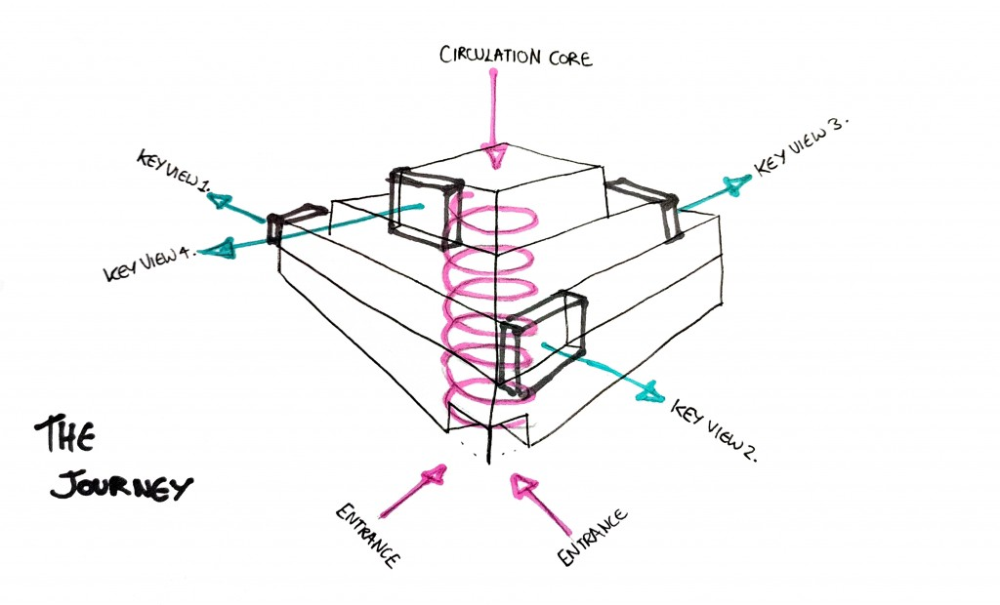
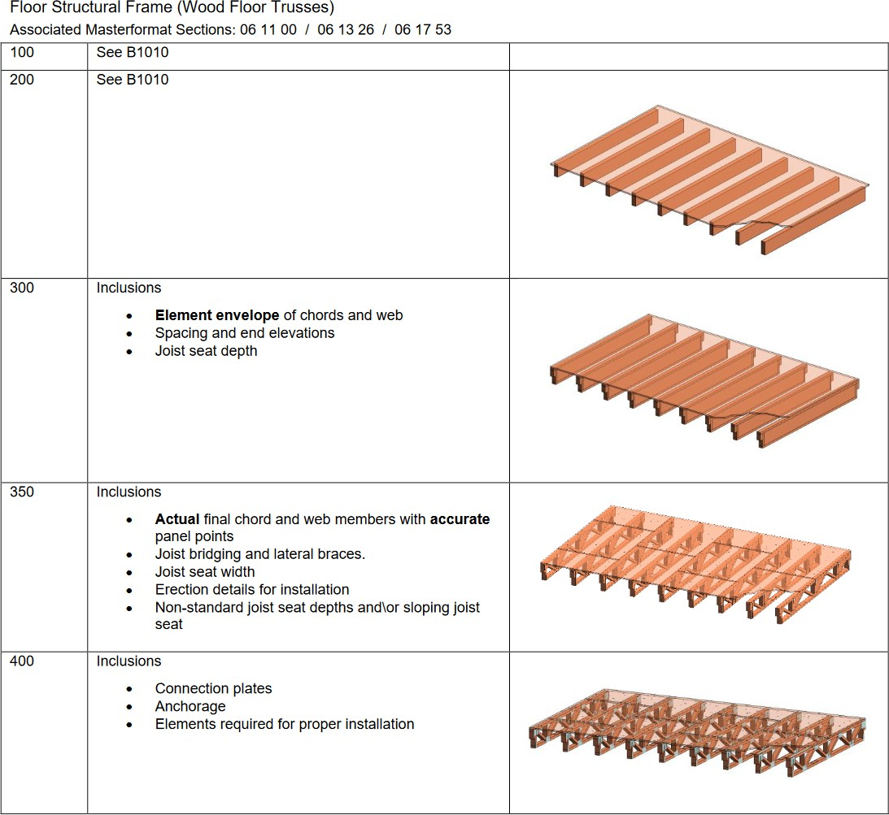

# Top-Down vs. Bottom-Up Design in Construction: A Comparative Analysis

In the field of construction, the approach to building design and execution can significantly impact the project\'s success. Two primary methodologies dominate the industry: top-down design and bottom-up design. Each approach offers unique advantages and presents distinct challenges, catering to different aspects of the construction process. Understanding these methods\' nuances can help construction professionals choose the right strategy for their projects. Additionally, the concept of Building Information Modeling (BIM) and Levels of Development (LOD) plays a crucial role in these approaches, providing a structured framework for the progression of project details.

## Top-Down Design: A Holistic Approach

Top-down design begins with a comprehensive vision of the final product. This method typically involves architects who understand the end-users\' needs, the intended use of the building, and the desired aesthetic and functional characteristics. The architects start by designing the building\'s exterior and interior finishes, ensuring that the overall design aligns with the client\'s goals. After finalizing the architectural plans, the engineering details and fabrication specifics are developed to bring the vision to life. Often the __Ecole des Beaux-Arts__ (https://en.wikipedia.org/wiki/%C3%89cole_des_Beaux-Arts) school of design is said to have primarily promoted

Top-down design because it taught that an architectural design should begin with a __parti__  (https://en.wikipedia.org/wiki/Parti_pris), a basic plan drawing of the overall project.

By contrast, the __Bauhaus__ (https://en.wikipedia.org/wiki/Bauhaus) focused on bottom-up design. This method manifested itself in the study of translating small-scale organizational systems to a larger, more architectural scale.

#### Advantages of Top-Down Design:

- Holistic Vision: Top-down design ensures a cohesive and integrated vision for the entire project. This approach aligns the final product with the client\'s overall goals and aesthetics.
- User-Centric Design: By focusing on the end-users\' needs and experiences from the outset, this method leads to better functionality and usability.
- Flexibility in Design: Architects can explore various design options and innovations without being constrained by existing components or manufacturing limitations.
- Aesthetic and Functional Integration: The design can seamlessly integrate aesthetic and functional elements, ensuring a harmonious final product.
- Coordination and Collaboration: This approach encourages early collaboration between architects, engineers, and other stakeholders, identifying and solving problems early in the process.

#### Disadvantages of Top-Down Design:

- Potentially Higher Costs: The comprehensive vision and user-centric focus can lead to higher costs.
- Longer Timeframes: The need for detailed planning and collaboration may result in longer project timelines.
- Complex Coordination: Effective collaboration among diverse stakeholders is essential, which can be challenging to manage.

## Bottom-Up Design: Leveraging Existing Strengths

In contrast, bottom-up design focuses on leveraging established off-site fabrication facilities with standardized operating procedures (SOPs) and trained staff. This approach starts with efficiently building specific components like floor cassettes, walls, roofs, and modules. The goal is to optimize the construction process by making the most of existing resources while ensuring compliance with building codes and regulatory requirements. This approach should be followed when you have an established technology such as SIP, Masonry, Timberframe or Stickfra

#### Advantages of Bottom-Up Design:

Efficiency and Cost-Effectiveness: Leveraging established facilities, SOPs, and trained staff can lead to lower costs and faster construction times.
- Standardization: Utilizing standardized components and modules ensures consistency and quality control across projects.
- Scalability: This approach makes it easier to scale production for large projects or multiple similar projects, as the same components can be reused.
- Compliance and Reliability: Established processes and components are more likely to meet building codes and regulatory requirements reliably.
- Resource Optimization: Bottom-up design makes the most of existing resources and capabilities, reducing waste and maximizing efficiency.

#### Disadvantages of Bottom-Up Design:

- Less Flexibility in Design: The reliance on standardized components can limit the flexibility and creativity in the overall design.
- Potential Limitations on Innovation: The focus on optimizing existing processes may restrict innovative solutions tailored to unique project needs.
- Component-First Focus: This approach might prioritize optimizing individual components over tailoring the design to specific project requirements.

## The Role of BIM and LOD

Building Information Modeling (BIM) and Levels of Development (LOD) are critical in managing and executing both top- down and bottom-up design approaches. LOD specifies the level of detail and information included in BIM at various stages of a project\'s lifecycle, providing clarity, precision, and consistency in the development and communication of building information.

#### Levels of Development (LOD) Overview:

- LOD 100: Conceptual Design - Overall building massing and basic spatial organization with generic placeholders. Used for preliminary design and feasibility studies.

- LOD 200: Schematic Design - Generalized elements with approximate quantities, sizes, shapes, and locations. Used for early design development and conceptual planning.

- LOD 300: Detailed Design - Specific geometry and accurate dimensions of elements. Used for detailed design and construction documentation.

- LOD 350: Construction Documentation - Additional detail and information about how elements interface with other systems. Used for coordination between disciplines and preparation for construction.

- LOD 400: Fabrication and Assembly - Specific fabrication, assembly, and installation details. Used for manufacturing and construction processes.

- LOD 500: As-Built - Accurate and verified representations of the constructed conditions. Used for facilities management and lifecycle maintenance.

#### Levels of Development (LOD) Examples:

The following diagrams extracted from the LOD standard illustrate the stepwise refinement of LOD.

**Application of LOD in Top-Down and Bottom-Up Design**
**Top-Down Design and LOD Progression:**

In a top-down design approach, the project typically moves through the LOD stages sequentially, starting from LOD 100 (Conceptual Design) to LOD 500 (As-Built). The process begins with a high-level vision and gradually increases in detail and specificity. This progression allows for iterative refinement and ensures that the project evolves in alignment with the overall goals and design intent.

#### Bottom-Up Design and LOD Application:

In a bottom-up design approach, the LOD application may differ. The focus is on the detailed information required for component fabrication and assembly (LOD 400) early in the process. This method ensures that the established fabrication facilities and standardized components are integrated efficiently. While the final model may still reach LOD 500, the path taken emphasizes optimizing existing strengths and ensuring compliance throughout the construction phases.

## Choosing the Right Approach When Using Dietrich\'s

Each methodology has its place depending on the project\'s specific needs, goals, and constraints. Top-down design is ideal for projects where user experience and design innovation are paramount. In contrast, bottom-up design is suited for projects prioritizing efficiency, cost-effectiveness, and leveraging existing resources.

### If you are using the top-down approach in Dietrich's then use the following steps:

1.  Design Building Geometry
2.  Create Wall, Floor and Roof Guidelines
3.  Create Wall, Floor and Roof Buildup

### If you are using the bottom-up-approach then use the following steps:

1.  Update the material database
2.  Create Wall, Floor and Roof Buildup
3.  Create Wall, Floor and Roof Guidelines
4.  Create Profiles
5.  Design Building Geometry

By understanding the strengths and challenges of each approach, construction professionals can make informed decisions that align with their project\'s unique demands. Whether embracing a holistic vision or leveraging established strengths, the right strategy, supported by BIM and LOD frameworks, can significantly impact the success of a construction project.

### References:

> [B]{.underline} [[IM Forum - LOD S]{.underline}p[ecification]{.underline}](https://bimforum.org/wp-content/uploads/2023/10/LOD-Spec-2023-Part-I-2024-02-27.pdf)
