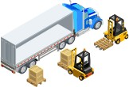
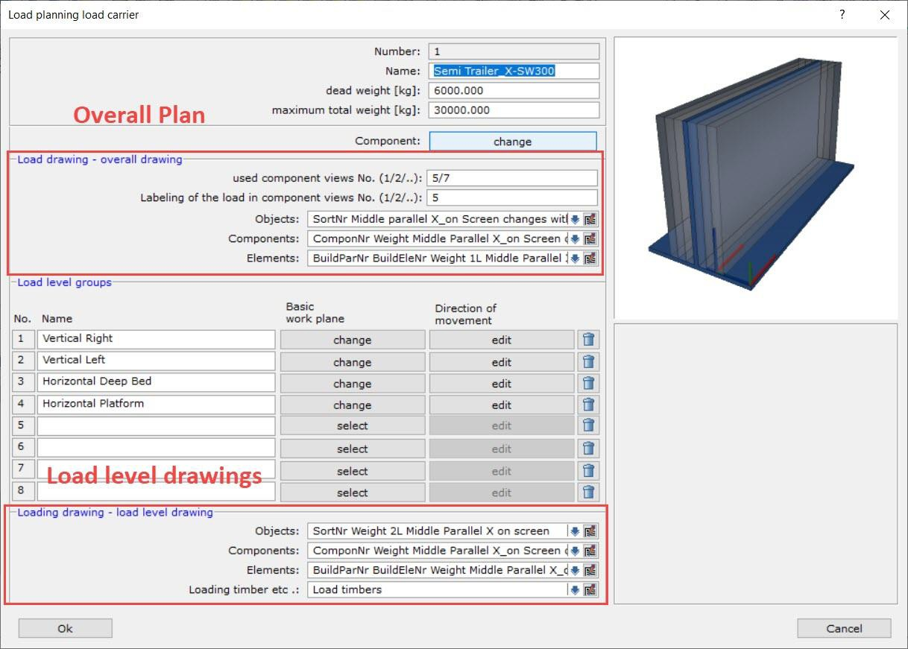
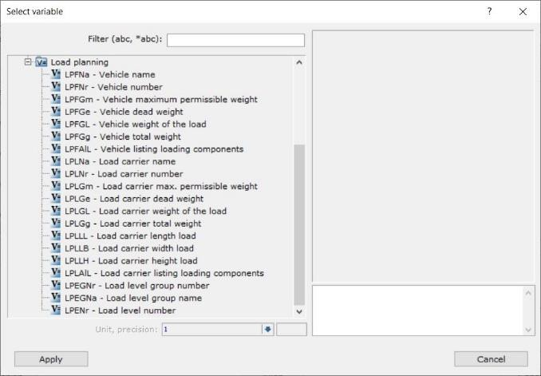
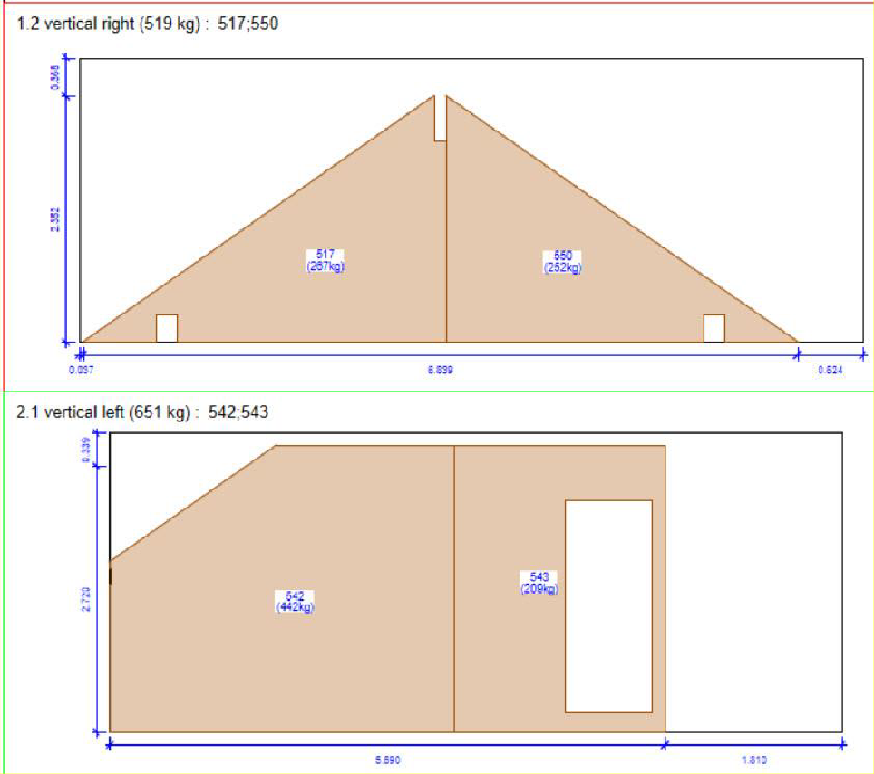

-   [[1]{.toc-section-number} Aim of the document](#aim-of-the-document){#toc-aim-of-the-document}
-   [[2]{.toc-section-number} Introduction and basic understanding](#introduction-and-basic-understanding){#toc-introduction-and-basic-understanding}
    -   [[2.1]{.toc-section-number} Loading components](#loading-components){#toc-loading-components}
    -   [[2.2]{.toc-section-number} Vehicles and loading equipment](#vehicles-and-loading-equipment){#toc-vehicles-and-loading-equipment}
    -   [[2.3]{.toc-section-number} Load planning](#load-planning){#toc-load-planning}
-   [[3]{.toc-section-number} Basis: Loading position](#basis-loading-position){#toc-basis-loading-position}
    -   [[3.1]{.toc-section-number} Overview](#overview){#toc-overview}
    -   [[3.2]{.toc-section-number} Load building position](#load-building-position){#toc-load-building-position}
    -   [[3.3]{.toc-section-number} Split screen](#split-screen){#toc-split-screen}
    -   [[3.4]{.toc-section-number} Display settings of the windows](#display-settings-of-the-windows){#toc-display-settings-of-the-windows}
    -   [[3.5]{.toc-section-number} Display settings loading - pallets dialog](#display-settings-loading---pallets-dialog){#toc-display-settings-loading---pallets-dialog}
    -   [[3.6]{.toc-section-number} Vehicles](#vehicles){#toc-vehicles}
    -   [[3.7]{.toc-section-number} Load Carrier](#load-carrier){#toc-load-carrier}
    -   [[3.8]{.toc-section-number} Loading levels](#loading-levels){#toc-loading-levels}
    -   [[3.9]{.toc-section-number} Practicing on your own Procedure:](#practicing-on-your-own-procedure){#toc-practicing-on-your-own-procedure}
-   [[4]{.toc-section-number} Basic: Loading](#basic-loading){#toc-basic-loading}
    -   [[4.1]{.toc-section-number} Rotate during insertion](#rotate-during-insertion){#toc-rotate-during-insertion}
    -   [[4.2]{.toc-section-number} Positioning options](#positioning-options){#toc-positioning-options}
    -   [[4.3]{.toc-section-number} Ctrl Key during loading](#ctrl-key-during-loading){#toc-ctrl-key-during-loading}
    -   [[4.4]{.toc-section-number} Move and position](#move-and-position){#toc-move-and-position}
    -   [[4.5]{.toc-section-number} Push Load Levels Together](#push-load-levels-together){#toc-push-load-levels-together}
    -   [[4.6]{.toc-section-number} Drawing output](#drawing-output){#toc-drawing-output}
    -   [[4.7]{.toc-section-number} Practicing own your own](#practicing-own-your-own){#toc-practicing-own-your-own}
    -   [Procedure:](#procedure){#toc-procedure}
-   [[5]{.toc-section-number} Advanced: Preparation structure](#advanced-preparation-structure){#toc-advanced-preparation-structure}
    -   [[5.1]{.toc-section-number} {width="2.8826388888888888in" height="3.341665573053368in"}Which loading components are there](#which-loading-components-are-there){#toc-which-loading-components-are-there}
    -   [[5.2]{.toc-section-number} Setting in properties of the wall, ceiling and roof](#setting-in-properties-of-the-wall-ceiling-and-roof){#toc-setting-in-properties-of-the-wall-ceiling-and-roof}
    -   [[5.3]{.toc-section-number} {width="3.048611111111111in" height="0.5340277777777778in"}Elemente](#elemente){#toc-elemente}
    -   [[5.4]{.toc-section-number} Components](#components){#toc-components}
    -   [[5.5]{.toc-section-number} Individual parts](#individual-parts){#toc-individual-parts}
    -   [[5.6]{.toc-section-number} Practicing on your own](#practicing-on-your-own){#toc-practicing-on-your-own}
-   [[6]{.toc-section-number} Structure: Loading](#structure-loading){#toc-structure-loading}
    -   [[6.1]{.toc-section-number} Manage buildings](#manage-buildings){#toc-manage-buildings}
    -   [[6.2]{.toc-section-number} Substitute representation](#substitute-representation){#toc-substitute-representation}
    -   [[6.3]{.toc-section-number} Display settings (representation of the loading components)](#display-settings-representation-of-the-loading-components){#toc-display-settings-representation-of-the-loading-components}
    -   [[6.4]{.toc-section-number} Representation Building](#representation-building){#toc-representation-building}
    -   [[6.5]{.toc-section-number} Representation loading](#representation-loading){#toc-representation-loading}
    -   [[6.6]{.toc-section-number} Practicing on your own](#practicing-on-your-own-1){#toc-practicing-on-your-own-1}
    -   [[6.7]{.toc-section-number} Loading HRB, elements, individual components](#loading-hrb-elements-individual-components){#toc-loading-hrb-elements-individual-components}
    -   [[6.8]{.toc-section-number} Other options in Load Levels](#other-options-in-load-levels){#toc-other-options-in-load-levels}
    -   [[6.9]{.toc-section-number} Input of loading timbers](#input-of-loading-timbers){#toc-input-of-loading-timbers}
    -   [[6.10]{.toc-section-number} {width="4.269443350831146in" height="3.400803805774278in"}Input of drawing elements](#input-of-drawing-elements){#toc-input-of-drawing-elements}
    -   [[6.11]{.toc-section-number} Practicing on your own](#practicing-on-your-own-2){#toc-practicing-on-your-own-2}
    -   [[6.12]{.toc-section-number} Verification](#verification){#toc-verification}
    -   [[6.13]{.toc-section-number} Representation of the loading components Display settings](#representation-of-the-loading-components-display-settings){#toc-representation-of-the-loading-components-display-settings}
    -   [[6.14]{.toc-section-number} Searching for loading components in the Building position or Load Level](#searching-for-loading-components-in-the-building-position-or-load-level){#toc-searching-for-loading-components-in-the-building-position-or-load-level}
    -   [[6.15]{.toc-section-number} Load space transparency](#load-space-transparency){#toc-load-space-transparency}
    -   [[6.16]{.toc-section-number} Clash detection](#clash-detection){#toc-clash-detection}
    -   [[6.17]{.toc-section-number} Synchronize building](#synchronize-building){#toc-synchronize-building}
-   [[7]{.toc-section-number} Structure: Plans](#structure-plans){#toc-structure-plans}
    -   [[7.1]{.toc-section-number} Prerequisites](#prerequisites){#toc-prerequisites}
    -   [[7.2]{.toc-section-number} Labeling](#labeling){#toc-labeling}
    -   [[7.3]{.toc-section-number} Overall plan](#overall-plan){#toc-overall-plan}
    -   [[7.4]{.toc-section-number} Load level plan](#load-level-plan){#toc-load-level-plan}
    -   [[7.5]{.toc-section-number} Practicing own your own](#practicing-own-your-own-1){#toc-practicing-own-your-own-1}
-   [[8]{.toc-section-number} Structure: Loading Position Template](#structure-loading-position-template){#toc-structure-loading-position-template}
-   [[9]{.toc-section-number} {width="2.8229166666666665in" height="2.8229166666666665in"}Expert: Own vehicles](#expert-own-vehicles){#toc-expert-own-vehicles}
    -   [[9.1]{.toc-section-number} Component\'s](#components-1){#toc-components-1}
    -   [[9.2]{.toc-section-number} Vehicle](#vehicle){#toc-vehicle}
    -   [[9.3]{.toc-section-number} Practicing own your own](#practicing-own-your-own-2){#toc-practicing-own-your-own-2}
-   [[10]{.toc-section-number} Expert: Your own load carrier](#expert-your-own-load-carrier){#toc-expert-your-own-load-carrier}
    -   [[10.1]{.toc-section-number} Load levels](#load-levels){#toc-load-levels}
    -   [[10.2]{.toc-section-number} Load carrier](#load-carrier-1){#toc-load-carrier-1}
    -   [[10.3]{.toc-section-number} Practicing own your own](#practicing-own-your-own-3){#toc-practicing-own-your-own-3}
-   [[11]{.toc-section-number} Expert: Loading list](#expert-loading-list){#toc-expert-loading-list}


> {width="2.6493744531933507in" height="1.7989577865266841in"}

{width="7.235321522309711in" height="3.9875in"}

> {width="2.261248906386702in" height="1.5354155730533683in"}

# Aim of the document

> In this training document the loading planning is presented and shown by means of examples. The training is divided into three categories. In the category **Basis**, the tools and possibilities will be shown and introduced. In the **Buildup** category, the application of these tools is further deepened. Training content in the Expert category provides further opportunities for settings.
>
> To start with a specific chapter, the used project can be downloaded under the following link:
>
> The default settings from the delivery version are used for this tutorial.

-   Work instructions are marked in blue, with a dot in front of them

-   

-   General explanations are written in black.

> Explanations to the program are marked in blue, without a dot in front of it.

# Introduction and basic understanding

> Dietrich\'s Loading Planning is designed to support the loading planner in the convenient implementation of his know-how. To make this possible, many new technologies have been
>
> Notes
>
> incorporated into the program. The following pages contain an explanation of how the loading planning is structured.

## Loading components

> Different objects are loaded during the loading planning:

-   Individual components

-   Components

-   Elements of wall, ceiling and roof

-   Complete building elements (wall, ceiling, roof) These are called **load components**.

> {width="2.698611111111111in" height="3.9in"}

## Vehicles and loading equipment

> {width="3.142361111111111in" height="5.308333333333334in"}The loading components are loaded onto so-called **loading aids**. Loading aids are for example platforms, loading racks, A-frames and other types.
>
> These loading aids are in turn loaded onto trucks, trailers or other means of transport. These are summarized under the term **vehicles**.
>
> Vehicles are needed because deliveries are planned and scheduled. The loading aids are distributed on the vehicles.
>
> Notes

## Load planning

> In the loading position the loading components, vehicles and loading aids are brought together. The loading components come from building positions. Vehicles and loading aids are inserted into the loading position from a library or are already available in the template.

{width="6.231763998250218in" height="2.7133333333333334in"}

> The loading item is a separate position type, since several building positions can be loaded here.
>
> In the same way, not all information of the structure has to be available for the loading planning. For example, slice contours, logic blocks elements or machine processing (apart from the shape of the component) are not decisive for loading. This makes it easier and faster to manage the loading process.
>
> It also allows several buildings to be planned in one loading position. The buildings are linked to the loading position. If there is a change in the structure, the structure can be synchronized with the loading position and the loaded can be adjusted.
>
> Notes

# Basis: Loading position

## Overview

> Open loading position V01 \"Basic - Loading position
>
> {width="6.963102580927384in" height="3.7354166666666666in"}Vehicles have already been created in the loading position. How to insert them will be discussed in a later chapter.
>
> Notes

## Load building position

> To get a link between building and loading, a position must first be loaded into the loading.

-   7-1 Manage building positions „" {width="0.22847112860892388in" height="0.23838801399825021in"}

{width="5.367774496937883in" height="1.9081244531933508in"}

-   Select building B01 and confirm with \"ok

> The exact options and their effects will be discussed later in the **Structure** section.

-   {width="2.8490201224846894in" height="3.3020833333333335in"}The following options to load the structure:

> Notes

## Split screen

> Loading planning is basically divided into two areas. The loading itself and the loaded structures. To make it easier to distinguish and work with, these two areas can be divided into two separate graphic areas. Here, in addition to working in one window, there is the possibility of a split window or two separate windows.

-   9-08-1 „one graphics window" {width="0.22847112860892388in" height="0.23873578302712162in"}

-   OpenGL work space start with the O key

-   9-08-3 „two graphics windows" {width="0.22847112860892388in" height="0.238665791776028in"}

-   9-08-2 „split graphics window" {width="0.22847112860892388in" height="0.2388604549431321in"}

> {width="5.474273840769904in" height="2.4779166666666668in"}The size of the respective window can be easily moved with the mouse by moving the dividing line in the middle.
>
> Rendering via the OpenGL workspace can be selected separately for each window!
>
> Notes

## Display settings of the windows

> For loading on the left side, you will find the display setting at the bottom left. Depending on the loading component being loaded, a different display setup can be beneficial.
>
> For the window of the loaded structure, you will find the display settings, as usual, under 1 -7-1.
>
> The left window is optimized for placing the loading components, the right window for selecting the loading components.

-   1-7-1 Set display settings to favorite \"Walls\", activate only story TF -\> Hide loaded components

-   Display left on \"all vehicles - components

{width="6.133333333333334in" height="2.8340277777777776in"}

{width="6.0216382327209095in" height="2.03in"}

> Notes

## Display settings loading - pallets dialog

> The display setting for the loading planning can be found in the lower left corner. Similar to D- Calcs or Profile, the settings are divided into palettes that can be expanded with the Plus button.
>
> As known from the previous program, the favorites can be selected by clicking on the button.

{width="2.7758147419072614in" height="0.7313538932633421in"}

> A new addition is the possibility that the functionality of the bar can be changed.

-   Toggle function bar by clicking on {width="0.1971380139982502in" height="0.17625in"}

{width="3.6563188976377954in" height="0.22749890638670167in"}

> This allows you to enter a search for the setting in the bar. This allows you to search the display settings for the setting you are looking for. It is not necessary to enter the entire name of the setting. It is also possible to use the \* character here.

-   Enter in search line: load

-   Click on the down arrow

-   Enter in search line \*room then click down arrow

> In addition, there is a third variant, whereby especially the favorites can be selected quickly.

-   Toggle function bar by clicking on {width="0.1971380139982502in" height="0.17547134733158357in"}

{width="3.2774617235345582in" height="0.2175in"}

> Clicking on the number directly retrieves the favorite of the setting. If you move the mouse over the number, the name of the favorite is displayed.

## Vehicles

{width="2.666712598425197in" height="0.1875in"}

> Notes
>
> All vehicles and loading equipment inserted into the loading position are displayed in the loading tree. For this purpose, the name of the vehicle and the loading equipment is specified.
>
> After the name in parentheses are the details of the weight.

{width="1.1213899825021871in" height="0.15937445319335083in"}

> (Maximum total weight / Current weight / Payload still possible) With the color box, you can already read the loading status.
>
> {width="0.1472211286089239in" height="0.14722222222222223in"} = Loading up to 80% of the permissible total weight (0-80% loading) {width="0.1472211286089239in" height="0.14722222222222223in"} = Loaded, permissible total weight not yet reached (80 -100%)
>
> {width="0.1472211286089239in" height="0.14722222222222223in"} = Permissible total weight exceeded (100 - 105%)
>
> {width="0.1472211286089239in" height="0.14722222222222223in"} = Overloading more than 5% of the permissible total weight (from 105%) The information can be changed directly on the vehicle.

-   Right click on \"1st truck\" in the loading tree -\> Change vehicle

-   {width="3.8300240594925636in" height="0.84375in"}Increase the dead weight of the vehicle so that the maximum permissible weights are reached.

-   Access library with supplied vehicles

> Notes

## Load Carrier

{width="2.8533234908136484in" height="1.8866666666666667in"}{width="2.8625in" height="1.8275in"}

> There are already loading aids on the vehicles shown. We can also see these in the loading tree at the top left. Load Carrier, in this case an L-frame, is placed on the vehicles. The loading aids are included with most of the vehicles supplied.

-   Click on the + in the loading tree in front of 1. 7.5t Flatbed truck with T-frame

-   1.1 Select T Frame

-   Display setting, switch to favorite 4 \"current loading aid - components\".

> There is also the same control of weights and payloads for loading equipment as there is for vehicles.
>
> The loading aids are shown here in a very simplified way to allow easy placement.
>
> Here, too, there are various supplied loading aids.

-   Access the library of loading aids

> Each loading equipment has its own loading levels, where the loading components are inserted.
>
> Notes

## Loading levels


> Loading levels are determined by working planes. Loading levels are the levels in which the loading components can be inserted. This simplifies the loading of the loading components and links them organizationally to the respective loading level.
>
> Plans can then be generated later from the individual loading levels. This way you get the exact loading for each level.

-   In the loading tree, unfold the vehicles/load carrier and the loading level.

-   1 vertical right -\> click 1 loading level

> This changes the view in the loading perpendicular to the loading plane. This has to do with the positioning chosen, which will be discussed in the next chapters. Loading components can only be loaded once a loading level has been selected!
>
> Since several components are usually placed next to and on top of each other on a loading aid, one loading level is not sufficient. Additional loading levels can be easily created.

-   View of loading turned into perspective

-   Button: Create new loading level -\> Thickness of loading plane to 1m

-   Button \"create, offer next\" until there are three pieces in total per side

> This function allows you to create multiple loading layers at once. The thickness of the loading level determines the distance between the loading levels to suit. The loading levels can be pushed together after loading. Precise adjustment of the thickness is possible, but not mandatory.
>
> Notes

## Practicing on your own Procedure:

1)  Create position for loading - V10

2)  New vehicle load, 7.5 Flatbed truck with T-frame

3)  Load building - same building - same settings when loading

4)  Add loading levels

5)  Two windows / One window - OpenGL workspace

6)  Set display settings

{width="5.1323479877515314in" height="3.611978346456693in"}

> Notes

# Basic: Loading

> Individual components, elements or assemblies can be loaded onto the previously set up loading levels.
>
> When loading these loading components, one component is selected in the right window. Then the loading component hangs directly on the cursor in the left window. Various functions are available for placing the component.

-   1 vertical left - select 1 loading level of the 1st truck_7.5t

-   7-2-1 \"Load Loading components" {width="0.22847222222222222in" height="0.2382075678040245in"}, Select the loading component (gable triangle wall) and position it on the loading plane.

> You can see how the loaded component on the right is no longer present due to the settings made in the display settings.
>
> The component to be loaded hangs on the cursor and is placed along the X-axis of the loading plane.

{width="6.6080500874890635in" height="2.3516666666666666in"}

> Components that have already been loaded can also be unloaded again.

-   Unload the loading components (function 7 -2-5 {width="0.22847112860892388in" height="0.23863845144356954in"}) These appear, with this display setting, again in the position.

> Notes

## Rotate during insertion

> When a load component is selected, it is located on the cursor in the load. There, it can be rotated, mirrored and flipped using various key combinations.
>
> TAB = Rotate around the X axis (90° steps) Shift + TAB = Rotate around the Z-axis (180°)
>
> Ctrl + TAB = Rotate around the Y axis (90°)
>
> This allows the loading component to be easily aligned and fit into the desired position.

-   Rotate view of loading with 9-1-1 \"Arbitrary\".

-   • 7-2-1 \"Load Loading components" {width="0.22847112860892388in" height="0.2388604549431321in"} → Apply rotate functions, then end function with mouse-right

{width="6.325262467191601in" height="4.35in"}

> Notes

## Positioning options

> {width="3.5937981189851267in" height="0.2708333333333333in"}Depending on the loading component, different views are often required for positioning. Four variants are available for positioning the loading component.
>
> 3D: Free input in 3D, any view
>
> A_3D: Input in work plane in 3D, any view
>
> A_2Dxy: Input in work plane, preferred view on XoY of the work plane A_2Dzx: Input in work plane, preferred view on ZoX of the work plane
>
> If you select one of the variants, you can make further settings for the positioning.
>
> Distance to working plane: With a value of 0, the loading component is placed flush on the loading plane. A distance causes a displacement parallel to the loading plane in the Z direction.
>
> Distance to X-axis of the work plane: A distance causes a displacement parallel to the X-axis of the loading plane.
>
> Both functions are especially helpful if you have entered additional spacers or other, so-called loading timbers or if components are to be loaded interlaced.

-   Distance to the X-axis of the work plane 0.08m

-   Catch points off

{width="4.4615135608048995in" height="0.9296872265966755in"}

-   Load another gable Triangle

> Notes

## Ctrl Key during loading

> The current loading level is already filled. You would be able to fit the gable triangle using the rotate functions, but in this case this loading component is to be loaded into a new loading plane.
>
> For this you can change the loading level within the loading function.

-   Gable triangle hangs on crosshairs/ cursor - Press CTRL key and select 2 loading level.

> You can see that the loading component of the other loading level have a different representation than the component that is currently being loaded. This becomes particularly clear in the OpenGL workspace. In this case, the other loading layers should also be hidden.

-   CTRL key - select display favorite 4

{width="6.283613298337708in" height="1.4749989063867017in"}

> You can therefore access the complete settings on the left side during loading. Loading tree with vehicles and loading levels, positioning variants and display control.
>
> A particularly practical feature is that it allows you to simply switch to another loading level.

-   Place load component

> Notes

## Move and position

> Sometimes the load components can be placed relatively freely. For this it is convenient that no points are caught during loading. However, it is often the case that the components need to be placed more precisely. For this purpose, the point snap can be switched on, as well as the extended function for moving components and loading components.

-   Select positioning option A_3D

-   Check the \"Move after positioning\" box

-   {width="6.142671697287839in" height="1.0493744531933509in"}Distance to X-axis of the work plane, to 0.08m

-   Rotate view in perspective

-   7-2-1 \"Load loading components\" - Selecting the next gable triangle

-   Click on any point

> After the first positioning, another dialog box opens, with which the components can be moved.

{width="2.093940288713911in" height="3.119374453193351in"}

> Notes
>
> A value can be entered directly here. Either related to the global coordinate system or the object coordinate system. The result will be displayed in the preview.

-   Global X - Enter value 0.2m and press OK.

> However, the button behind it can also be used to move one point to another. This allows you to position the component exactly flush.

-   Click button behind \"global X

-   Base point lower corner of the component to be loaded

-   Target point lower corner of the already loaded gable triangle

{width="3.79165135608049in" height="2.6293744531933507in"}

> Components that have already been loaded can also be moved subsequently.

-   7-2-3 „Move loading components" {width="0.22847222222222222in" height="0.2388604549431321in"}

> Again, all the previously described possibilities apply. The loading component can be placed and moved to another loading level in the same way as during loading.
>
> Note: Loaded load components can be moved using the common DICAM functions. However, this does not change, for example, the loading level to which a loading component is organizationally assigned. If you want to move a load component to another load level, you must use the specific function to move load components.
>
> Notes

## Push Load Levels Together

> The thickness of the loading levels was previously specified as 1m. For the final plans and final control, the loading levels should be adjacent to each other.
>
> For this purpose, there is a possibility to push these loading levels together.

-   In the loading tree, right-click on \"vertical left

-   Push load levels together

-   Set additional air gap between loading levels to 0.00m and confirm with \"Ok

> The thickness of the components in it are detected and the layers are pushed together accordingly.
>
> If, for example, ledges or an anti-slip mat are to be taken into account, this can be entered via \"Additional air gap between load levels.\"

-   Function Push load levels together

-   Additional air gap between load levels

> Tip: The function can also be used to move the layers apart. For example, for an exploded view, for filing the overall plan. In this example, the air gap has been set to 3m.

{width="4.832380796150481in" height="3.1627077865266844in"}

> Notes

## Drawing output

> Position V03 - Loading position - Base - for chapter 4.6 - Open plan output
>
> For the plan output of the Load Planning, the views of the components are used, which are already predefined in the vehicles and loading equipment. More about this later in chapter 7 section.
>
> There are two types of plans for loading planning. The overall plan and the loading level plan. Both are created using the same function.

-   1-01-03 „Load drawing "

-   Open the \"Overall drawing for load carrier\" presetting

> The left half of the dialog box is divided into two columns. Settings for the overall plan and those for the individual loading level plans. The main focus here is on the loading components on the two types of plan.
>
> On the right side you can find the settings for the plan types themselves. Decisive for the beginning is above all the selection whether an overall plan for the vehicle, the loading equipment, or only a loading level plan is to be generated.
>
> A separate plan template for Load Level Plans can also be set there, as separate plan templates with multiple viewports may be required for Load Level Plans.

-   No load level plans

-   Select \"All vehicles\" and press \"Ok\" to generate the plans

```{=html}
<!-- -->
```
-   {width="2.6506692913385828in" height="1.8599989063867017in"}1-01-03 Load drawings -- overall drawing for load carrier

> Notes
>
> Which views are displayed on the overall plan are determined by the load carrier.

-   Right-click on the L-frame -\> Change load carrier

-   Click in „used component views No. (1/2/..):"

{width="2.906248906386702in" height="2.90625in"}

> There it is specified for the plan which views are used for the overall plan. These are the set views from the component.

-   Select L-frame

-   1-01-03 „Load drawing "

-   Selecting the \"Load level plan\" preset

-   Selection „1 current load carrier "

> Notes

## Practicing own your own

> Create your own position

## Procedure: {#procedure .unnumbered}

1)  Remove unnecessary vehicles

2)  Insert vehicle semitrailer - use resize function if needed

3)  Load remaining BSP elements with rotate, CTRL key during loading, distance to X-axis (tip: Tractor & trailer Auwaerter outside drop deck with 0,25m) and move after positioning

4)  Push the loading levels together.

5)  Plan output complete plan and Load level plans.

{width="3.9578947944007in" height="2.0999989063867015in"}

> {width="3.8352504374453193in" height="2.705in"}
>
> Notes

# Advanced: Preparation structure

-   Create new loading position (with vehicles)

-   Load Building

-   Dialogue \"Loading buildings\"

> In order for a structure and its loading components to be loaded realistically in the loading position, settings must already be made and things prepared in the building position. The components that you want to load are determined when you load the building position. Only these are then present in the loading position. For this distinction to be possible, the structure must be prepared accordingly.

## {width="2.8826388888888888in" height="3.341665573053368in"}Which loading components are there

> The following loading components must be distinguished:

-   [Single objects in packages:]{.underline} Components that don\'t belong to an element to be loaded, but to a package

-   [Components]{.underline}: if not belonging to an element to be loaded

-   [Elements:]{.underline} if they are to be loaded as such

-   [Wall volumes, Floor-and roof slice panels]{.underline}

-   [Single objects:]{.underline} not in elements or packages to be loaded

> Depending on the settings in the building, the components are filtered according to these categories when they are loaded.

## Setting in properties of the wall, ceiling and roof

> If there is an element setting of the building element, the loading of the elements is defined in the element setting (see next chapter).
>
> Notes
>
> {width="4.492361111111111in" height="0.5833333333333334in"}If the building element (wall, ceiling, roof) is not an element, in the wall, ceiling, roof properties you can set whether to load it as a unit
>
> or not.

-   Bauwerk verladen, nur „Elemente" anhaken

-   Deutlich machen der Elemente mit Ersatzdarstellung und Beschriftung

-   Eine Innenwand „fehlt"

-   Überprüfen der Einstellungen im Bauwerk

## {width="3.048611111111111in" height="0.5340277777777778in"}Elemente

> Elements are loaded as a unit if this has been set.
>
> The elementation of the walls is a special case. No setting for loading can be made here. Wall elements are therefore always loaded as a unit.

-   A roof element \"missing

-   Check the settings in the building position?

-   Not all components of an element are automatically included in the load component. Which components are to be \"included\" is determined by determining the center of gravity (in wall, ceiling and roof). The group to which the components belong is decisive here. Individual components can be excluded via the beam type number. Connectors and fasteners can be excluded via an extra switch.

-   {width="4.111111111111111in" height="2.3854166666666665in"}Center of gravity calculation in wall construction

-   623 Sole plate is excluded

-   Wall 2 without window components

-   Difference \"weight\" and \"dimension

-   Components clearly in OpenGL workspace and without replacement representation

> Notes

## Components

1.  Components are loaded as such if they do not belong to an element or a building element that is to be loaded as a unit. The single objects always remain in the \"group\" of the component. The building MOS, group and beam type of the first object of the component determine what element or building element and then loading component the component belongs to.

> {width="7.89294072615923in" height="2.1175in"}

-   Load structure, tick only \" components \".

-   Component integrated into ceiling element (steel girder from ceiling 1 E04) does not come with the ceiling element

> Notes

## Individual parts

{width="7.18650043744532in" height="1.8540616797900262in"}

> Individual parts that are to be loaded as such must not belong to the following loading components or be included via the center of gravity determination:

-   Components

-   Element loaded as one unit

-   Building element loaded as a unit

-   So, if a component belongs to an element or building element (mostly the case), it can still be taken out via its group membership or the beam type number exclusion.

> A further subdivision in the individual components is the affiliation to a package. This MOS affiliation means that the components are loaded as \"individual components in packages\".

-   Load structure, tick only component types from \"Individual components\" group

-   Examples: sole plates, purlins, chimney trimmers from collar beam ceiling.

-   Create a package named \"Purlins\" in the structure, assign the purlins, reload the structure→ Purlins do not appear, reload with \"single components in packages→ Purlins only

## Practicing on your own

> Check and test the choice of loading components and decisive settings in the structure.
>
> Notes

# Structure: Loading

## Manage buildings

{width="7.201300306211723in" height="3.3470833333333334in"}

> To obtain loading components, structures are loaded into the loading position. These structures remain associated with the loading position. The current and the loaded status are displayed.

-   Remove and re-import structure multiple times, specifying different loading options

-   Open and save building, then check management in loading position

## Substitute representation

> In the representation settings for the structure, you can also activate a substitute representation for components and elements instead of the original volumes. This provides a simplified view of the loading components, both for selection and for placement on the loading equipment.
>
> The replacement representations are created from the bounding box of the included components with corresponding protrusions for protruding individual components. With the function \"Properties substitute representation\" (7-2-03) you can control the optical nature of the formed volumes.
>
> Notes

-   Switch to substitute display in display settings

-   Show properties of the replacement representation

-   Wall elements and components loaded

## Display settings (representation of the loading components)

## Representation Building

> {width="4.545832239720035in" height="2.9888877952755903in"}The usual display settings (function 1-7-1) are used to control the building to be loaded, the floors, the loading components in general and in relation to the building MOS, as well as the appearance of the loading
>
> components and the labels in the building to be loaded. This means that the display of the components can always be clearly arranged to suit the respective loading area.
>
> Especially the labels contribute greatly to good control for loading.

-   Show display options and favorites

> Notes

## Representation loading

> The display settings for loading are located on the left under the loading tree. Similar to the structural analysis or the profile, the dialog contains pallets that are expanded using the plus button.
>
> {width="3.5402766841644793in" height="0.9326377952755905in"}In the top bar, you can call up, save and manage the corresponding presets as usual. There is also a button on the far right to toggle the
>
> functionality of this bar. This will take you to the search and quick switching of the saved favorites.
>
> In this display configuration, the following areas are treated separately:

-   Vehicles (the current and all the remaining)

-   Load carrier (the current and all remaining)

-   Loading level (the current / rear, lower)

-   Loading level (the front, upper / remaining)

-   Drawing elements (the current / remaining)

-   Objects loading position (not loading components)

> The combination of the focus in the loading tree (in which level in which loading equipment in which vehicle am I located?) and the display settings of the loading results in what exactly is visible of the loading and in which form (including labeling).
>
> The preferences of one\'s own work as well as the different requirements of various loading situations can be switched most efficiently by using corresponding favorites.

-   Show display options and favorites

## Practicing on your own

> Test different loading and display options
>
> Notes

## Loading HRB, elements, individual components

> HRB walls are usually loaded vertically and have a large number of individual components.
>
> In accordance with this, it is recommended to load in the OpenGl workspace with substitute representations.

-   Loading HRB walls onto L-frame

-   Moving individual elements and entire levels

> For example, cross laminated timber elements, but also wooden beam ceiling elements can be loaded horizontally. It may even be possible to stack the individual elements in an interlocking manner.

-   Loading of collar beam ceiling elements onto flatbed trailers

-   {width="5.067191601049869in" height="3.6in"}„ Pushing together\" the corresponding load planes (by thickness).

> Individual components can be the only loading components of a project (e.g., log buildings or roof framing components), but they can also be a supplement to prefabricated elements. In the latter case, the task is to fill the resulting gaps in element loading as efficiently as possible.
>
> Notes

-   Loading of individual components into gaps between collar beam ceiling elements

## Other options in Load Levels

## Input of loading timbers

> Normal\" components can be entered in the Load Levels. In this way, for example, loading timbers can be generated.

-   Input of loading timbers along the X-axis of the L-frame

> These components belong organizationally to the respective selected loading level and can therefore also be switched accordingly in the display settings. These components are also taken into account separately during plan storage and are placed on their own material list.

## {width="4.269443350831146in" height="3.400803805774278in"}Input of drawing elements

> In the load levels, analogous to the work planes in DICAM, all drawing elements, texts and labels as well as imports of images or PDFs can be inserted. These elements are also taken into account in the plan storage for the Load Level Plans.

-   Input of a text or label

-   Import an image file

## Practicing on your own

> Loading of wall and ceiling elements, input of loading timbers and 2D elements
>
> Notes

## Verification

> Several areas are summarized in the Verification chapter:

-   A purely visual check of the loading to see if everything has been loaded

-   visual control, supported by the program, whether there are collisions or protrusions

-   the possibility of reloading the structure into the loading, if there was a change in it. Of course, as much as possible of the existing loading should be preserved.

> Loading position V05 - Structure - Control

## Representation of the loading components Display settings

> In order to determine whether all loading components are loaded, the Representation of the loading components of the structure position is particularly useful.
>
> The, components that have already been loaded can be displayed differently or hidden completely.

-   1-7-1 Display settings - check the \"loaded\" box

{width="3.3125481189851267in" height="1.531978346456693in"}

## Searching for loading components in the Building position or Load Level

> Already loaded components can be selected in the load level or in the structure with the function. These are then marked in the other area.

-   7-2-8 „Search for loading components in the Building position" {width="0.22847112860892388in" height="0.2388604549431321in"}

> This selects a component in the loading. Then that component is displayed in the structure.
>
> Notes

-   {width="0.23888779527559056in" height="0.2388888888888889in"}7-2-9 „Search for loading components in load level"

> This displays the loaded component when the load component is selected in the structure. This means that only loading components that have been loaded can be selected.

## Load space transparency

> Vehicles and loading equipment always contain a volume that represents the available load area. This has beam type 921 - load room. This loading area is inserted purely for visual inspection, to see whether the load carrier and loading components each fit into the vehicle and the load carrier and nothing protrudes.

-   Switch on load room in display settings and start OpenGL workspace

-   Select L-frame in loading tree

-   Transparency of the load room to 0 in the Object info (default value 80).

-   Visual inspection of the loading components on the load carrier

## Clash detection

> Since load components cannot be switched \"active\" with 8 -5 in the load planning, the collision control works using the visible components.
>
> Accordingly, the loading components, load carrier and vehicles to be checked for collisions are displayed.

-   Favorite 4 of the display setting in the loading

-   Turn off OpenGL-work space

-   2-05-1 „Clash detection "

{width="6.310159667541558in" height="1.0615616797900262in"}

> Notes

## Synchronize building

> If the loading planning has been completed, it may happen that something has changed in the building in the meantime. Since in this case the complete position should not be reloaded, there is the possibility to synchronize the building.
>
> In the procedure, the structure that has already been loaded into the loading posi tion is synchronized with the new, modified one.
>
> Open-Building position B02

-   Model area DICAM

-   Panel of DG W12 - create a recess using an auxiliary component

-   Select components in the BBS filter and then activate them.

-   2-02 Volume info -\> All active-\> Calculate center of gravity using \"Determine values\".

-   Sorting - Add to existing

-   1-1-3 Building model - save

> This means that a change is entered in the structure for a panel that has already been loaded. However, the center of gravity was calculated for all panels.

-   Open loading position

-   7-1 „Manage building positions" {width="0.22847112860892388in" height="0.2388604549431321in"}

> Here the line of the structure is already highlighted in red. You can tell that a particular status has been loaded and a new status is available.
>
> alla {width="5.308332239720035in" height="1.8569433508311461in"}
>
> Notes

-   Select building in the line

-   Click on \"Synchronize building with loading\".

> The structure is synchronized into the loading and a prompted message appears.

{width="4.272852143482065in" height="1.5385411198600174in"}

> Changed loading components receive an identifier in the loading position, on the basis of which they can be displayed individually. This is especially important if you answer \"No\" to this dialog box. If you select \"No\", modified components that have already been loaded will not be unloaded again.

-   Confirm dialog box with \"Yes\" - Exit management of structures with \"Ok

> This means that the panel is no longer present on the load carrier. This was unloaded. Although the center of gravity was also calculated for the other components, they are not affected because the center of gravity has not changed.
>
> Changed components can also be made visible. These have an identifier on the component.

-   7-2-01 „Loading components with control ID" {width="0.22847112860892388in" height="0.2375in"}

> This hides the load components that do not have this control identifier. The loading components can be displayed again using 8-07.

-   8-07 „Show all" {width="0.22847112860892388in" height="0.2388604549431321in"}

> If the control is finished after synchronization, the control identifier can be removed. This can be removed in the load level as well as in the position.

-   7-2-02 „Remove control ID "

> Notes

# Structure: Plans

> This chapter will go into more detail about the plan settings and the prerequisites for the plan files.

## Prerequisites

> As already described in the chapter Plan output, the views for the plan output come from the component of the vehicle and load carrier. Any number of views can be defined in the components. However, for the sake of consistency, it is a good idea to use the views corresponding to the vehicles and load carriers supplied.

-   {width="2.34375in" height="2.34375in"}{width="2.408695319335083in" height="2.1390616797900264in"}Right click on load carrier -\> Change load carrier

> The views used are indicated on the vehicle and on the load carrier. The position of the view is determined by the component matrix.
>
> View 1 therefore shares the same position as views 2 and 5. Accordingly, you should not have them set in the vehicle at the same time, otherwise they will overlap on the plan.
>
> Notes

## Labeling

> The settings of the labeling and on which views they are displayed are defined in the load carrier or vehicle.
>
> {width="6.343821084864392in" height="4.536457786526684in"}The labels of the load levels are also set on the load carrier.
>
> This means that you have to change relatively little or nothing in the storage setting of the pl an, but change it directly on the vehicles and load carriers depending on the situation and loading. Therefore, all plans can also be generated at once and you still get the matching results. For example, side view is less important than top view for a flatbed with multiple nested components. With an L-Frame, the situation is different again. Nevertheless, both can be filed with the same plan storage setting.
>
> Preparation therefore takes place primarily in the structure and therefore reacts much more flexibly to different loading situations.
>
> Notes

## Overall plan

> The overall plan shows the load carrier or the vehicle and its load carrier loaded on it. Also, the loading list and the material list of the loading timbers are displayed on it. So, this is the overall plan.

-   In the finished overall plan in the legend - right click on text -\> edit text

{width="3.067691382327209in" height="2.15in"}{width="3.1073632983377077in" height="2.15875in"}

-   Open loading drawing settings [Hatch, Shading:]{.underline}

> The shading of the load components has turned out to be favorable. This better distinguishes them from the load carrier. The load carrier can also be shaded to give a good result.
>
> [Dimensioning and labeling:]{.underline}
>
> The dimensioning and labeling are set in the load carrier or vehicle. Also, for which view the label should be made.
>
> In the legend, the label is controlled by new keywords. For example, total weight, weight of the load and height of the load.
>
> [Material list:]{.underline}
>
> The freely definable material list is intended only for loading timbers. The loading components are listed in the loading list. For more information, see the Expert section: Loading list.
>
> Notes

## Load level plan

> On the load level plan, the individual load levels are shown in the top view of the loading level. On it can also be visible the load timbers and labeling/texts of the load level. The size of the view is determined by the size of the load plane. This can be adjusted by using the grid settings.
>
> {width="3.1744575678040245in" height="4.527083333333334in"}
>
> The hatching can be set separately from the overall plan. Hier gilt das gleiche wie beim Gesamtplan.
>
> The dimensioning measures the distance of the load from the load plane. Also, overhangs can be dimensioned by this, depending on how large the individual load level is set in the grid settings in the loading position.
>
> In each viewport there is a line for the load level.
>
> Notes

## Practicing own your own

1)  Overall plan with filled load carrier and not-filled with load components

2)  Load level plans with wall and story numbers

{width="2.9088462379702538in" height="2.535in"}{width="5.01957895888014in" height="4.447916666666667in"}

> Notes

# Structure: Loading Position Template

> Templates and customized settings significantly speed up work with the program, since many steps can be saved as a result.
>
> It is therefore particularly worthwhile in loading, as you can represent the entire fleet in a template and then only have to fill it with loading components.
>
> Also, loading timbers can already be entered in the load levels, which are always used with a certain loading component. For example, anti-slip mats or battens when loading CLT.
>
> A template for loading can be saved using the 1-3-1 \"Save as template\" function.

{width="6.340014216972879in" height="2.81in"}

> Notes

# {width="2.8229166666666665in" height="2.8229166666666665in"}Expert: Own vehicles

## Component\'s

> Vehicles and loading equipment are components that can be created in different levels of detail. Depending on how the representation is desired. Vehicles and load carriers must always contain a volume that represents the loading space. This has beam type 921 - load room. This loading space is inserted purely for visual inspection. You can see whether the load carriers and loading components each fit into the vehicle and the load carrier and nothing protrudes.
>
> The components already contain the views that can be selected later as views in the loading plan. All vehicles and load carriers included in the program have the views shown in the picture with the numbers and positions described. Following these guidelines creates reliability and routine in the process of creating your plans. Therefore, when creating the component, the coordinate system must always be defined in such a way that the views provide the desired result.

-   {width="4.551388888888889in" height="2.9791666666666665in"}Create a component

-   By appropriate group assignment of the elements of the assembly, parts of it can be switched invisible later in the loading position. Limitations that you might not want to see later

> could be in Group 1, for example. Therefore, when the group is switched to \"0 only\", only what is important remains visible.
>
> Notes

## Vehicle

> After completing the component of a vehicle, it can be placed in a loading position as a vehicle. The \"Create new vehicle\" function (7-4-5) opens a dialog box in which you select the component, define the name and weights, specify the desired views for the plan and select the labeling.
>
> This defines a new vehicle and it can be used in this position. In order to make it available for loading a new vehicle (in all positions), it must still be stored in a corresponding library. The \"Load planning libraries\" function (1-5-4) opens a dialog similar to that of the volume libraries. Resize information can also be saved here in order to design the vehicles flexibly with regard to their geometry.
>
> From this library, a vehicle can be loaded into any loading position using the same function or by

{width="7.424440069991251in" height="4.859998906386702in"}

> pressing the \"Load new vehicle\" button. The \"Change vehicle\" function allows you to access the
>
> Notes
>
> vehicle dialog at any time in the loading position in order to change the set values and settings or even replace the component.

-   Create a new vehicle

-   Change the newly applied vehicle

-   Save to library with Resize (set) specific dimensions

-   Read from library

## Practicing own your own

> Create, modify, save and load a new vehicle
>
> Notes

# Expert: Your own load carrier

> The load carriers are also created from corresponding components. A volume for the load area with beam type 921 - Load area must be available and the views should be set accordingly in the assembly.

## Load levels

> Load carriers, unlike vehicles, must contain the load levels. For this purpose, corresponding work planes are created with the functions of menu 9-2.
>
> The work planes must have the correct position and orientation on the loading equipment. The XoY plane is the one in which the loading components will later be placed. The Z-axis points in the direction in which further layers of this load level group can be created. For example, the horizontal load level of a flatbed or a trestle is just as horizontal with respect to XoY as it is globally XoY. The base work plane for this is therefore on the top edge of the load carrier with the zero point at the corner and the Z axis pointing upwards. In the grid settings of the work plane, you can set the size according to the loading area and define a desired grid for later point snap.
>
> {width="5.124622703412074in" height="3.3229166666666665in"}
>
> Notes
>
> In this way, a work plane must be created for each desired group of load levels.

-   Create the three work planes vertical right, vertical left and horizontal

## Load carrier

> The prepared component and the work planes now become the load carrier in the loading position using the \"Create new load carrier\" function (7 -4-03). To create one, however, a vehicle must also be present in the loading position. Only then can a load carrier be created.

{width="5.940016404199475in" height="4.738020559930009in"}

> When the loading equipment has been defined, it can be saved to a loading planning library using the same function as before for the vehicle. Again, it is possible to create a variable element by using Resize.

-   Create load carrier

> Notes

-   Save in library

> If you save a vehicle that contains one or more load carriers to the library, it will automatically contain the load carriers when read from the library. This means that you can create \"empty\" vehicles, but also combinations that are already \"ready to use\".

## Practicing own your own

> Enter suitable work planes, create load carrier, save in library with resize, save a vehicle/load carrier combination (e.g transporter with flatbed).
>
> Notes

# Expert: Loading list

> {width="3.4482950568678916in" height="1.6675in"}The loading list is displayed on the overall plan and contains all the set information about the loaded components.
>
> {width="5.288955599300087in" height="1.8715616797900263in"}How this list is structured and what information is transferred in it is set in the plan storage of the load drawing. In the \"Lists\" category you can find the following settings.
>
> Basically, each line is just a multi-line text with key words/variables that are automatically filled in during plan storage. This multiline text can be changed using the \"Edit\" button.
>
> Since it can happen that a line is not used but should not be deleted either, you can simply switch it off using the checkbox.
>
> Spaces, tab characters and line breaks are also transferred. This allows the loading list to be customized.
>
> [Example:]{.underline}
>
> There is a completely empty line before the load level. This is entered in the load level line.
>
> Notes
>
> 
>
> Available variable:

{width="3.724673009623797in" height="1.627082239720035in"}

> The loading planning variables are available for vehicles, loading carriers and load levels.

{width="5.186646981627296in" height="2.8302077865266844in"}

> Other variables groups are available for loading components. Component information, building structure, package, element and others.
>
> Notes
