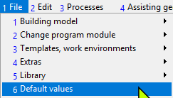
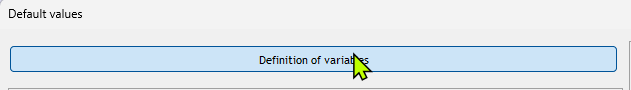
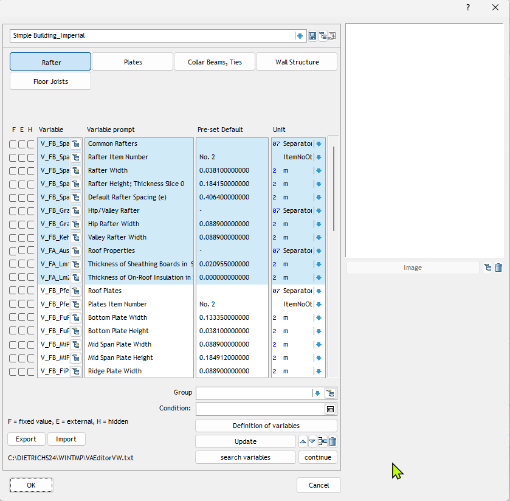
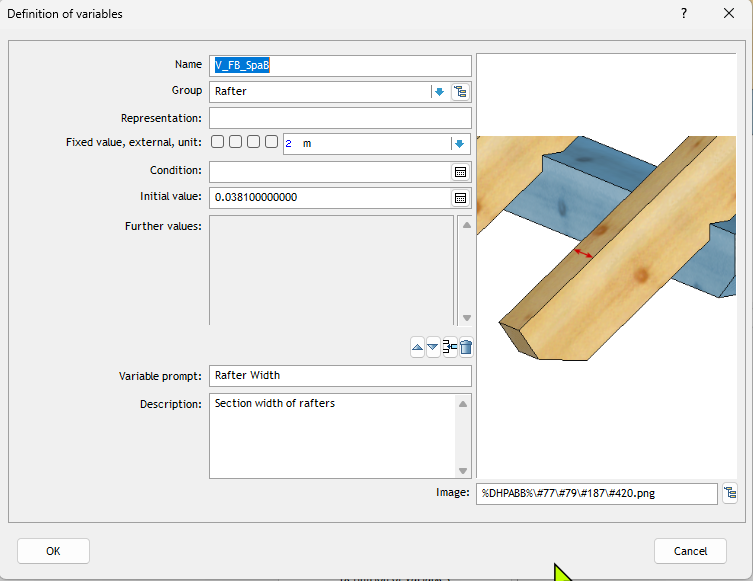

# User-Defined Variables in Dietrich's

## Overview
User-defined variables allow custom values to be created and used throughout projects. They can be defined at project or building level and provide flexibility for custom workflows.

### Use Cases
1. Project Management
- Custom project identifiers
- Client-specific information
- Project phase tracking
2. Custom Properties
- Special material characteristics
- Non-standard dimensions
- Project-specific parameters
3. Process Control
- Workflow state indicators
- Quality control checkpoints
- Custom automation parameters
- Technical Explanation

### Scaope
User variables can be:
- Defined at project or building level
- Given default values
- Updated as needed 
- Used in combination with system variables
- Referenced in various contexts
- Define in project administration
- Available across all positions
- Define for specific buildings
- Local to building context

### Experimentation Guide
1. Variable Creation
- Create project variables
- Test building-specific variables
- Experiment with different variable types
2. Variable Usage
- Use in labels and documentation
- Combine with system variables
- Test in different contexts
3. Process Implementation
- Create workflow tracking variables
- Implement quality control variables
- Test automation scenarios

## Tutorial

### Browsing Existing User - Variables

The follwoing steps show how you can browse the existing variables in your sytem.

1. Go to File>> Default Values (Option 1-6)

2. In the next screen click on"Definition of variables"

3. In the following screen you will see predefined variables. The screen will depend on the state of your system. 

4. Click on any one variable and you will see how it has been defined in the system. In this example we see a variable for "Rafter Width."

