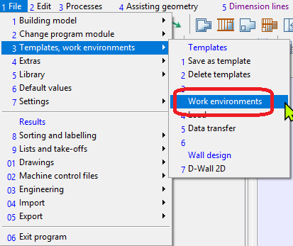

# Work Enviroment

## Introduction

The "Work Environment" in Dietrich's represents your program settings such as the toolbars, designs, engineering templates, machines settings and other general settings.

## Use Cases

This feature is used when you wish to create a company wide setting which can be shared amongst your team. It can also be used to share client settings.

## Prerequisites

A basic understanding of the program.

## Instructions

Please follow-along with the video or alternatively the steps below.



## Saving an Existing Work Environment 

This function is used to backup your existing workenvironment as a backup or to exchange it with your colleagues.

1. Go to File>> Templates >> Work Environment (Option 1-3-5)

2. Select some or all of your settings in the left pane.
3. Click on  to create the new work environment.
4. Move the selected items to the right pane.

## Loading an existing work environment
1. Go to File>> Templates >> Work Environment (Option 1-3-4)

2. Select the work environment
3. Select the settings and toolbars you wish to import.