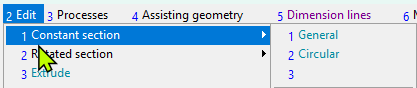
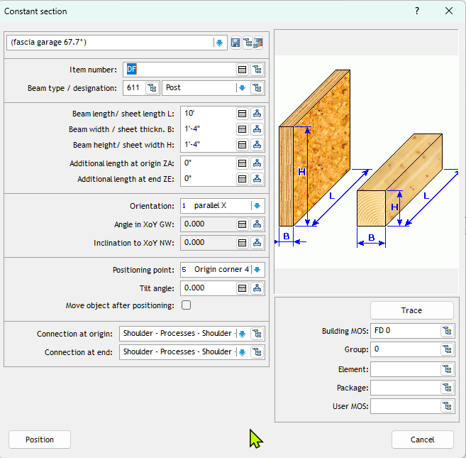

**Drawing 3D Elements & Tools Tutorial**

**Understanding Drawing Elements & Tools**
Drawing 3D elements form the foundation of any architectural drawing. Whether you're creating a simple floor plan or detailed construction documents, mastering these tools is essential. 

In this we shall explain how to draw a beam. Other objects can be drawn using the same principles. 

**Drawing Tools**

**1. Drawing a Single Beam**
1. Go to the D-CAM/Freedesign Module. (Option 1-2-9)
2. Click on Edit>> Constant Section>> General or  enter option 2-1-1

3. A pop-up window will open as shown below:

4. Enter the following information
- Item Number. 
- Beam Type/ Designation
- The basic dimentions: Length, Width, Height.
- Orientation information: parallel to X or Y. 
- Positioning information: depth position, positioning point.
5. There are some other setting but they are not important at this point

** 2. Selecting a Single Beam** 
1. Go to Activate>> Single or Option 8-5
2. Click on one of the edges of the target. (Clicking on the face will not work.) 
3. Right click again to select the target.

** 3. Editing a Single Beam - Object Mode**
1. Select the beam as in the step above. 
2. Go to Edit and select the function required.

**6. Edit and Adjust Elements - Function Mode**
1. Enter Function - such as copy, rotate etc.
2. Select Objects
3. Complete modification
4. Right click to finish

**Essential Workflow Concepts**
1. Use either "Function First" or "Object First" mode
2. The Assistant Menu (Middle Mouse Button) provides precise snap points
3. Save commonly used elements to library
4. Use grid snap and object snap for accurate placement
5. Learn keyboard shortcuts for efficiency 