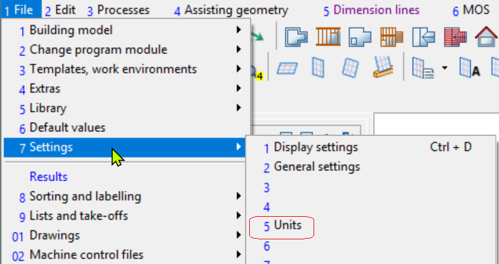
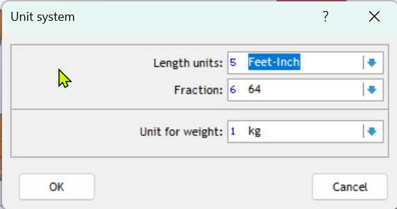
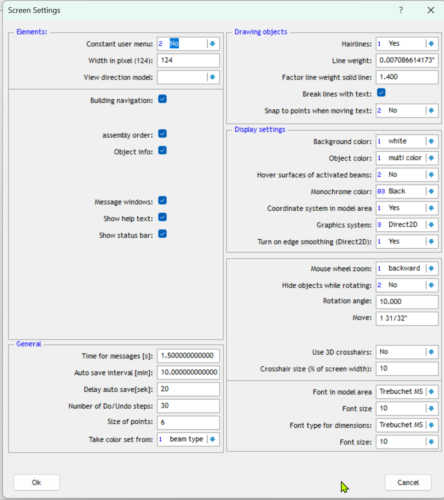

# Basic Settings

Review the setting below to ensure they are set as per your requirements
### Unit Setting

1. Go to File>> Settings>> Units or Option 1-7-5.

2. You will see the pop-up window as in the screenshot below.

3. Select the appropriate units.
### Snap Settings
All snap setting should be enabled unless your situation is different.
1. Select File>Setings>Object Snap or Option 1-7-02
2. Enable all snap options.

### Screen Settings
Screen settings help tailor the program to your preferences. 
You can adjust fonts, cursor types, graphics system, background and foreground colours and so forth.
1. Access screen settings from File>> Settings>> General settings or Option 1-7-2.

