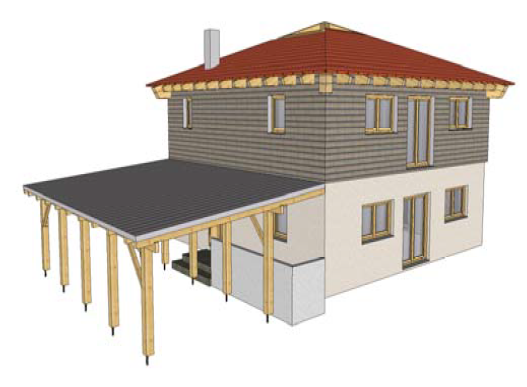

# About Dietrich's

##

## The Software

* The construction software (7 modules) is used to design a 3D model of the building.

<figure><figcaption></figcaption></figure>

*   In the Output programs the data of the 3D model is used to create drawings, lists and machine files&#x20;

    <figure><figcaption></figcaption></figure>

## Floor Plan

The ground plan defines the external shape of the building. In a 2D environment, wall bodies with openings are created.

## Wall Design

## Floor Deck

## Floor Design

## Roof Calculation

This module calculates the roof lines that define the shape of the roof.

## Roof Design

The roof timbers are automatically placed, according to the previously calculated roof shape

## D-CAM: Free Design
