# Dach Help

## Bauwerk, Modellbereiche

### Bauwerke

Ein Projekt kann aus mehreren Positionen bestehen. Die Positionen 'Bauwerk' können dabei ganze Gebäude inklusive aller Wände, Decken, Dächern und frei konstruierter Anbauten enthalten. Sie können aber auch aus nur einem Dach, einer Wand oder einer Balkenlage bestehen. Wurde nur in der 'Freien Konstruktion' gearbeitet, kann die Bauwerks-Position eine ganze Brücke sein, oder aber auch nur ein einzelner Beschlag.

### Modellbereiche

Im Bauwerk sind alle Bereiche eines Gebäudes und die Freie Konstruktion in einem Modell vereinigt. Jedes Bauteil, z.B. der Pfosten einer Wand, hat alle Möglichkeiten eines Bauteiles der Freien Konstruktion. Mit jedem Bauteil alles machen zu können ist ein großer Vorteil, jedoch arbeitet man nur dann effektiv, wenn die Eingaben auf die spezielle Situation des Bauteiles zugeschnitten sind. Warum soll man für den Pfosten einer Wand 3-dimensionale Koordinaten eingeben, wenn doch ein Pfosten immer senkrecht in einer Wand steht und parallel zu deren Außenflächen ist; es genügt doch, in der Wand ein Längsmaß einzugeben. Diese speziellen Eingabemöglichkeiten sind in den Modellbereichen zusammengefasst.

In der aktuellen Version sind folgende Modellbereiche verfügbar:

**Grundriss**: Zur Eingabe der Wände, Fenster und Türen im Grundriss.

**Wandkonstruktion**: Stäbe und Platten können in die Wände eingegeben werden. Die Lagenkonturen der Wände können angepasst werden.

**Deckenfeld**: Deckenebenen können, wahlweise durch Übernahme einer Grundrisskontur, in verschiedenen Stockwerken definiert und mit Ausführungen versehen werden

**Deckenkonstruktion**: In Deckenfeldern können konstruktive Deckenbauteile und Deckenbeplankungen erstellt und im Detail bearbeitet werden

**Dachausmittlung**: Hier kann zunächst eine Hauskontur, wahlweise aus der Übernahme eines Grundrisses, erzeugt werden. An die Kontur werden die Dachattribute gehängt und das Dach damit ausgemittelt.

**Dachtragwerk**: Es wird die klassische Dachtragwerkseingabe gestartet. Die Dachausmittlung wird dabei automatisch übergeben.

**Gaube**: Im Modellbereich 'Gaube' werden Gauben ausgemittelt und das Gaubentragwerk eingegeben. Außerdem können die Hauptdachöffnungen und Gaubenwände eingegeben werden.

**Stabwerkskonstruktion**: In der Stabwerkskonstruktion können Stabwerke über vertikale und ggf. auch freie Ebenen eingegeben werden. Dieser Modellbereich ist besonders für Binder, Konsolen, Pfosten unter beliebigen Hölzern und ähnliches geeignet.

**Freie Konstruktion**: DICAM: Erstellung neuer Bauteile oder Weiterbearbeitung der Bauteile, die in den anderen Modellbereichen erzeugt wurden. Hier sind besonders flexible Eingaben möglich

Jedes Bauwerk wird wieder in dem Modellbereich geöffnet, den man zuletzt in diesem Bauwerk bearbeitet hat. Wir gehen davon aus, dass die allermeisten Bauwerke mindestens einen Grundriss haben, und das die Eingabe mit diesem beginnt.

Zwischen den Modellbereichen wechselt man mit den Funktionen im Menü 'Datei Operationen - Modellbereich'.

### Dateioperationen

Im Menü 'Datei - Modelle' sind die Dateioperationen für das ganze Bauwerk. Unabhängig von dem Modellbereich in dem eine solche Funktion (speichern, speichern als) ausgelöst wird, betrifft sie immer das ganze Bauwerk.

Die Funktionen 'Datei - Modelle - Auslagern' und ' .. - Einfügen' sind nur im Modellbereich 'DICAM: Freie Konstruktion' verfügbar. Es können nur Bauteile der Freien Konstruktion ausgelagert und eingefügt werden.

## Messfunktionen

Die Messfunktionen von DICAM können Sie jederzeit über das Hilfsmenü aufrufen.\
Das Hilfsmenü erhalten Sie, indem Sie in einer Dialogbox den Messen Schalter wählen. Wenn keine Dialogbox geöffnet ist, können Sie das Hilfsmenü auch aufrufen, indem Sie die mittlere Maustaste drücken oder die Shift-Taste gedrückt halten und die rechte Maustaste drücken. Damit, bei einer Maus mit drei Taste, die mittlere Taste richtig reagiert, müssen Sie diese Taste in der Konfigurationssoftware Ihrer Maus auch als mittlere Taste einstellen.

Umfangreichere Informationen zu den Messfunktionen erhalten Sie in der allgemeinen Hilfe. Diese rufen sie in jedem Modellbereich im Hilfemenü auf.

## Arbeitsumgebung

Die Arbeitsumgebungen sind im Handbuch 'Hilfe allgemein', das über das Hilfe-Menü aufgerufen werden kann.

## Dachausmittlung

### Datei - Einstellungen

#### Datei - Einstellungen - Darstellung

Die Dialogbox teilt sich in mehrere Einstellungsbereiche:

**Dach**: Die Einstellungen für die Darstellung der Dachelemente betreffen automatisch alle vorhandenen Dächer. Die angezeigten Elemente können für die Darstellung ein- und ausgeschaltet werden.

**Lagenkonturen / Flächenbereiche**: Hier stellt man ein, für welche Lage die [Flächenbereiche](DachHelp.md#vordachbereiche) angezeigt werden sollen.

**Stockwerk**: In der Liste kann ausgewählt werden, welche Stockwerke angezeigt werden sollen. Darunter wird für diese Stockwerke eingestellt, welche Elemente angezeigt werden sollen.

**Freie Konstruktion**: In diesem Bereich der Dialogbox können die Bauteile und die Hilfsgeometrie (Hilfslinien) aus der Freien Konstruktion und die Kamine ein- und ausgeschaltet werden.

Alle Einstellungen für die Darstellung betreffen nur den Modellbereich Dachausmittlung.

#### Datei -- Einstellungen -- Iconleiste

In dieser Funktion lassen sich die auf dem Bildschirm unterhalb der Menüzeile dargestellten Symbolleisten schalten und die darin enthaltenen Befehle bearbeiten. Außerdem lassen sich mit der Funktion 'Neu' alle im Modellbereich vorhandenen Befehle in eigenen Symbolleisten zusammenstellen. Die Standardsymbolleisten, wie Sie nach der Installation des Programms angezeigt werden, enthalten alle Standardbefehle der einzelnen Modellbereiche.

Eine neue Symbolleiste enthält keine Befehle. Über 'Funktion' im Feld 'Hinzufügen' wird der Funktionsrecorder gestartet, mit dem der gewünschte Befehl aus den Menüs abgegriffen wird und der automatisch das entsprechende Schaltflächensymbol in die Symbolleiste einfügt. Jeder neue Befehl wird an das Ende der gewählten Symbolleiste zugefügt und kann mit den Schaltern '<'/'>' in der Symbolleiste bewegt werden. Zum Entfernen eines Befehles aus der Symbolleiste wird zuerst der gewünschte Befehl gewählt und dann mit 'Entfernen' gelöscht.

Jede einzelne Symbolleiste hat, abhängig von ihrer aktuellen Position auf dem Bildschirm, am linken oder oberen Anfang einen Griff. Durch Klick auf diesen Griff kann, mit gedrückter Maustaste (i.d.R. linke Maustaste), jede Symbolleiste frei an den Bildschirmrändern platziert werden.

#### Datei - Einstellungen - Grenzwerte, Bearbeitungen

Für den Modellbereich 'Dachausmittlung' gibt es verschiedene 'Grenzwerte' und Einstellungen:

**Max. Länge freier Brettenden:** Auf Grund der Vordachbereiche kann ein Schalungsbrett oder eine Platte über den Sparren nach innen überstehen. Wenn der Überstand größer ist als hier eingestellt, wird das Brett oder die Platte verlängert, bis sie auf dem nächsten Sparren aufliegen.

**Zusätzliche Falzbreite:** Wenn Bretter oder Beplankungen nur teilweise auf einem Sparren aufliegen (z.B. bis zur Mitte), und in der Sparrenlage liegen, entsteht bei der Berechnung der Sparrenbearbeitungen ein Falz. Dieser Falz wird um das hier eingestellte Maß breiter erzeugt.

**Zusätzliche Länge Ausklinkung:** Wenn Bretter oder Beplankungen auf einem Sparren aufliegen, und in der Sparrenlage liegen, entsteht bei der Berechnung der Sparrenbearbeitungen eine Traufschalungsausklinkung. Diese wird um das hier eingestellte Maß länger erzeugt.

**Min. nicht bearbeitete Länge:** Wenn ein Sparren eine Traufschalungsausklinkung bekommt und der nicht ausgeklinkte Teil des Sparrens ist kürzer als der hier eingestellte Wert, wird der Sparren "vollständig ausgeklinkt". Das bedeutet, er wird abgesenkt.

**Rundung Querschnittshöhe bei Absenken:** Wenn die Schalung über die volle Länge eines Sparrens verläuft, wird der Sparren um die Schalungsdicke abgesenkt und um das selbe Maß schwächer gemacht. Da dadurch Querschnitte entstehen würden, die nicht praxisgerecht sind, kann man hier einen Wert eingeben, auf den die Sparrenhöhe wieder aufgerundet wird. Ein Wert von 0.020m rundet zum Beispiel immer auf ganze 2 Zentimeter (0.180, 0.200, 0.220, usw.). Wenn man 0.000 eingibt, ist die Rundung ausgeschaltet.

**Minimale Ziegellänge:** Wenn das Ziegelstück kürzer sein müsste als hier eingestellt, um noch auf die Dachfläche zu passen, wird es nicht mehr erzeugt.

**Minimale Ziegelbreite:** Wenn das Ziegelstück schmäler sein müsste als hier eingestellt, um noch auf die Dachfläche zu passen, wird es nicht mehr erzeugt.

**Minimale Lattenlänge:** Lattenstücke, die kürzer sind als hier eingestellt, werden nicht erzeugt.

### Datei - Import - DXF-Linien

Mit dieser Funktion können 2D-DXF-Zeichnungen eingelesen werden. Sie können so als Eingabehilfe für die Hauskontur genutzt werden. Die DXF-Zeichnung kann beim Einfügen frei positioniert werden. Wenn man vor dem Einlesen ein FKS (Freies Koordinatensystem) eingestellt hat, kann man die DXF-Zeichnung noch einfacher positionieren und drehen.

Nach der Auswahl der einzulesenden DXF-Datei kann man einen Einlesefaktor eingeben. Die Einheit, in der die DXF-Datei erzeugt wurde (z.B. Zentimeter) muss nicht unbedingt mit der Einheit in der Grundrisseingabe übereinstimmen (z.B. Meter). Damit die DXF-Datei trotzdem in der richtigen Größe eingelesen wird, kann man den notwendigen Einlesefaktor eingeben (in unserem Beispiel: 0.01). Da man nicht immer die Einheit kennt, in der die DXF-Datei erzeugt wurde, gibt das Programm die Maximalabmessungen der DXF-Zeichnung in X-, Y- und Z-Richtung an.

In der danach erscheinenden Dialogbox wählt man den Punkt der DXF-Zeichnung, der positioniert werden soll. Danach kann man diesen Punkt in der Grundrisseingabe platzieren.

### Dacheingaben - Allgemein

#### Profileingaben

Über die Funktion ‚Profileingaben' kann man neue Profile anlegen oder bestehende Profile bearbeiten und löschen. Zum Anlegen neuer oder zum Bearbeiten vorhandener Profile wird das Profilprogramm gestartet.

#### Dacheingaben - Dachflächenausführung

Im System können Ausführungen für Dachflächen definiert werden. Beim Erzeugen einer Dachfläche durch die Dachausmittlung werden aus der Ausführung unterschiedliche Informationen übernommen. Alle diese Werte werden dann in der Dachfläche gespeichert. Eine nachträgliche Änderung der Ausführung wird nicht automatisch auf die Dachflächen übertragen, die bereits ausgemittelt wurden.

Nach Aufruf der Funktion ‚Dachausmittlung -- Dachflächenausführung verwalten' öffnet sich die Dialogbox zum Definieren von Dachflächenausführungen.

Mit der Auswahlliste am oberen Rand der Dialogbox kann man bestehende Einstellungen auswählen. Mit dem Icon mit Diskette man die aktuelle Einstellung mit demselben Namen oder einem neuen Namen speichern. Über das Verwaltungsicon können neue Ausführungen, auch durch Übernahme bestehender Dachflächenausführungen erzeugt werden, bestehende Ausführungen geändert oder gelöscht werden. Siehe dazu 'Einstellungen speichern' im Handbuch 'Hilfe Allgemeinen'.

Für jede Ausführung können folgende Werte eingestellt werden:

**Aufbau**

**Ausführung**: Hier kann ein Name der Ausführung vergeben werden.

**\[Lagen:]{.underline}**

Für jede Lage können mehrere Einstellungen gemacht werden.

**Identnummer**: Jede Lage bekommt eine Lagen-Identnummer. Diese Identnummer gibt der Lage einen Namen, der auch im Aufmaß angezeigt wird. Außerdem weißt sie der Lage verschiedene Informationen wie das Texturset oder Daten für die Lastannahme bei statischen Berechnungen zu. Zur Auswahl der Identnummer steht ein entsprechender Browser zur Verfügung.

**Belegung**: Je nach verwendeter Kennung (siehe unten: Z, S, I,...) kann man für jede Lage eine bestimmte Belegungseinstellung auswählen. Für die Ziegellage ist dies eine Ziegeleinstellung, für die Lattungslage (immer automatisch unterhalb der Ziegellage) eine Lattungseinstellung und für alle anderen Lagen eine Einstellung für die Ermittlung von [Schalung oder Beplankung](DachHelp.md#schalungen-und-beplankungen---einstellungen---verwaltung-der-einstellungen).

**Dicke**: Es werden die Lagendicken eingegeben. Bei einer Änderung wird die gesamte Dachdicke automatisch angepasst. Die Lage 0 sollte die Hauptlage (Sparrenlage) der Dachfläche sein. Die Lagen ‑1, -2 usw. liegen dann zur Oberseite, die Lagen 1, 2 usw. zur Unterseite der Dachfläche.

**Z**: Das ‚Z' steht für Ziegellage. Wenn eine Lage als Ziegellage gekennzeichnet ist, wird diese Lage auch als Ziegellage in den Aufmassdaten angegeben. Außerdem können nur in einer Ziegellage Ziegel eingegeben werden. Wenn eine Ziegellage festgelegt wird, ist automatisch die darunter liegende Lage die Lattungslage. Diese bekommt als Kennzeichnung ein graues Häkchen.

**S**: Das ‚S' steht für Schalungslage. Schalungslagen werden im Aufmaß besonders ausgegeben (als Schalungsfläche).

**I**: Das ‚I' steht für Isolationsaufmaß. Für Lagen mit der Kennung ‚I' werden Isolationsflächen und Isolationsvolumen im Aufmaß ausgegeben.

**F**: Das ‚F' steht für Flächenaufmaß. Die Flächen der Lagen mit der Kennung ‚F' werden im Aufmaß noch mal gesondert im Lagenaufmaß angegeben.

**V**: Das 'V' steht für Vordachbereiche erhalten. Bis einschließlich Version 10 waren die Vordachbereiche (=Dachbereich außerhalb der Außenwände) der Kernlagen nicht von den Außenwänden weggeschnitten worden (siehe nächsten Absatz) und die Nicht-Kernlagen unterhalb der Kernlage haben automatisch an der Innenseite der Außenwand geendet. Wenn man den Haken im Feld 'V' setzt bleiben die Vordachbereiche der dieser Nicht-Kernlagen auch erhalten. Im Unterschied zu den Kernlagen wird aber der Streifen, der von der Außenwand durchdrungen wird, aus der jeweiligen Lage ausgeschnitten.

**K**: Mit der Kennung ‚K' für Kernlage kann man die Verschneidung der Lagen mit den Wänden beeinflussen. Kernlagen werden nicht von einer Wand zurückgeschnitten, sie laufen immer bis zum Dachüberstand, auch wenn sie dafür durch eine Wand durchlaufen müssen. Alle Nicht-Kernlagen (= Schalen) unterhalb der Kernlagen werden bis zur Innenkante der Außenwand zurückgeschnitten. Alle Schalen oberhalb der Kernlagen laufen bis zum Dachüberstand.

**PL**: Die Kennung ‚PL' steht für Platte. Hier kann eingestellt werden, ob für die entsprechende Lage eine Platte erzeugt werden soll oder nicht. So ist es zum Beispiel sinnvoll für die Lage keine Platte zu erzeugen, da in dieser Lage die Sparren eingegeben werden. Beim Visualisieren sollen die Sparren auch sichtbar sein und keine Platte, welche die Lage repräsentiert. Für die Schalungslage ist es wiederum sinnvoll, eine Platte zu erzeugen, damit die Schalungsfläche auch bei einer Visualisierung sichtbar wird.

**Schichtbereiche für EnEV:** Mit diesem Button wechselt man in eine weitere Dialogbox für die Eingabe der Schichtbereiche, die in einer Dachfläche auftreten können. Diese Dialogbox ist im Kapitel [Schichtbereiche für EnEV](DachHelp.md#schichtbereiche-für-enev) beschrieben.

**Durchdringungen**

**Außenwände laufen von unten bis Lage**: Die Wände werden automatisch mit den Dachflächen verschnitten, sobald sie Kontakt mit einer Dachfläche haben. Hier kann man angeben, bis zu welcher Lage die Außenwände laufen sollen. Alles was über die Unterkante der hier eingestellten Lage heraussteht wird weggeschnitten.

**Innenwände laufen von unten bis Lage**: Auch die Innenwände werden automatisch mit der Dachhaut verschnitten. Für die Innenwände kann eine eigene Einstellung gemacht werden, da sie häufig anders verschnitten werden sollen als die Außenwände.

**Gaubenwände laufen von oben bis Lage**: Auch die Gaubenwände werden automatisch mit der Dachhaut verschnitten. Im Gegensatz zu den Außen- und Innenwänden werden sie von oben auf die Dachfläche geschnitten.

**Normale Decken laufen bis Lage**: Für die Decken kann man einen Deckentyp 'Zwischendecke' oder 'Grenzdecke' einstellen. Hier wird angegeben, bis zu welcher Lage der Dachfläche die Zwischendecken laufen sollen. Siehe dazu auch Abschnitt '[Verschneidung der Decken- und Dachlagen](DachHelp.md#verschneidung-der-decken--und-dachlagen)'.

**Grenzdecken laufen bis Lage**: Für die Decken kann man einen Deckentyp 'Zwischendecke' oder 'Grenzdecke' einstellen. Hier wird angegeben, bis zu welcher Lage der Dachfläche die Grenzdecken laufen sollen. Siehe dazu auch Abschnitt '[Verschneidung der Decken- und Dachlagen](DachHelp.md#verschneidung-der-decken--und-dachlagen)'.

**Knicklage für Flächenbereiche**: Hier wird die Lage festgelegt, ab der die Trennung der Flächenbereiche (Vordachbereich -- Ausgebauter Bereich) winkelrecht weiterlaufen soll. Siehe auch Kapitel '[Vordachbereiche](DachHelp.md#vordachbereiche)'.

**\[Unterbrechung der Lagen durch Wände]{.underline}**

Mit dieser Einstellung kann man die Durchdringung der Dachlagen mit den Wandlagen noch feiner steuern:

**Dachlagen**: In diesem Feld gibt man die Dachlage an, für die man eine detailliertere Einstellung machen möchte.

**Wandtyp**: Die Einstellung gilt für einen bestimmten Wandtyp, den man hier auswählt. So kann man steuern, ob die Einstellung für alle Außenwände, nur für die Traufwände oder evtl. nur für die Ortgangwände gelten soll. Für die Innenwände gibt es dieselben Optionen.

**Lage, Offset**: Über zwei Lagennummern kann man den Wandbereich definieren, in welchem die Dachlagen ausgeschnitten werden sollen. Über das Offset kann dieser Bereich auch noch so verschoben werden, dass eine Dachlage auch innerhalb einer Wandlage endet.

**Linienausführungen etc.**

**Linienausführung:** Für die verschiedenen Linientypen können Linienausführungen eingestellt werden. Diese dienen als Voreinstellung, wenn eine Dachfläche mit dieser Dachflächenausführung von einer Linie mit einem dieser Linientypen begrenzt wird. So bekommt eine Traufe automatisch die hier eingestellte Ausführung, wenn eine Dachfläche mit dieser Dachflächenausführung ausgemittelt wird. Die Linienausführung einer Linie kann jederzeit nachträglich geändert werden.

**Dachvorlauf**: Jeder Dachfläche kann über die Ausführung von vorneherein eine Datei für den Dachassistenten zugeordnet werden. Diese Datei kann später jederzeit geändert werden. Im Modellbereich ‚Dachtragwerk' kann die Dachfläche mit dem Dachassistenten sofort belegt werden.

**Verschneidung der Decken- und Dachlagen**

Die Lagen der Decke und der Dachflächen verschneiden sich nach folgenden Regeln automatisch miteinander:

* Wir unterscheiden sichtbare und nicht sichtbare Dachstühle. Ein Dachstuhl ist nicht sichtbar, wenn unterhalb der Lage 0 (Sparren) eine Lage mit einer Dicke größer 0.0 ist.
* Die Kernlagen des Daches laufen immer durch und werden nie begrenzt.
* Die Kernlagen der Decke laufen bis an die Lage, die in der Dachflächenausführung eingestellt wurde. Diese Einstellung kann für Grenzdecken und Zwischendecken unterschiedlich gemacht werden.

Sichtbare Dachstühle:

* Die Schalen der Decke laufen bis an die Lage, die in der Dachflächenausführung eingestellt wurde. Diese Einstellung kann für Grenzdecken und Zwischendecken unterschiedlich gemacht werden.

Nicht sichtbare Dachstühle:

* Die Schalen oberhalb der Kernlagen der Decke enden an der untersten Schale des Daches.
* Die unteren Schalen der Decke enden an der untersten Schale des Daches.
* Die unteren Schalen des Daches enden an der Kernlage einer Grenzdecke. Bei einer Zwischendecke werden sie durch die Kernlagen der Decke unterbrochen.

Zur Verdeutlichung siehe nachfolgende Skizze:

Die Kernlagen wurden grau eingefärbt.


Dachausführung:

***

Lage Kernlage Isolation Schalung Ziegel Knicklage Grenzdecke läuft bis

***

-5 X

-4 X

-3

-2 X

-1 X X X X

0 X

## 1

Deckenausführung, Grenzdecke:

***

Lage Kernlage Isolation

***

-3

-2 X

-1 X

0 X

## 1

#### Schichtbereiche für EnEV <a href="#schichtbereiche-fur-enev-.formatvorlage-uberschrift-4--vor-12-pt.-nach-0-pt.-zeilenabstand-m" id="schichtbereiche-fur-enev-.formatvorlage-uberschrift-4--vor-12-pt.-nach-0-pt.-zeilenabstand-m"></a>

**Allgemeines**

Für die U-Wert Berechnung müssen die bauphysikalischen Werte der einzelnen Materialien (Wärmeleitfähigkeit, mü-Wert oder bei Folien sd-Wert) in dem Bauteilkatalog hinterlegt sein. Mit der aktuellen Datenbank liefern wir bereits eine große Auswahl an Materialien (Lagen), deren physikalische Werte eingepflegt sind.

**1.2 U-Wert Berechnung**

Wenn Sie eine Ausführung (Wandaufbau, Deckenaufbau, Dachaufbau) anlegen, ist bei der Auswahl der Identnummer darauf zu achten, dass bei den gewählten Materialien die entsprechenden Informationen für die Berechnung (physikalische Werte) hinterlegt sind. Eine Kontrolle hierüber erhalten Sie bei dem Zugriff auf den Bauteilkatalog. Die bauphysikalischen Werte werden in der „Lageninfo" angezeigt. Wenn die Ausführung fertig definiert ist kann für die U-Wert Berechnung der Knopf „Schichtbereiche für EnEV" gewählt werden.

In der Dialogbox „Schichtbereiche" werden die Lagen aus dem Aufbau in den „Schichtbereich 1" übernommen. Wenn es sich um einen inhomogenen Aufbau handelt (Holzständerwand, Sparren in der Dämmebene, gedämmte Deckenbalkendecke), sind die Materialien in dem Schichtbereich 2 mit dem Anteil in % zu ergänzen (z.B. Lage „Null"; Schichtbereich1 -- Dämmung Anteil 85%; Schichtbereich2 -- Sparrenlage Anteil 15%). Die Dämmebene sollte immer in dem Schichtbereich 1 definiert werden, so dass der Aufbau auch direkt in der Statik verwendet werden kann (In der Statik wird die Last der Dämmung aus dem Schichtbereich 1 ermittelt, die Last für den Sparren - Eigengewicht - wird aus dem Material und dem Querschnitt ermittelt). Der errechnete resultierende U-Wert wird in W/m²K rechts oben in der Dialogbox angezeigt. An dieser Stelle soll darauf hingewiesen werden das die U -- Wert Berechnung von Hand nicht nachrechenbar ist. Unser Rechenverfahren berücksichtigt eine genaue Betrachtung der Wärmeverluste über die Unstetigkeitsstellen in dem Wandaufbau, was händisch nicht zu berechnen ist.

**Glaser Diagramm**

Das Glaser -- Diagramm kann in der Dialogbox der U -- Wert Berechnung aufgerufen werden. Über die oberen Reiter können Sie die unterschiedlichen Bereiche der Berechnung aufrufen.

Der „Temperaturverlauf" zeigt Ihnen die jeweilige Temperatur in dem Schichtaufbau an. Achten Sie darauf welcher Schichtbereich gerade aktuell zu sehen ist. Die Schichtbereiche können Sie über den Knopf am unteren Bildschirmrand wechseln.

Unter dem Punkt „Tauperiode" geschieht die Prüfung auf innere Tauwasserniederschläge. Es werden die Kurven des Wasserdampfdruckes und des Sättigungsdampfdrucks miteinander verglichen. Tauwasser fällt aus, wenn der Wasserdampfteildruck im Innern eines Bauteils den Wasserdampfsättigungsdruck erreicht. Die Stelle oder der Bereich des Tauwasserausfalls wird mit grünen Pfeilen gekennzeichnet. Wenn Sie das Diagramm in einem Nachweisdokument hinterlegen möchten, können Sie mit Maus rechts das Diagramm auswählen und in die Zwischenablage kopieren. Aus der Zwischenablage heraus kann das Diagramm in ein beliebiges Dokument eingefügt werden.

Die Berechnung der „Verdunstungsmenge" erfolgt analog zu der Berechnung der Tauwassermenge. In dem Diffusionsdiagramm der Verdunstungsperiode werden die betroffenen Schichten des Tauwasserausfalls dargestellt.

In der „Berechnungstabelle" werden die einzelnen Schichten, die für die Berechnung berücksichtigt werden, zusammengefasst. Auch die Angaben für die Berechnung werden hier aufgezeigt.

In der „Auswertung" kann man die entstehende Tauwassermenge und Verdunstungsmenge sehen. Wenn die Verdunstungsmenge größer als die Tauwassermenge ist, ist der Nachweis für den tauwasserfreien Aufbau erbracht. Das Ergebnis der Berechnung steht in der Kopfzeile. In der Berechnung werden folgende Fälle unterschieden:

Fall a: Wasserdampfdiffusion ohne Tauwasserausfall im Bauteil

Fall b: Tauwasserausfall in einer Ebene

Fall c: Tauwasserausfall in zwei Ebenen

Fall d: Tauwasserausfall in einem Bereich

Die „Randbedingungen" (nach DIN) für die Berechnung sind unter dem letzten Menüpunkt „Randbedingungen" zu finden.

#### Dacheingaben -- Linienausführung

Im System können Linienausführungen für Dachflächen definiert werden. Beim Erzeugen einer Dachfläche durch die Dachausmittlung werden aus der Ausführung die Informationen für die Kantenausbildung übernommen. Alle diese Werte werden dann in der Dachfläche gespeichert. Eine nachträgliche Änderung der Ausführung wird nicht automatisch auf die Dachflächen übertragen, die bereits ausgemittelt wurden.

Nach Aufruf der Funktion ‚Dachausmittlung -- Linienausführungen verwalten' öffnet sich die Dialogbox zum Definieren von Linienausführungen.

Über das Verwaltungsicon können neue Ausführungen, auch durch Übernahme bestehender Linienausführungen erzeugt werden, bestehende Ausführungen geändert oder gelöscht werden. Siehe dazu 'Einstellungen speichern' im Handbuch 'Hilfe Allgemeinen'.

Für jede Ausführung können folgende Werte eingestellt werden:

**Ausführung**: Hier kann ein Name der Ausführung vergeben werden.

**Linientyp**: Es können Ausführungen für fünf verschiedene Linientypen angelegt werden. Hier wird der Linientyp eingestellt, für den die Ausführung verwendet werden soll.

**Offset**: Das Offset (O) ist das Maß um welches eine Lage gegenüber der vorherigen verspringt. Das Offset wird immer auf der Kante zwischen zwei Lagen gemessen.

**Winkel**: Hier kann der Winkel für jede einzelne Lage angegeben werden. Der Winkel bezieht sich, wie der Abschnittswinkel an einem Sparren, immer auf die horizontale. Eine waagerechte Kante bekommt 0.0Grad, eine lotrechte Kante bekommt 90Grad, aber in diesem Fällen ist es das einfachste, wenn man eine der angebotenen Optionen auswählt.


### Dacheingaben - Dachausmittlung

Dächer können mit verschiedenen Methoden erstellt werden. Eine klassische und in den meisten Fällen sehr gute Methode ist die Dachausmittlung. Bei der Dachausmittlung gibt man eine Hauskontur ein. Jeder Linie der Hauskontur weißt man die sogenannten [Dachattribute](DachHelp.md#dacheingaben-hausseite) zu. Mit dieser Information kann das Programm für jede Hausseite eine Dachfläche ermitteln, die sich bei dieser Ausmittlung auch gleich miteinander verschneiden. Nur bei dieser Gesamtbetrachtung aller Dachflächen können bestimmte Dachflächengeometrien ermittelt werden.

Gibt man mehrere Hauskonturen mit eigenen Dachflächen ein, verschneiden sich diese, je nach Vorgabe der Verschneidungspriorität automatisch miteinander (Verschneidungsmodul ist optional).

#### Dacheingaben - Neue Hauskontur

Eine Hauskontur ist die Basis für eine Dachausmittlung. Den Seiten der Hauskontur werden die Profilwerte für die Dachausmittlung zugeordnet. Üblicherweise entspricht die Hauskontur den Außenkanten der Außenmauern, kann aber auch völlig losgelöst davon definiert werden.

Jedes Bauwerk kann beliebig viele Hauskonturen enthalten, die sich auch gegenseitig überlappen können. Jede Hauskontur ist ein geschlossener, unabhängiger Linienzug.

Wenn sich Dachflächen aus verschiedenen Hauskonturen durchdringen, werden sie automatisch miteinander verschnitten. Mit der ‚Priorität für auto. Verschneidung' kann man beeinflussen, wir die Dachflächen miteinander verschnitten werden sollen. Die Verschneidungspriorität hängt an der Hauskontur und gilt für alle Dachflächen, die zu dieser Hauskontur gehören. Wenn eine Hauskontur eine Priorität von 0 hat, wird sie bei einer Verschneidung nicht berücksichtigt, so als ob sie nicht vorhanden wäre. Ab einer Priorität von 1 werden die Dachflächen verschnitten. Wenn beide Dachflächen die selbe Priorität haben werden Beide miteinander verschnitten. Sobald eine Dachfläche eine höhere Priorität (=kleinere Zahl) hat wird die andere Dachfläche auf die Dachfläche mit der höheren Priorität geschnitten. Die Dachfläche mit der höheren Priorität bleibt erhalten. (siehe auch [Verschneidungspriorität ändern](DachHelp.md#dachbearbeitung-ändern-verschneidungspriorität))

Es gibt die Möglichkeit, die Kontur manuell durch Eingabe einzelner Punkte zu erzeugen, über eine [Tabelle](DachHelp.md#dacheingaben-tabelle) einzugeben oder mit der Wandübernahme aus den vorhandenen Wandeingaben abzuleiten. Für die Wandübernahme muss das Stockwerk ausgewählt werden. Es kann zwischen den Kanten der Außenwände oder der Referenzachse als Basis für die Hauskontur gewählt werden. Hierzu muss die Kontur geschlossen sein.

#### Dacheingaben -- Hausseite

Mit der Funktion ‚Hausseite' wählt man mit der Maus eine oder mehrere Hausseiten und stellt dann in einer Dialogbox die Dachattribute (Profilwerte) ein:

**Seite Nr.**: Die Nummern der gewählten Seiten werden angezeigt.

**bezogene Seite**: Eine Hausseite kann auf eine beliebige andere Hausseite bezogen werden. Es muss nur die Nummer der Hausseite angegeben werden, auf welche sich die aktuelle Hausseite beziehen soll. Wenn die Bezugsseite parallel ist und in die selbe Richtung verläuft bekommt die Hausseite automatisch die selbe Dachneigung und die selbe Dachflächenausführung. Diese Felder werden dann gesperrt und können erst dann wieder geändert werden, wenn die Nummer für die Bezugsseite gelöscht wird. Die Traufhöhe wird automatisch an die Traufhöhe der Bezugsseite angepasst.

> Wenn die Bezugsseite nicht parallel ist oder nicht in die selbe Richtung verläuft, bekommt die Hausseite automatisch eine Dachneigung von 90°. Die Felder für die Dachflächenausführung, die Dachneigung und die Traufhöhe werden gesperrt.

**Profilposition**: Auf jeder Hausseite kann ein Profil übernommen werden. Profile können über die Eingabe der Positionsnummer ausgewählt werden. Mit dem Knopf am rechten Rand des Feldes kann man Profile aus einer Liste mit Vorschau auswählen, verändern oder neue Profile anlegen.

> Wenn man eine Profilposition auswählt werden die Dachneigung, der Dachüberstand, die Traufhöhe und die Ausführung aus dem Profil übernommen. Diese Felder werden daher gesperrt und erst nach dem Löschen der Positionsnummer wieder freigegeben.

**Ausführung**: Hier kann die Dachflächenausführung ausgewählt werden.

**Dachneigung**: Eingabe der Dachneigung. Mit dem Knopf am rechten Rand des Feldes kann die Dachneigung über einen Abstand im Grund und eine Höhe eingegeben werden.

**Dachüberstand**: Eingabe des Dachüberstandes auf dieser Hausseite.

**Traufhöhe**: Eingabe der Traufhöhe. Auch auf einer Giebelseite (Dachneigung= 90°) kann eine ‚Traufhöhe' eingegeben werden. Wenn man dieser Hausseite auch eine Ausführung zuweist, werden ab dieser ‚Traufhöhe' die senkrechten Lagenplatten erzeugt. So kann man die Aufmaßflächen auf einer Giebelseite bekommen.

**\[Dachbrüche:]{.underline}**

Mit dem Knopf ‚Dachbrüche >>' kann man die Dialogbox aufklappen, um Dachbrüche einzugeben. Es können bis zu 9 Knicke über ein Grundmaß oder eine Knickhöhe und eine Dachneigung definiert werden. Jede Dachfläche, die durch einen Dachknick entsteht, kann eine eigene Ausführung haben.

Unterhalb der Eingabetabelle gibt es zwei Hilfsfunktionen, mit denen man die Höhe des Dachknickes ermitteln kann.

#### Dacheingaben - Alle Hausseiten

Mit der Funktion ‚Alle Hausseiten' kann man allen Hausseiten mit einem Befehl die selben Dachattribute zuweisen. Die Einstellmöglichkeiten sind die selben wie in der Funktion ‚[Dacheingaben - Hausseite](DachHelp.md#dacheingaben-hausseite)'.

#### Dacheingaben -- Tabelle

Über die tabellarische Eingabe kann eine neue Hauskontur eingegeben oder eine bestehende bearbeitet werden.

**Bez. S.** : Eine Hausseite kann auf eine beliebige andere Hausseite bezogen werden. Es muss nur die Nummer der Hausseite angegeben werden, auf welche sich die aktuelle Hausseite beziehen soll. Wenn die Bezugsseite parallel ist und in die selbe Richtung verläuft bekommt die Hausseite automatisch die selbe Dachneigung und die selbe Dachflächenausführung. Diese Felder werden dann gesperrt und können erst dann wieder geändert werden, wenn die Nummer für die Bezugsseite gelöscht wird. Die Traufhöhe wird automatisch an die Traufhöhe der Bezugsseite angepasst.

> Wenn die Bezugsseite nicht parallel ist oder nicht in die selbe Richtung verläuft, bekommt die Hausseite automatisch eine Dachneigung von 90°. Die Felder für die Dachflächenausführung, die Dachneigung und die Traufhöhe werden gesperrt.
>
> Über den Knopf an der rechten Seite des Feldes kann die Bezugsseite mit der Maus gewählt werden.

**Länge**: Länge der Hausseite.

**Winkel**: Winkel zur nächsten Hausseite. Positive Winkel werden innerhalb der Hauskontur gemessen, negative Winkel außerhalb.

**Profil**: Auf jeder Hausseite kann ein Profil übernommen werden. Profile können über die Eingabe der Positionsnummer ausgewählt werden. Mit dem Knopf am rechten Rand des Feldes kann man Profile aus einer Liste mit Vorschau auswählen, verändern oder neue Profile anlegen.

> Wenn man eine Profilposition auswählt werden die Dachneigung, der Dachüberstand, die Traufhöhe und die Ausführung aus dem Profil übernommen. Diese Felder werden daher gesperrt und erst nach dem Löschen der Positionsnummer wieder freigegeben.

**Dachneigung**: Eingabe der Dachneigung. Mit dem Knopf am rechten Rand des Feldes kann die Dachneigung über einen Abstand im Grund und eine Höhe eingegeben werden.

**Dachüberstand**: Eingabe des Dachüberstandes auf dieser Hausseite.

**Traufhöhe**: Eingabe der Traufhöhe. Auch auf einer Giebelseite (Dachneigung= 90°) kann eine ‚Traufhöhe' eingegeben werden. Wenn man dieser Hausseite auch eine Ausführung zuweist, werden ab dieser ‚Traufhöhe' die senkrechten Lagenplatten erzeugt. So kann man die Aufmaßflächen auf einer Giebelseite bekommen.

**NÄ**: Es können bis zu 9 Dachknicke über ein Grundmaß oder eine Knickhöhe und eine Dachneigung definiert werden. Jede Dachfläche, die durch einen Dachknick entsteht, kann eine eigene Ausführung haben.

**Ausführung**: Hier kann die Dachflächenausführung ausgewählt werden.

### Dacheingaben - Direkte Dacheingabe

Bei einigen Dächern ist es nur mit großem Aufwand möglich, die Dachflächen mit der Dachausmittlung und -verschneidung in der erforderlichen Lage und Form zu erzeugen. Wir haben daher mit diesen Funktionen die Möglichkeit geschaffen, eine freie Dachfläche zu erzeugen ohne hierfür eine Hauskontur einzugeben.\
Unter einer freien Dachfläche verstehen wir eine Dachfläche die nicht durch die klassische Dachausmittlung entstanden ist. Die Dachfläche entsteht durch die Verschneidung einer 3D-Ebene mit einem Polygon (Linienzug) das in der XoY-Ebene eingegeben wird. Dieses Polygon in der XoY-Ebene nennen wir Dachkonturpolygon. Die freie Fläche selbst kann dann auf verschiedenen Wegen eingegeben werden.

Eine Freie Dachfläche wird nicht automatisch mit anderen Dachflächen verschnitten. Dachflächen von Gauben werden jedoch mit der freien Dachfläche verschnitten.

#### Dacheingaben - Dachkontur - Neues Dachkonturpolygon

Ein Dachkonturpolygon besteht aus mindestens 3 Punkten, kann aber sonst beliebig viele Punkte haben. Es können beliebig viele Dachkonturpolygone eingegeben werden. Aus jedem dieser Polygone entsteht je eine Dachfläche.

#### Dacheingaben - Dachkontur - Linie ersetzen

Es wird eine Linie eines Dachkonturpolygons angewählt. Sie wird dadurch durch zwei Gummibänder ersetzt: Vom Anfangspunkt zum Mauscursor und vom Mauscursor zum Endpunkt. Das gesamte Dachkonturpolygon ist also stets geschlossen. Mit der rechten Maustaste kann man zwischen dem Anfangspunkt und dem Endpunkt der ehemaligen Linie als Startpunkt für den neuen Linienzug wählen. Die ehemalige Linie kann nun durch einen beliebigen Linienzug ersetzt werden. Wenn die Eingabe mit rechter Maustaste beendet wird, wird automatisch die letzte Lücke durch eine Linie geschlossen.

#### Dacheingaben -- Dachkontur -- Linie schieben

Es wird eine Linie eines Dachkonturpolygons angewählt. Ein Pfeil zeigt die positive Schieberichtung an. Der Abstand, um den die Linie verschoben werden soll, kann eingegeben werden.

#### Dacheingaben- Dachkontur - Punkt schieben

Ein Eckpunkt eines Dachkonturpolygons kann gewählt und verschoben werden. Es bleiben also die beiden anschließenden Linien erhalten, werden jedoch in Richtung und Länge geändert.

#### Dacheingaben - Dachkontur - Punkt löschen

Wenn man Linien aus einem Dachkonturpolygon entfernen will, so werden dazu Eckpunkte gelöscht. Wird ein Punkt gelöscht, so werden die beiden anschließenden Linien durch eine Linie vom Startpunkt der ersten zum Endpunkt der zweiten ehemaligen Linie ersetzt.

#### Dacheingaben -- Dachkontur - Löschen Dachkonturpolygon

Es wird das gesamte Dachkonturpolygon inklusive aller Bauteile oder nur die Bauteile dies Polygons oder die Hilfsgeometrie gelöscht.

#### Dacheingaben - Freie Dachfläche

Mit der Funktion 'Freie Dachfläche' wird die Dachfläche, die zu einem vorher eingegebenen Dachkonturpolygon gehört eingegeben.

Wird die Funktion 'Freie Dachfläche' gewählt, muss zunächst ein Dachkonturpolygon gewählt werden. Dies kann sowohl in der XoY-Ansicht als auch in einer beliebigen Ansicht geschehen.\
Nach der Wahl des Dachkonturpolygons öffnet sich eine Dialogbox in der die Werte für die Dachfläche eingegeben werden können. Abhängig von den in der Dialogbox eingegebenen Werten können verschiedene Funktionen zum Erzeugen der Dachfläche gewählt werden.

Es können auch Dachkonturpolygone gewählt werden, die bereits eine Dachfläche haben. In diesem Fall bleibt die bereits bestehende Dachfläche solange erhalten, bis die neu Dachfläche erzeugt wird. Es ist also z.B. möglich, für das Bestimmen von Punkten für die neue Dachfläche, Punkte der alten Dachfläche zu wählen.

**3 Punkte**

Die Lage und Ausrichtung der Dachfläche wird über drei Punkte bestimmt.

Ist in der Dropliste die Option '3 Punkte' gewählt, müssen, nach dem Schließen der Dialogbox, die drei Punkte gewählt werden. Dies kann sowohl in der XoY-Ansicht als auch in einer beliebigen Ansicht geschehen. Nachdem ein Punkt gewählt wurde, werden die Koordinaten dieses Punktes in einer Dialogbox angezeigt.

In dem Feld 'Z-Koordinate' befindet sich ein Button. Wird dieser gewählt, wird die Dialogbox ausgeblendet und es kann ein Punkt für das Bestimmen der Z-Koordinate gewählt werden. Nachdem der Punkt gewählt wurde, wird der Wert in der Dialogbox angezeigt.\
Wird der Schalter 'Ok' gewählt, muss der nächste Punkt gewählt werden. Nachdem der dritte Punkt bestätigt wurde, wird die Dachfläche erzeugt. Anschließend kann das nächste Dachkonturpolygon gewählt werden.

**Profil**

Mit einem Profil wird die Dachneigung festgelegt. Zusätzlich muss eine Bezugslinie als Hauskante gewählt werden. Alternativ zur Bezugslinie kann die Sparrenrichtung mit einer beliebigen Linie bestimmt und mit einem Punkt die Position der theoretischen Hauskante festgelegt werden. Der Dachüberstand des Profils bleibt unberücksichtigt und die Traufhöhe aus dem Profil wird entsprechend angepasst.

Ist in der Dropliste die Option 'Profil' gewählt, muss, nach dem Schließen der Dialogbox, eine Bezugslinie für das Profil gewählt werden. Die Fallrichtung der Sparren ist dann senkrecht zu dieser Bezugslinie. Alternativ dazu, kann auch eine Linie für die Richtung der Sparren und ein Punkt für die Positionierung des Profils (Hauskontur) gewählt werden.\
Zur Auswahl der Eingabealternativen wird eine kleine Dialogbox mit zwei Schaltern angezeigt.

Wird der Schalter 'Bezugslinie als Hauskante für das Profil' gewählt, muss anschließend eine Linie gewählt werden. Diese Linie entspricht dann, für die Positionierung des Profils, der Hauskonturlinie einer normalen Dachausmittlung. Zur Auswahl der Linie wird die Darstellung in die XoY-Ansicht gedreht.\
Liegt die Linie auf der Grenze des Dachkonturpolygons, steigt die Dachfläche in Richtung des Zentrums des Polygons.\
Liegt die Linie innerhalb oder außerhalb des Polygons, sind zwei Steigrichtungen möglich. Zum Bestimmen der Steigrichtung wird in der XoY-Ebene ein roter Pfeil angezeigt. Dieser Pfeil gibt die steigende Richtung der Dachfläche an. Wird die zuerst angezeigte Richtung zwei mal abgelehnt, kann eine andere Linie als Bezugslinie für das Profil gewählt werden.

Wird der Schalter 'Sparrenrichtung und Punkt für die Hauskante' gewählt, muss zunächst auch eine Linie gewählt werden. Diese gibt nur die Sparrenrichtung an und kann daher an beliebiger Stelle gewählt werden. Nachdem die Linie bestätigt wurde, muss noch ein Punkt für die Position der Hauskante gewählt werden. Hierzu wird an der Maus eine Linie gezeichnet, die senkrecht auf der Linie für die Sparrenrichtung steht. Mit dem Punkt wird die Hauskante für das Profil positioniert. Die Hauskante steht immer senkrecht auf der Linie die die Richtung der Sparren angibt.

Für die Richtung der Dachfläche gilt das gleiche wie oben beschrieben.

**Dachneigung + 2 Punkte**

Ist in der Dropliste die Option 'Dachn. + 2P.' gewählt, müssen nach dem Schließen der Dialogbox, zwei Punkte gewählt werden. Dies kann in jeder beliebigen Ansicht geschehen. Nach der Wahl jedes Punktes werden die Koordinaten des Punktes in einer Dialogbox angezeigt. Hier wird die gleiche Dialogbox wie bei der Eingabe über '3 Punkte' verwendet.\
Nach der Eingabe des zweiten Punktes muss geprüft werden, ob es möglich ist, eine Fläche mit der angegebenen Neigung durch diese beiden Punkte zu legen. Sind zwei gültige Punkte gewählt, muss noch die Steigrichtung der Dachfläche bestimmt werden. Hierzu wird wie bei der Eingabe über ein Profil beschrieben verfahren.\
Nur wenn eine Linie die durch die beiden Punkte geht, zur XoY-Ebene bereits die Neigung der Dachfläche hat, wird nicht mehr nach der Steigrichtung gefragt.

**Dachneigung + 1 Punkt**

Ist in der Dropliste die Option 'Dachn. + 1P.' gewählt, muss nach dem Schließen der Dialogbox, noch ein Punkt gewählt, die Richtung der Sparren oder der Traufe und die Steigrichtung bestimmt werden. Der Punkt bestimmt die Höhenlage der Dachfläche. Nach der Wahl des Punktes, dies kann in jeder beliebigen Ansicht geschehen, wird die Darstellung in die XoY-Ansicht gedreht.

Nach der Wahl des Punktes werden die Koordinaten des Punktes in einer Dialogbox angezeigt. Hier wird die gleiche Dialogbox wie bei der Eingabe über '3 Punkte' verwendet.\
Nachdem der Punkt bestätigt wurde, muss eine Linie gewählt werden. Die Linie kann die Richtung der Sparren oder die Richtung der Traufe angeben. Zur Auswahl wird eine Dialogbox mit zwei Schaltern angezeigt.

Nachdem die Richtung der Sparren bzw. die Richtung der Traufe bestimmt wurde, muss noch die Steigrichtung der Dachfläche bestimmt werden. Hierzu wird wie bei der Eingabe über ein Profil beschrieben verfahren.

**Bezogene Dachfläche**

Mit dieser Funktion kann die Neigung, die Ausrichtung und die Höhenlage einer bestehenden Dachfläche übernommen und auf eine andere Dachkonturlinie übertragen werden.

Ist in der Dropliste die Option 'bezogene DF' gewählt, muss, nach dem Schließen der Dialogbox, eine vorhandene Dachfläche gewählt werden. Ist die Wahl der Dachfläche abgeschlossen, kann ein anderes Dachkonturpolygon gewählt werden. Die Dachflächen werden unabhängig voneinander erzeugt. Auch dann, wenn sich die beiden Dachflächen überschneiden oder die eine Dachfläche ganz in der anderen Dachfläche liegt.\
Die Dachflächen werden nicht vereint oder verschnitten.

**beliebige Punkte**

Ist die Option 'beliebige Punkte' gewählt, können beliebig viele Punkte gewählt werden, es müssen aber mindestens drei Punkte gewählt werden.\
Ist die Wahl der Punkte beendet, wird geprüft ob die Punkte in einer Ebene liegen. Liegen die Punkte in einer Ebene, wird die Dachfläche erzeugt. Liegen die Punkte nicht in einer Ebene, erscheint ein Hinweis und die Möglichkeit, die Dachfläche angenähert mittig zwischen die gewählten Punkte zu legen. Soll eine 'angenäherte Dachfläche' erzeugt werden, liegt diese in einer Ebene zu der alle gewählten Punkte einen möglichst geringen Abstand haben.

#### Dacheingaben - Direkte Freie Dachfläche

Mit dieser Funktion kann eine Freie Dachfläche erzeugt werden, ohne zuvor ein Dachkonturpolygon zu erzeugen.\
Nach der Wahl der Funktion öffnet sich eine kleine Dialogbox die nur eine Dropliste enthält. In der Dropliste kann die Dachflächenausführung für die Dachfläche gewählt werden.

Wird die Dialogbox mit den Schalter 'OK' geschlossen, können beliebige Punkte für die Dachfläche gewählt werden. Der Ablauf der Funktion entspricht dann dem der Funktion 'Freie Dachfläche', wenn dort in der Dropliste 'bestimmen der Dachfläche über' die Option 'beliebige Punkte' gewählt wurde. Nachdem die Wahl der Punkte abgeschlossen ist, werden das Dachkonturpolygon und die Dachfläche automatisch erzeugt.

Wenn allerdings die gewählten Punkte nicht in einer Ebene liegen öffnet sich eine weitere Dialogbox, mit der man bestimmen kann, was das Programm machen soll. Es gibt zwei Möglichkeiten:

\[Angenähert:]{.underline} Mit dem Button 'Angenähert' wird eine ebene Dachfläche erzeugt, die möglichst mittig zwischen den Punkten liegt. Als nächstes bestimmt man die Ausrichtung der Dachfläche indem man die Richtung der Traufe oder der Sparren wählt. Man kann das aber auch automatisch (angenähert) vom Programm ermitteln lassen. Dann kann es aber sein, dass die Dachfläche eine unerwünschte Ausrichtung bekommt. Als letztes wählt man einen Punkt durch den die Dachfläche laufen soll. Jetzt werden das Dachkonturpolygon und die Dachfläche erzeugt.

\[Windschief:]{.underline} Mit dem Button 'Windschief' wird eine windschiefe oder nichtebene Fläche erzeugt. Als nächstes bestimmt man die Ausrichtung der Dachfläche indem man die Richtung der Traufe oder der Sparren wählt. Jetzt kann man die Rasterbreite für die Segmentierung der windschiefen Fläche bestimmen. Wenn das Programm dazu einfach die Einteilung durch die schon vorher gewählten Punkte verwenden soll verlässt man die Dialogbox mit 'Ok', ohne einen Wert eingegeben zu haben. Wenn diese Punkte zu weit auseinander liegen, kann man mit Hilfe der fixen oder der variablen Rasterbreite oder der Anzahl der Felder ein engeres Raster definieren. Mit der fixen Rasterbreite entsteht am Ende der windschiefen Dachfläche ein Restfeld, während die 'variable Rasterbreite' und die 'Anzahl der Felder' gleichmäßige Raster erzeugt. Dabei sollte man darauf achten, dass später die Sparren nicht genau auf den Segmentgrenzen liegen, sondern möglichst mittig in den Segmenten.

#### Dacheingaben - Windschiefe Freie Dachfläche

Mit der Funktion 'Windschiefe Freie Dachfläche' kann man windschiefe bzw. nichtebene Dachflächen über verschiedene Optionen erzeugen. Sobald die Traufe und der First nicht mehr parallel verlaufen, aber beide trotzdem waagerecht liegen sollen und nicht steigen, entsteht eine windschiefe Dachfläche. Wenn eine Dachfläche geschwungen ist, zum Beispiel eine wellenförmige Trauflinie hat, kann man nicht mehr von einer windschiefen Dachfläche sprechen. Wir sprechen dann von einer nichtebenen (oder nichtplanaren) Dachfläche. Die nichtebenen Dachflächen muss man meistens über mehrere (viele) Punkte eingeben. Dies macht man dann über die Funktion [Dacheingaben - Direkte Freie Dachfläche](DachHelp.md#dacheingaben---direkte-freie-dachfläche). Wenn die Dachfläche über zwei Linien bestimmt werden kann, macht man das über die 'Windschiefe Freie Dachfläche'.

Für die Eingabe einer windschiefen freien Dachfläche benötigt man eine normale Dachfläche oder ein [Dachkonturpolygon](DachHelp.md#dacheingaben---dachkontur---neues-dachkonturpolygon), wie man es auch für die [Freie Dachfläche](DachHelp.md#dacheingaben---freie-dachfläche) benötigt. Beide definieren die Kontur der windschiefen Dachfläche im Grund. Nach der Wahl der Dachfläche bzw. des Dachkonturpolygons öffnet sich eine Dialogbox für Einstellungen:

**Bestimmen der Dachfläche über**: "2 waagerechte Linien" und "2 beliebige Linien". Beide Optionen ermöglich weitgehend die selbe Eingabe. Der Unterschied ist der, dass wir bei der Option '2 waagerechte Linien' wissen, dass die gewählten Linien waagerecht sind und wir somit eine Höhenabfrage einbauen können. Bei beliebigen Linien ist dies nicht möglich, da wir nicht wissen können, wo an einer steigenden Linie die Höhe gemessen werden soll.

**Ausführung**: Hier gibt man die Dachflächenausführung für die windschiefe Dachfläche ein. Damit kann man auch der windschiefen Dachfläche mehrere Lagen geben. Für diese Lagen bekommt man, wie gewohnt, die Aufmaßdaten im Baudatenprogramm und man kann "Platten" mit Texturen erzeugen lassen. Eine Berechnung der Schalung, Lattung und Ziegel ist für windschiefe Dachflächen nicht möglich.

Nach dem Verlassen der Dialogbox mit 'Ok' wählt man grafisch die zwei Linien, mit denen die windschiefe Dachfläche definiert werden soll. Wenn man die Option '2 waagerechte Linien' gewählt hatte, wird man zusätzlich nach einem Punkt für die Höhenposition gefragt.

In beiden Fällen öffnet sich für beide Linien je eine Dialogbox, in der man ein lotrechtes oder ein winkelrechtes Obholz eingeben kann. Wenn die gewählte Linie direkt in der windschiefen Dachfläche liegt (zum Beispiel Traufelinie oder Firstlinie der windschiefen Dachfläche)) gibt man kein Obholz ein. Man lässt die Felder leer und verlässt die Dialogbox mit 'Ok'. Wenn man aber zum Beispiel die Vorderkante einer Pfette gewählt hat gibt man das gewünschte lotrechte oder winkelrechte Obholz ein. Für die Berechnung der windschiefen Dachfläche wird dann die gewählte Linie automatisch um das eingegebene Maß verschoben.

Als nächstes muss die Richtung der Dachfläche angegeben werden, da dies bei einer windschiefen Dachfläche für das Programm nicht automatisch erkennbar ist. Daher wählt man wahlweise eine 'Linie in Richtung der Sparren' (z.B. Ortganglinie) oder eine 'Linie senkrecht zu den Sparren' (z.B. Trauflinie).

Nun kann man noch einen Bereich eingeben, in dem die Dachfläche windschief sein soll. Wenn man die Abfrage mit Maus-Rechts beendet wird automatisch die gesamte Dachfläche windschief erzeugt. Wenn die Dachfläche aber Grate oder Kehlen enthält kann es interessant sein, die Dachfläche in diesen Bereichen nicht windschief zu erzeugen, damit man trotzdem einen normalen Grat- oder Kehlsparren erzeugen kann. Als Hilfe hängt am Fadenkreuz eine magentafarbene Linie. Diese verläuft genau in Richtung der Sparren, wie man es vorher festgelegt hatte.

Als letztes gibt man eine Rasterbreite an. Die windschiefen Dachflächen müssen in viele kleine Dachflächenstücke zerlegt werden, damit eine möglichst harmonisch geschwungene Dachfläche entsteht. Das Raster kann über eine feste Rasterweite (dann entsteht am Ende ein Reststück), eine variable Rasterweite (alle Felder gleich breit) oder die Anzahl der Felder bestimmt werden. Hier hat sich in der Praxis eine variable Rasterweite zwischen 0.5m und 1.0m als sehr gut erwiesen. Dabei sollte man darauf achten, dass später die Sparren nicht exakt auf den Segmentgrenzen liegen sondern möglichst mittig im Segment.

### Dacheingaben - Gaube

#### Gaube -- Aufsetzen

Mit der Funktion 'Gaube -- Aufsetzen' können beliebig viele Gauben auf ein Dach aufgesetzt werden. Es können mehrere Gauben auf einer Hauptdachfläche hintereinander aufgesetzt werden. Eine Gaube kann sogar wieder auf eine Gaubendachfläche aufgesetzt werden.

Zum Aufsetzen einer Gaube gehen Sie wie folgt vor:

Man wählt mit der Maus die Dachfläche, auf der die Gaube aufgesetzt werden soll. Dazu kann man mitten in die Fläche klicken. Danach wählt man eine Bezugslinie, von der aus die Gaube positioniert werden soll. Diese Linie muss parallel zur Dachfläche (Traufe) verlaufen. In der Regel wählt man hier die Hauskonturlinie oder eine Mauerkante, die parallel zur Traufe verläuft.

Jetzt verzweigt das Programm in das Gaubenmodul. Die weitere Vorgehensweise kann im Handbuch für das Gaubenmodul (Aufruf im Gaubenmodul) im Unterkapitel 'Neue Gaube' nachgelesen werden.

#### Gaube -- Gaube übernehmen

Die Funktion 'Gaube übernehmen' erlaubt es, eine aufgesetzte Gaube auf die selbe oder eine andere Hauptdachfläche zu übernehmen (kopieren) werden. Dabei werden nicht nur die Gaubenflächen sondern auch alle anderen Elemente der Gaube übernommen:

* Gaubendachflächen
* Gaubendachtragwerk
* Gaubenwände
* Fensteröffnung in den Gaubenwänden
* Gaubenwandtragwerk
* Loch für Hauptdach

Zuerst wählt man die Gaube, die übernommen werden soll. Dazu klicken Sie in eine der Gaubendachflächen. Danach wählen Sie die Dachfläche, auf der die neue Gaube platziert werden soll und die Bezugslinie, von der aus die Position im Grund bestimmt wird.

Das Programm wechselt dann automatisch in die Gaubenpositionierung wie sie auch beim Aufsetzen einer neuen Gaube vorkommt. Man wählt einen Punkt an der Gaube, der positioniert werden soll. Danach wählt man die Position der Gaube auf der gewählten Hauptdachfläche. Dabei stehen alle Fangfunktionen über die Mittlere Maustaste (Shift -- Maus-Rechts) zur Verfügung. Je nachdem, ob die Gaube ursprünglich 'fest' oder 'frei' Positioniert wurde kann man auch jetzt die Gaube wieder 'fest' oder 'frei' positionieren. Das Programm hat sich die ursprünglich gewählte Positionierungsform gemerkt.

Die Gaube kann auf der selben Hauptdachfläche sofort ein weiteres mal aufgesetzt werden bis man die Eingabe mit Maus-Rechts beendet. Danach verlässt man das Gaubenmodul über das Datei-Menü.

#### Gaube -- Ändern

Mit der Funktion 'Gaube - Ändern' kann man aufgesetzte Gauben nachträglich ändern. Dazu wählt man die Gaube, die geändert werden soll indem man in eine der Gaubenflächen klickt. Das Programm wechselt dann in das Gaubenmodul. Dort kann man diese Gaube mit allen verfügbaren Funktionen verändern.

Über das Datei-Menü kehrt man zur Dachausmittlung zurück.

#### Gaube -- Schieben

Mit der Funktion 'Gaube -- Schieben' lassen sich aufgesetzte Gauben nachträglich verschieben. Diese Verschiebung erfolgt automatisch parallel zur Hauptdachtraufe.

Man wählt die Gaube, die verschoben werden soll durch Anklicken einer Gaubenfläche. Dann gibt man, wie beim Aufsetzen einer neuen Gaube, den Punkt an, der verschoben werden soll. Danach kann man den Punkt angeben, zu dem verschoben werden soll. Dabei stehen wieder alle Eingabefunktionen inklusive der Fangfunktionen über die Mittlere Maustaste zur Verfügung.

#### Gaube -- Auflösen

(Nur für Programme mit Dachverschneidung)

Eine Gaube ist ein eigenständiges Objekt und macht daher einige Dinge automatisch. So werden beim Verschieben oder Übernehmen auch die dazugehörigen Wände und Hölzer mitgenommen (siehe oben). Die Gaube lässt sich jederzeit verändern und wenn man das Hauptdach verändert, passt sich auch die Gaube wieder entsprechend an. Diese Automatismen haben zur Folge, dass man eine Gaube nicht manuell, wie eine normale Dachausmittlung, beliebig verändern kann. Da dies aber manchmal sehr hilfreich sein kann, kann man mit der Funktion 'Gaube -- Auflösen' aus einer Gaube ein ganz normales Dach machen, das sich mit dem Hauptdach verschneidet. Dieser Vorgang ist nicht umkehrbar. Das heißt, wenn man mal eine Gaube in eine einfache Dachausmittlung umgewandelt hat, kann man sie nicht mehr als Gaube bearbeiten. (siehe auch Handbuch Gaubenmodul 'Gauben -- Allgemeines')

Zum Auflösen der Gaube wählt man die entsprechende Gaube durch Anklicken einer Dachfläche aus. Nach der Sicherheitsabfrage erscheint eine normale Hauskontur für diese Gaube. Jetzt kann die Hauskontur manuell verändert werden, wie jede andere Hauskontur auch.

#### Gaube -- Löschen

Mit der Funktion 'Gaube -- Löschen' können Gauben von der Hauptdachfläche gelöscht werden. Dazu klickt man einfach eine Gaubenfläche an. Die Gaube wird dann inklusive der dazu gehörigen Wände, Löcher und Hölzer gelöscht.

### Dachbearbeitung

#### Dachbearbeitung - Neuberechnen

Mit der Funktion ‚Neuberechnen' werden alle Hauskonturen neu ausgemittelt und gegebenenfalls miteinander verschnitten. Wenn an dem Dach vorher Verformungen der Dachflächen mit den Funktionen der Dachflächengestaltung vorgenommen wurden, kann das unterschiedliche Auswirkungen haben:

In der Regel mittelt man ein Dach erneut aus, weil man an den Dachattributen (Dachneigung, Dachüberstand, Traufhöhe) etwas geändert hat. Diese Änderungen führen zu anderen Formen einer oder mehrere Dachflächen. Wenn siech eine Dachfläche durch diese Änderungen der Dachattribute in der Form verändert, verliert sie auch ihre Verformung durch die Dachgestaltungsfunktionen. Hat sich die Form einer Dachfläche durch die neue Ausmittlung aber nicht in der Form geändert, behält sie auch ihre zusätzliche Verformung aus den Dachgestaltungsfunktionen.

#### Dachbearbeitung - Hauskontur - Linie ersetzen

Es wird eine Linie einer Hauskontur angewählt. Sie wird dadurch durch zwei Gummibänder ersetzt: Vom Anfangspunkt zum Mauskursor und vom Mauskursor zum Endpunkt. Die gesamte Hauskontur ist also stets geschlossen. Mit der rechten Maustaste kann man zwischen dem Anfangspunkt und dem Endpunkt der ehemaligen Linie als Startpunkt für den neuen Linienzug wählen Die ehemalige Linie kann nun durch einen beliebigen Linienzug ersetzt werden. Wenn die Eingabe mit rechter Maustaste beendet wird, wird automatisch die letzte Lücke durch eine Linie geschlossen.

#### Dachbearbeitung -- Hauskontur -- Linie schieben

Es wird eine Linie einer Hauskontur angewählt. Ein Pfeil zeigt die positive Schieberichtung an. Der Abstand, um den die Linie verschoben werden soll, kann eingegeben werden.

#### Dachbearbeitung - Hauskontur - Punkt schieben

Ein Eckpunkt einer Hauskontur kann gewählt und verschoben werden. Es bleiben also die beiden anschließenden Linien erhalten, werden jedoch in Richtung und Länge geändert.

#### Dachbearbeitung - Hauskontur - Punkt löschen

Wenn man Linien aus der Hauskontur entfernen will, so werden dazu Eckpunkte gelöscht. Wird ein Punkt gelöscht, so werden die beiden anschließenden Linien durch eine Linie vom Startpunkt der ersten zum Endpunkt der zweiten ehemaligen Linie ersetzt.

#### Dachbearbeitung -- Hauskontur - Hauskontur löschen

Es wird die gesamte Hauskontur inklusive aller Bauteile oder nur die Bauteile der Hauskontur oder die Hilfsgeometrie gelöscht.

#### Dachbearbeitung -- Ändern -- Dachflächenausführung

Mit dieser Funktion kann die Dachflächenausführung einer Dachfläche geändert werden. Die Dachfläche wird am Ausmittlungspolygon mit der Maus ausgewählt.

Es kann eine andere Ausführung aus den Stammdaten gewählt, oder die bestehende Ausführung direkt an der Dachfläche geändert werden. Dazu stehen alle Einstellungen, wie in der Dialogbox ‚[Dachausmittlung -- Dachflächenausführung](DachHelp.md#dacheingaben---dachflächenausführung)' zur Verfügung.

Das Dach wird danach neu ausgemittelt, da durch die geänderte Ausführung auch die Dachplatten anders aussehen können.

#### Dachbearbeitung -- Ändern -- Linienausführung

Mit dieser Funktion kann die Linienausführung einer Dachfläche geändert werden.

Nach Auswahl der Funktion fragt das Programm, ob die Kantenprofile erhalten bleiben sollen. Dies ist dann interessant, wenn Sie die Form einer Dachkante behalten, aber den Namen der vorhandenen Linienausführung ändern wollen (z.B. für das Aufmaß). In diesem Fall beantworten Sie die Frage mit 'Ja'. Wenn Sie dann einer Linie eine andere Ausführung zuweisen, behalten die Platten an dieser Dachlinie ihre Offsets, die Linie bekommt aber eine andere Ausführung zugewiesen.

Die Dachlinie wird am Ausmittlungspolygon mit der Maus ausgewählt.

Es kann eine andere Ausführung aus den Stammdaten gewählt, oder die bestehende Ausführung direkt an der Dachlinie geändert werden. Dazu stehen alle Einstellungen, wie in der Dialogbox ‚[Dachausmittlung -- Linienausführung](DachHelp.md#dacheingaben-linienausführung)' zur Verfügung.

Das Dach wird danach neu ausgemittelt, da durch die geänderte Ausführung auch die Dachplatten anders aussehen können.

#### Dachbearbeitung -- Ändern -- Linienkontrolle

Mit dieser Funktion kann man die Linientypen eines ausgemittelten Dach kontrollieren. Für jeden Linientyp wird die Ausführung und die Anzahl der Linien angezeigt. Die jeweiligen Linien werden in der Grafik rot markiert.

#### Dachbearbeitung -- Ändern -- Verschneidungspriorität

Mit dieser Funktion kann die Verschneidungspriorität einer Hauskontur geändert werden. Die Hauskonturen werden danach neu ausgemittelt und miteinander verschnitten. Freie Dachflächenverformungen gehen dabei verloren.

\[Auswirkungen:]{.underline}

Mit der Verschneidungspriorität kann man beeinflussen, wie die Dächer miteinander verschnitten werden.

Wenn beide Dächer die selbe Verschneidungspriorität haben, verschneiden sie sich gegenseitig: Wenn sich dabei zwei Dachflächen durchdringen, werden Beide jeweils auf die Andere geschnitten. Die Dachflächenstücke, die jeweils unter der anderen Dachfläche liegen, werden weggeschnitten.

Wenn eines der beiden Dächer eine höhere Verschneidungspriorität hat (= kleinere Zahl), wird dieses Dach nicht verschnitten, es bleibt wie es ist. Das Dach mit der niedrigeren Verschneidungspriorität (= größere Zahl) wird auf das andere Dach draufgeschnitten. Die Dachflächenstücke, die unter den Dachflächen des anderen Daches (mit der höheren Priorität) liegen werden weggeschnitten.

Eine Besonderheit ist die Verschneidungspriorität '0'. Ein Dach mit dieser Verschneidungspriorität wird bei einer Verschneidung nicht berücksichtigt. Es wird weder selber verschnitten, noch beeinflusst es die Verschneidung eines anderen Daches.

### Dachgestaltung

#### Dachgestaltung - Einleitung

Mit den Funktionen der Dachgestaltung kann man die Linien und Punkte der Dachflächen verformen bzw. verschieben. Damit lassen sich die Dachflächen, die durch die Dachausmittlung oder die Freien Dachflächen entstanden sind beliebig verformen.

Wenn man ein verformtes Dach danach noch einmal erneut ausmittelt, kann es zu unterschiedlichen Reaktionen kommen. In der Regel mittelt man ein Dach erneut aus, weil man an den Dachattributen (Dachneigung, Dachüberstand, Traufhöhe) etwas geändert hat. Diese Änderungen führen zu anderen Formen einer oder mehrere Dachflächen. Wenn siech eine Dachfläche durch diese Änderungen der Dachattribute in der Form verändert, verliert sie auch ihre Verformung durch die Dachgestaltungsfunktionen. Hat sich die Form einer Dachfläche durch die neue Ausmittlung aber nicht in der Form geändert, behält sie auch ihre zusätzliche Verformung aus den Dachgestaltungsfunktionen.

#### Dachgestaltung - Dachflächen zusammenschneiden

Mit dieser Funktion können zwei Dachflächen an einer gemeinsamen Schnittlinie abgeschnitten werden. Mit dieser Funktion können keine Ausschnitte aus einer Dachfläche herausgeschnitten werden. Sie wurde optimiert, um möglichst schnell und einfach zwei Dachflächen an einer Linie zusammenzuschneiden. Gerade bei der Eingabe Freier Dachflächen kann es vorkommen, dass zwei Dachflächen, die eigentlich an einer gemeinsamen Linie enden sollen (z.B. First, oder Gratlinie), auf Grund der ungünstigen Eingabewerte doch nicht sauber an einer Linie enden. In diesem Fall kann man sie schnell mit dieser Funktion an der tatsächlichen Schnittlinie abschneiden.

Nach dem Aufruf der Funktion wählt man die beiden Dachflächen, die zusammengeschnitten werden sollen. Danach ermittelt das Programm die tatsächliche gemeinsame Schnittlinie und zeichnet sie als grüne Linie ein.

Jetzt fordert einen das Programm auf, gegebenenfalls die Linien der beiden Dachflächen zu wählen, die vollständig gelöscht werden sollen. Die Linien, die an die gelöschten Linien angeschlossen waren, werden dann so verlängert, dass sie an der neuen Schnittlinie enden.

#### Dachgestaltung - Linien ändern - Linie schieben

Mit der Funktion 'Linie schieben' kann eine ganze Dachhautlinie verschoben werden. Dabei werden die angrenzenden beiden Dachhautlinien der selben Dachfläche \[immer]{.underline} entsprechend verlängert oder verkürzt. Die sieht dann zum Beispiel so aus:

***

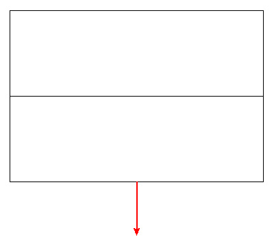 🡪 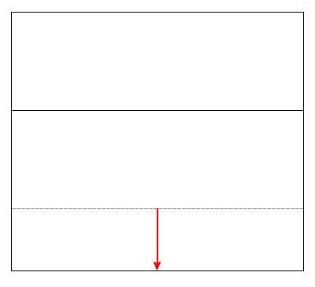

***

Die Ortganglinien der veränderten Dachfläche werden verlängert.

***

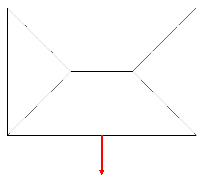 🡪 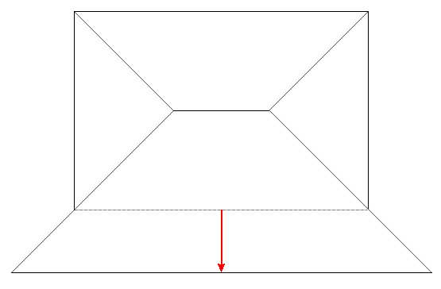

***

Durch die Verschiebung der Trauflinie verlängern sich die Gratlinien. Die Traufen der angrenzenden Dachflächen verändern sich dabei nicht.

Für diese Funktion wählt man einfach die Linie, die verschoben werden soll. Weitere Punkt sind hier nicht notwendig, da immer die ganze Linie verschoben wird. Als nächstes kann man die gewählte Linie grafisch verschieben und an der gewünschten Stelle platzieren. Dabei stehen alle Fang- und Eingabefunktionen zur Verfügung. Nach der Platzierung der Linie öffnet sich eine Dialogbox, in der man die Position der Linie noch einmal korrigieren kann. Bei jeder Änderung einer Zahl passen sich die anderen Zahlen automatisch an.

**Lattabstand / Deckbreite normaler Ziegel:** Wenn man Ziegel auf dem Dach eingegeben hat, kann man die Position der Linie auf die Decklänge oder Deckbreite der Ziegel anpassen. Je nachdem welche Linie man verschoben hat (z.B. Traufe oder Ortgang) ändert sich dann der Text. Wenn die Linie nicht parallel zu Fallrichtung der Dachfläche verläuft (Ortgang) und nicht senkrecht zur Fallrichtung (Traufe) dann kann nicht auf die Ziegel angepasst werden. Dies ist dann auch nicht mehr sinnvoll.

> Hier wird automatisch die Decklänge bzw. Deckbreite der verwendeten Ziegel angegeben. Der Wert kann aber auch geändert werden.

**Anzahl Ziegelreihen:** In diesem Feld wird die Anzahl der Ziegelreihen angegeben. Direkt nach einer Verschieben der Linie ist dies meistens ein krummer Wert und daher ist das Feld als Hinweis rot unterlegt. Mit den Plus- und Minusschaltern am rechten Ende des Feldes kann der Wert vergrößert oder verkleinert werden. Dabei wird immer auf eine ganze Zahl angepasst und die rote Markierung verschwindet.

**Verschiebung in der Dachfläche:** Dieser Wert zeigt den Abstand der neuen Linie zur alten, gemessen in der Neigung der Fläche.

**Verschiebung im Grund:** Hier wird die Verschiebung im Grund von der alten Position zur neuen Position der Linie angezeigt.

**Verschiebung in der Höhe:** Dieser Wert gibt die Höhendifferenz zwischen der alten und der neuen Position der Linie an.

**Höhenlage der Linie:** In diesem Feld wird die absolute Höhe der neuen Linie angezeigt, gemessen von global 0.

\[Hinweis:]{.underline}

Diese Funktion arbeitet etwas anders als die Funktion 'Rechteck' im klassischen Programm. Mit dieser Funktion hat man eine ganze Linie oder einen Teil einer Linie verschoben. In beiden Fall wurden die angrenzenden Linien nicht verlängert, sondern es sind neue Linienstücke entstanden. Hätte man früher die gesamte Traufe des Walmdachs (siehe oben) verschoben hätten sich die Gratlinien nicht verlängert, sondern es wäre eine rechteckige Vergrößerung der Dachfläche entstanden.

Wenn man mit dem jetzigen Programm die ganze Linie so herausziehen will, dass eine rechteckige Vergrößerung entsteht, dann nimmt man die Funktion '[Teillinie verschieben](DachHelp.md#dachgestaltung---linien-ändern---teillinie-verschieben)', obwohl man ja die ganze Linie verschieben will. Man wählt die Linie und dann als begrenzenden Punkt den Anfangs- und den Endpunkt der Linie.

Die heutige Vorgehensweise ist konsequenter und ermöglicht die einfachere Vergrößerung von Walmflächen oder anderen Dachflächen mit schrägen Linien. Dies wäre früher zwar auch möglich gewesen, aber mit mehr Aufwand.

#### Dachgestaltung - Linien ändern - Teillinie verschieben

Mit der Funktion 'Teillinie verschieben' kann ein Teil einer Dachhautlinie, aber auch eine ganze Linie verschoben werden. Dabei werden die angrenzenden beiden Dachhautlinien der selben Dachfläche \[nie]{.underline} verlängert oder verkürzt, es entstehen immer neue Linienstücke als Anschluss an das verschobene Linienstück. Die verschobene Linie kann eine andere Länge haben als das ursprünglich gewählte Linienstück. In diesem Fall entstehen neue schräge Linien. Das neue Dachflächenstück ist dann einseitig schräg oder trapezförmig. Die sieht dann zum Beispiel so aus:

***

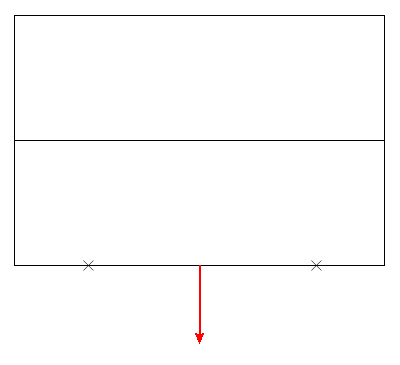 🡪 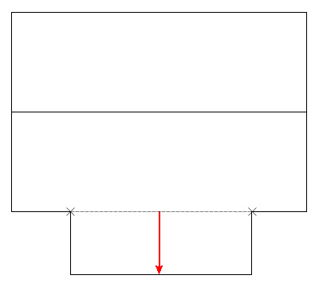

***

Ein Teilstück einer Traufe wird herausgezogen. Es entstehen auf beiden Seiten neue Linien, die den Typ Ortgang bekommen.

+--------------------------------------+----------------------------------------------------------------------------------------------------+ | 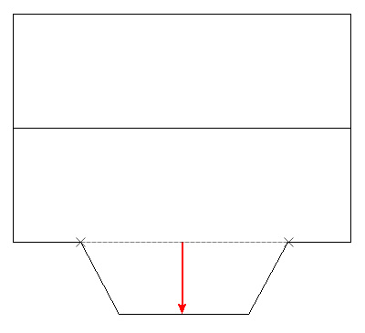 | Die Teillinie hat eine andere (kürzere) Länge bekommen. | | | | | | Die Verschiebung in X-Richtung ist 0.000 und dadurch entsteht ein trapezförmiges Dachflächenstück. | +--------------------------------------+----------------------------------------------------------------------------------------------------+

+---------------------------------------+-----------------------------------------------------------------------------------------------------------------------------------------------------------------------------------------------------+ | 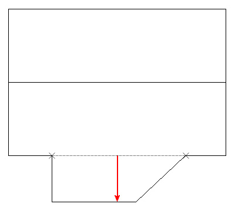 | Die Teillinie hat eine andere (kürzere) Länge bekommen. | | | | | | Die Verschiebung in X-Richtung ist ungleich 0.000. Es wurde eine positive Verschiebung eingegeben, die genau so groß ist wie die Hälfte der Differenz zwischen alter und neuer Länge der Teillinie. | +---------------------------------------+-----------------------------------------------------------------------------------------------------------------------------------------------------------------------------------------------------+

Für diese Funktion wählt man zuerst die Linie, von der ein Teil verschoben werden soll. Dann wählt man 2 Punkte, die den Bereich bestimmen, der verschoben werden soll. Dazu kann man alle bekannten Fang- und Eingabefunktionen verwenden. Die Punkte müssen auch nicht auf der Linie liegen, sondern können überall gewählt werden. Der gewählte Punkt wird dann jeweils auf die gewählte Linie gelotet. Für den 2. Punkt kann man auch gut die Pfeiltaste verwenden, wenn die Linie genau horizontal oder vertikal am Bildschirm zu sehen ist. Dann kann man einfach einen Abstand vom 1. Punkt aus eingeben.

Wenn man eigentlich die ganze Linie verschieben will (siehe Hinweis im Kapitel 'Linie schieben') wählt man den Anfangs- und den Endpunkt der Linie.

Als nächstes gibt man die Länge der Teillinie an. Als Vorgabe wird die Länge der gewählten Teillinie angezeigt. Ändert man diesen Wert bekommt die Teillinie eine neue Länge und die seitlich anschließenden Linien werden schräg.

Als nächstes kann man die gewählte Linie grafisch verschieben und an der gewünschten Stelle platzieren. Dabei stehen alle Fang- und Eingabefunktionen zur Verfügung. Beim Verschieben kann die Linien nur senkrecht zu ihrer alten Position verschoben werden. Wenn die Linie aber auch in X-Richtung verschoben werden soll, kann man später eine Verschiebung eingeben.

Nach der Platzierung der Linie öffnet sich eine Dialogbox, in der man die Position der Linie noch einmal korrigieren kann. Bei jeder Änderung einer Zahl passen sich gegebenenfalls die anderen Zahlen automatisch an.

**Lattabstand / Deckbreite normaler Ziegel:** Wenn man Ziegel auf dem Dach eingegeben hat, kann man die Position der Linie auf die Decklänge oder Deckbreite der Ziegel anpassen. Je nachdem welche Linie man verschoben hat (z.B. Traufe oder Ortgang) ändert sich dann der Text. Wenn die Linie nicht parallel zu Fallrichtung der Dachfläche verläuft (Ortgang) und nicht senkrecht zur Fallrichtung (Traufe) dann kann nicht auf die Ziegel angepasst werden. Dies ist dann auch nicht mehr sinnvoll.

> Hier wird automatisch die Decklänge bzw. Deckbreite der verwendeten Ziegel angegeben. Der Wert kann aber auch geändert werden.

**Anzahl Ziegelreihen:** In diesem Feld wird die Anzahl der Ziegelreihen angegeben. Direkt nach einer Verschieben der Linie ist dies meistens ein krummer Wert und daher ist das Feld als Hinweis rot unterlegt. Mit den Plus- und Minusschaltern am rechten Ende des Feldes kann der Wert vergrößert oder verkleinert werden. Dabei wird immer auf eine ganze Zahl angepasst und die rote Markierung verschwindet.

**Verschiebung in der Dachfläche:** Dieser Wert zeigt den Abstand der neuen Linie zur alten, gemessen in der Neigung der Fläche.

**Verschiebung im Grund Y:** Hier wird die Verschiebung im Grund von der alten Position zur neuen Position der Linie angezeigt.

**Verschiebung in der Höhe:** Dieser Wert gibt die Höhendifferenz zwischen der alten und der neuen Position der Linie an.

**Höhenlage der Linie:** In diesem Feld wird die absolute Höhe der neuen Linie angezeigt, gemessen von global 0.

**Verschiebung in X-Richtung:** Hier kann die verschobene Teillinie in Längsrichtung (parallel) verschoben werden. Bei einem Wert von 0.000 bleibt sie genau so wie nach dem grafischen Verschieben. Wenn die neue Teillinie kürzer als die ursprüngliche Teillinie ist entsteht so ein gleichmäßiges Trapez. Die roten Pfeile zeigen die positive Schieberichtung. Mit negativen Werten kann man aber auch in die andere Richtung verschieben.

#### Dachgestaltung - Linien ändern - Dreieck

Mit der Funktion 'Dreieck' kann ein Teil einer Dachhautlinie verändert werden. Wenn man als Anfangs- und Endpunkt des Bereiches den Anfangs- und Endpunkt der Linie wählt, kann natürlich auch die ganze Linie verändert werden. In beiden Fällen wird in der Mitte des gewählten Bereiches ein neuer Punkt erzeugt und aus der Teillinie werden zwei Linien. Der neue Punkt kann verschoben werden und dabei entsteht eine dreieckige Kontur im Ausmittlungspolygon.

***

 🡪 

***

Aus der gewählten Teillinie werden zwei Linien, die beide einen neuen Linientyp bekommen. Der neue Punkt kann dann senkrecht zur Linie verschoben werden. Die Verschiebung in X-Richtung ist hier gleich 0.000.

***

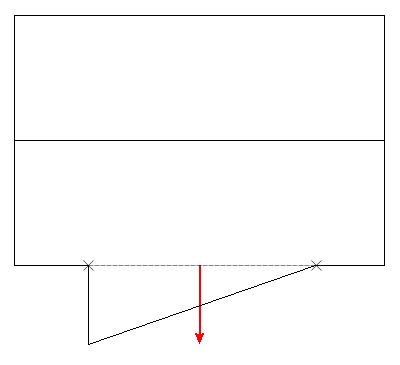 Die Verschiebung in X-Richtung ist in diesem Beispiel ungleich 0.000. Es wurde eine negative Verschiebung in X-Richtung eingegeben, die genau so groß ist wie die Hälfte der gewählten Teillinie.

***

Für diese Funktion wählt man zuerst die Linie, die verändert werden soll. Dann wählt man 2 Punkte, die den Bereich bestimmen, der verschoben werden soll. Dazu kann man alle bekannten Fang- und Eingabefunktionen verwenden. Die Punkte müssen auch nicht auf der Linie liegen, sondern können überall gewählt werden. Der gewählte Punkt wird dann jeweils auf die gewählte Linie gelotet. Für den 2. Punkt kann man auch gut die Pfeiltaste verwenden, wenn die Linie genau horizontal oder vertikal am Bildschirm zu sehen ist. Dann kann man einfach einen Abstand vom 1. Punkt aus eingeben.

Wenn man eigentlich die ganze Linie verändern will wählt man den Anfangs- und den Endpunkt der Linie.

Als nächstes kann man den neuen Punkt grafisch verschieben und an der gewünschten Stelle platzieren. Dabei stehen wieder alle Fang- und Eingabefunktionen zur Verfügung. Beim Verschieben kann der Punkt nur senkrecht zur gewählten Linie verschoben werden. Wenn der Punkt aber auch in X-Richtung verschoben werden soll, kann man später eine Verschiebung eingeben.

Nach der Platzierung des neuen Punktes öffnet sich eine Dialogbox, in der man die Position des Punktes noch einmal korrigieren kann. Bei jeder Änderung einer Zahl passen sich gegebenenfalls die anderen Zahlen automatisch an. Eine Anpassung an Ziegel gibt es hier nicht, da dies nicht sinnvoll erschein. Bei dieser Funktion entstehen immer schräge, sodass Ziegel sowieso geschnitten werden müssen.

**Verschiebung in der Dachfläche:** Dieser Wert zeigt den Abstand des neuen Punktes zur alten Linie, gemessen in der Neigung der Fläche.

**Verschiebung im Grund Y:** Hier wird die Verschiebung im Grund von der Position der alten Linie zur Position des neuen Punktes angezeigt.

**Höhenlage des Punktes:** In diesem Feld wird die absolute Höhe des neuen Punktes angezeigt, gemessen von global 0.

**Verschiebung in der Höhe:** Dieser Wert gibt die Höhendifferenz zwischen der alten Linie und der Position des neuen Punktes an.

**Verschiebung in X-Richtung:** Hier kann der verschobene Punkt in Längsrichtung der alten Linie (parallel) verschoben werden. Bei einem Wert von 0.000 bleibt der Punkt genau so wie nach dem grafischen Verschieben, es entsteht so ein gleichmäßiges Dreieck. Die roten Pfeile zeigen die positive Schieberichtung. Mit negativen Werten kann man aber auch in die andere Richtung verschieben.

#### Dachgestaltung - Linien ändern - Kreisbogen

Mit der Funktion 'Kreisbogen' kann ein Bereich einer Dachhautlinie kreisförmig aus der Dachfläche gezogen werden. Dabei wird der Mittelpunkt der Teillinie senkrecht zur Teillinie verschoben.

Der Bogen kann sowohl nach außen, als auch nach innen verschoben werden.

***

 🡪 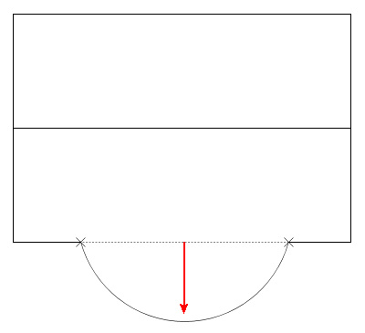

***

Ein Teilstück einer Traufe wird herausgezogen. Es entsteht eine kreisförmige Kontur, die von den zwei gewählten Punkten begrenzt wird. Je weiter der Bogen herausgezogen wird, desto kleiner wird der Radius bis der Radius genau die Hälfte des Abstandes der zwei gewählten Punkte beträgt. Das Zentrumskreuz liegt dann genau auf der veränderten Linie des Ausmittlungspolygons. Zieht man den Bogen weiter, vergrößert sich der Radius wieder.

Für diese Funktion wählt man zuerst die Linie, von der ein Teil verschoben werden soll. Dann wählt man 2 Punkte, die den Bereich bestimmen, der verschoben werden soll. Dazu kann man alle bekannten Fang- und Eingabefunktionen verwenden. Die Punkte müssen auch nicht auf der Linie liegen, sondern können überall gewählt werden. Der gewählte Punkt wird dann jeweils auf die gewählte Linie gelotet. Für den 2. Punkt kann man auch gut die Pfeiltaste verwenden, wenn die Linie genau horizontal oder vertikal am Bildschirm zu sehen ist. Dann kann man einfach einen Abstand vom 1. Punkt aus eingeben.

Wenn man eigentlich die ganze Linie kreisförmig verformen will wählt man den Anfangs- und den Endpunkt der Linie.

Als nächstes kann man den Mittelpunkt der gewählten Linie grafisch verschieben und an der gewünschten Stelle platzieren. Dabei stehen alle Fang- und Eingabefunktionen zur Verfügung. Beim Verschieben kann der Punkt nur senkrecht zu der gewählten Linie verschoben werden.

Nach der Platzierung des Punktes öffnet sich eine Dialogbox, in der man die Position des Punktes noch einmal korrigieren kann. Bei jeder Änderung einer Zahl passen sich gegebenenfalls die anderen Zahlen automatisch an.

**Lattabstand / Deckbreite normaler Ziegel:** Wenn man Ziegel auf dem Dach eingegeben hat, kann man die Position des Punktes auf die Decklänge oder Deckbreite der Ziegel anpassen. Je nachdem welche Linie man verformt hat (z.B. Traufe oder Ortgang) ändert sich dann der Text. Wenn die verformte Linie nicht parallel zu Fallrichtung der Dachfläche verläuft (Ortgang) und nicht senkrecht zur Fallrichtung (Traufe) dann kann nicht auf die Ziegel angepasst werden. Dies ist dann auch nicht mehr sinnvoll.

> In diesem Feld wird automatisch die Decklänge bzw. Deckbreite der verwendeten Ziegel angegeben. Der Wert kann aber auch geändert werden.

**Anzahl Ziegelreihen:** In diesem Feld wird die Anzahl der Ziegelreihen angegeben. Direkt nach einer Verformung der Linie ist dies meistens ein krummer Wert und daher ist das Feld als Hinweis rot unterlegt. Mit den Plus- und Minusschaltern am rechten Ende des Feldes kann der Wert vergrößert oder verkleinert werden. Dabei wird immer auf eine ganze Zahl angepasst und die rote Markierung verschwindet.

**Verschiebung in der Dachfläche:** Dieser Wert zeigt den Abstand des neuen Punktes zur alten Linie, gemessen in der Neigung der Fläche.

**Verschiebung im Grund Y:** Hier wird die Verschiebung im Grund von der alten Position der Linie zu dem verschobenen Punkt des Kreisbogens angezeigt.

**Verschiebung in der Höhe:** Dieser Wert gibt die Höhendifferenz zwischen der alten Linie und dem verschobenen Punkt des Kreisbogens an.

**Höhenlage des untersten Punktes:** In diesem Feld wird die absolute Höhe des verschobenen Punktes angezeigt, gemessen von global 0. Wenn man den Kreisbogen nach innen verschiebt ist dies eigentlich der oberste Punkt des Kreisbogens. Da dieser Fall aber höchst selten vorkommen dürfte wurde der Text so gewählt.

**Anzahl Segmente des Kreisbogens:** Der Kreisbogen wird nicht wirklich rund erzeugt, sondern segmentiert. Dies ist notwendig, da auch die Dachlagenplatten als Volumen entsprechend angepasst werden müssen. Aus diesem Grund kann man hier die Anzahl der Segmente eingeben. Der Wert sollte nicht zu groß gewählt werden, da sonst die Datenmenge unnötig vergrößert wird. Aus Sicherheitsgründen wird die Anzahl vom Programm gegebenenfalls korrigiert, sodass eine minimale Linienlänge von 0.05m entsteht.

#### Dachgestaltung - Punkte ändern - Punkt schieben

Mit der Funktion 'Punkt schieben' kann ein bestehender Punkt des Ausmittlungspolygons frei in der Ebene der Dachfläche verschoben werden. Der Punkt kann wahlweise so verschoben werden, dass eine der beiden angrenzenden Linien ihre Richtung behält, oder dass beide Linien in der Richtung verändert werden.

Die Ziegel werden bei dieser Funktion nicht berücksichtigt, da dies in der Regel nicht sinnvoll ist.

***

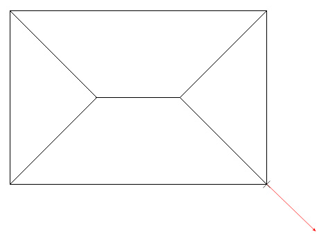 🡪 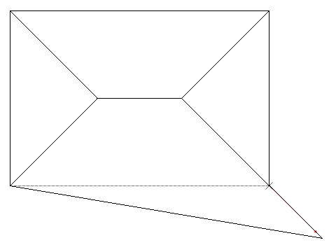

***

Der Punkt wird entlang der Gratlinie verschoben. Die Richtung der Gratlinie ist in diesem Fall fest.

***

 🡪 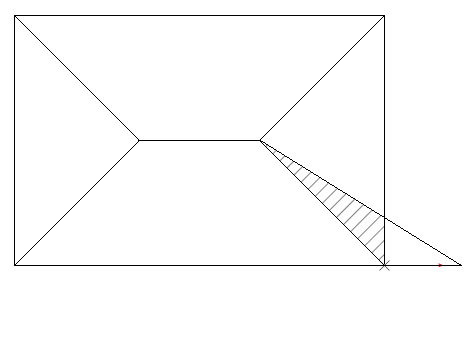

***

Der Punkt wird entlang der Traufe verschoben. Die Richtung der Traufe ist in diesem Fall fest. Die Dachflächen unten und rechts überlappen sich dadurch im schraffierten Bereich.

***

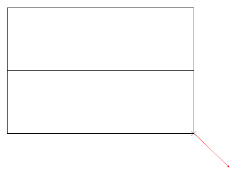 🡪 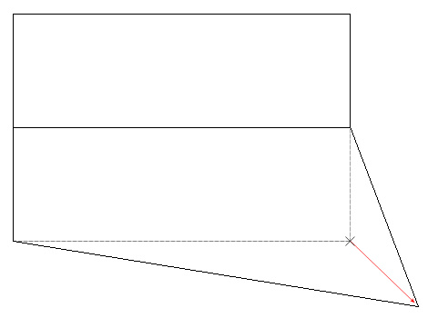

 🡪 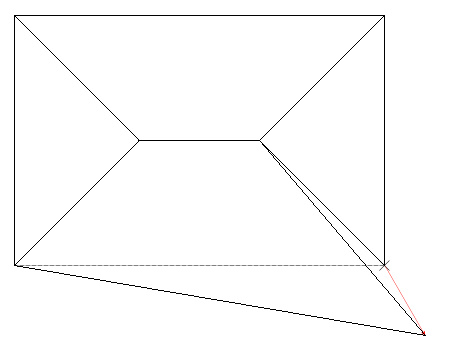

***

Freie Verschiebung in X- und Y-Richtung.

Für diese Funktion wählt man zuerst den Punkt, der verschoben werden soll. Danach zeigt das Programm die erste der beiden an diesem Punkt endenden Linien an. Mit Maus-Links kann man diese Linie als Richtungslinie wählen. Der Punkt wird dann parallel zu dieser Linie verschoben. Mit Maus Rechts wird diese Linie abgelehnt und es wird die andere angrenzende Dachlinie angeboten. Wenn man auch diese mit Maus Rechts ablehnt, kann man den Punkt frei verschieben.

Als nächstes kann man den gewählten Punkt grafisch verschieben und an der gewünschten Stelle platzieren. Dabei stehen alle Fang- und Eingabefunktionen zur Verfügung.

Nach der Platzierung des Punktes öffnet sich eine Dialogbox, in der man die Position des Punktes noch einmal korrigieren kann. Bei jeder Änderung einer Zahl passen sich gegebenenfalls die anderen Zahlen automatisch an.

**Verschiebung in der Dachfläche:** Dieser Wert zeigt den Abstand des Punktes von der alten Position zur neuen Position, gemessen in der Neigung der Fläche.

**Verschiebung in Y-Richtung:** Hier wird die Verschiebung im Grund in der Y-Richtung des kleinen roten Koordinatensystems angezeigt.

**Verschiebung in der Höhe:** Dieser Wert gibt die Höhendifferenz zwischen der alten und der neuen Position des verschobenen Punkt an.

**Höhenlage des Punktes:** In diesem Feld wird die absolute Höhe des verschobenen Punktes angezeigt, gemessen von global 0.

**Verschiebung in X-Richtung:** Hier wird die Verschiebung im Grund in der X-Richtung des kleinen roten Koordinatensystems angezeigt.

#### Dachgestaltung - Punkte ändern - Neue Ecke

Mit der Funktion 'Neue Ecke' können zwei Linien des Ausmittlungspolygons einer Dachfläche miteinander verbunden werden. Alle Linien des Ausmittlungspolygons der selben Dachfläche, die zwischen diesen Linien liegen, werden gelöscht.

***

 🡪 

***

Die beiden angeklickten Linie werden verlängert und an einer neuen Ecke miteinander verbunden. Die dazwischen liegenden Dachhautlinien werden gelöscht.

***

 🡪 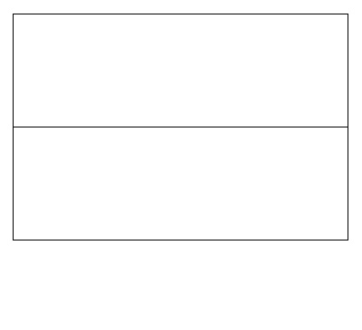

***

Die beiden angeklickten Linie werden verlängert und an einer neuen Ecke miteinander verbunden. Die dazwischen liegenden Dachhautlinien werden gelöscht. In diesem Fall musste die rechte Linie nicht verlängert werden. Sie hatte schon die passende Länge.

Bei dieser Funktion gibt es keine Dialogbox und keine grafische Verschiebung. Man wählt einfach die beiden Linien, die miteinander verbunden werden sollen. Automatisch werden dann die dazwischen liegenden Linien gelöscht und beiden gewählten Linien in der Länge angepasst.

#### Dachgestaltung - Punkte ändern - Ecke runden

Mit der Funktion 'Ecke runden' kann eine Ecke einer Dachfläche abgerundet werden. Der Kreisbogen wird in der Dialogbox nur über den Radius bestimmt. Dieser Radius wird in der globalen XoY-Ebene gemessen.

Die Ziegel werden in diesem Fall nicht berücksichtigt.

Der Bogen kann nur nach innen verschoben werden.

***

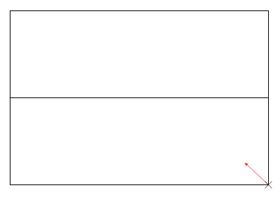 🡪 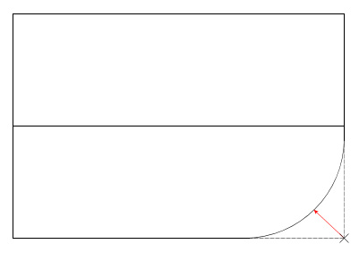

***

***

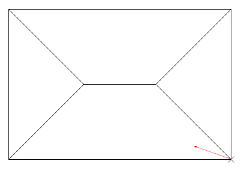 🡪 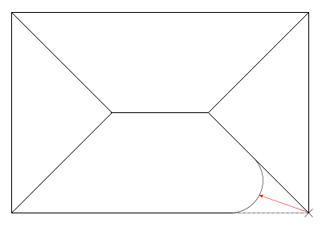

***

Für diese Funktion wählt man zuerst den Punkt, der gerundet werden soll. Dann kann direkt der gewählte Punkt grafisch verschoben und an der gewünschten Stelle platzieren werden. Dabei stehen alle Fang- und Eingabefunktionen zur Verfügung.

Die Eingabe kann dann in der darauf folgenden Dialogbox korrigiert werden:

**Radius des Kreisbogens:** Es wird automatisch der vorhandene Radius angezeigt. Dieser kann jetzt verändert werden.

**Anzahl Segmente des Kreisbogens:** Der Kreisbogen wird nicht wirklich rund erzeugt, sondern segmentiert. Dies ist notwendig, da auch die Dachlagenplatten als Volumen entsprechend angepasst werden müssen. Aus diesem Grund kann man hier die Anzahl der Segmente eingeben. Der Wert sollte nicht zu groß gewählt werden, da sonst die Datenmenge unnötig vergrößert wird. Aus Sicherheitsgründen wird die Anzahl vom Programm gegebenenfalls korrigiert, sodass eine minimale Linienlänge von 0.05m entsteht.

#### Dachgestaltung - Punkte ändern - Ecke löschen

Mit der Funktion 'Ecke löschen' können Punkte des Ausmittlungspolygons gelöscht werden. Die zwei anschließenden Linien der gewählten Dachfläche werden gelöscht und die Dachfläche durch eine neue Linie wieder geschlossen.

***

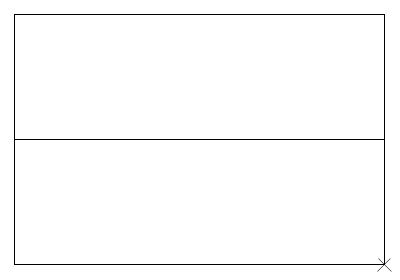 🡪 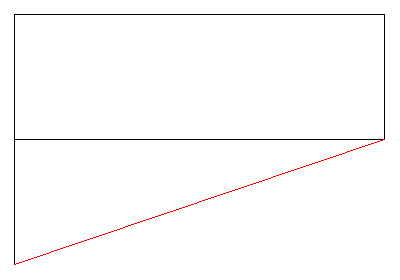

***

Für diese Funktion wählt man den Punkt, der gelöscht werden soll. Daraufhin werden die angrenzenden Linien automatisch gelöscht und die Dachfläche durch eine neue Linie wieder geschlossen. Dies funktioniert nur so lange, wie mindestens drei Eckpunkte pro Dachfläche erhalten bleiben.

#### Dachgestaltung - Urfläche

Mit der Funktion 'Urfläche' können Dachflächen, die durch eine Dachgestaltungsfunktion verformt wurden, wieder in die Geometrie verwandelt werden, die durch die Dachausmittlung entstanden war. So kann man einfach und schnell die Dachflächenverformungen rückgängig machen.

Um die Urfläche wieder herzustellen, wählt man die Dachfläche durch hineinklicken. Die Urfläche wird dann sofort wieder hergestellt.

### Ziegel / Dachbereiche

#### Lattung / Ziegel - Einstellungen - Ziegeleindeckung

Im Bauteilkatalog befinden sich die verschiedenen Ziegel, die zu einem Ziegelmodell gehören. Durch den Aufbau und die Ziegeltypen können mit einem Ziegelmodell verschiedene Eindeckungen gelegt werden, z.B. im Verband oder ob halbe Ziegel verwendet werden sollen. Wie der Ziegel eingedeckt wird, halten wir in der Ziegeleindeckung fest.

Wird dieser Dialog in der Funktion 'Lattung/Ziegel - Zuweisen' über den Browserbutton aufgerufen, so kann man dort auch Änderungen nur für die nächste Eingabe machen, die nicht zwingend in den zentralen Ziegeleindeckungen gespeichert werden.

In der Spalte 'Belegung' der Dachflächenausführung kann man in der Ziegellage eine Ziegeleindeckung einstellen und mit dem Browserbutton die Ziegeleindeckung kontrollieren. So hat man die Möglichkeit schon in der Dachflächenausführung eine passende Ziegelendeckung einzustellen, die so automatisch für alle Dachflächen berücksichtigt wird, auf der man die Dachflächenausführung verwendet hat.

Die Ziegeleindeckung kann mit dem Standardelement am Anfang der Dialogbox unter einem Namen gespeichert werden. Unter diesem Namen kann sie für die Zuweisung zu einer Dachfläche gewählt werden. Mit den Icons rechts daneben kann man die üblichen Verwaltungsfunktionen aufrufen. Siehe dazu 'Einstellungen speichern' im Handbuch 'Hilfe Allgemeinen'.

Für eine Ziegeleindeckung können folgende Einstellungen gemacht werden:

**Ziegelhersteller**: Der Hersteller des Ziegelmodells. Durch die Auswahl des Herstellers können dessen Ziegelmodelle ausgewählt werden.

**Ziegelmodell**: Die von diesem Ziegelhersteller verfügbaren, also im Bauteilkatalog eingegebenen, Ziegelmodelle.

**Firstziegeltyp**: Der Firstziegeltyp ist ausschlaggebend für bestimmte Werte des Neigungsprofils (Lattenabstände). Deshalb ist seine Auswahl wichtig für die Ziegeleindeckung.

**Ziegelabstand zur Gratlinie, .. Kehllinie, .. Wandanschluss**: Die Ziegellage läuft genau bis an diese Dachhautlinien heran und wird auch so im Aufmass verrechnet. Die Ziegel selber enden mit einem gewissen Abstand zu diesen Linien. Dieser Abstand kann hier jeweils definiert werden. Es werden also hier die richtigen Flächen sowohl für das Aufmaß als auch für die Ziegelberechnung verwendet; diese sind verschieden voneinander.

**Eindeckung**: In den nachfolgenden Parametern wird die eigentliche Eindeckung definiert. Die jeweiligen Möglichkeiten sind abhängig von den Ziegeltypen des Ziegelmodells und von den bereits gewählten Einstellungen: Soll z.B. versetzt aber ohne halbe Ziegel gedeckt werden, so müssen ganze und halbe Ortgangziegel eingesetzt werden.\
In den Bildern unterhalb des Hilfsbildes werden die aktuell gewählten Eindeckungen dargestellt. Ortgangziegel sind dabei blau, halbe Ziegel rot hervor gehoben.

**Ziegel versetzt decken**: Einige Ziegelmodelle können versetzt, also im Verband gedeckt werden. Dazu muss das Ziegelmodell mindestens halbe Ziegel oder halbe Ortgangziegel enthalten.

**Halbe Ziegel dürfen verwendet werden**: Wenn das Ziegelmodell auch halbe Ziegel enthält, dann kann eingestellt werden, ob sie zum Ausgleich der Verlegung in der Breite verwendet werden dürfen. Passen also auf eine Dachfläche 26.5 Ziegel nebeneinander, dann kann die Dachfläche unverändert bleiben, wenn man halbe Ziegel verwenden darf. Anderenfalls muss z.B. auf 27 Ziegel verbreitert werden.

**Ortgangziegel**: Abhängig von den gewählten Einstellungen kann nun mit ganzen, ganzen und halben Ortgangziegeln, Schlusssteinen (Doppelwulst) oder ohne Ortgangziegel gedeckt werden. Dies Ziegeltypen werden ausschließlich an Ortgängen eingesetzt. Der Schlussstein kommt nur am linken Ortgang zum Einsatz; am rechten wird dann ein normaler ganzer Ziegel gelegt.

**Halbe Ziegel im Grat-/Kehlbereich**: An Graten und Kehlen kommt es häufig vor, dass der nach dem schrägen Abschnitt verbleibende Ziegel zu schmal zum Befestigen ist. Ist er schmäler als ein halber Ziegel, so wird der Ziegel vorher durch einen halben Ziegel ersetzt. Dadurch wird der letzte Ziegel entsprechend um einen halben Ziegel breiter und kann besser befestigt werden.

#### Lattung / Ziegel - Einstellungen - Lattungen

Die verwendeten Latten, Keilbohlen und Konterlatten sind für verschiedene Ziegelmodelle gleich. Sie werden unabhängig von den Ziegeleindeckungen definiert und müssen somit nicht zu jeder Eindeckung wieder beschrieben werden. Wir halten dies in einer Lattungseinstellung fest.

Wird dieser Dialog in der Funktion 'Lattung/Ziegel - Zuweisen' über den Browserbutton aufgerufen, so kann man dort auch Änderungen nur für die nächste Eingabe machen, die nicht zwingend in den zentralen Lattungseinstellungen gespeichert werden.

Die Lattungseinstellung kann mit dem Standardelement am Anfang der Dialogbox unter einem Namen gespeichert werden. Unter diesem Namen kann sie für die Zuweisung zu einer Dachfläche gewählt werden. Mit den Icons rechts daneben kann man die üblichen Verwaltungsfunktionen aufrufen. Siehe dazu 'Einstellungen speichern' im Handbuch 'Hilfe Allgemeinen'.

Die Lattungseinstellung kann mit dem Standardelement am Anfang der Dialogbox unter einem Namen gespeichert werden. Unter diesem Namen kann sie für die Zuweisung zu einer Dachfläche gewählt werden.

In einer Lattungseinstellung können Einstellungen für folgende Elemente gemacht werden:

**Latten**: Dies sind die normalen Latten, in welche die Ziegel eingehängt werden. Sie werden in der Lattungslage erzeugt, die auch ihre Länge begrenzt. Ihre Verteilung richtet sich nach der Lage unterhalb der Lattungslage.

**Keilbohle**: Diese wird als unterste Latte an Traufen platziert. Sie hat in der Regel eine größere Breite als die Latten und wird dann abgegratet, wenn hier die Stabart 815(Keilbohle) vergeben ist. Die Abgratung wird so gemacht, dass sie an der oberen Längskante nur noch so breit wie die normalen Latten ist.

**Konterlatten**: Konterlatten werden aufgrund darunter liegender Bauteile erzeugt. Die Bauteile von Konterlatten werden neben der geometrischen Ausrichtung auch über ihre Funktion, wie z.B. Sparren, erkannt. Für die Erkennung der Funktion wird die Stabart verwendet. Werden nun mit der Sparrenfunktion beispielsweise spezielle Latten(_811/Latte_) eingegeben, wird an dieser Stelle keine Konterlattung erzeugt. Die Konterlatten befinden sich in der Lage unterhalb der Latten. Ihre Länge richtet sich nach der Lage in der sie liegen bzw. der Länge der Bauteile nach denen sie sich richten.

**Firstlatten, Gratlatten**: Diese Latten werden an First- bzw. Gratlinien erzeugt.

Die möglichen Einstellungen für diese Elemente der Lattung sind:

**Identnummer**: Eine Identnummer aus dem Bauteilkatalog wird zugewiesen. Ist für diese Identnummer bereits eine Breite und Höhe vordefiniert, so wird diese übernommen und kann nicht geändert werden. Dies ist für Latten der Normalfall.

**Bezeichnung**: Hier kann eine Stabart mit Bezeichnung gewählt werden. Grundsätzlich ist die Übernahme der vordefinierten Stabarten und Bezeichnungen zu empfehlen, z.B. '812/Konterlatte'. Wenn ein eigener Begriff gewünscht ist, so sollte die Stabart inklusive des Schrägstriches stehen bleiben, z.B. '812/_eigener Name_'.

**Breite B, Höhe H**: Dies sind die Querschnittsabmessungen gemäss Holzliste. Die Angabe erfolgt in einer Holzliste nach 'Breite mal Höhe', eine normale Latte ist z.B. eine 'Vier mal Sechser'; die kleinere Abmessung ist in der Regel die Breite. Die Latten liegen also mit ihrer Höhe auf der Dachfläche und ihre Breite steht senkrecht dazu. Dies gilt für alle Elemente der Lattung.

**Gratsparren -- Konterlatten, Kehlsparren -- Konterlatten**: Auf die Abgratungsflächen von Grat- und Kehlsparren werden auch spezielle Lattenquerschnitte und Positionierungen benötigt. Identnummer und Querschnittsabmessungen können dadurch unabhängig eingegeben werden. Zusätzlich können folgende Positioniermöglichkeiten genutzt werden:

> Grundabstand zur Gratlinie, - Kehllinie:
>
> ▫ Der Abstand wird im Grund zur Gratlinie bzw. Kehllinie gemessen.
>
> ▫ Der Abstand ist ein lichter Abstand: Beim Gratsparren wird er unten an der Konterlatte, beim Kehlsparren oben an der Konterlatte gemessen.
>
> ▪ Überstand zu Kante Gratsparren, - Kehlsparren
>
> ▫ Der Überstand der Konterlatte zur Außenkante des Grat- oder Kehlsparrens wird in der Abgratungsfläche gemessen.
>
> ▫ Für Dachelemente kann so eine spezielle Anschluss-Konterlatte mit eigenem Querschnitt definiert werden. Durch den Überstand zur Außenkante wird eine entsprechende Auflage gewährleistet.

#### Lattung / Ziegel - Zuweisen

Mit der Funktion 'Lattung/Ziegel - Zuweisen' werden einer bestimmten Auswahl von Dachflächen eine Ziegeleindeckung und eine Lattungseinstellung zugewiesen. Durch dieses Zuweisen werden die in den Dachflächen vorhandenen Einstellungen überschrieben. Anschließend erfolgt sogleich die Berechnung der Lattungsverteilung und der Ziegelbelegung der gewählten Dachflächen.

**Lattungseinstellung**: Eine der vorhandenen Lattungseinstellungen können ausgewählt werden. Zudem kann die Option '(aus Dachflächenausführung)' gewählt werden: Die in der Dachflächenausführung bereits vorhandene Lattungseinstellung bleibt erhalten. Dies wird eingesetzt, wenn nur die Ziegeleindeckung geändert werden soll. Die Option '(ohne Lattung)' erlaubt es vorhandene Lattungen von Dachflächen zu entfernen.\
Mit dem Browserbutton wird die aktuell gewählte Lattungseinstellung aufgerufen; es erscheint der Dialog [Lattung / Ziegel - Einstellungen - Lattungen](DachHelp.md#lattung-ziegel---einstellungen---lattungen). Werden hier die gemachten Änderungen nur mit OK bestätigt, so ändern sich die zentralen Lattungseinstellungen nicht, sondern die Änderungen wirken sich nur auf die aktuellen Zuweisungen aus.

**Ziegeleinstellung**: Eine der vorhandenen Ziegeleindeckungen können ausgewählt werden. Die beiden Hilfsbilder zeigen die prinzipiellen Belegungen an. Zudem kann die Option '(aus Dachflächenausführung)' gewählt werden: Die in der Dachflächenausführung bereits vorhandene Ziegeleindeckung bleibt erhalten. Dies wird eingesetzt, wenn nur die Lattungseinstellung geändert werden soll. Die Option '(ohne Ziegel)' erlaubt es vorhandene Ziegel von Dachflächen zu entfernen.\
Mit dem Browserbutton wird die aktuell gewählte Ziegeleindeckung aufgerufen; es erscheint der Dialog [Lattung / Ziegel - Einstellungen - Ziegeleindeckung](DachHelp.md#lattung-ziegel---einstellungen---ziegeleindeckung). Werden hier die gemachten Änderungen nur mit OK bestätigt, so ändern sich die zentralen Ziegeleindeckungen nicht, sondern die Änderungen wirken sich nur auf die aktuellen Zuweisungen aus.

Die Zuweisungen können zu einer oder gleichzeitig zu mehreren Dachflächen gemacht werden. Dazu stehen folgende Funktionsaufrufe zur Verfügung:

**Alle Dachflächen**: Alle Dachflächen des aktuellen Bauwerkes werden ausgewählt.

**Hauskontur**: Alle Dachflächen der nachfolgend ausgewählten Hauskonturen werden belegt.

**Dachflächen**: Anschließend können die gewünschten Dachflächen einzeln angewählt werden. Auch dabei können jedoch mehrere gleichzeitig belegt werden.

#### Lattung / Ziegel - Aufteilpunkte

In dieser Funktion kann je Dachfläche ein 'Aufteilpunkt für Ziegelbelegung' für die Aufteilung der Ziegel in die Breite (entlang der Traufe) gesetzt werden. Diese Aufteilpunkte haben für die Ziegeleinteilung die höchste Priorität. Wenn sich auf einer Dachfläche ein solcher Aufteilpunkt befindet, dann geht die Aufteilung von diesem aus.

Mit einem Aufteilpunkt kann die Ziegelbelegung an einem beliebigen Punkt, wie z.B. einem Öffnungsrand oder einer Gaubenwand orientiert werden. Durch diesen Punkt wird eigentliche ein Schnurschlag (eine Linie an der die Ziegel angelegt werden) definiert; diese verläuft im Grundriss gesehen durch den Aufteilpunkt und senkrecht zur Traufe. Die Ziegel rechts von dieser Linie liegen mit ihrer linken Kante an der Linie an. Das ist also bei Falzziegeln die Außenkante des Falzes, der später nicht mehr sichtbar ist. Will man die rechte Kante eines Ziegels bestimmen, so muss man diesen Aufteilpunkt entsprechend um die Falzbreite (in der Regel ca. 0.03 m, Wert aus Bauteilkatalog, Ziegelmodell) nach links verschieben.

Bei Aufruf der Funktion werden alle bereits vorhandenen Aufteilpunkte als rote punktierte Linien in den Dachflächen angezeigt. Danach werden abwechselnd immer die Dachfläche und der Aufteilpunkt für diese Dachfläche abgefragt, bis die Funktion mit der rechten Maustaste beendet wird.

Da jede Dachfläche nur einen Aufteilpunkt haben kann, wird dieser automatisch bei Eingabe eines neuen Punktes gelöscht. Ebenso werden bei Neuberechnung der Dachausmittlung alle Aufteilpunkte gelöscht.

#### Lattung / Ziegel - Lattpunkte

In dieser Funktion kann je Dachfläche ein 'Lattpunkt für Lattaufteilung' für die Aufteilung der Latten (entlang der Sparren) gesetzt werden. Diese Lattpunkte haben für die Latteinteilung die höchste Priorität. Wenn sich auf einer Dachfläche ein solcher Lattpunkt befindet, dann geht die Aufteilung von diesem aus.

Mit einem Lattpunkt kann die Latteinteilung an einem beliebigen Punkt, z.B. einem Öffnungsrand oder einer Gaubenwand orientiert werden. Mit diesem Punkt wird die Lage einer Oberkante einer Latte definiert. Wichtig ist auch die Möglichkeit auf diese Weise die Lage einer Latte von einer anderen Dachfläche zu übernehmen. Auf diese Weise lassen sich auch bei unterschiedlichen Dachneigungen exakt auf einer Höhe durchlaufende Ziegelreihen erzeugen.

Bei Aufruf der Funktion werden alle bereits vorhandenen Lattpunkte als blaue punktierte Linien in den Dachflächen angezeigt. Danach werden abwechselnd immer die Dachfläche und der Lattpunkt für diese Dachfläche abgefragt, bis die Funktion mit der rechten Maustaste beendet wird. Nach Anwahl der Dachfläche kann der Lattpunkt nach 2 Methoden bestimmt werden: Wird eine Latte einer anderen Dachfläche abgegriffen, so wird globale Höhe der Oberkante dieser Latte auf die Dachfläche übertragen. Wird keine andere Latte abgegriffen, so kann ein beliebiger Punkt gewählt werden. Dieser wird lotrecht auf die Unterseite der Lattungslage projiziert und man kann noch einen Abstand angeben. Dieser Abstand wird entlang der Sparren in der Dachfläche gemessen.

Da jede Dachfläche nur einen Lattpunkt haben kann, wird dieser automatisch bei Eingabe eines neuen Punktes gelöscht. Ebenso werden bei Neuberechnung der Dachausmittlung alle Lattpunkte gelöscht.

#### Lattung / Ziegel - Neuberechnen

Mit der Funktion 'Lattung/Ziegel - Neuberechnen' werden in einer bestimmten Auswahl von Dachflächen wahlweise die Lattungs- und Ziegelbelegung und / oder die Konterlatten neu berechnet. Die Notwendigkeit zur getrennten Berechnung ergibt sich aus den Abhängigkeiten in der Konstruktion: Die Ziegel bestimmen die endgültige Größe der Dachfläche; an diesen orientieren sich dann die Sparren. Erst nach der Sparreneingabe können also die Konterlatten berechnet werden. Nun sollen aber bei der Berechnung der Konterlatten nicht auch noch die Ziegel und die normalen Latten erneut ermittelt werden.

Die Neuberechnung kann für eine oder gleichzeitig mehrere Dachflächen erfolgen. Dazu stehen folgende Funktionsaufrufe zur Verfügung:

**Alle Dachflächen**: Alle Dachflächen des aktuellen Bauwerkes werden ausgewählt.

**Hauskontur**: Alle Dachflächen der nachfolgend ausgewählten Hauskonturen werden neu berechnet.

**Dachflächen**: Anschließend können die gewünschten Dachflächen einzeln angewählt werden. Auch dabei können jedoch mehrere gleichzeitig neu berechnet werden.

#### Lattung / Ziegel - Ziegel tauschen

Mit der Funktion 'Lattung/Ziegel - Ziegel tauschen' werden in einer Dachfläche oder bestimmte Ziegel aus Ziegelreihen gegen andere Ziegeltypen ausgetauscht.

Vor Ausführung dieser Funktion empfiehlt es sich die Darstellung der Ziegel auf die Option 'Kanten und Nummern' zu stellen. Dies geschieht in der Funktion '[Datei - Einstellungen - Darstellung](DachHelp.md#datei---einstellungen---darstellung)' in der ersten Dropliste im Rahmen 'Lattungen / Ziegeleindeckung'. Die Darstellung der Lattung in der darunter liegenden Dropliste sollte man auf '(keine Lattung)' stellen.

Nach der Anwahl der Dachfläche wird diese mit der Traufe parallel zum Bildschirm gedreht und größtmöglich dargestellt. Es erscheint eine Dialogbox um die Art der Auswahl zu bestimmen, oder die Funktion zu beenden. Diese Dialogbox erscheint nach jedem abgeschlossenen Tauschen der Ziegel.

**Ziegelreihe**: Es können mehrere, nebeneinanderliegende Ziegel mit einer Linie gewählt werden. Auch können mehrere dieser Reihen in einem Ablauf angewählt werden, jedoch müssen sie parallel zur ersten Ziegelreihe verlaufen. Es sind nur horizontale oder vertikale Ziegelreihen möglich. Die gewählten Ziegel müssen die gleiche Breite haben.

**einzelne Ziegel**: Es werden beliebig viele, einzelne Ziegel angewählt. Dazu kann einfach in den Ziegel hinein geklickt werden; es muss nicht eine Kante des Ziegels gewählt werden. Die gewählten Ziegel müssen die gleiche Breite haben.

Die nachfolgende Dialogbox ist abhängig von der Auswahl der Ziegel:

**Ziegel zum Ersetzen**: Die gewählten Ziegel haben eine bestimmte Breite; in der Dropliste werden alle Ziegel des Ziegelmodells angeboten, welche die gleiche Breite haben. Es sind also nur Ziegel gleicher Breite untereinander austauschbar.\
Eine Besonderheit wird beim Austausch von ganzen Ziegeln angeboten: Sie können auch mit einem Sonderziegel halber Breite plus einem normalen halben Ziegel ersetzt werden. Dies ist z.B. bei bestimmten Schneefangsteinen erforderlich. Umgekehrt können ein nebeneinander liegender Sonderziegel halber Breite und ein halber Ziegel wieder durch einen ganzen Ziegel ersetzt werden, wenn genau nur diese beiden angewählt werden.

**Auswahl der Ziegel in einer Ziegelreihe**: In gewählten Ziegelreihen wird oft nicht jeder Ziegel, sondern nur jeder vierte oder fünfte usw. Ziegel ausgetauscht. Das kann hier bestimmt werden. Es wird immer der erste Ziegel jeder Reihe und von da an z.B. jeder fünfte ersetzt. Um bestimmte Muster zu erhalten, muss also die Auswahl für den Anfang der Ziegelreihe beachtet werden.

**Lage des Sonderziegels**: Wird ein ganzer Ziegel wie oben beschrieben mit einem Sonderziegel halber Breite und einem halben Ziegel ersetzt, so wird hier die Lage des Sonderziegels bestimmt.

#### Lattung / Ziegel - Dialog Ziegelbelegung

Im Ablauf einer der Funktionen 'Lattung / Ziegel - Zuweisen' oder '.. - Neuberechnen' erscheint am Anfang der Berechnung immer der Dialog 'Ziegelbelegung'. Er erscheint einmal für alle gewählten Dachflächen, welche die gleichen Ziegeleindeckungen und Lattungseinstellungen haben und die im selben Neigungsbereich des Ziegelmodells liegen.

Wurde der Hausseite ein Profil zugewiesen und stimmen die Werte der Ziegeleindeckung in Profil und Dachfläche noch überein, so erscheint im Titel der Hinweis: 'Werte aus Profilposition:' gefolgt von der entsprechenden Profilposition.

**Bereich Ziegeleindeckung**: Hier wird die verwendete Ziegeleindeckung und der gefundene Neigungsbereich angezeigt.

**Bereich Einteilung der Lattung**: Die Werte des Neigungsprofils werden hier angezeigt und können editiert werden. Die gemachten Einstellungen werden in der Dachfläche gespeichert und werden als Vorgabe bei der nächsten Neuberechnung verwendet.\
Für die nachfolgenden Werte ist zu berücksichtigen, dass die Einteilung der Lattung auf der Oberseite der Lage unterhalb der Lattungslage erfolgt:

> **Dachlattenzugabe Z**: Dies ist der Abstand von der Traufe zur Unterkante der Keilbohle. Ein positiver Wert schiebt die Keilbohle aus der Dachfläche hinaus.
>
> **Abstand 1. Ziegel Z1**: Dies ist der Abstand von der Unterkante der Keilbohle zur Oberkante der ersten Latte. Dieser Abstand bestimmt, wieweit die unterste Ziegelreihe über die Keilbohle hinaus ragt.
>
> **Abstand 2. Ziegel Z2**: Bei einigen Ziegelmodellen, z.B. Biberschwanz, muss auch die 2te Ziegelreihe in einem bestimmten Abstand gedeckt werden. Dieser wird hier durch den Abstand der Oberkanten der ersten und zweiten Latte angegeben. Ist dieser Abstand 0, so gibt es keine spezielle zweite Latte.
>
> **Abstand letzter Ziegel Zx**: Bei einigen Ziegelmodellen hat der First-Anschlussziegel ein anderes Lattmaß als die normalen Ziegel. Dies kann hier eingestellt werden. Ist dieser Abstand 0, so gibt es keine spezielle zweite Latte unterhalb des Firstes.
>
> **Firstlattenabstand ZF**: Dies gibt den Abstand der Oberkante der letzten Latte zur Firstlinie an.
>
> **Lattenabstand minimal Zi, .. maximal Za**: Die meisten Ziegelmodelle haben für das Lattmaß einen gewissen Spielraum. Dieser wird hier angegeben. Die Latteinteilung versucht die Dachfläche mit einem Lattmaß zu belegen, dass zwischen diesen beiden Massen liegt.
>
> **fester Lattabstand**: Wenn der Lattabstand nicht irgendwo zwischen minimalem und maximalen Lattabstand liegen soll, sondern genau ein bestimmtes Maß haben soll, dann wird dieses hier angegeben. Dies ist z.B. nötig, wenn Dachflächen mit gleichen Lattabständen eingedeckt werden sollen. Hier ist der Browserbutton neben dem Eingabeelement besonders hilfreich: Mit diesem kann man eine Dachfläche wählen, deren Lattmaß übernommen werden soll. Dabei wird der Lattabstand sogar auf die aktuelle Dachneigung umgerechnet, damit in der Ansicht die Höhe der Ziegelreihen gleich ist.

**Bereich Einteilung in der Breite**: Hier werden die Ziegelbreiten für die Einteilung in Richtung der Traufe angegeben:

> **minimale .., maximale Ziegelbreite B**: Einige Ziegelmodelle haben sogar in Richtung ihrer Breite einen gewissen Spielraum. Dieser kann hier angegeben werden. Er wird bei der Einteilung nur beim ganzen Ziegel berücksichtigt; Ortgangziegel und Schlusssteine haben feste Breiten.
>
> **feste Ziegelbreite B**: Gibt es einen Spielraum für die Ziegelbreite, so kann hier wieder eine feste Ziegelbreite vorgegeben werden. Auch hier ist es möglich über den Browserbutton die Ziegelbreite von einer bereits belegten Dachfläche zu übernehmen.

#### Dialogboxen Verschiebung der Ortgänge

Die Ziegellage muss in ihrer Breite (in Richtung der Traufe gemessen) von den Ziegeln belegt werden. Da bei den Ziegeln die linken (nicht sichtbaren) Kanten positioniert werden, betrachten wir die Deckbreite sozusagen auf der Unterseite der Ziegel. Dabei decken die Ziegel unterschiedliche Breiten ab: Beim ganzen Ziegel entspricht die sichtbare Deckbreite auch der Breite auf der Unterseite. Beim rechten Ortgangziegel kommt bei einem Falzziegel zu der von oben sichtbaren Breite noch die Breite des Falzes hinzu.

Wir benötigen diese genaue Betrachtung, da der Übertand des Ortgangsziegels automatisch in den Überstand (Offset) der Ziegellage zur Lattungslage eingetragen wird. Das übrige Kanteprofil wird beibehalten und verschiebt sich mit dem Ortgang.

Bei der Einteilung der Ziegel in der Breite (in Richtung der Traufe) werden neben dem eventuell vorhandenen Aufteilpunkt hauptsächlich die Ortgänge berücksichtigt. Wenn die Einteilung in der Breite nicht passt, werden für die Ortgänge entsprechende Verschiebungen angeboten.

Die Dialogboxen zur Verschiebung der Ortgänge orientieren sich an den Möglichkeiten des Ziegels (variable Deckbreite) und der Situation (nur einseitig ein Ortgang oder beidseitig). Hier wird beispielhaft die Dialogbox mit den meisten Möglichkeiten beschrieben.

**Anzahl Ziegelspalten**: Mit den möglichen Deckbreiten wird die Anzahl der Ziegelspalten, also der nebeneinander liegenden Ziegel, errechnet. Dabei werden die Ortgangziegel selbst nicht mit gezählt. Die Anzahl der Ziegelspalten kann mit dem +-Button vergrößert, mit dem --Button verkleinert werden. Dabei wird die 'gewählte Deckbreite' beibehalten und somit der Dachüberstand und die Traufhöhe verändert.

**Deckbreite**: In dieser Spalte werden die minimale und maximale (wenn möglich) und die gewählte Deckbreite angegeben. Wird die gewählte Deckbreite geändert, so berechnet sich zusammen mit der Anzahl der Ziegelspalten eine entsprechende gesamte Verschiebung der Ortgänge.\
Es werden für die gewählte Deckbreite nur Eingaben zwischen minimaler und maximaler Deckbreite akzeptiert.\
\
Mit dem Pfeil oberhalb der 'gewählten Deckbreite' wird aus der minimalem und maximalem Deckbreite ein möglichst runder Wert übernommen.

**gesamte Verschiebung bei minimaler- , .. - maximaler Breite**: Hier wird angegeben, wie groß die gesamte Verschiebung der Ortgänge bei minimaler bzw. maximaler Deckbreite der Ziegel wäre.

**gewählte Verschiebung**: Hier wird die gesamte Verschiebung der Ortgänge bei gewählter Deckbreite angegeben. Wird dieser Wert verändert, so berechnet sich die gewählte Deckbreite entsprechend.\
\
Es werden für die gewählte Verschiebung nur Eingaben zwischen minimaler und maximaler Verschiebung akzeptiert.\
\
Mit dem Pfeil oberhalb der 'gewählten Verschiebung' wird aus der minimalem und maximalem Verschiebung ein möglichst runder Wert übernommen.

**Verschiebung der Ortgänge**: Wenn 2 Ortgänge vorhanden sind, kann die gesamte Verschiebung auf die beiden Ortgänge verteilt werden. Wird eine der Verschiebungen angegeben, so berechnet sich die andere automatisch. Mit den Buttons wird die gesamte Verschiebung übertragen: Mit 'links' auf den linken Ortgang, mit 'rechts' auf den rechten Ortgang. Mit 'verteilen' wird die Verschiebung zu gleichen Teilen auf die beiden Ortgänge verteilt.

#### Dialogboxen Latteinteilungen

Die Dialogboxen zu den Latteinteilungen passen sich der gefundenen Situation an. Einige Dachflächen können nicht mit einer Latteinteilung fertig belegt werden, z.B. bei 2 versetzten Firsten. Dann erscheint dieser Dialog für jeden der Teilbereiche; diese werden automatisch erkannt und angeboten.

Wurde der Hausseite ein Profil zugewiesen, stimmen die Werte der Ziegeleindeckung in Profil und Dachfläche noch überein und entsprechen Traufe und First noch denen des Profils, so erscheint im Titel der Hinweis: 'Werte aus Profilposition:' gefolgt von der entsprechenden Profilposition.

Im oberen Bereich der Dialogbox wird die 'gesamte Teilungslänge' angezeigt: Dies ist der Abstand des untersten und obersten Punktes des Bereiches, der nun mit Lattung belegt werden soll. Dann folgen die festen Abstände, wie z.B. , die von der 'gesamten Teilungslänge' abgezogen werden, damit man die 'Teilungslänge' für die eigentliche Einteilung erhält. Bei Änderung eines dieser festen Abstände wird der untere Teil der Dialogbox neu berechnet. Welche festen Anteile geändert werden können, ist abhängig von der Situation.

Im unteren Teil der Dialogbox wird die eigentliche Einteilung berechnet. Dabei können insbesondere das gewählte Lattmaß und die Anzahl der Ziegelreihen bestimmt werden. Dazu gibt es dann entsprechend der Situation ein weiterer Wert, der in Abhängigkeit von den Ziegelreihen bestimmt werden kann. Hier als Beispiel die sehr häufig benötigte Bestimmung der Traufe:

**Anzahl Ziegelreihen**: Es wird versucht die Teilungslänge mit einem Lattmaß zu belegen, dass zwischen dem minimalen und maximalen Lattmaß liegt. Dabei soll der Dachüberstand und damit auch die Traufhöhe beibehalten werden. Die ermittelte Anzahl Ziegelreihen wird hier angegeben. Die Anzahl der Ziegelreihen kann mit dem +-Button vergrößert, mit dem --Button verkleinert werden. Dabei wird der 'gewählte Lattabstand' beibehalten und somit der Dachüberstand und die Traufhöhe verändert.

**Dachüberstand bei minimalem- , .. maximalem Lattabstand**: Rechts werden minimaler und maximaler Lattabstand angezeigt. Bei diesen Lattabständen würden sich mit der Anzahl Ziegelreihen die jeweils angegebenen Dachüberstände ergeben.

**Dachüberstand bei gewähltem Lattabstand**: Dies ist der Dachüberstand entsprechend der Ausmittlung, also am Ausmittlungspolygon auf Oberseite Lage 0. Wurden bestimmte Werte geändert, so ist es der aktuelle Dachüberstand, der sich aus der Anzahl der Ziegelreihen und dem gewählten Lattabstand ergibt. Er ist mit der Traufhöhe verbunden; wird einer der Werte geändert, so passt sich der andere an. Der Dachüberstand kann vorgegeben werden; dann wird die Teilungslänge neu ermittelt und die Berechnung beginnt von vorne.\
\
Mit dem Pfeil oberhalb des 'gewählten Dachüberstandes' wird aus minimalem und maximalem Dachüberstand ein möglichst runder Wert übernommen.

**Traufhöhe**: Hier wird die Traufhöhe entsprechend dem 'Dachüberstand bei gewähltem Lattabstand' angezeigt und kann eingegeben werden. Wird sie eingegeben, so wird der Dachüberstand neu berechnet und umgekehrt. Mit dem Browserbutton kann die Traufhöhe von einer anderen Traufe übernommen werden.

**Lattabstand**: In der Spalte darunter werden die Lattabstände angezeigt: Der minimale und maximale gemäß Neigungsprofil, der gewählte, also für die aktuelle Berechnung gültige und der Lattabstand aus Ersteinteilung oder Profil. Wenn der gewählte Lattabstand nicht zwischen minimalem und maximalem Lattabstand liegt, so wird der Text rot hinterlegt.\
Mit dem Button hinter dem 'gewählten Lattabstand' kann der Lattabstand von einer anderen Dachfläche übernommen werden. Dabei wird der Lattabstand entsprechend der Dachneigung so umgerechnet, dass die Ziegelreihen in der Ansicht gleiche Höhen haben.\
Wird der 'gewählte Lattabstand' eingegeben, so wird der Dachüberstand und die Traufhöhe neu berechnet.\
Mit dem Pfeil oberhalb des 'gewählten Lattabstandes' wird aus minimalem und maximalem Lattabstand ein möglichst runder Wert übernommen. Mit dem Pfeil darunter wird der Lattabstand aus der Ersteinteilung oder dem Profil übernommen.

**Lattabstand aus Ersteinteilung, .. aus Profil**: Eine Dachfläche kann aus mehreren Bereichen bestehen, die nacheinander belegt werden müssen. Wurden die Daten aus dem Profil übernommen, so wird hier für alle Bereiche der im Profil gewählte Lattabstand angezeigt. Ansonsten wird hier der Lattabstand angezeigt mit dem der erste Bereich der Dachfläche eingeteilt wurde. Dieser wird auch in der Dachfläche als Lattabstand dieser Dachfläche gespeichert und kann so in andere Dachflächen übernommen werden.

#### Vordachbereiche

Mit der Funktion 'Vordachbereiche' kann jede Lage einer Dachfläche in mehrere Bereiche eingeteilt werden. Hierbei werden folgende Bereiche unterschieden:

* Vordachbereich
* ausgebauter Bereich
* nicht ausgebauter Bereich

Die Einteilung einer Lage in diese Bereiche ist von verschiedenen Kriterien abhängig:

* Die Lage muss in der Ausführung zu der sie gehört den Schalter 'Schalungsfläche', 'Isolationsfläche' oder 'Flächenaufmaß' haben.
* Nicht ausgebaute Bereiche entstehen, wenn die entsprechende Dachfläche ganz oder teilweise oberhalb einer 'Grenzdecke' liegt.

Lagen mit Schalung sind oft anders eingeteilt als die übrigen Lagen, z.B: sind der Vordachbereich und der ausgebaute Bereich mit derselben Schalung belegt. Die Begriffe 'Vordachbereich' usw. sind hier nicht mehr passend, weshalb wir für die Schalungslage von Schalungsbereichen sprechen; es werden bis zu 3 Schalungsbereiche unterschieden. Oft ist der Schalungsbereich 1 die Sichtschalung, Schalungsbereich 2 die Rauschalung und Schalungsbereich 3 ein ungeschalter Bereich. In den Schalungsbereichen können aber auch andere Schalungen oder Platten liegen, weshalb wir einfach von Schalungsbereichen sprechen. Für die Schalungsbereiche werden die ermittelten Vordach-, ausgebauten und nicht ausgebauten Bereiche übernommen und wahlweise zusammengefasst.

Für die Bestimmung der Vordachbereiche wird ein Grundpolygon eingegeben. Dieses Grundpolygon kann manuell oder durch Übernahme der Hauskontur oder der Wände erzeugt werden. Das Grundpolygon kann durch einen Überstand gegenüber der übernommenen oder eingegebenen Kontur verschoben werden.

Für die Schalungslage können zusätzliche Überstände eingestellt werden. Die Vordachgrenzen der Schalungslage werden um diese verschoben, nachdem das Grundpolygon auf die Schalungslage übertragen wurde. So können unterschiedliche Überstände der Schalungsbretter an Ortgängen und Traufen berücksichtigt werden.

Ausgehend vom Grundpolygon werden die Grenzen der Vordachbereiche nach folgendem Schema auf die übrigen Lagen übertragen:

* Das Grundpolygon gehört zu einer Hauskontur. Es wird nur auf die Dachflächen dieser Hauskontur übertragen. Dadurch ist es möglich bei verschnittenen Dächern für jede Hauskontur getrennte Grundpolygone einzugeben, die dann die Dachflächen der anderen Hauskonturen nicht stören.
* \[]{#Knicklage .anchor}In der Dachflächenausführung wird eine Lage als 'Knicklage für Flächenbereiche' eingestellt. Das Grundpolygon wird lotrecht auf die Knicklage und die darunter liegenden Lagen übertragen. Die Dachbereiche außerhalb des Grundpolygons werden dann als Vordachbereiche ermittelt, die Dachbereiche innerhalb als ausgebaute Bereiche.
* Auf die Lagen oberhalb der Knicklage werden die Grenzen der Vordachbereiche senkrecht zur Dachfläche übertragen.
* Danach folgen noch einige Analysen, die die Vordachbereiche gemäß baulichen Regeln erweitert. Dadurch genügt es das Grundpolygon von der Hauskontur zu übernehmen und man erhält trotzdem z.B. in einem Querbau mit höher liegender Traufe Vordachbereiche, auch wenn diese nicht außerhalb des Grundpolygons liegen.
* Bei den Analysen für die bauliche Erweiterung der Vordachbereiche wird insbesondere nach Ziegellagen gesucht. Wenn unterhalb einer Dachfläche (z.B. von einem Querbau) eine Ziegellage einer anderen Dachfläche (z.B. Hauptdach mit tieferer Traufe) liegt, bekommt die darüber liegende Dachfläche einen Vordachbereich. Dies geschieht auch dann, wenn dieser Vordachbereich innerhalb des Grundpolygons der Vordachbereiche liegt. Dieses Verhalten ist allerdings schaltbar (siehe unte.)

Die Trennung zwischen ausgebautem und nicht ausgebautem Bereich erfolgt über Grenzdecken. Wenn eine Decke als 'Grenzdecke' eingegeben wurde, trennt Sie automatisch die beiden Dachbereiche. Diese Trennung erfolgt auf der Oberseite der obersten Isolationslage der Decke. Dort, wo die Oberseite dieser Lage in der Dachfläche endet, werden ausgebauter und nicht ausgebauter Bereich getrennt. Diese Trennung wird wieder winkelrecht auf alle entsprechenden Lagen nach oben übertragen.

Wenn gewünscht werden am Ende für die Schalungsbereiche der Schalungslage Vordach-, ausgebauter und nicht ausgebauter Bereich zusammengefasst.

Zur Verdeutlichung siehe nachfolgende Skizze:


Dachausführung:

***

Lage Kernlage Isolation Schalung Ziegel Knicklage Grenzdecke läuft bis

-5 X

-4 X

-3

-2 X

-1 X X X X

0 X

1 X

***

Deckenausführung, Grenzdecke:

***

Lage Kernlage Isolation

-3

-2 X

-1 X

0 X

1

***

\[Hinweise zur Grafik:]{.underline}

* Die Ziegellagen bekommen keine Dachbereiche
* Die Schalungslage (-1) hat einen zusätzlichen Überstand für den Vordachbereich bekommen (siehe unten)
* Die Kernlage 0 des Daches und die Kernlagen und darüber befindlichen Schalen der Decke durchdringen sich.
* Die untere Schale (1) des Daches endet an der Kernlage der Decke
* Die untere Schale (1) der Decke endet an der untersten Schale des Daches
* Der ausgebaute Bereich endet auf der Oberseite der Isolationslage (-2) der Decke

Für die Bestimmung der Dachbereiche können folgende Einstellungen gemacht werden:

**Überstand Schalungslage**: Für die Linientypen 'Traufe', 'steigende Traufe', 'Ortgang', 'schräger Ortgang' und 'oberer Pultabschluss' kann man speziell für die Schalungslage einen eigenen Überstand eingeben. Die Vordachgrenzen der Schalungslage werden um diese verschoben, nachdem das Grundpolygon auf die Schalungslage übertragen wurde.

**Schalungsbereiche**: Für jeden Schalungsbereich kann angegeben werden, welche der Bereiche Vordach-, ausgebauter und nicht ausgebauter Bereich zusammengefasst werden sollen. Dabei ist nur eine aufsteigende, zusammenhängende und eindeutige Zuordnung möglich, was aber durch die Dialogbox selbst gesteuert wird. Will man einen Bereich anders zuordnen, so kann man nur in weiße, leere Checkboxen klicken; ist dort bereits ein Häkchen, wird durch erneutes Klicken das Häkchen zurückgesetzt und alle möglichen Eingaben werden frei.

**Vordach über Ziegellage berechnen**: Mit dieser Einstellung kann beeinflusst werden ob unterhalb der betrachteten Dachfläche nach Ziegellagen von anderen Dachflächen gesucht werden soll:

> **Alle:** Mit der Option 'Alle' wird nach Ziegellagen unterhalb der betrachteten Dachfläche gesucht und es werden dann gegebenenfalls Vordachbereiche erzeugt. Bei dieser Analyse werden alle Dachflächen berücksichtigt, unabhängig davon zu welcher Hauskontur sie gehören.
>
> **akt. Hauskontur**: Auch mit dieser Option wird nach den Ziegellagen unterhalb der aktuellen Dachfläche gesucht. Es werden aber nur die Dachflächen berücksichtigt, die zur selben Hauskontur gehören wir die Dachfläche, die Vordachbereiche bekommen soll.
>
> **Keine**: Die Suche nach Ziegellagen unterhalb der aktuellen Dachfläche entfällt.

**Vordach-Grundpolygon -- Überstand**: Hier wird ein Überstand eingegeben um den das Grundpolygon für die Flächenbereiche über die Linie überstehen soll, die später über die Funktionen 'Eingabe', 'Hauskontur' oder 'Wandübernahme' definiert werden. (Wie der Überstand bei der Eingabe von Deckenfeldern.)

**Wandübernahme**: Für die Wandübernahme gibt man das Stockwerk und die Bezugslinie aus diesem Stockwerk ein. Als Bezugslinie kann 'Außenkontur', 'Referenzachse' und 'Innenkontur' gewählt werden.

**Mindestbreite Vordachbereiche**: Wenn bei der automatischen Ermittlung der Vordachbereiche Bereiche entstehen, die schmäler sind als die hier eingestellte Breite, wird dieser Bereich gelöscht.

Mit dem Schalter 'Eingabe' kann ein Grundpolygon manuell eingegeben werden. Dabei stehen alle Eingabe- und Fangfunktionen zur Verfügung. Mit dem Schalter 'Hauskontur' wird die Hauskontur als Grundpolygon übernommen. Mit dem Schalter 'Wandübernahme' werden die oben eingestellt Bezugslinie der Außenwände als Grundpolygon übernommen.

#### Flächenbereiche neuberechnen

Wenn die Dachausmittlung neu berechnet wird, gehen die Flächenbereiche verloren, da das Dach nach einer Neuberechnung ganz anders aussehen kann als vorher. In diesem Fall wählt man die Funktion 'Flächenbereiche neuberechnen'. Die Flächenbereiche werden dann mit den alten Einstellungen neu erzeugt.

#### Flächenbereiche ändern

Die automatisch ermittelten Vordachbereiche können mit diesen Funktionen manuell verändert und so an spezielle Gegebenheiten angepasst werden. Sobald man einer der Funktionen auswählt wird die Kontur der [Knicklage](DachHelp.md#Knicklage) sichtbar, da diese durch die nachfolgenden Funktionen verändert wird. Von der Knicklage aus werden dann die Änderungen auf die anderen Lagen übertragen.

**Linie schieben**

Mit der Funktion 'Linie schieben' kann eine ganze Vordachbereichslinie verschoben werden. Dabei werden die Linien der angrenzenden Vordachbereichslinien der selben Dachfläche \[immer]{.underline} entsprechend verlängert oder verkürzt.

Für diese Funktion wählt man einfach die Linie, die verschoben werden soll. Weitere Punkt sind hier nicht notwendig, da immer die ganze Linie verschoben wird. Als nächstes kann man die gewählte Linie grafisch verschieben und an der gewünschten Stelle platzieren. Dabei stehen alle Fang- und Eingabefunktionen zur Verfügung. Nach der Platzierung der Linie öffnet sich eine Dialogbox, in der man die Position der Linie noch einmal korrigieren kann. Bei jeder Änderung einer Zahl passen sich die anderen Zahlen automatisch an.

**Verschiebung in der Dachfläche:** Dieser Wert zeigt den Abstand der neuen Linie zur alten, gemessen in der Neigung der Fläche.

**Verschiebung im Grund:** Hier wird die Verschiebung im Grund von der alten Position zur neuen Position der Linie angezeigt.

**Verschiebung in der Höhe:** Dieser Wert gibt die Höhendifferenz zwischen der alten und der neuen Position der Linie an.

**Höhenlage der Linie:** In diesem Feld wird die absolute Höhe der neuen Linie angezeigt, gemessen von global 0.

**Teillinie schieben**

Mit der Funktion 'Teillinie verschieben' kann ein Teil einer Vordachbereichslinie, aber auch eine ganze Linie verschoben werden. Dabei werden die angrenzenden beiden Linien des selben Vordachbereichs \[nie]{.underline} verlängert oder verkürzt, es entstehen immer neue Linienstücke als Anschluss an das verschobene Linienstück. Die verschobene Linie kann eine andere Länge haben als das ursprünglich gewählte Linienstück. In diesem Fall entstehen neue schräge Linien. Das neue Dachflächenstück ist dann einseitig schräg oder trapezförmig.

Für diese Funktion wählt man zuerst die Linie, von der ein Teil verschoben werden soll. Dann wählt man 2 Punkte, die den Bereich bestimmen, der verschoben werden soll. Dazu kann man alle bekannten Fang- und Eingabefunktionen verwenden. Die Punkte müssen auch nicht auf der Linie liegen, sondern können überall gewählt werden. Der gewählte Punkt wird dann jeweils auf die gewählte Linie gelotet. Für den 2. Punkt kann man auch gut die Pfeiltaste verwenden, wenn die Linie genau horizontal oder vertikal am Bildschirm zu sehen ist. Dann kann man einfach einen Abstand vom 1. Punkt aus eingeben.

Wenn man eigentlich die ganze Linie verschieben will (siehe Hinweis im Kapitel 'Linie schieben') wählt man den Anfangs- und den Endpunkt der Linie.

Als nächstes gibt man die Länge der Teillinie an. Als Vorgabe wird die Länge der gewählten Teillinie angezeigt. Ändert man diesen Wert bekommt die Teillinie eine neue Länge und die seitlich anschließenden Linien werden schräg.

Als nächstes kann man die gewählte Linie grafisch verschieben und an der gewünschten Stelle platzieren. Dabei stehen alle Fang- und Eingabefunktionen zur Verfügung. Beim Verschieben kann die Linien nur senkrecht zu ihrer alten Position verschoben werden. Wenn die Linie aber auch in X-Richtung verschoben werden soll, kann man später eine Verschiebung eingeben.

Nach der Platzierung der Linie öffnet sich eine Dialogbox, in der man die Position der Linie noch einmal korrigieren kann. Bei jeder Änderung einer Zahl passen sich gegebenenfalls die anderen Zahlen automatisch an.

**Verschiebung in der Dachfläche:** Dieser Wert zeigt den Abstand der neuen Linie zur alten, gemessen in der Neigung der Fläche.

**Verschiebung im Grund Y:** Hier wird die Verschiebung im Grund von der alten Position zur neuen Position der Linie angezeigt.

**Verschiebung in der Höhe:** Dieser Wert gibt die Höhendifferenz zwischen der alten und der neuen Position der Linie an.

**Höhenlage der Linie:** In diesem Feld wird die absolute Höhe der neuen Linie angezeigt, gemessen von global 0.

**Verschiebung in X-Richtung:** Hier kann die verschobene Teillinie in Längsrichtung (parallel) verschoben werden. Bei einem Wert von 0.000 bleibt sie genau so wie nach dem grafischen Verschieben. Wenn die neue Teillinie kürzer als die ursprüngliche Teillinie ist entsteht so ein gleichmäßiges Trapez. Die roten Pfeile zeigen die positive Schieberichtung. Mit negativen Werten kann man aber auch in die andere Richtung verschieben.

**Punkt schieben**

Mit der Funktion 'Punkt schieben' kann ein bestehender Punkt der Vordachbereichslinie frei in der Ebene der Dachfläche verschoben werden. Der Punkt kann wahlweise so verschoben werden, dass eine der beiden angrenzenden Linien ihre Richtung behält, oder dass beide Linien in der Richtung verändert werden.

Für diese Funktion wählt man zuerst den Punkt, der verschoben werden soll. Danach zeigt das Programm die erste der beiden an diesem Punkt endenden Linien an. Mit Maus-Links kann man diese Linie als Richtungslinie wählen. Der Punkt wird dann parallel zu dieser Linie verschoben. Mit Maus Rechts wird diese Linie abgelehnt und es wird die andere angrenzende Dachlinie angeboten. Wenn man auch diese mit Maus Rechts ablehnt, kann man den Punkt frei verschieben.

Als nächstes kann man den gewählten Punkt grafisch verschieben und an der gewünschten Stelle platzieren. Dabei stehen alle Fang- und Eingabefunktionen zur Verfügung.

Nach der Platzierung des Punktes öffnet sich eine Dialogbox, in der man die Position des Punktes noch einmal korrigieren kann. Bei jeder Änderung einer Zahl passen sich gegebenenfalls die anderen Zahlen automatisch an.

**Verschiebung in der Dachfläche:** Dieser Wert zeigt den Abstand des Punktes von der alten Position zur neuen Position, gemessen in der Neigung der Fläche.

**Verschiebung in Y-Richtung:** Hier wird die Verschiebung im Grund in der Y-Richtung des kleinen roten Koordinatensystems angezeigt.

**Verschiebung in der Höhe:** Dieser Wert gibt die Höhendifferenz zwischen der alten und der neuen Position des verschobenen Punkt an.

**Höhenlage des Punktes:** In diesem Feld wird die absolute Höhe des verschobenen Punktes angezeigt, gemessen von global 0.

**Verschiebung in X-Richtung:** Hier wird die Verschiebung im Grund in der X-Richtung des kleinen roten Koordinatensystems angezeigt.

**Punkt löschen**

Mit der Funktion 'Punkt löschen' können Punkte des Vordachbereichs gelöscht werden. Die zwei anschließenden Linien der gewählten Dachfläche werden gelöscht und die Dachfläche durch eine neue Linie wieder geschlossen.

Für diese Funktion wählt man den Punkt, der gelöscht werden soll. Daraufhin werden die angrenzenden Linien automatisch gelöscht und der Vordachbereich durch eine neue Linie wieder geschlossen. Dies funktioniert nur so lange, wie mindestens drei Eckpunkte pro Vordachbereich erhalten bleiben.

#### Schalungen und Beplankungen - Einstellungen - Verwaltung der Einstellungen

In diesem Dialog werden die Einstellungen für die Schalungen und Beplankungen verwaltet. Die Möglichkeiten der Verwaltung entsprechen denen bei den Wand-, Decken und Dachflächenausführungen. Es können also neue Einstellungen angelegt werden; dazu können bestehende Einstellungen übernommen werden. Bestehende Einstellungen können bearbeitet oder gelöscht werden.

Die dargestellte Reihenfolge entspricht auch der Reihenfolge der Einstellungen in anderen Dialogboxen, in denen sie angewählt werden. Diese Reihenfolge kann mit der Funktion 'alphabetisch' alphabetisch sortiert werden. Mit den Funktionen, auf denen ein Pfeil dargestellt ist, kann die aktuell markierte Einstellung an eine andere Stelle verschoben werden.

#### Schalungen und Beplankungen - Einstellungen

In einer Einstellung wird die Belegung mit Schalung und Beplankung für eine Lage einer Dachfläche definiert. Dabei können klassische Schalungen (Sichtschalung, Rauspund, Profil C etc.) oder andere Arten der Belegung wie Platten (OSB, DWD), Dämmplatten, Isolationsmaterial (Isofloc), Folien etc. erzeugt werden. Diese können dann in Materiallisten ausgegeben werden.

Die Dialogbox zur Definition der Einstellung kennt zwei Zustände: Zunächst wird sie mit einer Spalte zur Definition einer Schalung dargestellt. Mit der Funktion '1 >> 3' kann man auf 3 Spalten erweitern. Dann können in einer Einstellung für alle Flächenbereiche einer Lage (Vordach, ausgebaut, nicht ausgebaut) jeweils unterschiedliche Belegungen eingestellt werden.

Die ersten beiden Einträge gelten für alle Spalten:

**Name:** Hier wird der Name der Einstellung eingegeben.

**Ablage Aufmaß:** Die Flächenbereiche werden zunächst mit der Vordachfunktion ermittelt, z.B. endet der Vordachbereich genau an der Außenkante Wand. Wenn man diese mit Schalung belegt, so kann die Schalung den Flächenbereich verändern; beispielsweise geht die Schalung nicht nur bis Außenkante Wand, sondern bis zum nächsten Sparren. Die Flächenbereiche aufgrund der Schalung sind also anders als die aus der Vordachfunktion. Es stehen aber weiterhin beide Flächenbereiche zur Verfügung und es kann hier festgelegt werden, welche der beiden Flächenbereiche für das Aufmaß abgelegt werden soll. Dies kann also für jede Lage getrennt festgelegt werden und betrifft dann alle Flächenbereiche dieser Lage.

Die weiteren Einträge gelten dann für jede Spalte getrennt:

**Anwenden auf:** Es wird festgelegt, in welchem Flächenbereich der Lage die Belegung dieser Spalte ausgeführt werden soll. 'V' steht für Vordachbereich, 'A' für ausgebauten und 'N' für nicht ausgebauten Bereich. Die Bereiche werden vom Vordach bereich aus belegt und können nur zusammenhängend belegt werden. Man kann also V+A oder V+A+N belegen, aber nicht V+N. Diese Regeln werden auch durch automatisches Sperren der Schalter verdeutlicht.\
Die Bereiche werden in der Reihenfolge V - A - N belegt. Wenn V belegt wird, verschiebt die Schalung eventuell die Grenze zu A. Die Belegung von A verschiebt die Grenze dann nicht wieder zurück sondern startet an der verschobenen Grenze.

**Identnummer:** Identnummer für das Material der Belegung. Für DICAM-Anwender gibt es keine Einschränkung der verwendeten Bauteilarten.

**Bezeichnung:** Für die Bauteile der Belegung können auch eine Stabart und eine Bezeichnung vorgegeben werden.

**Dicke:** Dies ist die Querschnittsabmessung, die bei einer Platte der Plattendicke, bei einem Stab (Kantholz) der Stabbreite entspricht. Diese steht bei der Belegung senkrecht auf die Dachfläche.\
Wurde die Dicke bei der Identnummer vorgegeben, so kann sie hier nicht geändert werden.

**Breite:** Dies ist die Querschnittsabmessung, die bei einer Platte der Plattenbreite, bei einem Stab (Kantholz) der Stabhöhe entspricht. Diese liegt bei der Belegung auf der Dachfläche und entspricht der Deckbreite (siehe auch Anmerkung: [Deckbreite/Brettbreite](DachHelp.md#Deckbreite_Brettbreite)).\
Wurde die Breite bei der Identnummer vorgegeben, so wird sie übernommen, kann hier aber geändert werden.

**Methode**: Es gibt zwei Methoden nach denen die Beplankung erzeugt werden kann:\
Schalungsbretter: Mit dieser Methode werden die Schalungsbretter mit der eingestellten Länge und der Einstellung für die Längsstöße erzeugt und platziert.

> Fortlaufend: Mit dieser Methode werden speziell profilierte Platten erzeugt:
>
> ▪ Die Platten werden in horizontalen Reihen von links oder von rechts gelegt. Dabei wird mit der untersten Reihe begonnen.
>
> ▪ Es wird versucht die nächste Plattenreihe mit der Restplatte der vorhergehenden Platte zu beginnen.
>
> ▪ Über die horizontale Abmessung der ersten Platte kann Einfluss auf die Verteilung genommen werden.
>
> ▪ Profilierte Platten werden bei der Belegung automatisch mit ihrer Deckfläche berücksichtigt. Es muss keine negative Luft eingegeben werden um die Feder mit der Nut zu überdecken.
>
> ▪ An den linken und rechten Dachflächenenden sowie an vertikalen und schrägen Öffnungskanten werden die Platten automatisch um die Profilierung gekürzt, so dass eine glatte Plattenkante entsteht.
>
> ▪ Für die automatische Belegung werden im Bauteilkatalog Grenzwerte eingegeben. Die Werte gelten in den Dachflächen sinngemäß wie in Wänden:
>
> ▪ Mindestbreite am Wandende: Mindestabmessung der Platte am Wandende vom Wandende aus in Längsrichtung der Wand gemessen.
>
> ▪ Mindestbreite am Öffnungsrand: Mindestabmessung der Platte am vertikalen oder schrägen Öffnungsrand vom Öffnungsrand aus in Längsrichtung der Wand gemessen.
>
> ▪ Mindeststoßabstand zwischen Plattenreihen: Vermeidung von Kreuzfugen. Mindestabstand zwischen den Plattenstößen zweier übereinander liegender Plattenreihen in Längsrichtung der Wand gemessen.
>
> ▪ Mindeststoßabstand zu Öffnungsrand: Mindestabstand zwischen Plattenstößen und Öffnungsecken in Längsrichtung der Wand gemessen.
>
> ▪ Zu jedem Wert gibt es einen Mindest- und einen reduzierte Mindestwert: Bei der automatischen Belegung wird zunächst versucht den Mindestwert einzuhalten. Ist dies nicht möglich, so wird der Grenzwert weiter bis zum "reduzierten Mindestwert" verkleinert.
>
> ▪ In der Belegung wird die "Werkzeugbreite für Plattenteilung" eingestellt. Wird die Restplatte an anderer Stelle weiter verarbeitet, so muss sie um diese Bearbeitungsbreite verkürzt sein.

**Breite 1. Brett B1:** Dies ist die Breite des ersten Brettes an der horizontalen Kante, an der die Belegung beginnt. z.B. bei Nut-Feder-Brettern wird am ersten Brett die Nut abgetrennt, da diese Brettkante sichtbar bleibt. Das erste Brett hat dann also eine andere Deckbreite. Wird diese mit 0.0 angegeben, so bekommt auch das erste Brett dieselbe Breite wie die anderen Bretter.

**Länge L:** Wird nur eine Länge von Brettern verarbeitet, so kann diese hier angegeben werden. Diese Länge wird nur verwendet, wenn keine Lagerlängen verwendet werden. Wenn diese Länge 0.0 ist und keine Lagerlängen verwendet werden, so werden die Bretter so lang wie die Dachfläche erzeugt.

**Lagerlängen verwenden:** Es wird eingestellt, ob bei der Belegung die in diesem Augenblick verfügbaren Lagerlängen eingesetzt werden sollen (siehe auch: [Schalung\_Lagerlängen](DachHelp.md#Schalung_Lagerlängen)).

**Längsstöße:** Abhängig von der gewählten Option im Feld 'Methode' gibt es hier verschiedene Optionen:\
**Methode Schalungsbretter**: Wird eine Länge vorgegeben oder es werden Lagerlängen verwendet, so reicht oft eine Brettlänge nicht über die ganze zu belegende Fläche. Die Bretter müssen gestoßen werden, es entstehen Längsstöße. Wird die Option 'frei' verwendet, so wird immer die volle Länge des Brettes verwendet und es folgt das nächste Brett. Wird die Option 'auf Sparren' verwendet, so wird das Brett bis zum letzten Sparren gekürzt auf dem es aufliegt. Dort schließt dann das nächste Brett an. Bei 'frei' erhält man also nur ein Reststück beim letzten Brett einer Brettreihe, bei 'auf Sparren' normalerweise an jedem Brett (siehe auch: [Schalung\_Optimierung](DachHelp.md#Schalung_Optimierung)).

> **Methode fortlaufend:**
>
> ▪ Im Falle von "versetzt" werden die Längsstöße entsprechend der an der Platte definierten Grenzwerte berücksichtigt.
>
> ▪ Die Option "Feld versetzt" berücksichtigt zuerst 2 Bedingungen: Jede Platte sollte auf mindestens 2 Sparren aufliegen und Längsstöße benachbarter Plattenreihen dürfen nicht im selben Sparrenfeld liegen. Dann werden zusätzlich die Grenzwerte berücksichtigt.\
> Für Beplankungen in den Lagen 0 bis -7 werden die Sparren in derselben Lage oder darunter gesucht. Für Beplankungen in den Lagen 1 bis 7 werden die Sparren in derselben Lage oder darüber gesucht.

**Verlegewinkel**: Für die Methode 'fortlaufend' kann man hier den Verlegewinkel der Platten einstellen.

**Vorderseite der Platte nach**: Bei Platten mit unterschiedlichen Seiten (z.B. unterschiedliche Qualitäten auf Vorder- und Rückseite) kann man angeben, auf welche Seite der Dachfläche die Vorderseite der Platte zeigen soll. Dabei wird die gute (qualitativ höher wertigere) Seite der Platte als Vorderseite betrachtet.

**Aufteilrichtung von**: Soll die Verteilung der Beplankung von der linken oder rechten Seite der Dachfläche aus erfolgen?

**Werkzeugbreite zur Plattenteilung**: Bei der Methode 'fortlaufend' wird mit dem Rest einer Platte in der nächsten Reihe wieder begonnen. Je nachdem wie die Platte geschnitten wird gibt es eine mehr oder weniger breite Schnittfuge, um die die Plattenbreite reduziert werden muss.

**Schalungsgrenzen:** Die Belegung orientiert sich zunächst an den Bereichsgrenzen aus der Vordach-Funktion. Bei der Belegung des ausgebauten und nicht ausgebauten Bereiches (Schalungsbereiche 2 und 3) gibt es nur die Orientierung an diesen Bereichsgrenzen. Für die Belegung des Vordachbereiches (Schalungsbereich 1) und die Kombinationen Vordachbereich mit ausgebautem Bereich kann die Belegung auch 'Sparrenorientiert' oder 'Wandorientiert' sein.

> Schalungsgrenzen sparrenorientiert: Zunächst wird die Schalung bis zu den Bereichgrenzen erzeugt. Dann werden die Brettenden über die Bereichsgrenzen hinaus bis zum nächsten Sparren verlängert. Dabei wird auch berücksichtigt, dass ein Brett mindestens 2 Auflager (Sparren, Grat- oder Kehlsparren) haben muss; es wird also gegebenenfalls bis zum 2ten Sparren nach der Bereichsgrenze verlängert.
>
> Schalungsgrenzen Nächster Sparren: Die Schalung beginnt an den Schalungsgrenzen des Vordachbereiches. Dann wird sie bis zum nächsten Sparren in den ausgebauten Bereich verlängert. Die Schalung wird auch verlängert, wenn diese bereits auf 2 oder mehr Sparren aufliegt. Liegt die Schalung nach dem Verlängern nur auf einem Sparren auf, so wird sie nochmals bis zum nächsten Sparren verlängert.
>
> Schalungsgrenzen Wandorientiert: Zunächst wird die Schalung bis zu den Bereichgrenzen erzeugt. Dann werden die Brettenden über die Bereichsgrenzen hinaus bis zur entsprechenden Wandkante verlängert. Dabei wird nicht betrachtet, wie viele Auflager das Brett hat.

**Überstand Sparren / Wand:** Wenn die Schalungsgrenzen sparrenorientiert oder wandorientiert sind, so wird hier die genaue Grenze definiert: Es kann die Mitte, Hinterkante oder mit einem Wert ein Überstand der Schalung eingestellt werden.

**Sparren zerteilt Beplankung:** Für den Fall, dass die Beplankung nicht sparrenorientiert ist, kann ausgewählt werden, ob die Sparren die Beplankung zerteilen soll. Dies ist die typische Einstellung für Zwischensparrendämmung: Zunächst belegt man den ausgebauten Bereich vollflächig mit Dämmung, die man anschließend durch die Sparren zerteilen läst. So entstehen die entsprechenden Streifen der Dämmung.\
Wird die Beplankung nicht durch die Sparren zerteilt, so kann sie umgekehrt Bearbeitungen (Traufschalungsausklinkung etc.) in den Sparren erzeugen.

**Abschluß A:** Hier wird eingestellt, ob die einzelnen Schalungsbretter an ihrem Ende entlang der jeweiligen Begrenzung oder auf ihrer längsten Länge rechtwinklig abgeschnitten werden.

**An Bereichsgrenzen schneiden G:** Dies Einstellung betrifft nur die Teile der Beplankungen, die an horizontalen Bereichgrenzen stoßen. In einigen Fällen muss das einzelne Brett dann entsprechend der Grenze ausgeschnitten werden; es endet dann genau an der Grenze. In anderen Fällen, z.B. oftmals bei Aufdachdämmung, soll das Brett oder die Platte ganz bleiben und umgekehrt die Bereichsgrenze (in den nicht ausgebauten Bereich hinein) verschieben. Zum einen braucht die Platte dann nicht unnötig geschnitten zu werden, zum anderen kann die zusätzliche überdeckte Fläche im Aufmaß berücksichtigt und abgerechnet werden.

**Anmerkung:** \[]{#Deckbreite\_Brettbreite .anchor}Deckbreite/Brettbreite:

Bei Brettern mit Nut und Feder oder Falz ist die Deckbreite kleiner als die Materialbreite. Für die Belegung mit Schalung muss die Deckbreite angegeben werden, damit die richtige Anzahl und Länge der Bretter ermittelt werden kann.\
In der Materialbestellung ist jedoch die tatsächliche Materialbreite anzugeben. Dazu bieten sich folgende Möglichkeiten an:

> 1.) Die Breite der Bretter wird direkt in Ident- und Bestellnummer geschrieben; somit ist ohne Nachbearbeitung eine korrekte Bestellung gewährleistet.
>
> 2.) In der Nachbearbeitung der Materialliste markiert man die betroffenen Zeilen und korrigiert die Spalte 'Breite' in einem Schritt. Sind die Bretter von der Bauteilart 'Platte', so berechnet sich auf diese Weise auch die Plattenfläche in der Materialliste aus dem tatsächlich verbrauchten Material. Die belegte Fläche ist ja entsprechend kleiner.

**Anmerkung:** \[]{#Schalung\_Optimierung .anchor}Schalungs-Optimierung:

In jedem Brettstreifen (in Längsrichtung hintereinander liegende Bretter) wird automatisch die Kombination von verfügbaren Längen ermittelt, die den geringsten Verschnitt erzeugt. Dabei können eine Länge oder auch mehrere Lagerlängen berücksichtigt werden.

Wenn sich die Längsstöße der Schalungsbretter auf den Sparren befinden müssen, was der Normalfall ist, so wäre die manuelle Ermittlung des Verschnittes von Hand sehr schwierig.

Die Optimierung berücksichtigt, dass ein Brett auf mindestens 2 Auflagern (Sparren, Grat- oder Kehlsparren) aufliegen muss.

#### Schalungen und Beplankungen - Lagerlängen

\[]{#Schalung\_Lagerlängen .anchor}Für Schalungsbretter sind oft bestimmte Lagerlängen verfügbar, z.B. ab 3.0 m alle 0.3 m, aber nicht alle Längen sollen verwendet werden. Man kann alle Lagerlängen für eine Identnummer anlegen und dann über einen Schalter setzen, welche aktuell verwendet werden sollen.

Diese Schaltung gilt für den Augenblick der Belegung, nicht für den Moment der Definition der Belegung. Wird also in der Definition der Belegung 'Lagerlängen verwenden' auf 'Ja' gesetzt, dann werden bei der Belegung die in diesem Augenblick verfügbaren Lagerlängen eingesetzt.

#### Schalungen und Beplankungen - Zuweisen

Zuweisen bedeutet, dass eine Belegung der Lage den Dachflächen zugewiesen wird; anschließend wird diese dann auch berechnet. Zuerst wird die Belegung ausgewählt; aus der Dropliste kann eine der unter 'Einstellungen' ([Schalungen und Beplankungen - Einstellungen - Verwaltung der Einstellungen](DachHelp.md#schalungen-und-beplankungen---einstellungen---verwaltung-der-einstellungen)) definierten Belegungen ausgewählt werden. Mit dem Browserbutton rechts daneben kann man die Inhalte der Einstellung kontrollieren. Werden hier Änderungen gemacht, so gelten diese nur für die nächste Belegung; sie werden nicht in den Stammdaten gespeichert.

Darunter wird die Lage ausgewählt, der diese Belegung zugewiesen werden soll. Die Bauteile der Schalung und Beplankung gehören später automatisch zu der Ebene mit der Nummer der Lage.

Befinden sich bereits Bauteile aus Schalung und Beplankung in der betroffenen Lage, so werden diese zuerst gelöscht.

Die Zuweisungen können zu einer oder gleichzeitig zu mehreren Dachflächen gemacht werden. Dazu stehen folgende Funktionsaufrufe zur Verfügung:

**Alle Dachflächen**: Alle Dachflächen des aktuellen Bauwerkes werden ausgewählt.

**Hauskontur**: Alle Dachflächen der nachfolgend ausgewählten Hauskonturen werden belegt.

**Dachflächen**: Anschließend können die gewünschten Dachflächen einzeln angewählt werden. Auch dabei können jedoch mehrere gleichzeitig belegt werden.

Die Definitionen von Schalungen und Beplankungen, die sich in einer Dachfläche befinden, können über die Dachflächenausführung kontrolliert werden. In der Dachflächenausführung wird dazu die erste Spalte von 'Textur > B' auf 'Belegung > T' umgestellt. In der Spalte werden dann die Belegungen angezeigt; mit dem Browserbutton daneben kann man die Belegung anzeigen lassen, kontrollieren und gegebenenfalls anpassen.

#### Schalungen und Beplankungen - Neuberechnen

Schalungen-Neuberechnen: Die Schalungen und Beplankungen aller Lagen der gewählten Dachflächen werden neu berechnet. Befinden sich bereits Bauteile aus Schalung und Beplankung in den betroffenen Lagen, so werden diese zuerst gelöscht.

Eine oder gleichzeitig mehrere Dachflächen können neu berechnet werden. Dazu stehen folgende Funktionsaufrufe zur Verfügung:

**Alle Dachflächen**: Alle Dachflächen des aktuellen Bauwerkes werden ausgewählt.

**Hauskontur**: Alle Dachflächen der nachfolgend ausgewählten Hauskonturen werden belegt.

**Dachflächen**: Anschließend können die gewünschten Dachflächen einzeln angewählt werden. Auch dabei können jedoch mehrere gleichzeitig belegt werden.

Die Definitionen von Schalungen und Beplankungen, die sich in einer Dachfläche befinden, können über die Dachflächenausführung kontrolliert werden. In der Dachflächenausführung wird dazu die erste Spalte von 'Textur > B' auf 'Belegung > T' umgestellt. In der Spalte werden dann die Belegungen angezeigt; mit dem Browserbutton daneben kann man die Belegung anzeigen lassen, kontrollieren und gegebenenfalls anpassen.

#### Schalungen und Beplankungen - Sparrenbearbeitungen berechnen

Schalungen-Sparrenbearbeitungen: Schalungen, die vorhandene Sparren, schräge Sparren, Grat- und Kehlsparren durchdringen und nicht von diesen zerteilt werden, können Bearbeitungen in diesen erzeugen oder diese absenken. Dabei werden Grenzwerte aus ['Datei - Einstellungen - Grenzwerte, Bearbeitungen](DachHelp.md#datei---einstellungen---grenzwerte-bearbeitungen)' berücksichtigt.

* Am Anfang und Ende der Bauteile werden Traufschalungsausklinkungen erzeugt. Entsprechend dem Grenzwert 'zusätzliche Länge Ausklinkung' wird diese verlängert.
* Bleibt nur eine Bauteillänge ohne Ausklinkung, die kleiner ist als der Grenzwert (min. nicht bearbeitete Länge), so wird das ganze Bauteil ausgeklinkt bzw. abgesenkt.
* Liegt die Schalung nicht auf voller Breite auf, so wird ein Falz erzeugt. Der Falz verläuft immer über die ganze Länge des Bauteiles. Entsprechend dem Grenzwert 'zusätzliche Falzbreite' wird der Falz verbreitert.
* Wird das Bauteil vollständig überdeckt, so wird es abgesenkt. Dabei wird zunächst der Querschnitt reduziert und dann auf den in den Grenzwerten für die Querschnittshöhe angegebenen Wert aufgerundet.
* Auch Sparren mit eingestellter Verkürzung werden bei der Berechnung berücksichtig, wenn diese ohne Verkürzung an einer Traufe enden würden.

Eine oder gleichzeitig mehrere Dachflächen können neu berechnet werden. Dazu stehen folgende Funktionsaufrufe zur Verfügung:

**Alle Dachflächen**: Alle Dachflächen des aktuellen Bauwerkes werden ausgewählt.

**Hauskontur**: Alle Dachflächen der nachfolgend ausgewählten Hauskonturen werden belegt.

**Dachflächen**: Anschließend können die gewünschten Dachflächen einzeln angewählt werden. Auch dabei können jedoch mehrere gleichzeitig belegt werden.

### Öffnungen

#### Öffnungen -- Kamin

Mit der Funktion ‚Kamin' können Kamine auf unterschiedliche Arten definiert werden. Die Dialogbox besteht aus zwei Unterdialogboxen.

**\[Kamin:]{.underline}**

**Identnummer**: Für den Kamin kann eine Identnummer eingegeben werden. Dies können Bauteile der Bauteilart 'Stab' oder 'Profilstab' sein. Wenn die Identnummer ein Profil enthält bekommt der Kamin genau dieses Querschnittsprofil. So lassen sich zum Beispiel Original-Kaminquerschnitte von beliebigen Herstellern eingeben und darstellen.

**Länge**: Wenn man eine Identnummer verwendet hat, die einen Querschnitt mitbringt, ist dieses Feld deaktiviert. Sonst kann die längere Kante des Kamins eingegeben werden. In dieser Richtung werden auch die Züge verteilt, sobald mehr als ein Zug eingegeben wird.

**Breite**: Wenn man eine Identnummer verwendet hat, die einen Querschnitt mitbringt, ist dieses Feld deaktiviert. Sonst kann die kürzere Kante des Kamins eingegeben werden.

**Höhe Unterkante**: Höhe, in welcher der Kamin beginnt. Es lassen sich versetzte Kamine erzeugen, indem man zuerst das untere Stück eingibt und danach, versetzt, das obere Stück. Das obere Stück beginnt in der Höhe, in welcher das untere Stück endet.

**Höhe Oberkante**: Absolute Höhe, in welcher der Kamin endet.

**Höhe des Kamins**: Höhe des Kamins von seiner Unterkante bis zur Oberkante. Der Wert kann alternativ zur ‚Höhe Oberkante' eingegeben werden.

**Höhe über Dach**: Maß um welches der Kamin über die Dachhaut raussteht. Dieser Wert kann alternativ zur ‚Höhe Oberkante' oder ‚Höhe des Kamins' verwendet werden. Damit man in das deaktivierte Feld kommt, löscht man einen der beiden oberen Werte (Höhe Oberkante, Höhe des Kamins).

**Anzahl Züge**: Wenn man eine Identnummer verwendet hat, ist dieses Feld deaktiviert. Sonst können 0, 1 oder 2 Züge eingestellt werden. Die Züge dienen nur der optisch besseren Darstellung des Kamins. Die Züge werden automatisch gleichmäßig über die Kaminlänge verteilt.

**Durchmesser der Züge**: Gewünschten Durchmesser der Züge eingeben.

**Texturset**: Texturset für die Darstellung des Kamins.

**Auswechslungen Sparren**: In diesem Feld wählt man eine Einstellung für die automatische [Auswechslung der Sparren](DachHelp.md#auswechslung-sparren). Über das Ändern-Icon am rechten Ende des Feldes kann man die Einstellung einsehen und ändern.

**Auswechslungen Kehlbalken/Zangen**: In diesem Feld wählt man eine Einstellung für die automatische [Auswechslung der Kehlbalken und Zangen](DachHelp.md#auswechslung-kehlbalkenzangen). Über das Ändern-Icon am rechten Ende des Feldes kann man die Einstellung einsehen und ändern.

**Auswechslungen Balkenlage**: In diesem Feld wählt man eine Einstellung für die automatische [Auswechslung der Balkenlage](DachHelp.md#auswechslung-balkenlage). Über das Ändern-Icon am rechten Ende des Feldes kann man die Einstellung einsehen und ändern.

**\[Verwahrung:]{.underline}**

**Dachlagen / Balkenlagen**: Verwahrung für die einzelnen Lagen in den Dachflächen und den Deckenfeldern.

**Kehlbalken/Zangen**: Eigene Verwahrung für die Kehlbalken- und Zangen.

**Toleranz**: Für jeden Kamin kann eine Toleranz eingestellt, mit der festgelegt werden kann, ob ein Sparren, eine Zange oder ein Deckenbalken ausgewechselt wird, obwohl er die Öffnung durchdringt. Ragt ein Bauteil nur maximal so weit in die Öffnung rein, wie als Toleranz eingestellt, dann wird er nicht ausgewechselt.

Mit dem Schalter ‚OK' kann der Kamin platziert werden, mit dem Schalter ‚Ausrichten' kann er zusätzlich an einer beliebigen Linie schräg ausgerichtet werden.

Mit der folgenden Dialogbox kann der Kamin mit der rechten Maustaste um 90° gedreht werden. Bei Platzieren kann ein beliebiger Punkt mit allen bekannten Fang- und Eingabefunktionen (Fangfunktionen auf mittlerer Maustaste, Koordinateneingaben über Zahleneingabe) gewählt werden.

**Auswechslung Sparren**

Am oberen Rand der Dialogbox gibt es wieder die Möglichkeit die Einstellung der Dialogbox unter einem beliebigen Namen zu speichern. Unter diesem Namen kann dann die Einstellung in der [Kamineingabe](DachHelp.md#öffnungen-kamin) ausgewählt und verwendet werden.

Es können beliebig viele Sparrenauswechslungen in einer Einstellung gespeichert werden. Dis ist allerdings nur dann sinnvoll, wenn man Auswechslungen in verschiedenen Lagen benötigt. Zum Wechseln von einer Auswechslung zur nächsten klickt man auf den breiten Schalter mit den Doppelpfeilen an beiden Enden. In der Mitte des Schalters sieht man wie viele Auswechslungen es in der aktuellen Einstellung gibt (rechte Zahl) und welche dieser Auswechslungen man gerade sieht (linke Zahl). So hat man die Möglichkeit Auswechslungen für mehrere Sparrenlagen in einem Dach zu definieren.

**Lage**: In diesem Feld wählt man die Lage in der die Auswechslung erzeugt werden soll.

**Identnummer**: Hier gibt man die Identnummer der Wechselhölzer und der Füllhölzer ein oder man setzt den Haken in der Checkbox am rechten Ende des Feldes. Wenn man diese Checkbox einschaltet deaktiviert sich das Feld für die Identnummer, da dann automatisch die Identnummer der ausgewechselten Sparren übernommen wird.

**Breite**: Eingabe der Breite der Wechselhölzer und Füllhölzer oder man setzt auch hier den Haken in der Checkbox, damit die Breite von den ausgewechselten Sparren übernommen wird.

**Höhe**: Eingabe der Höhe der Wechselhölzer und Füllhölzer oder man setzt auch hier den Haken in der Checkbox, damit die Höhe von den ausgewechselten Sparren übernommen wird.

**Tiefenposition**: Mit diesem Feld kann die Tiefenposition der Wechsel und Füllhölzer innerhalb der oben gewählten Lage beeinflusst werden. Mit den Optionen 'oben bündig', 'unten bündig' und 'mittig' können die Wechselhölzer entsprechend automatisch in der Lage positioniert werden. Mit dem 'Wert' können die Hölzer frei positioniert und sogar aus der Lage herausgeschoben werden.

**Ausrichtung**: Die Ausrichtung der Wechsel- und Füllhölzer verkantet die Hölzer in die Dachneigung oder baut sie lotrecht im Dach ein.

**Richtung Auswechslung**: Bei Kaminen, die schräg zu den Sparren eingebaut werden, kann hier bestimmt werden ob die Wechsel trotzdem parallel zum Kamin erzeugt werden sollen (= schräg zu den Sparren) oder ob sie weiterhin senkrecht zu den Sparren erzeugt werden sollen.

**Anschluss**: Verbindung zwischen den Wechselhölzern und den Sparren. Es kann zwischen den gespeicherten Einstellungen verschiedener Anschlussbearbeitungen ausgewählt werden.

**Auswechslung Kehlbalken/Zangen**

Am oberen Rand der Dialogbox gibt es wieder die Möglichkeit die Einstellung der Dialogbox unter einem beliebigen Namen zu speichern. Unter diesem Namen kann dann die Einstellung in der [Kamineingabe](DachHelp.md#öffnungen-kamin) ausgewählt und verwendet werden.

**Identnummer**: Hier gibt man die Identnummer der Zangenwechselhölzer ein oder man setzt den Haken in der Checkbox am rechten Ende des Feldes. Wenn man diese Checkbox einschaltet deaktiviert sich das Feld für die Identnummer, da dann automatisch die Identnummer der ausgewechselten Zangen übernommen wird.

**Breite**: Eingabe der Breite der Wechselhölzer oder man setzt auch hier den Haken in der Checkbox, damit die Breite von den ausgewechselten Zangen übernommen wird.

**Höhe**: Eingabe der Höhe der Wechselhölzer oder man setzt auch hier den Haken in der Checkbox, damit die Höhe von den ausgewechselten Zangen übernommen wird.

**Richtung Auswechslung**: Bei Kaminen, die schräg zu den Sparren eingebaut werden, kann hier bestimmt werden ob die Zangenwechsel trotzdem parallel zum Kamin erzeugt werden sollen (= schräg zu den Sparren/Zangen) oder ob sie weiterhin senkrecht zu den Sparren/Zangen erzeugt werden sollen.

**Anschluss**: Verbindung zwischen den Wechselhölzern und den Zangen. Es kann zwischen den gespeicherten Einstellungen verschiedener Anschlussbearbeitungen ausgewählt werden.

**Auswechslung Balkenlage**

Am oberen Rand der Dialogbox gibt es wieder die Möglichkeit die Einstellung der Dialogbox unter einem beliebigen Namen zu speichern. Unter diesem Namen kann dann die Einstellung in der [Kamineingabe](DachHelp.md#öffnungen-kamin) ausgewählt und verwendet werden.

**Lage**: In diesem Feld wählt man die Lage in der die Auswechslung erzeugt werden soll.

**Identnummer**: Hier gibt man die Identnummer der Wechselhölzer und der Füllhölzer ein oder man setzt den Haken in der Checkbox am rechten Ende des Feldes. Wenn man diese Checkbox einschaltet deaktiviert sich das Feld für die Identnummer, da dann automatisch die Identnummer der ausgewechselten Balken übernommen wird.

**Breite**: Eingabe der Breite der Wechselhölzer oder man setzt auch hier den Haken in der Checkbox, damit die Breite von den ausgewechselten Balken übernommen wird.

**Höhe**: Eingabe der Höhe der Wechselhölzer oder man setzt auch hier den Haken in der Checkbox, damit die Höhe von den ausgewechselten Balken übernommen wird.

**Tiefenposition**: Mit diesem Feld kann die Tiefenposition der Wechsel innerhalb der oben gewählten Lage beeinflusst werden. Mit den Optionen 'oben bündig', 'unten bündig' und 'mittig' können die Wechselhölzer entsprechend automatisch in der Lage positioniert werden. Mit dem 'Wert' können die Hölzer frei positioniert und sogar aus der Lage herausgeschoben werden.

**Richtung Auswechslung**: Bei Kaminen, die schräg zu den Balken eingebaut werden, kann hier bestimmt werden ob die Wechsel trotzdem parallel zum Kamin erzeugt werden sollen (= schräg zu den Balken) oder ob sie parallel zur X-Achse des Deckenfelds erzeugt werden sollen.

**Anschluss**: Verbindung zwischen den Wechselhölzern und den Balken. Es kann zwischen den gespeicherten Einstellungen verschiedener Anschlussbearbeitungen ausgewählt werden.

#### Öffnungen - Dachflächenfenster

Die Eingabe von Dachflächenfenster ist in zwei Bereiche unterteilt. Dies sind einmal das Erstellen von Voreinstellungen für die Innenverkleidung und die Wechsel und dann die Funktionen zur Eingabe der Fenster selbst.

**Einstellungen für die Innenverkleidung**

**Einstellung auswählen**: In der Liste (oder Baum, je nach Gruppierung) kann eine der bereits gespeicherten Einstellungen ausgewählt werden.\
Mit dem Icon mit der Diskette werden die Werte aus der Dialogbox, unter dem Namen der in der Liste steht, gespeichert.\
Das Icon zum Aufheben der Reduzierung steht hier nicht zur Verfügung. Weitere Informationen zur Verwaltung der Einstelllungen findet man unter 'Einstellungen speichern' im Handbuch 'Hilfe Allgemeinen'.

**Identnummer**: In dem Feld wird die Identnummer für die Bauteile der Innenverkleidung eingegeben. Es können nur Bauteile der Bauteilart Stab und Platte verwendet werden.

**Innenverkleidung bis**: In dieser Liste wird eingestellt, bis zu welcher Lage der Dachflächenausführung die Innenverkleidung erzeugt werden soll.

**Ausrichtung oben**: Hier wird die Ausrichtung des oberen Teiles der Innenverkleidung eingesellt. Bei den Einstellungen winkel- + waagerecht und winkel- + lotrecht wird die Innenverkleidung zweiteilig erzeugt.

**Ausrichtung unten**: Hier wird die Ausrichtung des unteren Teiles der Innenverkleidung eingesellt. Bei den Einstellungen winkel- + lotrecht und winkel- + waagerecht wird die Innenverkleidung zweiteilig erzeugt.

**Rücksprung in der Länge**: Der Rücksprung gibt den Abstand zwischen der Außenseite des Fensterrahmens zur Innenseite der Innenverkleidung an. Der Wert ergibt sich aus der Nennlänge des Fensters minus dem Innenfutterlichtmaß. Dieser Wert wird dann noch durch zwei geteilt.

**Rücksprung in der Breite**: Der Rücksprung gibt den Abstand zwischen der Außenseite des Fensterrahmens zur Innenseite der Innenverkleidung an. Der Wert ergibt sich aus der Nennbreite des Fensters minus dem Innenfutterlichtmaß durch zwei geteilt.

**Dicke**: Die Dicke des Innenfutters.

**gerades Teilstück der Innenverkleidung**: Der Wert gibt die Länge des Teils der Innenverkleidung an, der oben und unten an den Fensterrahmen anschließt. Der Wert wird nur verwendet, wenn für die obere oder untere Ausrichtung die Option 'winkel- + waagerecht' oder 'winkel- + lotrecht' gewählt wurde.

Mit dem Schalter 'Speichern' werden die aktuellen Einstellungen der Dialogbox unter dem Namen gespeichert, der in der Liste steht. Mit dem Schalter 'Abbruch' werden die Einstellungen nicht gespeichert.

**Einstellungen für Wechsel und Füllhölzer**

**Einstellung auswählen**: In der Liste (oder Baum, je nach Gruppierung) kann eine der bereits gespeicherten Einstellungen ausgewählt werden.\
Mit dem Icon mit der Diskette werden die Werte aus der Dialogbox, unter dem Namen der in der Liste steht, gespeichert.\
Das Icon zum Aufheben der Reduzierung steht hier nicht zur Verfügung. Weitere Informationen zur Verwaltung der Einstelllungen findet man unter 'Einstellungen speichern' im Handbuch 'Hilfe Allgemeinen'.

Pro Fenstereinstellung können beliebig viele Auswechslungseinstellungen gemacht werden. Dies ist vor allem dann interessant, wenn man mehrere Sparrenlagen hat und in jeder dieser Lagen eine Auswechslung erzeugen möchte. Um mehrere Auswechslungseinstellungen einzugeben verwendet man die Wippe unter der Dropliste für die Einstellungsauswahl. Mit der Wippe schaltet man einfach zur nächsten Einstellung weiter. Auf der Wippe wird angezeigt wieviele Auswechslungen es in der aktuellen Einstellung gibt (hintere Zahl) und in der wievielten Einstellung man sich gerade befindet (vordere Zahl). Mit dem Mülleimer-Icon am rechten Ende der Wippe kann man die aktuelle Auswechslung löschen.

**Lage:** Hier wählt man die Lage, in der die Auswechslung erzeugt werden soll.

**Identnummer**: In dem Feld wird die Identnummer für die Wechsel und Füllhölzer eingegeben. Es können nur Bauteile der Bauteilart Stab und Platte verwendet werden. Mit der Checkbox am rechten Ende des Feldes kann man die Identnummer des Sparrens aus dieser Lage übernehmen.

**auf welcher Seite**: In der Liste wird eingesellt auf welcher Seite des Fensters Wechsel erzeugt werden sollen.

**Tiefenposition**: Hier wird eingestellt, ob die Wechsel mit der Oberkante oder der Unterkante der Sparren bündig sein soll.

**Anschließen an Sparren**: In der Liste wird eingestellt, mit welcher Bearbeitung die Wechsel an die Sparren und die Füllhölzer an die Wechsel angeschlossen werden.

\[Wechsel oben:]{.underline}

**Ausrichtung**: Für die Ausrichtung des oberen Wechsels gibt es verschiedene Möglichkeiten wie winkelrecht, lotrecht und waagerecht und die letzteren beiden sowohl mit Abgratung als auch ohne.

**Breite**: Der Wert gibt die Breite des oberen Wechsels an. Mit der Checkbox am rechten Ende des Feldes kann man die Breite des Sparrens aus dieser Lage übernehmen.

**Höhe**: Der Wert gibt die Höhe des oberen Wechsels an. Mit der Checkbox am rechten Ende des Feldes kann man die Höhe des Sparrens aus dieser Lage übernehmen.

**Abstand zur Innenverkleidung**: Der Wert gibt den Abstand der nächstgelegenen Kante des oberen Wechsels zu der Innenverkleidung an.

\[Wechsel unten:]{.underline}

**Ausrichtung**: Für die Ausrichtung des unteren Wechsels gibt es verschiedene Möglichkeiten wie winkelrecht, lotrecht und waagerecht und die letzteren beiden sowohl mit Abgratung als auch ohne.

**Breite**: Der Wert gibt die Breite des unteren Wechsels an. Mit der Checkbox am rechten Ende des Feldes kann man die Breite des Sparrens aus dieser Lage übernehmen.

**Höhe**: Der Wert gibt die Höhe des oberen Wechsels an. Mit der Checkbox am rechten Ende des Feldes kann man die Höhe des Sparrens aus dieser Lage übernehmen.

**Abstand zur Innenverkleidung**: Der Wert gibt den Abstand der nächstgelegenen Kante des unteren Wechsels zu der Innenverkleidung an.

\[Füllhölzer:]{.underline}

**Breite**: Der Wert gibt die Breite der seitlichen Füllhölzer an. Mit der Checkbox am rechten Ende des Feldes kann man die Breite des Sparrens aus dieser Lage übernehmen.

**Höhe**: Der Wert gibt die Höhe der seitlichen Füllhölzer an. Mit der Checkbox am rechten Ende des Feldes kann man die Höhe des Sparrens aus dieser Lage übernehmen.

**Abstand zur Innenverkleidung**: Der Wert gibt den Abstand der nächstgelegenen Kante der seitlichen Füllhölzer zu der Innenverkleidung an.

Mit dem Schalter 'Speichern' werden die aktuellen Einstellungen der Dialogbox unter dem Namen gespeichert, der in der Liste steht. Mit dem Schalter 'Abbruch' werden die Einstellungen nicht gespeichert.

**Daten aus Profil**

Befindet sich an der Dachfläche ein Profil das ein Dachflächenfenster enthält, können diese Daten für die Eingabe von Dachflächenfenstern verwendet werden. Befinden sich in dem Profil mehrere Dachflächenfenster, kann eines dieser zum Positionieren ausgewählt werden.

**Profilwahl**: In der Liste sind alle Profilpositionen aufgeführt die zu der Dachfläche gehören.

**Fenster als Bauteil erzeugen**: Hier wird eingestellte, ob die Innenverkleidung und das Fenster als Bauteile erzeugt werden sollen.

**Breite**: Hier wird die Breite des Fensterrahmens eingegeben. Wurde im Profil für das Fenster eine Identnummer gewählt, ist dieses Feld deaktiviert. Der Wert wird dann aus der Datenbank übernommen.

**seitliches Ausstellmaß**: Die beiden seitlichen Teile der Innenverkleidung werden um diesen Wert schräg gestellt.

Mit dem Schalter 'OK' kann das Dachflächenfenster positioniert werden. Zur Auswahl des Positionierpunktes wird zunächst das Fenster in einer eigenen Dialogbox dargestellt. Hier wird die äußere Kontur des Fensterrahmens, die Kontur der Öffnung um den Fensterrahmen und Kontur der Innenverkleidung dargestellt. Das Fenster kann anschließend parallel zur X-Achse der Dachfläche verschoben und an einem beliebigen Punkt positionier werden.

**Eingabe von Dachflächefenstern**

Die Funktion bietet die Möglichkeit alle Werte für die Eingabe eines Dachflächenfensters frei einzugeben. Die Werte können jedoch auch aus der Datenbank oder aus einem Profil übernommen werden.

**Profilauswahl**: In der Liste sind alle Profilpositionen aufgeführt die zu der Dachfläche gehören. Wird hier eine Profilposition gewählt, werden alle Daten aus dem Profil übernommen. Wurde bei der Eingabe im Profil keine Identnummer für das Fenster verwendet, muss noch die Breite des Fensters eingegeben werden.

**Identnummer**: In dem Feld kann die Identnummer eines Dachflächenfensters eingegeben oder, über den Schalter, aus der Stammdatenbank ausgewählt werden. Die Daten des Fensters werden dann aus der Datenbank übernommen.

**Fenster als Bauteil erzeugen**: Hier wird eingestellte, ob die Innenverkleidung und das Fenster als Bauteile erzeugt werden sollen.

**Länge**: Die Länge des Fensterrahmens wird in Richtung der Sparren gemessen.

**Breite**: Die Breite des Fensterrahmens wird parallel zur X-Achse der Dachfläche gemessen.

**Verschiebung zur Einbaulatte**: Der Wert gibt den Abstand zwischen der Unterkante des Fensterrahmens und der Oberkante der Einbaulatte an. Ein positiver Wert schiebt den Fensterrahmen in die Dachfläche hinein. Ein negativer Wert schiebt den Fensterrahmen aus der Dachfläche heraus.

**Luft um den Fensterrahmen**: Die Öffnung in der Ziegel- und in den Lattungslagen wird um diesen wird um diesen Wert größer als der Fensterrahmen.

**seitliches Ausstellmaß**: Die beiden seitlichen Teile der Innenverkleidung werden um diesen Wert schräg gestellt.

**Innenverkleidung**: In dieser Liste wird eine der zuvor erzeugten Einstellungen für die Innenverkleidung ausgewählt. Über den Schalter kann in die Dialogbox zum Erzeugen der Einstellungen verzweigt werden.

**Wechsel**: In dieser Liste wird eine der zuvor erzeugten Einstellungen für die Wechsel und Füllhölzer ausgewählt. Über den Schalter kann in die Dialogbox zum Erzeugen der Einstellungen verzweigt werden.

**Dicke bis OK Einbaulatte**: Hier wird der Abstand von der Oberkante der Lage Null bis zur Oberkante der Einbaulatte eingegeben. Hat die Dachfläche eine Ausführung, wird dieser Wert automatisch in das Feld eingetragen.

**Positionierung**: Hier wird eingestellt, wie das Dachflächenfenster in der Höhe positioniert werden soll. Befinden sich auf dem Dach keine Latten, stehen nur die Optionen 'Innenverkleidung' und 'frei' zur Auswahl. Befinden sich auf dem Dach Latten, steht zusätzlich noch die Option 'Lattung' zur Auswahl.

**Abstand Fensterrahmen - letzte Latte:** Der Wert gibt den Abstand des unteren Randes des Fensterrahmens zu der nächstgelegenen Latte an. Der Wert kann nur verwendet werden, wenn für die Positionierung die Option 'Lattung' gewählt wurde.

**Abstand im Grund:** Hier wird der Abstand der Innenseite der Innenverkleidung zu der gewählten Linie eingegeben.\
Wenn für die Positionierung die Option 'Lattung' gewählt wurde, wird aus dem Feld eine Lise. In der Liste stehen alle möglichen Werte zur Auswahl.

**Abstand in der Höhe:** Hier wird der senkrechte Abstand des oberen Teiles der Innenverkleidung angegeben. Der Wert bezieht sich auf die globale XoY-Ebene.\
Wenn für die Positionierung die Option 'Lattung' gewählt wurde, wird aus dem Feld eine Lise. In der Liste stehen alle möglichen Werte zur Auswahl.

#### Öffnungen -- Freie Öffnungen

**Neue Öffnung**

Mit der Funktion 'Freie Öffnungen -- Neue Öffnung' können freie, beliebig geformte Öffnungen eingegeben werden. Eine Freie Öffnung kann vollständig innerhalb einer Dachfläche liegen, aber auch über die äußeren Linien wie Traufe oder Ortgang hinauslaufen. Außerdem kann eine Freie Öffnung über mehrere Dachflächen verlaufen.

Am oberen Rand der Dialogbox gibt es wieder die Möglichkeit die Einstellung der Dialogbox unter einem beliebigen Namen zu speichern, damit verschiedene Einstellungen, die man häufiger benötigt, schnell griffbereit hat.

**Art der Öffnung**: Eine freie Öffnung kann durchgehend, Oben offen oder Unten offen erzeugt werden. Eine durchgehende Öffnung durchdringt automatisch alle Lagen der Dachfläche. Eine oben offene Öffnung durchdringt von oben alle Lagen bis zu der Lage, die im nächsten Feld eingestellt wird. Eine unten offene Öffnung durchdringt von unten alle Lagen bis zu der im übernächsten Feld eingegebenen Lage. Damit kann man Öffnungen erzeugen, die nur einen Teil der Lagen durchdringt. Die übrigen Lagen bleiben von der Öffnung unberührt.

**Von Oben bis inkl. Lage**: Hier wird die Lage eingegeben bis zu der die Öffnung von oben erzeugt werden soll. Die hier gewählte Lage wird auch noch durchdrungen.

**Von Unten bis inkl. Lage**: Hier wird die Lage eingegeben bis zu der die Öffnung von unten erzeugt werden soll. Die hier gewählte Lage wird auch noch durchdrungen.

**Linienausführungen**: Für die unterschiedlichen Öffnungsränder kann eine Linienausführung gewählt werden. Damit kann man die "Abschnittswinkel" der Lagen bestimmen und sogar Offsets (Versprünge) von einer Lagenplatte zur nächsten einstellen, wie dies auch an den Traufen und Ortgängen möglich ist.

**Alle Dachflächen**: Mit dem Schalter 'Alle Dachflächen' gibt man eine freie Öffnung ein, die alle Dachflächen durchdringen soll, auch wenn diese übereinander liegen.

**Dachflächenwahl**: Mit diesem Schalter kann man grafisch die Dachfläche wählen, die von der Öffnung durchdringen werden soll. Dies ist vor allem dann wichtig, wenn man eine Öffnung in einem Bereich eingeben möchte, in der mehrere Dachflächen übereinander liegen, die Öffnung aber nur in einer der beiden Dachflächen erscheinen soll.

**Linie ersetzen**

Es wird eine Linie der freien Öffnung angewählt. Sie wird dadurch durch zwei Gummibänder ersetzt: Vom Anfangspunkt zum Mauscursor und vom Mauscursor zum Endpunkt. Die gesamte Öffnung ist also stets geschlossen. Mit der rechten Maustaste kann man zwischen dem Anfangspunkt und dem Endpunkt der ehemaligen Linie als Startpunkt für den neuen Linienzug wählen. Die ehemalige Linie kann nun durch einen beliebigen Linienzug ersetzt werden. Wenn die Eingabe mit rechter Maustaste beendet wird, wird automatisch die letzte Lücke durch eine Linie geschlossen.

**Linie schieben**

Es wird eine Linie der freien Öffnung angewählt. Ein Pfeil zeigt die positive Schieberichtung an. Der Abstand, um den die Linie verschoben werden soll, kann eingegeben werden.

**Punkt schieben**

Ein Eckpunkt der freien Öffnung kann gewählt und verschoben werden. Es bleiben also die beiden anschließenden Linien erhalten, werden jedoch in Richtung und Länge geändert.

**Punkt löschen**

Wenn man Linien aus einer freien Öffnung entfernen will, so werden dazu Eckpunkte gelöscht. Wird ein Punkt gelöscht, so werden die beiden anschließenden Linien durch eine Linie vom Startpunkt der ersten zum Endpunkt der zweiten ehemaligen Linie ersetzt.

#### Treppenöffnung

Mit der Funktion ‚Treppenöffnung' können Öffnungen für die Zangen- und Kehlbalkenlagen definiert werden. Diese Treppenöffnung bekommt keine Höhe und keine Höhenposition, sie erzeugt automatisch nur eine Öffnung in Zangen- und Kehlbalkenlagen. Firstzangen und Sparren werden davon nicht verändert.

**Länge**: Hier kann die längere Kante der Treppenöffnung eingegeben werden.

**Breite**: Dies ist die kürzere Kante der Treppenöffnung.

**Luft um die Öffnung**: Um die Öffnung kann Luft eingegeben werden wie die Verwahrung bei einem Kamin.

**Toleranz**: Für die Treppenöffnung kann eine Toleranz eingestellt, mit der festgelegt werden kann, ob eine Zange oder ein Kehlbalken ausgewechselt wird, obwohl er die Öffnung durchdringt. Ragt ein Bauteil nur maximal so weit in die Öffnung rein, wie als Toleranz eingestellt, dann wird er nicht ausgewechselt.

**Auswechslungen Zangen**: In diesem Feld wählt man eine Einstellung für die automatische [Auswechslung der Kehlbalken und Zangen](DachHelp.md#auswechslung-kehlbalkenzangen). Über das Ändern-Icon am rechten Ende des Feldes kann man die Einstellung einsehen und ändern.

Mit dem Schalter ‚OK' kann die Treppenöffnung platziert werden, mit dem Schalter ‚Ausrichten' kann sie zusätzlich an einer beliebigen Linie schräg ausgerichtet werden.

Mit der folgenden Dialogbox kann die Öffnung mit der rechten Maustaste um 90° gedreht werden. Bei Platzieren kann ein beliebiger Punkt mit allen bekannten Fang- und Eingabefunktionen (Fangfunktionen auf mittlerer Maustaste, Koordinateneingaben über Zahleneingabe) gewählt werden.

#### Öffnungen -- Verschieben

Mit dieser Funktion kann man sowohl Kaminöffnungen als auch Fensteröffnungen verschieben. Freie Öffnungen können damit nicht verschoben werden.

#### Öffnungen -- Ändern

Mit dieser Funktion kann man sowohl Kaminöffnungen als auch Fensteröffnungen ändern. Freie Öffnungen können damit nicht geändert werden.

Nach der Wahl der Öffnung, öffnet sich die selbe Dialogbox, mit der man die Öffnung auch eingegeben hatte. Dort kann man alle Einstellungen ändern und dann die Öffnung erneut platzieren.

#### Öffnungen -- Löschen

Mit dieser Funktion können sowohl Kaminöffnungen als auch Fensteröffnungen und freie Öffnungen gelöscht werden.

Die zu löschende Öffnung wird mit der Maus angeklickt und verschwindet nach der gewohnten Bestätigung der Auswahl.

### Hilfsgeometrie

Das Menü ‚Hilfsgeometrie' ist in der allgemeinen Hilfe (Menü: Hilfe - Hilfe allgemein) beschrieben.

### Ansicht, Schnitte

Das aktuelle Bauwerk kann in verschiedenen Ansichten dargestellt werden. Die jeweilige Ansicht berücksichtigt dabei die Einstellung der Funktion '[Datei - Einstellungen - Darstellung](DachHelp.md#datei---einstellungen---darstellung)'.

#### Beliebig

Das Bauwerk kann in der Perspektive dargestellt und dabei frei gedreht werden.

#### Grundansicht (XoY)

Das Bauwerk wird in der Draufsicht auf die aktuelle X-Y-Ebene angezeigt.

#### Seitenansicht (YoZ)

Das Bauwerk wird in der Seitenansicht auf die Y-Z-Ebene dargestellt.

#### Ansicht (ZoX)

Das Bauwerk wird in der Ansicht auf die aktuelle Z-X-Ebene dargestellt.

#### OpenGl

Mit der Funktion 'OpenGl' wird das Bauwerk mit allen aktuell eingeschalteten Bauteilen mit Texturen dargestellt. Auch hier wird die Einstellung der Funktion '[Datei - Einstellungen - Darstellung](DachHelp.md#d4212)' berücksichtigt.

#### Schnitte - Schnittbereich

Mit der Funktion 'Schnittbereiche' kann man einen vertikalen Schnitt durch das Bauwerk legen. Dieser Schnitt kann eine beliebige Dicke haben, es wird dann so zu sagen eine Scheibe aus dem Bauwerk geschnitten.

Als erstes wählt man eine Linie, mit der man die Richtung des Schnittes bestimmt. Jetzt wird eine Linie angezeigt, die in Richtung der gewählten Linie verläuft und senkrecht dazu verschoben werden kann. Zum Bestimmen der Sichtseite des Schnittbereiches klickt man jetzt an die gewünschte Stelle. Dort bleibt jetzt eine magentafarbene Linie sichtbar und man kann die Rückseite des Schnittbereiches mit einem weiteren Punkt angeben. Für beide Punkte kann man bestehende Punkte anklicken. Diese werden wie gewohnt gefangen. Wenn man aber an eine freie Stelle klickt, erscheint nicht die Koordinateneingabe, damit man möglichst einfach und schnell einen Schnittbereich angeben kann. Für viele Schnitte ist auch kein exakter Punkt für die Bestimmung des Schnittbereichs notwendig.

Jetzt öffnet sich eine Dialogbox, in der man den Namen des Schnittes angibt. Mit diesem Namen wird der Schnitt gespeichert. Später kann man in alle angelegten Schnitte aus einer Liste wieder aufrufen. Zusätzlich kann man eine 'Kennung für Grundrissplan' angeben. Diese Angabe ist nicht zwingend notwendig. Alle Schnitte, die eine solche Kennung haben, können im Grundrissplan aus der Grundrisseingabe eingezeichnet werden.

Mit dem Schalter 'Verdeckt' wird der Schnitt verdeckt gerechnet, mit dem Schalter 'nicht Verdeckt' bleiben alle Linien sichtbar.

Über die Funktion '[Datei - Einstellungen - Darstellung](DachHelp.md#datei---einstellungen---darstellung)' kann man in der Schnittdarstellung jederzeit die angezeigten Objekte ein- und ausschalten.

#### Schnitte - Schnittverlauf

Mit der Funktion 'Schnittverlauf' kann man einen vertikalen Schnitt mit einem Versprung durch das Bauwerk legen. Bei diesem Schnitt können beide Bereiche eine unabhängige, beliebige Dicke haben, es werden dann so zu sagen zwei versetzte Scheiben aus dem Bauwerk geschnitten.

Als erstes wählt man eine Linie, mit der man die Richtung des Schnittes bestimmt. Jetzt wird eine Linie angezeigt, die in Richtung der gewählten Linie verläuft und senkrecht dazu verschoben werden kann. Zum Bestimmen der Sichtseite des 1. Schnittbereiches klickt man jetzt an die gewünschte Stelle. Dort bleibt jetzt eine magentafarbene Linie sichtbar und es erscheint eine neue Linie senkrecht zur Ersten. Diese Linie bestimmt die Stelle, an welcher der Schnittverlauf verspringen soll. Mit einem Klick an die gewünschte Stelle ist der Versprung bestimmt und es erscheint eine dritte Linie senkrecht zur Zeiten. Damit bestimmt man die Position des zweiten Schnittbereiches. Nach einem Klick erscheint eine neue Linie parallel und auf Höhe der ersten Linie. Damit bestimmt man jetzt die Dicke des ersten Schnittbereiches. Mit der ersten Linie hatte man schon die Sichtseite bestimmt. Nach dieser Linie erscheint wieder eine Linie parallel und auf Höhe der dritten Linie. Damit bestimmt man die Dicke des zweiten Schnittbereiches.

Jetzt öffnet sich eine Dialogbox, in der man den Namen des Schnittes angibt. Mit diesem Namen wird der Schnitt gespeichert. Später kann man in alle angelegten Schnitte aus einer Liste wieder aufrufen. Zusätzlich kann man eine 'Kennung für Grundrissplan' angeben. Diese Angabe ist nicht zwingend notwendig. Alle Schnitte, die eine solche Kennung haben, können im Grundrissplan aus der Grundrisseingabe eingezeichnet werden.

Mit dem Schalter 'Verdeckt' wird der Schnitt verdeckt gerechnet, mit dem Schalter 'nicht Verdeckt' bleiben alle Linien sichtbar.

Über die Funktion '[Datei - Einstellungen - Darstellung](DachHelp.md#datei---einstellungen---darstellung)' kann man in der Schnittdarstellung jederzeit die angezeigten Objekte ein- und ausschalten.

#### Schnitte - Liste

Mit der Funktion 'Liste' kann man gespeicherte Schnittbeereiche und Schnittverläufe jederzeit wieder aufrufen. Außerdem kann man die Kennung für die Darstellung im Grundrissplan löschen, ändern oder eingeben. Mit dem Schalter 'Löschen' kann man den markierten Schnittbereich oder Schnittverlauf löschen.

Mit 'Verdeckt' wird der markierte Schnitt mit den aktuell eingeschalteten Bauteilen dargestellt. Mit der 'nicht Verdeckt' werden alle Linien des markierten Schnittes angezeigt.

### Ergebnisse

#### Sortieren -- Neu

**Sortierungsparameter**

Es werden die Einstellungen aller Modellbereiche angezeigt, aber nur die im aktuellen Modellbereich angewendeten können geändert werden.

In den Modellbereichen (außer DICAM) werden nur die Bauteile sortiert, die zu dem Modellbereiche gehören. Somit ist es möglich die Modellbereiche getrennt zu sortieren. Was im einzelnen Modellbereich sortiert wird, kann dem Text rechts vom Ok-Button entnommen werden. Anmerkung: Bauteile, die zu einem Stockwerk, aber nicht zu einer Wand, Decke oder Stabwerk gehören, werden nur in DICAM sortiert.

Die Funktion "Markierung mit Nummern" zum Erzeugen auf Pfetten steht in den Modellbereichen DICAM, Dachausmittlung und Dachtragwerk zur Verfügung.

Für jeden Modellbereich wird die bislang höchste erreichte Laufende Nummer angezeigt. Wenn zuerst z.B. das Dach sortiert wurde, dann kann beim Sortieren der Wände die Startnummer schon auf einen entsprechenden Wert gesetzt werden.

Die Funktion 'Sortieren - Neu' sortiert sämtliche Stäbe und Platten neu, ganz unabhängig davon ob diese Elemente schon einmal sortiert wurden oder nicht. Wenn dieses Bauwerk schon einmal sortiert wurde, kommt eine Sicherheitsabfrage, ob das Bauwerk noch einmal sortiert werden soll. Dies ist wichtig, da eine neue Sortierung die Nummern aller Elemente verändern kann. Vorher erstellte Listen, Pläne oder Maschinenablagen passen dann nicht mehr.

Bei der Sortierung kann man folgende Einstellungen machen:

**Art**: Es stehen zwei Arten der Sortierung zur Verfügung:

> **Sortierung mit Vergleich**: Dies ist die in Europa übliche Einstellung, bei der die Bauteile verglichen werden und gleich Bauteile dieselbe Laufnummer bekommen. Damit zwei Bauteile dieselbe Laufnummer erhalten müssen folgende Eigenschaften identisch sein: Identnummer, Bezeichnung, Rohabmessungen, Bearbeitungen.
>
> **Fortlaufend ohne Vergleich**: Bei dieser Einstellung bekommen alle Bauteile eine andere, fortlaufende Nummer. Es findet kein Vergleich statt, ob Bauteile identisch sind.

**Startnummer**: Die Sortierung beginnt mit dieser Nummer.\
Neben der Startnummer steht die höchste schon vergebene Laufnummer in diesem Modellbereich. Diese Anzeige kann erst bei einer erneuten Nummerierung angezeigt werden.

**Neustart Nummerierung**: In diesem Feld stellt man ein, ab welchem Gebäudeelement die Nummerierung neu beginnen soll:

> **positionsweise**: Die Nummerierung beginnt einmal für die gesamte Position (alle Dachflächen) bei der oben eingestellten Nummer.
>
> **dachweise**: Die Nummerierung beginnt für jedes Dach mit der oben eingestellten Nummer. Bei dieser Einstellung ist im Feld 'Berücksichtigung' nur noch der Eintrag 'Dach' oder 'Dachfläche' möglich.
>
> **dachflächenweise**: Die Nummerierung beginnt für jede Dachfläche mit der oben eingestellten Nummer. Bei dieser Einstellung ist im Feld 'Berücksichtigung' nur noch der Eintrag 'Dach' möglich.

**Berücksichtigung**: Hier stellt man ein, welches Element bei der Sortierung berücksichtigt werden soll:

> **Position**: Diese Einstellung ist nur sinnvoll, wenn 'Neustart Nummerierung' auf 'positionsweise' steht. Dann wird die gesamte Position (nur die Dachflächen) auf einmal sortiert. Alle gleichen Stäbe in allen Dachflächen bekommen dieselbe Nummer.
>
> **Dach**: Diese Einstellung ist nur verfügbar, wenn 'Neustart Nummerierung' auf 'positionsweise' oder 'dachweise' steht. Alle gleichen Stäbe eines Daches bekommen die gleiche Nummer, gleiche Stäbe verschiedener Dächer bekommen aber unterschiedliche Nummern.\
> Je nach Einstellung im Feld 'Neustart Nummerierung' beginnt die Nummerierung unterschiedlich: Bei 'positionsweise' beginnt die Nummerierung einmal für die ganze Position. Wenn der letzte Stab des ersten Daches die Nr. 78 bekommt, beginnt der erste Stab des nächsten Daches bei 79. Bei 'dachweise' beginnt die Nummer bei jedem Dach mit der oben eingestellten Nummer.
>
> **Dachfläche**: Diese Einstellung ist bei allen Einstellungen im Feld 'Neustart Nummerierung' möglich. Alle gleichen Stäbe einer Dachfläche bekommen die gleiche Nummer. Gleiche Stäbe auf unterschiedlichen Dachflächen bekommen unterschiedliche Nummern. Je nach Einstellung im Feld 'Neustart Nummerierung' beginnt die Nummerierung bei der eingestellten Nummer oder sie geht bei der nächsten Nummer weiter.

Werden die Laufenden Nummern eines Modellbereiches größer als die Startnummer eines anderen Modellbereiches, so wird die gleiche Laufende Nummer an verschiedene Bauteile vergeben. Insbesondere bei der Ablage für die Maschinen führt das zu Problemen. Um das zu vermeiden wird der Schalter "gleiche Nummern im Modell erlaubt" auf "Nein" gestellt.

* Mit der Option "Nein" wird auch mit den Laufenden Nummern der anderen Modellbereiche verglichen und keine gleiche Laufende Nummer an unterschiedliche Bauteile vergeben.
* Das macht nur Sinn, wenn nicht innerhalb des Modellbereichs gleiche Laufende Nummern für unterschiedliche Bauteile auftreten können. Wenn hier auf "Nein" gestellt wird, so werden deshalb automatisch alle "Neustart Nummerierung" auf "positionsweise" und alle "Paket/Element berücksichtigen" auf "Ja" gestellt.
* Dieser Eintrag kann nur im Modellbereich DICAM geändert werden.
* Wird ein bereits sortiertes Bauteil verändert, so muss es erneut sortiert werden. Es behält aber seine ursprüngliche Laufende Nummer als Vorgabe für die Sortierung. Es bekommt die ursprüngliche Laufende Nummer wieder:

```{=html}
<!-- -->
```

* wenn es kein anderes, unterschiedliches Bauteil mit dieser Laufenden Nummer gibt.
* oder wenn es nur gemäß der Sortierung gleiche Bauteile mit dieser Laufenden Nummer gibt.

Am Ende der Sortierung wird ein Dialog mit den Laufenden Nummern angezeigt:

* Für jeden Modellbereich wird die Startnummer, die höchste Laufende Nummer und die höchste stabart-abhängige Laufende Nummer angezeigt.
* Die höchste Laufende Nummer zeigt die höchste Laufende Nummer ohne stabart-abhängige und ohne feste Laufende Nummern an.
* Die höchste stabart-abhängige Laufende Nummer zeigt die höchste stabart-abhängige Laufende Nummer ohne feste Laufende Nummern an.
* Somit hat man einen guten Überblick über die benötigten Nummernbereiche.

Wenn die Modellbereiche unterschiedliche Startnummern haben, so geht das Programm davon aus, dass die Nummern eines Modellbereiches nicht die Startnummer eines anderen Modellbereiches übersteigen soll. Geschieht das, so wird am Ende der Sortierung ein entsprechender Hinweis angezeigt.

In den stabart-abhängigen Laufenden Nummern sind Nummernbereiche für einzelne Stabarten hinterlegt. Wenn es zu viele unterschiedliche Bauteile eines Stabart-Bereiches gibt, dann müssen Laufende Nummern außerhalb des Nummernbereiches vergeben werden. Geschieht das, so wird am Ende der Sortierung ein entsprechender Hinweis angezeigt.

**Stabart-abhängige Laufende Nummern**

Die Möglichkeit stabart-abhängige Nummernbereiche zu definieren, wurde geschaffen. Für eine Stabart-Gruppe (von Stabart bis Stabart) wird ein Nummernbereich (von Nummer bis Nummer) zugewiesen. Nur Bauteile der Stabart-Gruppe bekommen dann Nummern aus diesem Nummernbereich.

* So kann man z.B. einstellen, dass alle Pfetten eine Nummer im Bereich von 100 bis 140 bekommen; andere Bauteile wie Sparren, Grat-Kehlsparren, Zangen usw. können dann keine Nummer aus diesem Bereich bekommen.
* Auch wenn nachträglich weitere Bauteile dazu kommen, bleiben die Nummernbereiche erhalten. Beispiel: Pfetten haben den Nummernbereich von 100 bis 140. Zuerst waren 10 verschiedene Pfetten da, also die Nummern 100 bis 109 wurden belegt. Die Sparren beginnen dann jedoch mindestens mit Nummer 141, da 100-140 für sie gesperrt ist. Kommt nun nachträglich eine weitere Pfette dazu, so kann sie die Nummer 110 erhalten, da diese immer noch frei ist.
* Ein anderes Beispiel sind die Platten in den Wänden. Diese werden automatisch nach den Stäben sortiert, haben also die höheren Laufenden Nummern. Z.B. für Brettsperrholz möchte man die niedrigeren Nummern aber für die Brettsperrholzplatten haben. Nun stellt man dazu die Startnummer für Wände z.B. auf 400 ein. Für die Stabart-Gruppe 851 bis 853 wird der Nummernbereich 400 bis 499 zugewiesen. Damit bekämen in der Wand die Platten aus dieser Stabart-Gruppe die ersten Nummern ab 400; Stäbe und andere Platten würden erst bei 500 beginnen.
* Bei so sortierten Bauteilen kann die Stabart und Funktion nach der Sortierung bereits an der Laufenden Nummer erkannt werden. In allen Listen, Plänen und Maschinenübergaben enthält die Laufende Nummer also bereits mehr Informationen bzw. kann besser zur Anzeigereihenfolge etc. genutzt werden.

Die Definition der Stabartgruppen und der Nummernbereiche erfolgt im Unterdialog "stabart-abhängige Laufende Nummern" der Sortierung:

* Stabart-abhängige Laufende Nummern können für jeden Modellbereich getrennt definiert werden.
* Die Stabart-Gruppen und Nummernbereiche werden zeilenweise definiert:

```{=html}
<!-- -->
```

* Die Stabart-Gruppe wird durch die Einträge "von" "bis" definiert. In jedem Eintrag kann eine Stabart eingegeben oder über den Browserbutton gewählt werden.\
  Mit dem Eintrag 320 - 323 wären z.B. alle verkanteten nicht steigenden Pfetten erfasst.\
  Eine einzelne Stabart wird durch den Eintrag von 2 gleichen Nummern behandelt. 331-331 betrifft nur die steigende, verkantete Pfette.
* Stabart-Gruppen können sich überlappen; das wird nicht unterbunden. Das kann sinnvoll sein, da nicht immer alle Stabarten in jedem Bauwerk auftreten, man aber die gleichen Nummernkreise nutzen möchte. Das Bauteil wird in der ersten Gruppe berücksichtigt, zu der es passt.
* Der Nummernbereich wird durch die Einträge in den Spalten "Laufende Nummer" - "von" und "bis" definiert.
* Es können überlappende Nummernbereiche definiert werden; das wird nicht unterbunden. Das kann nötig sein, wenn Stabarten, die nicht als eine Gruppe definiert werden können, in denselben Nummernbereichen sortiert werden sollen. Sollen z.B. alle verkanteten Pfetten in einen Nummernbereich, so muss für die Stabartgruppen 320-323 und 331-331 der gleiche Nummernbereich vergeben werden.
* Unter jeder Tabelle gibt es Icon-Buttons zur Bedienung: Die Definitionen (Zeilen) können zeilenweise gelöscht oder verschoben werden. Vor der aktuellen Zeile kann auch eine weitere Zeile eingefügt werden.

```{=html}
<!-- -->
```

* Ein Bauteil dessen Stabart in einer Definition enthalten ist, bekommt möglichst eine Laufende Nummer, die in der Definition eingeschlossen ist.

```{=html}
<!-- -->
```

* Findet sich ein entsprechend der Sortierung gleiches Bauteil, so erhält das Bauteil die gleiche Laufende Nummer. Da die Stabart immer Sortierkriterium ist, ist sichergestellt, dass auch das erste Bauteil schon im richtigen Nummernbereich einsortiert wurde.
* Findet sich kein gleiches Bauteil, so wird die nächste freie Nummer im Nummernbereich verwendet.
* Gibt es im Nummernbereich keine freie Nummer mehr, so wird die nächste freie Laufende Nummer im Modellbereich genommen. Dabei werden keine Nummern verwendet, die durch andere Stabartgruppen belegt sind. Es erscheint eine Meldung, dass ein Bauteil eine Nummer außerhalb seines stabart-abhängigen Nummernbereiches bekommen musste.

```{=html}
<!-- -->
```

* Bauteile deren Stabart in keiner der Definitionen enthalten sind, können keine Laufende Nummer erhalten, die in einer der Definitionen eingeschlossen ist.
* Die höchste stabart-abhängige Laufende Nummer, die nach der Sortierung im Modellbereich erreicht wurde, wird am Ende der Sortierung extra angezeigt.

**Ersatz-Identnummern**

In verschiedenen Situationen kann oder soll die Identnummer der Bauteile nicht von Anfang an genau festgelegt werden:

* Wenn die Konstruktion beginnt ist eine Anforderung noch nicht endgültig bekannt: Es soll OSB werden, aber es ist noch nicht klar, ob OSB/3 oder OSB/4.
* Die genaue Produktlinie oder der Hersteller ist noch nicht festgelegt.
* Vor allem: In Einstellungen (z.B. Platteneingabe, HRB-System) werden Identnummern vorgegeben. Für unterschiedliche Dicken benötigt man nicht unterschiedliche Einstellungen, da die Plattendicke sich an der Lagendicke orientieren kann. Entsprechend kann die genauere Identnummer erst festgelegt werden, nachdem die Platte in der Lage eingegeben wurde: Aus "OSB/3" soll "OSB/3 15mm", "OSB/3 22mm" usw. werden, abhängig von der Plattendicke. Da nun auch die Identnummer nicht bereits in der Einstellung endgültig festgelegt sein muss, werden erheblich weniger Einstellungen benötigt bzw. das nachträglich Ändern von Identnummern reduziert.
* In einigen Fällen soll die Identnummer auch davon abhängen, ob die Abmessungen der Platte der Rohplatte entsprechen oder aus verschiedenen Rohplatten soll die kleinst-mögliche ausgewählt werden. Auch das geschieht beim Zuweisen der Ersatz-Identnummern.

**Definieren der Ersatz-Identnummern:**

Als Ersatz-Identnummern werden normale Identnummern aus dem Bauteilkatalog verwendet. Diese werden der zu ersetzenden Identnummer zugewiesen.

Das Zuweisen der Ersatz-Identnummern erfolgt mit dem Baudatenprogramm im Bauteilkatalog:

* Dazu wird die Identnummer angewählt, für die die Ersatz-Identnummern festgelegt werden sollen. Als Beispiel wählen wir OSB aus.
* Der Button "Ersatz-Identnummern" rechts unten ruft die Dialogbox auf.
* Man kann für jede Identnummer mehrere Gruppen oder Auswahlen an Ersatz-Identnummern anlegen. Um später bestimmen zu können welche Auswahl genommen werden soll, bekommt die Auswahl zuerst eine Kennung. Durch Anwahl des Buttons "Neu" im oberen Rahmen legen wir eine neue Auswahl an und vergeben als Kennung z.B. "OSB3\_Plattendicke", da wir diese Auswahl verwenden wollen, um OSB/3 - Identnummern mit der entsprechenden Dicke zuzuweisen.

```{=html}
<!-- -->
```

* Bereits vergebene Kennungen werden in der Droplist angeboten, damit man sie mehrfach mit exakt gleicher Schreibweise verwenden kann. Für eine gute Übersicht sollen möglichst wenige verschiedene Kennungen erzeugt werden.

```{=html}
<!-- -->
```

* Nun erscheint die Kennung auch in der oberen Liste. Die Markierung steht auf dieser Kennung, denn das ist die Auswahl, die jetzt bearbeitet werden soll.

```{=html}
<!-- -->
```

* Im Feld "Kennung..." kann die Kennung für die aktuelle Auswahl geändert werden.

```{=html}
<!-- -->
```

* Darunter werden nun die Bedingungen für die Zuweisung der Ersatz-Identnummern festgelegt.

```{=html}
<!-- -->
```

* Die Bedingungen sind für alle Ersatz-Identnummern einer Auswahl gleich.
* Dazu können die Abmessungen Länge, Breite und Höhe verwendet werden. Die Abmessungen des Bauteiles werden dabei mit den Einträgen der Ersatz-Identnummer im Bauteilkatalog verglichen.

```{=html}
<!-- -->
```

* Will man also eine Ersatz-Identnummer (z.B. "OSB/3 22mm") über die Dicke zuweisen, so muss diese Identnummer (also "OSB/3 22mm") im Bauteilkatalog auch eine feste Dicke haben.
* Wird mit einem Wert verglichen, der im Bauteilkatalog nicht festgelegt ist, so gilt die Bedingung als erfüllt. Auf diese Weise können allgemeinere Ersatz-Identnummern zugewiesen werden, wenn von den spezielleren keine zutrifft. Beispiel: OSB soll durch OSB/3 mit Dicke ersetzt werden. Zuerst wird mit Ersatz-Identnummern mit festgelegter Dicke verglichen. Wenn keine dieser Ersatz-Identnummern zutrifft, möchte man dennoch, dass "OSB/3" (ohne Dicke) zugewiesen wird. Wenn am Ende mit "OSB/3" verglichen wird, so findet das Programm dort keine festgelegte Dicke und die Bedingung "gleiche Dicke" gilt als erfüllt; so wird dann die allgemeinere Identnummer "OSB/3" zugewiesen.

```{=html}
<!-- -->
```

* Wie die Abmessung verglichen werden soll, wird in der Dropliste festgelegt:

```{=html}
<!-- -->
```

* bleibt sie leer, so spielt diese Abmessung keine Rolle, wird also nicht verglichen.
* Bei "=" muss die Abmessung genau übereinstimmen. Das wäre eine typische Auswahl für Plattendicken.
* Bei "<=" muss die Abmessung kleiner oder gleich sein. Typisch für den Vergleich mit Rohplatten-Länge und -Breite.
* Bei "<" muss die Abmessung kleiner, darf aber nicht gleich sein. Typisch für den Vergleich mit Rohplatten-Länge und -Breite, wenn Platten mit genau der Rohplattenabmessung getrennt behandelt werden sollen.

```{=html}
<!-- -->
```

* Die Liste der Ersatz-Identnummern ist jetzt noch leer. Mit dem darunter liegenden Button "Neu" beginnt die Auswahl.

```{=html}
<!-- -->
```

* In der Liste werden nun alle Identnummern des Bauteilkataloges angeboten; das ist auch unabhängig von der Bauteilart. Meist macht es Sinn durch Eingaben im Filter die angezeigte Anzahl an Identnummern zu reduzieren. In unserem Beispiel geben wir bei Identnummer "OSB/3" ein; die angezeigten Identnummern sind auf die reduziert, die mit "OSB/3" beginnen.
* Für die Identnummern werden neben Bestellnummer und Bezeichnung auch die Abmessungen angezeigt, die im Bauteilkatalog festgelegt wurden.
* Die gewünschten Identnummern werden nun in der Liste durch Mausklick selektiert. Dabei gelten die üblichen Tastenkombinationen:

```{=html}
<!-- -->
```

* Mausklick wählt die Identnummer aus; vorher gewählte werden abgewählt.
* Shift + Mausklick wählt den Bereich von der vorher markierten bis zur jetzt markierten aus. Markierungen außerhalb dieses Bereiches werden zurückgesetzt.
* Strg + Mausklick wählt die Identnummer aus; vorher gewählte bleiben angewählt.

```{=html}
<!-- -->
```

* Mit dem Button "Gewählte übernehmen" wird die Auswahl bestätigt.
* Die Auswahl an Ersatz-Identnummern kann mit "Neu" beliebig oft ergänzt werden.

```{=html}
<!-- -->
```

* In der Auswahl befinden sich nun die Ersatz-Identnummern.

```{=html}
<!-- -->
```

* Einzelne Ersatz-Identnummern können entfernt oder in der Reihenfolge verschoben werden.
* Die Reihenfolge ist wichtig, da später die zuerst zutreffende Ersatz-Identnummer eingesetzt wird.

```{=html}
<!-- -->
```

* Zuerst sollten die speziellen Ersatz-Identnummern stehen (z.B. mit Dicke), dann die allgemeineren (ohne Dicke).
* Bei Vergleichen mit "kleiner" (<, <=) sollten zuerst die kleinen Abmessungen stehen, damit z.B. eine möglichst kleine Rohplatte verwendet wird.

**Ersetzen der Identnummern an den Bauteilen**

Das Ersetzen der ursprünglichen Identnummern mit den Ersatz-Identnummern erfolgt bei der Sortierung, da dieser Schritt, wie die Sortierung, am Ende der Bearbeitung stattfinden sollte. Da die Sortierung immer aufgerufen wird bevor nach einer Änderung Ergebnisse (Listen, Pläne, Maschine) abgelegt werden, ist dies so auch für die Verwendung der Ersatz-Identnummern gewährleistet.

* Wenn ein Bauteil eine Ersatz-Identnummer erhält, so wird diese zu seiner Identnummer für Listen, Pläne, Maschine etc. Im Hintergrund wird jedoch die ursprüngliche Identnummer behalten. Bei einer erneuten Sortierung wird wiederum in Abhängigkeit von der ursprünglichen Identnummer die neue Ersatz-Identnummer gewählt; diese kann sich ändern wenn sich die Abmessungen des Bauteiles geändert haben.

```{=html}
<!-- -->
```

* Wenn eine Ersatz-Identnummer verwendet wurde, so wird in der Volumeninfo hinter der aktuellen Identnummer die ursprüngliche Identnummer in eckigen Klammern angezeigt.\
  Beispiel: "OSB/3 22mm \[OSB]" In Ergebnissen erscheint die ursprüngliche Identnummer nicht.
* Beim nachträglichen Sortieren (Anhängen) werden nur die Bauteile behandelt, deren Laufende Nummer bestimmt werden muss. Nur diese erhalten dann auch neue Ersatz-Identnummern. Unveränderte Bauteile mit bestehender Laufenden Nummer behalten auch ihre gegebenenfalls vorher zugewiesene Ersatz-Identnummer.

```{=html}
<!-- -->
```

* In der Sortierung werden im Unterdialog "Ersatz-Identnummern" in jedem Modellbereich die verfügbaren Kennungen (Auswahlen) an Ersatz-Identnummern aufgelistet.

```{=html}
<!-- -->
```

* Für jeden Modellbereich sind alle Kennungen verfügbar, aber man kann in jedem Modellbereich unterschiedliche Kennungen auswählen.
* Für die Kennungen, die verwendet werden sollen, wird die Checkbox davor gesetzt. Die Namen der verwendeten Kennungen werden mit den anderen Sortierungsparametern im Bauwerk gespeichert. Wird also später mit "Anhängen" sortiert, so ist sichergestellt, dass dieselben Kennungen verwendet werden.

```{=html}
<!-- -->
```

* Der Inhalt der Kennung wird immer aus dem aktuellen Bauteilkatalog gelesen. Wurde der Inhalt mittlerweile im Baudatenprogramm verändert, so kann es zu unterschiedlichen Ergebnissen kommen. Siehe Anmerkung oben zum nachträglichen Sortieren (Anhängen).
* Ist eine Kennung nicht mehr in der Datenbank vorhanden, so wird vor der Kennung eine entsprechende Checkbox angezeigt.

```{=html}
<!-- -->
```

* Finden sich für eine Identnummer Ersatz-Identnummern in mehreren Kennungen, so kann nur eine davon berücksichtigt werden. Welche Kennung bevorzugt wird, kann dabei nicht beeinflusst werden. Dies sollte also für eindeutige Ergebnisse vermieden werden. Gibt es z.B. für die Identnummer OSB die Kennungen "OSB3\_Plattendicke" und "OSB4\_Plattendicke", so sollte nur eine von beiden bei der Sortierung gesetzt werden, da sonst das Ergebnis nicht eindeutig festgelegt ist.

#### Sortieren - Anhängen

Bei der Sortierung mit der Funktion 'Anhängen' wird keine Einstellung mehr gemacht. Das Programm kennt genau die Einstellung mit der die Position vorher schon sortiert wurde. Die selben Einstellungen werden jetzt wieder verwendet. Dabei bekommen nur die Elemente (Stäbe, Platten, usw.) eine neue Nummer, die geändert wurden. Alle ungeänderten Elemente behalten ihre alte Nummer.

#### Listenablage - Aufmaß

Aus der Dachausmittlung können die Aufmaßwerte für Dachlinien und Dachflächen abgelegt werden. Zudem wird die Anzahl der Gratanfallspunkte mit abgelegt. Die Ablage erfolgt wahlweise für alle Dächer des Bauwerkes oder das aktuelle Dach.

Für die Flächenaufmaßwerte kann eine Mindestabzugsfläche vorgegeben werden. Öffnungen, die kleiner als dieser Wert sind, werden von dem Flächenwert nicht abgezogen. Diese Flächenwerte sind meist für die Abrechnung wichtig. Für die Flächenbereiche werden jedoch auch immer die 'wahren Flächen' ausgegeben, also die Flächenwerte, bei denen alle Öffnungen abgezogen wurden.

Für die Linienaufmaßwerte kann eine Mindestlinienlänge vorgegeben werden. Damit für eine Linie ein Aufmaßwert erzeugt wird, muss sie mindestens diese Länge haben.

Für die Flächen und für die Linienlängen können wahlweise Kontrollbilder erzeugt werden.

Die Linienaufmaße werden alle aus der Ziegellage ermittelt. Ist keine Ziegellage definiert, so wird die oberste Lage mit einer Dicke größer 0.0 verwendet. Wurden keine Lagen definiert, so wird automatisch die Lage 0 verwendet.

Die Deckflächen werden aus der Ziegellage ermittelt. Ist keine Ziegellage definiert, so wird die oberste Lage mit einer Dicke größer 0.0 verwendet. Wurden keine Lagen definiert, so wird automatisch die Lage 0 verwendet.

Schalungsflächen werden aus der Lage mit der Kennung S für Schalungsaufmaß ermittelt.

Aufmaß für Dachflächenlagen und Dachflächenbereiche wird für alle Lagen mit der Kennung F erzeugt.

Isolationsflächen und Isolationsvolumen wird für alle Lagen mit der Kennung I erzeugt.

#### Planablage - Dachhautplan

Mit der Planablage 'Dachhautplan' wird das ganze Dach in seiner Draufsicht oder einzelne Dachflächen in ihrer wahren Ansicht im DXF-Format und im Planformat (Dietrich's) abgelegt. Dabei lassen sich verschiedene Einstellungen machen:

**Darstellung / Beschriftung**

\[]{#Punktkoordinaten .anchor}**Punktkoordinaten anzeigen**: Für jeden Endpunkt einer Dachhautlinie können die Koordinaten angezeigt werden. Die X-, Y- und Z-Koordinaten können getrennt geschaltet werden. Linien, die kleiner als die Mindestlinienlänge sind, werden dabei nicht berücksichtigt.

**Lattung darstellen**: Wenn das Häkchen gesetzt ist werden die oberen Kanten der Latten dargestellt, sofern Lattung eingegeben wurde.

**Ziegel darstellen**: Wenn Ziegel eingegeben wurden, können diese auf dem Plan dargestellt werden. Es wird jeweils die seitliche und die untere Kante jeden Ziegels gezeichnet.

**Kamin darstellen**: Mit diesem Schalter kann der Kamin selbst dargestellt werden, sonst ist nur die Öffnung in der Dachhaut sichtbar.

**Zeichnungselemente**: Die Hilfsgeometrie, die im Dachtragwerk eingegeben oder eingelesen wurde, wird im Dachhautplan angezeigt.

**Dachflächennummer anzeigen**: Jede Dachfläche kann beschriftet werden. Ein Element dieser Beschriftung ist die Dachflächennummer. Wenn jede Dachfläche einzeln dargestellt wird, steht die Nummer im Textfeld.

**Dachliniennummer anzeigen**: Jede Dachlinie hat eine eindeutige Nummer. Mit dieser Option kann man die Liniennummern einschalten, um zum Beispiel die Zuordnung zur Aufmaßliste zu vereinfachen.

**Dachflächengröße anzeigen**: In der Beschriftung jeder Dachfläche kann die Größe der Dachfläche angezeigt werden. Die Flächengröße besteht aus der Fläche der dargestellten Lage abzüglich der Öffnungen, die größer-gleich der Mindestabzugsfläche sind. Wenn jede Dachfläche einzeln dargestellt wird, steht die Dachflächengröße im Textfeld.

**Öffnungsflächengröße anzeigen**: In der Beschriftung kann die Summe aller Öffnungen der dargestellten Lage, die größer-gleich der Mindestabzugsfläche sind angezeigt werden. Wenn jede Dachfläche einzeln dargestellt wird, steht die Öffnungsflächengröße im Textfeld.

**Größe des Flächenbereichs anzeigen**: Wenn diese Option eingeschaltet ist und unten für die Darstellung der Flächenbereiche, eine Option ausgewählt wurde, wird auf dem Dachhautplan die Größe der Flächenbereiche angezeigt.

**Dachneigung anzeigen**: Die Dachneigung wird in der Beschriftung jeder Dachfläche angezeigt. Wenn jede Dachfläche einzeln dargestellt wird, steht die Dachneigung im Textfeld.

\[]{#Linienlänge .anchor}**Linienlängen anzeigen**: Die wahre Länge der Dachlinien kann angezeigt werden. Linien, die kleiner als die Mindestlinienlänge sind, werden dabei nicht berücksichtigt.

**Darzustellender Grundriss**: Es kann ein Stockwerk aus der aktuellen Position oder die Hauskontur ausgewählt werden.

**Maßeinheiten**: In diesem Feld wählt man die Einstellung für die Maßeinheiten, die für die Beschriftungen verwendet werden soll. Auf die Maßketten hat diese Einstellung keinen Einfluss. Deren Einheit wird über den Bemaßungsstil festgelegt.

**Textstil Beschriftungen**: Für die Beschriftungen im Dachhautplan kann ein Textstil für alle Beschriftungen ausgewählt werden.

**Textstil Textfeld**: Für das Textfeld im Dachhautplan kann ein Textstil ausgewählt werden.

**Darstellung in einer Zeichnung**: Auf einer Zeichnung kann das gesamte Dach in der Draufsicht oder je eine Einzelfläche in der wahren Größe dargestellt werden.

**darzustellende Lagenkontur**: Mit dieser Liste wird die Lagenkontur geschaltet, die auf dem Plan dargestellt werden soll. Es kann nur eine Lage eingeschaltet werden.

**Dachflächenbereiche darstellen**: Wenn im Modellbereich 'Dachausmittlung' Dachflächenbereiche (Funktion 'Vordachbereiche') berechnet wurden, kann man hier einstellen, welche Bereiche dargestellt werden sollen.

**Mindestlinienlänge**: Für die Beschriftung der [Linienlänge](DachHelp.md#Linienlänge) und die [Punktkoordinaten](DachHelp.md#Punktkoordinaten) kann hier die Mindestlinienlänge eingestellt werden.

**Mindestabzugsfläche**: Öffnungen, die kleiner als die Mindestabzugsfläche sind, werden übermessen. Größere Öffnungen werden von der Dachflächengröße abgezogen und als Öffnungsfläche angegeben.

**Bemaßung**

**Hauskante vermaßen**: Diese Maßkette wird nur erzeugt, wenn das gesamte Dach in einer Zeichnung dargestellt wird. Die Maßkette vermaßt die Länge der Außenwände oder Konturlinien.

**Trauf- Ortganglängen im Grund vermaßen**: Diese Maßkette wird nur erzeugt, wenn das gesamte Dach in einer Zeichnung dargestellt wird. Die Maßkette vermaßt die Länge der Trauf- und Ortganglinien.

**Dachüberstand vermaßen**: Diese Maßkette wird nur erzeugt, wenn das gesamte Dach in einer Zeichnung dargestellt wird. Sie vermaßt den Dachüberstand an jeder Hauskante.

**Bezugslinie Hauskantenvermaßung**: Für die Bemaßung kann eine Bezugslinie eingestellt werden. Zur Auswahl stehen die Wandaußenkante, die Referenzachse oder die Hauskontur, wobei die Wandaußenkante und die Referenzachse nur dann zur Verfügung stehen, wenn man einen Grundriss im Plan darstellt.

**Bemaßungsstil**: Hier kann der Bemaßungsstil gewählt werden, mit dem die Maßketten im Plan erzeugt werden sollen. Wählt man hier keinen Bemaßungsstil, wird der Bemaßungsstil aus der Planvorlage verwendet.

**Bemaßungsfaktor:** Mit dem Bemaßungsfaktor kann man die Abstände der Maßketten beeinflussen. Der eingegebene Wert ist nur ein Faktor, mit dem die Standardabstände multipliziert werden. In der Regel überschreiben sich auch bei einem Faktor von 1 (hat keine Auswirkung) keine Maßketten. Aus optischen Gründen will aber der eine oder andere Anwender größere Abstände. In diesem Fall erhöht man den Faktor etwas (z.B. auf 1,5).

**Ablage allgemein**

Im Bereich 'Ablage' werden allgemeine Einstellungen für die Ablage gemacht:

**Ablagenummer**: In dem Feld unter 'Ablage' gibt man die Nummer ein, unter der die Ablage gespeichert werden soll. Daneben kann ein Kommentar eingegeben werden. Wenn für die Ablage eine Planvorlage verwendet wird, wird hier nicht die Ablagenummer, sondern die Plannummer eingegeben und in dem Kommentarfeld kann die Planinfo eingegeben werden.

> Das Kommentar- oder Planinfofeld hat eine Besonderheit. Wenn man hier das Kennwort %Planinfo% eingibt fügt das Programm an dieser Stelle eine automatische Planinfo ein, die Informationen über die abgelegten Bauwerksobjekte gibt. Das Kennwort lässt sich mit festen Texteinträgen kombinieren.
>
> Mit dem Knopf 'Ablage' wird dann die Ablage oder der fertige Plan mit den aktuellen Einstellungen gespeichert.

**Auswahl**: Es kann das aktuelle Dach oder die gesamte Position abgelegt werden. Alternativ kann man die Option 'Dachflächenwahl' verwenden. Damit wird kann man nach dem Verlassen der Dialogbox mit 'Ok' grafisch die Dachflächen wählen, die im Sparren-Pfetten-Plan dargestellt werden sollen. So lassen sich die Sparren-Pfetten-Pläne bei besonders großen Dächern übersichtlicher gestalten.

**Ablage für**: Damit stellt man ein, ob die Ablage für 'DXF' (Version 14 oder 2000), das 'klassische Planprogramm' oder 'Plan' gemacht werden soll. Zusätzlich gibt es noch die kombinierte Ablage für Plan+DXF.

**Planvorlage**: Wenn man die Ablage für 'Plan' oder eine Kombination Plan+DXF gewählt hat, kann man hier eine Planvorlage auswählen. Dann wird keine Planablage erzeugt, sondern ein fertiger Plan. Die Ablage oder die Ablagen werden automatisch in die leeren Fenster der Planvorlage eingefügt. Wenn ein Plan voll ist, wird automatisch der nächste Plan angelegt.

**Hauptkategorie**: Hier kann eine Hauptkategorie für die Einteilung in der Projektverwaltung vorgewählt werden. Wenn man die Option 'automatisch' auswählt wird der neue Plan der Kategorie 'Pläne' zugewiesen, wie es auch die Projektverwaltung automatisch machen würde.

**Kategorie**: Hier kann eine Kategorie für die Einteilung in der Projektverwaltung vorgewählt werden. Wenn man die Option 'automatisch' auswählt wird der neue Plan keiner Kategorie zugewiesen, wie es auch die Projektverwaltung automatisch machen würde.

**Maßstab runden auf**: Sobald man im Feld darüber eine Planvorlage gewählt hat, kann man hier die Rundung für den Maßstab eingeben, mit dem die Ablagen automatisch in den Fenstern eingefügt werden. Dabei stehen zwei Optionen zur Verfügung:

> **Wert**: Mit Wert gibt man die Schrittweite ein, auf die der Maßstab gerundet werden soll. Beispiel: Ein Wert von 5 ergibt Maßstäbe von 5, 10, 15, 20, usw. Das Programm nimmt für jede Ablage den nächsten passenden Wert.
>
> **Festwert**: Mit Festwert gibt man einen festen Maßstab, mit dem jede Ablage zwingend auf dem Plan eingefügt werden soll.

**Ausgabeeinheit für DXF**: Für die DXF-Ablage muss hier eine Ausgabeeinheit eingestellt werden, damit die Bemaßung in der gewünschten Einheit erzeugt wird.

**Texthöhe für DXF**: Für die DXF-Ablage muss hier die Texthöhe eingestellt werden, damit die Beschriftung und Bemaßung, nach dem Einstellen des Maßstabes im Zeichenprogramm, die gewünschte Größe hat.

#### Planablage -- Sparren-Pfettenplan

Mit der Planablage 'Sparren-Pfettenplan' wird das ganze Dach in seiner Draufsicht im DXF-Format und im Planformat (Dietrich's) abgelegt. Wegen der Fülle der Einstellmöglichkeiten ist die Dialogbox in mehrere Unterdialogboxen unterteilt:

**Darstellung / Beschriftung**

**Verdeckte Linien berechnen**: Die verdeckten Linien der Hölzer können weggerechnet werden. Dies erhöht die Übersichtlichkeit des Plans.

**Verdeckte Linien darstellen**: Wenn die verdeckten Linien weggerechnet wurden, können sie mit diesem Schalter als gestrichelte Linien wieder eingeschaltet werden.

**Ausmittlungspolygon anzeigen**: Das Dach wird auf der Oberkante der Lage 0 ausgemittelt. Diese Lagenkontur kann auf dem Plan angezeigt werden.

**Schalungslage anzeigen**: Die Kontur der Schalungslage kann auf dem Plan angezeigt werden.

**Ziegellage anzeigen**: Die Kontur der Ziegellage kann auf dem Plan angezeigt werden.

**Zeichnungselemente**: Die Zeichnungselemente, die zum Zeitpunkt der Planablage auf dem Bildschirm sichtbar sind werden im Sparren-Pfetten-Plan dargestellt.

**Darstellen der Gebäudeschnitte:** Über das Menü 'Ansichten, Schnitte' kann man Schnittbereiche und einen Schnittverlauf anlegen. Die Position dieser Schnitte kann man im Sparren-Pfetten-Plan einzeichnen lassen. Dazu schaltet man diese Option ein.

**Kamin darstellen**: Mit diesem Schalter kann der Kamin dargestellt werden.

**Schraffuren und Füllungen**: Hier kann man eine [Schraffureinstellung](DachHelp.md#die-schraffureinstellungen) wählen.

**Textstil Beschriftungen**: Für die Beschriftungen im Sparren-Pfetten-Plan kann ein Textstil ausgewählt werden. Wählt man hier keinen Textstil, wird der Textstil aus der Planvorlage verwendet.

**Textstil Textfeld**: Für das Textfeld im Wandplan kann ein Textstil ausgewählt werden.

**Elementierung**: Mit dieser Einstellung können Dachelemente im Sparren-Pfetten-Plan dargestellt werden. Je nach Einstellung werden sie nur dargestellt, oder auch beschriftet oder zusätzlich vermaßt. Für die Darstellung werden die Elemente mit einer blassen Hintergrundfarbe gefüllt. Alle Darstellungsobjekte werden auf einem eigenen Layer abgelegt.

**Darzustellender Grundriss:** Wenn man Wände im Grundriss eingegeben hat, kann man hier einstellen, aus welchem Stockwerk die Wände dargestellt werden sollen.

**Darst. In einer Zeichnung**: In einer Zeichnung kann wahlweise das ganze Dach oder jede Dachfläche einzeln abgelegt werden. Wenn jede Dachfläche einzeln auf dem Plan eingefügt wird, werden alle Dachflächen so gedreht, dass die Traufe parallel zum unteren Planrand verläuft.

**Plantitel**: Für den Plan kann ein Plantitel eingegeben, der im Textfeld angezeigt wird.

**Dachbauteile**: In dieser Liste werden die Stabartgruppen und zum Teil auch Bauteilgruppen (z.B. Beschläge) ausgewählt, die auf dem Plan dargestellt werden sollen. Es werden immer nur diese Dachbauteile in der Liste angezeigt, die es auf dem aktuellen Dach gibt.

> Neben den Schaltern zum ein- und Ausschalten der einzelnen Dachbauteile gibt es Schalter, mit denen man die Beschriftung dieser Dachbauteile dachflächenweise schalten kann. Ist die Checkbox 'B' für eine Dachbauteilgruppe eingeschaltet kann man nach Verlassen der Dialogbox mit 'Ok' die Dachflächen grafisch auswählen, für die die jeweilige Dachbauteilgruppe beschriftet werden soll.
>
> Neben der Spalte mit den Dachbauteilen gibt es die Auswahl der [Bauteilbeschriftung](DachHelp.md#die-bauteilbeschriftung). Hier wählt man eine der gespeicherten Einstellungen, in der definiert ist, wie die Bauteilbeschriftung erzeugt werden soll. Mit dem Icon rechts neben dem Feld kann man die Einstellungen überprüfen und verändern. Wenn man für eine Dachbauteilgruppe keine Beschriftung haben möchte, dann wählt man die Einstellung 'keine Einstellung'.

**Beschriftung Profilstäbe**: Für Profilstäbe kann man eine eigene Bauteilbeschriftung auswählen, die dachflächenübergreifend verwendet wird.

**Maßeinheiten**: In diesem Feld wählt man die Einstellung für die [Maßeinheiten](DachHelp.md#die-maßeinheiten). Mit dem Icon rechts neben dem Feld kann man die Einstellungen überprüfen und verändern.

**Deckenfelder**: Im Sparren-Pfettenplan können auch Balken aus den Deckenfeldern eingeblendet werden. Hier kann eingestellt werden, welche Deckenfelder dabei berücksichtigt werden sollen.

> Neben den Schaltern zum ein- und Ausschalten der einzelnen Deckenfelder gibt es Schalter, mit denen man die Beschriftung dieser Deckenfelder ein- und ausschalten kann. So kann man auch die Deckenbalken im Sparren-Pfetten-Plan, wie die übrigen Dachtragwerksbauteile, beschriften lassen.
>
> Neben der Spalte mit den Deckenfeldern gibt es die Auswahl der [Bauteilbeschriftung](DachHelp.md#die-bauteilbeschriftung). Hier wählt man eine der gespeicherten Einstellungen, in der definiert ist, wie die Bauteilbeschriftung der Deckenbauteile erzeugt werden soll. Mit dem Icon rechts neben dem Feld kann man die Einstellungen überprüfen und verändern. Wenn man für ein Deckenfeld keine Beschriftung haben möchte, dann wählt man die Einstellung 'keine Einstellung'.

**Bemaßung**

**Schifter-Abschnittswinkel anzeigen**: Parallel zu den Grat- Kehlsparren kann der Abschnittswinkel der dort anschließenden Schifter angezeigt werden.

**Trauf- Ortganglängen im Grund vermaßen**: Diese Maßkette wird nur erzeugt, wenn das gesamte Dach in einer Zeichnung dargestellt wird. Die Maßkette vermaßt die Länge der Trauf- und Ortganglinien.

**Hauskante vermaßen**: Diese Maßkette wird nur erzeugt, wenn das gesamte Dach in einer Zeichnung dargestellt wird. Die Maßkette vermaßt die Länge der Außenwände oder Konturlinien.

**Fußpfettenabstand vermaßen**: Wenn dieser Schalter gesetzt ist wird der Abstand der Fußpfetten von gegenüberliegenden Dachflächen vermaßt. Wenn auch die Pfettenvermaßung für den Abstand der Pfetten eingeschaltet ist, dann wird der Fußpfettenabstand in der Pfettenabstandsmaßkette eingefügt.

**Schalung Vordachbereich vermaßen**: Mit dieser Vermaßung werden zwei Maßketten für jede Dachfläche erzeugt. Beide Maßketten gehen über die ganze Dachfläche. Die erste Maßkette vermaßt alle Brettstöße von Brettern, welche die Traufe berühren. Die zweite Maßkette vermaßt alle Punkte der Konturlinie zwischen Vordachbereich und ausgebautem Bereich.

**Schalung ausgebauter Bereich vermaßen**: Diese Vermaßung erzeugt eine Maßkette für jede Dachfläche. Die Maßkette ist so breit wie der ausgebaute Bereich. Da die Schalung im ausgebauten Bereich sehr komplex sein kann ist es nicht sinnvoll alle Brettstöße aus dem ausgebauten Bereich zu vermaßen. Aus diesem Grund wird in der Mitte des ausgebauten Bereichs eine virtuelle Linie (nicht sichtbar) parallel zur Traufe erzeugt. Alle Brettstöße, die von dieser Linie gekreuzt werden, werden vermaßt.

**Pfettenvermaßung**: Wahlweise kann man die Pfettenlänge, den Abstand oder beides vermaßen. \[]{#Pfettenlängen\_vermaßen .anchor}Die Längenvermaßung vermaßt die Länge der Pfetten und die Wandaußenkante, Referenzachse oder Hauskontur, (je nach [Einstellung](DachHelp.md#Bezug_Pfettenvermaßung)) die von der Pfette gekreuzt werden. \[]{#Pfettenabstände\_vermaßen .anchor}Die Abstandsvermaßung vermaßt den Abstand von der Pfettenvorderkante zur [Bezugskante](DachHelp.md#Bezug_Pfettenvermaßung).

Mit dem Schalter rechts neben der Auswahlliste kann man entscheiden, ob nur einzelne Pfetten vermaßt werden sollen (Haken gesetzt) oder alle Pfetten des Daches vermaßt werden. Wenn der Haken gesetzt ist, erscheint beim Beenden der Dialogbox automatisch die Aufforderung, die gewünschten Pfetten mit der Maus auszuwählen.

\[]{#Bezug\_Pfettenvermaßung .anchor}**Bezug für Pfettenvermaßung**: Für die Vermaßung der [Pfettenlängen](DachHelp.md#Pfettenlängen_vermaßen) und der [Pfettenabstände](DachHelp.md#Pfettenabstände_vermaßen) kann hier die Bezugskante festgelegt werden.

**Sparrenteilung an Pfette**: Diese Maßkette vermaßt die Sparrenteilung und die Pfettenenden als Endvermaßung oder Zwischenvermaßung. Zusätzlich kann man entscheiden, ob immer nur die linke Kante jedes Sparrens oder beide Kanten vermaßt werden sollen. Jede Maßkette liegt dann direkt an der vermaßten Pfette.

Mit dem Schalter rechts neben der Auswahlliste kann man entscheiden, ob die Sparrenteilung nur an einzelnen Pfetten vermaßt werden soll (Haken gesetzt) oder an allen Pfetten des Daches. Wenn der Haken gesetzt ist, erscheint beim Beenden der Dialogbox automatisch die Aufforderung, die gewünschten Pfetten mit der Maus auszuwählen.

**Sparrenteilung an Traufe**: Diese Maßkette vermaßt die Sparrenteilung, die Endpunkte der Pfetten und die äußersten Punkte der Dachfläche als Endvermaßung oder Zwischenvermaßung. Zusätzlich kann man entscheiden, ob immer nur die linke Kante jedes Sparrens oder beide Kanten vermaßt werden sollen. Pro Dachfläche wird immer nur eine Maßkette für diese Sparrenteilung erzeugt. Diese Maßkette liegt daher unterhalb der Traufe.

Mit dem Schalter rechts neben der Auswahlliste kann man entscheiden, ob die Sparrenteilung nur für einzelnen Dachflächen vermaßt werden soll (Haken gesetzt) oder für alle Dachflächen des Daches. Wenn der Haken gesetzt ist, erscheint beim Beenden der Dialogbox automatisch die Aufforderung, die gewünschten Dachflächen mit der Maus auszuwählen.

**Schalungsvermaßung für Lage**: Da man Schalung in verschiedenen Lagen eingeben kann muss das Programm wissen, welche Schalung vermaßt werden soll. In diesem Feld wählt man die entsprechende Lage aus.

**Schalungsvermaßung**: Hier wählt man den Maßkettentyp für die Schalungsvermaßungen.

**Bemaßungsstil**: Hier kann der Bemaßungsstil gewählt werden, mit dem die Maßketten im Plan erzeugt werden sollen. Wählt man hier keinen Bemaßungsstil, wird der Bemaßungsstil aus der Planvorlage verwendet.

**Bemaßungsfaktor:** Mit dem Bemaßungsfaktor kann man die Abstände der Maßketten beeinflussen. Der eingegebene Wert ist nur ein Faktor, mit dem die Standardabstände multipliziert werden. In der Regel überschreiben sich auch bei einem Faktor von 1 (hat keine Auswirkung) keine Maßketten. Aus optischen Gründen will aber der eine oder andere Anwender größere Abstände. In diesem Fall erhöht man den Faktor etwas (z.B. auf 1,5).

**Ablage allgemein**

Im Bereich 'Ablage' werden allgemeine Einstellungen für die Ablage gemacht:

**Ablagenummer**: In dem Feld unter 'Ablage' gibt man die Nummer ein, unter der die Ablage gespeichert werden soll. Daneben kann ein Kommentar eingegeben werden. Wenn für die Ablage eine Planvorlage verwendet wird, wird hier nicht die Ablagenummer, sondern die Plannummer eingegeben und in dem Kommentarfeld kann die Planinfo eingegeben werden.

> Das Kommentar- oder Planinfofeld hat eine Besonderheit. Wenn man hier das Kennwort %Planinfo% eingibt fügt das Programm an dieser Stelle eine automatische Planinfo ein, die Informationen über die abgelegten Bauwerksobjekte gibt. Das Kennwort lässt sich mit festen Texteinträgen kombinieren.
>
> Mit dem Knopf 'Ablage' wird dann die Ablage oder der fertige Plan mit den aktuellen Einstellungen gespeichert.

**Auswahl**: Es kann das aktuelle Dach oder die gesamte Position abgelegt werden. Alternativ kann man die Option 'Dachflächenwahl' verwenden. Damit wird kann man nach dem Verlassen der Dialogbox mit 'Ok' grafisch die Dachflächen wählen, die im Sparren-Pfetten-Plan dargestellt werden sollen. So lassen sich die Sparren-Pfetten-Pläne bei besonders großen Dächern übersichtlicher gestalten.

**Ablage für**: Damit stellt man ein, ob die Ablage für 'DXF' (Version 14 oder 2000), das 'klassische Planprogramm' oder 'Plan' gemacht werden soll. Zusätzlich gibt es noch die kombinierte Ablage für Plan+DXF.

**Planvorlage**: Wenn man die Ablage für 'Plan' oder eine Kombination Plan+DXF gewählt hat, kann man hier eine Planvorlage auswählen. Dann wird keine Planablage erzeugt, sondern ein fertiger Plan. Die Ablage oder die Ablagen werden automatisch in die leeren Fenster der Planvorlage eingefügt. Wenn ein Plan voll ist, wird automatisch der nächste Plan angelegt.

**Hauptkategorie**: Hier kann eine Hauptkategorie für die Einteilung in der Projektverwaltung vorgewählt werden. Wenn man die Option 'automatisch' auswählt wird der neue Plan der Kategorie 'Pläne' zugewiesen, wie es auch die Projektverwaltung automatisch machen würde.

**Kategorie**: Hier kann eine Kategorie für die Einteilung in der Projektverwaltung vorgewählt werden. Wenn man die Option 'automatisch' auswählt wird der neue Plan keiner Kategorie zugewiesen, wie es auch die Projektverwaltung automatisch machen würde.

**Maßstab runden auf**: Sobald man im Feld darüber eine Planvorlage gewählt hat, kann man hier die Rundung für den Maßstab eingeben, mit dem die Ablagen automatisch in den Fenstern eingefügt werden. Dabei stehen zwei Optionen zur Verfügung:

> **Wert**: Mit Wert gibt man die Schrittweite ein, auf die der Maßstab gerundet werden soll. Beispiel: Ein Wert von 5 ergibt Maßstäbe von 5, 10, 15, 20, usw. Das Programm nimmt für jede Ablage den nächsten passenden Wert.
>
> **Festwert**: Mit Festwert gibt man einen festen Maßstab, mit dem jede Ablage zwingend auf dem Plan eingefügt werden soll.

**Ausgabeeinheit für DXF**: Für die DXF-Ablage muss hier eine Ausgabeeinheit eingestellt werden, damit die Bemaßung in der gewünschten Einheit erzeugt wird.

**Texthöhe für DXF**: Für die DXF-Ablage muss hier die Texthöhe eingestellt werden, damit die Beschriftung und Bemaßung, nach dem Einstellen des Maßstabes im Zeichenprogramm, die gewünschte Größe hat.

#### Planablage - Schnittzeichnung

Die Planablage 'Schnittzeichnung' kann nur dann gewählt werden, wenn auch ein Schnitt am Bildschirm zu sehen ist. Dazu wählt man einen bestehenden Schnitt aus der Liste (Ansichten, [Schnitte - Liste](DachHelp.md#schnitte---liste)) oder man erstellt einen neuen Schnitt mit den Funktionen 'Ansichten, [Schnitte - Schnittbereich](DachHelp.md#schnitte---schnittbereich)' oder 'Ansichten, [Schnitte - Schnittverlauf](DachHelp.md#schnitte---schnittverlauf)'.

Die Schnittzeichnung kann mit verschiedenen automatischen Bemaßungen und Beschriftungen versehen werden. Diese können alle ein- und ausgeschaltet werden:

**Darstellung / Beschriftung**

**Verdeckte Linien berechnen**: Mit diesem Schalter können die verdeckten Linien berechnet werden. Diese verdeckten Linien werden dann auf dem Plan nicht mehr dargestellt.

**Verdeckte Linien darstellen**: Wurden die verdeckten Linien berechnet können sie mit diesem Schalter wieder sichtbar gemacht werden. Sie liegen dann aber auf einem eigenen Layer und bekommen den Linientyp 'gestrichelt'.

**Zeichnungselemente**: Mit diesem Schalter werden die aktuell sichtbaren Zeichnungselemente in den Plan übertragen.

**Beschriftung Dachflächenfenster:** Diese Beschriftung wird nur erzeugt, wenn ein Dachflächenfenster geschnitten wurde, oder im Schnittbereich liegt. Wenn im Schnittbereich auf einer Dachfläche mehrere Fenster liegen und diese so angeordnet sind, dass sie in der Dachfläche übereinander liegen, werden alle diese Fenster beschriftet. Wenn im Schnittbereich auf einer Dachfläche mehrere Fenster liegen und diese Fenster in der Dachfläche nebeneinander liegen, wird nur das vordere Fenster vermaßt. Die Beschriftung besteht aus Identnummer und Breite und Höhe des Fensters.

**Beschriftung der Sparren:** Die Beschriftung wird über die Dialogbox [Bauteilbeschriftung](DachHelp.md#die-bauteilbeschriftung) eingestellt. Diese Beschriftung wird nur erzeugt, wenn es Sparren im Schnitt gibt und diese parallel zur Schnittebene liegen. Es kann vorkommen, dass in einem Schnittbereich mehrere Sparren hintereinander liegen. In diesem Fall wird immer nur der, in Sichtrichtung des Schnittes, vorderste Sparren beschriftet.

**Beschriftung der Sparrenwechsel:** Diese Beschriftung bekommt, wenn eingeschaltet, jeder Sparrenwechsel (Stabart 140 bis 149), der senkrecht zur Schnittebene verläuft. Der Wechsel muss dafür nicht zwingend geschnitten sein. Die Beschriftung wird über die Dialogbox [Bauteilbeschriftung](DachHelp.md#die-bauteilbeschriftung) eingestellt.

**Beschriftung der Zangen:** Es werden nur die Zangen (Stabartgruppe: 410, 420) beschriftet, die parallel zur Schnittebene liegen. Es kann vorkommen, dass in einem Schnittbereich mehrere Zangen hintereinander liegen und sich ganz oder teilweise verdecken. In diesem Fall wird nur die vorderste Zange beschriftet. Die Beschriftung wird über die Dialogbox [Bauteilbeschriftung](DachHelp.md#die-bauteilbeschriftung) eingestellt.

**Beschriftung der Wandhölzer**: Die Stäbe in den Wänden können mit der hier eingestellten [Bauteilbeschriftung](DachHelp.md#die-bauteilbeschriftung) beschriftet werden.

**Beschriftung der Deckenbalken**: Die Stäbe in den Decken können mit der hier eingestellten [Bauteilbeschriftung](DachHelp.md#die-bauteilbeschriftung) beschriftet werden.

**Beschriftung Profilstäbe**: Für Profilstäbe kann man eine eigene [Bauteilbeschriftung](DachHelp.md#die-bauteilbeschriftung) auswählen, die unabhängig vom Gebäudeelement verwendet wird.

**Schraffuren und Füllungen**: Hier kann man eine [Schraffureinstellung](DachHelp.md#die-schraffureinstellungen) wählen.

**Schattendarstellung**: Für die Ansichten kann eine Berechnung des [Schattenwurfs](DachHelp.md#die-schattendarstellung) gewählt werden, wie er durch die Sonneneinstrahlung unter einem bestimmten Winkel entsteht.

**Maßeinheiten**: In diesem Feld wählt man die Einstellung für die [Maßeinheiten](DachHelp.md#die-maßeinheiten). Mit dem Icon rechts neben dem Feld kann man die Einstellungen überprüfen und verändern.

**Textstil Beschriftungen**: Für die Beschriftungen in der Schnittzeichnung kann ein Textstil für alle Beschriftungen ausgewählt werden. Wählt man hier keinen Textstil, dann wird der Textstil aus der Planvorlage verwendet.

**Textstil Textfeld**: Für das Textfeld in der Schnittzeichnung kann ein Textstil ausgewählt werden.

**Obholzbeschriftung von**: Das Obholz der Pfetten kann mit dem hier eingestellten Obholz beschriftet werden.

**Grundrissübersicht:** Die Grundrissübersicht zeigt eine Miniaturdarstellung des Grundrisses und die Position, an welcher der Schnitt durch das Gebäude gelegt wurde. Es können zwei verschiedenen Positionen für die Grundrissübersicht gewählt werden.

**Größe Grundrissübersicht:** Die Größe der oben eingeschalteten Grundrissübersicht kann hier eingestellt werden. Das Maß wird in der eingestellten Einheit (z.B. Metern) eingegeben. Die Übersicht wird dann so erstellt, dass sie in ein Quadrat mit der hier eingestellten Kantenlänge passt.

**Bemaßung**

**Abstände und Wanddicken vermaßen:** Diese Bemaßung vermaßt die Abstände und Dicken der Wände, die senkrecht zur Schnittebene stehen, mit einer Zwischenvermaßung. Zusätzlich vermaßt eine eigene Maßkette die Gesamtbreite des Gebäudes (der Wände). Beide Maßketten liegen unterhalb des Schnittes.

**Vertikale Deckenabstände vermaßen:** Mit einer Zwischenvermaßung wird die Unterkante und die Oberkante aller dargestellten Decken vermaßt. Die Maßkette befindet sich am rechten Rand der Zeichnung.

**Deckenhöhen mit Höhenkoten vermaßen:** Von jedem geschnittenen Deckenfeld wird die Oberkante mit einer gefüllten Höhenkote vermaßt. Die Oberkante der Fertigdecke wird jeweils mit einer ungefüllten Höhenkote vermaßt.

**Höhenkoten an First und Traufe des Aufbaus:** Diese Höhenkoten werden nur erzeugt, wenn Dachflächenausführungen verwendet wurden und auch sichtbar sind. An jeder geschnittenen Trauf- und Firstlinie wird eine ungefüllte Höhenkote erzeugt. Die Höhenkoten werden immer auf der obersten sichtbaren Lagenplatte erzeugt.

**Vermaßung der Dachlattung:** Diese Maßkette wird nur erzeugt, wenn Dachlatten sichtbar sind und diese senkrecht zur Schnittrichtung verlaufen. Für jede Dachfläche, auf der Dachlatten senkrecht geschnitten wurden, wird eine eigene Maßkette erzeugt. Die Maßkette verläuft als Absolutvermaßung parallel zur Dachfläche und vermaßt die oberen Eckpunkte der Latten.

**Pfettenabstand vermaßen:** Mit dieser Vermaßung wird für jede Schwelle einzeln der Abstand zur Außenwand vermaßt. Alle anderen Pfetten werden in einer gemeinsamen Zwischenvermaßung vermaßt. Von diesen Pfetten werden die Breite und die Abstände vermaßt. Diese Maßkette liegt unterhalb der Schnittzeichnung.

**Höhenkoten an First und Traufe:** Es wird je eine Höhenkote am oberen und am unteren Ende des Sparrens erzeugt. Die Höhenkote wird nur dann erzeugt, wenn der Sparren an dem betroffenen Ende einen oder mehrere Abschnitte hat, die alle senkrecht zur Schnittebene verlaufen.

**Dachüberstand vermaßen:** Diese Vermaßung vermaßt den Abstand von der Wandaußenkante (oder Hauskontur, wenn es keine Wände gibt) bis zum äußersten Punkt des Sparrens auf der Oberseite des Sparrens. Die Maßkette wird nur dann erzeugt, wenn der Sparren am unteren Ende einen oder mehrere Abschnitte hat, die alle senkrecht zur Schnittebene verlaufen.

**Kaminverwahrung vermaßen:** Von jedem Wechselholz wird der Abstand zum Kamin mit einer Zwischenvermaßung vermaßt. Dabei wird der Punkt des Wechsels genommen, der den kleinsten Abstand zum Kamin hat. Diese Maßketten werden nur für Wechselhölzer von Kaminen erzeugt. Diese Maßketten werden nur erzeugt, wenn Kaminwechselhölzer sichtbar sind und senkrecht zur Schnittebene liegen und auch der Kamin selbst sichtbar ist. Wenn dieser nicht sichtbar ist, entfallen die Maßketten.

**Vermaßung der Zangen:** Es werden nur die Zangen (Stabartgruppe: 410, 420) bemaßt, die parallel zur Schnittebene liegen. Sobald mehrere unterschiedliche Zangen im Schnitt liegen, bekommt jede unterschiedliche Zange eine eigene Maßkette. Die Maßkette verläuft parallel zur Zange. Wenn die Zange keine Ausblattungen und keine Bohrungen enthält, ist die Maßkette eine Zwischenvermaßung und vermaßt die Länge der Zange. Wenn die Zange eine oder mehrere Ausblattungen oder Bohrungen enthält, ist die Maßkette eine Endvermaßung und vermaßt ebenfalls die Länge der Zange und zusätzlich werden die Eckpunkte der Blätter und beide Punkte der Bohrung in diese Maßkette eingefügt.

**Winkelvermaßung an geneigten Stäben**: Bauteile mit der Bauteilart Stab oder Profilstab, die nicht parallel und nicht senkrecht zur Grundfläche liegen, werden mit einer Winkelvermaßung versehen. Ausnahme sind Latten und Konterlatten, diese werden nicht vermaßt.

**Höhenkoten an Außenkante Wand -- OK-Sparren**: Am Schnittpunkt Außenkante Wand und Oberkante Sparren wird eine Höhenkote erzeugt.

**Höhenkote an Außenkante Wand -- OK-Dachaufbau**: Am Schnittpunkt Außenkante Wand und Oberkante Dachaufbau (oberste Lage der Dachflächenausführung) wird eine Höhenkote erzeugt.

**Pfetten, Höhenkoten vermaßen auf:** Je nach Einstellung wird die Höhe der Oberseite oder der Unterseite der Pfette vermaßt. Zusätzlich bekommt jede Höhenkote einen Zusatztext aus Laufnummer, Breite, und Höhe der Pfette.

**Bemaßung der Kerven ab:** Für Sparren kann hiermit eine Vermaßung der Kerven und Wechselhölzer eingeschaltet werden. Die Maßkette und die Bemaßung der Kerven entsprechen der Bemaßung der Kerven in den Einzelstabplänen. Diese Maßketten werden nur erzeugt, wenn es Sparren im Schnitt gibt und diese parallel zur Schnittebene liegen. Es kann vorkommen, dass in einem Schnittbereich mehrere Sparren hintereinander liegen In diesem Fall wird immer nur der, in Sichtrichtung des Schnittes, vorderste Sparren vermaßt. Die Maßkette wird nur dann erzeugt, wenn der Sparren am unteren Ende einen oder mehrere Abschnitte hat, die alle senkrecht zur Schnittebene verlaufen. Es werden nur die Kerven auf der Unterseite der Sparren vermaßt.

Es werden die Alle Wechselhölzer (Stabartgruppe 140) vermaßt, die senkrecht zur Schnittebene liegen. Es wird jeweils der innere Punkt des Wechsels eingefügt. Dies bedeutet, vom unteren Wechsel der rechte, obere und vom oberen Wechsel der linke, obere Punkt.

**Längsmaß von:** In der Sparrenmaßkette werden die Kerven vermaßt (siehe oben). Hier kann man einstellen, welches Obholz der Kerve vermaßt werden soll. Es stehen die Optionen 'lotrechtes Obholz' und 'winkelrechtes Obholz' zur Verfügung.

**Zangen, Höhenkoten vermaßen auf:** Es werden nur die Zangen (Stabartgruppe: 410, 420) vermaßt, die parallel zur Schnittebene liegen und horizontal. Es kann vorkommen, dass in einem Schnittbereich mehrere Zangen hintereinander liegen und sich ganz oder teilweise verdecken. In diesem Fall wird nur die vorderste Zange vermaßt. Je nach Einstellung wird die Höhenkote auf der Unterseite oder der Oberseite der Zange erzeugt. Die Höhenkote ist ungefüllt.

**Ablage allgemein**

Im unteren Bereich der Dialogbox werden allgemeine Einstellungen für die Ablage gemacht:

**Ablagenummer**: In dem Feld unter 'Ablage' gibt man die Nummer ein, unter der die Ablage gespeichert werden soll. Daneben kann ein Kommentar eingegeben werden. Wenn für die Ablage eine Planvorlage verwendet wird, wird hier nicht die Ablagenummer, sondern die Plannummer eingegeben und in dem Kommentarfeld kann die Planinfo eingegeben werden.

> Das Kommentar- oder Planinfofeld hat eine Besonderheit. Wenn man hier das Kennwort %Planinfo% eingibt fügt das Programm an dieser Stelle eine automatische Planinfo ein, die Informationen über die abgelegten Bauwerksobjekte gibt. Das Kennwort lässt sich mit festen Texteinträgen kombinieren.
>
> Mit dem Knopf 'Ablage' wird dann die Ablage oder der fertige Plan mit den aktuellen Einstellungen gespeichert.

**Auswahl**: Es kann das aktuelle Dach oder die gesamte Position abgelegt werden.

**Ablage für**: Damit stellt man ein, ob die Ablage für 'DXF' (Version 14 oder 2000), das 'klassische Planprogramm' oder 'Plan' gemacht werden soll. Zusätzlich gibt es noch die kombinierte Ablage für Plan+DXF.

**Planvorlage**: Wenn man die Ablage für 'Plan' oder eine Kombination Plan+DXF gewählt hat, kann man hier eine Planvorlage auswählen. Dann wird keine Planablage erzeugt, sondern ein fertiger Plan. Die Ablage oder die Ablagen werden automatisch in die leeren Fenster der Planvorlage eingefügt. Wenn ein Plan voll ist, wird automatisch der nächste Plan angelegt.

**Maßstab runden auf**: Sobald man im Feld darüber eine Planvorlage gewählt hat, kann man hier die Rundung für den Maßstab eingeben, mit dem die Ablagen automatisch in den Fenstern eingefügt werden. Dabei stehen zwei Optionen zur Verfügung:

> **Wert**: Mit Wert gibt man die Schrittweite ein, auf die der Maßstab gerundet werden soll. Beispiel: Ein Wert von 5 ergibt Maßstäbe von 5, 10, 15, 20, usw. Das Programm nimmt für jede Ablage den nächsten passenden Wert.
>
> **Festwert**: Mit Festwert gibt man einen festen Maßstab, mit dem jede Ablage zwingend auf dem Plan eingefügt werden soll.

**Ausgabeeinheit für DXF**: Für die DXF-Ablage muss hier eine Ausgabeeinheit eingestellt werden, damit die Bemaßung in der gewünschten Einheit erzeugt wird.

**Texthöhe für DXF**: Für die DXF-Ablage muss hier die Texthöhe eingestellt werden, damit die Beschriftung und Bemaßung, nach dem Einstellen des Maßstabes im Zeichenprogramm, die gewünschte Größe hat.

#### Die Bauteilbeschriftung

In dieser Dialogbox können die Bauteilbeschriftungen für alle Planablagen definiert werden. In den einzelnen Planablagen wird dann nur noch eine dieser Einstellungen ausgewählt und damit ist die Bauteilbeschriftung vollständig definiert.

**Bezeichnung anzeigen**: Wenn dieser Schalter gesetzt ist, wird die Bezeichnung des Bauteils (z.B. Sparren) in der Bauteilbeschriftung eingefügt.

**Bauteilquerschnitt anzeigen**: In der Bauteilbeschriftung kann der Querschnitt jedes Bauteils eingeschaltet werden.

**Material anzeigen**: Das Material (Identnummer, Bestellnummer) der Bauteile kann in der Bauteilbeschriftung eingeschaltet werden.

**Bauteillänge darstellen**: In der Bauteilbeschriftung kann auch die Länge jedes Bauteils angezeigt werden. Es kann wahlweise die Obere Anreißlänge, die untere Anreißlänge (auf der Unterseite C des Bauteils gemessen), die Aufmaßlänge oder keine Stablänge dargestellt werden.

**Bauteilnummern darstellen**: In der Bauteilbeschriftung kann die Nummer jedes Stabes angezeigt werden. Es kann wahlweise die Laufnummer oder die Holzlistenposition oder keine Nummer dargestellt werden.

**Höhenangabe horiz. Stäbe**: Für waagerechte Stäbe (z.B. Pfetten) kann die Höhe der Oberseite oder der Unterseite dargestellt werden.

**Beschriftung an**: Die Beschriftung kann am Stabanfang, am Stabende oder an der Stabmitte eingefügt werden.

**Abstand**: Ausgehend von der im vorherigen Feld gewählten Position kann die Beschriftung noch um das hier eingestellte Maß verschoben werden. Der Abstand wird in der waren Länge eingegeben (nicht auf dem Papier gemessen).

**Bauteilbeschriftung**: Die Bauteilbeschriftung kann auf oder neben dem Stab eingefügt werden.

**Bauteilbeschriftung erzeugen als**: Die Bauteilbeschriftung kann wahlwiese als Text oder als Beschriftung im Sinne des Planprogramms erzeugt werden. Wenn die Bauteilbeschriftung als Beschriftung erzeugt wird, bekommt sie automatisch eine Referenzlinie, sobald man den Beschriftungstext auf dem Plan verschiebt.

#### Die Maßeinheiten

Mit dieser Funktion kann man die Maßeinheiten für verschiedene Werte einstellen, die in den verschiedenen Planablagen verwendet werden. Zusätzlich lässt sich die Anzahl der Nachkommastellen einstellen.

Mit der Checkbox am unteren Rand der Dialogbox kann man einstellen, ob die verwendeten Maßeinheiten im Textfeld der Planablage angezeigt werden sollen.

#### Die Schraffureinstellungen

In dieser Dialogbox kann man Schraffuren für die verschiedenen Objekte eines Plans einstellen. Es wird grundsätzlich nach geschnittenen und ungeschnittenen Flächen unterschieden, für die man unterschiedliche Einstellungen wählen kann.

Weiterhin wird nach den Lagen für Dach, Decke und Wand und den Bauteilen unterschieden. Speziell bei der Wand kann auch eine Einstellung für die Gesamtwand gemacht werden.

Es stehen jeweils folgende Optionen zur Verfügung:

**Schraffieren**: Die Fläche wird nur schraffiert. Wenn die Schraffur für ein Objekt eine Hintergrundfarbe enthält bekommt die Fläche natürlich auch die Hintergrundfarbe.

**Füllen**: Die Fläche wird nur gefüllt. Die Füllfarbe wird von der Bauteilfarbe bestimmt. Ein Bauteil hat nicht einfach nur eine Farbe, sondern ein Farbset. Dieses Farbset enthält eine Linienfarbe und eine Füllfarbe.

**Schraffieren und Füllen**: Mit dieser Option werden sowohl die Füllung und darüber die Schraffur erzeugt.

#### Die Schattendarstellung

Mit der Schattendarstellung kann in den Ansichten der Schatten dargestellt werden, der bei einem bestimmten Sonnenstand auf den Hauswänden entsteht:

**Schraffur für beschattete Bereiche**: Hier wählt man die Schraffureinstellung, mit der die schattierten Bereiche gefüllt oder schraffiert werden sollen.

**Lichteinfall von links (-90°...0°) oder rechts (0°..+90°)**: Hier gibt man den Winkel im Grund ein, in dem das Licht auf die Hauswand fallen soll. Senkrecht von vorne bedeutet dann 0°, von links wird mit negativen Winkeln und von rechts mit positiven Winkeln eingegeben.

**Lichteinfall horizontal (0°) oder von oben (0°..90°)**: Hier gibt man den Neigungswinkel ein, in dem das Licht auf die Hauswand fallen soll. Senkrecht von vorne bedeutet dann 0° und senkrecht von oben 90°.

#### Planablage - Direkt aus Ansicht

Mit dieser Planablage wird das ausgegeben, was gerade am Bildschirm sichtbar ist. Sozusagen eine Art Printscreen, aber nur vom aktuellen Grafikbereich des Programms. Die Menüs und Iconleisten werden nicht mitgedruckt. Es können verschiedene Ausgaben erzeugt werden:

**Modus**: Mit dem Modus 'Direkt auf Drucker' wird der Inhalt des aktuellen Grafikbereichs direkt auf dem Drucker ausgegeben. Es wird kein Rahmen um die Ausgabe erzeugt, wie man es von Plänen kennt und es wird auch keine Legende verwendet.

> Mit dem Modus 'Planablage' wird eine Ablage erzeugt wie man es von den anderen Planausgaben kennt. Dies kann eine Ablage für das Planprogramm sein oder ein fertiger Plan, je nachdem was man in den nächsten Feldern einstellt.

**Ablage für**: Mit der Option 'Plan' wird eine Ablage oder ein Plan für das Dietrich's-Planprogramm erstellt. Mit den DXF-Optionen wird die Ablage im DXF-Format gemacht. Die Option 'Direktausgabe' erzeugt einen Plan mit Planvorlage und gibt diesen automatisch sofort auf dem Drucker aus. Damit lässt sich, wie mit dem Modus 'Direkt auf Drucker' eine direkte Ausgabe erstellen, aber mit einem Rahmen und gegebenenfalls mit Legende (je nach gewählter Vorlage).

**Planvorlage**: Wenn man die Ablage für 'Plan' oder eine Kombination Plan+DXF gewählt hat, kann man hier eine Planvorlage auswählen. Dann wird keine Planablage erzeugt, sondern ein fertiger Plan. Die Ablage oder die Ablagen werden automatisch in die leeren Fenster der Planvorlage eingefügt. Wenn ein Plan voll ist, wird automatisch der nächste Plan angelegt.

**Hauptkategorie**: Hier kann eine Hauptkategorie für die Einteilung in der Projektverwaltung vorgewählt werden. Wenn man die Option 'automatisch' auswählt wird der neue Plan der Kategorie 'Pläne' zugewiesen, wie es auch die Projektverwaltung automatisch machen würde.

**Kategorie**: Hier kann eine Kategorie für die Einteilung in der Projektverwaltung vorgewählt werden. Wenn man die Option 'automatisch' auswählt wird der neue Plan keiner Kategorie zugewiesen, wie es auch die Projektverwaltung automatisch machen würde.

**Maßstab runden auf**: Sobald man im Feld darüber eine Planvorlage gewählt hat, kann man hier die Rundung für den Maßstab eingeben, mit dem die Ablagen automatisch in den Fenstern eingefügt werden. Dabei stehen zwei Optionen zur Verfügung:

> **Wert**: Mit Wert gibt man die Schrittweite ein, auf die der Maßstab gerundet werden soll. Beispiel: Ein Wert von 5 ergibt Maßstäbe von 5, 10, 15, 20, usw. Das Programm nimmt für jede Ablage den nächsten passenden Wert.
>
> **Festwert**: Mit Festwert gibt man einen festen Maßstab, mit dem jede Ablage zwingend auf dem Plan eingefügt werden soll.

**Ausgabeeinheit für DXF**: Für die DXF-Ablage muss hier eine Ausgabeeinheit eingestellt werden, damit die Bemaßung in der gewünschten Einheit erzeugt wird.

**Texthöhe für DXF**: Für die DXF-Ablage muss hier die Texthöhe eingestellt werden, damit die Beschriftung und Bemaßung, nach dem Einstellen des Maßstabes im Zeichenprogramm, die gewünschte Größe hat.

#### Maschine -- Übergabe für Abbundanlagen

Mit der 'Übergabe für Abbundanlagen' können Stäbe, Profilstäbe, Bretter, Schalungen, Lattungen, Formteile und Platten abgelegt werden. Mit der speziellen Option 'Multiwand' kann man zusammengefasste Schwellen und Rähme von Multiwänden übergeben. Sobald diese Option angehakt ist werden die anderen Checkboxen deaktiviert und man kann in der Dropliste eine Multiwanddatei aus der Wand-Maschinenübergabe auswählen. Die darin enthaltenen Schwellen und Rähme werden dann übergeben.

**Bearbeiter**: Wenn in der Übergabedatei ein Bearbeiter übergeben werden kann, dann wird der hier eingetragene Bearbeiter verwendet. Mit dem Button auf der rechten Seite können die Bearbeiter angelegt werden.

**Maschine**: Hier wählt man die Maschine, für welche die Übergabe gemacht werden soll. Es werden nur die Maschinen angezeigt, die man auch gekauft hat.

**Einstellung**: Für jede Maschine können umfangreiche Einstellungen gemacht werden. Hier wählt man die Einstellung aus, die man in der Einstellungsmaske gespeichert hat. Die Einstellungsmaske ruft man mit dem Button rechts neben dem Feld auf.

**Auswahl**: Die Auswahlmöglichkeiten hängen vom Modellbereich ab, in dem man die Maschinenübergabe aufruft. In der Wand sind das Optionen wie 'aktuelle Wand', 'aktuelles Stockwerk' oder 'alle Wände'. Im Dach oder der Decke ist das analog. Im DICAM dagegen hat man die Optionen 'alle Teile' und 'aktive Teile'.

**Filter auf Auswahl anwenden**: Alternativ zu der Auswahl aus den Checkboxen ganz oben in der Dialogbox kann eine Filtereinstellung ausgewählt werden. Diese Filtereinstellung wirkt auf die Vorauswahl, die man mit der Auswahl getroffen hat. Das Feld 'Auswahl' wird dann in DICAM deaktiviert und fest auf 'Alle Teile' gestellt, in allen anderen Modellbereichen kann man weiterhin eine Vorauswahl treffen. Der Filter selbst wird im nächsten Feld ausgewählt.

**Filter**: Wenn man die Checkbox 'Filter auf Auswahl anwenden' eingeschaltet hat kann man hier die Filtereinstellung auswählen. Mit dem Schalter am Ende des Feldes kann man die gewählte Filtereinstellung ändern. Am besten stellt man den Filter in DICAM ein, da man dort am leichtesten überprüfen kann wie er wirkt und ob er so funktioniert, wie man es sich vorgestellt hat.

**Gebäudeelement**: Wenn das Gebäudeelement berücksichtigt werden soll, dann müssen zwei Bauteile, die zu verschiedenen Gebäudebereichen gehören (unterschiedliche Dachflächen oder unterschiedliche Wände) getrennt übergeben werden. Nur dann kann das Programm das Gebäudeelement am Bauteil auf die Maschine übergeben. Wenn beide Bauteile aber die selbe Laufnummer haben, dann kann das auf die meisten Maschinen nicht übergeben werden. In diesem Fall erscheint eine entsprechende Fehlermeldung. Dann hat man drei Möglichkeiten: Man berücksichtigt das Gebäudeelement nicht oder man sortiert anders, sodass die Bauteile unterschiedliche Laufnummern haben oder man übergibt die Bauteile getrennt.

**Paket / Element**: So wie man oben auswählen kann, dass das Gebäudeelement berücksichtigt werden soll kann man hier wählen, dass die Paketzuordnung (oder Elementzuordnung) berücksichtigt werden soll. Es gelten die selben Regeln wie beim Gebäudeelement.

**Materialausgabe**: Jedes Bauteil hat eine Identnummer und eine Bestellnummer. Oft hat die Identnummer nur eine interne Bedeutung für die Arbeitsvorbereitung, aber keine Bedeutung für die Bestellung oder Verarbeitung des Bauteils. So kann es verschiedene Bauteile geben welche die Identnummer KVH-S oder KVH-M haben, aber die Endbauteile sind immer aus dem Material KVH. Daher kann man hier auswählen ob die Identnummer (KVH-S, KVH-M) in die Maschinendatei geschrieben werden soll oder die Bestellnummer (KVH).

**Kommentar**: Dies ist eine freiwillige Eingabemöglichkeit. Der Kommentar wird an die entsprechende Stelle der Übergabedatei geschrieben, das Feld kann aber auch leer bleiben.

**Zielverzeichnis**: In diesem Feld gibt es drei Optionen:\
\[Immer Projektverzeichnis:]{.underline} Diese Option schreibt die Maschinendatei immer in das aktuelle Projekt, egal wo dieses liegt.\
\[Fester Pfad:]{.underline} Mit dieser Option kann man im nächsten Feld einen beliebigen, festen Pfad wählen. Die Maschinendatei wird dann immer in dieses Verzeichnis geschrieben.\
\[Projektverzeichnis und fester Pfad:]{.underline} Diese Option kombiniert die beiden vorherigen Optionen. Damit wird die Maschinendatei sowohl in das aktuelle Projektverzeichnis als auch in den festen Pfad geschrieben.

**Pfad**: Hier wählt man den Pfad an den die Maschinendatei geschrieben werden soll. Dies geschieht durch manuelle Eingabe oder über den kleinen Button am rechten Ende.\
Zusätzlich kann man sich mehrere feste Pfade in einer Datei hinterlegen, die man dann wie mit einer Dropliste auswählen kann. Dazu erzeugt man sich im Verzeichnis WINVOR\GER die Datei 'Path.vor'. In der Datei schreibt man sich die Zeile \[Machine Abbund]. Darunter kann man beliebig viele Pfade eintragen. Vor dem Pfad steht immer eine Zeilennummer und ein Gleichheitszeichen. Beispiel:\
1=C:\Maschine\Cambium\\\
2=C:\Maschine\K2\\\
In diesen Pfaden kann man zusätzlich die Variable %Project% als Verzeichnis verwenden. An dieser Stelle wird dann vom Programm automatisch die Projektnummer eingetragen. Beispiel:\
1=C:\Maschine\\%Project%\Cambium\\

**Verfahren**: Für die Erzeugung der Dateien können nun verschiedene Verfahren angewendet werden.

> Verfahren "_Eingabe Dateiname_" und "_alle in eine Datei_":

* Entspricht dem bisherigen Verfahren: Der endgültige Dateiname wird im Feld darunter direkt angegeben.
* Da nur ein Dateiname angegeben wird, werden alle gewählten Bauteile in eine Datei abgelegt. Deshalb ist die Dropliste für die Aufteilung der Dateien entsprechend fest eingestellt.
* Klappt man die Eingabe des Dateinamens auf, so werden Dateinamen angezeigt, die bereits im Zielverzeichnis vorhanden sind.

> Verfahren "_Automatische Dateinamen_" und "_verschiedene Aufteilungen_":

* Als Aufteilung für die Bauteile in die Dateien können nun verschiedene Optionen gewählt werden:

```{=html}
<!-- -->
```

* _alle in_ eine _Datei_: Alle Bauteile werden in eine Datei geschrieben.
* _Datei je Gebäudeelement_: Für die Bauteile jeder Wand, Deckenfeld, Dachfläche usw. wird eine eigene Datei geschrieben.
* _Datei je Element_: Für die Bauteile jedes Elementes wird eine eigene Datei geschrieben. Besteht eine Wand aus 3 Elementen, entstehen also 3 Dateien. Eine Wand ohne Elemente wird wie ein Element behandelt.
* _Datei je Paket_: Für die Bauteile jedes Paketes wird eine eigene Datei geschrieben. Elemente werden dabei wie Pakete behandelt. Bauteile, die zu keinem Paket oder Element gehören, werden nicht abgelegt.
* _Sonderverfahren FH_: Sonderverfahren, nicht allgemein anwendbar.

```{=html}
<!-- -->
```

* Die Dateinamen werden automatisch erzeugt. Dazu wird der Dateiname auch über Variablen bestimmt. Siehe [Automatische Dateinamen](DachHelp.md#automatische-dateinamen)

**Dateiname**: Hier gibt man den Dateinamen ein, den die Übergabedatei bekommen soll. Die Länge des Namens kann je nach gewählter Maschine eingeschränkt sein. Bei anderen Maschinen ist die Länge des Dateinamens nahezu unbegrenzt.\
Wenn oben die Option 'automatische Dateinamen' gewählt wurde kann man hier auch Variablen verwenden. Siehe [Automatische Dateinamen](DachHelp.md#automatische-dateinamen)

**Maschinendaten erzeugen**: Mit diesem großen Button wird das Schreiben der Übergabedatei ausgelöst.

**nicht machbare Bearbeitungen**: Sobald dieser Button aktiv wird konnten einige Bearbeitungen nicht übergeben werden. Klickt man diesen Button an, dann öffnet sich ein Editor und zeigt eine Liste mit detaillierteren Informationen zu den nicht machbaren Bearbeitungen.

**Automatische Dateinamen**

Die Dateinamen werden automatisch erzeugt. Dazu wird der Dateiname auch über Variablen bestimmt:

* Die Variablen werden dazu mit **#** geschrieben und können formatiert werden: **#ENr\[,,0,4]#** bedeutet z.B., dass die Wandnummer (Variable **ENr**) vorne mit 0 auf 4 Stellen aufgefüllt wird. Für die Wandnummer **23** steht dort also **0023**. (Siehe auch Kapitel zu den neuen Formatierungsmöglichkeiten für Variablen).
* Es können mehrere Variablen kombiniert werden. **#Project##ENr\[,,0,4]#** ergibt im Projekt **20001** für die Wand 23 den Dateinamen **200010023**.
* Die Variablen können auch mit festem Text kombiniert werden. **#Project#\_Wand\_#ENr\[,,0,4]#** ergibt im Projekt **20001** für die Wand 23 den Dateinamen **20001\_Wand\_0023**.
* Auch Anwendervariablen aus den Vorgabewerten des Projektes können für die Dateinamen eingesetzt werden.
* Variablen in den Dateinamen und Aufteilungen müssen sinnvoll kombiniert sein. Man kann die Wandnummer z.B. nur dann in den Dateinamen verwenden, wenn auch entsprechend der Wände aufgeteilt wird. Unten finden Sie eine entsprechende Auflistung.

Einträge für die Dateinamen kann man auch in der Datei **%dhpvor%\path.vor** im Bereich **\[FILENAME]** hinterlegen. %DHPVOR% ist ein Unterverzeichnis im Installationsverzeichnis (z.B. DIETRICHS21) und das Unterverzeichnis lautet für deutsche Installationen WINVOR\GER. Die Einträge im Bereich \[FILENAME] werden angeboten, wenn man das Eingabefeld für den Dateinamen aufklappt.

Mögliche Variablen für den Dateinamen und mögliche Kombination mit Aufteilung der Datei:\
&#xNAN;_&#x61;lle in eine Datei_ = **all**, _Datei je Gebäudeelement_ = **gew**, _Datei je Element_ = **elw**, _Datei je Paket_ = **paw**.

> **V\*** Anwendervariablen\
> aus Projekt-Vorgabewerten (**all**, **gew**, **elw**, **paw**)
>
> **Project** _Projektnummer_ (**all**, **gew**, **elw**, **paw**)
>
> **ConstructionSite** _Bauvorhaben_ (**all**, **gew**, **elw**, **paw**)
>
> **Info** _Bauvorhaben Kommentar_ (**all**, **gew**, **elw**, **paw**)
>
> **Position** _Positionsnummer_ (**all**, **gew**, **elw**, **paw**)
>
> **PositionsInfo** _Positionsinfo_ (**all**, **gew**, **elw**, **paw**)
>
> **SWAKT** _aktuelles Stockwerk_ (**gew**, **elw**)
>
> **SWAKTNUM** _Nummer aktuelles Stockwerk_ (**gew**, **elw**)
>
> **ENr** _Wandnummer_ (**gew**, **elw**)
>
> **EENr** _Elementnummer Wand_ (**elw**)
>
> **EAf** _Ausführung Wand_ (**gew**, **elw**)
>
> **ETyp** _Wandtyp_ (**gew**, **elw**)
>
> **EzTyp** _zusätzlicher Wandtyp_ (**gew**, **elw**)
>
> **D\_AUSF** _Ausführung Decke_ (**gew**, **elw**)
>
> **DNr** _Deckenfeldnummer_ (**gew**, **elw**)
>
> **DENr** _Elementnummer Decke_ (**elw**)
>
> **F\_AUSF** _Ausführung Dachfläche_ (**gew**, **elw**)
>
> **FNr** _Dachflächennummer_ (**gew**, **elw**)
>
> **FENr** _Elementnummer Dachfläche_ (**elw**)
>
> **PANr** _Paket MOS_ (**paw**)

#### Maschine - Ablage mit Konturanalyse

Für die Ansteuerung von Maschinen können Bauteile der Bauteilart 'Stab', 'Profilstab', 'Platte', 'Formteil' und 'Wand' abgelegt werden. Die 'Ablage mit Kontur' ist speziell für Maschinen, die plattenartige Bauteile bearbeiten, z.B. Hundegger PBA, HOLMAG - Dübelanlage etc.

In die Ablage wird die äußere Kontur, die Kontur von Öffnungen und zusätzliche Linien der sichtbaren Seite geschrieben. Wurde eine Kontur aus einem Kreisbogen erzeugt, so wird aus den Segmenten für die Ablage wieder ein Kreisbogen erzeugt. Für alle Konturlinien werden nach Möglichkeit Bearbeitungen ermittelt, die entlang dieser Konturlinie ausgeführt werden sollen. Dies sind Konturabschnitte, Konturfälze und Konturausblattungen, jeweils entlang einer Linie oder eines Kreisbogens. Wie bei der normalen Ablage für Maschine werden außerdem alle Maschinenbearbeitungen wie Bohrungen, Ausnehmungen usw. in die Ablage geschrieben.

Das Ergebnis der Ablage kann durch folgende Einstellungen beeinflusst werden. Die Einstellungen können mit den oberen Eingabeelementen unter einem Namen gespeichert und jederzeit wieder aufgerufen werden:

* Bauteilseite auf dem Maschinentisch\
  Die Bauteile können in 2 grundsätzlichen Lagen abgelegt werden: Mit der Vorder- (F) oder Rückseite (D) auf dem Maschinentisch. Dies wird hier vom Anwender vorgegeben. Somit kann die gewünschte Lage voreingestellt werden. Ist eine Bearbeitung von beiden Seiten nötig, so wird zweimal abgelegt, wobei die 'Bauteilseite auf dem Maschinentisch' jeweils anders eingestellt werden muss.\
  Speziell mit den Einstellungen 'Vorderseite Alles' und 'Rückseite Alles' werden die Bearbeitungen von beiden Seiten auf einmal abgelegt. Außerdem kann man mit diesen Einstellungen mehr Maschinenbearbeitungen ablegen, es werden mehr Checkboxen auf der rechten Seite aktiv. Diese Einstellung ist für die neueren PBA-Maschinen (PBA mit bvx2-Steuerung) gemacht.
* Koordinatensystem korrigieren:\
  Bei der Analyse des Bauteilumrisses werden verschiedene, aufwändige Analysen durchgeführt. Bei einer dieser Analysen wird standardmäßig das Koordinatensystem des Bauteils umgerechnet. Da dies in Einzelfällen zu Problemen geführt hat, ist diese Option abschaltbar. In der Regel kann man aber diese Option aber eingeschaltet lassen.
* Umriss auf Endbauteil reduzieren:\
  Bei der Analyse des Bauteilumrisses wird dieser Umriss auf seinen tatsächlichen Umriss inklusive der Bearbeitungen reduziert. Das ist daher notwendig, weil die Bauteile oftmals durch Bearbeitungen extrem in ihrer Größe reduziert werden. Würde diese Reduzierung nicht erfolgen würde ein sehr viel größerer Umriss auf die Maschine übergeben werden als notwendig. Durch die Bearbeitungen würde er zwar wieder auf die richtige Größe gebracht werden, aber der große Umriss könnte, je nach Maschine, zu anderen Problemen führen.\
  Die Reduzierung des Umrisses kann aber in einzelnen Fällen zu Problemen führen, da diese Umrechnungen sehr kompliziert sind. Daher kann man diese Reduzierung abschalten und so bei Problembauteilen zu einem besseren Ergebnis kommen.
* Buchten übertragen als:\
  Buchten im Umriss der Platte können wahlweise als Bucht im Umriss oder als Ausblattung erzeugt werden. Eine Bucht wird in den Umriss integriert übergeben. In manchen Fällen kann es interessant sein, die Buchten aus dem Umriss zu entfernen und als getrennte Ausblattung zu übertragen.
* Öffnungen übertragen als:\
  Wie auch die Buchten können Öffnungen in der Platte (zum Beispiel Fensteröffnungen) wahlweise als Innen-Umriss im Umriss oder als Ausnehmung erzeugt werden. Ein Innen-Umriss wird in den Umriss integriert übergeben. In manchen Fällen kann es interessant sein, die Öffnungen aus dem Umriss zu entfernen und als getrennte Ausnehmung zu übertragen.
* minimale Breite einer Bucht:\
  In einer Kante des Bauteiles ist eine Ausblattung oder ähnliche Ausbuchtung. Diese unterbricht die Kante oder liegt zwischen zwei Kanten. Wenn nun die Breite dieser Ausbuchtung kleiner als der Wert 'minimale Breite einer Bucht' ist, so werden die angrenzenden Kanten verlängert und verbunden, so dass diese Ausbuchtung übergangen wird. Auf der Maschine wird also erst die äußere Form bearbeitet und dann anschließend diese Ausbuchtung. Ist aber die Breite größer als dieser Wert, so bleibt die Ausbuchtung in der äußeren Kontur erhalten und wird mit dieser in einem Zug bearbeitet.\
  Wenn die Ausbuchtung nicht als Bucht im Umriss erzeugt wird, so wird sie in diesem Fall mit zusätzlichen Konturschnitten erzeugt. Wie diese Konturschnitte an die Maschine übergeben werden stellt man im Postprozessor ein.
* Zerlegung äußeres Polygon:\
  Das äußere Polygon kann als zusammenhängendes Polygon oder als einzelne Linien abgelegt werden. Bei einem zusammenhängenden Polygon werden bei schrägen Kanten die nötigen Verlängerungen der Schnittführung an der Maschine automatisch berechnet. Nur die erste und letzte Linie werden gegebenenfalls mit dem Wert 'Verlängerung der Konturlinie um' verlängert.\
  Wird das äußere Polygon zerlegt, so entstehen lauter einzelne Linien, von denen jede verlängert werden kann.
* Verlängerung der Konturlinien:\
  Es kann ausgewählt werden, ob Konturlinien, wenn möglich, am Anfang, Ende oder beidseitig verlängert werden sollen. Konturlinien werden dabei automatisch nie in das fertige Bauteil hinein verlängert. Auch wird für die verlängerten Linien überprüft, ob das Werkzeug (z.B. bei einem Falz) dabei in einen anderen Teil des Bauteiles eindringt. Ist dies der Fall, so erhält diese Linie dann keine Bearbeitung.
* Verlängerung der Konturlinien um:\
  Um diesen Wert werden die betroffenen Linien an jedem Ende verlängert.
* max. Verhältnis von Falzbreite zu -- länge:\
  Wenn ein Falz in der Länge begrenzt ist, so könnte der Falz als schmaler langer Falz (entlang der langen Seite) oder als sehr kurzer breiter Falz (entlang der kurzen Kante) bearbeitet werden. Indem man festlegt, dass der Falz z.B. mindestens doppelt so lang wie breit sein muss (Faktor 2.0), wird automatisch der Falz entlang der langen Kante gewählt.\
  Diese Einstellung ist nur für Fälze notwendig, die durch die Formenanalyse erzeugt werden. Fälze, die als Maschinenbearbeitung eingegeben wurden sind schon vollständig definiert.
* Fälze auf Unterseite übergeben:\
  Fälze auf der Unterseite können, je nach Maschine, nicht gefahren werden. Daher kann es sinnvoll sein, die Fälze auf der Unterseite nicht zu übergeben und dafür in einer zweiten Übergabe für die andere Bauteilseite zu übergeben.
* Max. Nuttiefe bzw. max. Tiefe Falz auf Unterseite:\
  Dies ist die maximale Tiefe für Fälze und Nuten auf der Plattenunterseite.
* Min. Freiraum außerhalb Nut:\
  Dies ist der Platz, der außerhalb (vor) einer Nut mindestens vorhanden sein muss, damit die Nutz erzeugt wird. Dies ist dann wichtig, wenn die Nut in einer Bucht liegt und durch die Breite der Bucht möglicherweise nicht ausreichend Platz vorhanden ist, damit das Werkzeug die Nut fertigen kann.
* min. Segmentlänge zum Freistechen von Bögen:\
  Kreisbögen werden mit der Fräse fertig bearbeitet. Zuerst werden sie nach Möglichkeit mit der Säge 'freigestochen'. Der Kreisbogen wird also mit geraden Schnitten so weit wie möglich vorgearbeitet. Die Mindestlänge dieser geraden Schnitte, der Segmente, kann hier vorgegeben werden. Das Programm ermittelt dann die nächstmögliche Segmentlänge, mit der der Kreisbogen gleichmäßig aufgeteilt werden kann.
* Dicke des Sägeblattes:\
  Mit der Dicke des Sägeblattes wird bei Konturabschnitten überprüft, ob durch das Werkzeug andere Teile des Bauteiles zerstört werden.
* Breite des Falzfräsers:\
  Wenn ein Falz nur 0.04 m breit ist, so kann man ihn grundsätzlich auch mit einem 0.12 m breiten Fräser erzeugen. Wir überprüfen jedoch, ob der Fräser durch seine Breite andere Bereiche des Bauteiles zerstört. Ist dies der Fall, so erhält der Falz die Information, dass er nur auf seiner Originalbreite, also in unserem Fall mit einem 0.04 m breiten Fräser bearbeitet werden darf.

\[Rechte Seite: Bearbeitungen als Bearbeitungen übergeben:]{.underline}

* Maschinenbearbeitungen als Bearbeitung übergeben (sonst als Konturbearbeitung):\
  Maschinenbearbeitungen wie Ausnehmung, Ausblattungen usw. verändern die Form des Bauteiles. Diese können wahlweise als Maschinen-Bearbeitung abgelegt werden; dann werden sie nicht mit der Kontur, sondern getrennt bearbeitet. Legt man sie jedoch als Kontur ab, so werden sie gegebenenfalls in der Kontur (bzw. dem Umriss) mit bearbeitet. Beispiel: In einer Längskante ist eine Ausblattung: Wird sie als Maschinen-Bearbeitung abgelegt, so wird sie nach der Konturbearbeitung gesondert abgearbeitet. Wird sie als Kontur abgelegt, so wird sie gegebenenfalls mit den anderen Linien der Kontur (des Umrisses) in einem Zug durchgearbeitet (minimale Breite einer Bucht beachten).
* Maschinenbearbeitungen als Bearbeitung übergeben (sonst als Konturlinie):\
  Die Bearbeitungen aus dieser Gruppe können nicht als Konturbearbeitung identifiziert werden. Wenn sie nicht direkt als Maschinenbearbeitung übergeben werden sollen, dann wird eine Konturlinie ohne Bearbeitungsinformationen an die Maschine übergeben. Mit dieser Konturlinie kann man leichter manuell die gewünschte Bearbeitung in der Maschinen-Software definieren.

\[Datei-Einstellungen:]{.underline}

* Auswahl\
  Es wird eingestellt, ob 'Alle' oder nur die 'Aktiven' Bauteile der ausgewählten Bauteilarten in die Ablage geschrieben werden sollen.
* Positionsnummer\
  Der Dateiname setzt sich aus der fünfstelligen Projektnummer und dieser dreistelligen Positionsnummer zusammen.
* Kommentar\
  Mit diesem Kommentar kann die Ablage für die Auswahl im Postprozessor DIMAS näher beschrieben werden. Der Kommentar wird auch als 'BvName' an die Hundegger PBA übertragen.
