-   [[1]{.toc-section-number} 1 Table of Contents ](#table-of-contents){#toc-table-of-contents}
-   [[2]{.toc-section-number} 2 Introduction ](#introduction){#toc-introduction}
    -   [[2.1]{.toc-section-number} 2.1 How to Use this Manual ](#how-to-use-this-manual){#toc-how-to-use-this-manual}
    -   [[2.2]{.toc-section-number} 2.2 Requirements ](#requirements){#toc-requirements}
-   [[3]{.toc-section-number} 3 Fundamental Knowledge of Wooden Roofs ](#fundamental-knowledge-of-wooden-roofs){#toc-fundamental-knowledge-of-wooden-roofs}
    -   [[3.1]{.toc-section-number} 3.1 Different Roof Styles ](#different-roof-styles){#toc-different-roof-styles}
    -   [[3.2]{.toc-section-number} 3.2 Overview of Roof Construction ](#overview-of-roof-construction){#toc-overview-of-roof-construction}
-   [[4]{.toc-section-number} 4 Roof Design ](#roof-design){#toc-roof-design}
    -   [[4.1]{.toc-section-number} 4.1 Definitions ](#definitions){#toc-definitions}
    -   [[4.2]{.toc-section-number} 4.2 Execution of Roof Designs ](#execution-of-roof-designs){#toc-execution-of-roof-designs}
        -   [[4.2.1]{.toc-section-number} A Hipped Roof with Equal Roof Slopes and Square Ground Plan ](#a-hipped-roof-with-equal-roof-slopes-and-square-ground-plan){#toc-a-hipped-roof-with-equal-roof-slopes-and-square-ground-plan}
        -   [[4.2.2]{.toc-section-number} B Hipped Roof with Equal Roof Slopes and Irregular Ground Plan ](#b-hipped-roof-with-equal-roof-slopes-and-irregular-ground-plan){#toc-b-hipped-roof-with-equal-roof-slopes-and-irregular-ground-plan}
        -   [[4.2.3]{.toc-section-number} C Ridged Roof with Unequal Roof Slopes and Square Ground Plan ](#c-ridged-roof-with-unequal-roof-slopes-and-square-ground-plan){#toc-c-ridged-roof-with-unequal-roof-slopes-and-square-ground-plan}
        -   [[4.2.4]{.toc-section-number} D Hipped Roof with Unequal Roof Slopes and Square Ground Plan ](#d-hipped-roof-with-unequal-roof-slopes-and-square-ground-plan){#toc-d-hipped-roof-with-unequal-roof-slopes-and-square-ground-plan}
        -   [[4.2.5]{.toc-section-number} E Hipped Roof with Equal Roof Slopes and Square, Complex Ground Plan ](#e-hipped-roof-with-equal-roof-slopes-and-square-complex-ground-plan){#toc-e-hipped-roof-with-equal-roof-slopes-and-square-complex-ground-plan}
        -   [[4.2.6]{.toc-section-number} F Hipped Roof with Unequal Roof Slopes and Irregular Ground Plan ](#f-hipped-roof-with-unequal-roof-slopes-and-irregular-ground-plan){#toc-f-hipped-roof-with-unequal-roof-slopes-and-irregular-ground-plan}
        -   [[4.2.7]{.toc-section-number} G Hipped Roof with Square Ground Plan and an Addition with a Different ](#g-hipped-roof-with-square-ground-plan-and-an-addition-with-a-different){#toc-g-hipped-roof-with-square-ground-plan-and-an-addition-with-a-different}
    -   [[4.3]{.toc-section-number} 4.2 Design Steps for Roof Designs ](#design-steps-for-roof-designs){#toc-design-steps-for-roof-designs}
    -   [[4.4]{.toc-section-number} 4.3 Determination of True Areas and Dimensions ](#determination-of-true-areas-and-dimensions){#toc-determination-of-true-areas-and-dimensions}
        -   [[4.4.1]{.toc-section-number} A Hipped Roof with Equal Roof Slopes and Square Ground Plan ](#a-hipped-roof-with-equal-roof-slopes-and-square-ground-plan-1){#toc-a-hipped-roof-with-equal-roof-slopes-and-square-ground-plan-1}
        -   [[4.4.2]{.toc-section-number} B Hipped Roof with Equal Roof Slopes and Irregular Ground Plan ](#b-hipped-roof-with-equal-roof-slopes-and-irregular-ground-plan-1){#toc-b-hipped-roof-with-equal-roof-slopes-and-irregular-ground-plan-1}
-   [[5]{.toc-section-number} 5 How to Use the Dietrich's Software for Roof Designs ](#how-to-use-the-dietrichs-software-for-roof-designs){#toc-how-to-use-the-dietrichs-software-for-roof-designs}
-   [[6]{.toc-section-number} 6 List of Figures ](#list-of-figures){#toc-list-of-figures}
-   [[7]{.toc-section-number} 7 List of Tables ](#list-of-tables){#toc-list-of-tables}

{width="3.11in" height="0.4025in"}

> ***Roof Design Tutorial***
>
> 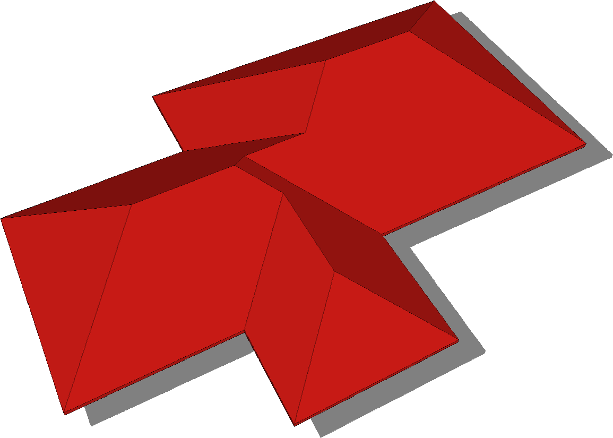
>
> 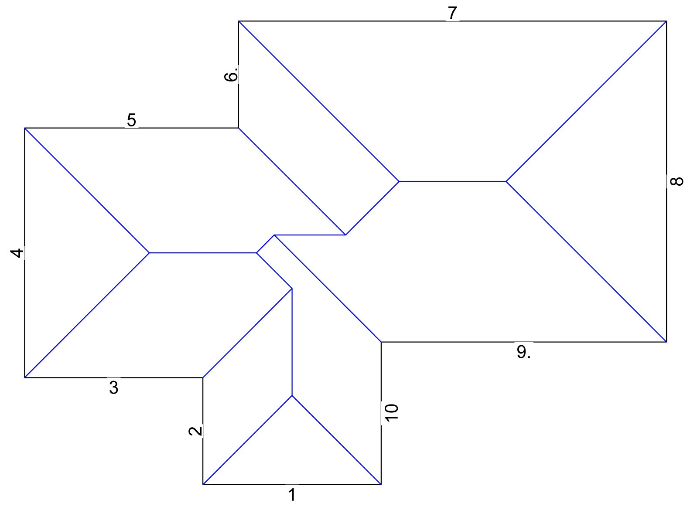

# 1 Table of Contents 

[1 Table of Contents [2](#table-of-contents)](#table-of-contents)

[2 Introduction [3](#introduction)](#introduction)

[2.1 How to Use this Manual [3](#how-to-use-this-manual)](#how-to-use-this-manual)

[2.2 Requirements [4](#requirements)](#requirements)

[3 Fundamental Knowledge of Wooden Roofs [5](#fundamental-knowledge-of-wooden-roofs)](#fundamental-knowledge-of-wooden-roofs)

[3.1 Different Roof Styles [5](#different-roof-styles)](#different-roof-styles)

[3.2 Overview of Roof Construction [7](#overview-of-roof-construction)](#overview-of-roof-construction)

[4 Roof Design [11](#roof-design)](#roof-design)

[4.1 Definitions [11](#definitions)](#definitions)

[4.2 Execution of Roof Designs [17](#execution-of-roof-designs)](#execution-of-roof-designs)

[A Hipped Roof with Equal Roof Slopes and Square Ground Plan [19](#a-hipped-roof-with-equal-roof-slopes-and-square-ground-plan)](#a-hipped-roof-with-equal-roof-slopes-and-square-ground-plan)

[B Hipped Roof with Equal Roof Slopes and Irregular Ground Plan [22](#b-hipped-roof-with-equal-roof-slopes-and-irregular-ground-plan)](#b-hipped-roof-with-equal-roof-slopes-and-irregular-ground-plan)

[C Ridged Roof with Unequal Roof Slopes and Square Ground Plan [25](#c-ridged-roof-with-unequal-roof-slopes-and-square-ground-plan)](#c-ridged-roof-with-unequal-roof-slopes-and-square-ground-plan)

[D Hipped Roof with Unequal Roof Slopes and Square Ground Plan [27](#d-hipped-roof-with-unequal-roof-slopes-and-square-ground-plan)](#d-hipped-roof-with-unequal-roof-slopes-and-square-ground-plan)

[E Hipped Roof with Equal Roof Slopes and Square, Complex Ground Plan [30](#e-hipped-roof-with-equal-roof-slopes-and-square-complex-ground-plan)](#e-hipped-roof-with-equal-roof-slopes-and-square-complex-ground-plan)

[F Hipped Roof with Unequal Roof Slopes and Irregular Ground Plan [35](#f-hipped-roof-with-unequal-roof-slopes-and-irregular-ground-plan)](#f-hipped-roof-with-unequal-roof-slopes-and-irregular-ground-plan)

[G Hipped Roof with Square Ground Plan and an Addition with a Different](#g-hipped-roof-with-square-ground-plan-and-an-addition-with-a-different)

[Eave Height [42](#eave-height)](#eave-height)

[4.2 Design Steps for Roof Designs [47](#design-steps-for-roof-designs)](#design-steps-for-roof-designs)

[4.3 Determination of True Areas and Dimensions [48](#determination-of-true-areas-and-dimensions)](#determination-of-true-areas-and-dimensions)

[A Hipped Roof with Equal Roof Slopes and Square Ground Plan [49](#a-hipped-roof-with-equal-roof-slopes-and-square-ground-plan-1)](#a-hipped-roof-with-equal-roof-slopes-and-square-ground-plan-1)

[B Hipped Roof with Equal Roof Slopes and Irregular Ground Plan [51](#b-hipped-roof-with-equal-roof-slopes-and-irregular-ground-plan-1)](#b-hipped-roof-with-equal-roof-slopes-and-irregular-ground-plan-1)

[5 How to Use the Dietrich's Software for Roof Designs [54](#how-to-use-the-dietrichs-software-for-roof-designs)](#how-to-use-the-dietrichs-software-for-roof-designs)

[6 List of Figures [58](#list-of-figures)](#list-of-figures)

[7 List of Tables [60](#list-of-tables)](#list-of-tables)

# 2 Introduction 

This document elaborates on roof designs and provides an overview of different roof styles and roof construction methods. The fundamental knowledge explained in the overview is essential for designing and describing complex wooden roofs.

The first section of this document focuses on roof design theory and specific terminology. The second part will explain in detail how to find true dimensions of roof surfaces.

The last part of the manual provides an overview of how to use the Dietrich's software to design any type of roof. The detailed explanation of the "roof calculation" module has already been explained in the tutorial

**CAD Design with the Dietrich's 3D CAD/CAM Software for Timber Construction.**

The overall objective of this tutorial is to allow the reader to gain knowledge to design roofs and gain a better understanding of the software.

## 2.1 How to Use this Manual 

This is an active document.

-   Click on a word of interest in the table of contents to be automatically linked to the related chapter.

-   Click on the camera icons to open Flash presentations showing the mode of operation (depending on the settings of your web browser you may have to select "open" to view the files).

-   Click on the Adobe PDF icons to open and print drawings.

If you have opened this PDF-file using your web browser and you may encounter problems with the links: In this case click on [here]{.underline} to go to the folder and open the document without your web browser.

The yellow and grey boxes in the tutorial are used to explain all steps necessary to design roofs:

-   *The content of the yellow, double framed boxes is used to describe all steps to manually design roofs.*

-   *The grey boxes describe the necessary steps for using the Dietrich's software. The path to every command used in the Dietrich's software will be described by the digit-code.*

-   *E.g. type **1 file***⮳ ***3 position***⮳ ***3 save** to save the design to disk.*

To successfully learn the content of each chapter it is recommended that you practice the examples provided in this tutorial.

## 2.2 Requirements 

The purpose of this tutorial is to explain how to design wooden roofs manually and how to design roofs using the Dietrich's software.

The following equipment listed below is required to design roofs manually:

-   Drafting paper

-   Pencils (different colors)

-   Rulers (set square)

-   Pair of compasses

-   Probably an eraser

Now it is time to start...have fun and good luck!

# 3 Fundamental Knowledge of Wooden Roofs 

The main purpose of roofs is to cover the house and to protect it against rain, snow, wind and extreme temperature. In this respect, the roof overhang is an important feature. On the one hand it provides protection against the sun and provides shade; on the other hand the roof overhang protects the wall against rain water penetration. Furthermore, the roof must provide structural functions to resist applied loads.

However, the roof is not only functional. It is also a design feature, and the roof often determines whether a building fits into the landscape. There are different styles of roofs. To determine the shape of a roof, the following aspects are generally taken into consideration: the building site, the allowable budget, the overall construction method of the roof, the usage of the building, and the development plan.

## 3.1 Different Roof Styles 

Roofs can be distinguished by their cross and longitudinal sections. Looking at the cross sections of roofs, there are shed roofs, gable roofs and gambrel roofs. On the other hand pitched roofs, hipped roofs, semi-hipped roofs and pyramid hip roofs are shapes of longitudinal sections. Finally there are also flat roofs.

+--------------------------------------------+-------------------------+
| **Description**                            | > **Slope**             |
+============================================+=========================+
| Flat roof                                  | > \< 5°                 |
+--------------------------------------------+-------------------------+
| Medium steep roof                          | > 5° -- 40°             |
+--------------------------------------------+-------------------------+
| Steep roof                                 | > \> 40°                |
+--------------------------------------------+-------------------------+

The slope of a roof is another important feature. Roofs between 5° and 40° are called medium steep roofs. Steep roofs are roofs with more than 40°. Roofs with less than 5° are called flat roofs.

> **[Shed roof:]{.underline}**
>
> 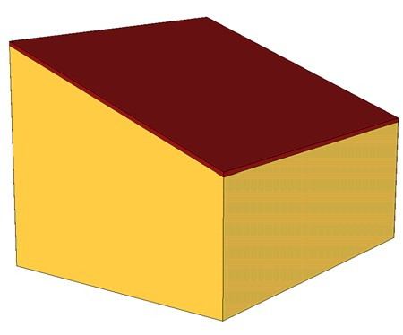The shed roof is one of the simplest styles of roof. It is costeffective because only one side of the roof is sloped. This type of roof design is mainly found in [Mediterranean](http://dict.leo.org/se?lp=ende&p=/Mn4k.&search=Mediterranean) areas. However, this design is getting more and more common, especially for green houses. The high front wall usually faces the south and thus helps *~Figure\ 1:\ Shed\ roof~* to accumulate the sunlight and heat.
>
> 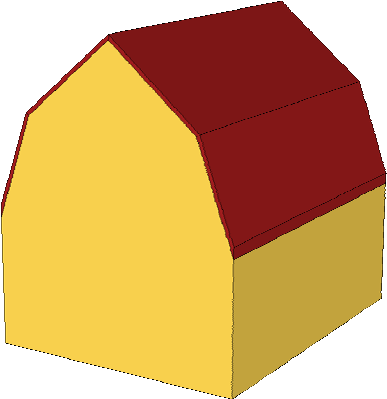**[Gable roof:]{.underline}**

*Figure 2:*

*Gable roof*

The gable roof is the most widespread style of roof. Because of its simple construction it is also cost-effective. A steeper roof results in more space in the finished attic. The gable wall is vertical.

> **[Gambrel roof:]{.underline}**
>
> The roof surface of the gambrel roof is double pitched. The lower surface is steeper than the upper one. Because of this design there is more space in the attic. This design is often used for barns.
>
> *Figure 3: Gambrel roof*
>
> 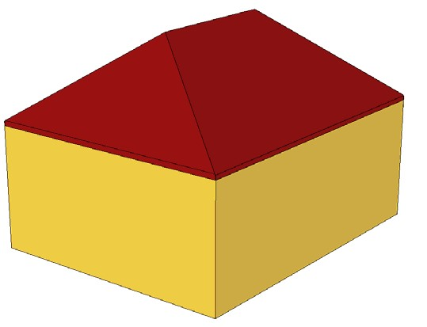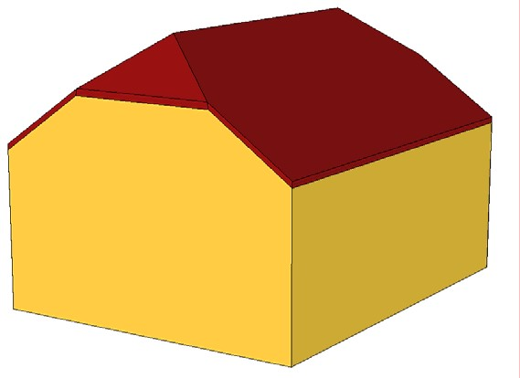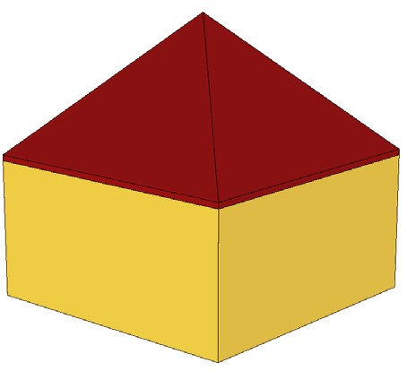**[Hipped roof:]{.underline}**

All four roof surfaces of the hipped roof are sloped. Consequently there is less space in the attic. Nevertheless, it can be a nice feature of a building.

**[Semi-hipped roof:]{.underline}** *Figure 4: Hipped roof*

The gable walls of the semi-hipped roof are only hipped at the top. The hip starts above the top floor. The gable walls below are vertical.

> *Figure 5: Semi-hipped roof*
>
> **[Pyramid hip roof:]{.underline}**

The pyramid hip roof consists of four equally sized and equally sloped roof surfaces. Again the little available space in the attic

can be a disadvantage. *~Figure\ 6:~ Pyramid hip roof*

> **[Flat roof:]{.underline}**
>
> 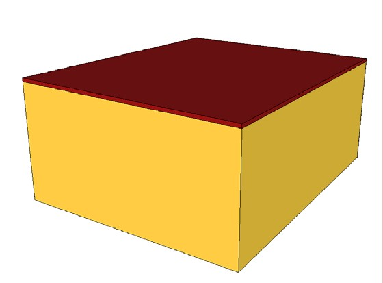Flat roofs appear level but always have some slope to allow water to run off. The advantage of that design is that the entire volume of the building can be used without a pitch. Flat roofs are mainly used on industrial buildings. Nevertheless, there are also a lot of nice possibilities for a house, such as roof decks or *~Figure\ 7:\ Flat\ roof~* living roofs, which are covered with vegetation.

## 3.2 Overview of Roof Construction 

Roofs can be constructed in many different ways. The purpose of this chapter is to give a short overview of different types of construction and to explain the difference between rafter roofs and plate roofs.

##### The rafter roof 

First of all the construction of rafter roofs shall be explained. Using this construction, the rafters and the ceiling joist form a triangulated truss. Consequently, a row of trusses form the roof body. Rafter roofs are mostly used for ridged roofs.

TRUSS

Rafter

Root point

Ceiling joist

*Figure 8: Rafter roof truss*

The structural system of rafter roofs is designed in a way that each rafter is flexible at the ridge and fixed at the bottom. Depending on the roof slope, rafters are subjected to compression, tension and bending loads. The root points of the rafters get vertical, as well as horizontal loads. Consequently, the ceiling joist gets tension. The roof loads on the roof, such as self weight, wind and snow loads are transferred to the ground by the exterior walls.

To prevent the collapse of the trusses, they have to be braced properly during construction and after completion of building (permanent bracing). There are different possibilities for bracing the roof surfaces, such as boards or wind braces. The latter consist of diagonal timber planks or steel bands.

Whereas rafter roofs are suitable for small spans, longer span trusses may need the support ties, as shown in the picture below.

Tie

TRUSS

*Figure 9:*

*Rafter roof*

##### The plate roof 

Beside the rafter roof, the plate roof is another common roof construction. This construction consists of rafters lying on two or more plates. The midspan and ridge plates are supported by posts and braces. In contrast to rafter roofs, the loads of plate roofs may be transferred by the internal walls.

Ridge plate

Midspan plate

Bottom plate

Rafter

*Figure 10: Plate roof*

Looking at the structural system of plate roofs, the rafters are stressed predominantly by bending. If the rafters are stressed only vertically they exclusively transfer vertical loads to the plates. Horizontal wind loads are transferred by the bottom plates.

As for the rafter roof, the plate roof has to be braced to prevent a shifting of the rafters.

*[Different types of plate roofs:]{.underline}*

Depending on the number of supporting plates, different types of plate roofs can be distinguished. Roofs with only a ridge plate are called single supported plate roofs, as the ridge plate has to be supported by posts and braces in order to transfer the roof loads to the internal walls. In case of midspan plates, the roof is called a twice or rather a triple supported roof, depending on the number of supported plates.

*Figure 11: King post*

In addition there are more complicated modifications of plate roofs, for example suspension structures and king post trusses, such as shown on the left.

# 4 Roof Design 

The following pages in this chapter explain roof layout procedures.

In order to construct roofs and to scribe and manufacture roof members the location of the components must be known. For this purpose the intersection lines of the roof surfaces have to be known, such as *ridge*, *hip* and *valley*. The process of finding the location of these lines is called "roof design". In order to design the roof, the roof outline and the roof sections are required. Furthermore, it is necessary to understand the different geometric planes, as well as the structure of the roof in 3D-space.

Below, the essential terms and definitions for roof designs will be explained.

## 4.1 Definitions 

##### Definition of lines and planes 

To understand the roof design it is necessary to know different lines and planes of roofs. In the following, the intersection lines of roof surfaces will be explained. To prevent misunderstandings, it is important to distinguish the line definitions on the 3D-models and ground plans.

3

***[:]{.underline}***

***[D-model]{.underline}***

***[3]{.underline}***

1

2

3

Eave

\(1\)

6

4

\(2\)

Ridge

1

5

1

1

\(3\)

Verge

5

4

2

4

\(4\)

Hip

1

\(5\)

Valley

4

\(6\)

Roof surface

1

1

*Figure 12:*

*3*

*D-model*

As displayed in the picture above, 3D-elevations are helpful to get an illustration of the roof. However, 3D-views neither show the lines in their true length nor their exact position. The definitions next to the 3D-model above should be used to designate lines in a 3Delevation, such as *"ridge"*, *"eave"* or *"verge"*.

***[Ground plan:]{.underline}***

*Figure 13:*

*Ground plan*

7

6

4

4

3

3

2

1

1

4

1

4

1

1

5

5

2

1

1

(1) Eave baseline

(2) Ridge baseline

(3) Verge baseline

(4) Hip baseline

(5) Valley baseline

(6) Roof base

(7) Apex

Looking at the ground plan of roofs, the lines are called *"baselines"*. The term *baseline* should be used for sloped lines and for lines of unknown slope that seem to be horizontal in the ground plan, e.g. rising eaves. The indicated terms next to the ground plan above should be used to designate these lines, such as *"hip baseline"*, *"valley baseline"* or *"verge baseline"*.

Furthermore, the term *"line"* should only be used for lines located on the horizontal plane.

In this case the true length of these lines appears in the ground plan.

[For example:]{.underline} The eave is called *"eave line"* in the ground plan only if the line is horizontal. If it is unknown whether lines are horizontal or not, the word *"baseline"* should be used. Hips and valleys are always sloped and, therefore, they are always called *"hip baselines"* and *"valley baselines"*.

##### Definition of points 

To avoid confusion when talking about roofs, it is necessary to define different significant points within the design.

-   ***[Apex]{.underline}***

The apex is the point where the *ridge baselines* join the *hip baselines*. In addition to the apex at the *ridge and hip baselines*, there is also an apex where the *ridge baseline* joins the *valley baselines*.

The apexes are illustrated in the picture on the right.

-   ***[Eave point]{.underline}***

The picture on the right shows an *eave point*.

A mnemonic to find the location of the *eave point* could be: *"The eave point is the point where the raindrop drips off the rafter."*

*Figure 15:*

*Eave point*

*Figure 14:*

*Apex*

This point is used to determine the *eave height*. The eaves are displayed in the picture below.

> 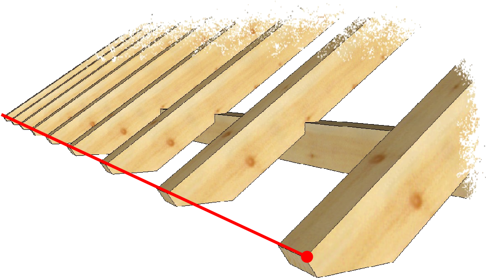

*Figure 16: Eaves*

##### Definition of sections 

Sections are construction planes that can be found either in a plane or in the 3D-space. Most of these construction planes are right triangles. Moreover, sections can be used to display side views or cross-sections.

In this document three different sections will be explained.

• ***[Vertical section]{.underline}***

A vertically sliced roof body shows the *vertical section* of a roof. This section is situated perpendicular to the ground plan and can be orientated in any direction. The dimensions of these sections are determined by the shape of the cross section. Different *vertical sections* can be distinguished:

3

1

2

*Figure 17:*

*Vertical section*

(1) Main roof section

(2) Hipped roof section

(3) Hip rafter section

-   ***[Normal section]{.underline}***

The *normal section* is a *vertical section*. It is perpendicular to the ground plan and it is right-angled to the horizontal eaves. The *normal section* shows the roof slope. The sloped lines are called *"section-rafters"*.

*Figure 18: Normal section*

-   ***[Surface section]{.underline}***

The surface section shows the true dimensions of roof surfaces and thus the surface area.

The following explanation provides a visual representation of this section:

If the roof volume is cut by a sloped plane, a specific shape of the cut area will be found. Often only a part of the *surface section* is needed, especially for the roof layout. In the picture below, the roof surface of a hipped roof is displayed. The geometry of this surface section is the result of the intersection of a sloped roof area and a roof body plane.

*Figure 19:*

*Surface section*

In order to obtain the surface area of roof surfaces*,* it is necessary to transform the *surface sections* in the horizontal plane. The axes of rotation are the eaves. With the help of the *surface sections* the true dimension of the roof surfaces and angles are found (γ~Μ~ = Main roof, γ~Η~ = Hipped roof). The procedure for determining the true dimensions will be explained in [chapter 4.3]{.underline}.

γ

Μ

γ

Η

γ

Μ

γ

Η

*Figure 20: Flipped surface sections*

##### Base measurement 

Finally, the "*base measurement*" has to be explained. The *base measurement* is the distance from the *eave baseline* to the *apex (ridge baseline)* measured in the ground level. It shows the measurement derived at the ground level of the *normal section* and is thus the width of the *normal section*.

The *base measurement* is easy to determine, as it is the half building width of the equal sloped roof cross section. Therefore, it is an aid to design simple roofs.

**Base measurement 1 = base measurement 2**

*Figure 21: Base measurement*

## 4.2 Execution of Roof Designs 

This chapter explains how to apply the knowledge already gained to find the location of *ridge*, *hip* and *valley baselines*. The location of these lines depends on whether roof surfaces are sloped equally or unequally. The arrangements of the eaves, as well as the ground plan, are also important to consider.

The table below provides an overview of roofs which will be designed in this tutorial. Click on the blue underlined roof descriptions to be automatically linked to the corresponding chapter.

+---------+--------------------------------------------------------------------------------------------------------+------------------------------------------------------------------------------------------------+-----------------------+
| **Nr.** | > **Roof type**                                                                                        | > **Roof body**                                                                                | > **Features**        |
+=========+========================================================================================================+================================================================================================+=======================+
| **A**   | [Hipped roof with equal]{.underline} [roof slopes and square]{.underline} [ground plan]{.underline}    | > 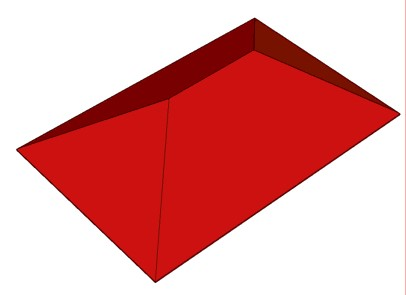             | Square ground plan    |
|         |                                                                                                        |                                                                                                |                       |
|         |                                                                                                        |                                                                                                | Equal roof slopes     |
|         |                                                                                                        |                                                                                                |                       |
|         |                                                                                                        |                                                                                                | Equal eave heights    |
+---------+--------------------------------------------------------------------------------------------------------+------------------------------------------------------------------------------------------------+-----------------------+
| **B**   | [Hipped roof with equal]{.underline} [roof slopes and irregular]{.underline} [ground plan]{.underline} | > 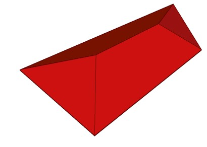{width="1.3668372703412073in" height="0.9725in"}             | Irregular ground plan |
|         |                                                                                                        |                                                                                                |                       |
|         |                                                                                                        |                                                                                                | Equal roof slopes     |
|         |                                                                                                        |                                                                                                |                       |
|         |                                                                                                        |                                                                                                | Equal eave heights    |
+---------+--------------------------------------------------------------------------------------------------------+------------------------------------------------------------------------------------------------+-----------------------+
| **C**   | [Ridged roof with unequal]{.underline} [roof slopes and square]{.underline} [ground plan]{.underline}  | > 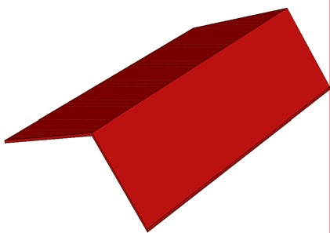{width="1.4027165354330708in" height="0.9866666666666667in"} | Square ground plan    |
|         |                                                                                                        |                                                                                                |                       |
|         |                                                                                                        |                                                                                                | Unequal roof slopes   |
|         |                                                                                                        |                                                                                                |                       |
|         |                                                                                                        |                                                                                                | Gable walls           |
|         |                                                                                                        |                                                                                                |                       |
|         |                                                                                                        |                                                                                                | Equal eave heights    |
+---------+--------------------------------------------------------------------------------------------------------+------------------------------------------------------------------------------------------------+-----------------------+
| **D**   | [Hipped roof with unequal]{.underline} [roof slopes and square]{.underline} [ground plan]{.underline}  | > 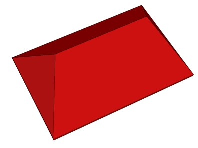{width="1.3173490813648294in" height="0.9891666666666666in"} | Square ground plan    |
|         |                                                                                                        |                                                                                                |                       |
|         |                                                                                                        |                                                                                                | Unequal roof slopes   |
|         |                                                                                                        |                                                                                                |                       |
|         |                                                                                                        |                                                                                                | Equal eave heights    |
+---------+--------------------------------------------------------------------------------------------------------+------------------------------------------------------------------------------------------------+-----------------------+

**↓ Continuation below ↓**

+-------+----------------------------------------------------------------------------------------------------------------------------+----------------------------------------------------------------------------------------------+--------------------------------------------+
| **E** | [Hipped roof with equal]{.underline} [roof slopes and square,]{.underline} [complex ground plan]{.underline}               | 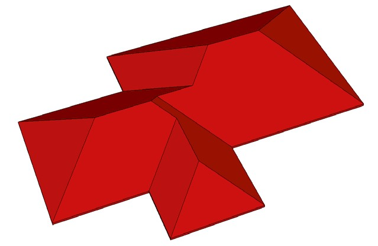{width="2.1301345144356953in" height="1.3841666666666668in"} | Square, complex ground plan                |
|       |                                                                                                                            |                                                                                              |                                            |
|       |                                                                                                                            |                                                                                              | Equal roof slope                           |
|       |                                                                                                                            |                                                                                              |                                            |
|       |                                                                                                                            |                                                                                              | Equal eave heights                         |
+=======+============================================================================================================================+==============================================================================================+============================================+
| **F** | [Hipped roof with unequal]{.underline} [roof slopes and irregular]{.underline} [ground plan]{.underline}                   | 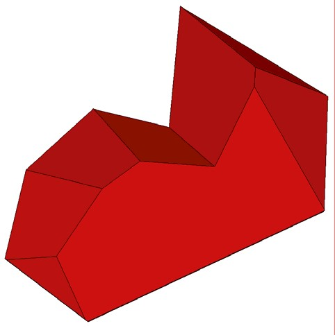{width="1.6072156605424321in" height="1.61in"}               | Irregular ground plan                      |
|       |                                                                                                                            |                                                                                              |                                            |
|       |                                                                                                                            |                                                                                              | Unequal roof slopes                        |
|       |                                                                                                                            |                                                                                              |                                            |
|       |                                                                                                                            |                                                                                              | Equal eave heights                         |
+-------+----------------------------------------------------------------------------------------------------------------------------+----------------------------------------------------------------------------------------------+--------------------------------------------+
| **G** | [Hipped roof with square]{.underline} [ground plan and an addition with a different eave]{.underline} [height]{.underline} | 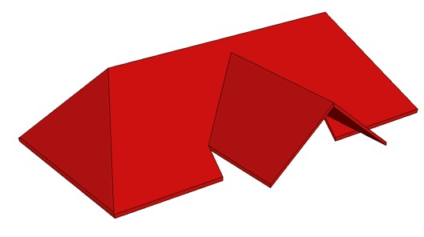{width="1.7642443132108487in" height="0.9866666666666667in"} | Square ground plan with extension (dormer) |
|       |                                                                                                                            |                                                                                              |                                            |
|       |                                                                                                                            |                                                                                              | Unequal roof slopes                        |
|       |                                                                                                                            |                                                                                              |                                            |
|       |                                                                                                                            |                                                                                              | Unequal eave heights                       |
+-------+----------------------------------------------------------------------------------------------------------------------------+----------------------------------------------------------------------------------------------+--------------------------------------------+

*Table 1: Overview of designed roofs*

### A Hipped Roof with Equal Roof Slopes and Square Ground Plan 

The first example explains how to design a hipped roof. All roof surfaces are sloped equally and the eaves are horizontal and on the same level. By means of a square ground plan, the roof is designed with the help of the *[base measurement]{.underline}*.

By offsetting the roof outline inwards by the distance of the *base measurement,* the *apexes* are found at the intersection of these resulting lines. To get the *hip baselines* the corners of the roof outline and the *apex* have to be connected. As the longer *eave lines* are horizontal, parallel, and on the same height, the *ridge line* is exactly in the middle between the eaves and also horizontal. The roof slopes do not matter, if they are equal.

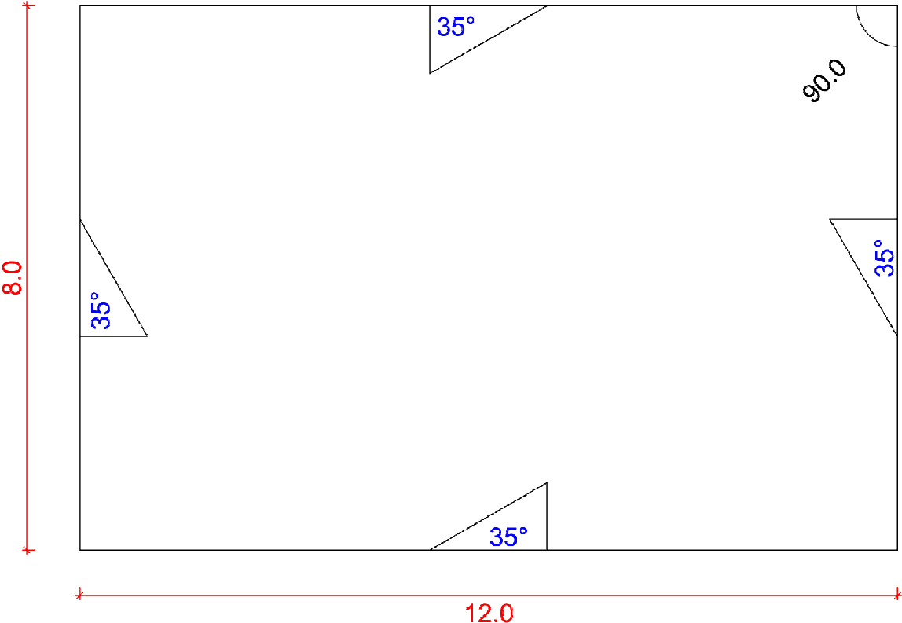{width="3.8266666666666667in" height="2.6433333333333335in"}

*[How to design this roof:]{.underline}*

**Task:**

The task is to design the equally hipped roof with a square ground plan on the right. The eave height is 0.0m and the roof slope of all roof surfaces is 35°.

*Figure 22: Ground plan A*

{width="0.37333333333333335in" height="0.49583333333333335in"}**Click to print drawing**

*[How to find the base measurement:]{.underline}*

As mentioned above the *base measurement* is easy to find and aids the roof design. In this case the *base measurement 2* is the half building width because of the equal roof slopes of the main roof. Since the hipped roof surfaces have the same slopes as the main roof, the *base measurement 1* corresponds to *base measurement 2*.

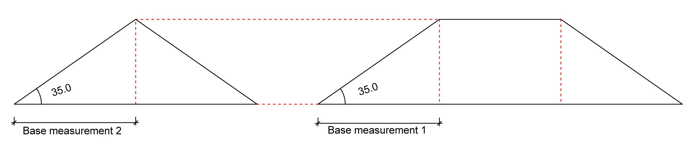{width="6.133333333333334in" height="1.3316666666666668in"}

*Figure 23: Base measurement*

**Base measurement 1 = base measurement 2**

**4 m = 4 m**

*[Draw the ground plan:]{.underline}*

+---------------------------------------------------------------------------------------------------------------------------------------------------------------------------------------+
| -   *Draw auxiliary lines parallel to the longer eave lines with an offset equal to base measurement 2 (4 m).*                                                                        |
|                                                                                                                                                                                       |
| -   *Create auxiliary lines parallel to the shorter eave lines with an offset equal to base measurement 1 (4 m)* ⮳ *you get the apex at the intersection of both construction lines.* |
|                                                                                                                                                                                       |
| -   *Connect the corners of the ground plan and the apex* ⮳ *hip baselines.*                                                                                                          |
+=======================================================================================================================================================================================+
|                                                                                                                                                                                       |
+---------------------------------------------------------------------------------------------------------------------------------------------------------------------------------------+
| • *Connect the apexes* ⮳ *ridge line.*                                                                                                                                                |
+---------------------------------------------------------------------------------------------------------------------------------------------------------------------------------------+
|                                                                                                                                                                                       |
+---------------------------------------------------------------------------------------------------------------------------------------------------------------------------------------+

*Figure 24: Designed roof A*

{width="3.3441666666666667in" height="2.3658333333333332in"}

*Figure 25: 3D elevation roof A*

*[Keep in mind:]{.underline}*

-   The ridge of equally sloped roofs with parallel and horizontal eaves is exactly in the middle between the eaves and also horizontal.

-   If all roof slopes are equal, all *base measurements* are the same.

-   The side view of a square ground plan shows the roof slopes and thus the *normal section*.

### B Hipped Roof with Equal Roof Slopes and Irregular Ground Plan 

This example explains how to find baselines for irregular ground plans. The slopes of the hipped roof are all the same and the eave height is at the same level and is horizontal.

If the roof slopes are all equal, the *apex* is the same distance from the related *eave lines*. Because of that, the *hip baseline* is the bisecting line of the building corner angle. Therefore, it is sufficient for roofs with equally sloped roof surfaces to find these bisecting lines. By intersecting these bisecting lines the *apex* is found. The roof slope does not matter if all of the slopes are equal.

The *ridge baseline* is the bisecting line of the longer non-parallel *eave lines.* In contrast to the examples shown above, the ridge is not horizontal.

*[There are different methods used to find bisecting lines:]{.underline}*

-   Measure half of the building corner angle with the help of a set square

> (90° corner: half the building corner angle = 45°)

-   Draw auxiliary lines parallel to the eaves with the same offset and find the *hip baselines* and *valley baselines* by connecting the building corners and the intersections (same result as the base measurement), the offset of the construction line should be between the eave line and the expected apex

-   Use a pair of compasses

    -   place the point of the compass at the corner of the roof outline and draw a circle with any radius

    -   place the point of the compass at the intersections of the roof outline and draw the circle and arcs as shown in the picture below

*Figure 26: How to get bisecting lines*

To create the bisecting lines each user should find the easiest and the most comfortable way. This tutorial uses the auxiliary lines parallel to the *eave lines*.

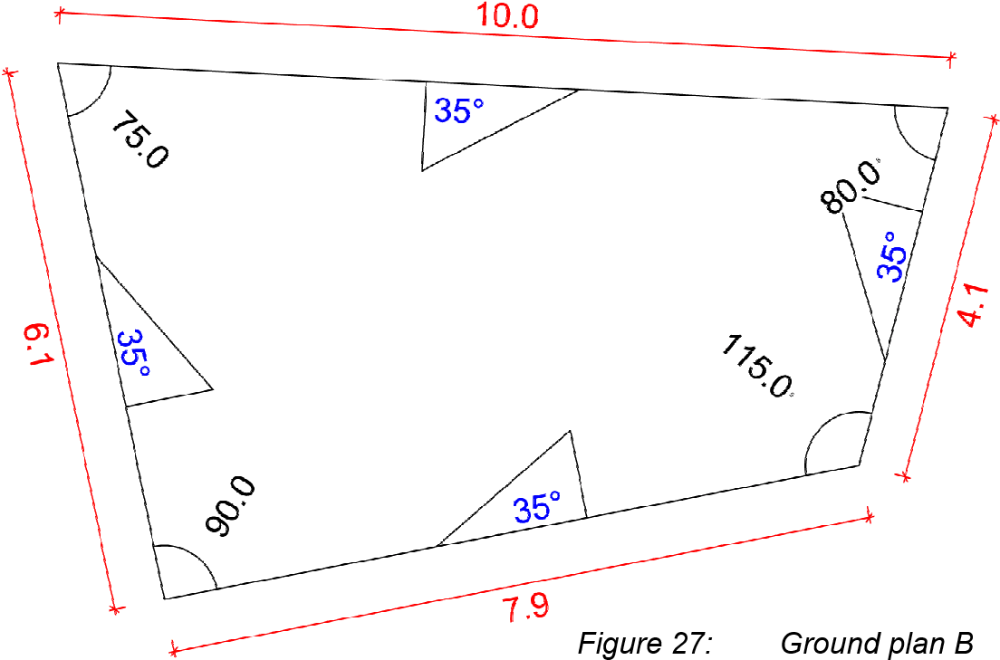{width="3.68in" height="2.43in"}*[How to design this roof:]{.underline}*

**Task:**

The task is to design the equally hipped roof on the left with an irregular ground plan. The eave height is 0.0m and the roof slope of every side is 35°.

{width="0.37333333333333335in" height="0.49583333333333335in"}**Click to print drawing**

*[Draw the ground plan:]{.underline}*

+-----------------------------------------------------------------------------------------+---+
| -   *Draw auxiliary lines with any offset parallel to the longer eave lines.*           |   |
|                                                                                         |   |
| -   *Draw auxiliary lines using the same offset parallel to the other eave lines.*      |   |
|                                                                                         |   |
| -   *Draw a construction line from the corners of the ground plan and the intersection* |   |
+=========================================================================================+===+
| > *of the auxiliary lines* ⮳ *hip baselines.*                                           |   |
+-----------------------------------------------------------------------------------------+---+
|                                                                                         |   |
+-----------------------------------------------------------------------------------------+---+
|                                                                                         |   |
+-----------------------------------------------------------------------------------------+---+
|                                                                                         |   |
+-----------------------------------------------------------------------------------------+---+

*Figure 28: Designed roof B*

> 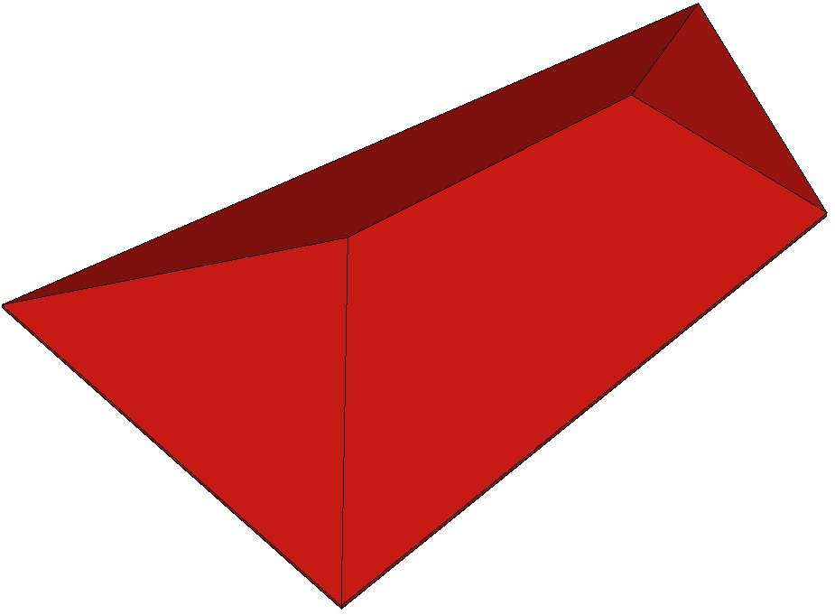{width="2.9141666666666666in" height="2.175in"} *Figure 29: 3D elevation roof B*

*[Keep in mind:]{.underline}*

-   It is sufficient for roofs with equally sloped roof surfaces to find the bisecting lines.

-   The roof slope does not matter as long as it is equal on all sides.

-   The *ridge baseline* is the bisecting line of the non-parallel *eave lines* and is not horizontal.

### C Ridged Roof with Unequal Roof Slopes and Square Ground Plan 

The next example demonstrates a ridged roof with two different roof slopes. The ridge point can be found by drawing the side view of this roof. The *ridge line* can be constructed by projecting the ridge point back into the ground plan.

The side view of a square ground plan shows the roof slopes as a *[normal section]{.underline}*.

If the eaves are horizontal and parallel, the ridge is also horizontal and parallel to the eaves.

*[How to design this roof:]{.underline}*

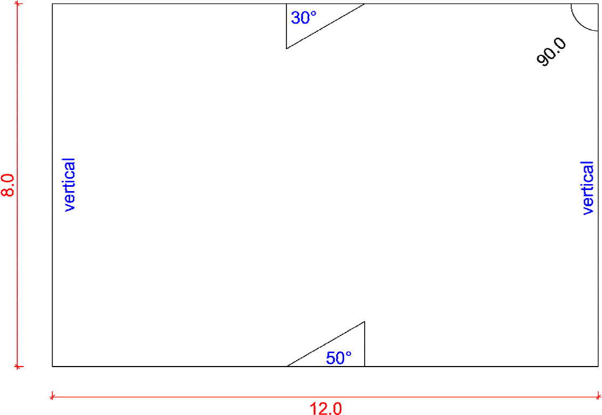{width="3.72in" height="2.57in"}

**Task:**

The task is to design the ridged roof on the right. The roof outline is a square and the eave height is 0.0 m. The two longitudinal roof surfaces are sloped. One slope is 30° and the other one is 50°. The gable walls are vertical.

*Figure 30: Ground plan C*

{width="0.37333333333333335in" height="0.49583333333333335in"}**Click to print drawing**

*[Draw the ground plan:]{.underline}*

+-------------------------------------------------------------------------------------------------------------------------------------------------------+---+
| -   *Draw the baseline for the elevation next to the ground plan.*                                                                                    |   |
|                                                                                                                                                       |   |
| -   *Start at the eave points to draw one section-rafter line of 30° and the other one of 50°. The intersection of both lines is called ridge point.* |   |
+=======================================================================================================================================================+===+
| • *Project the level of the ridge point into the ground plan* ⮳ *ridge line.*                                                                         |   |
+-------------------------------------------------------------------------------------------------------------------------------------------------------+---+
|                                                                                                                                                       |   |
+-------------------------------------------------------------------------------------------------------------------------------------------------------+---+
|                                                                                                                                                       |   |
+-------------------------------------------------------------------------------------------------------------------------------------------------------+---+
|                                                                                                                                                       |   |
+-------------------------------------------------------------------------------------------------------------------------------------------------------+---+

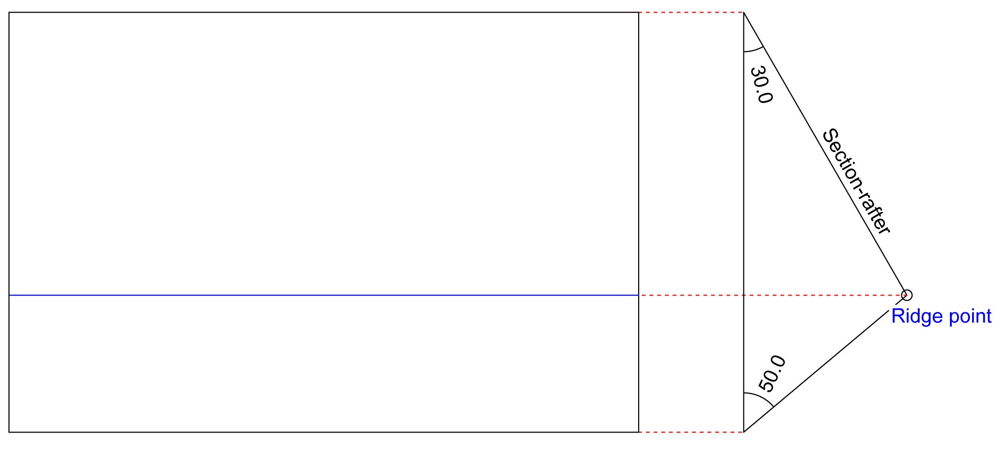{width="6.13in" height="2.815in"}

*Figure 31: Designed roof C*

> 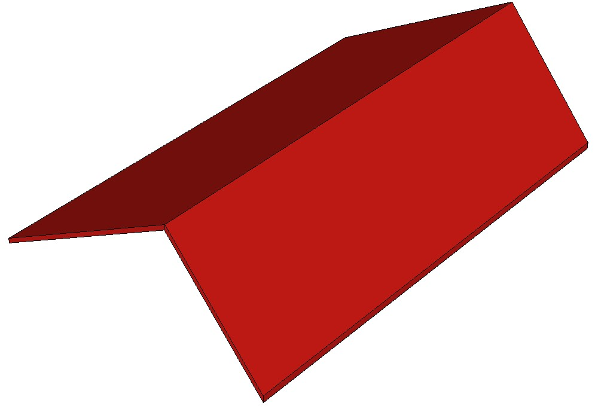{width="3.988332239720035in" height="2.756666666666667in"} *Figure 32: 3D elevation roof C*

*[Keep in mind:]{.underline}*

-   The ridge point is found by drawing the side view.

-   To get the *ridge line* the ridge point has to be plumbed back into the ground plan.

-   The side view of a square ground plan shows the roof slopes and the *normal section*.

### D Hipped Roof with Unequal Roof Slopes and Square Ground Plan 

This example will provide the knowledge needed to design a hipped roof with unequal roof slopes. The opposite roof surfaces are sloped equally. The *[normal sections]{.underline}* are needed to determine the *hip baselines* and the *ridge baseline*. To be able to draw the *normal section* the roof slopes have to be determined.

*[How to design this roof:]{.underline}*

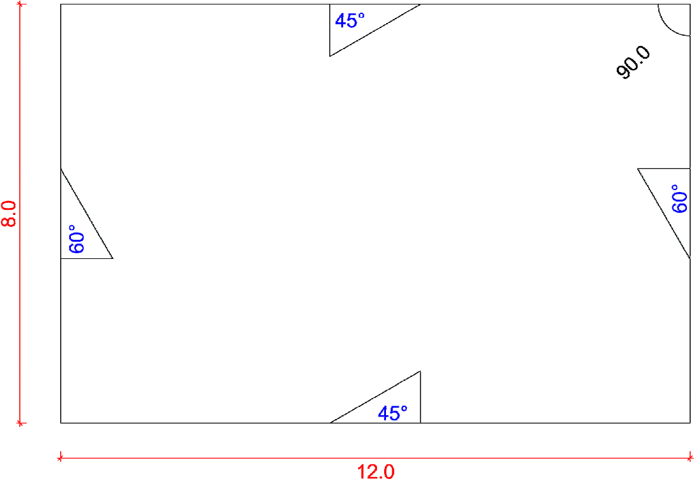{width="3.62in" height="2.5033333333333334in"}**Task:**

The task is to design the unequally hipped roof with the square ground plan on the right. The eave height is 0.0m and the roof slope of the main roof is 45° and the hipped roof slope is 60°.

*Figure 33: Ground plan D*

{width="0.37333333333333335in" height="0.49583333333333335in"}**Click to print drawing**

*[Draw the normal section:]{.underline}*

+-----------------------------------------------------------------------------------------------------------------------------------------------------------------------------------------------------------+---+
| -   *Draw all different normal sections together in one drawing.*                                                                                                                                         |   |
|                                                                                                                                                                                                           |   |
| -   *Draw a level line (auxiliary line) which intersects the section-rafter line in any height parallel to the baseline; the offset should be between the section baseline and the expected roof height.* |   |
|                                                                                                                                                                                                           |   |
| -   *Plumb these intersection points to the normal section baseline to get the meas-*                                                                                                                     |   |
+===========================================================================================================================================================================================================+===+
| > *urement retrieved in the ground level (AB, AC).*                                                                                                                                                       |   |
+-----------------------------------------------------------------------------------------------------------------------------------------------------------------------------------------------------------+---+
|                                                                                                                                                                                                           |   |
+-----------------------------------------------------------------------------------------------------------------------------------------------------------------------------------------------------------+---+
|                                                                                                                                                                                                           |   |
+-----------------------------------------------------------------------------------------------------------------------------------------------------------------------------------------------------------+---+
|                                                                                                                                                                                                           |   |
+-----------------------------------------------------------------------------------------------------------------------------------------------------------------------------------------------------------+---+

*Figure 34: Normal section roof D*

The ratio of the offsets AB and AC are equal to the ratio of the *base measurements* of each normal section.

In order to find the *hip and valley baselines* in the ground plan, the eaves have to be offset by the distances AB and AC.

*[Draw the ground plan:]{.underline}*

+-------------------------------------------------------------------------------------------------------------------------------------+---+
| -   *Draw an auxiliary line parallel to the eaves with the 60° roof slope in the offset AB.*                                        |   |
|                                                                                                                                     |   |
| -   *Draw an auxiliary line parallel to the eaves with the 45° roof slope in the offset AC.*                                        |   |
|                                                                                                                                     |   |
| -   *Draw an auxiliary line from the corners of the ground plan and to the intersections of the auxiliary lines* ⮳ *hip baselines.* |   |
+=====================================================================================================================================+===+
| • *Connect the apexes* ⮳ *ridge line.*                                                                                              |   |
+-------------------------------------------------------------------------------------------------------------------------------------+---+
|                                                                                                                                     |   |
+-------------------------------------------------------------------------------------------------------------------------------------+---+
|                                                                                                                                     |   |
+-------------------------------------------------------------------------------------------------------------------------------------+---+
|                                                                                                                                     |   |
+-------------------------------------------------------------------------------------------------------------------------------------+---+

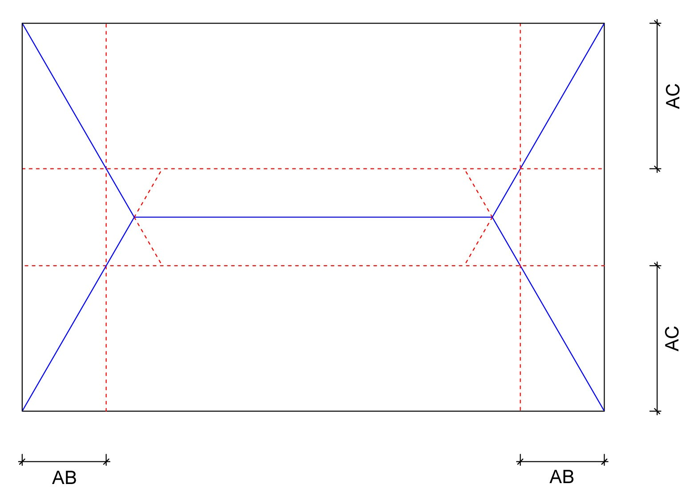{width="4.165in" height="2.985in"}

*Figure 35: Designed roof D*

> 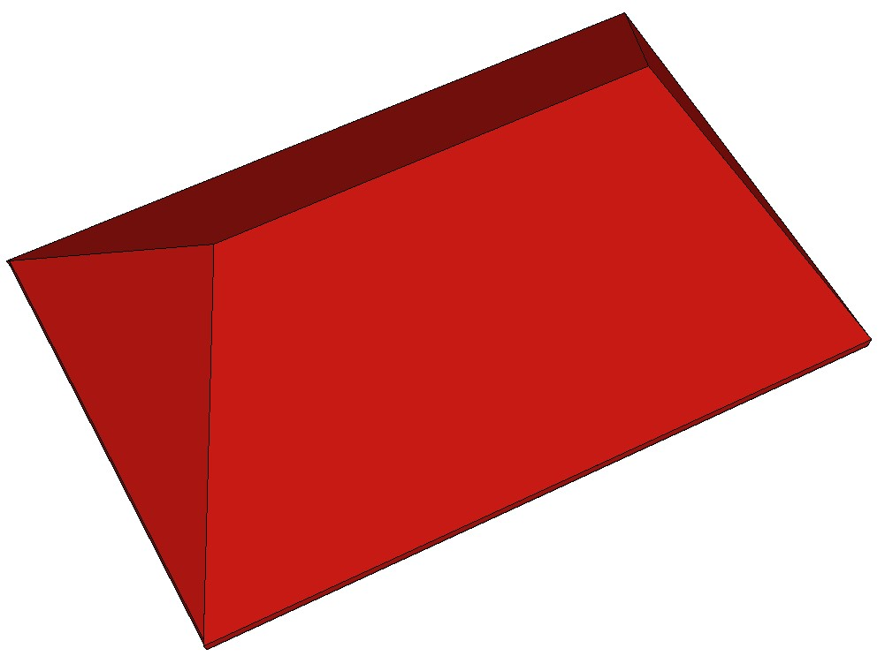{width="3.3958333333333335in" height="2.5625in"} *Figure 36: 3D elevation roof D*

*[Keep in mind:]{.underline}*

-   The ratio of the offsets AB and AC is equal to the ratio of both *base measurements*.

-   The ridges of roofs with parallel and horizontal eaves and equal roof slopes are always in the middle between these eaves and also horizontal.

### E Hipped Roof with Equal Roof Slopes and Square, Complex Ground Plan 

The previous examples have explained how to construct the roof design for fairly simple and standard roof ground plans. However, most buildings have irregular ground plans and complex roofs are often more appealing than the simple ones.

The following exercises will provide the knowledge needed to design complex roofs. If the ground plan of a roof is more complex, the *hip and* *valley baselines* have to be determined first.

All eaves in the next example are on the same level and all roof slopes are equal. As all roof slopes are the same, the *hip and valley baselines* are the bisecting lines of the building corner angles.

Some of the roof surfaces will automatically be defined by intersecting the *eave, hip* and *valley baselines*.

*[How to design this roof:]{.underline}*

{width="0.37333333333333335in" height="0.49583333333333335in"}**Task:**

The task is to design the roof shown on the right. The ground plan has ten eave baselines, the eave height is 0.0m and all roof slopes are 35°.

**Click to print drawing**

*Figure 37: Ground plan E*

*[Draw the ground plan:]{.underline}*

+--------------------------------------------------------------------------+
| -   *Create auxiliary lines for all hip baselines and valley baselines.* |
|                                                                          |
| -   *Highlight the baselines of the roof surfaces which can be defined.* |
|                                                                          |
| > *(Roof surfaces 1+4+8 are defined)*                                    |
+==========================================================================+
+--------------------------------------------------------------------------+

*Figure 38: Roof E: Step 1*

+-----------------------------------------------------------+------------------------------------------------------------------------------------------+
| > • *The eave lines 3 and 5 are parallel and horizontal.* | ⮳ *the ridge line is also parallel and horizontal and in the middle of both eave lines.* |
+===========================================================+==========================================================================================+
| > • *The eave lines 5 and 10 are perpendicular.*          | ⮳ *the upper hip baseline is the bisecting line of this corner.*                         |
+-----------------------------------------------------------+------------------------------------------------------------------------------------------+

*Figure 39: Roof E: Step 2*

+-----------------------------------------------------------+------------------------------------------------------------------------------------------+
| > • *The eave lines 5 and 9 are parallel and horizontal.* | ⮳ *the ridge line is also parallel and horizontal and in the middle of both eave lines.* |
|                                                           |                                                                                          |
|                                                           | > *(5 is defined)*                                                                       |
+===========================================================+==========================================================================================+
+-----------------------------------------------------------+------------------------------------------------------------------------------------------+

*Figure 40: Roof E: Step 3*

+-------------------------------------------------+------------------------------------------------------------------+
| > • *The eave lines 6 and 9 are perpendicular.* | ⮳ *the upper hip baseline is the bisecting line of this corner.* |
|                                                 |                                                                  |
|                                                 | > *(6 is defined)*                                               |
+=================================================+==================================================================+
+-------------------------------------------------+------------------------------------------------------------------+

*Figure 41: Roof E: Step 4*

+-----------------------------------------------------------+------------------------------------------------------------------------------------------+
| > • *The eave lines 7 and 9 are parallel and horizontal.* | ⮳ *the ridge line is also parallel and horizontal and in the middle of both eave lines.* |
|                                                           |                                                                                          |
|                                                           | > *(7+9 are defined)*                                                                    |
+===========================================================+==========================================================================================+
| > • *The eave lines 3 and 10 are perpendicular.*          | ⮳ *the upper hip baseline is the bisecting line of this corner.*                         |
|                                                           |                                                                                          |
|                                                           | > *(3 is defined)*                                                                       |
+-----------------------------------------------------------+------------------------------------------------------------------------------------------+

*Figure 42: Roof E: Step 5*

+------------------------------------------------------------+------------------------------------------------------------------------------------------+---+
| > • *The eave lines 2 and 10 are parallel and horizontal.* | ⮳ *the ridge line is also parallel and horizontal and in the middle of both eave lines.* |   |
+============================================================+==========================================================================================+===+
|                                                            | > *(2+10 are defined)*                                                                   |   |
+------------------------------------------------------------+------------------------------------------------------------------------------------------+---+
|                                                            |                                                                                          |   |
+------------------------------------------------------------+------------------------------------------------------------------------------------------+---+
|                                                            |                                                                                          |   |
+------------------------------------------------------------+------------------------------------------------------------------------------------------+---+
|                                                            |                                                                                          |   |
+------------------------------------------------------------+------------------------------------------------------------------------------------------+---+

{width="3.9608333333333334in" height="2.9366666666666665in"}

*Figure 43: Designed roof E*

> 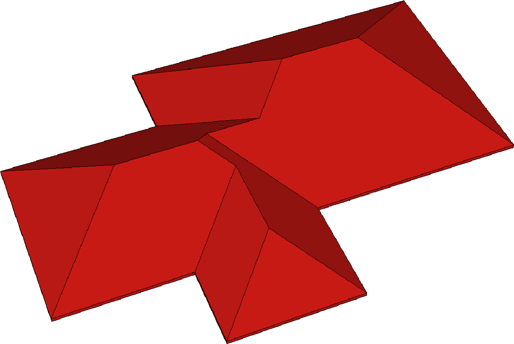{width="4.09in" height="2.736666666666667in"} *Figure 44: 3D elevation roof E*

*[Keep in mind:]{.underline}*

-   The *hip and* *valley baselines* have to be created first.

-   One roof surface should be defined step by step after the other.

-   The *hip and valley baselines* of equal sloped roofs are the bisecting lines.

-   The ridge of equally sloped roofs with parallel and horizontal eaves is exactly in the middle between these eaves and also horizontal to the ground level.

### F Hipped Roof with Unequal Roof Slopes and Irregular Ground Plan 

This roof has a very irregular ground plan and three different roof slopes. The eaves are horizontal and the eave heights are equal. However, not every ridge is horizontal because of the non-square roof outline.

First, the *normal sections* have to be created to get the measurement retrieved in the ground level. These distances have to be transferred to the corresponding eave lines in the ground plan. By connecting the intersections and the associated building corners, the *hip baselines* and the *valley baselines* are found. The intersection of these baselines is again the *apex*.

By extending the non-parallel eave lines, intersections are obtained. These intersections and the *apex* show the direction of the *ridge baselines*. *Ridge baselines* between nonparallel *eave lines* are the bisection lines, if the opposite roof surfaces are sloped equally.

*[How to design this roof:]{.underline}*

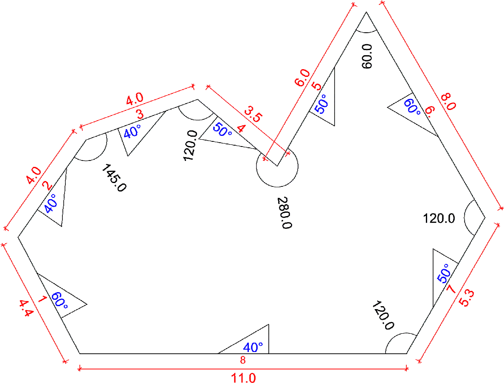{width="3.9566666666666666in" height="3.006666666666667in"}

**Task:**

The task is to design the unequally hipped roof with the irregular ground plan on the right. It has eight eaves with a height of 0.0m. The sides 1 and 6 have a roof slope of 60°, the sides 2, 3 and 8 have 40° and the sides 4, 5 and 7

have 50°. The *eave lines* 5 and 7 are parallel.

*Figure 45: Ground plan F*

{width="0.37333333333333335in" height="0.49583333333333335in"}**Click to print drawing**

*[Draw the normal section:]{.underline}*

+-------------------------------------------------------------------------------------+---+
| • *Draw all the normal sections and the level line to determine the measurement in* |   |
+=====================================================================================+===+
|                                                                                     |   |
+-------------------------------------------------------------------------------------+---+
| > *the ground level.*                                                               |   |
+-------------------------------------------------------------------------------------+---+
|                                                                                     |   |
+-------------------------------------------------------------------------------------+---+
|                                                                                     |   |
+-------------------------------------------------------------------------------------+---+

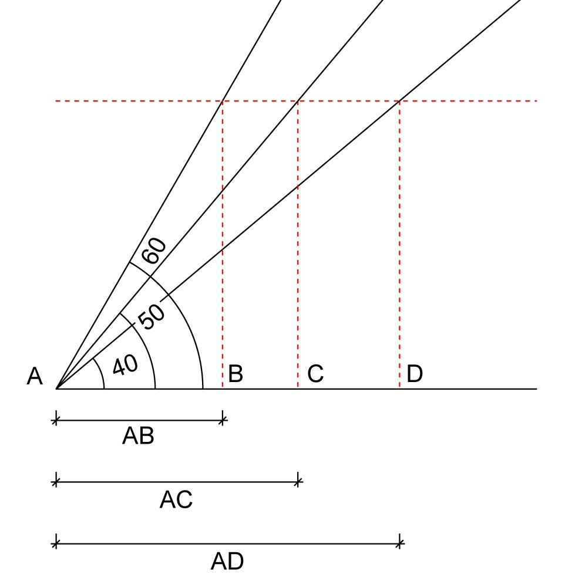{width="2.5841666666666665in" height="2.569166666666667in"}

*Figure 46: Normal section roof F [Draw the ground plan:]{.underline}*

-   *Extend eave 5 to find the intersection between the eave lines 5+8.*

-   *Extend eave 3 and 8 to get the intersection of both lines.*

-   *Extend eave 2 and 8 to find the intersection.*

-   *Extend eave 4 and 8 to find the intersection.*

*Figure 47: Roof F: Step 1*

-   *Draw auxiliary lines parallel to the eaves 2, 3 and 8 in the offset of AD.*

-   *Draw lines parallel to the eaves 3, 5 and 7 in the offset AC.*

-   *Draw lines parallel to the eaves 1 and 6 in the offset AB.*

*Figure 48: Roof F: Step 2*

-   *Find the intersections of these lines and connect the intersections to the associated building corner.*

-   *Draw the hip baselines of the roof surfaces 1 and 6.*

> *(Roof surfaces 1+6 are defined).*

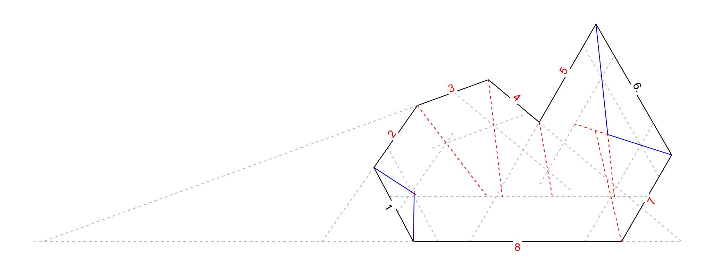{width="6.133333333333334in" height="2.3313571741032373in"}

*Figure 49: Roof F: Step 3*

+---------------------------------------------------------------------------------------+--------------------------------------------------------------------------------------------------+
| > • *Draw an auxiliary line from the intersection 2+8 to the apex of roof surface 1.* | ⮳ *The ridge baseline is the bisecting line because the roof surfaces are sloped equally (40°).* |
|                                                                                       |                                                                                                  |
|                                                                                       | > *(2 is defined)*                                                                               |
+=======================================================================================+==================================================================================================+
+---------------------------------------------------------------------------------------+--------------------------------------------------------------------------------------------------+

*Figure 50: Roof F: Step 4*

+---------------------------------------------------------------------------------------+--------------------------------------------------------------------------------------------------+
| > • *Draw an auxiliary line from the intersection 3+8 to the apex of roof surface 2.* | ⮳ *The ridge baseline is the bisecting line because the roof surfaces are sloped equally (40°).* |
|                                                                                       |                                                                                                  |
|                                                                                       | > *(3 is defined)*                                                                               |
+=======================================================================================+==================================================================================================+
+---------------------------------------------------------------------------------------+--------------------------------------------------------------------------------------------------+

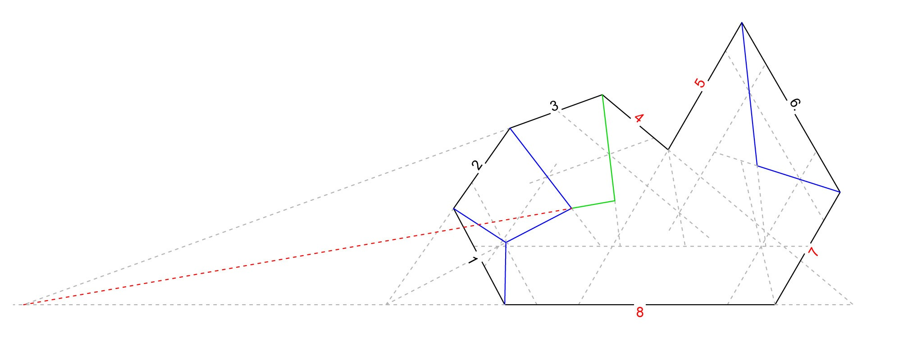{width="6.135in" height="2.3066666666666666in"}

*Figure 51: Roof F: Step 5*

+---------------------------------------------------------------------------------------+------------------------------------------------------------------------------------------------------------------+
| > • *Draw an auxiliary line from the intersection 4+8 to the apex of roof surface 3.* | ⮳ *The ridge baseline is NOT the bisecting line because the roof surfaces are NOT sloped equally (40° and 50°).* |
|                                                                                       |                                                                                                                  |
|                                                                                       | > *(4 is defined)*                                                                                               |
+=======================================================================================+==================================================================================================================+
+---------------------------------------------------------------------------------------+------------------------------------------------------------------------------------------------------------------+

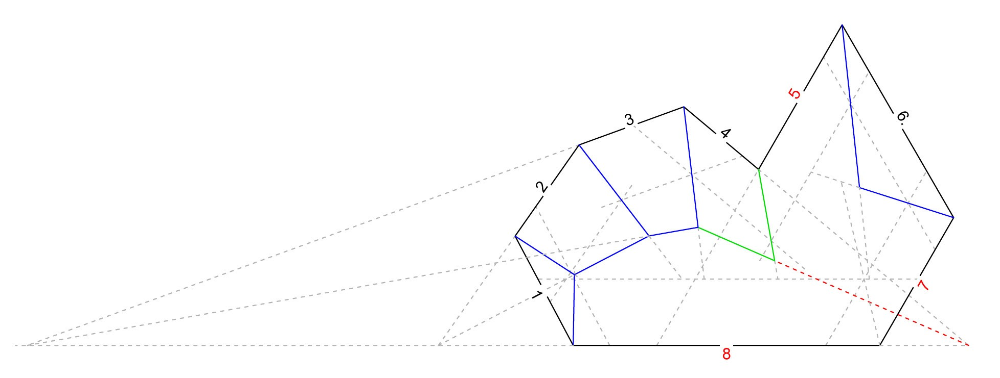{width="6.131666666666667in" height="2.326473097112861in"}

*Figure 52: Roof F: Step 6*

+---------------------------------------------------------------------------------------+------------------------------------------------------------------------------------------------------------------+
| > • *Draw an auxiliary line from the intersection 5+8 to the apex of roof surface 4.* | ⮳ *The ridge baseline is NOT the bisecting line because the roof surfaces are NOT sloped equally (40° and 50°).* |
|                                                                                       |                                                                                                                  |
|                                                                                       | > *(8 is defined)*                                                                                               |
+=======================================================================================+==================================================================================================================+
+---------------------------------------------------------------------------------------+------------------------------------------------------------------------------------------------------------------+

*Figure 53: Roof F: Step 7*

+-----------------------------------------------------------+----------------------------------------------------------------------------------------------------------------------------------+---+
| > • *The eave lines 5 and 7 are parallel and horizontal.* | ⮳ *the ridge line is also parallel and horizontal but NOT in the middle of both eave lines because they are not sloped equally.* |   |
+===========================================================+==================================================================================================================================+===+
|                                                           |                                                                                                                                  |   |
+-----------------------------------------------------------+----------------------------------------------------------------------------------------------------------------------------------+---+
|                                                           | > *(5+7 are defined)*                                                                                                            |   |
+-----------------------------------------------------------+----------------------------------------------------------------------------------------------------------------------------------+---+
|                                                           |                                                                                                                                  |   |
+-----------------------------------------------------------+----------------------------------------------------------------------------------------------------------------------------------+---+
|                                                           |                                                                                                                                  |   |
+-----------------------------------------------------------+----------------------------------------------------------------------------------------------------------------------------------+---+

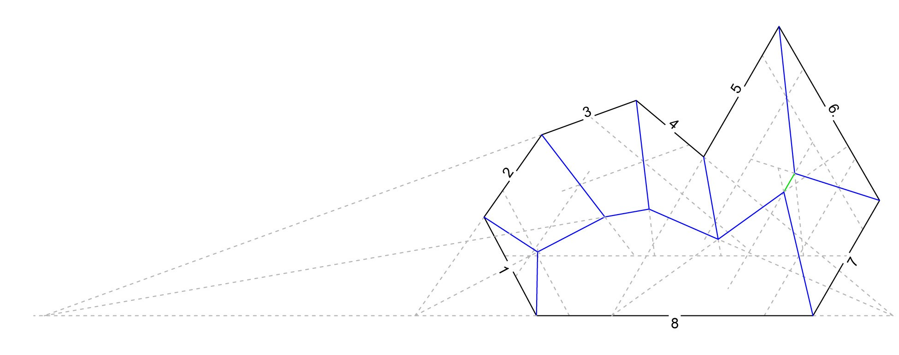{width="6.132501093613298in" height="2.4281496062992125in"}

*Figure 54: Roof F: Step 8*

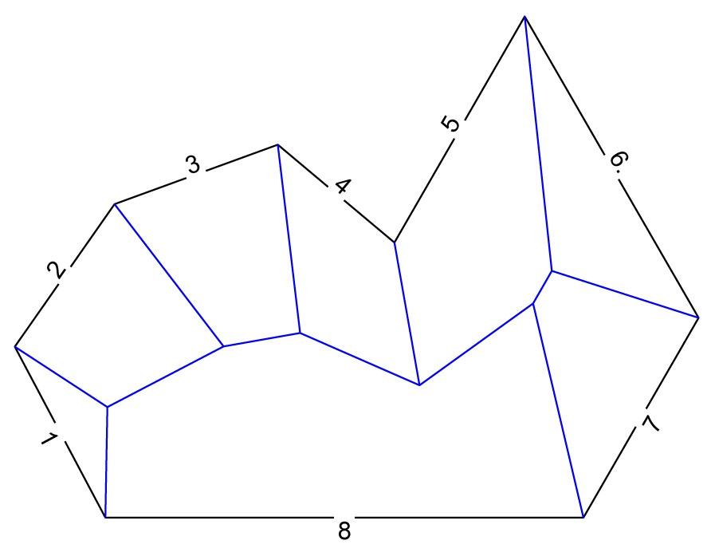{width="3.910833333333333in" height="3.0533333333333332in"}

*Figure 55: Designed roof F*

> 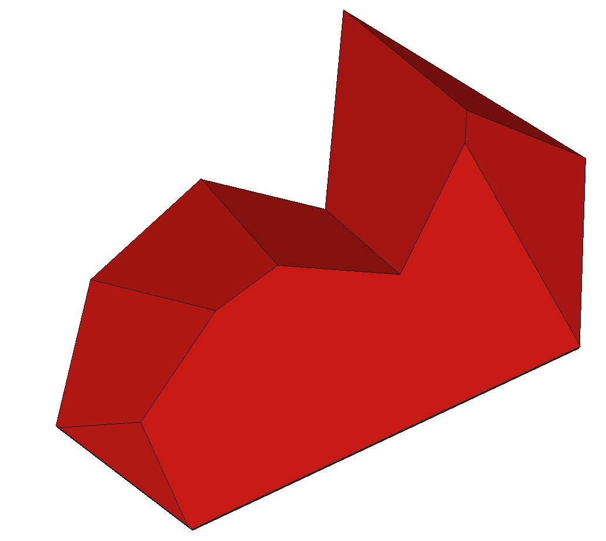{width="3.5866666666666664in" height="3.1933333333333334in"} *Figure 56: 3D elevation roof F*

*[Keep in mind:]{.underline}*

-   *Ridge baselines between non-parallel eave lines are the bisection line, if the roof surfaces are sloped equally.*

-   *The ridge of non-parallel eaves is not horizontal.*

### G Hipped Roof with Square Ground Plan and an Addition with a Different 

#### Eave Height 

In the last example, the building has an addition with a different eave height than the main building. Different eave heights can also occur when the main roof has dormers.

In order to design roofs with different eave heights, the front view, the side view and the ground plan have to be constructed. With the help of the projection of these views, the *hip, valley and ridge baselines are found*.

*[How to design this roof:]{.underline}*

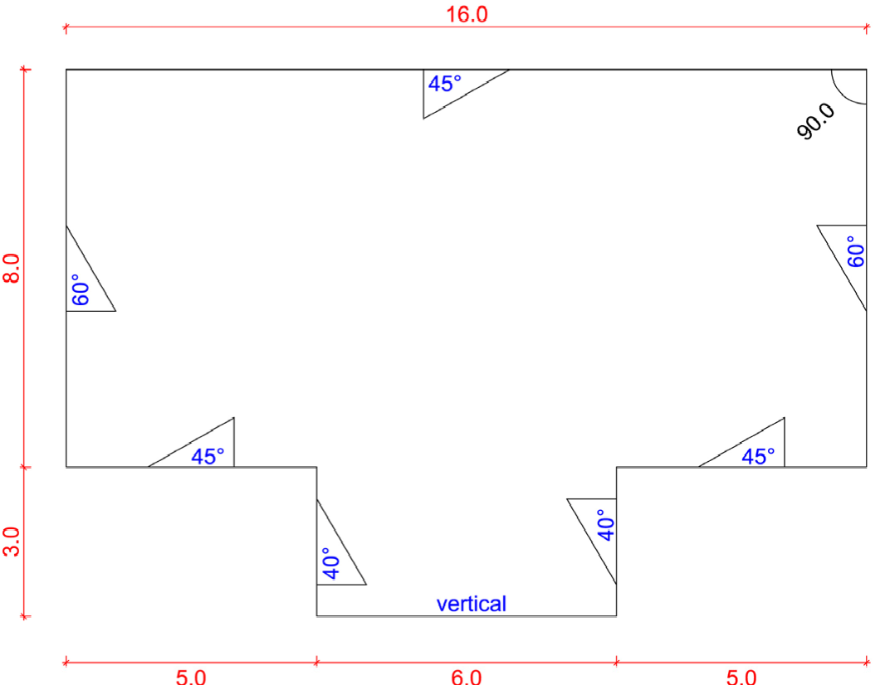{width="3.5533333333333332in" height="2.7533333333333334in"}{width="0.37333333333333335in" height="0.49583333333333335in"}**Task:**

The task is to design the roof on the right. The roof slope of the main roof is 45°, of the hipped roof 60° and of the addition 40°. The front wall of the addition is a gable wall. The eave height of the main roof is 0.0m and of the addition is 0.9m.

**Click to print drawing** *Figure 57: Ground plan G*

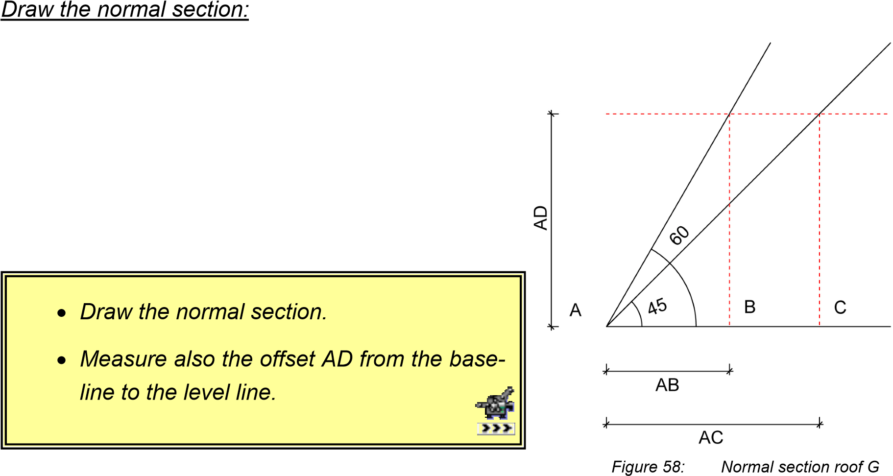{width="6.076666666666667in" height="3.24in"}

*[Draw the ground plan:]{.underline}*

-   *Create the hip and ridge baseline of the main building by offsetting the eaves in the related distance AB or AC.*

-   *Draw a 45° construction line from the right top corner of the ground plan.*

*Figure 59: Roof G: Step 1*

-   *Draw the baseline on each of the elevations with the same offset from the ground plan drawing.*

-   *Offset the baselines with the distance of AD.*

-   *Project all apexes into the side views.*

*Figure 60: Roof G: Step 2*

-   *Draw both elevations (as far as possible) by picking the intersections.*

-   *Draw the section of the addition in the front view -- the eave height is 0.9 m and the roof slope 40°.*

*Figure 61: Roof G: Step 3*

-   *Project the ridge point and the eave point of the addition on the 45° construction line to the side view to draw the addition.*

*Figure 62: Roof G: Step 4*

+------------------------------------------------------------------------------------------------------------------------------------------------------------------------------------------------------------------------------------------------------+
| • *The roof geometry on the ground plan is obtained by projecting the intersection points between the main roof and the roof addition, from the side view back into the ground plan and intersecting them with the projection of the eave and ridge* |
+======================================================================================================================================================================================================================================================+
| > *points from the front view.*                                                                                                                                                                                                                      |
+------------------------------------------------------------------------------------------------------------------------------------------------------------------------------------------------------------------------------------------------------+
|                                                                                                                                                                                                                                                      |
+------------------------------------------------------------------------------------------------------------------------------------------------------------------------------------------------------------------------------------------------------+
|                                                                                                                                                                                                                                                      |
+------------------------------------------------------------------------------------------------------------------------------------------------------------------------------------------------------------------------------------------------------+

*Figure 63: Roof G: Step 5*

*Figure 64: Designed roof G*

> 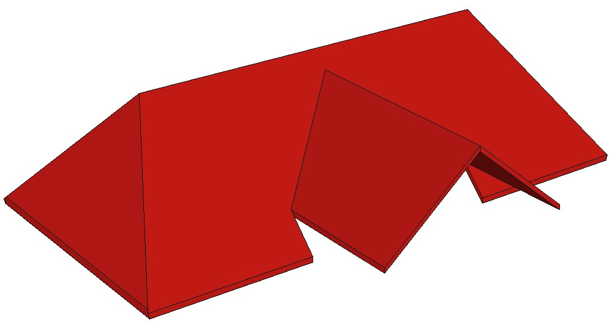{width="4.655in" height="2.466666666666667in"} *Figure 65: 3D elevation roof G*

*[Keep in mind:]{.underline}*

-   To construct the roof design for different *eave heights* the front view, side view and the ground plan are needed.

-   It is necessary to draw a 45° construction line in order to construct the projection.

## 4.2 Design Steps for Roof Designs 

The previous examples illustrate how to design simple and complex roofs. Now it is time to practice and construct the roof design for even more complex roofs.

The next chapter shows all of the steps necessary for designing roofs; followed by information on how to find true dimensions of roof surfaces.

Depending on the type of roof construction and the experience of the designer, most of the following steps are necessary to design roof structures.

-   Collect all information of the roof geometry

-   Draw the ground plan and mark all important points already known

-   Question if it is possible to divide the roof main body in different smaller standard roof bodies

-   Check for roof lines that are actually horizontal ⮳ e.g. *eave lines*

-   Create *normal sections*

-   Draw a *level line* in any height of the section

-   Plumb the intersections of the *level line* and the *section-rafters* to the baseline to get the measurements retrieved in the ground level ⮳ AB, AC

-   Offset the *eave lines* with the resulting ground offsets (AB, AC)

-   Connect the intersections of these auxiliary lines with the related corners of the building

-   Connect the *apexes* to find the *ridge baselines*

-   Connect the intersection lines (baselines) to a finished roof ground plan

-   Check the ground plan and the true dimensions of the roof surfaces and the true lengths of the hip rafters and valley rafters

## 4.3 Determination of True Areas and Dimensions 

This chapter focuses on how to find the true dimensions of roof surfaces. True dimensions are necessary to get the true lengths of hip and valley rafters, as well as the surface area.

To obtain the true dimensions the *[surface sections]{.underline}* are necessary. This was explained in chapter 4.1.

##### How to find the true areas and the true dimensions 

It is not possible to see the surface area of a roof surface or the true length of hip and valley rafters in an elevation or the ground plan. If the roof surfaces are not parallel to the drawing layer, they always appear smaller than the actual size. Only the horizontal *ridge and eave lines* appear in their true lengths.

It is only possible to see the true dimensions of a roof surface by looking at them perpendicularly to the roof surface. To see the true dimensions the *surface section* has to be flipped into the drawing plane. The rotation axis is the eaves.

> 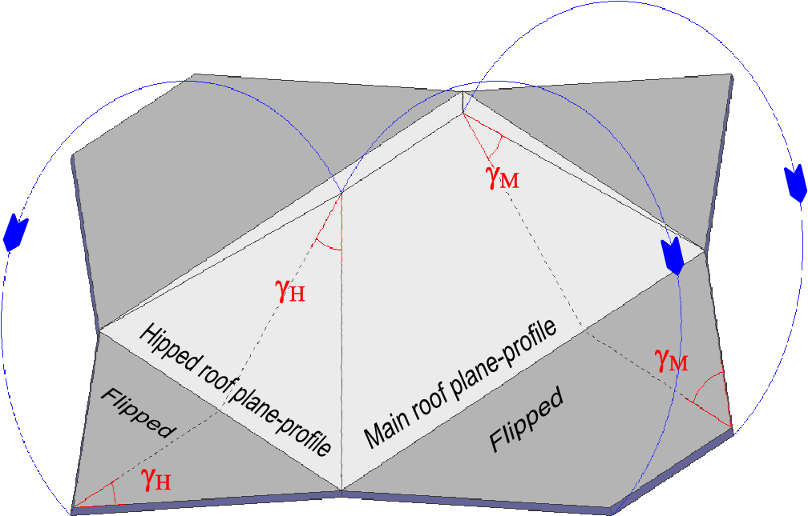{width="3.36in" height="2.15in"}

*Figure 66: Flipped surface sections*

To find the true dimensions of roof surfaces the ground plan and the *normal sections* are necessary.

The determination of the true dimensions is shown on two of the previously designed roofs. Simple roofs are given as an example, but this method can also be used for more complex roofs.

### A Hipped Roof with Equal Roof Slopes and Square Ground Plan 

The first roof example shows how to find true dimensions of a hipped roof with equal roof slopes of 35°.

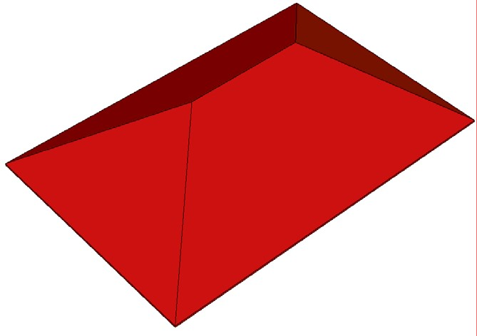{width="2.22955271216098in" height="1.5691666666666666in"}

As mentioned before, at least the ground plan and the normal section is needed. The normal section is necessary to get the ridge height. A pair of compasses is quite useful to transfer the measurements.

*Figure 67: True area roof A*

The side view of square ground plans show the normal section. Thus it is sufficient to draw the side view and the ground plan for the first example.

*[Draw the ground plan and the side view of the roof:]{.underline}*

-   *Transfer the length of the section-rafter line of the side view into the ground plan with the help of the pair of compasses.*

-   *Draw auxiliary lines through the apexes of the ground plan perpendicular to the eaves.*

*Figure 68: Roof A: Step 1*

-   *Transfer the length of the section-rafter line in the ground plan to both sides with the help of the pair of compasses, do this on every building corner.*

*Figure 69: Roof A: Step 2*

+--------------------------------------------------------------------------------------+
| • *Draw the true roof surfaces into the ground plan by picking the intersections of* |
+======================================================================================+
| > *the circles and the auxiliary lines.*                                             |
+--------------------------------------------------------------------------------------+
|                                                                                      |
+--------------------------------------------------------------------------------------+
|                                                                                      |
+--------------------------------------------------------------------------------------+

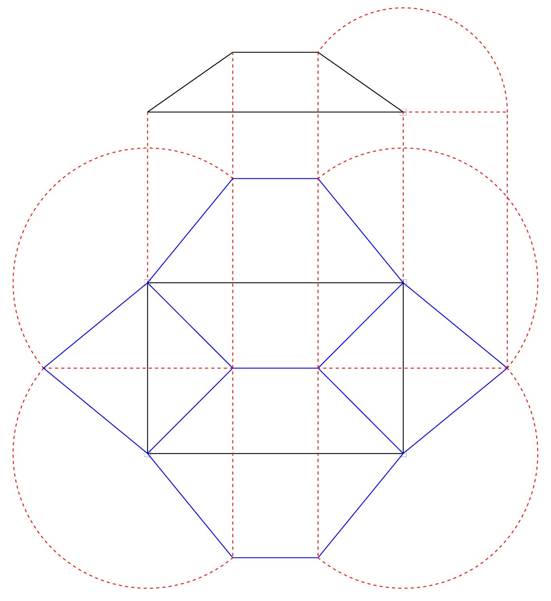{width="3.3275in" height="3.6324989063867017in"}

*Figure 70: True areas of roof A*

### B Hipped Roof with Equal Roof Slopes and Irregular Ground Plan 

Finally the determination of the true dimensions is shown on the roof with an irregular ground plan. Every side is sloped at 35°.

{width="2.381666666666667in" height="1.7708333333333333in"}

The *normal sections* have to be drawn perpendicular to the *eave lines*.

*Figure 71: True area roof B*

This method is also useful to find the true dimensions of roof surfaces for roofs with different roof slopes

*[Draw the ground plan:]{.underline}*

-   *Draw an auxiliary line perpendicular to the related eave through the apex.*

-   *Extend the eave line and draw a parallel auxiliary line to the eave through the apex.*

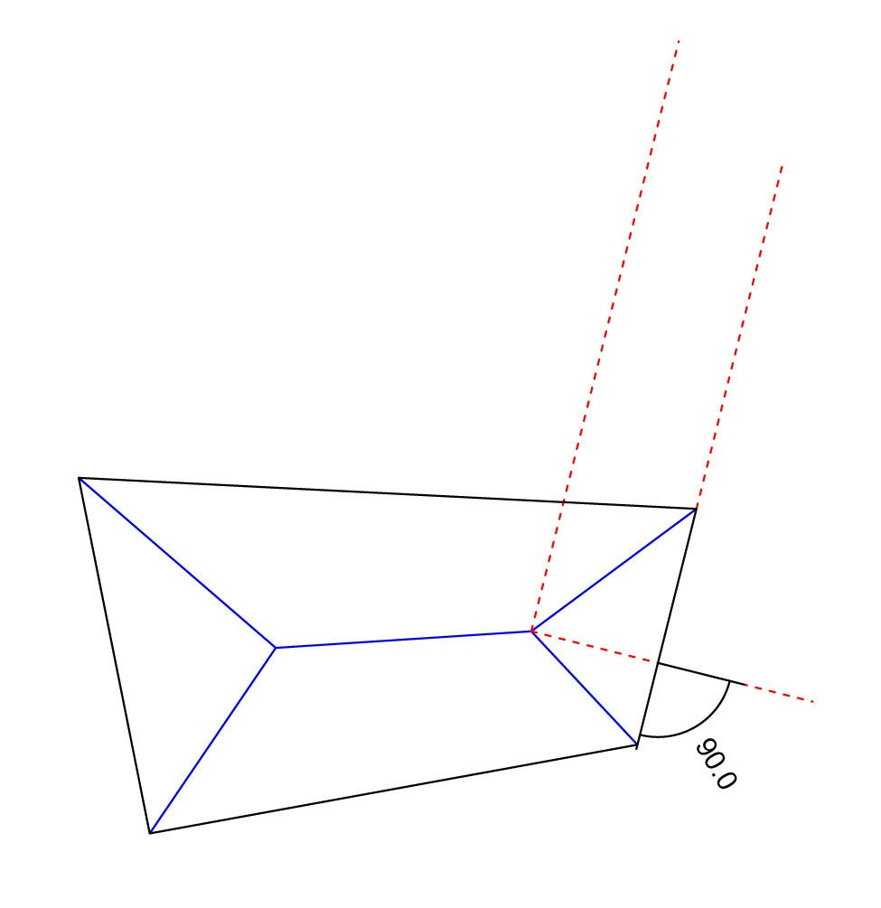{width="2.4133333333333336in" height="2.4825in"}

*Figure 72: Roof B: Step 1*

-   *Create the normal section in any height perpendicular to these auxiliary lines.*

-   *Transfer the section-rafter length back into the ground plan with the help of a pair of compasses.*

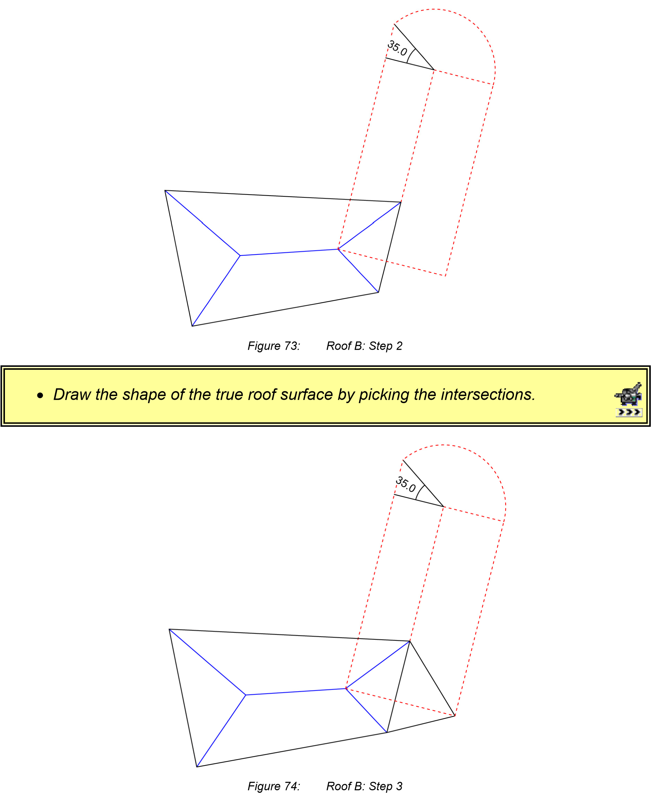{width="6.16in" height="7.5in"}

In order to find the true dimensions of the other roof surface, the steps explained above have to be repeated.

*Figure 75: True areas of roof B*

The roof design ends with an overview of how to design roofs with the help of the Dietrich's software. It takes less work and time designing roofs with the software than it does to do it manually.

# 5 How to Use the Dietrich's Software for Roof Designs 

The Dietrich's software consists of different program modules. The following modules are used to construct roofs:

(1) **D-Roof Basic** design and calculate roofs

> (see: Roof Design Tutorial)

(2) **D-Roof Professional** enter roof members

> (see: Roof Layout Tutorial)

The Dietrich's software modules have already been explained in the tutorial

**CAD Design with the Dietrich's 3D CAD/CAM Software for Timber Construction.**

It is assumed that the user already knows how to apply the software in general. This chapter gives an overview of how to design roofs with the Dietrich's software.

*[How to design roofs with the Dietrich's software:]{.underline}*

-   *Open the Dietrich's software and create a new position.*

-   *Type **1 file***⮳ ***2 change program module*** ⮳ ***5 roof calculation** to switch to the roof calculation.*

First, the house outline has to be entered. Later add the roof information, such as the roof slope, the roof overhang and the eaves height.

There are different ways to create the building outline:

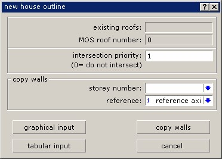{width="2.1775in" height="1.56in"}

-   Copy walls

-   Graphical input

-   Tabular input

*Figure 76: New house outline window*

-   *Type **2 roof calculation ***⮳ ***9 building side** to select the building sides to enter the roof information.*

There are different possibilities to insert the information:

  -----------------------------------------------------------------------
  • *The roof slope, roof overhang and eave height have to be defined.*
  -----------------------------------------------------------------------

  -----------------------------------------------------------------------

-   For simple roofs it is sufficient to enter the data directly in the pop-up window.

*Figure 77: Roof area window*

-   Another possibility is to create a profile (normal section).

> A normal section in the Dietrich's software is called profile. All the information to define the roof can be entered in the profile windows.

*Figure 78:*

*Roof area window*

+-----------------------------------------------------------------------+
| -   *Click on the tree next to "profile" box.*                        |
|                                                                       |
| -   *Select "new" to create a new roof profile.*                      |
+=======================================================================+
+-----------------------------------------------------------------------+

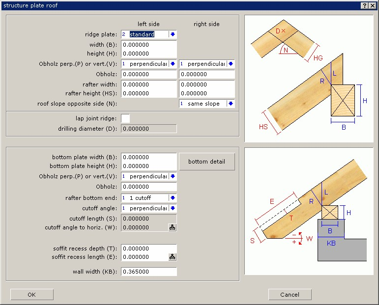{width="2.631666666666667in" height="2.118333333333333in"}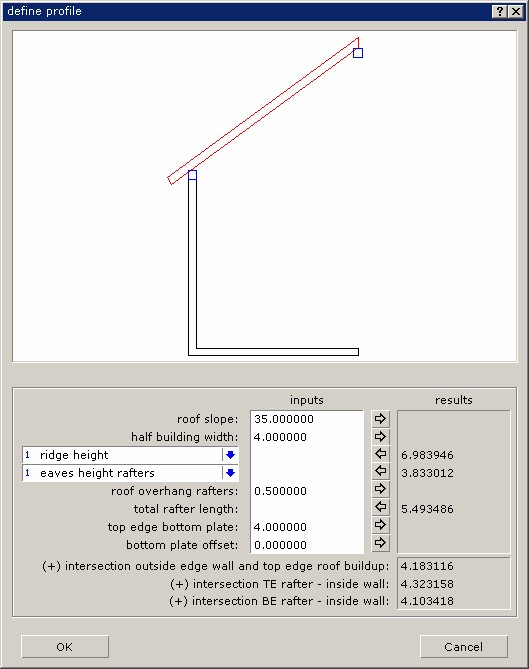{width="2.3641666666666667in" height="3.0in"}Enter the timber dimensions and the necessary construction information in the *structure plate roof-window*.

Confirm by clicking OK.

*Figure 79: Structure plate roof window*

After confirming with OK a second window will appear. In this window it is possible to enter information, such as the roof slope and the roof overhang.

Only certain information should be input since the correct information is necessary in order to calculate the profile. If more or less information is required, an error message will state that the profile is under or over defined.

*Figure 80: Define profile window*

-   *Type **1 file ***⮳ ***1 models*** ⮳ ***3 save** to save the current section and **1 file ***⮳ ***06 quit** to switch back to the roof calculation.*

-   *Click OK to transfer the information to the roof outline.*

Every roof outline has to be clicked to attach the necessary information.

The "Roof Design Tutorial" ends with this chapter. In order to become more familiar with the roof design, it is recommended to practice the exercises above on drafting paper and to apply roof design to complex roofs.

The first section of this manual has provided the knowledge for manual roof design and the second part detailed the procedure to use the Dietrich's software for roof design.

The roof design tutorial is the basis for continuing with the roof layout. Roof layout includes the scribing and manufacturing of roof members, especially the hip rafters, valley rafters and their corresponding jack rafters.

The [Roof Layout Tutorial]{.underline} will provide the knowledge of how to scribe roof members.

# 6 List of Figures 

*Figure 1:* *Shed roof\...\...\...\...\...\...\...\...\...\...\...\...\...\...\...\...\...\...\...\...\...\...\...\...\...\...\...\...\...\...\...\...\...\...5*

*Figure 2:* *Gable roof\...\...\...\...\...\...\...\...\...\...\...\...\...\...\...\...\...\...\...\...\...\...\...\...\...\...\...\...\...\...\...\...\.....6*

*Figure 3:* *Gambrel roof\...\...\...\...\...\...\...\...\...\...\...\...\...\...\...\...\...\...\...\...\...\...\...\...\...\...\...\...\...\...\...\....6*

*Figure 4:* *Hipped roof\...\...\...\...\...\...\...\...\...\...\...\...\...\...\...\...\...\...\...\...\...\...\...\...\...\...\...\...\...\...\...\...\...6*

*Figure 5:* *Semi-hipped roof\...\...\...\...\...\...\...\...\...\...\...\...\...\...\...\...\...\...\...\...\...\...\...\...\...\...\...\...\...\...6*

*Figure 6:* *Pyramid hip roof \...\...\...\...\...\...\...\...\...\...\...\...\...\...\...\...\...\...\...\...\...\...\...\...\...\...\...\...\...\....6*

*Figure 7:* *Flat roof \...\...\...\...\...\...\...\...\...\...\...\...\...\...\...\...\...\...\...\...\...\...\...\...\...\...\...\...\...\...\...\...\...\.....6*

*Figure 8:* *Rafter roof truss\...\...\...\...\...\...\...\...\...\...\...\...\...\...\...\...\...\...\...\...\...\...\...\...\...\...\...\...\...\.....7*

*Figure 9:* *Rafter roof\...\...\...\...\...\...\...\...\...\...\...\...\...\...\...\...\...\...\...\...\...\...\...\...\...\...\...\...\...\...\...\...\.....8*

*Figure 10:* *Plate roof\...\...\...\...\...\...\...\...\...\...\...\...\...\...\...\...\...\...\...\...\...\...\...\...\...\...\...\...\...\...\...\...\...\...9*

*Figure 11:* *King post\...\...\...\...\...\...\...\...\...\...\...\...\...\...\...\...\...\...\...\...\...\...\...\...\...\...\...\...\...\...\...\...\.....10*

*Figure 12:* *3D-model\...\...\...\...\...\...\...\...\...\...\...\...\...\...\...\...\...\...\...\...\...\...\...\...\...\...\...\...\...\...\...\...\....11*

*Figure 13:* *Ground plan\...\...\...\...\...\...\...\...\...\...\...\...\...\...\...\...\...\...\...\...\...\...\...\...\...\...\...\...\...\...\...\...12*

*Figure 14:* *Apex 13*

*Figure 15:* *Eave point\...\...\...\...\...\...\...\...\...\...\...\...\...\...\...\...\...\...\...\...\...\...\...\...\...\...\...\...\...\...\...\...\...13*

*Figure 16:* *Eaves\...\...\...\...\...\...\...\...\...\...\...\...\...\...\...\...\...\...\...\...\...\...\...\...\...\...\...\...\...\...\...\...\...\...\....13*

*Figure 17:* *Vertical section\...\...\...\...\...\...\...\...\...\...\...\...\...\...\...\...\...\...\...\...\...\...\...\...\...\...\...\...\...\....14*

*Figure 18:* *Normal section\...\...\...\...\...\...\...\...\...\...\...\...\...\...\...\...\...\...\...\...\...\...\...\...\...\...\...\...\...\.....14*

*Figure 19:* *Surface section\...\...\...\...\...\...\...\...\...\...\...\...\...\...\...\...\...\...\...\...\...\...\...\...\...\...\...\...\...\....15*

*Figure 20:* *Flipped surface sections\...\...\...\...\...\...\...\...\...\...\...\...\...\...\...\...\...\...\...\...\...\...\...\...\.....15*

*Figure 21:* *Base measurement \...\...\...\...\...\...\...\...\...\...\...\...\...\...\...\...\...\...\...\...\...\...\...\...\...\...\...\...16*

*Figure 22:* *Ground plan A \...\...\...\...\...\...\...\...\...\...\...\...\...\...\...\...\...\...\...\...\...\...\...\...\...\...\...\...\...\.....19*

*Figure 23:* *Base measurement \...\...\...\...\...\...\...\...\...\...\...\...\...\...\...\...\...\...\...\...\...\...\...\...\...\...\...\...20*

*Figure 24:* *Designed roof A\...\...\...\...\...\...\...\...\...\...\...\...\...\...\...\...\...\...\...\...\...\...\...\...\...\...\...\...\...\...20*

*Figure 25:* *3D elevation roof A\...\...\...\...\...\...\...\...\...\...\...\...\...\...\...\...\...\...\...\...\...\...\...\...\...\...\...\....21*

*Figure 26:* *How to get bisecting lines\...\...\...\...\...\...\...\...\...\...\...\...\...\...\...\...\...\...\...\...\...\...\...\...\...23*

*Figure 27:* *Ground plan B \...\...\...\...\...\...\...\...\...\...\...\...\...\...\...\...\...\...\...\...\...\...\...\...\...\...\...\...\...\.....23*

*Figure 28:* *Designed roof B\...\...\...\...\...\...\...\...\...\...\...\...\...\...\...\...\...\...\...\...\...\...\...\...\...\...\...\...\...\...24*

*Figure 29:* *3D elevation roof B\...\...\...\...\...\...\...\...\...\...\...\...\...\...\...\...\...\...\...\...\...\...\...\...\...\...\...\....24* *Figure 30:* *Ground plan C\...\...\...\...\...\...\...\...\...\...\...\...\...\...\...\...\...\...\...\...\...\...\...\...\...\...\...\...\...\.....25*

*Figure 31:* *Designed roof C\...\...\...\...\...\...\...\...\...\...\...\...\...\...\...\...\...\...\...\...\...\...\...\...\...\...\...\...\...\...26*

*Figure 32:* *3D elevation roof C\...\...\...\...\...\...\...\...\...\...\...\...\...\...\...\...\...\...\...\...\...\...\...\...\...\...\...\....26*

*Figure 33:* *Ground plan D\...\...\...\...\...\...\...\...\...\...\...\...\...\...\...\...\...\...\...\...\...\...\...\...\...\...\...\...\...\.....27*

*Figure 34:* *Normal section roof D\...\...\...\...\...\...\...\...\...\...\...\...\...\...\...\...\...\...\...\...\...\...\...\...\...\...\...28*

*Figure 35:* *Designed roof D\...\...\...\...\...\...\...\...\...\...\...\...\...\...\...\...\...\...\...\...\...\...\...\...\...\...\...\...\...\...29*

*Figure 36:* *3D elevation roof D\...\...\...\...\...\...\...\...\...\...\...\...\...\...\...\...\...\...\...\...\...\...\...\...\...\...\...\....29*

*Figure 37:* *Ground plan E \...\...\...\...\...\...\...\...\...\...\...\...\...\...\...\...\...\...\...\...\...\...\...\...\...\...\...\...\...\.....30*

*Figure 38:* *Roof E: Step 1\...\...\...\...\...\...\...\...\...\...\...\...\...\...\...\...\...\...\...\...\...\...\...\...\...\...\...\...\...\.....31*

*Figure 39:* *Roof E: Step 2\...\...\...\...\...\...\...\...\...\...\...\...\...\...\...\...\...\...\...\...\...\...\...\...\...\...\...\...\...\.....31*

*Figure 40:* *Roof E: Step 3\...\...\...\...\...\...\...\...\...\...\...\...\...\...\...\...\...\...\...\...\...\...\...\...\...\...\...\...\...\.....32*

*Figure 41:* *Roof E: Step 4\...\...\...\...\...\...\...\...\...\...\...\...\...\...\...\...\...\...\...\...\...\...\...\...\...\...\...\...\...\.....32*

*Figure 42:* *Roof E: Step 5\...\...\...\...\...\...\...\...\...\...\...\...\...\...\...\...\...\...\...\...\...\...\...\...\...\...\...\...\...\.....33*

*Figure 43:* *Designed roof E\...\...\...\...\...\...\...\...\...\...\...\...\...\...\...\...\...\...\...\...\...\...\...\...\...\...\...\...\...\...34*

*Figure 44:* *3D elevation roof E\...\...\...\...\...\...\...\...\...\...\...\...\...\...\...\...\...\...\...\...\...\...\...\...\...\...\...\....34*

*Figure 45:* *Ground plan F\...\...\...\...\...\...\...\...\...\...\...\...\...\...\...\...\...\...\...\...\...\...\...\...\...\...\...\...\...\...\...35*

*Figure 46:* *Normal section roof F\...\...\...\...\...\...\...\...\...\...\...\...\...\...\...\...\...\...\...\...\...\...\...\...\...\...\...36*

*Figure 47:* *Roof F: Step 1 \...\...\...\...\...\...\...\...\...\...\...\...\...\...\...\...\...\...\...\...\...\...\...\...\...\...\...\...\...\.....36*

*Figure 48:* *Roof F: Step 2 \...\...\...\...\...\...\...\...\...\...\...\...\...\...\...\...\...\...\...\...\...\...\...\...\...\...\...\...\...\.....37*

*Figure 49:* *Roof F: Step 3 \...\...\...\...\...\...\...\...\...\...\...\...\...\...\...\...\...\...\...\...\...\...\...\...\...\...\...\...\...\.....37*

*Figure 50:* *Roof F: Step 4 \...\...\...\...\...\...\...\...\...\...\...\...\...\...\...\...\...\...\...\...\...\...\...\...\...\...\...\...\...\.....38*

*Figure 51:* *Roof F: Step 5 \...\...\...\...\...\...\...\...\...\...\...\...\...\...\...\...\...\...\...\...\...\...\...\...\...\...\...\...\...\.....38*

*Figure 52:* *Roof F: Step 6 \...\...\...\...\...\...\...\...\...\...\...\...\...\...\...\...\...\...\...\...\...\...\...\...\...\...\...\...\...\.....39*

*Figure 53:* *Roof F: Step 7 \...\...\...\...\...\...\...\...\...\...\...\...\...\...\...\...\...\...\...\...\...\...\...\...\...\...\...\...\...\.....39*

*Figure 54:* *Roof F: Step 8 \...\...\...\...\...\...\...\...\...\...\...\...\...\...\...\...\...\...\...\...\...\...\...\...\...\...\...\...\...\.....40*

*Figure 55:* *Designed roof F\...\...\...\...\...\...\...\...\...\...\...\...\...\...\...\...\...\...\...\...\...\...\...\...\...\...\...\...\...\...41*

*Figure 56:* *3D elevation roof F\...\...\...\...\...\...\...\...\...\...\...\...\...\...\...\...\...\...\...\...\...\...\...\...\...\...\...\....41*

*Figure 57:* *Ground plan G\...\...\...\...\...\...\...\...\...\...\...\...\...\...\...\...\...\...\...\...\...\...\...\...\...\...\...\...\...\.....42*

*Figure 58:* *Normal section roof G\...\...\...\...\...\...\...\...\...\...\...\...\...\...\...\...\...\...\...\...\...\...\...\...\...\...\...43*

*Figure 59:* *Roof G: Step 1\...\...\...\...\...\...\...\...\...\...\...\...\...\...\...\...\...\...\...\...\...\...\...\...\...\...\...\...\...\.....43*

*Figure 60:* *Roof G: Step 2\...\...\...\...\...\...\...\...\...\...\...\...\...\...\...\...\...\...\...\...\...\...\...\...\...\...\...\...\...\.....44*

*Figure 61:* *Roof G: Step 3\...\...\...\...\...\...\...\...\...\...\...\...\...\...\...\...\...\...\...\...\...\...\...\...\...\...\...\...\...\.....44*

*Figure 62:* *Roof G: Step 4\...\...\...\...\...\...\...\...\...\...\...\...\...\...\...\...\...\...\...\...\...\...\...\...\...\...\...\...\...\.....45*

*Figure 63:* *Roof G: Step 5\...\...\...\...\...\...\...\...\...\...\...\...\...\...\...\...\...\...\...\...\...\...\...\...\...\...\...\...\...\.....45*

*Figure 64:* *Designed roof G \...\...\...\...\...\...\...\...\...\...\...\...\...\...\...\...\...\...\...\...\...\...\...\...\...\...\...\...\.....46* *Figure 65:* *3D elevation roof G\...\...\...\...\...\...\...\...\...\...\...\...\...\...\...\...\...\...\...\...\...\...\...\...\...\...\...\....46*

*Figure 66:* *Flipped surface sections\...\...\...\...\...\...\...\...\...\...\...\...\...\...\...\...\...\...\...\...\...\...\...\...\.....48*

*Figure 67:* *True area roof A \...\...\...\...\...\...\...\...\...\...\...\...\...\...\...\...\...\...\...\...\...\...\...\...\...\...\...\...\.....49*

*Figure 68:* *Roof A: Step 1\...\...\...\...\...\...\...\...\...\...\...\...\...\...\...\...\...\...\...\...\...\...\...\...\...\...\...\...\...\.....49*

*Figure 69:* *Roof A: Step 2\...\...\...\...\...\...\...\...\...\...\...\...\...\...\...\...\...\...\...\...\...\...\...\...\...\...\...\...\...\.....50*

*Figure 70:* *True areas of roof A\...\...\...\...\...\...\...\...\...\...\...\...\...\...\...\...\...\...\...\...\...\...\...\...\...\...\...\...50*

*Figure 71:* *True area roof B \...\...\...\...\...\...\...\...\...\...\...\...\...\...\...\...\...\...\...\...\...\...\...\...\...\...\...\...\.....51*

*Figure 72:* *Roof B: Step 1\...\...\...\...\...\...\...\...\...\...\...\...\...\...\...\...\...\...\...\...\...\...\...\...\...\...\...\...\...\.....51*

*Figure 73:* *Roof B: Step 2\...\...\...\...\...\...\...\...\...\...\...\...\...\...\...\...\...\...\...\...\...\...\...\...\...\...\...\...\...\.....52*

*Figure 74:* *Roof B: Step 3\...\...\...\...\...\...\...\...\...\...\...\...\...\...\...\...\...\...\...\...\...\...\...\...\...\...\...\...\...\.....52*

*Figure 75:* *True areas of roof B\...\...\...\...\...\...\...\...\...\...\...\...\...\...\...\...\...\...\...\...\...\...\...\...\...\...\...\...53*

*Figure 76:* *New house outline window\...\...\...\...\...\...\...\...\...\...\...\...\...\...\...\...\...\...\...\...\...\...\...\....55*

*Figure 77:* *Roof area window\...\...\...\...\...\...\...\...\...\...\...\...\...\...\...\...\...\...\...\...\...\...\...\...\...\...\...\...\...55*

*Figure 78:* *Roof area window\...\...\...\...\...\...\...\...\...\...\...\...\...\...\...\...\...\...\...\...\...\...\...\...\...\...\...\...\...56*

*Figure 79:* *Structure plate roof window\...\...\...\...\...\...\...\...\...\...\...\...\...\...\...\...\...\...\...\...\...\...\...\...56*

*Figure 80:* *Define profile window \...\...\...\...\...\...\...\...\...\...\...\...\...\...\...\...\...\...\...\...\...\...\...\...\...\...\...56*

# 7 List of Tables 

*Table 1:* *Overview of designed roofs\...\...\...\...\...\...\...\...\...\...\...\...\...\...\...\...\...\...\...\...\...\...\...\...18*
