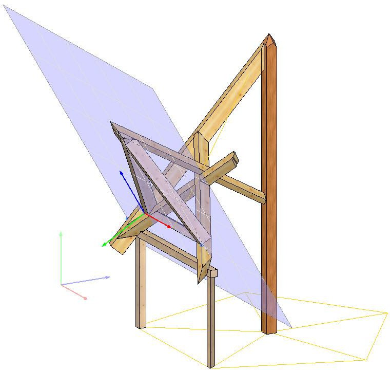{width="8.268332239720035in" height="1.4368044619422573in"}

> {width="4.1955916447944in" height="3.975in"}
>
> **D-CAM Work Planes Introduction to working With work planes**
>
> **2.0/ 21.02.2019**

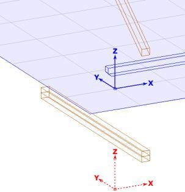{width="1.6511537620297463in" height="0.54in"}

> **Content**

1.  [Introduction 4](#introduction)

2.  [Work Planes - An Introduction 5](#work-planes---an-introduction)

    1.  [Definition and Attributes 5](#definition-and-attributes)

        1.  [What is a work plane? Definition of the first work plane 5](#what-is-a-work-plane-definition-of-the-first-work-plane)

        2.  [Definition of work planes in general 12](#definition-of-work-planes-in-general)

        3.  [Selection of work planes 18](#selection-of-work-planes)

        4.  [Positioning work planes 19](#positioning-work-planes)

        5.  [Properties of work planes 21](#properties-of-work-planes)

    2.  [Input in Work Planes 27](#input-in-work-planes)

        1.  [Input of components in work planes 27](#input-of-components-in-work-planes)

        2.  [Input of plan elements in work planes 29](#input-of-plan-elements-in-work-planes)

3.  [Work planes - Example on a carpenter\'s saw horse. (trestle) 31](#work-planes---example-on-a-carpenters-saw-horse.-trestle)

4.  [Work planes - example of an application on a carport 45](#work-planes---example-of-an-application-on-a-carport)

5.  [Work planes - Example of an application on a pavilion 61](#work-planes---example-of-an-application-on-a-pavilion)

> Notes
>
> **Dietrich\'s Academy**
>
> The training documents for the work planes are used exclusively for training purposes and are made available to you by Dietrich\'s Academy as part of update training courses. All contents of these training documents, in particular texts, photographs and graphics are protected by copyright. Unless explicitly stated otherwise, the copyright lies with the author Dietrich\'s Datenverarbeitungsgesellschaft für Handel und Produktion AG.
>
> The training documentation may not be distributed or made publicly accessible without our consent (§§ 16, 17 UrhG). The copyright also applies if you edit or modify the training material. Reproduction of this training document that goes beyond personal use is also prohibited (Section 53 UrhG). Please ask us if you wish to distribute or make publicly available, edit, redesign, or reproduce the contents of this training document.
>
> Anyone who violates copyright law (e.g. by copying or using images or texts without permission) is liable to prosecution according to §§ 106 ff UrhG (Copyright Act), is also subject to a fine and must pay damages (§ 97UrhG).
>
> **Author**
>
> Dietrich\'s Datenverarbeitungsgesellschaft für Handel und Produktion AG Hauptstraße 37
>
> 85579 Neubiberg [[schulungen@dietrichs.com]{.underline}](mailto:schulungen@dietrichs.com)

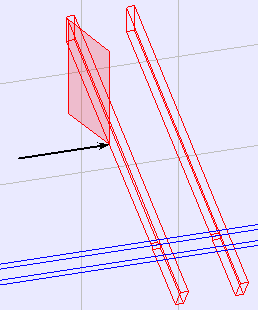

> **D-CAM Work Planes**

# Introduction

> This training document includes a project that can be downloaded with the following link: [[http://u.dhp.de/sp-ae]{.underline}](http://u.dhp.de/sp-ae)
>
> The training document consists of four parts.
>
> **The first part** explains the attributes and functions of work planes. This results in advantageous working methods, which are shown in individual, non-contiguous examples.

+------------------------------------------------------------------------------------------+-------------------------------------------------------------------------------------------------------+-------------------------------------------------------------------------------------------------------+
| > {width="1.511132983377078in" height="1.57in"} | > 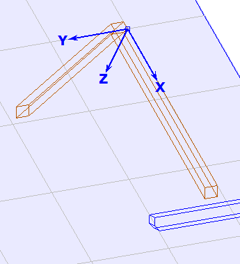{width="1.317295494313211in" height="1.5822911198600176in"} | > {width="1.437062554680665in" height="1.5791655730533682in"} |
+==========================================================================================+=======================================================================================================+=======================================================================================================+
+------------------------------------------------------------------------------------------+-------------------------------------------------------------------------------------------------------+-------------------------------------------------------------------------------------------------------+

> **In parts two to four** a carpenter\'s sawhorse, a carport and a pavilion are constructed on this basis. The different working methods of the input of components and drawing elements in the work plane and in space are particularly considered.

+---------------------------------------------------------------------------------------------------------+--------------------------------------------------------------------------------------------------------+----------------------------------------------------------------------------------------------------------+
| > 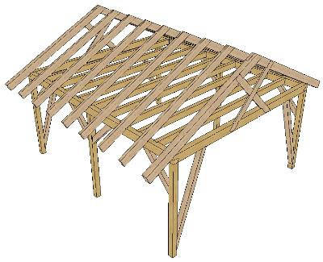{width="1.3578160542432196in" height="1.1153116797900262in"} | > 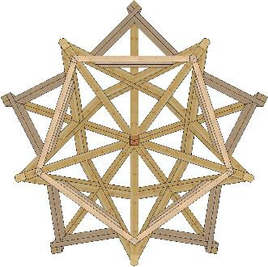{width="1.7924475065616798in" height="1.455728346456693in"} | > {width="1.4813396762904636in" height="1.4781244531933508in"} |
+=========================================================================================================+========================================================================================================+==========================================================================================================+
+---------------------------------------------------------------------------------------------------------+--------------------------------------------------------------------------------------------------------+----------------------------------------------------------------------------------------------------------+

> Notes

# Work Planes - An Introduction

## Definition and Attributes

## What is a work plane? Definition of the first work plane

-   *In the training project, we create a building position AE0 with the template without default values.*

-   In D-CAM we choose "Display settings work planes Favorite 1"und "Grid settings Favorite 1:"

+---------------------------------------------------------------------------------------------------------+---------------------------------------------------------------------------------------------------------+
| > 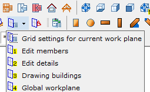{width="3.0520188101487316in" height="1.1145833333333333in"} | > {width="2.4985870516185478in" height="1.5372911198600174in"} |
+=========================================================================================================+=========================================================================================================+
+---------------------------------------------------------------------------------------------------------+---------------------------------------------------------------------------------------------------------+

> The first working plane can be seen at the coordinate origin.
>
> {width="2.1666666666666665in" height="0.5in"}There is an icon for entering a rectangular cross-section as a member or profile member in space:
>
> **Constant cross section** General.
>
> There are four icons for entering parts in the plane.

{width="1.9895450568678914in" height="0.5in"}

> **Constant cross section** as beam along X, beam along Y, beam angle and beam 2 points.
>
> Notes

-   We create two members in the first work plane with the option \" component 2 points\":

{width="6.285134514435695in" height="4.666874453193351in"}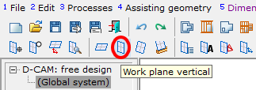{width="5.5736329833770775in" height="2.8193744531933507in"}

> Notes

-   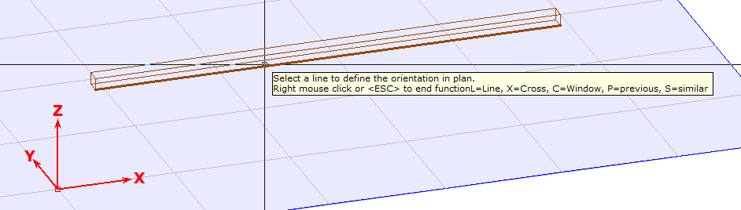{width="3.028081802274716in" height="1.06875in"}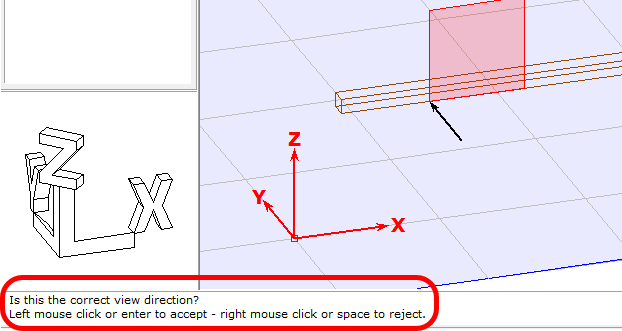{width="6.281033464566929in" height="1.7866655730533683in"}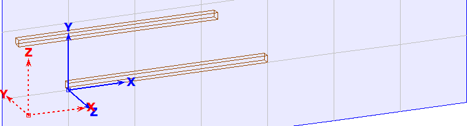{width="5.569518810148732in" height="2.965207786526684in"}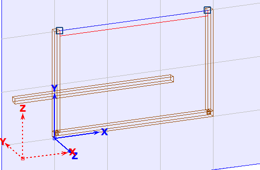{width="4.905243875765529in" height="1.323957786526684in"}We create another working plane, this with vertical alignment, by clicking on a component edge:

> Notes

-   With the previous setting of the component input and cross section rotated 90°, we create a frame:

+--------------------------------------------------------------------------------------------------------+--------------------------------------------------------------------------------------+
| > 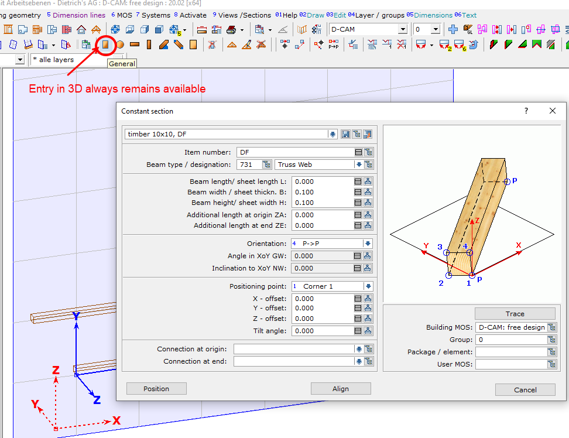{width="2.988195538057743in" height="1.9518744531933507in"} | > This type of component input is similar to that, in wall and ceiling construction. |
+========================================================================================================+======================================================================================+
+--------------------------------------------------------------------------------------------------------+--------------------------------------------------------------------------------------+

> The possibility of 3D input is available at any time - without special changes.

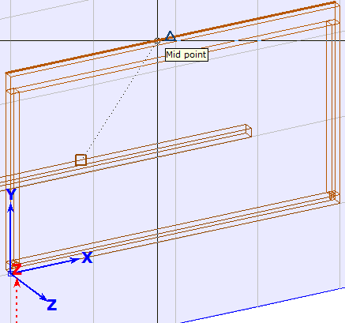{width="6.276084864391951in" height="4.8308333333333335in"}

> Notes

-   We create a diagonal component as a \"general constant cross section\" in space:

+--------------------------------------------------------------------------------------------------------+--------------------------------------------------------------------------------------------------------+
| > 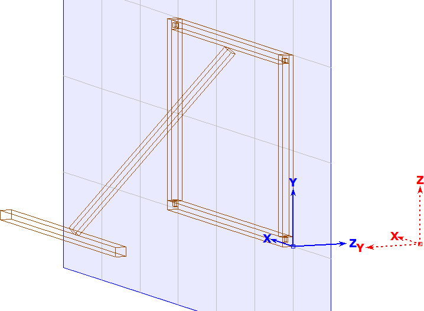{width="3.098419728783902in" height="2.8970833333333332in"} | > 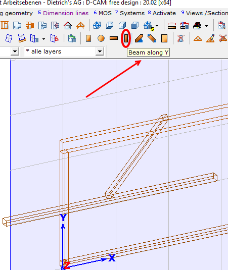{width="2.839122922134733in" height="2.0860411198600173in"} |
+========================================================================================================+========================================================================================================+
+--------------------------------------------------------------------------------------------------------+--------------------------------------------------------------------------------------------------------+

> If a **constant cross-section** is generated as a \"member along X\", \"member along Y\", \"member with angle\" or \"member over 2 points\", then inputs always refer to the current working plane.
>
> All points and lines selected in the space are projected onto the working plane:

+---------------------------------------------------------------------------------------------------------+-------------------------------------------------------------------------------------------+
| > 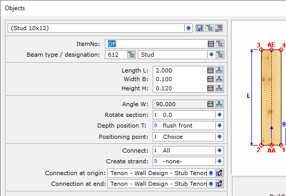{width="2.6773140857392828in" height="3.1765616797900265in"} | > 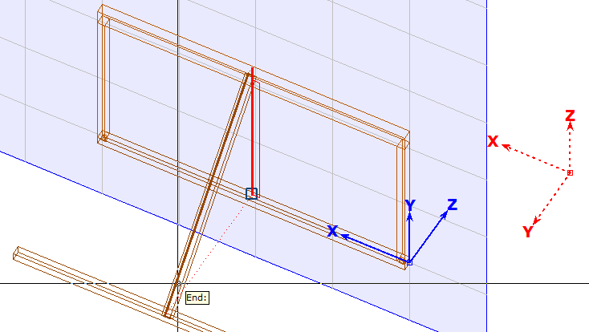{width="3.3343252405949255in" height="2.28in"} |
+=========================================================================================================+===========================================================================================+
+---------------------------------------------------------------------------------------------------------+-------------------------------------------------------------------------------------------+

> Notes
>
> 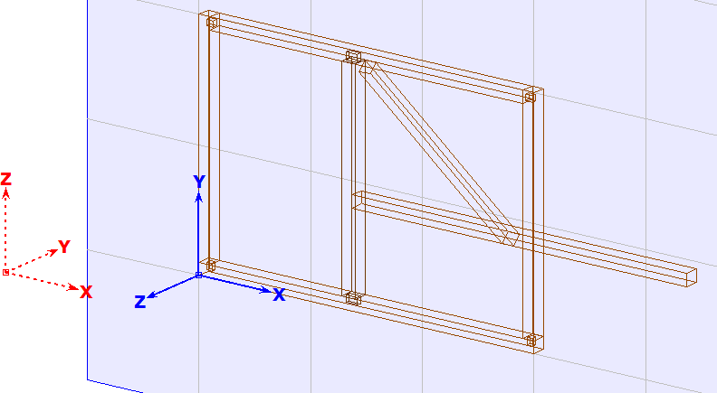{width="5.811582458442695in" height="3.2775in"}

{width="5.280446194225722in" height="2.9in"}

> The input of a \"general constant cross-section\" from \"point to point\" or with the \"Align\" option does not take working planes into account. The current coordinate system has no meaning in this case. However, if, for example, an axis-parallel alignment (parallel X, parallel Y, and parallel
>
> Z\) is selected for the \"general constant cross-section\", the input is oriented to the coordinate system of the current working plane.
>
> Notes

-   We create a \"general constant cross section\" with the alignment parallel Z at the origin of the vertical working plane.

{width="6.271003937007874in" height="2.84875in"}

> Measurements always refer to the coordinate system of the current working plane:

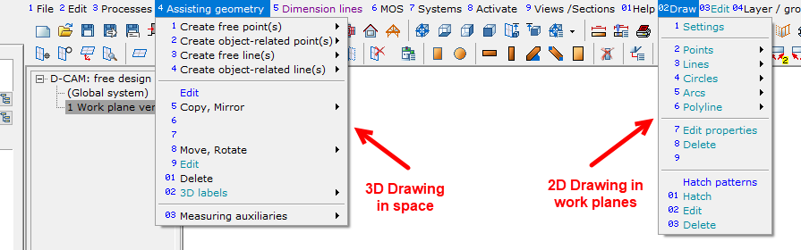{width="6.1833552055993in" height="3.6266666666666665in"}

> Notes
>
> Drawing in the space and in the work, plane is also possible at any time in 2D and 3D:

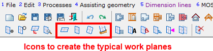{width="6.339196194225722in" height="1.983332239720035in"}

> To enter the 2D drawing elements in the work planes, they are automatically rotated into their view.

-   Working planes allow input in the comfortable 2D mode.

-   The use of all 3D functions remains unrestricted.

## Definition of work planes in general

> In the training project D-CAM work planes, we open the building position AE1

-   For the display settings, we select \"Favorite 1: Beams from roof, wall, ceiling and trusses\".

## Typical cases of work planes

> There are four functions for defining work planes. These should lead as quickly as possible to the work planes normally required.
>
> 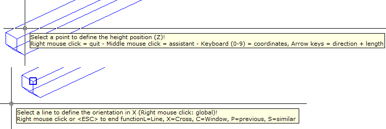{width="4.367042869641295in" height="1.0625in"}
>
> Notes

## The horizontal work plane

-   We select the icon for the work plane horizontally and a top corner of the plate.

> With 2x right mouse clicks we get a new work plane. Their X-alignment is automatically global X, the position of the origin is automatically only vertically offset.

+-------------------------------------------------------------------------------------------------------+--------------------------------------------------------------------------------------------------------+
| > 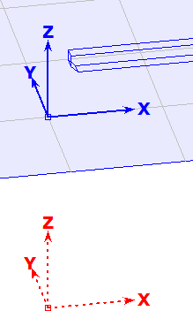{width="4.94454615048119in" height="1.6597911198600175in"} | > {width="1.0055588363954506in" height="1.613332239720035in"} |
+=======================================================================================================+========================================================================================================+
+-------------------------------------------------------------------------------------------------------+--------------------------------------------------------------------------------------------------------+

> A horizontal work plane rotated in the ground is achieved with three clicks:

-   Choose an upper corner point of the angled beam for the height,

-   choose a longitudinal edge of this beam for the X-alignment,

-   then re-select the corner point for the original position.

{width="5.671874453193351in" height="1.8631244531933508in"}

> Notes
>
> New work planes can be defined at any time while working in work planes.
>
> The building navigation allows a comfortable switching between the work planes.

{width="6.2649431321084865in" height="2.0611450131233595in"}

## The vertical work plane

-   To create the vertical working plane, we select the appropriate icon and the top corner of the plate. Confirm the following question about the viewing direction with a right mouse click.

> {width="5.30248687664042in" height="2.2771872265966753in"}
>
> The program automatically creates a work plane that is vertical, whose X axis is horizontal, and whose selected line is completely in the positive range, with the start of the line at the origin.
>
> In principle, this applies to all vertical working planes regardless of the orientation of the selected line in space.
>
> Notes

-   We select a rafter lower edge for the next work plane:

+--------------------------------------------------------------------------------------------------------+---------------------------------------------------------------------------------------------------------+
| > {width="1.8006266404199476in" height="2.1635411198600174in"} | > {width="4.115678040244969in" height="2.6709372265966755in"} |
+========================================================================================================+=========================================================================================================+
+--------------------------------------------------------------------------------------------------------+---------------------------------------------------------------------------------------------------------+

## The arbitrary work plane

> The arbitrary work plane is the most flexible form of the work planes. It is possible to create this work plane by selecting a component surface or by points and lines.

## Arbitrary work plane: surface selection

-   With four surfaces of a rafter, we will create a work plane for each surface.

-   All four arbitrary work planes are now automatically generated in such a way, that

    -   the direction of view on the component shows (i.e. the component is behind the surface),

    -   X is horizontal,

    -   the selected component surface lies completely in the first quadrant:

> Notes

+--------------------------------------------------------------------------------------------------------+--------------------------------------------------------------------------------------------+
| > {width="2.202876202974628in" height="1.7990616797900263in"} | > 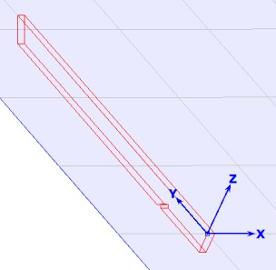{width="1.1604910323709536in" height="1.59in"} |
+========================================================================================================+============================================================================================+
| > 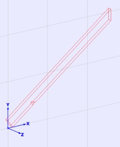{width="1.515738188976378in" height="1.485in"}             | > {width="1.2266447944007in" height="1.5in"}     |
+--------------------------------------------------------------------------------------------------------+--------------------------------------------------------------------------------------------+

## Arbitrary work plane: selection of points and lines

> When creating work planes using points and lines, the first two points always define the X direction, the third point then always points in the Y direction. Therefore, X can also lie diagonally in the space.

-   We create a work plane on the top of a frame:

+-------------------------------------------------------------------------------------------+---------------------------------------------------------------------------------------------------------+--------------------------------------------------------------------------------------------------------+
| > 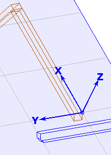{width="1.517230971128609in" height="2.025in"} | > 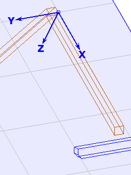{width="1.6321369203849518in" height="2.2874989063867015in"} | > {width="1.7818580489938758in" height="2.385624453193351in"} |
+===========================================================================================+=========================================================================================================+========================================================================================================+
+-------------------------------------------------------------------------------------------+---------------------------------------------------------------------------------------------------------+--------------------------------------------------------------------------------------------------------+

> Notes
>
> If the component edge in the image is selected at the lower end, then the work plane lies on the frame. If the component edge is selected at the upper end, the component is then on the work plane. The end of the line closer to the click point is interpreted as the first point.

## The work plane on the component axis

> This option is useful if further input is to be orientated on a component.

-   The work plane is then created selectively parallel to the component height or to the component width,

-   it runs through the component axis,

-   it has its origin at the beginning of the component, and the component then always lies in the first quadrant.

> We create a work planes with the component axis of the rafter. These two possibilities arise:
>
> The functions for defining work plane should lead as quickly as possible and easily to the work plane regularly required.
>
> Notes

## Selection of work planes

> {width="5.034568022747156in" height="2.5083333333333333in"}In the building navigation, you can change attributes, the number and the name of work planes with \"Mouse right\":
>
> With pressed left mouse button, they can be moved as desired in the building navigation and can be deleted with right mouse button or the delete button.
>
> {width="6.278766404199475in" height="3.1896872265966754in"}In the menu under \>\" View / Section\" \>\" Work planes\" all functions concerning the work planes are also accessible:
>
> Notes

## Positioning work planes

> Work planes can be moved, rotated and moved parallel. The viewing direction of a work plane can also be changed. With \"Mouse Right", a work plane can be selected at its origin or at the outer boundary line.
>
> Important:

-   **Components** are and always independent of the work plane. If work planes are changed or deleted, the components are always retained.

-   **2D plan elements** retain their special position only when moving and rotating working planes.

-   **2D plan elements** move along when work planes are offset in parallel.

-   We select the first vertical work plane from 1.1.2.3 and the option \"Change origin\".

-   With 3 we open the coordinate input and define a displacement of the origin in the XoY plane, i.e. within the work plane.

-   When prompted for the X direction, we open the coordinate input with 2 and set the angle to the X-axis to 30°. The length must be \> 0,000 -- otherwise it does not work!

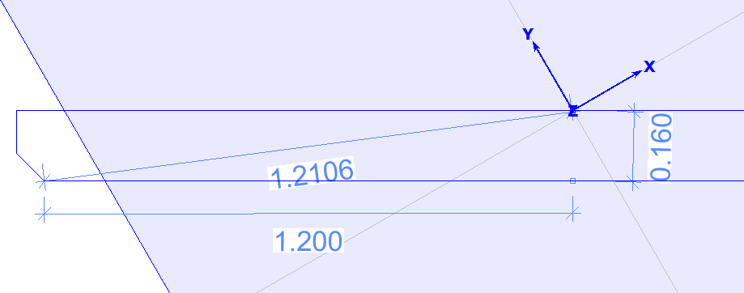{width="6.25168416447944in" height="2.8879166666666665in"}

> Notes

-   If we want to move without rotation, we quit the *second* step with mouse right.

-   If we want to rotate only, we select the origin with mouse left and enter in the *second* step any length \> zero.

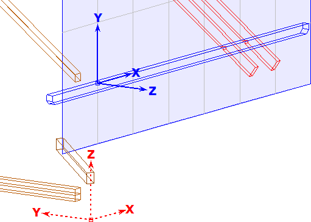{width="4.020534776902887in" height="1.5837489063867016in"}

-   We select the option \"Change view direction\". The work plane is immediately rotated 180° about its Y axis.

+--------------------------------------------------------------------------------------------------------+------------------------------------------------------------------------------------------+
| > 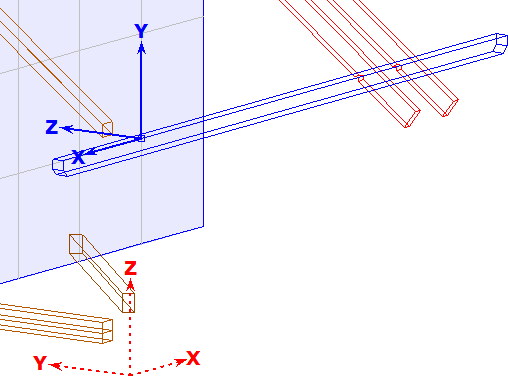{width="2.661246719160105in" height="1.8958333333333333in"} | > 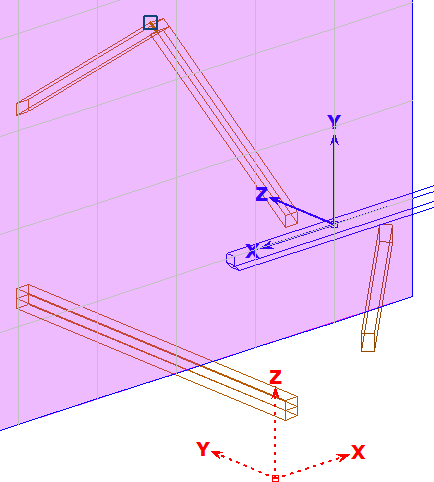{width="2.539926727909011in" height="1.88in"} |
+========================================================================================================+==========================================================================================+
+--------------------------------------------------------------------------------------------------------+------------------------------------------------------------------------------------------+

-   We select the option "offset parallel \".

> This function only causes a parallel Z shift. If the selected new point is not on the Z-axis of the work plane, it is projected onto the Z-axis and the origin of the work planes is moved there.
>
> Components created in this plane keep their position; all 2D plan elements of this working plane are offset.
>
> Notes

+---------------------------------------------------------------------------------------------------------+--------------------------------------------------------------------------------------------------------+
| > 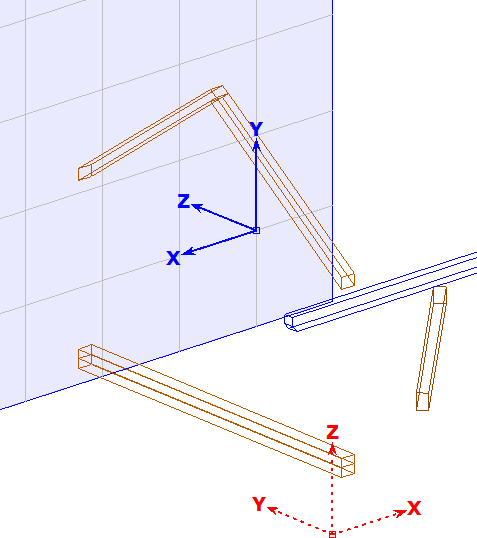{width="2.3941502624671918in" height="2.6610411198600175in"} | > {width="2.1862423447069115in" height="2.465832239720035in"} |
+=========================================================================================================+========================================================================================================+
+---------------------------------------------------------------------------------------------------------+--------------------------------------------------------------------------------------------------------+

## Properties of work planes

1.  **Work planes are generally unlimited.**

> The work planes are infinitely large. The viewing area of a work plane has a variable size. Input in the working plane is possible at any time outside the viewing area.

-   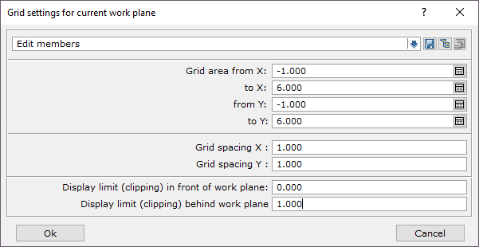{width="4.578581583552056in" height="1.89in"}We create a post in the work plane that was modified and select the plate end as the positioning point.

> The plate endpoint is projected into the working plane outside its visible area to create the post.
>
> Notes

## Grid settings of a work plane

{width="5.009932195975503in" height="2.5833333333333335in"}

> A variable size and a grid that can be set independently in two directions define the visible area of a work plane.

-   We compare different preset settings for the work plane on top edge of plate

> Notes

+--------------------------------------------------------------------------------------------+--------------------------------------------------------------------------------------------+
| > 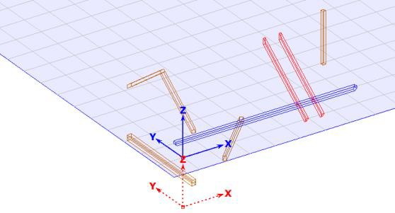{width="2.730479002624672in" height="1.345in"} | > {width="2.788170384951881in" height="1.505in"} |
+============================================================================================+============================================================================================+
+--------------------------------------------------------------------------------------------+--------------------------------------------------------------------------------------------+

> It is useful to save grid settings for various purposes, such as

## Detailed inputs,

-   **Component input,**

-   **Building input,**

> The setting of the work plane that was last selected with Dialog is reused when a new work plane is created.
>
> When creating a new work plane, you can first accept the offered setting and then select the desired favorite.
>
> The grid of a work plane can be switched off and on again at any time during input with the short cut key \"R\".

-   We select a component for input and, while the component outline is visible at the crosshairs, press the shortcut key \"R\" several times.

> 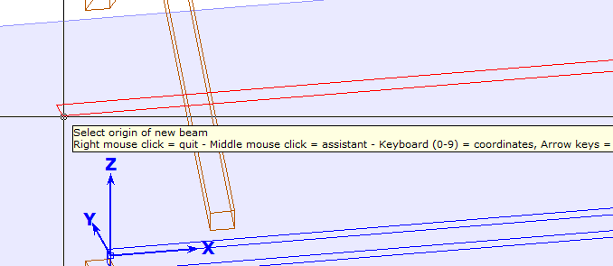{width="5.419119641294838in" height="2.751457786526684in"}
>
> Notes
>
> 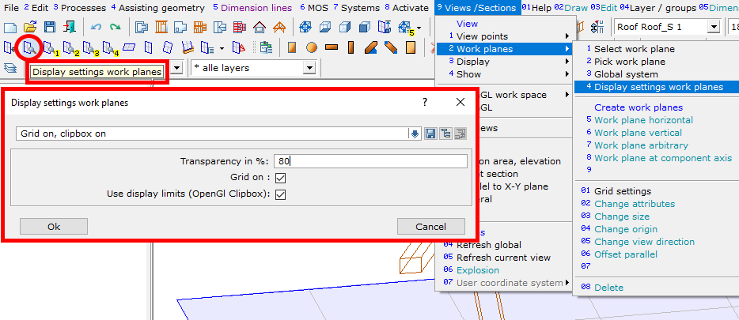{width="6.219791119860018in" height="2.7041666666666666in"}

## Display settings for working planes

> The display settings for work planes allow further setting options, which are used for all work planes:

{width="6.225834426946632in" height="2.7in"}

> Notes

## Resizing a work plane with the Clipbox

> In the training project, we open the building position HR1

-   In display settings, we select Favorite 2: under \"roof\", and then switch off \"Roof slice panel\", \"Other beams/sheathing\".

-   For the display settings work planes, we select favorite 2: \"Grid on\", \" Clipbox off\".

-   We create a vertical working plane on a gable rafter.

-   We switch to the Open GL workspace:

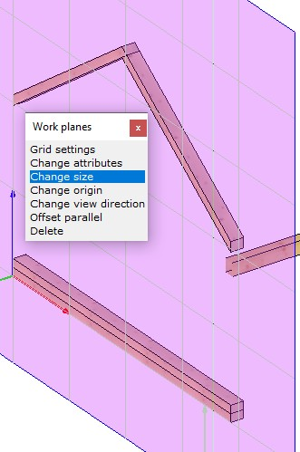{width="3.293647200349956in" height="1.7558333333333334in"}

-   Select Display settings work planes, select the Favorite 1: \"Grid on\", \"Clipbox on\":

+----------------------------------------------------------------------------------------------------------+---------------------------------------------------------------------------------------------------------+
| > 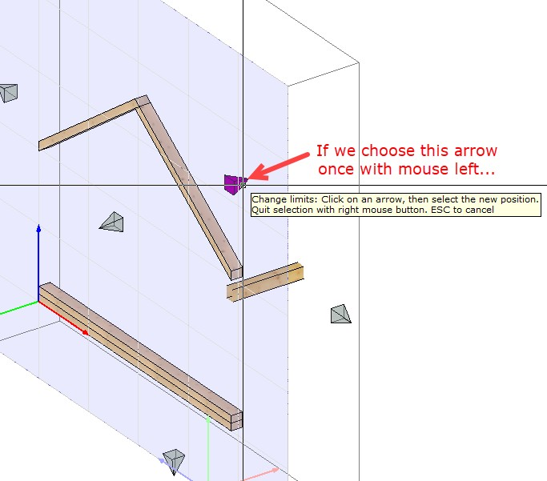{width="2.0339490376202973in" height="3.0667705599300086in"} | > 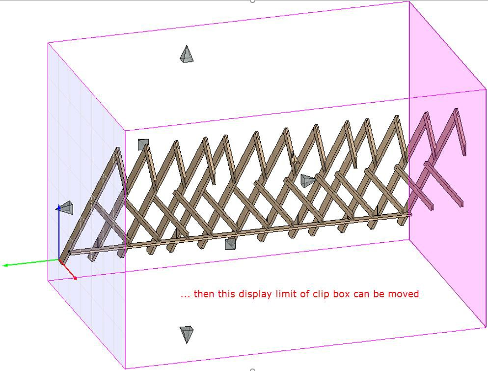{width="3.4906397637795274in" height="3.067603893263342in"} |
+==========================================================================================================+=========================================================================================================+
+----------------------------------------------------------------------------------------------------------+---------------------------------------------------------------------------------------------------------+

> Notes
>
> 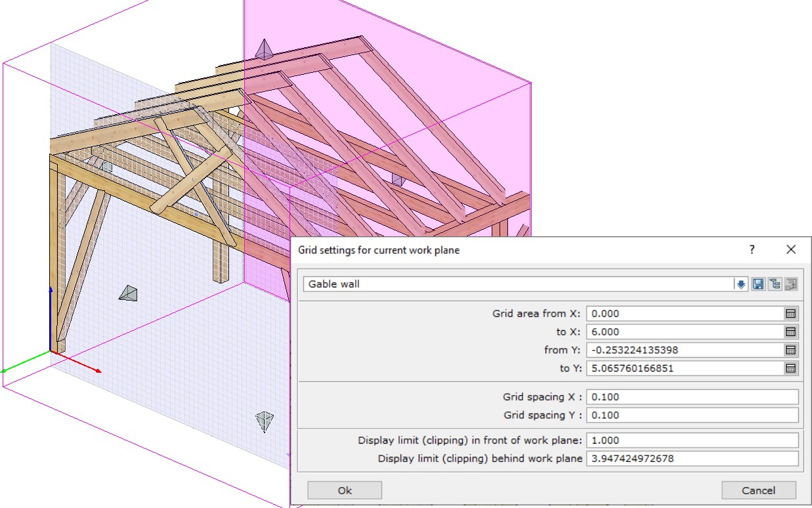{width="4.76409230096238in" height="3.617707786526684in"}
>
> 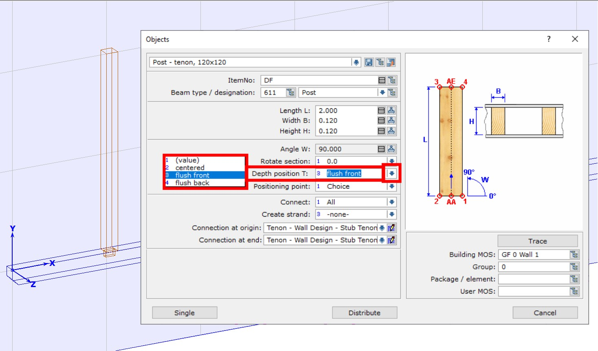{width="5.279812992125985in" height="3.3056244531933507in"}The clipbox describes the spatial display boundaries that belong to a work plane. The borders of this clipbox are saved as well as the grid settings on the respective work plane:

-   Favorites for settings and display allow you to work quickly!

> Notes

## Input in Work Planes

## Input of components in work planes

> In the training project we open the building position AE2

-   We choose the display settings favorite 1: \"Beams from roof, wall, floor deck and truss \"

-   We select the work plane \"Vertical plate\" and switch off the other components.

-   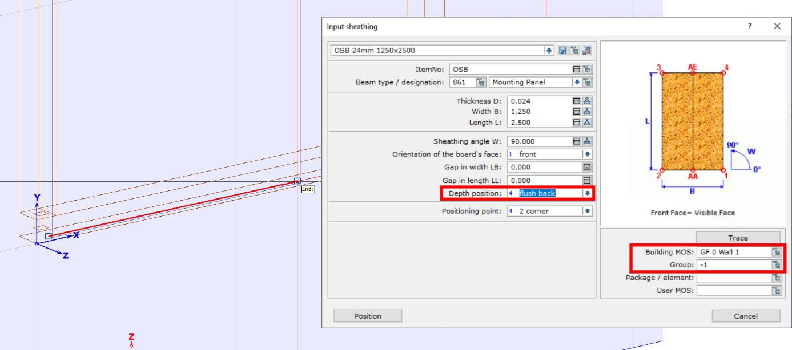{width="6.424199475065617in" height="3.7712489063867016in"}We enter a post .120x.120x2.000 in Y-direction:

> There is no Depth Position: as in walls and ceilings when entering beam and profile beams in work planes. This must be taken into account for the depth positioning.
>
> The assignment to the correct MOS must also be selected, although it is possible to select it from existing components.
>
> The Sheathing input works in principle the same way:

-   We create an OSB board at the front of the plate, flush with the bottom of the post.

> Notes
>
> 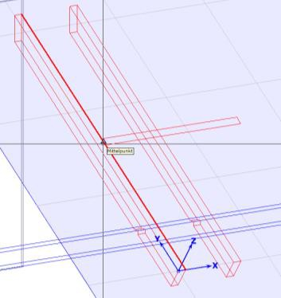{width="6.364708005249343in" height="2.8141666666666665in"}
>
> Boards are not automatically limited by slice contours, as is the case in walls and ceilings. Therefore, they have to be cut manually.

-   We switch on the remaining components.

-   We select the work plane \"Inclined on rafters\".

-   We distribute between the rafters, trimmers (8x20), starting at the eaves point. The upper end of the distribution is the lower perpendicular section point angled on the top of the rafters:

+----------------------------------------------------------------------------------------------------------+--------------------------------------------------------------------------------------------+--------------------------------------------------------------------------------------------+
| > 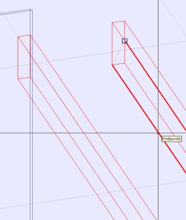{width="1.7650853018372703in" height="1.8699989063867017in"} | > 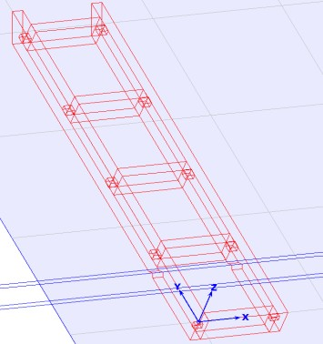{width="1.5906517935258093in" height="1.88in"} | > {width="1.7740387139107612in" height="1.89in"} |
+==========================================================================================================+============================================================================================+============================================================================================+
+----------------------------------------------------------------------------------------------------------+--------------------------------------------------------------------------------------------+--------------------------------------------------------------------------------------------+

-   We select the work plane \"Vertical plate\".

-   We\'ll activate the rafters with the trimmers.

-   With \[Ctrl+C\] we copy the component group to the clipboard.

-   With \[Ctrl+V\] we can insert this component group immediately at the left plate end:

> Notes

+---------------------------------------------------------------------------------------------------------+---------------------------------------------------------------------------------------------------------+
| > 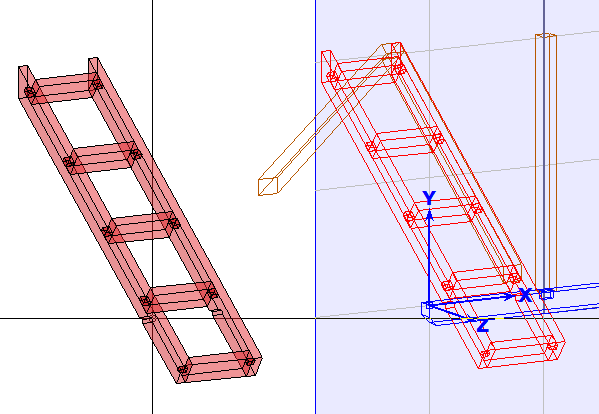{width="2.7198807961504814in" height="2.0999989063867015in"} | > 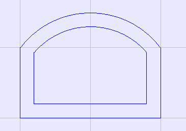{width="2.9950339020122483in" height="2.0699989063867017in"} |
+=========================================================================================================+=========================================================================================================+
+---------------------------------------------------------------------------------------------------------+---------------------------------------------------------------------------------------------------------+

> Before copying, it is essential to switch to the vertical work plane on the outside of the plate: this will catch the corner of the bird's mouth when reading the element, which is important for positioning at the front edge of the plate. If you remain in the inclined working plane, then this is not possible!

-   When copying parts to the clipboard, their alignment to the current work plane is of crucial importance! A point that is to be used as an insertion point during positioning must lie directly in the work plane during copying.

## Input of plan elements in work planes

-   {width="1.7840266841644794in" height="1.2610411198600175in"}We draw an arched window into the current work plane, offset the lines inwards by 0.200 and connect the inner lines with the Corner function.

> functions
>
> When the 2D drawing elements are called up, the work plane automatically rotates into its view. The functionality of the 2D plan elements is the same as in the other building modules.
>
> Notes

-   We then extrude the frame using these 2D lines.

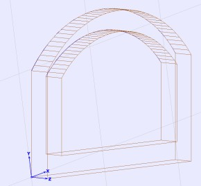{width="2.3518536745406826in" height="2.026457786526684in"}

-   Change Origin of the work plane. (for X,Y direction) The 2D drawing elements remain in their original position.

> 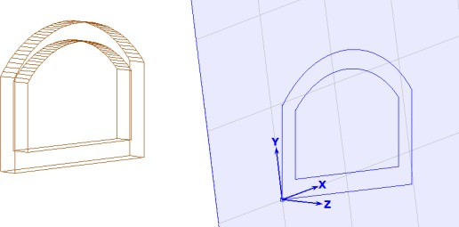{width="1.4800284339457568in" height="1.3679166666666667in"}

-   We move the work plane parallel. (for Z direction) The 2D drawing elements move with it.

> {width="2.5703324584426945in" height="1.275in"}

-   We delete the work plane.

> The 2D drawing elements are also deleted.
>
> Notes

# Work planes - Example on a carpenter\'s saw horse. (trestle)

> The saw horse is used to apply and practice the explanations of work planes from training part 1, Introduction.
>
> When entering components in the working plane, the depth positioning is always flush with the front unless otherwise specified.
>
> The unit for all lengths is meter.

{width="4.346914916885389in" height="3.9812489063867016in"}

> We create a new building position called CSH.
>
> A saw horse is planned with a squared timber as support with a cross section of 0.120 x 0.120, with a height of 0.770. The legs of the saw horse have a cross-section of 0.080 x 0.080, the other struts a cross-section of 0.060 x 0.060.
>
> Notes

-   We start with the horizontal, global work plane, and we adjust its size and grid according to the space requirements of the saw horse in the plan view;

> 1.00 direction X and 0.500 direction Y, in a grid of 0.100:

{width="5.2446216097987755in" height="2.7318744531933508in"}

> {width="5.132858705161855in" height="3.4066666666666667in"}The first timber to be positioned is our support 0.120 x 0.120. When choosing a constant cross section General - with 2-1-1 - a click point in our work plane is sufficient to position the square timber correctly immediately.
>
> Notes

-   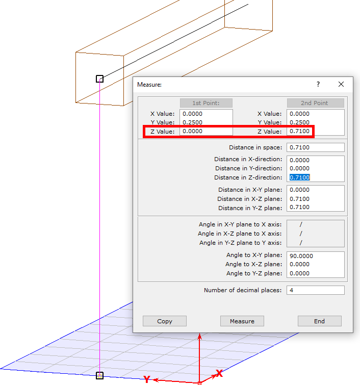{width="6.3282578740157485in" height="3.70125in"}The settings for it and the result are shown in the next two images:

> 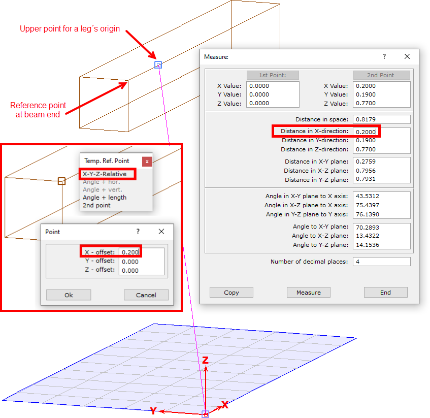{width="3.823225065616798in" height="4.089583333333334in"}
>
> Notes
>
> The next step is the positioning of the legs. The upper point of a leg\'s origin should be 0.200 from the end of the support timber, from here the edge of the leg runs to the next corner of the work plane.

-   {width="6.264645669291339in" height="6.086770559930009in"}For this we set (with 4-1-1 and B for reference point) a 3D auxiliary geometry point at the top of the support timber:

> Notes
>
> Relative to our work plane, the legs are each inclined in two directions. On the narrow side, the legs are connected by an Andrew\'s cross and must be flush, i.e. they lie in the same plane like tilted jacks with a side surface.
>
> This defines our first arbitrary work plane \"legs narrow side\".

-   We create the arbitrary work plane, as shown in the picture. The order of the points is important so that the coordinate system of the plane fits!

{width="6.29174321959755in" height="5.364583333333333in"}

> Notes

-   Then we create the first leg of the saw horse (trestle) with a cross-section of 0.080 x 0.080 as component input in the working plane with 2-1-4 as constant cross-section, beam along X. It makes sense to set the Positioning Point to Choice.

-   The next picture shows the result:

{width="6.279387576552931in" height="5.8625in"}

> Notes

-   To connect the leg to the support timber, we first switch to the global work plane and generate two horizontal cuts with 3-4-3; bottom to global zero, top with an offset of 0.020 from OK support timber.

-   {width="4.998330052493438in" height="2.2993744531933507in"}In addition, with 3-4-7 on the leg we create a vertical cut parallel axis support timber, to avoid a collision with the opposite leg with 0.003 offset:

> The leg is now to be connected to the saw horse (trestle) with an angled end lap notched 0.020 parallel into the side surface of the support timber.

-   With 9-2-5 we create a vertical work plane, named \"angled end lap\", as shown in the picture:

> 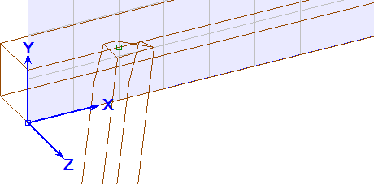{width="4.239457567804025in" height="3.0934372265966754in"}
>
> Notes
>
> 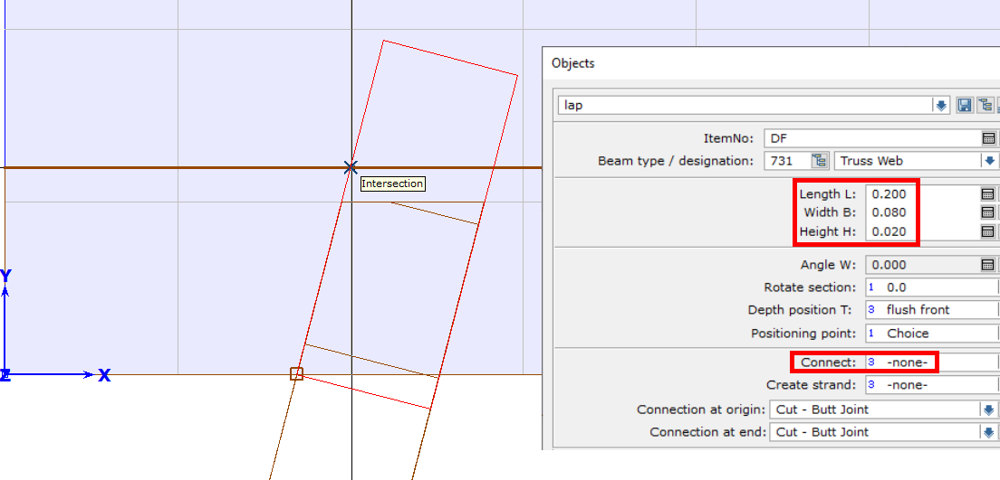{width="2.971969597550306in" height="1.4660411198600174in"}

-   With the function 2-1-7 beam 2 points we position a board with 0,020 thickness and 0,080 width at the connection from the upper leg end to the support timber.

> Choosing points: From the 3D auxiliary geometry point to the intersection point of the outside leg to the lower edge of the support timber.
>
> 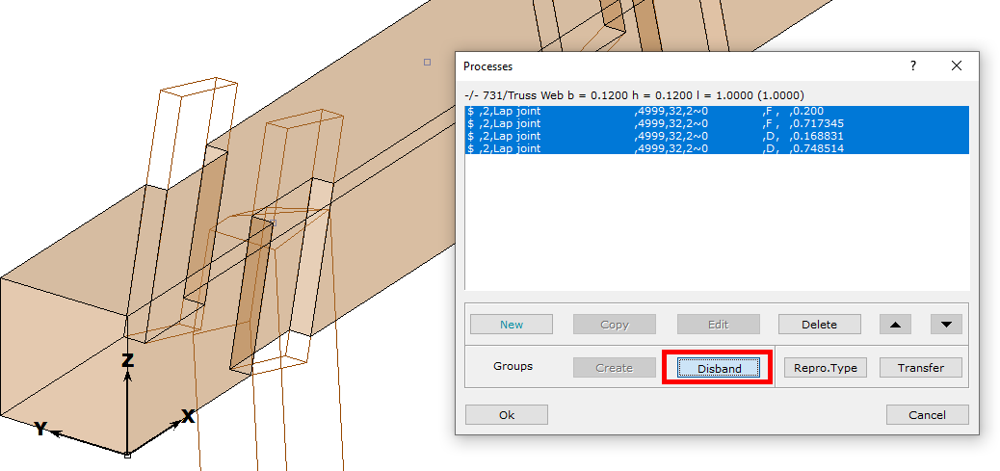{width="6.321637139107612in" height="3.0421872265966754in"}

-   We switch to the Global System and create a 3D point in the middle of the top support timber.

-   Then we mirror the auxiliary part for creating the notch with 2-7-5 on the axis of the support timber, then we copy both auxiliary parts with 2-7-3 around the new auxiliary geometry point and a parallel to Global Z by 180°.

-   With 3-8-1 we produce the connection in the support timber with lap joint. The fixed depth of the lap (in the input dialog of the processing the beam is 1) is 0,000.

> Notes

-   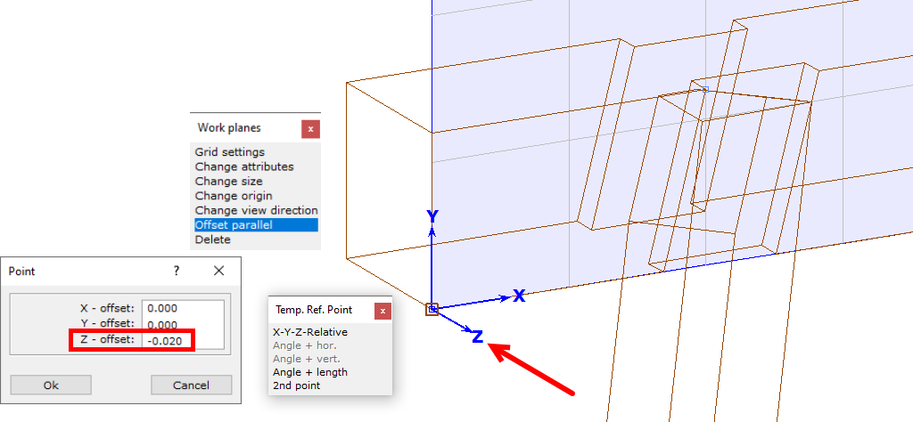{width="6.053206474190726in" height="2.8525in"}Then the lap in the support timber is disband and the help timbers are deleted.

-   We switch to the work plane \"Lap joint\" and move it 0.020 parallel to the rear (or in Z direction - 0.020).

> 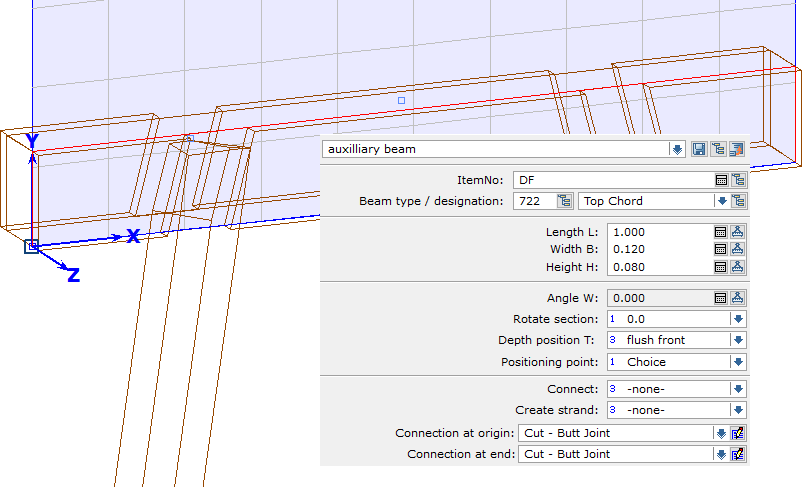{width="6.187064741907261in" height="2.86375in"}

-   Then we position a help timber for the creation of the birds mouth at the upper end of the legs, with beam along x (2-1-4) as shown in the next picture:

> Notes
>
> {width="5.681010498687664in" height="3.4495833333333334in"}

-   We switch to the global work plane, create a birds mouth in the leg with 3-7-1 and the auxiliary component, then disband the birds mouth in the leg and delete the help timber.

-   {width="3.2044630358705164in" height="3.1308333333333334in"}Then we mirror and copy the leg as it is already described with the help timber for the lap joint.

> The saw horse (trestle) should be in this stage of completion.
>
> Notes

-   For the input of an Andreas brace for bracing at the beginning of the saw horse we change to the work plane \"legs narrow side\".

-   We hide the support timber and the other pair of legs (8-05).

-   With 9-2-04 we change the origin and orientation of the work plane by first selecting the outer corners of the left leg and then the right leg at the bottom \...

> {width="5.721257655293089in" height="2.512811679790026in"}

-   \... and then exchange the values for X and Y in the grid settings with 9 -2-01. 03?

-   With 02-3-1 we then call the 2D drawing function for line input.

> The work plane automatically rotates into its view.

-   With a line we determine the position of a top edge for the position of the Andreas brace, then offset it down with 03-5 by 0.060, and mirror the lines at the center perpendicular with 03-4 to check the position of the Andreas brace and correct if necessary.

+--------------------------------+----------------------------------------------------------------------------------------------------------+
| > The result can be like that: | > {width="2.6626476377952755in" height="2.2422911198600173in"} |
+================================+==========================================================================================================+
+--------------------------------+----------------------------------------------------------------------------------------------------------+

> Notes

-   With the function 2-1-7 beam 2 points we now create the Andreas brace:

{width="6.11029636920385in" height="2.884687226596675in"}

-   Then we connect it with 3-9-5 notched lap with the legs

> 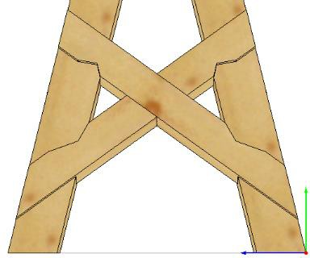{width="5.993196631671041in" height="2.538228346456693in"}

-   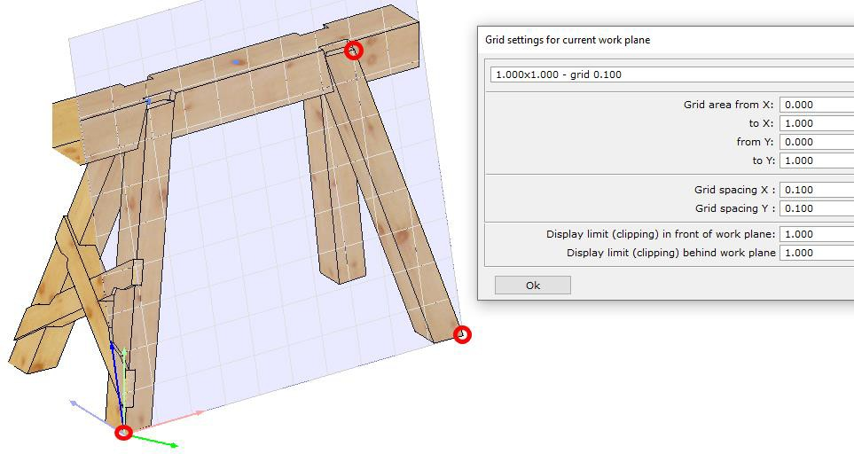{width="1.9652143482064741in" height="1.6333333333333333in"}Then we create in the middle of the cross a lap joint with 3-8-1 (Depth in beam 1: Bisect)

> Notes

-   We create another arbitrary working plane \"longitudinal bracing\" by selecting the outer corner points of two legs in the longitudinal direction and the upper corner point of the same edge on the right leg; the work plane gets a grid area of 1,000 x 1,000:

> {width="4.7150382764654415in" height="2.506666666666667in"}

-   In the work plane we then draw a line for the top of the longitudinal brace to avoid overlapping with the Andreas brace, and temporarily enter the brace with a thickness of only 0.020:

> {width="5.261192038495188in" height="3.0696872265966753in"}
>
> The input is made here over the entire width of the raster area. Since the brace and the outer sides of the legs on this side are not flush, normal lap jointing is not possible.
>
> Notes

-   With the created board we now create a lap joint with full board thickness of 0.020 and disband this connection lap joint in both legs, creating a free lap joint.

> We delete the board and then create the actual longitudinal strut in the same length using the settings as for the Andreas cross (W x H = 0.060 x 0.060).

-   We cut the longitudinal brace at the ends flush with the surface of the legs.

> Now we create a V-cut. A birds mouth is not possible here because the angle between the legs and the longitudinal brace is 93.45°. Therefore, we customize the longitudinal brace with 3-6-1 by a V-cut and the option \< four points \>, with selection of the longitudinal brace for the V-cut and point selection on the leg in the order shown:
>
> 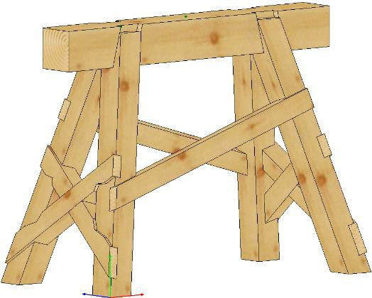{width="4.715349956255468in" height="2.6735411198600176in"}

-   For the installation of the Andreas brace and the longitudinal brace on the opposite sides we now proceed as described above.

> Our saw horse (trestle) will look like this when finished:

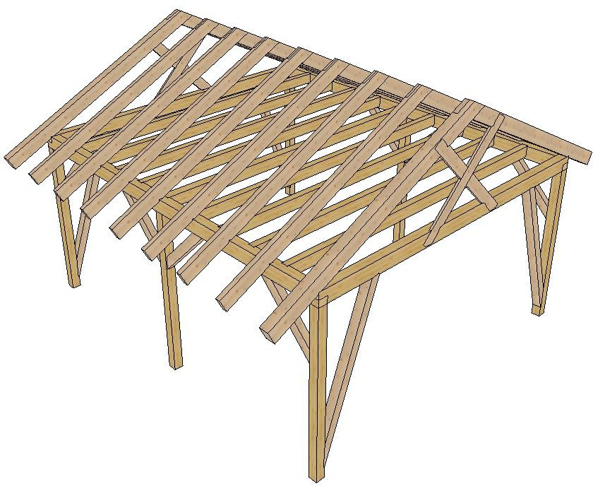{width="2.2935454943132108in" height="1.8375in"}

> Notes

# Work planes - example of an application on a carport

> The carport is used to apply and practice the explanations of work planes from Training Part 1, Introduction.
>
> When entering components in the work plane, the depth positioning is always flush with the front unless otherwise specified.
>
> The unit for all length specifications is meter.

{width="6.124814085739283in" height="5.016666666666667in"}

> Notes
>
> We create a building C01

-   We start with a horizontal work plane \"base area\" with origin and orientation as with the global system, and adjust its size and grid according to the space requirements of the carport in the ground;

> 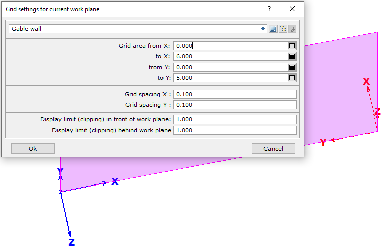{width="6.22413823272091in" height="2.383124453193351in"}7,000 direction X and 6,000 direction Y, in a grid of 0,100

-   Then we create a vertical working plane \"gable wall\" parallel global Y, whose zero point is on the back corner of the first working plane, with 6,000 in direction X and 5,000 in direction Y with the same grid spacing:

> 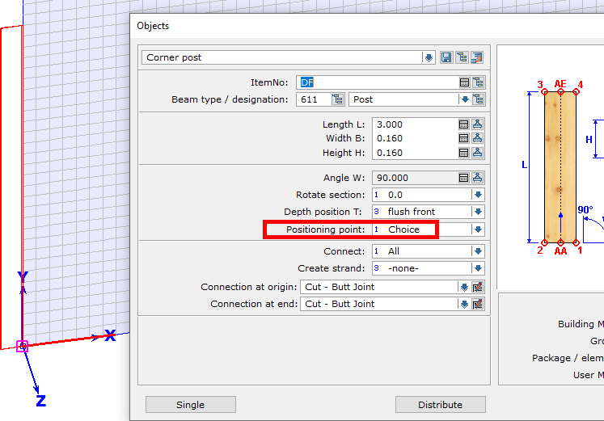{width="5.111443569553805in" height="3.3041666666666667in"}
>
> Notes

-   With the 2D component input \" beam along Y\" (2-1-5) and the following settings we position a glulam corner post 0,160 x 0,160 of this wall at the left edge of the vertical work plane:

> 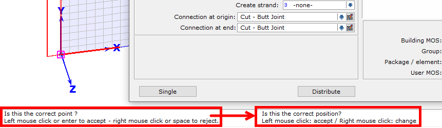{width="6.2281047681539805in" height="4.341666666666667in"}
>
> The \"Select\" setting for the **positioning point** allows us to quickly place the correct corner of the post by toggling with the right mouse button (here, place it in the grid layer with the mouse on the right):
>
> {width="6.013752187226597in" height="1.7447911198600174in"}
>
> Notes

-   Above it we set (with 2-1-4) as \" beam along X\" a glulam beam, 0.160 x 0.240, with a cross section rotated by 90°, because the width of a component (as in roof and ceiling) always indicates its view:

> {width="6.255365266841645in" height="3.00625in"}

-   To reinforce this corner, we create a C24 brace with 0.020 step joint using the option (2-1-7) \"Beam 2 Points\". The shear block at the lower end of the strut is 0.200, the upper opening dimension is 1.000 from the inside of the corner post. First position the lower end with the intersection of the inside of the post and the grid line, then the upper connection with reference point:

> 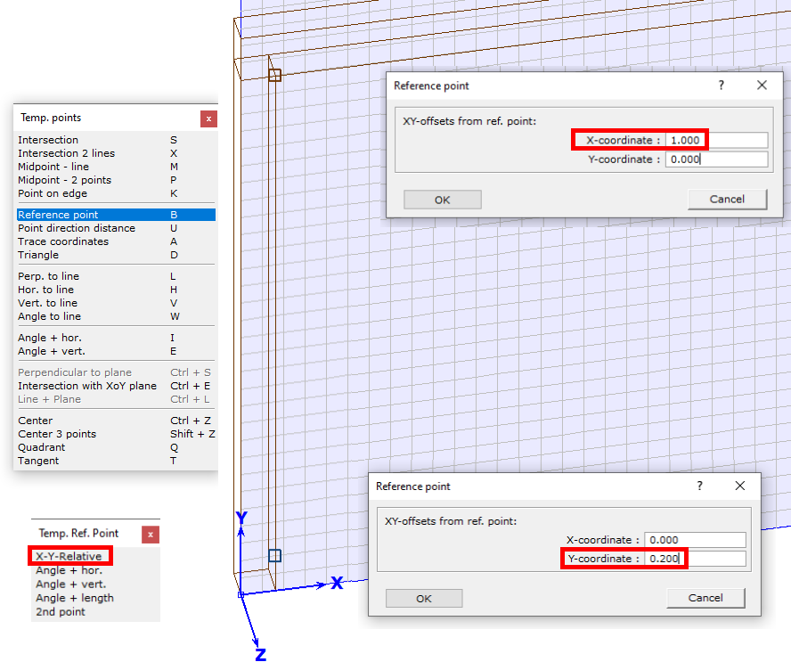{width="3.695566491688539in" height="2.8434372265966754in"}
>
> Notes
>
> 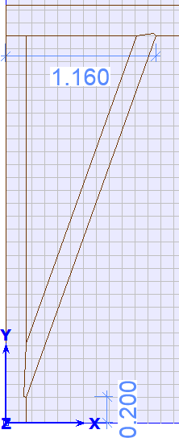{width="5.9173425196850395in" height="4.953333333333333in"}

+-----------------------------------------------------------------------------------------------+----------------------------------------------------------------------------------------------------------+
| > The brace in gable wall starts 0,200 above base and ends 1,160 right from the upper corner: | > 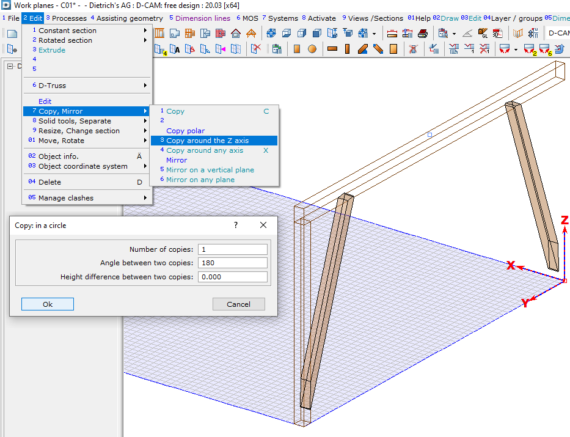{width="1.2023764216972879in" height="2.9466666666666668in"} |
+===============================================================================================+==========================================================================================================+
+-----------------------------------------------------------------------------------------------+----------------------------------------------------------------------------------------------------------+

> Notes
>
> We change to the work plane Base and create (with 4-1-1 and Middle Mouse, center between two points) a 3D auxiliary geometry point centered on top of Beam

-   Then we activate the brace and (2-7-3) copy around the Z axis by 180°, around the 3D point on the middle of the beam:

{width="6.319024496937883in" height="4.841145013123359in"}

-   Parallel to global X, a plate is now to be placed on the rear corner of the building. For this purpose, we create another vertical working plane \"Eaves wall at the back\", with the zero point opposite the global origin and view from the outside onto the carport, a grid area of 7,000 x 3,500 and grid size 0,100 x 0,100.

> Notes

-   Same as the input of the other plate, we now set the glulam plate, 0.160 x 0.240, to the same height as the plate and end lap joint the plates (with 3-8-2) at the corner.

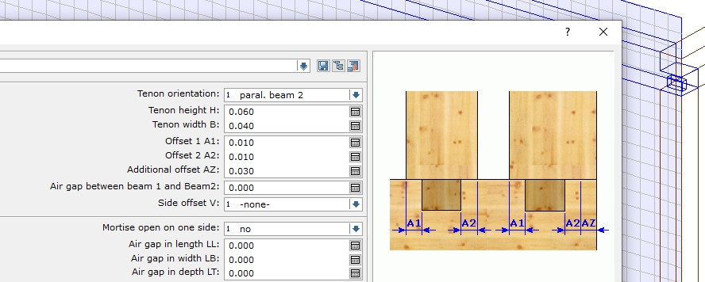{width="6.345980971128609in" height="3.62in"}

-   To create the end lap, we select for notch side in beam 1: (E top) and then connect the corner post (with 3-01-1) to the plate with user defined tenon (H x W = 0.060 x 0.040):

{width="6.290644138232721in" height="2.5216666666666665in"}

> Notes
>
> We change into the work plane gable wall and determine here in 4 steps the position of the rafters of our carport first by drawing.

-   Step 1: we start (with 02-4-1) the 2D drawing function for a \"circle - center and radius\". With this circle with r = 0.215 we select the outer, upper plate corner an area for the right-angled timber of the rafters of our carport.

-   Step 2: we offset (with 03-5) the left edge of the view of our work plane by 0.850 to the outside and therefore define the roof overhang for the rafter layer.

-   Step 3: from the ridge point centered above the frame and at a height of 5,000 we draw a line (starting with 02-3-1) then (call snap point with \"T\") tangent to the circle, and so define the direction for OK rafters.

-   Step 4: by adjusting the second line to the first (with 03-8) we find the eave point of the rafters for our carport.

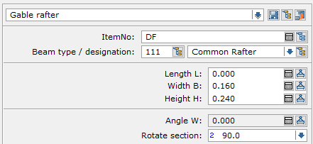{width="3.9239720034995624in" height="2.2186450131233597in"}

> We create the left gable rafter with the 2D line with input \"beam 2 points\" and pay attention to the rotation of the cross-section as with plates and purlins:

+---------------------------------------------------------------------------------------------------------+---------------------------------------------------------------------------------------------------------+
| > 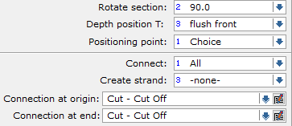{width="3.126965223097113in" height="1.4379166666666667in"} | > 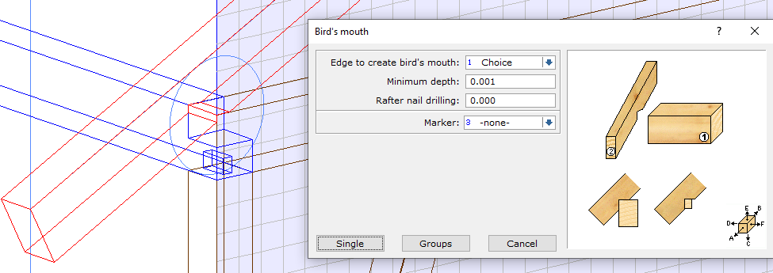{width="2.9833442694663166in" height="1.291978346456693in"} |
+=========================================================================================================+=========================================================================================================+
+---------------------------------------------------------------------------------------------------------+---------------------------------------------------------------------------------------------------------+

> Notes

-   Then create the birds mouth in the rafter (with 3-7-1), the option \"Edge to create birds mouth\" must then be set to \"Choice\", otherwise the plate will not generate the birds mouth:

> {width="6.398157261592301in" height="2.2640616797900264in"}

-   Then we copy the rafter (with 2-7-1) to the beginning of the plate. As the base point, we choose the corner of the birds mouth, which should be placed on the opposite side of the gable:

> {width="5.528146325459318in" height="2.4948950131233594in"}

-   We create an arbitrary work plane \"roof area\" by point selection: left eaves corner, right eaves corner, a ridge point.

> Notes
>
> It is created with the grid settings of the work plane \"Back eaves wall\", which were the last selected settings.

-   Now we enter C24 rafters 0.080 x 0.240 on the plate and use the distribute function in the \"Parallel Y\" input dialog box. We use a gable rafter to measure the length.

-   As the starting point we select a point on the X axis of our working plane, as the limits for the distribution we select one point each on the inside of the gable rafters.

-   We distribute with the setting \"Clear distance\" and \"Beams in remaining length: 7\".

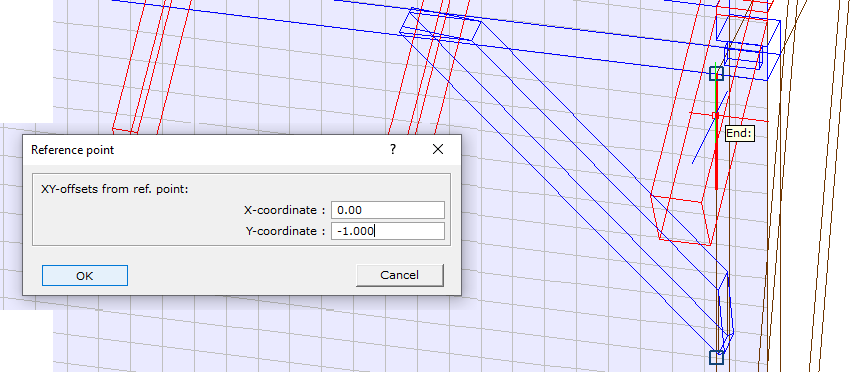{width="6.233778433945757in" height="4.42in"}

-   For all rafters on the plate we now also create Birds mouth with the option \'Group\'. Group 1 is the plate, group 2 is the rafters. The edge selection can be set to automatic.

> Notes

-   We switch to the work plane \"Rear eaves wall\".

-   We then place a post in the middle under the plate. It differs from the corner post by the fact that a Tenon (settings as before) is created at the top end during installation.

-   The reference point (\"B\") for positioning is, for example, the zero point of the work plane, then a distance of 3.500 in the X direction.

-   Because the positioning point is set to \"Choice\", we can also select the center of the post for placement with the right mouse button.

-   Two C24 Braces 0.120 x 0.160 with an opening dimension of 1.000 and 45° inclination now come between the two posts in this work plane. We use the 2D component input (with 2-1-

> 6\) for \"beam-angle\".

-   Please note: a 90° rotation of the cross section is required to install the brace with the wide side vertical.

```{=html}
<!-- -->
```
-   The depth position is 0.020 so that they sit centered under the plates.

-   For the right Brace on the center post, the tilt angle is 45°, Positioning point: corner 1.

-   The left Brace on the corner post is positioned with 135° inclination, Positioning point: corner 2.

-   Connection at both ends are hidden Step joints: with 0.020 depth

```{=html}
<!-- -->
```
-   As reference point for the lower end we choose the corner between post and plate, then 1,000 distance in -Y. With the setting "Connect: All" the brace gets automatically connected with the plate, too.

> 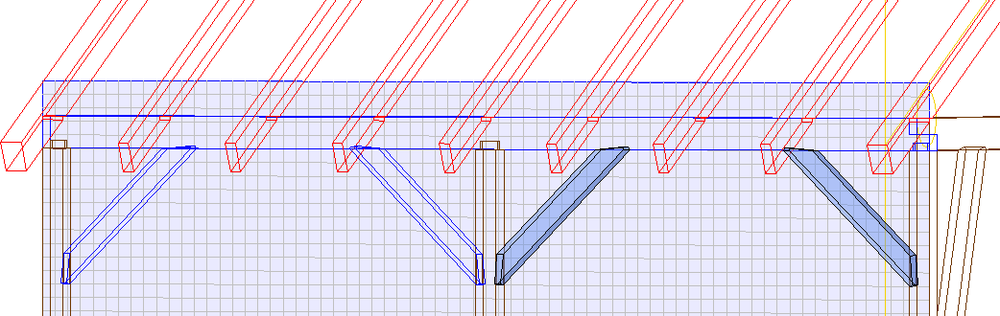{width="5.849449912510936in" height="2.5575in"}
>
> Notes

-   Then we copy (with 2-7-1) the brace to the left. The origin point is the upper left corner point of the corner post, the destination point is the upper left corner point of the middle post.

> 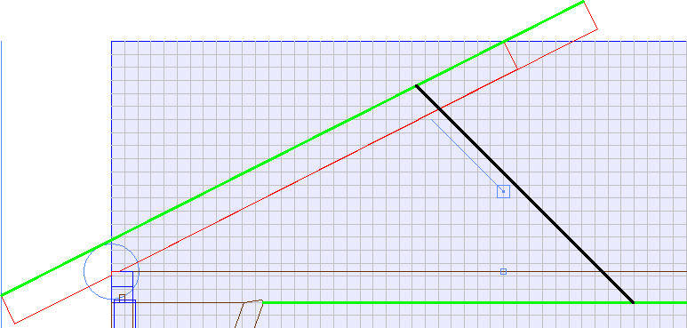{width="6.186391076115486in" height="1.9593744531933508in"}

-   For the installation of a C24 Andreas Brace with a cross section of 0,040 x 0,200 in the gable triangle we change to the work plane \"gable wall\" and create (with 02-2-1 and \"B\" reference point) a point 1,150 below the ridge.

-   From this point, we draw a piece of line at 45° in the direction of the rafters, using the snap functions.

-   Then we offset the line (with 03-5) upwards by 0.100 and adjust it (with 03-8) to the bottom of the plate and top of the rafter, with which an upper side of the Andreas cross is fixed.

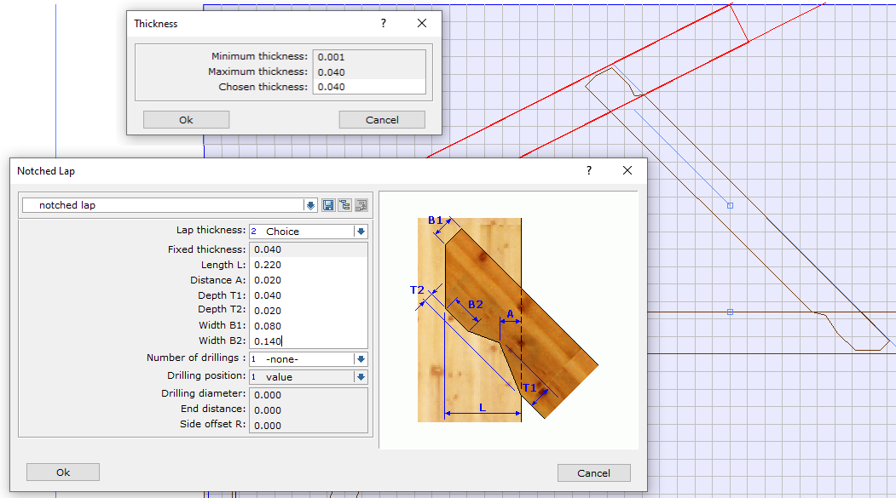{width="6.205194663167104in" height="2.9596872265966754in"}

> Notes
>
> We now create the beam in full line length using \"beam 2 points\" (option for Connect: none!) and connect it on both ends (with 3-9-5) with traditional joinery, notched lap:
>
> {width="6.241093613298338in" height="3.4734372265966753in"}

-   Now we move the working plane (with 9-2-05) back by 0.020. To do this, we select its zero point as reference point and enter a shift of -0.020 in the Z direction. This moves the auxiliary point at the Andreas brace in the direction of the component center.

-   Then we change to the work plane \"Base\" and copy (with 2-7-3) the brace around the Z-axis with the previously moved point as pivot by 180°.

> {width="3.20419728783902in" height="2.4125in"}Finally, we lap joint both beams (with 3-8-1, depth of notched beam 1: bisect).
>
> Notes

-   To create the second half of the carport we switch to the work plane \"Back eaves wall\", activate all parts and copy \[with Ctrl+C\] to the clipboard.

-   Then we change to the work plane "base area" and create another vertical work plane with the name \"Front eaves wall\", whose origin and direction of the X-axis is identical to the global X-direction.

-   We rotate this work plane into the view and select \[Ctrl+V\] to insert the second half of the carport.

> The \"Read element\" window opens. All points and lines visible here are a perpendicular projection into the work plane \"Back eaves wall\", which was current during the copy process. In order to insert all parts in the new work plane \"Front eaves wall\", we should select a point that is easy to find in this work plane.
>
> For example, the outer base point of the right corner post can be used, which can be inserted directly at the outer lower grid point in the work plane \"Front eaves wall\":
>
> 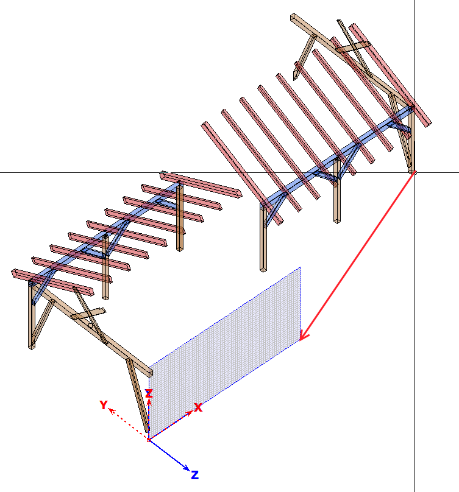{width="5.755208880139983in" height="4.475624453193351in"}
>
> Notes
>
> {width="6.2751826334208225in" height="6.733333333333333in"}

-   After the insertion we check the connections of the components. On each gable side a wall brace and a beam of the Andreas brace at one end ran into the void, although they had been produced with a connection process. We create these connections again (with 3-1-7) form new connection.

-   The rafters are connected by end laps (with 3-8-2).

> Notes

-   We connect the plate end above the global zero point and the diagonally opposite plate end to the frame and post as for the other two corners, with end laps and tenons (3 -8-2 and 3- 01-1, accordingly).

-   To enter joist from purlin to purlin, we raise the working plane \"Base area\" (with 9-2-05) by 3.240, and hide all parts except plates.

-   We place a beam 0.160 x 0.200 parallel to the gable plates in the middle of the field and connect it with dovetail tenons, as shown in the next picture:

> 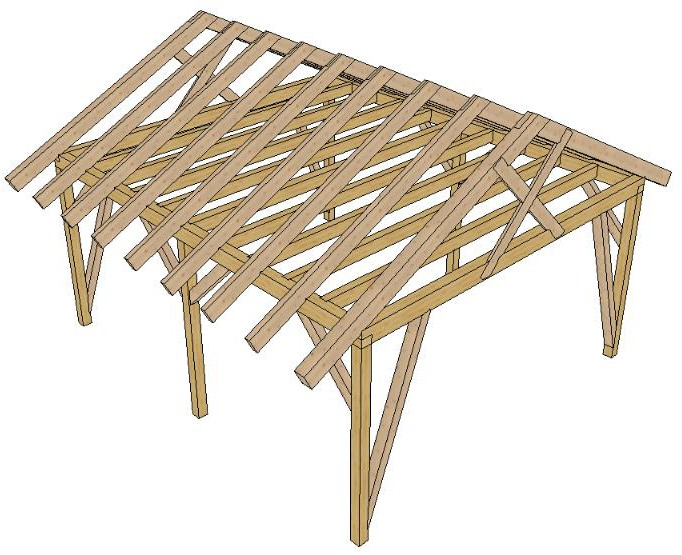{width="6.0721052055993in" height="2.7408333333333332in"}

-   We then distribute 4 joists of 0.120 x 0.200 with the same connections in each of the two lateral fields.

+-----------------------------------------+----------------------------------------------------------------------------------------------------------+
| > Our finished carport looks like this: | > {width="3.2656649168853895in" height="2.659374453193351in"} |
+=========================================+==========================================================================================================+
+-----------------------------------------+----------------------------------------------------------------------------------------------------------+

> Notes

# Work planes - Example of an application on a pavilion

> The pavilion is used to apply and practice the explanations of work planes from Training Part 1, Introduction.
>
> When entering components in the work plane, the depth positioning is always flush with the front unless otherwise specified.
>
> The unit for all length specifications is meter.
>
> We create a new building P01

-   We create a horizontal work plane in parallel X. The zero point of this plane is global zero, the X directions are identical.

-   Name: \"Floor\", 10,000 x 10,000, with a grid of 0,500.

-   First, we draw a pentagon in this plane as a floor plan for our pavilion.

-   We create a 2D line parallel X, start point about 3,000 in direction X, from zero, with a length of 2,5000.

-   We copy this line at both ends by 54° in the arc and create a triangle, were the lines cross each other use the \"Corner\" function to connect them.

-   We copy the base line and the left triangle line around the tip of the triangle 4x with 72° in the arc and get the pentagon with connecting lines from the corners to the center point.

> {width="5.265413385826772in" height="2.7656244531933507in"}
>
> Notes

-   We create a vertical working plane \"Front\" parallel X, zero point and grid as before

-   We position 2 posts 0.120 x 0.120 x 1.500 at the ends of the base line with \" beam along Y\".

> Note: with the \"Choice\" option for (Positioning point:), we can quickly place both posts with their outer corners at the line ends.

-   {width="6.384616141732283in" height="2.5395833333333333in"}We place with \" beam along X\", a Plate 0.120 x 0.120 x 2.500 on top of the posts.

-   We\'re switching to the global system.

-   We place an help rafter on the frame with \"Constant section\": General 0.120 x 0.120 x 2.000, length addition beginning 1.000, 90° GW, 60° NW. A Z-shift of 0.170 corresponds to a perpendicular Obholz of 17cm. We position the help rafter with corner 3 on the left front Plate corner.

> Note: with this positioning we can directly measure the perpendicular Obholz.

-   At the bottom of the top of rafters we create an Arbitrary work plane \"Roof\" with the dimensions 5,000 x 5,000, grid as before.

> 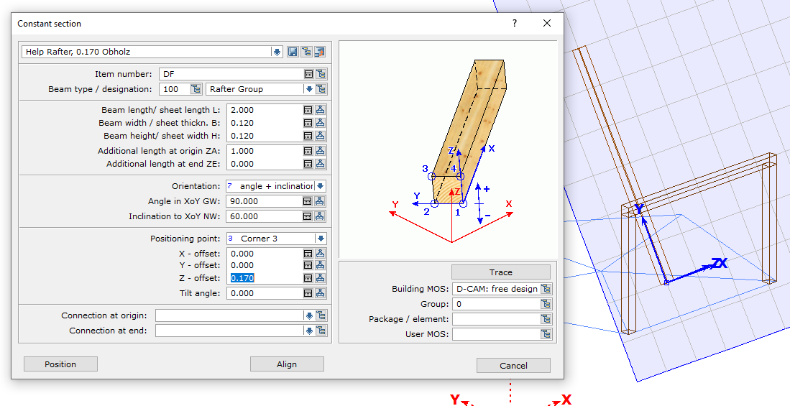{width="1.0225557742782152in" height="1.2663024934383202in"}Note: in order for the front side of the work plane to face upwards and originate at the bottom end of the beam, the top plane of the rafter should be selected. The selection of edges or corner points of this surface is also possible, but can lead to other orientations of the work plane.

-   The help rafter can be deleted.

> Notes
>
> 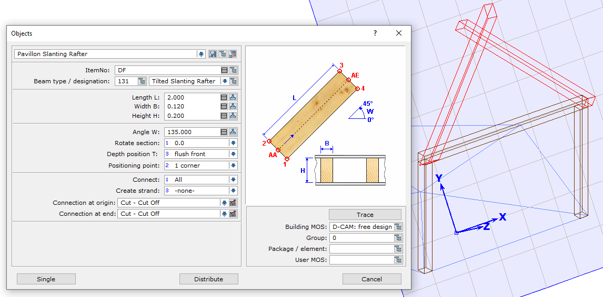{width="6.2980260279965in" height="3.236978346456693in"}

-   We create 2 tilted slanting rafters at right angles to each other with the dimensions 0.120x0.200x2.000 in the work plane \"Roof\" using \"Beam Angle\". The positioning is carried out using the ends of the plates on the front edge. On the left corner the orientation is 45° with the positioning point 2, on the right 135° and the point 1.

> {width="6.328992782152231in" height="3.1303116797900263in"}Note: the corners of the frame are angled in the work plane.

-   We lap joint these two rafters.

> Notes

-   We create the dormer ridge plate in the work plane \"Roof\" with \"constant cross section\" with the dimensions 0.120 x 0.120 x 2.000, \"additional length at origin ZA:\" 1.500, parallel Z, corner 4, Tilt angle 45°. Positioning point is the top outside crossing point of the rafters.

> 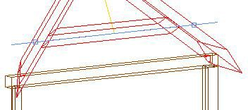{width="6.266070647419073in" height="3.5654155730533685in"}

-   We create as 3D assisting geometry line (with 4-3-3), \"Intersection line 2 planes\" thus not belonging to a work plane, the intersection line lays between the work planes \"Front\" and \"Roof\".

> Note: The Plate front and top planes of the rafters can be selected for creating this line.

-   We create with \"beam along X\" in the work plane \"roof\" a tilted Trimmer between the inclined rafters. The dimensions are 0.120 x 0.200, the trimmers lower edge is the help line.

> {width="3.0076531058617673in" height="1.3325in"}

-   We create two intersection points of the rafter outer edges with the work plane with assisting geometry (4-1-1), \"Single point\".

> Notes
>
> A work plane should now run through the cutting line of the working planes or through the front edge of the Trimmer, which tilts 30° outwards from the \"Front\" work plane. Its Z-axis should be directed downwards so that component inputs (front flush) are above this plane. This is how the slanting dormer Verge rafters are to be created.

-   We change to the Global System.

-   We create a help rafter 0.120 x 0.200 x 2.000, 90° GW, 120° NW, positioning with Axis on the top middle of the Trimmer with \"Constant section General\".

> 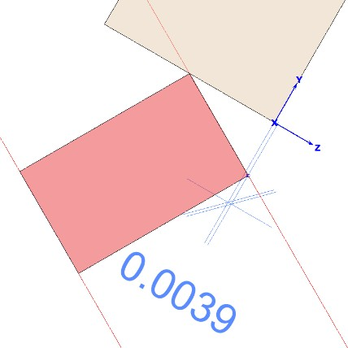{width="6.232740594925635in" height="2.7168744531933506in"}

-   On the underside of the help rafter we create the arbitrary work plane \"dormer front below\", size and grid as before.

> Note: When selecting a surface for the work plane, selecting the bottom side of the rafter this will give you desired alignment of Z of this plane.

+-----------------------------------------------------------------------------------------------------------+---------------------------------------------------------------------------------------------------------------------------------------------------------------+
| > {width="1.9192235345581803in" height="1.9170833333333333in"} | > Note:                                                                                                                                                       |
|                                                                                                           | >                                                                                                                                                             |
|                                                                                                           | > the work plane now has the correct inclination. However, it does not yet run exactly through the desired intersection line of the other two working planes. |
+===========================================================================================================+===============================================================================================================================================================+
+-----------------------------------------------------------------------------------------------------------+---------------------------------------------------------------------------------------------------------------------------------------------------------------+

> Notes

-   The help rafter can be deleted.

-   We move the work plane \"dormer front bottom\" parallel to the Trimmer and move the origin to the left intersection point.

-   We cut off the dormer ridge plate at the top parallel to this work plane.

-   In this work plane we create the \"slanting verge rafters\" with the option \"Beam 2 points\" 0,120 x 0,200x 2,500 and position them with the side 2-3 or 1-4.

> Note: The rafter edges, which are formed by the outside and underside of the rafters, run from the marked points next to the Trimmer to the upper end, of the lower ridge plate edge.
>
> {width="6.348643919510061in" height="2.410833333333333in"}
>
> Positioning from the point on the cutting line to the cut edge of the dormer ridge plate:

+-----------------------------------------------------------------------------------------------------------+--------------------------------------------------------------------------------------------+
| > 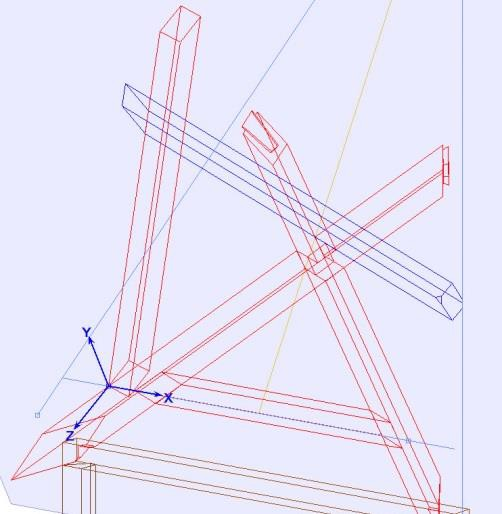{width="2.6088626421697287in" height="2.4515616797900264in"} | > 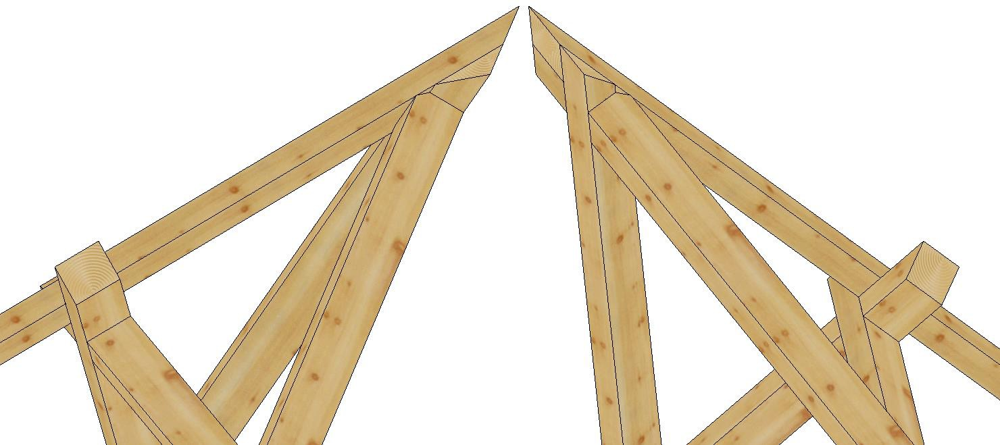{width="2.513028215223097in" height="2.57in"} |
+===========================================================================================================+============================================================================================+
+-----------------------------------------------------------------------------------------------------------+--------------------------------------------------------------------------------------------+

-   Afterwards we lap joint the dormer verge rafters.

> Notes

-   Then we create the birds mouths with the bottom side of the gable ridge in both verge rafters. (3-7-1) Birds mouth

> Note: Set the \"Edge to create birds' mouth\": to Choice.

-   Finally we cut both rafters flush with the top of the dormer ridge plate. (3-4-1) General

{width="6.322268153980753in" height="2.814478346456693in"}

-   Both Verge rafters are connected to the main rafters with \"birds' mouth\" and the main rafters are also connected to the Plate with \"birds' mouth\".

-   In the work plane \"Roof\" we create a vertical 2D line (length 3,000) through the middle of our previous construction, origin in the middle of the trimmer.

> {width="3.517648731408574in" height="2.8684372265966753in"}
>
> Notes

-   From the center of the pentagon we create a 3D assisting geometry line (with 4-3-1) vertically up to intersection with the center line in the work plane \"Roof\" which will define the ridge point of our pavilion.

> {width="6.258826552930883in" height="4.3in"}

-   We create four more [vertical work planes]{.underline} on each side of the pentagon with the names [\"left\"]{.underline}, [\"right\"]{.underline}, \"[rear left]{.underline}\" and \"[rear right]{.underline}\"; the Z-axis points outwards for all of them; grid same as for \"front\".

> Note: when selecting a line to create a vertical working plane, the program first offers the end of the line as the zero point, which is closer to the click point.

-   We change to the work plane \"Front\", activate and copy plate, right post and right main rafter to the clipboard (Ctrl+C).

-   We switch to the work plane \"left\". Here we insert the lower post end on the right intersection of the pentagon (Ctrl+V).

> Notes
>
> 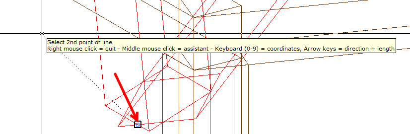{width="6.084191819772529in" height="5.318437226596675in"}

-   We cut the two rafters on the left horizontally at the bottom of the wall plate. We connect eaves point and ridge point with a 3D assisting geometry line.

> {width="6.2930632108486435in" height="2.053124453193351in"}
>
> Notes

-   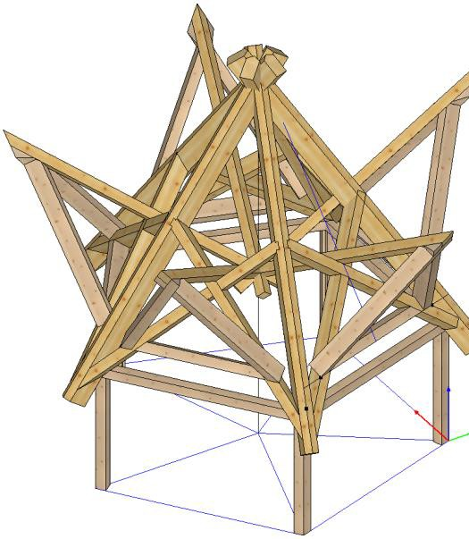{width="6.312306430446195in" height="4.157187226596675in"}Switch to the global system, then we position the 0.160 x 0.280 Hip rafter with \"Constant section, General\", Point to Point, with Additional length at origin ZAand at end ZE: of 0.200 \"Position point: Corner 3\" Y-offset 0,080.

-   We create the Hip cuts with \"(3-4-1) General\", with the top plan of the left & right main roof rafters.

-   Cut the lower end of the left main roof rafter to the right of the ridge \"(3 -4-2) Vertical cut\", then connect the upper end of the right main roof rafter to the ridge using dovetail tenon (3-02-1).

-   With the plate corner we create a corner birds mouth in the hip rafter \"(3 -7-2) 2 Lines +1, then with single beam info highlight and disband the corner birds mouth.

-   For both main roof rafters created in the \"Roof\" work plane, with single beam info highlight and disband all Processes with the \$ sign.

-   With (3-4-2) Vertical cut the post vertically using the line that runs from the corner to the center of the pentagon for the line of cutting plane.

> Notes

-   We delete the three components copied to the left work plane.

-   Switch to the \"Front\" work plane, activate and copy all components to the clipboard.

-   Change to the work plane \"left\", insert all parts from the clipboard.

-   On the left roof surface, connect the two main rafters to the right hip rafter as before and disband the processes with the \$ sign.

-   In the \"left\" work plane, we activate all components that have already been copied to the left, copy them to the clipboard, and paste them in turn into the work planes of the other three pentagonal sides.

+------------------------------------------------------------------------------------------------+-----------------------------------------------------------------------------------------------------------+
| > 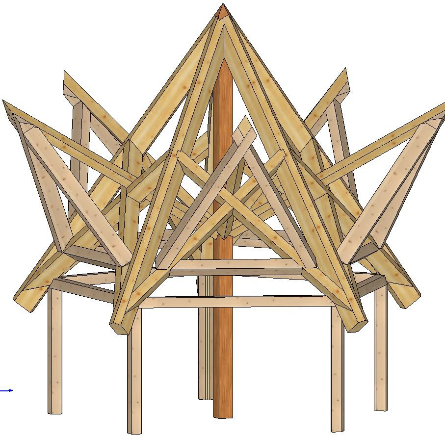{width="2.4054254155730534in" height="2.76375in"} | > {width="3.7795220909886265in" height="3.7041666666666666in"} |
+================================================================================================+===========================================================================================================+
+------------------------------------------------------------------------------------------------+-----------------------------------------------------------------------------------------------------------+

-   We end lap joint all the plates and add the missing Dovetail tenons to the main roof rafters to the hip rafters.

-   Now, switch to the Global System.

-   We produce a post with the dimensions 0.180 x 0.180 x 5.000, positioning axis, in the middle, and cut all hip rafters and dormer ridge plates to the post.

-   We point the post at the ridge with (3-4-1) \"General\" to the roof surfaces.

> Notes

-   With a horizontal cut on the post at the lower edges of the dormer ridge plates we get a King post.

+----------------------------------------------------------------------------------------------------------+-----------------------------------------------------------------------------------------------------------+
| > 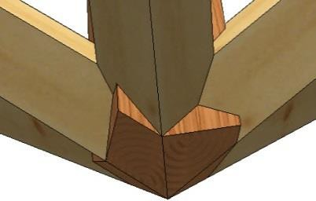{width="1.3212368766404199in" height="1.090832239720035in"} | > 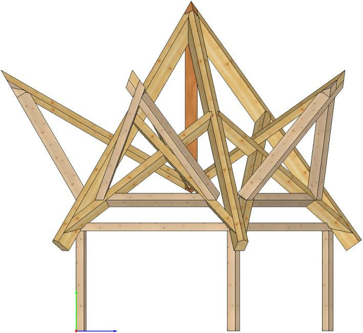{width="1.8497222222222223in" height="1.1733333333333333in"} |
+==========================================================================================================+===========================================================================================================+
+----------------------------------------------------------------------------------------------------------+-----------------------------------------------------------------------------------------------------------+

> This is our finished pavilion:

+------------------------------------------------------------------------------------------------+-----------------------------------------------------------------------------------------------------------+
| > 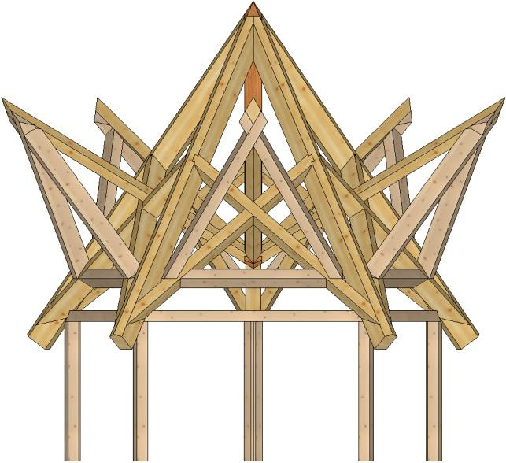{width="3.2483048993875765in" height="2.98375in"} | > 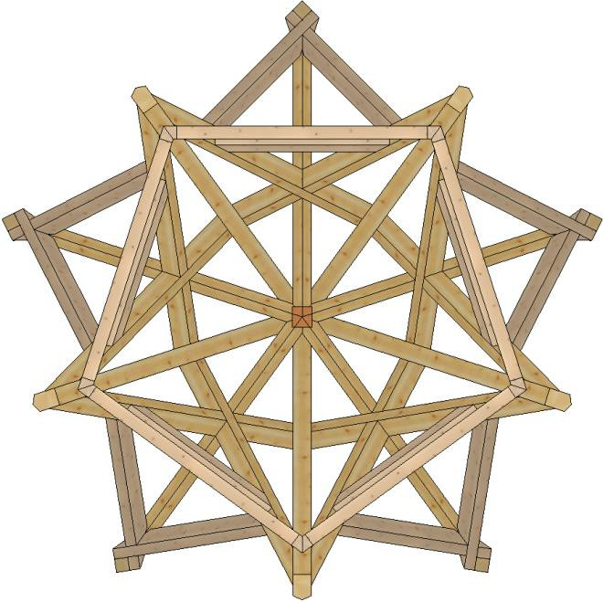{width="2.9446587926509187in" height="2.6949989063867017in"} |
+================================================================================================+===========================================================================================================+
+------------------------------------------------------------------------------------------------+-----------------------------------------------------------------------------------------------------------+

> Notes

+---------------------------------------------------------------------------------------------------------+----------------------------------------------------------------------------------------------------------+
| > 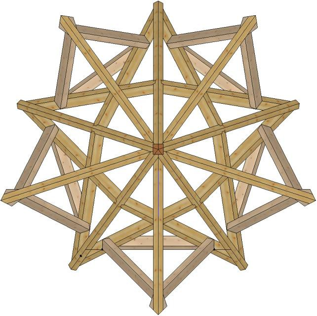{width="2.958646106736658in" height="2.951770559930009in"} | > {width="2.9420614610673668in" height="2.933332239720035in"} |
+=========================================================================================================+==========================================================================================================+
+---------------------------------------------------------------------------------------------------------+----------------------------------------------------------------------------------------------------------+

> Notes
