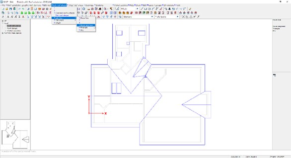
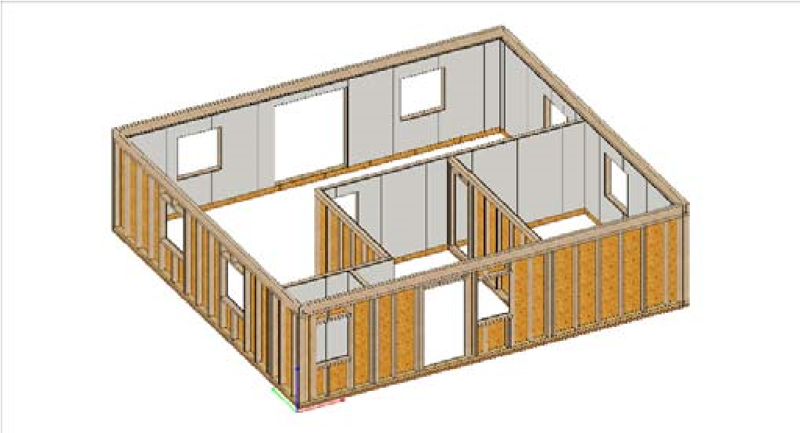
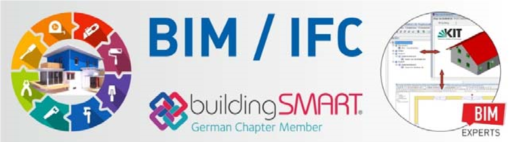
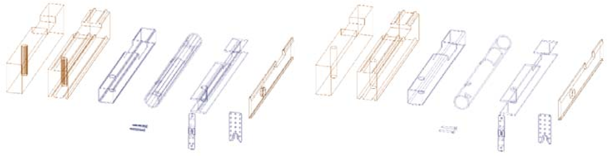

# Dietrich's ENG\_ABC

### Work Planes 

In the module DICAM, free construction, you can draw and construct in so‐called working planes. Various functions are used to define a plane in space, which can then be activated for the input of drawing elements and objects. The work planes are listed in the building navigation under DICAM and can therefore be selected directly.

<figure><figcaption></figcaption></figure>

The input of components in a working plane is done with special functions that, as in the wall construction, make use of the plane. It is also possible to use distribution. However, the inserted components are independent of the work plane, both in terms of their MOS and geometrically.

All plan elements can be drawn or imported in work planes. DWG/DXF, PDF and images are also available for import.

All plan elements belong to one working plane and can be moved, switched and also deleted.

In the OpenGl workspace, the entire structure can be restricted to an area around the work plane (clip‐box). The work planes have their own display options for themselves and in the display panel.

* Quick and easy creation
* Clear organization and display
* More organization in the structure of the building
* Time‐saving and efficient input in 3D
* 2D‐Elements in D‐CAM

### Work Environments 

The work environment represents the entirety of the saved settings, templates and other customizations of the program. It can be used to ensure that all users work with the same pre‐settings.

* Consistency in the projects
* clear working method
* Reliability when using complex functions and settings

### Dimension Take Off 

The dimension take‐off (bill of Quantities) is the storage of all lengths, areas or volumes of the walls, ceilings and roof areas in the building. The individual slices of walls, ceilings and roof surfaces form the basis for these values. The dimensions are transferred to the construction data program, where they can be filtered and output or exported.

* VOB German construction tendering and contract regulations
* Exact image of the structure
* Fully automated

### Auto Wall 

This function can be used to quickly create the basic construction of a stick frame wall automatically. In one or more walls the basic components (corner posts, corner detail, sole plate, top plate, double bottom plates and window/door studs) are created according to the settings in the dialog. All components can of course be modified and edited afterwards if necessary.

 Basic design at the click of a button with adjustable properties

<figure><figcaption></figcaption></figure>

### Project Data Program 

The project data program is the module of the software that is used to manage and process various information from the building. Here the dimension take‐off and material lists are edited and output or exported. In addition, the master database with the Item numbers are maintained in the construction data program.

* Automatic length optimization
* Extensive materials database

### Components 

A component is a grouping of different components with definition of views and perspectives. This enables a fast and efficient plan storage of the component. The material list storage offers a separate component list.

* Fast and neatly structured production drawings
* High level of automation for the plans
* Uniformity of the drawings
* Clearly arranged list of components

### Filter 

The Filter function from the " Activate" menu is available in all model space for component input. This function can be used to activate parts, e.g., for list storage or machine transfers. It can be filtered by many different properties of the components, the more filter specifications, the finer the selection. In the preview, you can see the affected components directly. Filter settings can be saved as usual and also called up directly as favorites with their own icon.

* Quick activation of component groups
* Efficient filtering for targeted filing or export

### Material Data Base 

The material data base is part of the Project Data Program (separate chapter) and represents the collection of all item numbers (separate chapter). Pressing the browser button of the Item number in the part input dialog of the building opens the material data base for selection. The parameters of the supplied item numbers can be individually customized in the project data program and an unlimited number of new item numbers can be created. All contents can be exchanged between different master databases by using data transfer.

* Extensive collection of all common materials
* Flexible by user customization
* Nothing gets lost through data transfer

### Building 

The building is the position type in Dietrich's, in which the 3D construction of the building project is entered. This is where the volumes are generated, on the basis of which all plans, lists and machine files are generated.

### Processes / Solid Tools 

Depending on the function used, the machining operations on the parts are stored parametrically in the single beam or purely as a change of shape on the volume. Only the parametric processing in the single beam can be transferred to the joinery machine. However, some of the so‐called intersect can be converted into machine operations using a special function in D‐CAM.

* High quality machine transfer
* Machining remains editable
* Various tools according to application

### Hardware Connection 

The hardware connection function is used to insert hardware together with machining operations for the situations "column foot" and "T‐connection. For this purpose, the library of hardware is filtered according to component dimensions and manufacturer specifications.

* Easy insertion of hardware
* Precision with regard to edge distances
* Automatic compliance with the manufacturer's specifications

### Metal Connector Catalogue 

The metal connector library offers a wide range of timber construction hardware for insertion. Some of these fittings provide the necessary processing for the timber construction components. The metal connector library is the original technique in Dietrich's to insert metal connectors. In the long term it is to be replaced by the hardware connection.

* Large selection of fittings
* Simultaneous insertion of processes

### Clip‐box 

<figure><figcaption></figcaption></figure>

In the OpenGl workspace (see chapter OpenGl) the display can be limited to an area around the working layer (see separate chapter), the so‐called clip‐box. Without switching off elements, the display is reduced to the desired section.

* Clarity for the processing
* Striking slice representation of the building
* Possible "camera movement" through the building

### Roof Construction Guidelines 

Dietrich's Roof construction guidelines automatically creates timbers on selected roof surfaces according to selfdefined rules. The so‐called roof guideline, which contain these rules and settings, can already be stored in the roof surface properties (separate chapter). All settings for the manual input of roof structure components can be used in the roof construction guidelines.

* Fast creation of the roof timbers
* Reliability and uniformity through default settings  Less work due to automation

### Roof Calculation 

<figure><figcaption></figcaption></figure>

The roof calculation is the model space in the building in which the roof areas are entered. The program calculates the roof surface by means of a house contour and corresponding attributes on the roof sides. This creates the roof areas in which the components can then be entered in the roof structure.

* Connection of roof components with the roof surfaces
* Fast and reliable input  Automatic dimension take‐off

### Roof Properties 

The roof surface properties determine the layered structure of the roof surfaces, the intersection with the walls and the design of the roof layers at the edges and openings. Here is also defined, which values are written into the dimension take off and which roof layers are created as slabs for the visualization.

* Visual representation of the roof layers
* U‐Value Calculation

### Overhang Areas 

The program can determine three areas for each roof surface: Overhang area, Habitable space, None Habitable space. These area definitions are used for detailed dimension take storage and automatic assignment of sheathings and boards.

* Precise division of the roof
* Detailed dimension take‐off
* Precise sheathing allocation

### Roof Design

<figure><figcaption></figcaption></figure>

The roof design is the model space in the building in which the roof components are entered. Based on the roof calculation, the roof areas are available here to manually or automatically create components in them. For this purpose, the program offers powerful automation that controls the relationships of the roof components with each other and with openings in the roof.

* High level of automation
* Customized input dialogs
* Automatically dimensioned and dynamic plans

### Manage Floor Deck Properties 

The floor deck properties determine the layered structure of a ceiling/floor. The ceiling type and the position of the sub floor are also defined here. Therefore, the floor deck property has an influence of the height positioning of the ceiling and the correct detection of roof areas.

 Visual representation of the ceiling/floor slices

### Floor Decks 

The floor deck is the model area in the building in which the ceilings on the respective floors are entered. The slices of the ceilings are determined by the floor deck property used. The components can then be created in these slices in the floor design model area.

* Quick input of the ceilings
* Automatic shape recognition

### Floor Design 

The floor design is the model area in the building in which the ceiling components are entered. Once a floor deck has been determined, the corresponding floor design is accessible. Each floor deck can be called up individually to enter components manually or automatically. Depending on the orientation defined in floor deck, the deck will be displayed rotated in the floor design to ensure a simple and fast input of the components.

* Fast and easy component input
* Possibility of elementation
* Automatic trimmers at openings

### D‐CAM 

.jpeg>) D‐CAM, the free construction, is the model area in the building in which all components can be freely entered or edited. As a result, numerous and very individual requirements can be handled in a time‐saving and efficient manner. D‐CAM offers efficiency and freedom where standard applications cannot reach deep enough.

* Complete freedom in design
* Time‐saving functions and libraries  Numerous import and export possibilities

### Machine control files 

The postprocessors convert the data from component processing, panel shapes and wall structures into machine data for all relevant machine types. Individually available interfaces offer a coordinated and constantly updated transfer from Dietrich's system to the machine software for the respective machine. Beam processors and saws as well as multifunction bridges and panel processing centers are controlled.

* Precise machine data
* Always up‐to‐date regarding machine software
* Wide selection of machines

### Wall design 

This module contains the component input into the walls, which were entered in the floor plan of the building or automatically generated by a corresponding import. In this way, wall components can be generated specifically, easily and quickly in a 2D view. The correct MOS affiliation is automatically assigned by the program.

* Quick and easy component input
* Automated MOS structure

### D‐Ref Building Positions 

The D‐Ref Building Reference module allows to overlay other buildings in the current building. In a separate function in D‐CAM the other structures are loaded, updated or unloaded. These are then available in the display control with their own options. Therefore, several tasks can be accomplished:

.jpeg>)‐ Comparison of different stages of the building

‐ Dismantling a large building and dividing the work involved in it

‐ Use " external" positions to adjust the " your own" positions

‐ Collision checks

The visibility of the referenced buildings can be adjusted very precisely in the display settings. Due to the mere reference, the elements do not burden the

performance of the current structure. Your own functions are available for collision checking.

* Effective distribution of large projects
* Reliability through targeted display of all relevant volumes and plan elements
* Error‐free planning through complete detection of all collisions
* Increase of the processing performance

### Single Beam Info 

The Single Beam info opens a dialog which displays the list of all parametric operations on a component. Here, processes can be added, deleted and edited. It can also be seen how the respective machining operations were created on the part and whether other parts are linked to the current one.

* Excellent control
* Clearly arranged processing list
* Additional input option

### Elements 

<figure><figcaption></figcaption></figure>

In the model areas Wall Design, Floor Design and Roof Design, in the respective modules, elementation is possible. This creates individual subordinate areas in the building

elements, whose components have a corresponding MOS assignment. In the wall, the HRB guideline reacts accordingly. In floor design and roof design, elementation and automatisms for the creation of components are available. For prefabrication of floors and roofs element by element, Elements is the ideal tool.

* Time saving
* Precise and reliable
* High level of automation

### Replacement Item Number 

During sorting, so‐called replacement ID numbers can be assigned automatically. This allows for components which have been created with a general Item number (e.g. sheets with "OSB") to be assigned substitute Item numbers (e.g. "OSB/3 15mm", "OSB/3 22mm", etc.). For this purpose, corresponding identifiers are created in the construction data program for relevant item numbers, which contain the desired conditions (regarding length, width or height of the components). When sorting in the building, these items can then be selected and the components automatically receive the desired item number.

* More flexibility in component input
* More differentiated material allocation for high‐quality lists and machine data  Reliable and time‐saving automation

### Dormer 

The Dormer model area becomes accessible if a dormer has been created in roof calculation using the corresponding function. The Dormer model space can be used to process both the calculation and the component input in the respective dormer.

 Fast input using templates  Possibility to move and copy

### Building Assistant 

The functions of the building assistant are accessible in the model area roof calculatio&#x6E;**.** This allows an entire roof calculation to be generated based on a previously entered profile position. Even floors, walls and ceilings can be generated automatically. Depending on the input depth of the profile position, the Building Assistant offers the possibility of obtaining an already highly developed building in a time saving manner.

* Fastest way to the finished roof and building
* Efficiency using pre‐configured settings
* High level of automation

### Building Library 

This function, which can be called in the Floor Plan model area, offers the possibility to store a whole building or parts of it in a library and reload it from there. This allows you to either insert saved building parts into other building positions or to import individual parts from complete building positions into another position. When reading in, you can choose exactly which building elements (ceilings and walls of certain floors) are to be read in with or without components and associated auxiliary geometry. These can then be transferred to existing storeys of the current building or new storeys can be created for it.

* well controlled modular system possible
* efficient depiction of complex building models
* Reduction of workload through reuse

### Building Part 

The individual components of a building, the walls, the framework, the ceiling/floor and the roof areas, are called building elements in Dietrich's Building Elements. These are entered in the model areas floor plan, floor decks and roof calculation. The order of the buildings MOS is based on them (separate chapter). Components that are entered in the corresponding model space are automatically part of the respective building element, but can also be manually assigned otherwise. This information is then attached to the component and can be used for sorting, filtering, labeling, lists and machine files. There is also a separate list storage for the building elements. In addition, the display in the different model spaces, as well as the possibilities for editing are controlled by this.

<figure><figcaption></figcaption></figure>

* Clear assignment and organization
* High level of automation
* Flexibility through free assignment

### Building Navigation 

The building navigation is a view window that displays the structure of the building (floors and building elements) and the model area and serves to switch to the model area. By clicking on the text, the program switches to the desired model space, directly to the clicked element. The building navigation window can be docked permanently on the left or right, positioned freely as an extra dialog box (e.g. another screen) or switched off.

<figure><figcaption></figcaption></figure>

* Fast and intuitive navigation through the building
* Excellent overview, especially for walls and floor decks

### Floor Plan 

The floor plan is the model space in the building in which the walls are entered. Here you first define the story structure of the building and then you can enter story by story walls and their openings. By a corresponding import in the floor plan (for example IFC) a complete building can also be imported here. In addition, the floor plan allows the HRB allocation of the walls and special elements such as chimney and stairs to be entered.

* Clear overview and control over the storeys
* Easy editing of the walls

### Building Outline 

The building outline is the basis for a roof calculation. It is entered and edited in the Roof Calculation module. The sides of the building outline are assigned the profile values for the roof calculation, with which the program then calculates the roof slab. Usually the building outline corresponds to the outer edges or reference axes of the outer walls, but can also be defined completely independent of them. Each building can contain any number of building outlines.

* Easy creation of roof areas
* Easy to handle

### HRB Wall Guideline Editor and Construction 

With the HRB module, walls can be automatically constructed with timber frame components. This results in beams, sheeting, fittings and, if necessary, processing in the layers of the walls. In the HRB Wall Guideline Editor, a separate program that is started parallel to the construction, the components and their properties are defined in so‐called construction guideline. The HRB assignment is then used to create the components in the building.

<figure><figcaption></figcaption></figure>

The HRB module replaces the manual adjustment of the slice outlines of the walls at the intersection points with each other and with the roof as well as the manual input of almost all necessary components. Using predefined rules and specific definitions on the walls, the program can generate the timber frame construction components and adjust them accordingly at the push of a button if the building geometry changes.

* Confidence during input
* time‐saving and efficient working method
* high level of flexibility

### Item Number 

The item numbers are managed in the material data base and contain information on the type of part, material and its important parameters, ordering information and even entire profile descriptions of parts. Each part is created with a specific Item number and carries its information further on into lists, plans and machine files.  Central location for all important properties

### IFC‐Import 

<figure><figcaption></figcaption></figure>

In the Floor Plan model area, the IFC data format is available for import. This interface makes it possible to read an entire building with the corresponding structure into Dietrich's. The IFC format is used by a large number of planning programs as part of the BIM working method and provides the relevant model data. In addition to the "simple" import and export of IFC files, Dietrich's IFC Premium offers even more powerful interpretation options during import. For example, numerous construction details can already be executed automatically when the building is transferred from a pure planning software to the CAD/CAM construction software.

* you can save having to input the building yourself
* Complete BIM interchange
* Import independent of the planning software

### Edge Types 

<figure><figcaption></figcaption></figure>

Dietrich's technique of optimized edge display allows to reduce the display of edge‐rich volumes (mostly profile beams, hardware, circular components, etc.) to the lines required for the respective purpose. There are various edge types for this purpose, which are either already defined in the profile numbers or can be assigned manually in DICAM. In the display settings in the building and in the plan settings, only the edge types that you need to see can be visualized.

* Clearly arranged model for better handling
* Useful reduction of lines
* Enables fast and accurate dimensioning

### Manage Clashes 

Manage clashes is available in the DICAM model space for checking possible clashes of components. With adjustable precision, all selected volumes are checked for clashes. The clashes found are stored on the components as identifiers and can be processed accordingly or filtered at a later time.

* Simple and targeted review
* Confidence there are no clashes before generation of plans, lists, machine files
* Automated consideration of other building components or planning phases

### Logic Blocks 

A Logic block is a combination of components, machining, drawing elements, dimensions and labels. Logic blocks can be defined individually and offer the possibility to create very individual elements automatically. By reading variables and reading existing values in the building and selective selection of points and components, logic blocks become very versatile and powerful. They can be used in all modules and combine high automation with targeted flexibility. Logic blocks can also be controlled by attributes of imported building elements.

Due to the existing combination of the created elements, they can even be edited subsequently with regard to their respective properties.

* maximum degree of individuality and flexibility
* high amount of complexity is possible
* ideal for all situations and designs where the standard tools can only offer limited input comfort
* Almost everything that can be entered and edited manually can be solved more efficiently with a logic block

### Coordinate System 

<figure><figcaption></figcaption></figure>

Each volume in a building position has its own coordinate system, the socalled object coordinate system. This results in the reference sides of the object to which the parametric operations are related. In order to have the necessary control over the part, for example regarding the storage of machine files and plans, the object coordinate system must be taken into account.

* Precise and powerful machine data
* Effective control for plans

### Slice Outlines 

The walls, ceilings/floors and roof all have a defined slice structure. This defines the individual slices of the respective building element. Each of these slices has an outline and therefore often an individual shape. The slice outlines can be manipulated in different ways. Manual functions and powerful automatisms are available for this purpose.

 Ensures correct panel shapes automatically

### Sorting Number 

The Sort function is used to assign a sequence number to each part in a building position. Depending on the sorting settings, each volume gets its own number or they are combined according to certain rules. The sequence number can be used to filter the parts and is also transferred in list, plans and machine files.

* Enables singularity of each component
* Simplifies filtering and storage

### Machine Control Files 

The machine control file, function is available in almost all modules. It transfers a user‐defined selection of parts to the respective post processor, where the actual machine file is created.

* Precise machine data
* Always up‐to‐date regarding machine software
* Wide selection of machines

### Material List 

The Material Lists function can be used to transfer the components entered for a building structure to the project data program (separate chapter) or to output them directly as document or spreadsheet file. Different list types are available depending on the component type. When transferred to the project data program, extensive editing and output options are still available there. The material lists contain all desired parameters of the parts as well as summaries and totals according to the selected templates.

* Finished lists at the push of a button
* Simple representation of all component properties

### Program Module 

The construction area of Dietrich's software in a building position is divided into nine modeling areas: Floor plan,

Wall design, Floor decks, Floor design, Roof calculation, Roof design, Dormer design, Truss design und D‐CAM: Free design

Each model space has its own representation on the screen with regard to the construction space and the toolbars. Depending on the building part, the appropriate functions for input, editing and output are available here.

* Clear arrangement of the building in the input areas
* Although all component inputs generate objects in 3D, many inputs can be made in a 2D view
* More reliability and a more efficient and faster input
* Very simple structuring and organization of the building, keyword MOS

### MOS

<figure><figcaption></figcaption></figure>

MOS means model, organization and structure. In order to be able to handle the large number of building elements and even more so the number of components, fittings, fasteners, etc., it is necessary to have a model, organization and structure. To be able to act sensibly and maintaining clarity the structure of a model is represented accordingly in the MOS.

The corresponding functions are available in the DCAM model space. Many of the MOS assignments are automatically controlled by the program, but can always be edited and extended by the user. By assigning components to the corresponding building elements and storeys as well as self‐defined packages,

there are great possibilities for targeted storage of plans, lists and machine files as well as other exports.

* High level of structure and organization
* Fast filtering  Excellent control

### Niches 

A niche is an opening in the wall or ceiling that does not necessarily penetrate the building element completely. For instance, a niche can be an actual "blind hole", a geometrical boundary, but also an area that does not change the wall body. Logic blocks can be attached to niches (similar to windows and doors) and the HRB guidelines can move slice outlines and create components. Niches are entered manually either in the floor plan, the floor decks or in the wall design, but they can also come via IFC import. There they can even be generated automatically using defined components.

* Flexible input method for wall and ceiling areas
* High degree of automation possible

### OpenGL 

With the technology of OpenGL, the volumes in the program can be displayed graphically in rendered form.

You can view the components with their texture and in a selected perspective and also store images of them. In addition, the OpenGL workspace offers in some model spaces the possibility to work constructively in such a representation.

* Realistic representation
* Better overview in complex situations

### Package/Element 

In the D‐CAM model area, so‐called package / element can be defined in addition to the existing building MOS areas. This gives you the possibility to organize yourself individually and to divide the components into groups.

This additional MOS information can also be used for filtering and is included in lists, plans and machine data.

* Better organization possible
* Fast filtering
* More information on components

### Drawings 

The information from the structure is transferred to the D‐Cad 2D program via a drawing file. This automatically creates drawing elements that represent the building and its components in 2D. Automatic dimensioning, text and hatching are provided by the program. A high degree of finished information density on the plans, even before manual dimensioning, text and drawing.

Each model space has specifically tailored plan file functions, matching the respective building elements. Most of the plan files created in this way are dynamically linked to the position of the building. This means that if there are changes in the building, the plans can be recalculated and the building elements and components automatically adapt to the current status in the building.

The effort of 2D plan processing can be reduced enormously if the plan files are used specifically and the corresponding settings are worked out accordingly.

* High level of automation
* High reliability through dynamics
* Reduction of the 2D work

### D‐Cad 2D 

D‐Cad 2D is the 2D drawing module of Dietrich's software. Here, plans can be created manually with all common functions and the plans automatically generated from the building can be edited accordingly. The D‐Cad 2D program is a separate task and can be run parallel to the construction program. After editing, the plans are printed from here or exported as DXF file.

* Stand‐alone CAD program
* Dynamic connection to the building model

### Profile 

&#x20;The profile is an own position type in Dietrich's, which is processed in a separate program part (also own task). It depicts a vertical section through the building, which includes the roof shape and roof components, but can also include all floors with walls and ceilings. Therefore, in addition to determining the profile values for the roof areas, the entire height structure of the building can already be determined. This information can then be easily and accurately transferred to the building later using the building assistant.

By saving and using your own templates for the profile position, the time needed to achieve an inputready building position can be shortened enormously.

* Clear and straightforward cut through the building
* Transfer of all parameters to the building
* Automatic profile plan

### Project Administration 

The project administration is the first part of Dietrich's software that opens when you start the program. It

remains a separate task and can be used parallel to all open positions.

In the project administration, new projects are created, existing ones opened and edited, other program modules started, files copied and moved, project positions sent by e‐mail and much more that has to do with the administration of CAD data.

In the project administration all drives of the computer and all drives of the network mapped on this computer are generally accessible. In order to open and edit projects, the user must have both read and write permissions for the folders used on the drives.

* Excellent overview
* Easy editing, copying, sending

### List of Points 

&#x20;Point clouds supplied by laser scanners are made available in D‐CAM for evaluation in the building via the connection to the As‐BuiltTM Modeler software. So selected points can be transferred directly into Dietrich's building, orthophotos can be imported and also lines generated in the Modeler can be imported as DXF. The point cloud brings the comprehensive digital survey comfortably into the office and can be optimally prepared and filtered by the AsBuiltTM Modeler in an easy to handle form to be incorporated into the building.

* Complete measurement of all points available
* Optimized Refinement in As‐BuiltTM Modeler  Efficient handling and more reliability in 3D

### SmartTags 

A SmartTag is a grouping of operations that can be applied to parts using a function in D‐CAM, Wall design, Floor decks and Roof design. There is a special SmartTag editor for this purpose in D‐Cam, with which the user can edit existing SmartTags or write new ones.

In principle, all machining operations that can be created in the single member of a component can be integrated into a SmartTag. When using variables preceding the application of a SmartTag, the machining operations can be designed flexibly. In addition, the properties of the components that are selected are available. This means that a SmartTag reacts to the selected component and can, for example, calculate its dimensions accordingly. Even other objects stored in libraries can be placed accordingly using a point symbol.

* attach many machining operations reliably, quickly and efficiently to one or more components simultaneously
* clever and powerful shortcut for manual processing
* high flexibility through variables
* further increase in efficiency possible by using SmartTags in combination elements

### Resize/Change Section 

The Change Section function allows for the subsequent modification of the Item number (also for profile beams) and the cross‐section values of components. The side of the member that is to retain its original position can be specified in the dialog or graphically determined by clicking on "the blue arrow". It is also possible to change several components simultaneously.

 Quick and easy modification of existing components

### Rooms 

To determine all relevant data for further building physics calculations as well as to create a complete room survey according to WoFlV and DIN 277, so‐called rooms can be entered in the model area floor plan. These

rooms are formed based on the automatically detected floor space and the boundaries to the top and bottom. They are well structured for the measurement and contain further information about their surfaces. The room volumes are generated as auxiliary components.

* Specific preparation of the building
* Simple input
* Clear representation

### Reference Axis 

When designing walls, the position of the so‐called reference axis can be defined. This axis can lie anywhere within the wall structure and can be used for positioning as well as for precise positioning in case of subsequent changes to the walls.

For example, the outlines of floor decks can be generated automatically in relation to the reference axes of the walls.

* Fixed line in walls for orientation
* Enables further automatisms

### Sorting and Labelling 

&#x20;This function is available in all model spaces and assigns part numbers to the parts according to predefined settings. Identical components get the same part numbers. For two components to be identical, their designation, material, dimensions and machining must be exactly the same. How the relationship to the same building element should be considered can be set. Sorting is always requested automatically before output

(lists, plans, machine data) from the building as soon as relevant changes to the parts have occurred since the last sorting.

The sorting settings can be saved and organized and are also automatically saved in the building. Identical part numbers can easily be prevented. The highest number already reached is always displayed. Depending on the type of beam, it is possible to define sequence number ranges and to assign specific fixed numbers. For the assignment of replacement Item numbers see separate chapter.

* Fast automatic numbering
* Reliability through customized presetting’s
* High flexibility

### Beam Type 

When entering components, automatically or manually, a beam type and designation can be defined for each new component. This means the naming of the component in terms of timber construction (e.g. rafter, purlin, corner post). The program offers a wide range of beam types, but you can also enter your own names here. The beam number is an important controlling factor. For some machine files, for example, this is used to control the handling of the beam or in the building and, on plans, the color of the beam. In addition, the beam types are used for filtering and, when sorting, for groupwise recognition of certain components.

* Helpful categorization of components
* Enables efficient automatisms

### Truss 

In Dietrich's, the so‐called truss functions similarly to the other building elements (walls, ceiling panels, roof surfaces). They can be entered vertically or inclined in the floor plan or roof design. Similar to walls, they have a defined thickness and are used for efficient input of a truss or framework. Once trusses are entered, the components can be created in the Truss Design model area. Like the other building elements, the trusses provide their own MOS information.

* Efficient input of trusses and beams
* Automatisms for creation
* Connection to the D‐Calcs

### System Variables 

The system variables are values and properties that the program can determine in the building based on the entered building information and components. This information is available as variables for use in numerous program functions and automatisms such as HRB guidelines, smart tags, logic blocks, etc.

An example is the thickness of a wall layer. This information can be entered as a variable, for example in a function for beam input in the wall instead of a numerical value. This means that no matter what the thickness of the wall is, this function always creates a beam that has exactly the same thickness as the slice. In this way, the appropriate beam is always automatically created for each wall with a single setting.

System variables are always offered by the program in the respective area matching the building element.

* High reliability due to automatic recording of the current status
* Many possibilities for practical conditions for automatisms

### Libraries/Objects 

The library/object function from the Wall Design and Ceiling Design model areas can be used to store individual parts or entire part groups to a library and read them from there. In this way, frequently used components can be quickly inserted without having to create them all manually again.

* Faster component input
* Reliability by using "proven" configurations

### Drawing Section 

The Drawing section function is available in the plan program and in most model areas in the building. Individual or several drawing elements, dimensions and labels can be stored in a library and read out of it again when needed. With this function, 2D information can be efficiently managed as in a catalog and used in the appropriate places.

Partial drawings can also be inserted via logic blocks. If the drawing elements have been saved accordingly, they are also flexible with regard to their size and can be controlled via variables.

* Draw faster
* Reliability by using "proven" details
* Flexibility through controllable size

### Fasteners 

In certain processes that connect components with each other, so‐called fasteners can also be defined. These are then stored in the single beam info of the component (not solids), similar to the parametric operations themselves. In the single beam info, such fastener information can also be entered manually or generated automatically via a smart tag. The fasteners stored in this manner can be output to a corresponding material list.

* Simple and resource‐saving technology
* Good overview and precision through separate list

### Priority of Intersection 

The building outlines used in the roof calculation to determine the roof areas (separate chapter) have so‐called intersection priorities. These priorities influence the intersection of the roof surfaces. There is a ranking order where some areas are cut and others are not. You can use priority 0 to ignore roof areas for intersection. A separate function in the Roof Calculation model space is used to edit the intersection priorities.

* Intelligent control of the automatic roof calculation
* Flexibility with manual processing

### Intersection Sets 

This function intersects component groups which are defined by the item numbers assigned to them. It can be executed in wall and ceiling design and in D‐CAM. For intersect (no machine processes in single beam), several types of intersection are available, as well as "air gaps" around the intersections on the female components. With HRB guidelines, an intersection set can be performed automatically.

* Reliable automatism
* Quick and easy of many single components (e.g. insulation in HRB wall)

### Visualizing 

In order to visualize the building constructed with Dietrich's also beyond OpenGl, several export options are available. The 3D PDF and 3D Web Viewer are particularly suitable for pure viewing, control and easier communication regarding the construction project. This allows you to share files that are easy to handle and versatile. For high‐quality and photorealistic visualizations on a high representative level, specially developed software for rendering should be used. Dietrich's exports are available in the formats 3ds, skp, fbx, gltf and obj. The program delivers an optimally equipped model for all exports with matching and suitably aligned textures, grouped elements and a consistent building and component structure.

* Detailed 3D representation with realistic textures
* Suitable exports for every purpose
* Simple handling

### Default Values 

Default values are variables that can be defined by the user and are accessible in the project management, the profile, all model areas in the building and in the 2D CAD program. These default values can contain variables used in the input functions as well as variables entered in automatisms such as HRB guidelines. This creates a dialog where you can set values and parameters that influence certain functions like a remote control. logic blocks or smart tags.

Through the technology of the default values, powerful automatisms in themselves achieve a further level of flexibility and reliability. But even simple manual entries can be made more quickly and flexibly.

* Further level of flexibility and reliability for already powerful automatisms
* make manual entries simpler and more flexible  Central dialog for most important parameters

### Templates 

In Dietrich's the used settings can be saved and organized in almost all input dialogs. In addition, many positions and formats can be saved as templates and used at any time. Profiles, buildings, plans, lists and much more can

be saved under their own name with regard to central properties, thus making it easier to work with recurring requirements. A simple example of this are plan templates. This allows you to specify not only the paper format or the default printer, but also the layer structure and its properties, the text and dimension styles used in the plan, as well as graphics, legends and much more which are already on "paper". A catalog of carefully compiled plan templates shortens the processing time of the plans and the results are consistent and of high quality.

* Quick and efficient working
* High degree of reliability and consistency

### Wall Attributes 

The walls in Dietrich's not only have all the information from the respective design. In the so‐called attributes of the walls additional information can be defined, which significantly influence the automatic allocation by the HRB guideline. Here, not only the wall ends and the top and bottom connections are defined, but also the desired panel separation direction. Furthermore, the wall number can be entered specifically and any wall name can be assigned in addition to the construction.

 Intelligent" walls through more stored information

### Wall Properties 

The wall properties determine the layered structure of a wall. The wall type and the position of the reference axis are also defined here. Additional information such as positioning, input direction or link to an HRB guideline file is also entered when defining the properties. Another important setting in the wall property controls the height references of the walls and thus the resulting wall height after the input in the floor plan.

* U‐value calculation is available
* Precise work in wall construction
* "Intelligent" walls through more stored information

### Wall Design 

The wall design is the model space in the building in which components can be entered into existing walls (entered in the floor plan or automatically generated by import). The wall design shows the wall view, a horizontal and a vertical section through the wall in 2D. This allows the components to be entered easily and clearly. The slice structure of the wall is taken into account during the input and therefore guarantees a controlled positioning of all components. By working in a single wall, the program can automatically take over the MOS allocation, thus ensuring reliability and control. Of course, components of adjacent walls, ceilings and roof surfaces are also accessible for machining and accurate positioning.

* Well‐structured and controlled working in 2D
* User comfort in the display by dividing the view into three areas
* Automatically correct MOS
* Various input options

### 3D Views 

The 3D views function is available in the D‐CAM model space. This means that various components of the situation are stored and can be recalled exactly as they were at the touch of a button: View direction and rotation center, image section, current work plane, layer setting, display settings, visible objects.

The 3D views are managed in the building navigation and can be selected directly from anywhere. By integrating the 3D views into the plan file "File current view" these plans are dynamic and can be recalculated.

* Simple access to complex input situations
* Dynamic plans of details
* Clear overview and fast processing
