# IFC\_Ud22

### IFC

### IFC and BIM

**IFC Import, Export Version 22**

BIM (Building Information Modeling), the contemporary working method for the planning and implementation of building projects, is based on the active networking of all participants incorporated in the construction process. Clear conventions are needed for all processes and interfaces between the participants.

The data model used for this purpose is called Industry Foundation Classes (IFC). It is a general data scheme that allows an exchange of data between different software applications. This data model includes information from all the participants incorporated in the building project throughout its entire lifecycle.

Short report:

_...In the UK, the use of BIM in the awarding of public construction projects is already mandatory. The British government estimates that 1.7 billion pounds (about 2 billion euros) were saved in such projects since the year 2012. In addition, 66 percent of the orders of the British main authority for building awards were completed in due time and within budget. Compared to 2010, this was a significant increase of 33 percent (Source: Construction News)...._

Homepage of the buildingSMART association: [http://www.buildingsmart.org](http://www.buildingsmart.de/)

### IFC Data model in the application

IFC is a very powerful data model. But it is also very questionable in some ways:

* IFC has a systematic structure that can be used on all objects alike: The ‘name’ of an object is always

in the same location, materials can be assigned in the same way, etc.

* Typical building elements such as walls and ceilings are defined as individual objects. But they can be described in different ways.
* For example, wall geometries can be described in the following ways: axis with wall buildup and height, extrusion body with subtraction solids, direct description as BRep, ...
* From our point of view, many elementary properties of building elements were not taken into account. For example, no view direction is defined for the walls. The exterior side of an external wall cannot be identified. The wall buildup is described geometrically. So the external plaster will be positioned on the correct side of the wall. But the exterior side is not defined.
* From our point of view, the biggest deficits in the data structure exist in the domain of the roof. For example, you cannot define a roofline to be an eaves line.
* Machine processes do not exist in IFC. We have to analyze the geometry during import in order to create them.

In the application, there are very large variations in the quality of IFC - Files:

* The software generating the IFC file creates the data model as similar as possible to its proprietary data structure.
* Often, the IFC export can be customized extensively. In many cases, the software does not keep the user from configuring completely absurd export settings. The user needs to have a good knowledge of IFC to be able to make reasonable adjustments. Due to time constraints, the user often uses 'random' settings.
* If the software is able to export its objects with a reasonable description, the user must also use the corresponding objects in the software: If he enters a generic object shaped as a wall instead a 'proper' wall, the software will not identify and export the object as a wall.

IFC can be used to exchange buildings between different software solutions on a very high level. To achieve this, considerable and powerful settings can be configured in the IFC import in Dietrich's buildings. If the imported building model is not perfect straightaway, the model can be revised with the same functions as a proprietary Dietrich's building model.

#### IFC Viewer

You can use different IFC viewers (partly freeware) to check IFC files. Normally, we use the FZK viewer from Karlsruhe research center: [www.iai.kit.edu/1302.php](http://www.iai.kit.edu/1302.php).

The viewer can be used to check substantial information. This viewer basically uses the internal IFC definitions. For purposes of transparency, these definitions are also used in this documentation.

### IFC version

IFC is a very powerful system. Therefore, there are definitions that can be used for special purposes in addition to the overall system. Such a determination is called 'Model View Definition' (abbrev. 'MVD'). For our purposes, we use the most common MVD, the 'Coordination View Version 2.0', (abbrev 'CV2.0').

We currently support the version: **IFC2x3 CV2.0**

#### 1.3.1 IFC4 (V18.01)

IFC 2x3 is still the most used IFC version. Many systems already offer an IFC export in the new version IFC4. It will take some time until these exports will reach the quality of the IFC 2x3 exports used for many years; therefore, all systems continue to offer an export with IFC 2x3. With Dietrich's you can import in any case, whether IFC 2x3 or IFC4. You and your partners can choose which version you want to work with.

### IFC Files in Project Administration

* A viewer software for IFC/ BIM files can be set up in Windows as the default program for \*.ifc files. In this case, double click or 'Return' can be used in Project Administration to open an IFC file within the viewer.
* (16.01) New IFC files or IFC files recently added to a project are now assigned to the main category 'IFC (OpenBIM)'. The assignment of existing IFC files is not changed.
* (16.01) Zipped IFC files (ifczip) are listed in Project Administration.

### IFC import

### IFC import, module

The IFC import is modularly divided into 2 performance levels:

IFC Import (Standard): Optional module. The customizable properties and the customizing of the building elements make it possible to generate the construction within the building elements directly after the import.

* Properties can be generated automatically for the imported walls, ceilings and roofs. These properties can either be adapted or existing properties can be assigned. The positioning of the building elements can be adjusted at the same time.
* It is also possible to import the original volumes of walls and ceilings. This also applies to windows and doors.
* You can apply existing saved settings from the corresponding dialogue boxes to windows, doors and CON-references.
* Frames and sashes from windows and doors can be imported optionally.
* In 'Assign itemNo' you can use four levels to assign item numbers to materials from IFC.

IFC import premium: Optional module. The customizable properties and the customizing of the building elements make it possible to generate the construction within the building elements directly after the import. In addition, the IFC elements will be interpreted and equipped with details for manufacturing during import.

* In addition to the delivery scope of IFC import (default), allocation files can be used. These files make it possible to automatically apply properties and technologies to objects in the building by analyzing a wide range of properties of IFC elements.
* In the allocation files for windows, doors and CON references, properties like width, height, IFC name, storey and wall properties can be interpreted. But it is also possible to analyze user defined properties. Due to these properties, complete settings, wall fittings, soffits, TFW guidelines and logic blocks are assigned to windows, doors and CON references. For logic blocks it is also possible to set values according to user defined variables.

### Project information from IFC file

(V18.02) New project from IFC:

When creating a new project, information from an IFC file can be transferred via the _from IFC_ button. The IFC file is selected in the called dialog and the assignment of the information below the tree element. The function is controlled by an editable settings file: **Project\_new\_IFC.dsi.**

This particular form of setting files is described in **Variables\_Ud19\*** in the _Editable Settings Files_ chap- ter. Adjustments are made in a special dialog or with a standard text editor; this should only be done by experienced users.

The following values from the IFC file can be assigned:

* Properties of **IfcProject:**

#### IfcProject.Name, IfcProject.LongName, IfcProject.Description.

* Properties from PropertySets that have been assigned directly to the **IfcProject.**

These values from the IFC file can be transferred to the following properties or variables in the project:

* Project number: The project number is then adopted as a suggestion in the dialog Project - New and can still be adapted there.
* Project Information: This is set information that is available in the system.

▫ Building site, comment: Are accepted as a suggestion in the dialog Project - New and can still be adapted there.

▫ Address data for the construction site

▫ Address data client

▫ Address data architect

* Project default values: This is information the user can define in user in user variables himself (function 1-6 default values). These variables can be accessed in the project from all plans or building positions.

▫ You can also specify which setting of project variables is to be applied automatically when the project is created.

Further definition and examples can be found in the supplied file **Project\_new\_IFC.dsi**.

### Import function

Use _1-04-8 IFC import_ in the program module 'floor plan' to start the import:

* Select the IFC file in the first dialog box. Use the sub-dialogs in order to assign properties for walls, ceilings and roof areas, to select settings for windows and doors and to configure assignments of item numbers.

▫ (16.01) Zipped IFC files (ifczip) are listed in the Import dialog box and can be imported directly, either.

* In the following dialog box, the program shows the storeys found in the IFC file. Corresponding storeys can be assigned. A height offset and a rotation of the imported building can be entered as well.
* Finally, the imported building is positioned by selecting base point and destination point in the ground plan.

#### Dialog box: Import IFC files

In this dialog, the IFC-file is selected and the assignments are set up.

* In the tree element, the IFC file can be selected in any directory. The button below can be used to select the current project directory.
* The window to the right represents the graphical preview of the IFC file.
* Below, the assignments can be selected:

▫ Properties of walls, ceilings and roof surfaces

▫ Door/ window assignments

▫ Assignment of item numbers

▫ (17.02) Assignment of storeys

▫ Use the icon button to the right (manage settings) in order to open the sub dialog for the configuration of the assignments.

▫ For a detailed description of the contents and the possibilities of the assignments, please refer to the follow-up chapters.

▫ If no configuration for the assignment is selected, the program uses the internal default values. The default values are described in the follow-up chapters as well.

* (17.02) In other fields, the shift in the height and the rotation of the imported building can be specified.

▫ With the shift in height, the entire building can be moved up or down during import.

▫ By rotating around the target point, the whole structure is rotated. A positive angle rotates mathematically positive, ie counterclockwise.

* Press OK to proceed to the next step of the import.

#### Dialog box: Import building model

In this dialog box, the storeys are determined.

* The storeys from the IFC file are represented to the left:

▫ The original description from the IFC file is used here. This description consist of name + name(long).

▫ The Z-height of the bottom edge of the storey is shown in brackets behind. It is represented according to the coordinate system of the IFC file. Parts of the storey can be located below this point.

▫ Each storey is divided into 3 sections: storey walls, storey ceilings and other building elements and components belonging directly to the storey. You can decide for each section of the storey if it should be imported, and which storey it should be assigned to. So it is possible to assign ceilings and walls to different storeys.

* Employ the building storeys in the right column:

▫ Enter abbreviations and numbers for every storey.

▫ The proposed storeys are based on the Z-height of the storey from the IFC file. The file

**%dhpvor%\swgrenze.vor** defines the intervals for the analysis.

* The first interval is defined by the values in the first and second line, the second interval is defined by the values in the 2nd and 3rd line etc.
* If the bottom edge of the storey is within the first interval, the proposal value is 'BA 0'
* If the bottom edge of the storey is within the 2nd interval, the proposal value is 'GF 0'
* If the bottom edge of the storey is within the 3nd or one of the follow-up intervals, the proposal value is 'IF 0', 'IF 1' etc.
* The highest IF found is always renamed 'TF 0'.
* 'Move in height' can be used to move the whole building up or down during import.
* 'Rotate around destination' can be used to rotate the whole building. Positive angle: Rotates the building mathematically positive, i.e. counterclockwise.

#### Positioning the building in ground plan

Finally, the building is positioned in ground plan (X, Y).

* For this purpose, a base point is selected at the imported IFC building. Then, a destination point is selected in the ground plan. The base point is placed on the destination point. Finally, the building is optionally rotated around the destination point by the specified angle.
* All options can be used for entering the points. Direct point selection as well as 'coordinates' and 'middle mouse click' for temporary points/ assistant.
* Often it makes sense to put the origin (0, 0) of the IFC building directly at the origin (0, 0) of the Dietrich's building. To do so, simply cancel the point selection for the base point as well as the point selection for the destination point with 'right click' (MR). This can be combined with other entries: E.g. you can select the base point at (0, 0) with 'MR' and select the destination point with the usual methods at any other position.

### IFC import of walls

Usually, the import function tries to interpret the IFC data as building inputs. The wall is newly generated with the determined entry values.

* IFC elements with type **IfcWall** or **IfcWallStandardCase** are imported as 'walls'.
* In IFC (like in Dietrich's), the X-direction of the wall coordinate system corresponds to the axial direction (length direction). We adopt the orientation of the X-axis and determine the length from the maximum dimensions of the wall.
* If a slice buildup is described in IFC (**IFCMATERIALLAYERSET**, only for **IfcWallStandardCase**) we adopt it. Otherwise, the wall property on the IFC side has only one slice and we try to determine the wall thickness by the existing wall geometry.
* The Z position of the bottom edge results from the reference axis (axis) of the wall. This is defined in the coordinate system of the wall. The bottom edge is saved relative to the bottom edge of the current floor.
* We determine the top edge by the highest point of the wall geometry. It is saved in relation to the bottom edge of the current storey as well.
* The imported walls are automatically intersected with the roof surfaces.
* We automatically connect the imported walls at corners and T-joints according to the setting 1-7-7, if the wall bodies or the reference axis have contact. Sometimes, the IFC files also define relations to neighbor walls. These relations are not evaluated in the Dietrich's building.

(17.02) In the dialog for assigning the wall properties, the automatic connection can be switched off for each property.

* But if 'O: use Original shape' is selected during import, it will not be connected and keeps its original shape.
* (18.01) In IFC, the wall number can be transferred in the "Tag" parameter (IfcWall or IfcWallStandardCase). If the parameter is defined as a pure integer number, we assume the wall number.

#### Dialog for assigning wall properties

In the dialog box 'IFC Import' you can select a setting for assigning the wall properties. Use the 'manage settings' button to open the dialog for defining the assignments.

Dialog for assigning wall properties

* To the left you can find a list of properties which have either been found in the IFC file or which have been saved with the current setting.

▫ Properties found in the current IFC file are highlighted with an asterisk '\*'.

▫ If you click on a property in the list, the recognized structure/ roof surface property is represented below.

▫ The position of the reference axis is defined in the same way as in the Dietrich's building: The distance from the view side of the wall, (positive direction 'into' the wall) is given.

* To the right, you can assign a roof surface property from the Dietrich's building.

▫ This is the complete roof surface property and you can add the parameters that could not be interpreted from IFC.

▫ This property can be selected from the existing master data. Alternatively, you can use the button 'generate properties' in order to generate a Dietrich's roof surface property based on the IFC properties. This property can be customized using the button 'edit settings'.

▫ The general buildup of the property is represented below.

▫ As IFC and Dietrich's properties do not always correspond according to the thickness , an offset of the reference axis has to be defined. First, the reference axis from IFC is used during import. Let us assume the reference axis runs from 2.0/1.0 to 0.0/1.0,the view direction of the wall faces pos. Y. Using 'Offset reference axis: 0.0' would position the reference axis of the Dietrich's wall property exactly on it (2.0/1.0 to 0.0/1.0). But if you use a positive offset, the building becomes larger, the wall is moved against view direction (= pos.Y). If you use an offset '+0.2' the new reference axis runs from 2.0/0.8 to 0.0/0.8. The wall buildup is moved with the reference axis.

Further example: The original wall has a thickness of 0.36; reference axis:0.02. The new wall has a thickness of 0,3 only. Reference axis on 0.12.

Reference axis should be kept: Offset = 0.0 View side should be kept:

Distance = IFC\_reference\_axis - building\_reference\_axis = 0.02-0.12=-0.10 Reverse side should be kept:

Distance = Building\_wall\_thickness - IFC\_wall\_thickness - building\_reference\_axis + IFC\_reference\_axis = 0.30-0.36-0.12+0.02=-0.16

* If you tick the checkbox ‘O’, the original shape of the wall is imported from IFC.

▫ Use this option if the wall will not be altered and the construction of the wall is not supposed to be generated in the building (e.g. precast concrete elements).

▫ This option can also be used if a wall that is not limited by the roof is sloping at the top, e.g. staircase walls or support walls at hillsides.

▫ You can switch between the imported wall object and the manually defined property later in the wall properties dialog box of each individual wall.

▫ If this option is used, windows and doors keep their original shape as well.

* Walls are imported only if the checkbox 'I' is ticked for the corresponding property. You can exclude walls from the import by unticking this checkbox. This makes sense e.g. if IFC walls are used for other building elements, which are not walls in fact.
* (17.02) If checkbox "A" is set, then the walls will be connected to adjacent walls via T-joints or wall corners after import. This is correct for most walls and has always been done. In some cases, it makes sense not to connect the walls, e.g. in the case of dwarf walls. This can be determined directly here by the checkbox "A" is not set for these wall properties. Subsequent serperating of the walls is then no longer necessary. The walls retain their original IFC wall length.

#### Import without assigning properties

Default rules, if no configuration for the assignment of properties is selected in the dialog box 'Import IFC':

*
  *
    *
      * The properties are generated automatically, as if the button 'Generate properties' had been selected.
      * All walls are imported. All checkboxes 'E' are ticked.

### IFC import of windows, doors and niches

All types of wall cut-outs are imported here: Windows and doors, but also niches. Windows and doors pierce the wall completely (**IfcOpeningElement**). Niches are based on alcoves or notches (**IfcOpeningElement\_Recess**). They are used for real alcoves, but also for notches holding elements of building equipment (switches, sockets, electric installation, flushing tanks etc.). Therefore, niches do not generate cut outs in the wall body, but they are recognized only if the wall is constructed using a guideline or in logic blocks. Niches allow the expansive assignment of logic blocks (LB's), so that e.g. a convenient socket is inserted automatically by the import.

Two different technologies can be used when importing windows, doors and niches:

* Assignment of saved settings from the corresponding dialog boxes (IFC import standard)
* Allocation files: These files make it possible to assign different properties and technologies in the Dietrich's building by interpreting a wide range of IFC properties. (IFC import premium).

#### Properties of windows and doors that can be interpreted by the import 

The following properties of windows and doors can be interpreted, if the corresponding data is available in the IFC file:

* Differentiation between window (Element **IfcWindow**) or door (Element **IfcDoor**).
* ~~Shape: Rectangular, slanted and pointed windows can be interpreted based on the geometry of the cut out and rectangular doors. For all other shapes, the circumscribing rectangle is used.~~
* (20.01) Form type: When importing windows, in addition to rectangle, slanting and pointed, the shapes circular, curved and diamond can now be recognized and distinguished from the geometry of the opening. The curved shape was added for doors. For windows with the shapes rectangular, slanting, pointed and curved, a distinction is also made as to whether they have sills or are floor- deep.
* The geometry of the IFC opening is used to determine the dimensions of the opening and the parameters for generating the shape.
* The opening sense for windows and doors is determined by the coordinate system of the opening in IFC
* Doors: Hinge side and type for 1sash and 2sash turn and sliding doors. Derived from **IfcDoorStyle.OperationType** . Possible values: **SINGLE\_SWING\_LEFT / SINGLE\_SWING\_RIGHT / DOUBLE\_DOOR\_ / SINGLE\_SWING / SLIDING\_TO\_LEFT / SLIDING\_TO\_RIGHT / DOUBLE\_DOOR\_SLIDING**. All other values for **IfcDoorStyle.OperationType** are not interpreted. Note: The hinge side is opposite to DIN **SINGLE\_SWING\_LEFT** is a 1 sash turn door DIN right.

▪

* (17.02) Hinge side and type for sashes from IFC: **IfcWindowPanelProperties**

▫ IFC defines the information for sashes in the IfcWindowPanelProperties. There is one such PropertySet for each sash. The relevant information is the sash position, hinge side and type. This information is transmitted in special variables. See Hinge side and side for sashes from IFC: IfcWindowPanelProperties.

* Openings piercing the complete wall (**IfcOpeningElement**) neither described as a window (**IfcWindow**) nor as a door (**IfcDoor**), are described as 'opening' in Dietrich's building. The 'opening' always belongs to doors in Dietrich's building, irrespective of the size. It is defined as 'type: opening'.

#### Properties of niches that can be interpreted by the import

The following properties of niches can be interpreted, if the corresponding data is available in the IFC file:

* ~~Shape: Only the rectangular shape exists for CON-References. For all other shapes, the circumscribing rectangle is used.~~
* (18.01) Niches can have any shape defined by straight lines in the view. This is extruded into the wall.
* The geometry of the IFC opening is used to determine the dimensions of the opening and the parameters for generating the shape.
* The orientation is interpreted based on the geometry. If the notch is open to the view side of the wall, the orientation is 'against view'. If it is open to the reverse side of the wall, the orientation is 'in view'.

#### Dialog assigning windows and doors

In the dialog box 'IFC import' you can select a setting for the assignment of windows and doors. Use the

'Manage settings’ button in order to open the dialog box 'IFC: Window/ door assignment'.

IFC: Window/ door assignment:

* To the left you can see a list of opening types, that can be distinguished by the import. They can get individual properties:

▫ Exterior door: Doors in exterior walls

▫ Interior doors: Doors in interior walls

▫ Window (rectangular): Window with 'shape _rectangular'_, sole plate height > 0.3m above BE wall.

▫ Window (slanting): Window with shape _slanting_.

▫ Window (pointed): Window with shape _pointed_.

▫ Patio windows: Windows with shape _rectangular_ sole plate height < 0.3m above BE wall.

▫ Niches, CON-reference

▫ (18.01) Ceiling openings, niches. These can only be further interpreted using the method

‘Assignment files’.

* If you tick the checkbox ‘O’, the original shape of the raw opening from IFC is imported as a

subtraction solid for the opening.

▫ Use this option, if the opening will not be altered and the construction of the wall is not supposed to be generated in the building (e.g. precast concrete elements).

▫ This option is used also if the shape of the opening cannot be entered directly in the Dietrich's building.

▫ You can switch between the original subtraction solid (from import) and the subtraction solid interpreted from the parameters in the 'edit door/ window' dialogue box later.

Here, you can also find the option '_do not create, already included in wall object._' Use this option if the openings have already been subtracted in the original wall body (this does not apply to IFC regulations). The subtraction solid is not subtracted 'again' in this case.

▫ If 'use original shape' is selected for the walls, openings are automatically imported with their original shape, independent from the setting 'O'.

* By ticking the checkbox 'S' you can also import the structural objects (sashes, frame, glass).

▫ This makes it possible to represent the division of the sashes, muntins etc. They can be used to store line based drawings, like elevations.

▫ Unfortunately, these components are often not suitable for the visualization, as all objects (frame and glazing) have the same material.

* In the drop list top right you can select between the two methods: Windows/ door settings or assignment file.
* Method 1: Direct assignment of saved settings from the dialog boxes for entering doors and windows:

▫ In the drop trees you can select saved settings from the normal entry dialog boxes. Only the name is registered here. If a saved setting is altered in the master data, the changed setting is used in the next import.

▫ This setting can still be adjusted with the 'edit settings' button. As only the name of the setting is registered in the import, this editing affects the master data!

▫ The import copies the dimensions from the IFC file, the saved dimensions in the settings are erased by these values.

It is possible that logic blocks contain fixed dimensions. These dimensions would erase the values from the import in this case. This does not apply to our default logic blocks because they do not contain fixed dimensions.

▫ The import also interprets the hinge side for doors. This setting is assigned to the settings. If the parameter for the hinge side is set to 'choice' in logic blocks, the hinge side interpreted by the import is kept.

In the default logic blocks this parameter is set to 'choice'. In the windows, the opening sense is fixed. But it corresponds to the common opening direction (against view) anyways.

* Method 2: Selection of allocation files with assignments of properties and technologies according to different IFC properties

▫ In all drop trees, the same allocation files can be selected. These files are saved in **%dhpvor%**

(**...\Dietrichs14\winvor\eng**). The have the file extension **\*.oa1**.

▫ Only the name is registered here. If the file is altered in the master data, the changed file is used in the next import.

▫ These files can be edited with standard text editors (e.g. WordPad). (The button 'edit setting' is not active at the moment.)

▫ In the allocation files for windows, doors and CON references, properties like width, height, IFC name, storey and wall properties can be interpreted. But it is also possible to analyze user defined properties. Due to these properties, complete settings, wall fittings, soffits, TFW guidelines and logic blocks are assigned to windows, doors and CON references. It is also possible to use the values of user defined variables in logic blocks.

▫ Allocation files and proceedings are described in detail in the following chapter: Allocation files

#### Import of windows, doors and CON-references without assignment

Default rules, if no configuration for the assignment of properties is selected in the dialog box 'Import IFC':

* The openings are generated according to the (shape)-type and according to the imported dimensions.
* For windows and doors, an empty setting is loaded with '_object mode_' = '_template_'.. In the sub dialog '_structure_', the interpreted opening sense and the interpreted hinge side are selected automatically.
* For CON-references, the interpreted _orientation_ is selected automatically.
* The original shape (subtraction solid) of all windows and doors is imported, 'O' is ticked.
* All structural objects are imported, all checkboxes ‘S’ are ticked.

### IFC import of ceilings

Usually, the import function tries to interpret the IFC data as building inputs. The ceiling is newly generated with the interpreted entry values.

* IFC elements of type **IfcSlab** with internal types **.FLOOR., .BASELAG.** or **.NOTDEFINED.** are imported as ceilings.
* Horizontal ceiling slabs are imported as ceilings.

▫ Ceiling slabs which are not horizontal are imported as ceilings as well. The thickness corresponds to the vertical distance from the lowest point to the highest point. So the orientation of the ceiling is still horizontal. In this case it makes sense to import the original shape of the ceiling from IFC.

* The coordinate system of the ceiling area is adopted from IFC.
* If a ceiling buildup is described in IFC (**IFCMATERIALLAYERSET**) it will be adopted. If there is not ceiling buildup in the IFC, the buildup on IFC side has only one slice and we try to interpret the ceiling thickness from the existing ceiling geometry.
* The bottom edge of the ceiling is adopted from the coordinate system of the ceiling slab. It is saved in relation to the bottom edge of the current storey.
* The imported ceiling areas are intersected automatically with walls and roof surfaces.
* But if you select to import the original shape, the ceiling body will not be intersected and keeps its entire shape.
* The original ceiling shape (one-piece or multi-part) can be selected for import. In this case, the result is different from entering ceilings and ceiling slabs directly in Dietrich's:

▫ No ceiling slabs are generated.

▫ Slice outlines are generated by intersecting the corresponding plane with the ceiling shape.

▫ The original ceiling shape is not intersected with walls and roof surfaces.

#### Dialog box 'Assign ceiling properties'

In the dialog box 'IFC Import' you can select a setting for assigning the ceiling properties. Use the

'Manage settings’ button in order to open the dialog box 'IFC: Window/ door assignment'. Dialog box 'Assign ceiling properties':

* To the left you can find a list of properties which have either been found in the IFC file or which have been saved with the current setting.

▫ Properties found in the current IFC file are highlighted with an asterisk '\*'.

▫ If you click on a property in the list, the recognized structure/ roof surface property is represented below.

▫ The floor finish build-up is defined by the position of the reference axis (the same way as in Dietrich's buildings): Distance from reference axis to TE ceiling; positive direction = up.

* To the right, you can assign a roof surface property from the Dietrich's building.

▫ This is a complete roof surface property and you can add the parameters that could not be interpreted from IFC.

▫ This property can be selected from the existing master data. Alternatively, you can use the button 'generate properties' in order to generate a Dietrich's roof surface property based on the IFC properties. This property can be customized using the button 'edit settings'.

▫ The general buildup of the property is represented below.

▫ As IFC and Dietrich's properties do not always correspond according to the thickness, an offset of the reference axis has to be defined. First, the reference axis from IFC is used during import. Let us assume the reference axis is positioned at 2.80. If 'Offset of reference axes = 0' is used, the reference axis of the ceiling property from building will be in the same position (2.80). But if a positive offset is used, the whole ceiling is lifted up. If an offset of +0,2 is used, the ceiling will be positioned at 3.00. The property (build-up) will be moved up together with the reference axis.

Further example: The original ceiling has a thickness of 0.28; floor finish build-up: 0.06. The ceiling property in the Dietrich's building has a thickness of 0.32; reference axis at 0.12.

Reference axis should be kept: Offset = 0.0 Top Edge (TE) should be kept:

Offset reference axis = IFC\_floor\_finish\_build-up - Dietrichs\_floor\_finish\_build-up = 0.06- 0.12=-0.06

Bottom edge (BE) should be kept:

Offset reference axis = Dietrichs\_floor\_thickness -IFC\_floor\_thickness - Dietrichs\_floor\_finish\_build-up + IFC\_floor\_finish\_build-up = 0.32-0.28-0.12+0.06=-0.02

* If you tick the checkbox ‘O’, the original shape of the ceiling is imported from IFC.

▫ Use this option if the ceiling will not be altered and the construction of the ceiling is not supposed to be generated in the building (e.g. precast concrete elements).

▫ You can switch between the imported ceiling object and the manually defined property later in the ceiling properties dialog box of each individual ceiling.

* Ceilings are imported only if the checkbox 'I' is ticked for the corresponding property. You can exclude ceilings from the import by unticking this checkbox. This makes sense e.g. if IFC ceilings are used for other building elements, which are not ceilings in fact.

#### Import without assigning properties

Default rules, if no configuration for the assignment of properties is selected in the dialog box 'Import IFC':

* The properties are generated automatically, as if the button 'Generate properties' had been selected.
* The original shape of all ceilings is imported, 'O' is ticked.
* All ceilings are imported. All checkboxes 'E' are ticked.

#### Import of ceiling openings and niches

Ceiling openings and niches are imported according to their shape.

You can also assign logic blocks via assignment files. The assignment is made via the dialog window/door/niches assignment. Principles as for wall niches; see IFC import of windows, doors and niches.

### IFC import of roofs

The import function tries to interpret the IFC data as building inputs. The roof is newly generated with the interpreted entry values. Special difficulties exist for roofs:

* Roofs are defined in IFC with the element **IfcRoof**; all elements belonging to this **IfcRoof** are generating the complete roof. IFC elements of type **IfcSlab** with internal type **.ROOF.** are imported as roof surfaces. But in some cases, the roof is described as one solid and not as individual roof surfaces.
* Sometimes, roof slices are written into different roofs. E.g. one roof is used to describe the roof buildup (tiles to rafter) and an extra roof describes the sub-roof. Sometimes, even 3 roofs are written: Roofing/ rafter’s layer/ sub-roof. In some cases, the separation into different roofs is done when the IFC file is exported. But some architectural systems are generally set up in a way that prevents the sub roof to be integrated into main roof. It is not possible to reunite these roofs again by the import. Recommended procedure: Only the roof containing the tiles layer/ roofing should be imported. Then, this roof should be re-generated with a convenient roof surface property.
* In IFC, roofs often belong to a storey. We do not adopt this assignment. As many roofs cover walls of several storeys, they are independent from the storeys in Dietrich's buildings.
* The most common roof type in Dietrich's buildings (building outline with roof calculation) does not exist in IFC.
* In IFC, the individual roof surface can be defined by an extrusion (roof surface polygon with thickness). As the direction for the extrusion is the same for all polygon edges, many types of roof surfaces cannot be represented, e.g. vertical ridge with perpendicular eave. Therefore, the roof surfaces are represented as one solid, from which the roof surface polygon has to be derived. Sometimes, even whole roofs are represented as one solid. In IFC, this is allowed although it is not appropriate. The visualization of the geometry is correct, but you cannot work with it in craftsmen’s terms of a roof.
* Often, a roof must be altered in order to get measurements ready for manufacturing. We need a building outline with a roof calculation that allows making corrections comfortably. Therefore, the import of roofs is carried out in several stages:

▫ If the roof surfaces are defined by polygons, we adopt these polygons first.

▫ If no polygons were used, we identify the polygons at the solids of the roof surfaces. If the whole roof was defined as one solid, we try to disassemble it into individual roof surfaces.

▫ Every roof surface receives an individual building outline.

If a roof surface cannot be generated by a building outline with the corresponding roof attributes (e.g. no eaves line exists), a new roof side is generated with a new roof outline polygon (corresponding to roof calculation 2-02-1).

▫ We analyze and determine the type of the roof lines: Eaves, ridge lines etc. If roof lines superimpose each other (with lines from other roof surfaces) we determine ridge lines, valley lines and hip lines.

▫ We then try to unite the different building outlines, taking into account the line types. If this is not possible, each roof surface retains its own building outline.

Optionally, you can switch off the merging of the building outlines.

▫ If building outlines are merged we search for walls to adapt the merged building outlines with convenient roof overhangs.

▫ Finally, we use temporary roof calculations in order to adapt the roof to the new roof surface property.

* Many program systems have problems to generate the external space (overhang areas) and the internal space (habitable space) within one roof. Often, two roofs are exported: An external one and an internal one. In these cases, it often makes sense to import only the external roof and to generate the internal slices with the roof surface properties.
* If a slice buildup is described in IFC (**IFCMATERIALLAYERSET**) it can be adopted. Otherwise, the property has only one slice on IFC side and we try to identify the roof surface thickness by analizing the existing roof geometry.
* (16.01) Roofs with a slope <0.5° are imported as 'ceilings'. A ceiling property can be selected for the roof that is imported as a ceiling.

#### Dialog box: 'Assign roof properties'

In the dialog box 'IFC Import' you can select a setting for assigning the roof surface properties. Use the

'Manage settings’ button in order to open the dialog box 'IFC: Window/ door assignment'. Dialog box: 'Assign roof properties'

* To the left you can find a list of properties which have either been found in the IFC file or which have been saved with the current setting.

▫ Properties found in the current IFC file are highlighted with an asterisk '\*'.

▫ If you click on a property in the list, the recognized structure/ roof surface property is represented below.

* To the right, you can assign a roof surface property from the Dietrich's building.

▫ This is a complete roof surface property and you can add the parameters that could not be interpreted from IFC.

▫ This property can be selected from the existing master data. Alternatively, you can use the button 'generate properties' in order to generate a Dietrich's roof surface property based on the IFC properties. This property can be customized using the button 'edit settings'.

▫ The general buildup of the property is represented below.

▫ As IFC and Dietrich's properties do not always correspond according to the buildup, a reference layer has to be defined. Generally, we put the top layer of the IFC property on the selected slice of the Dietrich's roof surface property. As the top layer of the IFC property usually is the roofing/ tiles layer, we normally use slice -6.

(V19.02) So far, the top of the IFC roof area volume has been used automatically as the starting polygons for our calculation. If these roof areas were calculated from the underside, there are often unfavorable situations on the top: An example is the eaves at the hip with an unevenly sloping hipped roof: These do not come together at one point on the top. Therefore, you can now choose to take over the underside of the roof surface volume. If, in the best case, this underside corresponds to the top of the rafters (slice 0), this can then be assigned directly to slice 0.

Further example: If the part of the roof lying below the rafter is defined as a separate roof in IFC, its top surface has to be put at the TE of slice +1. Please check in such cases if the lower roof has to be imported at all or if it is better to generate it in the Dietrich's building with a corresponding roof surface property.

▫ (18.04) In the roof properties the edge profiles are recorded, especially those at the verges. For the roof surface, the roof calculation is derived from the outer layer, the edge profiles are taken into account.

The offset of the roofing slice at the verge (usually approx. 0.04 m) is important for the exact width of the roof surface. If this offset was taken into account in the IFC, ie the width of the roof surface is inclusive of these offsets, roof properties should also be used during the import, whose edge profiles at the verge have the offset of e.g. 0.04 m. The roof calculation is then correspondingly reduced at the verges by this value. If the offset was not considered in IFC, then the edge profile should also have an offest of 0.0 for the roof surface. Then the roof area width for the roof calculation is not further reduced. The offset will be corrected later during the assignment of the roof tiles automatically with the values of the verge tile from the database.

* If the checkbox 'B' is ticked, we try to unite the building outlines of the roof surfaces. This is ideal if the roof has to be edited later, but it can change the roof geometry. If 'B' is not ticked, the result will be closer to the original roof geometry. But editing the roof will be more difficult.
* Roof surfaces are imported only if the checkbox 'I' is ticked for the corresponding property. You can exclude roof surfaces from the import by unticking this checkbox. This makes sense e.g. if IFC roof surfaces are defined as separate roofs.

#### Import without assigning properties

Default rules, if no configuration for the assignment of properties is selected in the dialog box 'Import IFC':

* The properties are generated automatically, as if the button 'Generate properties' had been selected.
* The checkboxes 'B' is ticked, we try to merge the building outlines of the roof surfaces.
* All roof surfaces are imported. All checkboxes 'E' are ticked.

### IFC import: Assign item number for structural objects

You can assign item numbers (itemNo.) according to several IFC parameters, for the following reasons:

* Profiled beams: In IFC, the data about the material (steel grade) and the data describing the profile can be described separately in different parameters. In Dietrich's buildings, this data is put together in only one itemNo.
* Separate structural objects containing the same material data in IFC (e.g. 'wood') should get different item numbers in the Dietrich's building, e.g. 'SPF' for beams, 'OSB' for panels.
* Although it is possible to directly and explicitly assign a material to structural objects, this is often not (or improperly) done. Sometimes, an insufficient material description ('wood') or no description at all is assigned or different information is merged in one 'material term' (e.g.'Gl24 girder 1').

#### Dialog 'Assign itemNo.'

On the left side of the dialog box, up to 4 parameters of the structural objects found in the IFC file are represented:

* The 4 parameters are ordered hierarchically:

▫ The representation of the levels can be switched off, starting from the lowest level. \<S0 /> With the checkboxes above the columns the respective level is turned on or off.

▫ The three points '...' represent the status 'not defined' in this level. If a line contains each a term in the first two columns (levels), and the three dots in the last two columns, the assignment is valid for all structural objects matching the first two levels, independent from the values they contain for the last two levels.

▫ The hierarchy is build up like a tree; which can be seen well if you turn off only the last three levels and successively switch them on again: One branch begins with an entry in the first level; the other levels are '...' (not defined). If you switch on level 2, the lines below (different from column 2) appear, but column 3 and 4 appear with '...' (not defined). If you switch on the third level then, the lines (different from column 3) appear and so on.

▫ The top line always consists of '...' (not defined) (not defined).

▫ If no value is defined for a parameter in a structural object, a general entry in curly brackets, e.g.

{no IFC Material} appears. This entry should not be confused with '...' (not defined). In this example, this line appears for structural objects without material definition.

▫ If you load a saved setting containing materials that do not exist in the current IFC file, the beginning of the corresponding line will receive not asterisk '\*'. The asterisk '\*' means, that corresponding structural objects have been found in the IFC file. If there are entries for structural objects in the IFC file that do not exist in the saved setting, they will be added to the setting.

* The selected itemNo. and the status of the checkboxes 'I' and 'P' can be inherited from the levels above to the levels below:

▫ Item numbers are inherited from the level above, if the line itself does not contain an itemNo.

▫ The status of the checkboxes 'I' and 'P' is inherited from the level above, if the checkbox is in the third status. The third status is neither empty nor with 'tick'; it is represented and explained below the table.

▫ In a line with 4 defined levels, no itemNo. is entered. The itemNo. is adopted from the line that matches in the first 3 levels and whose 4th level is '...' (not defined). If this line itself does not contain an itemNo., it will be adopted from the line that matches on the first two levels and whose level 3 and 4 are '...' (not defined). If this line again does not contain an itemNo., it will be adopted from the line that matches only on the first level and whose further levels are '...' (not defined). If finally, this line does not contain an itemNo., it will be adopted from first line whose 4 levels are '...' (not defined).

▫ The top line always consists of '...' (not defined) (not defined). If no further definitions are made in the following lines, the entries apply to all imported elements.

* The column header of the 4 parameters is based on the internal IFC terms, because they are explicitly defined in IFC only. The parameters are based on the following IFC terms:

1st Level _IFC Material_: In IFC a defined material (IFCMATERIAL) was assigned. These are the 'actual' material definitions. Unfortunately they are often not used properly.

2nd Level _IFC EntityTypeObject_: It is based on 2 similar parts, of which normally only one is defined.

If both parts are defined, we combine them with a slash '/'. Often, the entries define a cross section:

1st part Type definition for this IFC-Element, e.g. IFCCOLUMNTYPE, IFCBEAMTYPE etc.

2nd part Definition of cross-section: IFCPROFILEDEF or IfcArbitraryClosedProfileDef.

3rd level _IFC Identifier_: Element-type in IFC. Examples:

Beam IfcBeam

Construction element - arbitrary IfcBuildingElementProxy Furnishing / Furniture IfcFurnishingElement

Foundation IfcFooting

Slab IfcPlate

Beam / girder IfcMember

Column IfcColumn

4th level _IFC ObjectType_: Free Type-definition as subtype to IFC-Elementtyp (IFC Identifier). Here too, the entries often define a cross section: E.g. the entry ‘HEA 200’ can be entered here for an IFCBeam (girder).

Between the parameters and the item numbers you can find 2 columns with checkboxes:

* By ticking the checkbox 'E' you can import the structural objects.
* By ticking the checkbox 'M', machine processes will be identified at the structural objects. Machine processes cannot be transferred directly with IFC. The shape of the objects is interpreted by a geometric analysis in this step.

▫ Drilling diameters are rounded during the import process. Drillings with metric units are rounded to full millimeters. Drillings with imperial units are rounded to 1/16 inch (= 1.5875 mm). Please consider if metric or imperial diameters are used for the import, because the diameters will be rounded respectively. The drilling diameters are generated by an analysis of the shape of the structural objects. Without the rounding to full mm or 1/16 inches, uneven diameters would be imported for segmented drill holes, e.g. 12.03 mm.

* The status of the checkboxes 'I' and 'P' is inherited from the level above, if the checkbox is in the third status. The third status is neither empty nor with 'tick'; it is represented and explained below the table.

In the right column of the dialog box you can select the itemNo.

* Item numbers can be entered directly. Or you can select them with the item-browser.
* Item numbers are inherited from the level above, if the line itself does not contain an itemNo.

#### Import without assigning item numbers

If no item numbers are assigned, all structural elements are imported. No machine processes are

generated and all structural elements receive the itemNo. ‘C24’.

#### Import of sorting numbers

(19.01) The sorting number of objects i staken from IFC. For this we interpret the "tag", which is the 8th parameter for the different IFC elements (IfcBeam, IfcColumn, IfcMember, ...). We take the "tag" as a sorting number if it is numeric, positive and less than 32.767.

#### Free MOS for imported components

(17.02) Components imported from IFC (not wall volumes, floor slice panels, roof slice panels) are automatically assigned to the free MOS $ IFC\_Import. Thus, they can be recognized and selected as original imported volumes via this free MOS, even if they have been post-processed. The distinction is e.g. important if only the components that were created in our software should be exported again.

#### Import of damaged Volumes

If you want to import structural objects, the geometry of the solids has to presentable as a volume. The following failures are possible:

* The definition of the geometry is damaged or incomplete (if there is an error in the IFC file).
* The geometry is not described as by an enclosed volume, but only by individual surfaces. Sometimes this is done to describe sheet metal parts.
* A problem has occurred while generating the volume.

The geometry of structural objects that failed to be converted to volumes is represented with assisting geometry lines. These objects are put into layer whose name consists of ‘_(Damaged volumes)_’ and the desired itemNo, e.g. ‘_(Damaged volumes) OSB_’. This layer belongs to the layer group ‘_(Damaged volumes)_’.

(V19.01) If the shells are not closed, we find lines that have only one face on one side; these lines are on the same layer but are always displayed in the set color red.

3.8.5.1 Imported geometry description for volumes

The type of geometry description is defined in **IfcShapeRepresentation:**

For the 2nd parameter **RepresentationIdentifier** of value **Body** (for volume) the type is in the 3rd parameter **RepresentationType.**

We generate volumes for the following types of geometry description (3rd Parameter **RepresentationType**):

SweptSolid, Brep, CSG, Clipping,

(V19.01) Surfacemodel (if it does not consist of IfcOpenShell),Tesselation

### Assignment of storeys

Above all, the storeys are determined in this dialogue.

* On the left the storeys are displayed from the IFC file:

▫ The original name from the IFC file is used here. This consists of name plus long name.

▫ Behind it, the Z-height of the storey bottom edge is displayed. This results from the coordinate system of the storey as indicated in IFC. It may be parts of the storey further below.

▫ Each storey is divided into 3 areas: walls of the storey, ceilings of the storey and other building elements and components that belong directly to the storey. In this way it can be decided for each of these areas whether it will be read in and which storey in the building it will be assigned to. So it is possible to keep the ceilings in the building on a different storey than the walls.

▫ For walls and ceilings that are directly assigned to the building, a new storey is created. The name is formed from the name of the building. On the right, storeys can be assigned as for regular storeys.

▫ For components directly assigned to the building, the building name is displayed. In the right-hand list, the assignment to free design is suggested here.

* In the right column, the storeys are set in the building:

▫ For each storey, the number can be entered.

▫ The proposed storeys are based on the bottom edge of the storeys of IFC. These intervals are defined in the% dhpvor%\swgrenze.vor.

*
  * The first interval is between the values of the first and second line, the second between the values of the second and third line, etc.
  * If the lower edge lies in the first interval, then the suggestion "BA 0"
  * If the lower edge lies in the second interval, then the proposal "GF 0"
  * If the lower edge is in the third or one of the following intervals, the suggestion is "TF 0", "TF 1" etc.
  * The highest found TF is always renamed to "TF 0".

### Allocation files

In the allocation files for windows, doors and CON references, properties like width, height, IFC name, storey and wall properties can be interpreted. But it is also possible to analyze user defined properties. Due to these properties, complete settings, wall fittings, soffits, TFW guidelines and logic blocks are assigned to windows, doors and CON references. It is also possible to use the values of user defined variables in logic blocks.

#### Editing allocation files, encoding

The allocation files are edited with common text editors (like 'Editor' from the windows accessories), Text pad or Notepad etc.

In the file, it is possible to compare texts like names or designation in conditions. The conditions often contain special characters like mutated vowels (Umlaut). Therefore, the file should be encoded in UTF 8

#### Path, file names

The allocation files are saved in **%dhpvor%** (**..\Dietrichs14\winvor\ger**). The file name can be selected freely.

File extensions for the allocation files:

Windows, doors and CON-references **\*.oa1**

#### General structure of the allocation files

The file is split up into 'sections'. Each of these sections begins with keyword in squared brackets and ends with the keyword + ENDSEC in square brackets. The corresponding data is in between these keywords. Each line begins with a keyword and the 'equal' sign (=); followed by the value or content of the keyword. Sections can also be interlaced; a section can therefore contain other sub-sections. <

3.10.3.11st Section, version

The first section contains only the version of the file format. This is version 1.1 at present. Section, version: **\[VERSION] \[VERSION ENDSEC]**

Version number: The version number is assigned with the key word **Version**. This is version 1.1 at present.

Example:

#### \[VERSION]

**Version=1.1 \[VERSION ENDSEC]**

3.10.3.22nd Section, file information

In the second section, the contents of the file can be described and an image can be assigned. The description and the picture will be displayed when the file is selected in the assignment dialog when importing an IFC file into a Dietrich's building.

Section start - end: **\[FILE INFO] \[FILE INFO ENDSEC]**

File description: The description is assigned to the keywords **FileDescription\_1** to **FileDescription\_5** A line of text follows the equal sign in each row These 5 lines describe the content and purpose of the file. They are displayed when you select the file.

Picture: Path and file name are assigned to the keyword **PictureName**. The picture is also displayed when you select a file. In the path, variables for Dietrich's **$IFC\_Import** paths can be used, e.g.

**%DHPVOR%** (variable for system directory containing settings) (**..\Dietrichs14\winvor\eng**).

Example:

#### \[FILE INFO]

**FileDescription\_1=window type A FileDescription\_2=Aluminum window sills FileDescription\_3=**

**FileDescription\_4= FileDescription\_5= PictureName=%DHPVOR%\window.PNG \[FILE INFO ENDSEC]**

*
  *
    *
      1. All further sections, the actual assignments

All further sections describe the actual assignments. The structure is the same, they contain further sub- sections. Structure and function are described in a further chapter.

Section start - end: **\[ASSIGN ITEM] \[ASSIGN ITEM ENDSEC]**

*
  *
    *
      1. Comments

Comments are used for the documentation of the file and help the editor in later maintenance or modification of the file. \<S0 /> Comments do not affect the sequence in the import.

* Comments always begin with a double slash // and end at the next end of line.
* They can be inserted as a whole line.

Example:

#### \[ASSIGN ITEM]

**...**

**//comment comment**

**...**

*
  *
    *
      1. Examples for the general file structure

#### \[VERSION]

**Version=1.1 \[VERSION ENDSEC]**

**\[FILE INFO]**

**FileDescription\_1=window type A FileDescription\_2=Aluminum window sills FileDescription\_3=**

**FileDescription\_4= FileDescription\_5= PictureName=%DHPVOR%\window.PNG \[FILE INFO ENDSEC]**

**\[ASSIGN ITEM]**

**...**

**\[ASSIGN ITEM ENDSEC] \[ASSIGN ITEM]**

**...**

**\[ASSIGN ITEM ENDSEC]**

**\[ASSIGN ITEM]**

**...**

**\[ASSIGN ITEM ENDSEC]**

**...**

*
  *
    1. **Assignments, \[ASSIGN ITEM]**

Every assignment can consist of 4 parts:

* The settings, types or Logic Blocks that should be assigned, if the follow-up conditions are true.
* Values for variables in Logic Blocks: If Logic Blocks are assigned, their variables can be set. Under the following circumstances, not only Logic Blocks are selected, but also their variables are set: Setting variables for the assigned Logic Blocks

For every Logic Block, variables can be set. This means, that there may be a sub section for every Logic Block.

The section starts with: **\[ASSIGN ITEM KOMBIELEMENT\_1 VARIABLES]**. The number behind the Logic Block corresponds to the number of the assigned Logic Block, in this case '1'. There can be one section for each of the assigned Logic Blocks.

* Conditions based on system variables. The conditions use variables determined and provided by the system. Typical system variable are dimension like opening width, features like 'opening sense', but also type parameters from IFC: Conditions based on system variables

The section starts with: **\[ASSIGN ITEM CONDITIONS SYSTEM\_ATTRIBUTES]**. In every **ASSIGN ITEM**

there can be only one such section.

* Conditions based on free attributes. This condition uses variables that are not determined by the system but variable that can be configured freely. E.g. the user could define a new property ‘belt winder’ with the possible values {electrically, manually} at the window. The system does not know this property, but it can transfer the information via IFC: Condition based on free attributes

The section starts with: **\[ASSIGN ITEM CONDITIONS FREE\_ATTRIBUTES]**. In every **ASSIGN ITEM** there can be only one such section.

* Description: At the beginning of the section, description texts can be assigned with the keywords **AssignDescription\_1** to **AssignDescription\_5** After the 'equal' sign, one text line follows each. These 5 lines are supposed to explain the contents and purpose of the **ASSIGN ITEM**. They are displayed nowhere in the dialogs; therefore you can use a comment (see above) as well. A comment may be easier to read in the Editor.

3.10.4.1Examples for the general structure of a Assign Items

#### \[ASSIGN ITEM]

**AssignDescription\_1=..**

**..**

**Opening=..**

**Wall fitting=..**

**..**

**HrbTyp\_2=3 HrbTyp\_5=7**

**..**

**Kombielement\_1=..**

**Kombielement\_2=..**

**..**

**\[ASSIGN ITEM KOMBIELEMENT\_1 VARIABLES] V\_..=..**

**\[ASSIGN ITEM KOMBIELEMENT\_1 VARIABLES ENDSEC]**

**\[ASSIGN ITEM KOMBIELEMENT\_2 VARIABLES] V\_..=..**

**\[ASSIGN ITEM KOMBIELEMENT\_2 VARIABLES ENDSEC]**

**..**

**\[ASSIGN ITEM CONDITIONS SYSTEM\_ATTRIBUTES]**

**Condition=..**

**\[ASSIGN ITEM CONDITIONS SYSTEM\_ATTRIBUTES ENDSEC]**

**\[ASSIGN ITEM CONDITIONS FREE\_ATTRIBUTES]**

**Condition=..**

**\[ASSIGN ITEM CONDITIONS FREE\_ATTRIBUTES ENDSEC] \[ASSIGN ITEM ENDSEC]**

*
  *
    1. **Settings, types and Logic Blocks that can be assigned**

The following settings, types and Logic Blocks are assigned, if all conditions of the **ASSIGN ITEMS** are true:

*
  *
    *
      1. Opening settings:
* Utilization at windows, doors and CON-references
* Keyword **Opening**

Example: **Opening=Window 1sash**

* The name of the saved setting from the corresponding dialog box is assigned. In this example, the setting is called **Window 1sash**.
* The setting must have been saved in the proper dialog box, in this case in ‘Enter doors - rectangular’.
* If opening settings are assigned, they have to be at first rank within the **ASSIGN ITEM**.
* Within a **ASSIGN ITEM**, only one saved setting can be assigned.
  *
    *
      1. Settings for reveal:
* Utilization in windows and doors and CON references
* Keyword **Wandanschlag**

Example: **Wandanschlag=All sides 4cm**

* The name of the saved setting from the dialog box 'Jamb' is assigned. In this example, the setting is called **All sides 4cm**.
* In such a **ASSIGN ITEM**, only one saved setting for the reveal can be assigned.
  *
    *
      1. Settings for jamb:
* Utilization in windows and doors and CON references
* Keyword **Laibung**

Example: **Laibung=Larch**

* The name of the saved setting from the dialog box 'Jamb' is assigned. In the example, the setting is called **Larch**.
* In such a **ASSIGN ITEM** , only one saved setting for the jamb can be assigned.
  *
    *
      1. Setting the guideline - opening sense:
* Utilization in windows and doors and CON references
* Keyword **HRBoeffnungsrichtung**

possible values for windows, doors: **aus\_konstrkt / in\_sicht / gegen\_sicht**

(...**konstrktion**: missing u is not a typing error!) Example: **HRBoeffnungsrichtung=in\_sicht**

* The _guideline - opening sense_ in the sub dialog _Information/Systems_ is set to the corresponding value.
* In one **ASSIGN ITEM** the _guideline - opening sense_ can be set only once.
* For _CON-references_ no _guideline - opening sense_ can be set. It is used only internally. It corresponds to _orientation_. The _orientation_ is interpreted automatically at a recess. In order to determine a _orientation_ here, a setting (**Opening**) with a corresponding _orientation_ has to be assigned.
* If an opening has been assigned via several matching **ASSIGN ITEM** guideline opening senses, only the last one assigned is valid.
  *
    *
      1. Setting the guideline - hinge side:
* Utilization in windows and doors and CON references
* The definition of left and right at the guideline hinge side also depends on the actual opening sense and not on the guideline opening sense. At the same time, we look in the opposite sense to the opening sense (the sssh is moving toward us) in accordance with the DIN standard.
* Keyword **HRBanschlagseite**

possible values for windows, doors: **aus\_konstrktion** / **beidseitig\_Anschlag** / **beidseitig\_Schloss**

/ **links\_Anschlag** / **rechts\_Anschlag** (..**konstrktion**: missing u is not a typing error!) E: **HRBanschlagseite=links\_Anschlag**

* The _guideline - hinge side_\<s2/>in the sub dialog \<f4>Information/Systems\</f4>\<s5/>is set to the corresponding value.
* In one **ASSIGN ITEM** the _guideline - hinge side\<s6/>_&#x63;an be set only once.
* ~~For _CON-references_ no _guideline - hinge side_\<s5/>can be set. It is used only internally and it is used synonymous with _‘left side, right side’_. In order to define a _‘left side, right side’_ , a setting (**Opening**) with a corresponding _‘left side, right side’_ has to be assigned.~~
* Possible values for CON-references: **a\_seite\_links** / **a\_seite\_rechts** / **wahl**. Example: **HRBanschlagseite=a\_seite\_links**
* If an opening has been assigned via several matching **ASSIGN ITEM** guideline hinge sides, only the last one assigned will apply.
  *
    *
      1. Assigning guideline types:

Note: Since it is possible to assign conditions to the HRB types with version V19.01 (see update list), the HRB types should not be specified at the window. The logic should be mapped in the conditions in the wall guidelines. It is then also no longer necessary to assign HRB types in the oa1 file.

* Utilization at windows, doors and CON-references
* Keyword **HrbTyp\_**_**n**_

Example: **HrbTyp\_1=23**

* The assigned number (e.g. '23') is the number of the guideline type. This number is displayed in the dialog boxes for entering windows and doors in the sub dialog ’_Information, systems_’ in the list of guideline types. It corresponds to the number that the guideline type has in the guideline file.
* The number in front of the '=' only organizes the import; it is meaningless later:

▫ When the import of the opening is prepared, a list of 99 guideline types is generated: **HrbTyp\_1** to **HrbTyp\_99**. Their sequence corresponds to their number; the sequence is important for the execution of the guideline types in the guideline construction process. Example:

#### HrbTyp\_5=23 HrbTyp\_13=4 HrbTyp\_25=16

In the list within the dialog the guideline types, the types 23 / 4 / 16 would be in the first positions. The 5 / 13 and 25 in front of '=' are only used to determine the sequence. They are reduced according to their sequence; there are no gaps in the list.

▫ In the guideline system, there are up to 39 guideline types. So the index after '=' can be 1 to 39.

▫ It makes sense stick to a system. E.g. **HrbTyp\_13** is always used for a special lintel.

* Within such a **ASSIGN ITEM** a list entry (**HrbTyp\_**_**n**_) should be unique. But it is possible to use any number of list entries.
  *
    *
      1. Assigning Logic Blocks:
* Utilization at windows, doors and CON-references
* Keyword **Kombielement\_**_**n**_

#### Example: Kombielement\_1=%DHPKOL%\\#204\\#213\\#541\\#2449

* The number in front of the '=' only organizes the import; it is meaningless later:

▫ When the import of the opening is prepared, a list of 99 guideline types is generated: **Kombielement\_1**\<s2/>to \<f4>Kombielement\_\</f4>**99**. Their sequence corresponds to their number; the sequence is important for the execution of the Logic Blocks. Example:

#### Kombielement\_5=%DHPKOL%\\#204\Kol23 Kombielement\_13=%DHPKOL%\\#204\Kol4 Kombielement\_25=%DHPKOL%\\#204\Kol16

In the list within the dialog, the Logic Blocks Kol23 / Kol4 / Kol16 would be in the first positions. The 5 / 13 and 25 in front of '=' are only used to determine the sequence. They are reduced according to their sequence; there are no gaps in the list.

* The number before the '=' is an important reference, if variables are supposed to be filled with values within the **ASSIGN ITEM**.
* The assigned Logic Block is held with the usual path, the way it is saved in the dialog boxes (e.g. dialog box for entering windows)

▫ It is divided by using ‘\’ (backslash): The path is followed by the Logic Block file. The last part is

the name of the Logic Block within the Logic Block file.

▫ For the first part of the path, it makes sense to use the system directory **%DHPKOL%**. This directory contains sub directories with all Logic Blocks. This way, the allocation file can also be used on other computers within different configurations.

▫ Here, the actual paths and file names have to be used that are defined in the operating system. They consist only of a number, because it must be possible to translate them for the application. The path that is represented in the dialog box this way:

#### %DHPKOL%\Logic bloc..Rectangular sections..\68-78\window\_rect\_..\Rectangular Window

**1 Sash**

can be found in the operating system with the following expression:

#### %DHPKOL%\\#203\\#206\68-78\\#525\\#2271

How to identify this path: See next sub chapter: Identifying translatable system paths for Logic Blocks

* Within one **ASSIGN ITEM** a list entry (**Kombielement\_**_**n**_) may appear only once. But it is possible to use any number of list entries.
  *
    *
      *
        1. Identifying translatable system paths for Logic Blocks

Here, the actual paths and file names have to be used that are defined in the operating system. They consist only of a number, because it must be possible to translate them for the application. The path that is represented in the dialog box this way:

#### %DHPKOL%\Logic bloc..Rectangular sections..\68-78\window\_rect\_..\Rectangular Window

**1 Sash**

can be found in the operating system with the following expression:

#### %DHPKOL%\\#203\\#206\68-78\\#525\\#2271

How to identify this path:

* In the dialog box for entering a door or window, select the Logic Block in question as the first

Logic Block. Then save this setting with a unique name, e.g.’_LBpath_’.

* In the directory **%dhpvor%** (e.g. **..\Dietrichs14\winvor\ger**) sort the files according to the date. The 'youngest' .dsi file now contains this setting, e.g. **GTEREC01.dsi** for rectangular doors). Open the dsi-file with a text editor.
* Within the dsi-file, search for the name of the setting: ‘_LBpath_’. You should find an entry that

looks similar to this one:

#### ...

**\[DATASET OPENINGSDATA 42]**

**Name=LBpath**

**...**

* Now, look further down for the entry **KombielementPath**. This entry contains the first part: The path to the Logic Block, e.g. :

#### KombielementPath=%DHPKOL%\\#204\\#213\\#541

* Go down several lines (within the same section). You can find a line with the keyword **VariableName**. This line contains the second part: The name of the Logic Block. e.g.: **VariableName=#2449**
* The complete expression is put together with a backslash ‘\’. In our exampel:

#### %DHPKOL%\\#204\\#213\\#541\\#2449

* The complete string is:

#### Kombielement\_13=%DHPKOL%\\#204\\#213\\#541\\#2449

*
  *
    *
      1. Example for assigned settings, types and Logic Blocks

#### \[ASSIGN ITEM]

**..**

**Opening=window 1 sash Wandanschlag=with venetian blind Laibung=with window sill HRBoeffnungsrichtung=in\_sicht HRBanschlagseite=links\_Anschlag HrbTyp\_2=1**

**HrbTyp\_5=7**

**..**

**Kombielement\_1=%DHPKOL%\\#203\\#206\68-78\\#525\\#2271 Kombielement\_2=%DHPKOL%\MyLogicBlocks\Windowconfiguration\Belt\_takeup\_reel\automatic\_bel t**

**..**

*
  *
    1. **Setting variables for the assigned Logic Blocks**

The variables for the assigned Logic Blocks can be added in these sections. If the conditions are 'true', not only the Logic Blocks are selected, but their variables are set as well. Additionally, system variables and free attributes can be assigned to 'user prompt variables'; they can be used directly in the Logic Block. This considerably reduces the required number of Logic Blocks.

* The section starts with: **\[ASSIGN ITEM KOMBIELEMENT\_1 VARIABLES]**. The number behind the Logic Block corresponds to the number of the assigned Logic Block, in this case '1'. There can be one section for each of the assigned Logic Blocks.
* In every line, one user prompt variable is set. The user prompt variable is in front of the equal sign, the assigned value is behind. Example:

#### V\_number=3

* Some system variables are available in the Logic Block anyways (e.g. the opening width OB). So you do not need to transfer it with a user prompt variable. But some system variables are only available in the import function, e.g. **IFCNAME**. In this case it can make sense to transfer them. In order to identify the string as a variable, it has to be enclosed in #. Example:

#### V\_IfcName=#IFCNAME\#

* Free attributes can be used in the assignment with the same syntax as in the conditions. In order to identify the string as a variable, it has to be enclosed in #. Example: **V\_WinRef=#PSet\_WindowCommon\~Reference#**
* If system variables or free attributes are adopted, the unit of the variable in the Logic Block is considered. If the Logic Block variable has the unit \[m], a transferred value '10' will be interpreted as numerical value 10.000; if it has the unit \[txt], it will be interpreted as text ‘10’.
* (20.03) The unit from IFC is not taken over and not interpreted. This was not implemented because very often no unit is assigned. To get a value in the right size, it can be offset during assignment. Example: The value for **#Window\~PostThickness#** is written in IFC for mm, e.g. 70. The receiving variable **V\_FenPfoDi** is in m and would now get 70.0 m. To avoid this, the variable from IFC is divided by 1000. The assignment is then:

#### V\_FenPfoDi=#window\~post thickness#/1000

* If the free attribute is a Boolean variable (true/false), the syntax of the values in IFC has to be regarded:

true is written as ‘.T.’, false as ‘.F.’; the letters T and F are enclosed by two points. So, for ‘true’ the

text .T. is transferred. .

3.10.6.1(17.02) Opening type and hinge side for window sash from IFC: **IfcWindowPanelProperties**

▫ IFC defines the information for sashes in the **IfcWindowPanelProperties**. There is one such PropertySet for each sash. The relevant information is the opening sense, opening side and hinge side. This information is transferred into special variables.

▫ In IFC there are wing position **LEFT MIDDLE RIGHT BOTTOM TOP**. These are defined depending on the**IfcWindowStyle.OperationType**. See definition of **IfcWindowPanelPositionEnum** in IFC documentation.

This panel position is transferred in the variable name, so it is part of the variable name:

For opening type: **IFC\_OAGaA\_\*\_IN** mit \* ={**LEFT, MIDDLE, RIGHT, BOTTOM, TOP**}. For hinge side: **IFC\_OAAnS\_\*\_IN** mit \* ={**LEFT, MIDDLE, RIGHT, BOTTOM, TOP**}.

Opening type and hinge side for the sash with the position LEFT would thus be transmitted with the following variables: **IFC\_OAGaA\_LEFT\_IN** und **IFC\_OAAnS\_LEFT\_IN**.

▫ The logic blocks expect sash information in the following input variables:

The sash number is transferred in the variable name, so it is part of the variable name: For opening type: **V\_OAGaA\*\_IN** mit \* ={**1, 2, 3, 4, 5, 6, 7, 8, 9**}.

For hinge side: **V\_OAAnS\*\_IN** mit \* ={**1, 2, 3, 4, 5, 6, 7, 8, 9**}.

Gangart und Anschlagseite für den zweiten Flügel eines Kombielementes würden also mit folgenden Variablen übertragen: **V\_OAGaA2\_IN** und **V\_OAAnS2\_IN**.

▫ Assignment to the variables: So to transfer the opening type and hinge side, you have to determine which IFC sash positon matches which sash number from the logic block. Then you have to assign the IFC variables to the corresponding logic blocks variables in the section. Here in the

example, the sash with the IFC position LEFT is the first sash in the logic block, position RIGHT the second sash:

#### \[ASSIGN ITEM KOMBIELEMENT\_1 VARIABLES] V\_OAGaA1\_IN=#IFC\_OAGaA\_LEFT\_IN# V\_OAAnS1\_IN=#IFC\_OAAnS\_LEFT\_IN# V\_OAGaA2\_IN=#IFC\_OAGaA\_RIGHT\_IN# V\_OAAnS2\_IN=#IFC\_OAAnS\_RIGHT\_IN\#

**\[ASSIGN ITEM KOMBIELEMENT\_1 VARIABLES ENDSEC]**

▫ In IFC, opening type and hinge side are recorded with a value: **IfcWindowPanelProperties.OperationType** with the possible values accordingly **IfcWindowPanelOperationEnum**. The variables are set according to the following table; the values are language-dependent:

| **IfcWindowPanelOperationEnum** | **IFC\_OAGaA\_\*\_IN** | **IFC\_OAAnS\_\*\_IN** |
| ------------------------------- | ---------------------- | ---------------------- |
| **SIDEHUNGRIGHTHAND**           | Swing                  | Hinge on the left      |
| **SIDEHUNGLEFTHAND**            | Swing                  | Hinge on the right     |
| **TILTANDTURNRIGHTHAND**        | Tilt/Turn              | Hinge on the left      |
| **TILTANDTURNLEFTHAND**         | Tilt/Turn              | Hinge on the right     |
| **TOPHUNG**                     | Tilt                   | Top                    |
| **BOTTOMHUNG**                  | Top hung               | Bottom                 |
| **PIVOTHORIZONTAL**             | Wende                  | -                      |
| **PIVOTVERTICAL**               | Schwing                | -                      |
| **SLIDINGHORIZONTAL**           | Sliding                | Left                   |
| **SLIDINGVERTICAL**             | Sliding                | Right                  |
| **REMOVABLECASEMENT**           | Fixed                  | -                      |
| **FIXEDCASEMENT**               | Fixed                  | -                      |
| **OTHEROPERATION**              | OTHEROPERATION         | -                      |
| **NOTDEFINED**                  | NOTDEFINED             | -                      |

3.10.6.2Example: Setting user prompt variables for assigned Logic Blocks

#### \[ASSIGN ITEM]

**..**

**Kombielement\_1=..**

**Kombielement\_2=..**

**..**

**\[ASSIGN ITEM KOMBIELEMENT\_1 VARIABLES]**

**V\_Anzahl=3 V\_Tiefe=0.02 V\_IfcName=#IFCNAME#**

**\[ASSIGN ITEM KOMBIELEMENT\_1 VARIABLES ENDSEC]**

**\[ASSIGN ITEM KOMBIELEMENT\_2 VARIABLES]**

**V\_Text=belt\_takeup\_reel V\_Breite=0.12**

**V\_WinRef=#PSet\_WindowCommon\~Reference#**

**V\_FenPfoDi=#Fenster\~Pfostendicke#/1000**

**\[ASSIGN ITEM KOMBIELEMENT\_2 VARIABLES ENDSEC]**

**..**

*
  *
    1. **Conditions based on system variables.**

Some system variables can be used to express conditions. These conditions use variables generated by the system. Some typical variables are e.g. dimensions (like opening width), types (like opening sense) or type descriptions from IFC.

* The section starts with: **\[ASSIGN ITEM CONDITIONS SYSTEM\_ATTRIBUTES]**. In every **ASSIGN ITEM**

there can be only one such section.

* In every line, one condition is expressed. The line starts with the keyword **Condition** in front of the equal sign. The actual condition follows in brackets after the equal sign. Example: **Condition=(OB<1.10)**
* If the system variable is a number, it is written directly; example:

#### Condition=(OH=1.23)

But if it is a text starting with a number, it has to be written between apostrophes. Example:

#### Condition=(IFCNAME=‘1.23’)

* For more information about conditions, refer to the document **Variables\_Ud\*.doc**, chapter _conditioned formulas, conditions_. In the allocation files, you can use the methods for listings and wildcards in particular.

The following list shows the system variables that can be used.

*
  *
    *
      1. Attributes of the current storey
* Utilization at windows, doors and CON-references
* The current storey is the storey that was assigned during import. It is the storey, in which the wall is situated after the import in the Dietrich's building. The storey description that was used in the IFC file is not important here.
* The current storey is described with a name and a number.
* The assignment to a roof or to D-CAM can be considered here, as well.
* Storey name: **SWAKT**

▫ The internal abbreviations are used. Possible values:

**BS** (for Basement)\~**GF** (for Ground floor)\~**UF** (for Upper floor)\~**AG** (for Attic)\~**ROOF** (for Roof)\~**FREECONSTRUCTION** (for D-CAM)

▫ One condition (**SWAKT=UF**) covers all upper floors, independent of the number: UF, UF 1, UF 2, ..

▫ It can make sense to use listings here. While (**SWAKT=UF**) restricts to all upper floors, (**SWAKT={GF\~UF}**) restricts to ground floors AND upper floors.

▫ Example: **Condition=**(**SWAKT=UF**)

* Storey number: **SWAKTNUM**

▫ This is simply a number. Possible values: 1, 2, 3, etc.

▫ A condition (**SWAKTNUM=1**) restricts in combination with a condition **SWAKT** to a certain storey, e.g.

UF1 (but not UF2, UF 3,..

▫ Example: **Condition=**(**SWAKTNUM=1**)

▫ Example: **Condition=**(**SWAKT=UF**)&(**SWAKTNUM=1**)

*
  *
    *
      1. Properties of building elements
* Utilization at windows, doors and CON-references
* The current property is the property that was assigned by the import. It is the wall property that is present after the import in Dietrich's building. The IFC property **IfcMaterialLayerSet**) is not important here.
* Wall property: **AUSF**

▫ Here, the name of the wall property is specified.

▫ It may be appropriate to use wildcards here. (**AUSF=E Stick Frame R13**) reduces the selection to one property only, while (**AUSF=Concrete\***) will include all properties starting with _Concrete_ .

▫ Example: **Condition=**(**AUSF=Concrete 7in**)

▫ Example: **Condition=**(**AUSF=Concrete\***)

*
  *
    *
      1. Dimensions of openings
* Utilization at windows, doors and CON-references
* Opening height: **OH**

▫ Height of the identified rough opening size from IFC

▫ Example: **Condition=**(**OH>1.20**)

* Opening width: **OB**

▫ Width of the identified rough opening size from IFC

▫ Example: **Condition=**(**OB>1.20**)

* Sill height (referenced to BE wall): **OBhUkW**

▫ Sill height of the identified rough opening size from IFC, referenced to BE wall.

▫ Example: **Condition=**(**OBhUkW<0.30**)

*
  *
    *
      1. Opening info
* Utilization at windows, doors and CON-references
* Opening sense for windows/ doors respectively orientation of CON-references: **OOeRi**

▫ Identified opening sense respectively orientation from IFC.

▫ The internal abbreviations are used. Possible values:InDirectionAgainstDirection

▫ Example: **Condition=**(**OOeRi=InDirection**)

* Opening type _opening_ for doors, recognizes wall openings: **V\_OAGaA1**

▫ This entry is valid only for openings. In Dietrich's buildings, openings belong to rectangular doors.

The purpose of this entry is to differentiate between openings and other doors.

▫ Openings are recognized by the IFC import; see corresponding chapter: Properties of windows and doors interpreted by IFC import

▫ The internal abbreviations are used. Possible values: **DuBru** (for opening)

▫ Condition excluding openings: **Condition=**(**V\_OAGaA1!=DuBru**).

▫ Example: **Condition=**(**V\_OAGaA1!=DuBru**)

* Name of the opening in IFC: **IFCNAME**

▫ In IFC, the rough opening itself has a name.

▫ Example: **Condition=**(**IFCNAME=Interior door**)

* Name of the construction element for the opening in IFC: **IFCRELFILLSNAME**

▫ In IFC, ´this is the name of the construction-element that is installed in the rough opening: The actual door or window.

▫ Example: **Condition=**(**IFCRELFILLSNAME=FrameFillingOak**)

* Types for doors from IFC: **IfcDoorStyle\_OperationType**

▫ A list of door types exists in IFC. These types define the opening sense, hinge side and number of sashes at the same time

▫ .

▫ The terms from IFC are used. Examples of important possible values:

#### SINGLE\_SWING\_LEFT SINGLE\_SWING\_RIGHT DOUBLE\_DOOR\_SINGLE\_SWING

**SLIDING\_TO\_LEFT** (1 Flügel, Schiebetür, von rechts)

#### SLIDING\_TO\_RIGHT DOUBLE\_DOOR\_SLIDING FOLDING\_TO\_LEFT FOLDING\_TO\_RIGHT DOUBLE\_DOOR\_FOLDING

▫ Example: **Condition=**(**IfcDoorStyle\_OperationType=SINGLE\_SWING\_LEFT**)

* Types for windows from IFC: **IfcWindowStyle.OperationType**

▫ A list of window types exists in IFC. These types define the number and the positioning of the sashes.

▫ The terms from IFC are used. Examples of important possible values: **SINGLE\_PANELDOUBLE\_PANEL\_VERTICALDOUBLE\_PANEL\_HORIZONTALTRIPLE\_PANEL\_VERTICALTRIPLE\_ PANEL\_BOTTOMTRIPLE\_PANEL\_TOPTRIPLE\_PANEL\_LEFTTRIPLE\_PANEL\_RIGHTTRIPLE\_PANEL\_HORIZONT ALUSERDEFINEDNOTDEFINED**

▫

▫ Example: **Condition=**(**IfcWindowStyle.OperationType=SINGLE\_PANEL**)

* (17.02) Opening type and hinge side: **IfcWindowPanelProperties**

▫ In IFC the information for sashes is defined in **IfcWindowPanelProperties**. There is one such PropertySet for each sash. . The relevant information is the opening sense, opening side and hinge side. This information is transferred into special variables.

▫ In IFC there are wing position **LEFT MIDDLE RIGHT BOTTOM TOP**. These are defined depending on the**IfcWindowStyle.OperationType**. See definition of **IfcWindowPanelPositionEnum** in IFC documentation.

This panel position is transferred in the variable name, so it is part of the variable name:

For opening type: **IFC\_OAGaA\_\*\_IN** mit \* ={**LEFT, MIDDLE, RIGHT, BOTTOM, TOP**}. For hinge side: **IFC\_OAAnS\_\*\_IN** mit \* ={**LEFT, MIDDLE, RIGHT, BOTTOM, TOP**}.

Opening type and hinge side for the sash with the position LEFT would thus be transmitted with the following variables: **IFC\_OAGaA\_LEFT\_IN** und **IFC\_OAAnS\_LEFT\_IN**.

▫ In IFC, opening type and hinge side are recorded with a value: **IfcWindowPanelProperties.OperationType** with the possible values accordingly **IfcWindowPanelOperationEnum**. The variables are set according to the following table; the values are language-dependent:

| **IfcWindowPanelOperationEnum** | **IFC\_OAGaA\_\*\_IN** | **IFC\_OAAnS\_\*\_IN** |
| ------------------------------- | ---------------------- | ---------------------- |

| **SIDEHUNGRIGHTHAND**    | Swing          | Hinge on the left  |
| ------------------------ | -------------- | ------------------ |
| **SIDEHUNGLEFTHAND**     | Swing          | Hinge on the right |
| **TILTANDTURNRIGHTHAND** | Tilt/Turn      | Hinge on the left  |
| **TILTANDTURNLEFTHAND**  | Tilt/Turn      | Hinge on the right |
| **TOPHUNG**              | Tilt           | Top                |
| **BOTTOMHUNG**           | Top hung       | Bottom             |
| **PIVOTHORIZONTAL**      | Wende          | -                  |
| **PIVOTVERTICAL**        | Schwing        | -                  |
| **SLIDINGHORIZONTAL**    | Sliding        | Left               |
| **SLIDINGVERTICAL**      | Sliding        | Right              |
| **REMOVABLECASEMENT**    | Fixed          | -                  |
| **FIXEDCASEMENT**        | Fixed          | -                  |
| **OTHEROPERATION**       | OTHEROPERATION | -                  |
| **NOTDEFINED**           | NOTDEFINED     | -                  |

*
  *
    *
      1. Example for the integration of system variables

#### ..

**\[ASSIGN ITEM CONDITIONS SYSTEM\_ATTRIBUTES]**

**Condition=(V\_OAGaA1!=DuBru)**

**Condition=(SWAKT=GF) Condition=(AUSF={E\*}) Condition=(IFCNAME=Openingname) Condition=(IFCRELFILLSNAME=Windowname) Condition=(OOeRi=InDirection)**

**Condition=(IfcDoorStyle\_OperationType=SINGLE\_SWING\_RIGHT) Condition=(IfcWindowStyle\_OperationType=SINGLE\_PANEL) Condition=(OB>1.0)&(OB<2.0)**

**Condition=(OH<1.20)**

**\[ASSIGN ITEM CONDITIONS SYSTEM\_ATTRIBUTES ENDSEC]**

**..**

*
  *
    1. **Conditions according to free attributes**

In IFC, arbitrary free attributes can be defined. These attributes can be used in conditions.

* The section starts with: **\[ASSIGN ITEM CONDITIONS FREE\_ATTRIBUTES]**. In each **ASSIGN ITEM**\<s4/>there can be only one such section.
* Free attributes (properties) in IFC are combined in (property sets). The complete description of an attribute consists of the name of the set **IFCPROPERTYSET**) and the attribute (**IFCPROPERTYSINGLEVALUE**). They are separated by tilde \~ . Example:

The propertyset **PSet\_WindowCommon** contains the attribute **Reference**. The full desription for the attribute is: **PSet\_WindowCommon\~Reference**

* The **IfcPropertySets** must be assigned to the opening (**IfcOpeningElement**) or niche (**IfcOpeningElement\[Recess]**), door (**IfcDoor**) or the window (**IfcWindows).**
* In every line, one condition is expressed. The line starts with the keyword **Condition** in front of the equal sign. The actual condition follows in brackets after the equal sign. Example: **Condition=(PSet\_WindowCommon\~Reference=windoor)**
* If the system variable is a number, it is written directly; example:

#### Condition=(PSet\_W..\~Ref..=12.365)

But if it is a text starting with a number, it has to be written between apostrophes. Example:

#### Condition=(PSet\_W..\~Ref..=”12.365”)

* If the free attribute is a Boolean variable (true/false), the syntax of the values in IFC has to be regarded:

true is written as ‘.T.’ , false as ‘.F.’; the letters T and F are enclosed by two points. Example:

#### Condition=(PSet\_W..\~Ref..=.T.)

* For more information about conditions, refer to the document **Variables\_Ud\*.doc**, chapter _conditioned formulas, conditions_. In the allocation files, you can use the methods for listings and wildcards in particular.

#### Example: Condition=(PSet\_WindowCommon\~Reference=windoor)

3.10.8.1 Example for integrating free attributes

#### \[ASSIGN ITEM CONDITIONS FREE\_ATTRIBUTES]

**Condition=(PSet\_WindowCommon\~Reference=windoor) \[ASSIGN ITEM CONDITIONS FREE\_ATTRIBUTES ENDSEC]**

*
  1. **Surface objects in IFC Import**

(V22.01) Surface objects are now also created in the IFC import; for more information on surface objects, see the general list of features for the update. Surface objects are created in 2 situations:

* The objects are already defined in the source with a surface description (e.g. surface, open shell). Accordingly, they are imported as surface objects.
* In the source, the objects are described as solids, but the geometry description is incorrect and cannot be imported as a closed solid. For these objects we create a surface object with as many surfaces as possible and, if necessary, lines for the edges. See also section "Incomplete import of objects".

The import of surface objects is basically the same as the import of other parts:

* Item numbers are based on the assignment of item numbers.

▫ Recognition of machine operations is not possible for surface objects.

* Assignment to storeys and building parts is the same as for objects with volumes.

Surface objects as substitute geometry for faulty volumes:

* These surface objects as substitute geometry are located on the groups MOS -16. So they can be switched directly in the display settings.
* Surface objects as substitute geometry also receive a Free MOS. Its name consists of the term "(faulty volume)" and the desired item number, e.g.: "(faulty volume) OSB".

### IFC Import: Incomplete objects, log files

(V22.01) Relatively often objects in the IFC file are described with solid bodies, but the geometry description is incorrect or cannot be imported as a closed solid body for other reasons. To eliminate errors in the BIM process, these situations must be identified and handled. The import function provides strong support for the detection and further processing of such objects.

During import, IFC entries for objects go through the following steps:

* Various repair mechanisms attempt to repair the geometry and produce a correct volume.
* If the repair mechanisms fail, we generate a surface object with as many surfaces as possible as a substitute geometry. For surfaces that cannot be formed, the program generates 3D lines for the edges.

▫ For more information on surface objects, see the general list of features for the update.

▫ Surface objects have great advantages:

*
  * The representation with closed areas is much clearer than a pure line representation.
  * For each IFC or SAT entry there is a surface object, which can be made visible and further processed.

▫ These surface objects as substitute geometry are located on the groups MOS -16. So they can be switched directly in the display settings.

▫ Surface objects as replacement geometry also receive a Free MOS. Its name consists of the term "(faulty volumes)" and the desired item number, e.g.: "(faulty volume) OSB".

▫ The previously generated auxiliary geometry on the corresponding layers is no longer generated.

Log file for IFC import:

* If objects could only be imported with substitute representation or not at all, the system generates a log file:

▫ The file is created in the directory of the source file. The file name consists of the file name of the IFC file + project number + item number + date.

▫ In the file, there is a block for the IFC entries for which a replacement geometry was created.

▫ There is a block in the file for the IFC entries that could not be imported.

▫ A line is written for each affected IFC entry. This contains: IFC Storey / IFC Entity / IFC Name / IFC Oid / IFC Guid. The data are tab-delimited so that they can be clearly displayed in an editor or also in Excel.

* The listing from the log file is very well suited to search for the affected IFC entries in the FZK viewer:

▫ The listing starting with storey/IFC entity and IFC name allows a quick assessment whether the object concerned is relevant. If it is e.g. a piece of furniture (IfcFurnishingElement), it is usually not required for the timber structure.

▫ Open the table with the IFC entries with the menu item Queries / Entity Information / Entity Information. Menu item in English version: Query / Entity Information / Entity Information.

▫ In the table, the entries that are also listed in the log file can be found in the corresponding columns. By clicking on the column header, the data is sorted by this column and you can easily search for the desired entry. The IFC Oid is best suited for this purpose.

▫ Double-click on the line of the entry you are looking for to mark the element in the tree element and in the graphic. Now the situation can be examined.

#### 3.10.1 IFC Import: Building parts without geometry description

(V22.01) In some cases, the IFC files contain building parts (walls, ceilings, roof surfaces) without geometry description. Building parts cannot be created without geometry. We then only create the structures for the storey or roof as a whole. The single objects are then assigned to the storey or roof.

* Building parts without geometry are listed in the log file:

▫ In the file there is a block for the IFC entries for building parts without geometry.

▫ For more information on the file, please refer to the section "IFC Import: Incomplete objects, log files in IFC Import".

### IFC Export

### IFC Export Module

The IFC-Export is an individual module. It is independent from the IFC Import-modules. The IFC Export was revised completely in version 16.01.

### IFC Export function

In the program module floor plan, use _1-05-4 IFC Export to call the IFC export function_:

* Select the name and the target directory for the IFC file.
* The objects to be exported can be filtered.
* (V19.01) Settings can be made for the export.

#### Dialog 'IFC Export'

In this dialog, the target IFC file is defined:

* You can select any target directory in the tree element. You can use the buttons to the right in order to generate new directories or in order to delete existing directories. The complete target path name is displayed at the top of the dialog box.
* You can enter the name of the file in the field 'File name'. You do not have to enter the file extension. It is added automatically.
* The following choices can be exported in D-CAM: 'All objects', 'all visible" or 'active objects'. Please note that IFC describes an organizational building structure: If only one post from a wall is exported, the wall and the storey have to be generated in the IFC file as well.
* (V19.01) A setting can be selected and edited with the icon button. See next chapter.
* Press OK to export the selected elements.
  *
    *
      1. (V19.01) IFC Export: default settings for export

You want to use IFC to pass information to your partners, but the target systems do not support all IFC options. This concerns the description of the geometry as well as the usable structures. n IFC Export, you can now take into account the requirements of the target systems by making the appropriate settings.

* _Add object organizationally to building part:_ In Dietrich's, for example, a post in a wall is organizationally linked to the wall. This can also be reflected in IFC, but many architecture systems (such as Revit, Allplan, etc.) can not handle this. So here's the default setting: 1. No

If you select No, the objects are organized into groups according to their building parts for a better overview. If the target system does not expect this structure as well, select the option "no grouping" and the objects will all be exported one by one.

According to IFC, all components belong to at least one storey.

* _Geometrical description oft he building parts:_ The geometry of the wall volume can be described in IFC using various methods, the so-called BRep is the most flexible. Some software systems (e.g., Allplan, Hottgenroth) expect a description of the so-called CSG. Therefore, the default setting is: 1 CSG.
* _Export building parts for objects_: Only activated components should be exported and among these is the post of a wall. By default, the wall to which it belongs is also exported, even though it was not activated. This can be prevented with the option "2. No, none", then no walls, ceilings or roof surfaces are exported, even if e.g. the wall bodies were selected. In this way it is very easy to reduce the export to the construction elements (beams, panels, etc.).
* _Geometrical description of objects:_ The exact geometry of the objects we usually export via a so- called BRep. If you need a reduced geometry for engineering systems, use the geometry description from SweptSolid.
* (20.03) _Material output:_ In the IFC export, the material (IfcMaterial) can now optionally be transferred from the item number or order number. Since the item number is partly aligned to internal processes, the order number is the more generally valid information and more suitable for communication with partners.
* Like other settings, the ones for IFC export are also stored and managed. A quick call to transfer to other building positions or the exchange with other users is possible in the usual way.

### Export of the building structure

#### Rules for the export of the building structure

* The building is exported as one building (IfcBuilding), even if it consists of several building parts.
* Storeys are exported as they stand.
* Walls and ceilings are always assigned to storeys.
* Roofs are assigned to an extra storey called "roof". Roofs are assigned to their proper storey because many architectural software systems use this structure. In Dietrich's, roofs are generally not assigned to a storey, but they still exist on the same level as the storeys.
* Trusses can belong to a storey or to a roof.
* Structural objects (beams, panels) normally belong to a building element (wall, ceiling, roof surface and truss). But they can also belong directly to a storey or a roof.
* Structural objects belonging to the program module 'D-Cam' are assigned directly to the building in the IFC file.
* Structural objects belonging to a building element (wall, ceiling, roof surface) are merged as an **IfcElementAssembly**. The **IfcElementAssembly** has a name that corresponds to the building element. It is assigned to its building element with **Ifc Rel Assigns To Product** .

### Export of walls

#### Rules for the IFC-Export of walls

* Walls are always assigned to a storey.
* The wall property is described as IfcMaterialLayerSet as far as possible. All 15 slices (including empty slices) are exported.
* Wall objects are directly described as a solid (BRep).
* Doors and windows are exported with **IfcOpeningElement** with corresponding **IfcDoor** respectively

#### IfcWindow

* Structural objects (beams, panels, etc.) belonging to the wall are assigned to the wall in IFC as well.
* Structural objects (beams, panels, etc.) are merged as an **IfcElementAssembly**. They are assigned to the wall and the storey.

### Export of doors, windows and CON-references

#### Rules for the IFC-Export of doors and windows

* Doors and windows are exported with **IfcOpeningElement** and corresponding **IfcDoor** respectively

#### IfcWindow

* The structural components of door and window constructions are exported.

### Export of ceilings

#### Rules for the IFC-Export of ceilings

* Ceilings are always assigned to a storey.
* The ceiling property is described as IfcMaterialLayerSet as far as possible. All 15 slices (including empty slices) are exported.
* The ceiling is defined as a IfcSlab.
* Floor slice panels are each described in an IfcBuildingElementPart as a solid (BRep).
* 15.01: Ceiling openings (for stairs, chimneys) are already subtracted from the ceiling solid. They are not exported as individual objects.
* Structural objects (beams, panels, etc.) are merged as an **IfcElementAssembly**. They are assigned to the ceiling and the storey.

### Export of roofs and roof surfaces

#### Rules for the IFC-Export of roofs and roof surfaces

* Roofs are assigned to an extra storey called "roof", because many architectural software systems use this structure. In Dietrich's, roofs are generally not assigned to a storey, but they still exist on the same level as the storeys.
* Roofs consist of roof surfaces belonging to the roof.
* The roof surface property is described as IfcMaterialLayerSet as far as possible. All 15 slices (including empty slices) are exported.
* The roof surface is defined as a IfcSlab. The roof calculation polygon is extruded to the top edge of the roofing slice.
* Roof slice panels are each described in a IfcBuildingElementPart as a solid (BRep).
* 15.01: Ceiling openings (for skylights, chimneys) are not yet subtracted from the roof surface. They are not exported as individual objects.
* Structural objects (beams, panels, etc.) are merged as an **IfcElementAssembly**. They are assigned to the roof surface and the roof.

### Export of trusses

#### Rules for the IFC export of trusses

* Trusses are exported as **IfcElementAssembly**.
* The **IfcElementAssembly** is assigned to a storey or roof as defined in the Dietrich’s building.

### Export of rooms

#### (V19.02) Rules for the IFC export of rooms

* Rooms are always assigned to one floor.
* The IFC element is the IfcSpace.
* The geometry is generally described using a BRep.
* Room number = IfcSpace.Name
* Room group – Room name = IfcSpace.Longname
* Full name from the building MOS = IfcSpace.Description

### Export of structural objects

We distinguish between building elements and structural objects:

Building elements are the objects containing the actual construction: Walls, ceilings, roof surface and truss.

The structural objects create the actual construction. We distinguish between the following beam types: Beam, profiled beam, sheet material, shaped part, metal connector and auxiliary object.

#### Rules for the IFC-Export of structural objects

* Structural objects (beams, panels) normally belong to a building element (wall, ceiling, roof surface, truss). But they can also belong directly to a storey or a roof.
* Structural objects (beams, panels, etc.) belonging to D-CAM (free design) are merged as an

**IfcElementAssembly**. They are assigned directly to the building (**IfcBuilding**).

* Structural objects from a component (Dicam 7-05-1) are combined in IFC as an IfcElementAssembly.

▫ Generally, the assignment depends on the _beam type_ (object in info in the Dietrich's building). The directory **%dhpvor%** contains the file **IfcExport.vor** that defines how the beam types are assigned to an IFC-Identifier (**IfcBeam, IfcColumn, IfcMember**) and to an **IFC-\*\_Type**.

▫ Metal connector **IfcDiscreteAccessory**

▫ Fastener **IfcMechanicalFastener**

* The ItemNo.is exported as IfcMaterial.
* We use the description to generate the name of the IFC-element. The so called 'designation' is exported to Object Type.

▫ If the description is empty, we use the Item Number for the name of the Ifc Element.

* (20.03) Material output: In the IFC export, the material (IfcMaterial) can now be transferred either from the item number or the order number. Since the item number is partly adapted to internal processes, the order number is the more generally valid information and more suitable for communication with partners.
* The solids are each described as a solid (BRep).

(V19.01) Alternatively, a reduced geometry "SweptSolid" can be selected in the export; with this only the raw form, ie cross section along length, is exported.

* (19.01) For this we use the "tag", which is the 8th parameter for the different IFC elements (IfcBeam, IfcColumn, IfcMember, ...).
* Multi-part hardware connections are exported as **IfcElementAssembly**. The name of the

**IfcElementAssembly** is taken from the Item Number of the first hardware connector.

### IFC-Definitions for windows and doors

Extract from IFC 2x3 documentation

### Windows

#### Window-sashes

Illustration IfcWindowStyleOperationEnum

| _Enumerator_          | _Description_                                                              | _Figure_                                                                                                                                                               |
| --------------------- | -------------------------------------------------------------------------- | ---------------------------------------------------------------------------------------------------------------------------------------------------------------------- |
| SinglePanel           | Window with one panel.                                                     |  |
| DoublePanelVertical   | Window with two panels. The configuration of the panels is vertically.     |  |
| DoublePanelHorizontal | Window with two panels. The configuration of the panels is horizontally.   |      |
| TriplePanelVertical   | Window with three panels. The configuration of the panels is vertically.   | 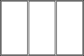     |
| TriplePanelHorizontal | Window with three panels. The configuration of the panels is horizontally. |      |

| Dietrich's _**IFC\_Ud22.docx**_ Version 22 |                                                                                                                                   |                                                                                                                                                                        |
| ------------------------------------------ | --------------------------------------------------------------------------------------------------------------------------------- | ---------------------------------------------------------------------------------------------------------------------------------------------------------------------- |
| TriplePanelBottom                          | Window with three panels. The configuration of two panels is vertically and the third one is horizontally at the bottom.          | 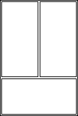     |
| TriplePanelTop                             | Window with three panels. The configuration of two panels is vertically and the third one is horizontally at the top.             |  |
| TriplePanelLeft                            | Window with three panels. The configuration of two panels is horizontally and the third one is vertically at the left hand side.  | 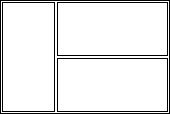     |
| TriplePanelRight                           | Window with three panels. The configuration of two panels is horizontally and the third one is vertically at the right hand side. | 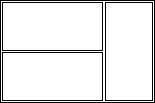     |
| UserDefined                                | user defined operation type                                                                                                       |                                                                                                                                                                        |
| NotDefined                                 |                                                                                                                                   |                                                                                                                                                                        |

NOTE

1. The way how each panel operates is defined at the _IfcWindowPanelProperties.OperationType_.
2. The reference from the window panel to the location of that panel in the window style configura- tion is handled by the _IfcWindowPanelProperties.PanelPosition_.
3. The figures are shown as elevations in the XZ plane of the local placement of the window, looking into the direction of the positive Y axis.
4. These figures are only shown as illustrations

Dietrich's _**IFC\_Ud22.docx**_ Version 22

TYPE IfcWindowStyleOperationEnum = ENUMERATION OF

( SINGLE\_PANEL, DOUBLE\_PANEL\_VERTICAL, DOUBLE\_PANEL\_HORIZONTAL, TRIPLE\_PANEL\_VERTICAL, TRIPLE\_PANEL\_BOTTOM, TRIPLE\_PANEL\_TOP, TRIPLE\_PANEL\_LEFT, TRIPLE\_PANEL\_RIGHT, TRIPLE\_PANEL\_HORIZONTAL, USERDEFINED,

NOTDEFINED); END\_TYPE;

#### Window - sash opening type and hinge side

Illustration IfcWindowPanelOperationEnum

| _Enumerator_         | _Description_                                              | _Figure_                                                                                  |
| -------------------- | ---------------------------------------------------------- | ----------------------------------------------------------------------------------------- |
| SideHungRightHand    | panel that opens to the right when viewed from the outside | 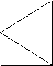                |
| SideHungLeftHand     | panel that opens to the left when viewed from the outside  | 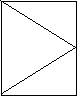                |
| TiltAndTurnRightHand | panel that opens to the right and is bottom hung           | 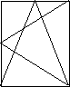 |
| TiltAndTurnLeftHand  | panel that opens to the left and is bottom hung            | 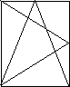       |

| Dietrich's _**IFC\_Ud22.docx**_ Version 22 |                                                           |                                                                                     |
| ------------------------------------------ | --------------------------------------------------------- | ----------------------------------------------------------------------------------- |
| TopHung                                    | panel is top hung                                         | 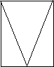           |
| BottomHung                                 | panel is bottom hung                                      |     |
| PivotHorizontal                            | panel is swinging horizontally (hinges are in the middle) |   |
| PivotVertical                              | panel is swinging vertically (hinges are in the middle)   |  |
| SlidingHorizontal                          | panel is sliding horizontally                             |    |
| SlidingVertical                            | panel is sliding vertically                               | 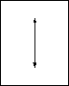      |
| RemovableCasement                          | panel is removable                                        | 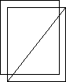          |
| FixedCasement                              | panel is fixed                                            |               |
| OtherOperation                             | user defined operation type                               |                                                                                     |
| NotDefined                                 |                                                           |                                                                                     |

TYPE IfcWindowPanelOperationEnum = ENUMERATION OF ( SIDEHUNGRIGHTHAND,

SIDEHUNGLEFTHAND, TILTANDTURNRIGHTHAND, TILTANDTURNLEFTHAND, TOPHUNG,

BOTTOMHUNG, PIVOTHORIZONTAL, PIVOTVERTICAL, SLIDINGHORIZONTAL, SLIDINGVERTICAL, REMOVABLECASEMENT, FIXEDCASEMENT, OTHEROPERATION, NOTDEFINED);

END\_TYPE;

#### Window definition hinge side

The opening direction of the window panels is given by the local placement of the _IfcWindow_. The positive y-axis determines the direction as shown in the figure.

NOTE

1. Figures are shown as viewed from the outside (in direction of the positive y-axis).
2. Figures (symbolic representation) depend on the national building code
3. These figures are only shown as illustrations

#### Window - sashes – position of a single sash

Illustration

| _Enumerator from IfcWindowStyleOperationEnum_ | _Use of enumerators from IfcWindowPanelPositionEnum_                                                                                                                                        | _Figure_     |
| --------------------------------------------- | ------------------------------------------------------------------------------------------------------------------------------------------------------------------------------------------- | ------------ |
| DoublePanelVertical                           | 
first IfcWindowPanelProperties with PanelPosition = LEFT

second IfcWindowPanelProperties with PanelPosition = RIGHT
                                                            | pJNpd7v3HFwD |
| DoublePanelHorizontal                         | 
first IfcWindowPanelProperties with PanelPosition = TOP

second IfcWindowPanelProperties with PanelPosition = BOTTOM
                                                            | 1WGH2oBkpiK0 |
| TriplePanelVertical                           | 
first IfcWindowPanelProperties with PanelPosition = LEFT

second IfcWindowPanelProperties with PanelPosition = MIDDLE third IfcWindowPanelProperties with PanelPosition = RIGHT
 | 79hgFdhJ9dfa |
| TriplePanelHorizontal                         | 
first IfcWindowPanelProperties with PanelPosition = TOP

second IfcWindowPanelProperties with PanelPosition = MIDDLE third IfcWindowPanelProperties with PanelPosition = BOTTOM
 | sZNfPPTr7S2e |

| Dietrich's _**IFC\_Ud22.docx**_ Version 22 |                                                                                                                                                                                                   |              |
| ------------------------------------------ | ------------------------------------------------------------------------------------------------------------------------------------------------------------------------------------------------- | ------------ |
| TriplePanelBottom                          | 
first IfcWindowPanelProperties with PanelPosition = LEFT

second IfcWindowPanelProperties with PanelPosition = RIGHT

third IfcWindowPanelProperties with PanelPosition = BOTTOM
 | 8dobxPCm2Hhq |
| TriplePanelTop                             | 
first IfcWindowPanelProperties with PanelPosition = TOP

second IfcWindowPanelProperties with PanelPosition = LEFT

third IfcWindowPanelProperties with PanelPosition = RIGHT
    | IWYOdo5c4Chh |
| TriplePanelLeft                            | 
first IfcWindowPanelProperties with PanelPosition = LEFT

second IfcWindowPanelProperties with PanelPosition = TOP

third IfcWindowPanelProperties with PanelPosition = BOTTOM
   | HUxs8dLJsYOp |
| TriplePanelRight                           | 
first IfcWindowPanelProperties with PanelPosition = TOP

second IfcWindowPanelProperties with PanelPosition = BOTTOM third IfcWindowPanelProperties with PanelPosition = RIGHT
        | 5crwlFUZpC1J |

NOTE

*
  *
    *
      1. The figures are shown as elevations in the XZ plane of the local placement of the window, looking into the direction of the positive Y axis.
      2. These figures are only shown as illustrations.

Dietrich's _**IFC\_Ud22.docx**_ Version 22

TYPE IfcWindowPanelPositionEnum = ENUMERATION OF

( LEFT, MIDDLE, RIGHT, BOTTOM, TOP,

NOTDEFINED); END\_TYPE;

### Doors

#### Door - sashes, opening type and hinge side

Illustration IfcDoorStyleOperationEnum

| _Enumerator_                 | _Description_                                                                                                                                                                                                                              | _Figure_     |
| ---------------------------- | ------------------------------------------------------------------------------------------------------------------------------------------------------------------------------------------------------------------------------------------ | ------------ |
| SINGLE\_SWING\_LEFT          | 
Door with one panel that opens (swings) to the left. The hinges are on the left side as viewed in the direction of the positive y-axis.

Note: Direction of swing (whether in or out) is determined at the <em>IfcDoor</em>.
   | F25TINXozE8s |
| SINGLE\_SWING\_RIGHT         | 
Door with one panel that opens (swings) to the right. The hinges are on the right side as viewed in the direction of the positive y-axis.

Note: Direction of swing (whether in or out) is determined at the <em>IfcDoor</em>.
 | 6ogfaKsyDT9k |
| DOUBLE\_DOOR\_ SINGLE\_SWING | 
Door with two panels, one opens (swings) to the left the other opens (swings) to the right.

Note: Direction of swing (whether in or out) is determined at the <em>IfcDoor</em>.
                                               | 8EMVfvDYL4ng |
| DOUBLE\_SWING\_LEFT          | 
Door with one panel that swings in both directions and to the left in the main trafic direction. Also called double acting door.

Note: Direction of main swing (whether in or out) is determined at the <em>IfcDoor</em>.
     | Hkqp90MSdyHC |

| Dietrich's _**IFC\_Ud22.docx**_ Version 22     |                                                                                                                                                                                                                                                                                                |              |
| ---------------------------------------------- | ---------------------------------------------------------------------------------------------------------------------------------------------------------------------------------------------------------------------------------------------------------------------------------------------- | ------------ |
| DOUBLE\_SWING\_RIGHT                           | 
Door with one panel that swings in both directions and to the right in the main trafic direction. Also called double acting door.

Note: Direction of main swing (whether in or out) is determined at the <em>IfcDoor</em>.
                                                        | Wqwowor8Zjfy |
| DOUBLE\_DOOR\_ DOUBLE\_SWING                   | 
Door with two panels, one swings in both directions and to the right in the main trafic direction the other swings also in both directions and to the left in the main trafic direction.

Note: Direction of main swing (whether in or out) is determined at the <em>IfcDoor</em>.
 | yPyMSMJIUfEc |
| DOUBLE\_DOOR\_ SINGLE\_SWING\_ OPPOSITE\_LEFT  | 
Door with two panels that both open to the left, one panel swings in one direction and the other panel swings in the opposite direction.

Note: Direction of main swing (whether in or out) is determined at the <em>IfcDoor</em>.
                                                 | qjaNnLKLEvHI |
| DOUBLE\_DOOR\_ SINGLE\_SWING\_ OPPOSITE\_RIGHT | 
Door with two panels that both open to the right, one panel swings in one direction and the other panel swings in the opposite direction.

Note: Direction of main swing (whether in or out) is determined at the <em>IfcDoor</em>.
                                                | 204ozmYfZVaY |
| SLIDING\_TO\_LEFT                              | Door with one panel that is sliding to the left.                                                                                                                                                                                                                                               | kTvDhtSGv1yg |
| SLIDING\_TO\_RIGHT                             | Door with one panel that is sliding to the right.                                                                                                                                                                                                                                              | TfuguKr36VlI |
| DOUBLE\_DOOR\_SLIDING                          | Door with two panels, one is sliding to the left the other is sliding to the right.                                                                                                                                                                                                            | S8JezK7tKkXb |
| FOLDING\_TO\_LEFT                              | Door with one panel that is folding to the left.                                                                                                                                                                                                                                               | J02XYkrlSsye |
| FOLDING\_TO\_RIGHT                             | Door with one panel that is folding to the right.                                                                                                                                                                                                                                              | Qec75oCtwYST |

| Dietrich's _**IFC\_Ud22.docx**_ Version 22 |                                                                                                                                                                                        |              |
| ------------------------------------------ | -------------------------------------------------------------------------------------------------------------------------------------------------------------------------------------- | ------------ |
| DOUBLE\_DOOR\_FOLDING                      | Door with two panels, one is folding to the left the other is folding to the right.                                                                                                    | 5elVHbOGMnGB |
| REVOLVING                                  | An entrance door consisting of four leaves set in a form of a cross and revolving around a central vertical axis (the four panels are described by a single _IfcDoor_ panel property). | Cq1SrgGiXEEi |
| ROLLINGUP                                  | 
Door that opens by rolling up.

Note: Whether it rolls up to the inside or outside is determined at the <em>IfcDoor</em>.
                                                  | sFDhcurCBegq |
| USERDEFINED                                | User defined operation type                                                                                                                                                            |              |
| NOTDEFINED                                 | A door with a not defined operation type is considered as a door with a lining, but no panels. It is thereby always open.                                                              | axMt53hT0ThF |

NOTE

1. Figures are shown in the ground view.
2. Figures (symbolic representation) depend on the national building code.
3. These figures are only shown as illustrations, the actual representation in the ground view might differ.
4. Open to the outside is declared as open into the direction of the positive y-axis, determined by the _ObjectPlacement_ at _IfcDoor_
5. The location of the panel relative to the wall thickness is defined by the _ObjectPlacement_ at

_IfcDoor_, and the _IfcDoorLiningProperties.LiningOffset_ parameter.

TYPE IfcDoorStyleOperationEnum = ENUMERATION OF ( SINGLE\_SWING\_LEFT, SINGLE\_SWING\_RIGHT, DOUBLE\_DOOR\_SINGLE\_SWING,

DOUBLE\_DOOR\_SINGLE\_SWING\_OPPOSITE\_LEFT, DOUBLE\_DOOR\_SINGLE\_SWING\_OPPOSITE\_RIGHT, DOUBLE\_SWING\_LEFT,

DOUBLE\_SWING\_RIGHT, DOUBLE\_DOOR\_DOUBLE\_SWING, SLIDING\_TO\_LEFT, SLIDING\_TO\_RIGHT,

DOUBLE\_DOOR\_SLIDING, FOLDING\_TO\_LEFT, FOLDING\_TO\_RIGHT, DOUBLE\_DOOR\_FOLDING, REVOLVING,

ROLLINGUP, USERDEFINED, NOTDEFINED);

END\_TYPE;

#### Door definition hinge side

The opening direction of the door panels is given by the local placement of the _IfcDoor_. The positive y- axis determines the direction as shown in the figure.

#### Door – sashes – opening type of a single sash

| Swinging     | H0U00Lcc6rfK |
| ------------ | ------------ |
| DoubleActing | 7hyKZbE367VM |

| Sliding     | XgjLWGq2TTUL |
| ----------- | ------------ |
| Folding     | oGZCR5mGPoW9 |
| Revolving   | Tm4WKkP4phNJ |
| Rollingup   | gNWxPES0jt94 |
| UserDefined |              |
| NotDefined  |              |

TYPE IfcDoorPanelOperationEnum = ENUMERATION OF ( SWINGING,

DOUBLE\_ACTING, SLIDING, FOLDING, REVOLVING, ROLLINGUP, USERDEFINED, NOTDEFINED);

END\_TYPE;

### Log

| Date       | Chapter                                                                        | Remark                                                                           |
| ---------- | ------------------------------------------------------------------------------ | -------------------------------------------------------------------------------- |
| 8.8.2016   | IFC Export                                                                     | Revised all chapters                                                             |
| 8.8.2016   | Several                                                                        | 3 insertions with flag 16.01                                                     |
| 26.10.2016 | IFC files in project management                                                | New chapter                                                                      |
| 15.01.2017 | Properties of windows and doors that can be interpreted by the import          | Addition tot he section: _Opening type and hinge side for window sash from IFC_. |
| 16.01.2017 | Opening type and hinge side for window sash from IFC: IfcWindowPanelProperties | New chapter: _Opening type and hinge side for window sash from IFC_.             |
| 16.01.2017 | Opening info                                                                   | Addition tot he section: _Opening type and hinge side for window sash from IFC_. |

| 16.01.2017 | Dialog box: Import IFC files                                                                                       | Additions with recognizion 17.02                                                |
| ---------- | ------------------------------------------------------------------------------------------------------------------ | ------------------------------------------------------------------------------- |
| 16.01.2017 | Assignment of storeys                                                                                              | Chapter moved here and added                                                    |
| 16.01.2017 | Setting the guideline - hinge side                                                                                 | guideline - hinge side for CON-referenz                                         |
| 16.01.2017 | 
Settings, types and Logic Blocks that can be assigned

Setting variables for the assigned Logic Blocks
 | Additions in the subchapters if multiple Assign Items apply                     |
| 16.01.2017 | IFC Viewer                                                                                                         | New link to FZK-viewer                                                          |
| 16.01.2017 | 
Free MOS für imported

components
                                                                      | New chapter                                                                     |
| 16.01.2017 | IFC4 (V18.01)                                                                                                      | New chapter                                                                     |
| 16.01.2017 | Rules for the IFC-Export of walls                                                                                  | Additions with recognizion gekennzeichnet                                       |
| 16.01.2017 | Several                                                                                                            | Various to niches, 18.01                                                        |
| 17.01.2017 | IFC Import of walls                                                                                                | Additions with recognizion 17.02 and 18.01                                      |
| 22.01.2019 | Project information from IFC file                                                                                  | New chapter                                                                     |
| 22.01.2019 | Conditions according to free attributes                                                                            | Addition after 2nd item                                                         |
| 22.01.2019 | Dialog box: 'Assign roof properties'                                                                               | Use of edge profiles adapted                                                    |
| 22.01.2019 | various                                                                                                            | Various entries marked V19.01                                                   |
| 15.01.2020 | IFC Import of walls                                                                                                | Section regarding bottom edge of wall adapted                                   |
| 15.01.2020 | Dialog box: 'Assign roof properties'                                                                               | (V19.02) Supplement to takeover underside of IFC roof area.                     |
| 15.01.2020 | Export of rooms                                                                                                    | (V19.02) Export of rooms                                                        |
| 15.01.2020 | IFC definitions of windows and doors                                                                               | IFC definitions for windows and doors added to the documentation                |
| 15.01.2020 | IFC import of windows, doors and niches                                                                            | New types for doors and windows (V20.01)                                        |
| 21.01.21   | 
IFC Export: default settings for export

Rules for the IFC-Export of structural objects
                | 
Material output via item number or order number

Identifier (20.03)
 |
| 21.01.21   | Setting variables for the assigned Logic Blocks                                                                    | Supplement conversion of values Identifier (20.03)                              |
| 21.01.21   | Assigning guideline types                                                                                          | Enter first sentence as a note: Better regulate HRB types via conditions        |
| 21.01.21   | Conditions according to free attributes                                                                            | Propertyset are also read from windows and doors,                               |
| 20.12.21   | Surface objects in IFC Import                                                                                      | New chapter                                                                     |
| 20.12.21   | IFC Import: Incomplete objects, log files                                                                          | New chapter                                                                     |
| 20.12.21   | IFC Import: Building parts without geometry description                                                            | New chapter                                                                     |
