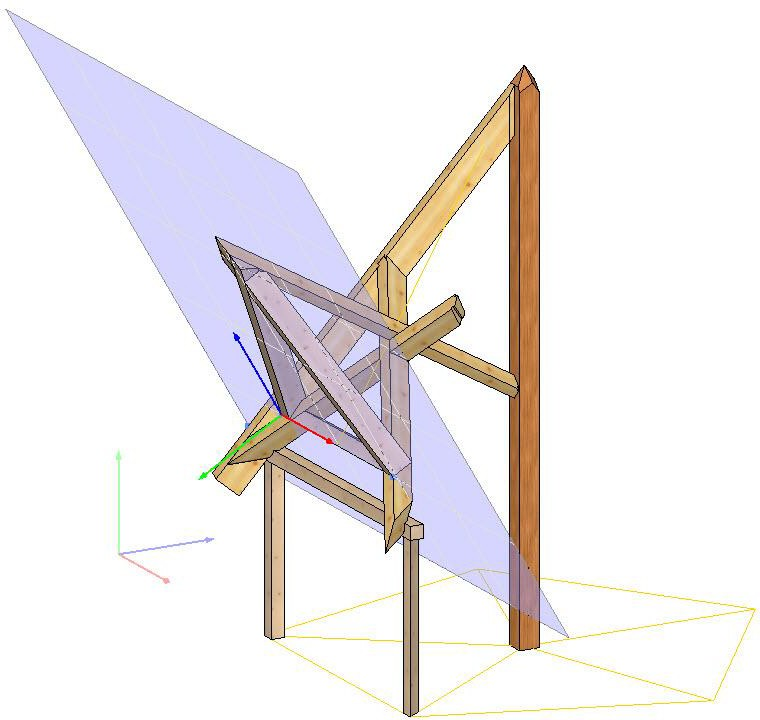

---
description: Your page description here
---

## D-CAM Work Planes: Introduction to Working With Work Planes

### 2.0/ 21st February 2019

## Content

1. [Introduction](#introduction)
2. [Work Planes - An Introduction](#work-planes---an-introduction)
   - [Definition and Attributes](#definition-and-attributes)
   - [What is a work plane? Definition of the first work plane](#what-is-a-work-plane-definition-of-the-first-work-plane)
   - [Definition of work planes in general](#definition-of-work-planes-in-general)
   - [Selection of work planes](#selection-of-work-planes)
   - [Positioning work planes](#positioning-work-planes)

### What is a Work Plane? Definition of the First Work Plane

Work planes are surfaces that define a reference for geometry. They are essential for alignment and positioning.

## Selection of Work Planes

Considerations for selecting a work plane include the following:
- Stability of the reference.
- Alignment with the overall design.

> **D-CAM Work Planes Introduction to working With work planes**
